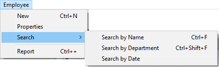

4D vous permet de créer des barres de menus et des menus pour vos applications 4D. Etant donné que les menus sont une fonctionnalité standard de toute application, leur présence dans votre base facilite son utilisation.

Une **barre de menus** est un groupe de menus qui peuvent être affichés dans le même écran. Chaque **menu** d’une barre de menus peut posséder plusieurs commandes dont certaines peuvent faire appel à des sous-menus en cascade (on parle alors de sous-menus hiérarchiques). Lorsque l’utilisateur choisit une commande de menu ou de sous-menu, il appelle une méthode projet ou une action standard qui réalise une opération.

Vous pouvez disposer de différentes barres de menus dans la même application. Par exemple, vous pouvez utiliser une barre de menus pour les opérations standard de votre base de données et une autre qui n’est active que pour la réalisation d’états. Une barre de menus peut contenir des commandes destinées à la saisie d’enregistrements. La barre de menus qui apparaît avec le formulaire de saisie peut contenir le même menu, mais ses commandes peuvent être désactivées car inutiles pour la saisie dans le formulaire.

Vous pouvez utiliser le même menu dans plusieurs barres de menus et menus, ou ne pas l’attacher et le gérer uniquement par programmation (on parle dans ce cas de menu indépendant).

Lorsque vous créez des menus, il est utile de garder à l’esprit les deux règles suivantes :

- N’utilisez les menus que pour des tâches qui leurs sont adaptées : Les commandes de menus doivent réaliser des tâches telles que l’ajout d’un enregistrement, les recherches ou les impressions.
- Groupez les commandes de menus par fonctions : l’utilisateur doit pouvoir être capable de s’orienter dans un ordre logique de menus. Par exemple, toutes les commandes de menu qui permettent de naviguer dans la base doivent être placées dans le même menu.

Pour créer des menus et des barres de menus, vous pouvez utiliser soit :

- l’éditeur de menus,
- les commandes du langage,
- un mélange des deux.

## Éditeur de menus

L’éditeur de menus est accessible via le bouton **Menus** de la Boîte à outils.

Les barres de menus et les menus sont affichés sous forme de deux éléments d’une même liste hiérarchique, dans la partie gauche de la fenêtre. Chaque menu peut être attaché à une barre de menus ou à un autre menu. Dans le deuxième cas, le menu devient un sous-menu.

4D affecte des numéros de barre de menus séquentiellement -- Menu Bar #1 apparait en premier. Vous pouvez renommer des barres de menu mais vous ne pouvez pas modifier leur numéro. Ces derniers sont utilisés par les commandes du langage.
