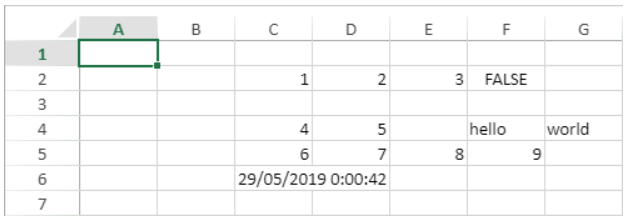

<!-- REF #_method_.VP Get values.Syntax -->

**VP Get values** ( *rangeObj* : Object ) : Collection<!-- END REF -->

<!-- REF #_method_.VP Get values.Params -->

| Paramètres | Type       |                             | Description           |                  |
| ---------- | ---------- | --------------------------- | --------------------- | ---------------- |
| rangeObj   | Object     | ->                          | Objet plage           |                  |
| Résultat   | Collection | <- | Collection de valeurs | <!-- END REF --> |

## Description

La commande `VP Get values` <!-- REF #_method_.VP Get values.Summary --> récupère les valeurs du *rangeObj* désigné<!-- END REF -->.

Dans *rangeObj*, passez une plage dont vous souhaitez récupérer les valeurs. Si *rangeObj* comprend plusieurs plages, seule la première plage est utilisée.

La collection retournée par `VP Get values` contient une collection bidimensionnelle:

- Chaque élément de la collection de premier niveau représente une ligne et contient une sous-collection de valeurs
- Chaque sous-collection contient des valeurs des cellule de la ligne. Les valeurs peuvent être de type entier long, réel, booléen, texte, objet ou null. Si une valeur est de type date ou heure, elle est retournée en un objet dont les propriétés sont les suivantes :

| Propriété | Type | Description                                                               |
| --------- | ---- | ------------------------------------------------------------------------- |
| value     | Date | Valeur dans la cellule (sauf heure)                    |
| time      | Real | Valeur heure (en secondes) si la valeur est du type js |

Les dates ou les heures sont considérées comme un datetime et sont complétées comme suit :

- valeur de type heure - la partie date est complétée comme étant le 30 décembre 1899
- valeur de type date - la partie heure est complétée comme étant minuit (00:00:00:000)

## Exemple

Vous souhaitez lire les valeurs allant de C4 à G6 :



```4d
$result:=VP Get values(VP Cells("ViewProArea";2;3;5;3))
// $result[0]=[4,5,null,hello,world]
// $result[1]=[6,7,8,9,null]
// $result[2]=[null,{time:42,value:2019-05-29T00:00:00.000Z},null,null,null]
```

## Voir également

[VP Get formulas](vp-get-formulas.md)<br/>
[VP Get value](vp-get-value.md)<br/>
[VP SET FORMULAS](vp-set-formulas.md)<br/>
[VP SET VALUES](vp-set-values.md)
