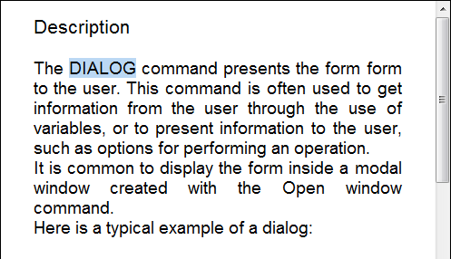
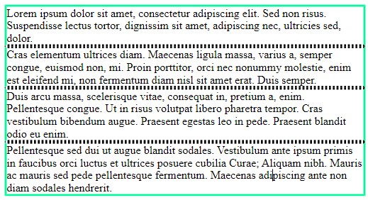

<!--REF #_command_.WP SET ATTRIBUTES.Syntax-->**WP SET ATTRIBUTES** ( *targetObj* ; *attribName* ; *attribValue* {; *attribName2* ; *attribValue2* ; ... ; *attribNameN* ; *attribValueN*} )<br/>**WP SET ATTRIBUTES** ( *targetObj* ; *attribObj* )<!-- END REF-->

<!--REF #_command_.WP SET ATTRIBUTES.Params-->

| Paramètres  | Type                                            |                             | Description                                                                       |
| ----------- | ----------------------------------------------- | --------------------------- | --------------------------------------------------------------------------------- |
| targetObj   | Object                                          | &#8594; | Range or element or 4D Write Pro document                                         |
| attribName  | Text                                            | &#8594; | Nom de l'attribut à définir                                                       |
| attribValue | Text, Number, Object, Collection, Picture, Date | &#8594; | Nouvelle valeur d'attribut                                                        |
| attribObj   | Object                                          | &#8594; | Objet contenant les noms des attributs et leurs valeurs correspondantes à définir |

<!-- END REF-->

## Description

La commande **WP SET ATTRIBUTES** <!--REF #_command_.WP SET ATTRIBUTES.Summary-->vous permet de définir la valeur d'un attribut de plage, élément ou document.<!-- END REF--> Cette commande vous donne accès à tout type d'attribut interne 4D Write Pro : caractère, paragraphe, document, tableau ou image.

Dans *targetObj*, vous pouvez passer :

- a range, or
- un élément (en-tête / pied de page / corps / tableau / ligne / paragraphe / image ancrée ou en ligne / section / sous-section / feuille de style), ou
- a 4D Write Pro document

Vous pouvez spécifier les attributs à définir pour *targetObj* d'une des deux façons :

- Utilisez les paramètres *attribName* et *attribValue*. Dans *attribName*, passez le nom de l'attribut à définir pour la cible et dans *attribValue*, passez la nouvelle valeur à définir. Vous pouvez passer autant de paires *attribName*/*attribValue* que vous le souhaitez en un seul appel.

- Utilisez le paramètre *attribObj* pour passer un seul objet contenant les noms d'attributs et leurs valeurs correspondantes en tant que propriétés d'objet.

Pour une liste complète des attributs à passer, ainsi que leur portée et leurs valeurs respectives, veuillez vous référer à la section *Attributs 4D Write Pro* .

## Exemple 1

Dans cette zone 4D Write Pro, vous avez sélectionné un mot :



Si vous exécutez le code suivant :

```4d
 $range:=WP Get selection(*;"WParea") //récupérer la plage sélectionnée
 
  // fixer le décalage d'ombre en pt pour la sélection
 WP SET ATTRIBUTES($range;wk text shadow offset;1)
  //définir la marge intérieure du paragraphe
 WP SET ATTRIBUTES($range;wk padding;1)
  //définir une bordure de 10 pt
 WP SET ATTRIBUTES($range;wk border style;wk solid;wk border width;10)
  //définir les couleurs de bordure
 WP SET ATTRIBUTES($range;wk border color;"blue";wk border color bottom;"#00FA9A";wk border color right;"#00FA9A")
```

Vous obtenez le résultat suivant:


## Exemple 2

Cet exemple illustre l'utilisation de constantes wk inside et wk externe:

```4d
 $wpRange:=WP Get selection(writeProdoc)
 WP SET ATTRIBUTES($wpRange;wk border style+wk inside;wk dotted)
 WP SET ATTRIBUTES($wpRange;wk border style+wk outside;wk solid)
 WP SET ATTRIBUTES($wpRange;wk border color+wk outside;"#00FA9A")
```

En supposant que tous les contenus ont été sélectionnés, le résultat est :



## Exemple 3

Vous souhaitez définir une image de fond pour le document :

```4d
 var WParea : Object
 WParea:=WP New
 
 READ PICTURE FILE("C:\\Pictures\\boats.jpg";$picture)
 
 WP SET ATTRIBUTES(WParea;wk background image;$picture)
```

Le résultat est:


Vous souhaitez définir une image de fond qui couvre toute la zone imprimable. Tous les attributs sont passés en utilisant un seul objet :

```4d
 var WParea : Object
 WParea:=WP New
 
 READ PICTURE FILE("C:\\Pictures\\boats.jpg";$picture)
 
 $myAttributes:=New object()
 $myAttributes[wk background image]:=$picture
 $myAttributes[wk background clip]:=wk paper box
 $myAttributes[wk background origin]:=wk paper box

 WP SET ATTRIBUTES(WParea;$myAttributes)
```

Le résultat est:


:::note

La valeur wk paper box peut être appliquée uniquement aux documents ou aux sections.

:::

## Exemple 4

Vous souhaitez placer des tabulations à intervalles variables et désigner un caractère comme caractère principal de la dernière tabulation :

```4d
 $tab1:=New object()
 $tab1[wk type]:=wk left
 $tab1[wk offset]:="3cm"
 $tab1[wk leading]:=""
 
 $tab2:=New object()
 $tab2[wk type]:=wk center
 $tab2[wk offset]:="8cm"
 $tab2[wk leading]:=""
 
 $tab3:=New object()
 $tab3[wk type]:=wk right
 $tab3[wk offset]:="12cm"
 $tab3[wk leading]:="."
 
 $_tabs:=New collection($tab1;$tab2;$tab3)
 WP SET ATTRIBUTES(wpArea;wk tabs;$_tabs)
```

Le résultat est:


## Voir également

*4D Write Pro Attributes*\
[WP GET ATTRIBUTES](../commands/wp-get-attributes.md)\
[WP RESET ATTRIBUTES](../commands/wp-reset-attributes.md)