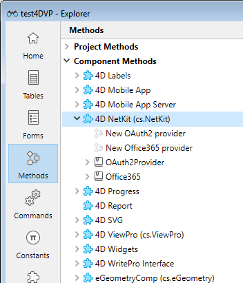
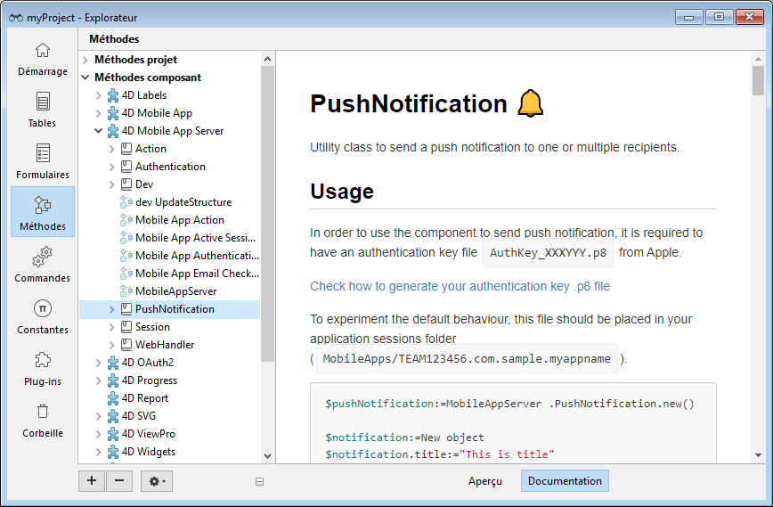

Un composant 4D est un ensemble de code et de formulaires 4D représentant une ou plusieurs fonctionnalités que vous pouvez installer et utiliser dans vos projets. Par exemple, le [composant 4D SVG](https://doc.4d.com/4Dv19R3/4D/19-R3/4D-SVG-Component.100-5681501.en.html) ajoute des commandes avancées et un moteur de rendu intégré qui peut être utilisé pour afficher des fichiers SVG.

## Où se trouvent les composants ?

Plusieurs composants sont [préinstallés dans l'environnement de développement 4D](Extensions/overview.md), mais de nombreux composants 4D de la communauté 4D [sont disponibles sur GitHub](https://github.com/search?q=4d-component&type=Repositories). De plus, vous pouvez [développer vos propres composants 4D](Extensions/develop-components.md).

## Installation des composants

To install a component, you simply need to copy the component package folder into the [`Components` folder of the project](Project/architecture.md). Vous pouvez utiliser des alias ou des raccourcis.

Un projet hôte fonctionnant en mode interprété peut utiliser des composants interprétés ou compilés. Un projet hôte fonctionnant en mode compilé ne peut pas utiliser de composants interprétés. Dans ce cas, seuls les composants compilés peuvent être utilisés.

:::note

Interpreted component package folder name must be suffixed ".4dbase".

:::

## Utilisation des composants

Le code exposé des composants (méthodes et fonctions) ainsi que les formulaires peuvent être utilisés comme éléments standard dans votre développement 4D.

Lorsqu'un composant installé contient des méthodes, des classes et des fonctions, celles-ci apparaissent dans le thème **Méthodes Composant** de la page Méthodes de l'explorateur :

:::note

Si le composant est compilé, son [espace de nommage](../Extensions/develop-components.md#declaring-the-component-namespace) est écrit entre parenthèses après son nom. Utilisez ce namespace pour accéder aux fonctions du composant.

:::

Vous pouvez sélectionner une [méthode projet](methods.md) ou [classe](classes.md) de composant et cliquer sur le bouton **Documentation** de l'Explorateur pour obtenir des informations à son sujet, [le cas échéant](Project/documentation.md).

