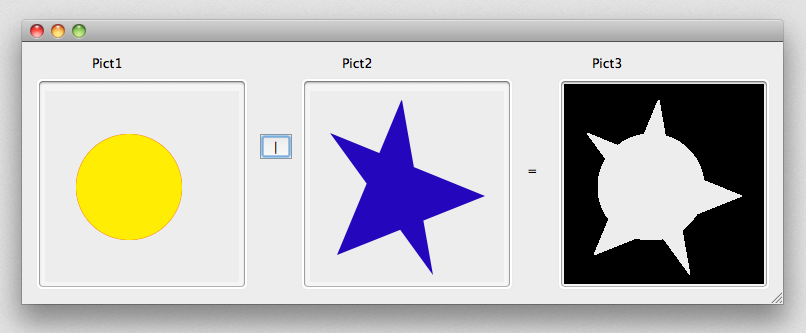
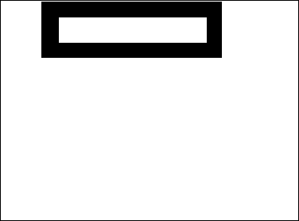

Un champ, une variable ou expression de type Picture peut être toute image Windows ou Macintosh. En règle générale, cela inclut n'importe quelle image qui peut être copiée dans le Presse-papiers ou lue à partir du disque à l'aide des commandes 4D telles que `READ PICTURE FILE`.

4D utilise des API natives pour encoder (écrire) et décoder (lire) les champs et les variables des images sous Windows et macOS. Ces implémentations donnent accès à de nombreux formats natifs, dont le format RAW, couramment utilisé par les appareils photo numériques.

*   sous Windows, 4D utilise WIC (Windows Imaging Component).
*   sous macOS, 4D utilise ImageIO.

WIC et ImageIO permettent l’utilisation de métadonnées dans les images. Deux commandes, `SET PICTURE METADATA` et `GET PICTURE METADATA`, vous permettent d'en bénéficier dans vos développements.

## Identifiants de codecs d'images

4D prend en charge de façon native un large ensemble de [formats d'images](FormEditor/pictures.md#formats-natifs-pris-en-charge), tels que .jpeg, .png, ou .svg.

Les formats d'images reconnus par 4D sont retournés par la commande `PICTURE CODEC LIST` sous forme d'identifiants de codecs d'images.  Ces identifiants peuvent être :

*   une extension (par exemple “.gif”)
*   Un type Mime (par exemple “image/jpg”)

La forme utilisée pour chaque format dépend du mode de déclaration du codec au niveau du système d’exploitation. Notez que les listes de codecs disponibles pour la lecture et pour l'écriture peuvent différer, étant donné que les codecs d'encodage peuvent nécessiter des licences spécifiques.

La plupart des [commandes 4D de gestion d'images](https://doc.4d.com/4Dv18/4D/18/Pictures.201-4504337.en.html) peuvent recevoir un Codec ID en paramètre. Il est donc impératif d'utiliser l'identifiant système retourné par la commande `PICTURE CODEC LIST`. Les formats d'images reconnus par 4D sont retournés par la commande `PICTURE CODEC LIST`.


## Opérateurs sur les images

| Opération                 | Syntaxe              | Retourne | Action                                                                                                                                                                              |
| ------------------------- | -------------------- | -------- | ----------------------------------------------------------------------------------------------------------------------------------------------------------------------------------- |
| Concaténation horizontale | Image1 + Image2      | Picture  | Place Image2 à la droite d'Image1                                                                                                                                                   |
| Concaténation verticale   | Image1 / Image2      | Picture  | Place Image2 au-dessous d'Image1                                                                                                                                                    |
| Superposition exclusive   | Image1 & Image2      | Picture  | Superpose Image2 à Image1 (Image2 est au premier plan). Donne le même résultat que `COMBINE PICTURES(pict3;pict1;Superposition;pict2)`                                              |
| Superposition inclusive   | Image1               | Picture  | Image    | Superpose Image2 à Image1 et retourne le masque résultant si les deux images sont de même taille. Donne le même résultat que `$equal:=Equal pictures(Pict1;Pict2;Pict3)` |
| Déplacement horizontal    | Image + Nombre       | Picture  | Déplace l'image horizontalement d'un nombre de pixels égal à Nombre                                                                                                                 |
| Déplacement vertical      | Image / Nombre       | Picture  | Déplace l'image verticalement d'un nombre de pixels égal à Nombre                                                                                                                   |
| Redimensionnement         | Image * Nombre       | Picture  | Redimensionne l'image au pourcentage Nombre                                                                                                                                         |
| Extension horizontale     | Image *+ Nombre      | Picture  | Redimensionne l'image horizontalement au pourcentage Nombre                                                                                                                         |
| Extension verticale       | Image *&#124; Nombre | Picture  | Image    | Redimensionne l'image verticalement au pourcentage Nombre                                                                                                                |
| Contient mot-clé          | Image % Chaîne       | Boolean  | Renvoie vrai si la chaîne est associée à l'image stockée dans l'expression image. Voir `GET PICTURE KEYWORDS`                                                                     |


**Notes :**

- A noter que pour que l'opérateur | puisse être utilisé, Image1 et Image2 doivent être strictement de la même dimension. Si les deux images sont de taille différente, l’opération Image1 | Image2 produit une image vide.
- La commande `COMBINE PICTURES` permet d'effectuer des superpositions en conservant les caractéristiques de chaque image source dans l'image résultante.
- Des opération supplémentaires peuvent être réalisées sur des images à l'aide de la commande `TRANSFORM PICTURE`.
- Il n'existe pas d'opérateurs de comparaison pour les images; cependant 4D propose la commande `Equal picture` pour comparer deux images.


### Exemples

Concaténation horizontale
```4d
 cercle+rectangle // Place le rectangle à droite du cercle
rectangle+cercle // Place le cercle à droite du rectangle
```
 

Concaténation verticale
```4d
 circle/rectangle //Place the rectangle under the circle
 rectangle/circle //Place the circle under the rectangle
```
 

Superposition exclusive
```4d
Pict3:=Pict1 & Pict2 // Superposer Pict2 à Pict1
```


Superposition inclusive
```4d
Pict3:=Pict1|Pict2 // Récupérer le masque résultant de la superposition de deux images de même taille
```


Déplacement horizontal
```4d
rectangle+50 // Déplace le rectangle 50 pixels vers la droite
rectangle-50 // Déplace le rectangle 50 pixels vers la gauche
```


Déplacement vertical

```4d
rectangle/50 // Déplace le rectangle 50 pixels vers le bas
rectangle/-20 // Déplace le rectangle 20 pixels vers le haut
```


Redimensionnement

```4d
rectangle*1.5 // Augmente la taille du rectangle de 50%
 rectangle*0.5 // Réduit la taille du rectangle de 50%
```


Extension horizontale

```4d
cercle*+3 // Multiplie par 3 la largeur du cercle
 cercle*+0,25 // La largeur du cercle est réduite à un quart de sa taille originale
```


Extension verticale

```4d
cercle*|2 // Double la hauteur du cercle
 cercle*|0.25 // La hauteur du cercle est réduite à un quart de sa taille originale
```


