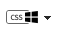
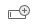
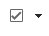
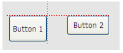
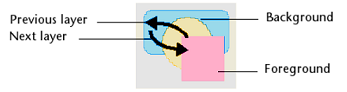
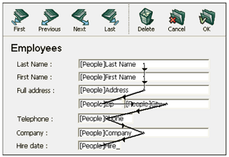
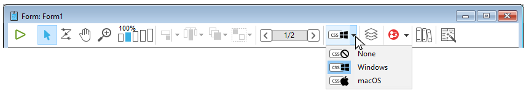
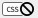
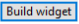
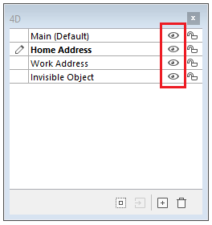

4D propose un éditeur de formulaires très complet qui vous permet de modifier votre formulaire jusqu’à ce que vous ayez atteint le résultat escompté. Dans l’éditeur de formulaires, vous pouvez créer et supprimer des objets, manipuler directement des objets et définir les propriétés des objets et des formulaires.

## Interface

L’éditeur de formulaires affiche chaque formulaire JSON ouvert dans sa propre fenêtre, dotée d’une barre d’outils et d’une barre d’objets. Vous pouvez ouvrir plusieurs formulaires en même temps.

### Options d'affichage

Vous pouvez afficher ou masquer plusieurs éléments de l'interface dans la page courante du formulaire :

- **Formulaire hérité** : Objets du formulaire hérité (s'il y a un [formulaire hérité](forms.md#inherited-forms)).
- **Page 0**: Objets de [la page 0](forms.md#form-pages). Cette option vous permet de mieux visualiser et distinguer les objets de la page courante et ceux de la page 0.
- **Papier** : Contours de la page d'impression, qui sont affichés sous forme de filets grisés. Cet élément ne peut être affiché que par défaut dans les formulaires de type ["pour impression"](properties_FormProperties.md#form-type).
- **Règle** : Règles de la fenêtre de l’éditeur de formulaire.
- **Taquets** : Lignes de contrôle de sortie et taquets associés qui indiquent les limites des différentes zones du formulaire. Cet élément ne peut être affiché que par défaut dans les formulaires de type [listes](properties_FormProperties.md#form-type).
- **Libellés des taquets** : Libellés des taquets, disponibles uniquement lorsque les lignes de contrôle de sortie sont affichées. Cet élément ne peut être affiché que par défaut dans les formulaires de type [listes](properties_FormProperties.md#form-type).
- **Limites** : Limites du formulaire. Lorsque cette option est sélectionnée, le formulaire est affiché dans l’éditeur tel qu’il apparaîtra en mode Application. Cette possibilité est particulièrement intéressante pour ajuster un formulaire sans devoir tester le mode Application pour visualiser le résultat.

> Les paramètres [**Taille basée sur**](properties_FormSize.md#size-based-on), [**Hor margin**](properties_FormSize.md#hor-margin) et [**Vert margin**](properties_FormSize.md#vert-margin) des propriétés du formulaire affectent les limites du formulaire. Les limites du formulaire sont calculées en fonction des objets qui le composent. Lorsque vous déplacez ou agrandissez un objet placé près de la limite d’un formulaire, le rectangle de délimitation est modifié en conséquence.

#### Affichage par défaut

Lorsqu'un formulaire est ouvert dans l'éditeur, les éléments de l'interface sont affichés ou masqués par défaut, selon :

- les options **Affichage par défaut à la création** définies dans les Préférences - les options non cochées ne peuvent pas être affichées par défaut.
- le [type de formulaire](properties_FormProperties.md#form-type) courant :
  - Les marqueurs et les libellés de marqueurs sont toujours affichés par défaut pour les formulaires liste
  - Le papier est affiché par défaut pour les formulaires impression.

#### Afficher/Masquer les éléments

Vous pouvez afficher ou masquer des éléments à tout moment dans la fenêtre courante de l'éditeur de formulaires en sélectionnant **Afficher** dans le menu **Formulaire** ou le menu contextuel de l'éditeur de formulaires :


### Règles

Les règles situées sur le côté et en bas de la fenêtre ont pour but de vous aider à placer les objets dans le formulaire. Ils peuvent être [affichés ou masqués](#display-options).

Sélectionnez **Définir l'unité...** dans le menu **Formulaire** pour changer l'unité de mesure afin que le formulaire affiche des pouces, des centimètres ou des pixels.

### Toolbar (Barre d’outils)

La barre d’outils de l’éditeur de formulaires propose un ensemble d’outils destinés à manipuler et modifier le formulaire. Chaque fenêtre dispose de sa propre barre d’outils.


La barre d’outils comporte les éléments suivants :

| Icône                                            | Nom                                                       | Description                                                                                                                                                                                                                                                                                                                                                                                                 |
| ------------------------------------------------ | --------------------------------------------------------- | ----------------------------------------------------------------------------------------------------------------------------------------------------------------------------------------------------------------------------------------------------------------------------------------------------------------------------------------------------------------------------------------------------------- |
|          | Exécuter le formulaire                                    | Permet de tester l’exécution du formulaire. Lorsque vous cliquez sur ce bouton, 4D ouvre une nouvelle fenêtre et affiche le formulaire dans son contexte (liste d’enregistrements pour un formulaire liste et enregistrement courant en page pour un formulaire détaillé). Le formulaire est exécuté dans le process principal.                                                                             |
|        | [Flèche de sélection](#selecting-objects)                 | Permet de sélectionner, déplacer et redimensionner les objets du formulaire.<p>**Note** : Lorsqu'un objet de type Texte ou Zone de Groupe est sélectionné, appuyez sur la touche **Entrée** pour passer en mode édition.</p>                                                                                                                                                                                                                                                                                                       |
|           | [Ordre de saisie](#data-entry-order)                      | Passe en mode “Ordre de saisie”, dans lequel il est possible de visualiser et de modifier l’ordre de saisie courant du formulaire. A noter que vous pouvez également visualiser l’ordre de saisie courant tout en travaillant dans le formulaire.                                                                                                                                                           |
|           | [Déplacement](#moving-objects)                            | Passe en mode “Déplacement”, dans lequel il est possible d’atteindre rapidement n’importe quelle partie du formulaire en le faisant directement glisser dans la fenêtre. Le curseur prend la forme d’une main. Ce mode de navigation est particulièrement utile en cas de zoom dans le formulaire.                                                                                                          |
|             | [Zoom](#zoom)                                             | Permet de modifier l’échelle d’affichage du formulaire (100% par défaut). Vous pouvez passer en mode “Zoom” en cliquant sur le bouton loupe ou en cliquant directement sur la barre correspondant à l’échelle désirée. Cette fonction est détaillée dans le paragraphe précédent.                                                                                                                           |
|        | [Alignement](#aligning-objects)                           | Ce bouton est associé à un menu permettant d’aligner les objets dans le formulaire. Il est activé (ou non) en fonction des objets sélectionnés.<br/>Désactivé si la position d'un objet sélectionné est verrouillée par une propriété CSS                                                                                                                                                             |
|     | [Répartition](#distributing-objects)                      | Ce bouton est associé à un menu permettant de répartir les objets dans le formulaire. Il est activé (ou non) en fonction des objets sélectionnés.<br/>Désactivé si la position d'un objet sélectionné est verrouillée par une propriété CSS                                                                                                                                                           |
|            | [Niveau](#layering-objects)                               | Ce bouton est associé à un menu permettant de répartir les objets dans le formulaire. Il est activé (ou non) en fonction des objets sélectionnés.                                                                                                                                                                                                                                                           |
|            | [Groupement/Dégroupement](#grouping-objects)              | Ce bouton est associé à un menu permettant de grouper et dégrouper la sélection d’objets du formulaire. Il est activé (ou non) en fonction des objets sélectionnés.                                                                                                                                                                                                                                         |
|    | [Affichage et gestion des pages](forms.html#form-pages)   | Cette zone permet de passer d’une page du formulaire à une autre et d’ajouter des pages. Pour naviguer parmi les pages du formulaire, cliquez sur les boutons fléchés ou cliquez sur la zone centrale et choisissez la page à afficher dans le menu qui apparaît. Si vous cliquez sur le bouton fléché de droite alors que vous êtes sur la dernière page du formulaire, 4D vous permet d’ajouter une page. |
|   | [Aperçu CSS](#css-preview)                                | Ce bouton permet de sélectionner le mode CSS à utiliser.                                                                                                                                                                                                                                                                                                                                                    |
|            | [Gestion des vues](#views)                                | Ce bouton affiche ou masque alternativement la palette des vues. Cette fonction est détaillée dans la section Utiliser les vues d'objet.                                                                                                                                                                                                                                                                    |
|         | [Affichage des badges](#shields)                          | Chaque clic sur ce bouton provoque l’affichage successif de tous les types de badges de formulaire. Le bouton est également associé à un menu permettant de sélectionner directement le type de badge à afficher.                                                                                                                                                                                           |
|          | [Bibliothèque d'objets préconfigurés](objectLibrary.html) | Ce bouton affiche la fenêtre de la bibiliothèque d'objets préconfigurée, proposant de nombreux objets auxquels des propriétés par défaut ont déjà été appliquées.                                                                                                                                                                                                                                           |
|  | [Création de list box](#list-box-builder)                 | Ce bouton crée de nouvelles list box de type entity selection.                                                                                                                                                                                                                                                                                                                                              |
|     | [Insérer des champs](#insert-fields)                      | Ce bouton insère tous les champs (à l'exception des champs de type objet et blob) de la table de formulaire dans le formulaire, avec leurs libellés et en respectant les normes d'interface.                                                                                                                                                                                                                |


### Barre d'objets

La barre d'objets contient tous les objets actifs et inactifs qui peuvent être utilisés dans les formulaires 4D. Certains objets sont regroupés par thèmes. Chaque thème comprend plusieurs alternatives parmi lesquelles vous pouvez choisir. Lorsque la barre d'objets a le focus, vous pouvez sélectionner les boutons en utilisant les touches du clavier. Le tableau suivant décrit les groupes d'objets disponibles et leur touche de raccourci associée.

| Bouton                                     | Groupe                                                                                                                                                                                                                                                               | Touche |
| ------------------------------------------ | -------------------------------------------------------------------------------------------------------------------------------------------------------------------------------------------------------------------------------------------------------------------- |:------:|
|       | [Texte](FormObjects/text.md) / [Zone de groupe](FormObjects/groupBox.md)                                                                                                                                                                                             |   T    |
|      | [Zone de saisie](FormObjects/input_overview.md)                                                                                                                                                                                                                      |   F    |
|    | [Liste hiérarchique](FormObjects/list_overview.md) / [List box](FormObjects/listbox_overview.md)                                                                                                                                                                     |   L    |
|      | [Combo Box](FormObjects/comboBox_overview.md) / [Liste déroulante](FormObjects/dropdownList_Overview.md) / [pop up menu image](FormObjects/picturePopupMenu_overview.md)                                                                                             |   P    |
|     | [Bouton](FormObjects/button_overview.md) / [Bouton Image](FormObjects/pictureButton_overview.md) / [Grille de boutons](FormObjects/buttonGrid_overview.md)                                                                                                           |   B    |
|      | [Bouton radio](FormObjects/radio_overview.md)                                                                                                                                                                                                                        |   R    |
|   | [Case à cocher](FormObjects/checkbox_overview.md)                                                                                                                                                                                                                    |   C    |
|  | [Indicateur de progression](FormObjects/progressIndicator.md) / [Règle](FormObjects/ruler.md) / [Stepper](FormObjects/stepper.md) / [Spinner](FormObjects/spinner.md)                                                                                                |   I    |
|  | [Rectangle](FormObjects/shapes_overview.md#rectangle) / [Ligne](FormObjects/shapes_overview.md#line) / [Ovale](FormObjects/shapes_overview.md#oval)                                                                                                                  |   S    |
|   | [Séparateur](FormObjects/splitters.md) / [Onglet](FormObjects/tabControl.md)                                                                                                                                                                                         |   D    |
|     | [Zone de plug-in](FormObjects/pluginArea_overview.md) / [Sous-formulaire](FormObjects/subform_overview.md) / [Zone Web](FormObjects/webArea_overview.md) / [4D Write Pro](FormObjects/writeProArea_overview.md) / [4D View Pro](FormObjects/viewProArea_overview.md) |   X    |

Pour dessiner un type d'objet, sélectionnez le bouton correspondant, puis tracez l'objet dans le formulaire. Après avoir créé un objet, vous pouvez modifier son type en utilisant la Liste des propriétés. Maintenez la touche **Maj** enfoncée pendant que vous dessinez pour contraindre l'objet à une forme régulière. Les lignes sont contraintes à l'horizontale, à 45°, ou à la verticale, les rectangles sont contraints à des carrés, et les ovales sont contraints à des cercles.

La variante courante du thème est l'objet qui sera inséré dans le formulaire. Lorsque vous cliquez sur le côté droit d'un bouton, vous accédez au menu de variantes :


Vous pouvez cliquer deux fois sur le bouton pour qu'il reste sélectionné même après avoir tracé un objet dans le formulaire (sélection continue). Cette fonction facilite la création successive de plusieurs objets du même type. Pour annuler une sélection continue, cliquez sur un autre objet ou outil.

### Liste de propriétés

Les formulaires et les objets de formulaire ont des propriétés qui contrôlent l'accès, l'apparence et le comportement du formulaire ou de l'objet lorsqu'il est utilisé. Les propriétés du formulaire comprennent, par exemple, le nom du formulaire, sa barre de menu et sa taille. Les propriétés de l'objet comprennent, par exemple, le nom de l'objet, ses dimensions, sa couleur de fond et sa police.

Vous pouvez afficher et modifier les propriétés du formulaire et des objets en utilisant la liste des propriétés. Elle affiche les propriétés du formulaire ou des objets en fonction de ce que vous sélectionnez dans la fenêtre de l'éditeur.

Pour afficher/masquer la liste des propriétés, choisissez **Liste des propriétés** dans le menu **Formulaire** ou dans le menu contextuel de l'éditeur de formulaire. Vous pouvez également l'afficher en double-cliquant dans une zone vide du formulaire.

#### Raccourcis

Vous pouvez utiliser les raccourcis suivants dans la liste des Propriétés:

- **Touches fléchées** haut ou bas ↑ ↓ : déplacement de cellule en cellule.
- **Touches fléchées** gauche ou droite ← → : déploie/contracte les thèmes ou les menus.
- **PgUp** et **PgDn** : sélectionne la première ou la dernière cellule visible de la liste affichée.
- **Début** et **Fin** : sélectionne la première ou la dernière cellule de la liste.
- **Ctrl+clic** (Windows) ou **Commande+clic** (macOS) sur un événement : sélectionne/désélectionne tous les événements, en fonction de l’état initial de l’événement sur lequel vous avez cliqué.
- **Ctrl+clic** (Windows) ou **Commande+clic** (macOS) sur un libellé de thème : utilisé pour plier/déplier chaque thème de la liste.
- **Ctrl+clic** (Windows) ou **Commande+clic** (macOS) sur une valeur de propriété affichée en **gras** : Réinitialise la propriété par défaut.


## Manipulation des objets de formulaire

### Ajouter des objets

Vous pouvez ajouter des objets dans un formulaire de nombreuses manières :

- Par traçage d'un objet après sélection dans la barre d'objets (cf. paragraphe [Utiliser la barre d’objets](#using-the-object-bar))
- Par glisser-déposer depuis la barre d'objets
- Par glisser-déposer ou copier-coller depuis la [bibliothèque d'objets](objectLibrary.md) préconfigurés
- Par glisser-déposer depuis un autre formulaire,
- Par glisser-déposer depuis l'Explorateur (champs) ou les éditeurs du mode Développement (énumérations, images, etc.)

Une fois l'objet inséré, vous pouvez modifier toutes ses caractéristiques dans l'éditeur de formulaires.

Vous pouvez travailler avec deux types d'objets dans vos formulaires :

- **les objets statiques** (filets, cadres, images d'arrière-plan, etc.) : ces objets sont généralement utilisés pour le décor, les libellés ou encore l'interface graphique. Ces objets sont accessibles via la barre d'objets de l'éditeur de formulaires. Vous pouvez définir leurs attributs graphiques (taille, couleur, police...) ainsi que leurs propriétés de redimensionnement à l'aide de la Liste de propriétés. A la différence des objets actifs, les objets statiques ne sont pas associés à des variables. A noter qu'il est possible d'insérer des éléments dynamiques dans les objets statiques.

- **les objets actifs** : un objet actif est un objet qui réalise une tâche ou une fonction de l’interface. Il existe de nombreux types d’objets actifs : champs, boutons, listes déroulantes, etc. Un objet actif est associé soit à un champ, soit à une variable.

### Sélectionner des objets

Avant de pouvoir réaliser une opération sur un objet (comme le changement de l’épaisseur d’une ligne ou d’une police), il est nécessaire de sélectionner cet objet.

Pour sélectionner un objet à l’aide de la barre d’outils :

1. Cliquez sur l’outil Flèche  dans la barre d’outils.<p></p>

<p>Lorsque vous le faites glisser au-dessus du formulaire, le pointeur prend la forme du pointeur standard</p>.

2. Cliquez sur l’objet que vous souhaitez sélectionner. Des poignées de sélection identifient l’objet sélectionné.<p></p>

Pour sélectionner un objet à l’aide de la Liste des propriétés :

1. Sélectionnez le nom de l’objet dans la liste de sélection située en haut de la palette. De cette manière, vous pouvez sélectionner un objet masqué par d’autres objets ou situé en-dehors des limites de la fenêtre. Pour désélectionner un objet, cliquez hors de ses limites ou cliquez dessus en maintenant la touche **Majuscule** enfoncée.
> Il est également possible de sélectionner des objets en double-cliquant dans la fenêtre de résultat d’une recherche globale.

### Sélection de plusieurs objets

Il est souvent nécessaire de réaliser la même opération sur plusieurs objets d’un formulaire — par exemple, pour les déplacer, les aligner ou changer leur apparence. 4D vous permet de sélectionner plusieurs objets en même temps. Vous pouvez réaliser une sélection multiple en utilisant l’une des solutions suivantes :

- Choisissez **Tout sélectionner** dans le menu Edition.
- Cliquez avec le bouton droit de la souris sur un objet et choisissez la commande **Sélectionner objets de même type** dans le menu contextuel.
- Maintenez la touche **Maj** enfoncée et cliquez l’un après l’autre sur tous les objets que vous souhaitez sélectionner.
- Cliquez hors du groupe d’objets que vous souhaitez sélectionner et dessinez un rectangle de sélection entourant ou traversant les objets à sélectionner. Tout objet inclus dans les limites du rectangle ou qui touche ces limites est sélectionné lorsque vous relâchez le bouton de la souris.
- Maintenez enfoncée la touche **Alt** (sous Windows) ou **Option** (sous Mac Os) et tracez un rectangle de sélection. Dans ce cas, seuls les objets entièrement inclus dans ce rectangle seront sélectionnés.

La fenêtre ci-dessous représente la sélection de deux objets à l’aide d’un rectangle de sélection :


Pour désélectionner un objet qui fait partie d’un groupe d’objets sélectionnés, maintenez la touche **Majuscule** enfoncée et cliquez sur cet objet. Les autres objets demeurent sélectionnés. Pour désélectionner tous les objets, cliquez hors des limites de ces objets.

### Dupliquer des objets

Vous pouvez dupliquer tout objet de formulaire, y compris les objets actifs. Les copies d’objets actifs conservent toutes les propriétés de l’objet original comme le nom, le type, l’action automatique, le format d’affichage et la méthode objet.

Vous pouvez dupliquer directement un objet ou une sélection d’objets, ou utiliser la boîte de dialogue “Dupliquer plusieurs” pour paramétrer une duplication multiple d’objets. Cette boîte de dialogue vous permet de créer autant de duplicata d’un ou de plusieurs objets que vous voulez, en une seule opération.

Pour dupliquer directement un ou plusieurs objet(s) :

1. Sélectionnez le ou les objet(s) que vous souhaitez dupliquer.
2. Choisissez la commande **Dupliquer** dans le menu **Edition**. 4D crée une copie de chaque objet sélectionné et place la copie juste à côté de l’original.
3. Déplacez la copie à l’emplacement souhaité. Si vous choisissez de nouveau la commande Dupliquer, 4D crée une autre copie pour chaque objet et la place exactement au même placement relatif par rapport à la première copie. Si vous devez répartir plusieurs copies d’un objet sur un axe, appliquez la procédure suivante. Dupliquez l’objet original, déplacez la copie à un autre emplacement sur le formulaire, puis dupliquez la copie. La deuxième copie adopte le même positionnement relatif par rapport à la première copie que celui qui existe entre la position de l’original et celle de la première copie. Les copies suivantes seront alors placées avec le même écart par rapport à leur original. Le schéma ci-dessous explique le fonctionnement du placement relatif des copies :


#### Dupliquer plusieurs

La boîte de dialogue “Dupliquer plusieurs” apparaît lorsque vous sélectionnez un ou plusieurs objet(s) puis choisissez la commande **Dupliquer plusieurs...** dans le menu **Objets**.


- Dans la zone supérieure, saisissez le nombre de colonnes et de lignes d’objets que vous souhaitez obtenir. Par exemple, si vous voulez obtenir 3 colonnes et 2 lignes d’objets, saisissez 3 dans la zone Colonne(s) et 2 dans la zone Ligne(s). Si vous souhaitez ajouter horizontalement deux copies d’un objet, saisissez 3 dans la zone Colonnes (laissez la zone Ligne(s) à 1).

- Pour les lignes et les colonnes, définissez le décalage que vous souhaitez appliquer à chaque nouveau duplicata. La valeur saisie doit être exprimée en points Elle sera appliquée à chaque copie par rapport à l'objet d'origine. Elle sera appliquée à chaque copie par rapport à l'objet d'origine. Par exemple, si vous souhaitez laisser un décalage vertical de 20 points entre chaque objet et que la hauteur de l'objet source est de 50 points, entrez 70 dans la zone "Décalage" de la colonne.

- Si vous souhaitez créer une matrice de variables, cochez l’option **Numéroter les variables** et sélectionnez le sens dans lequel la numérotation des variables doit s’effectuer. Cette option n’est active que si l’objet sélectionné est une variable. Pour plus d’informations sur cette option, reportez-vous à la section **Dupliquer sur matrice** du *Manuel de développement*.

### Déplacer des objets

Vous pouvez déplacer tout objet d’un formulaire, graphique ou actif, y compris les champs ou les objets créés à l’aide d’un modèle. Pour déplacer un objet, vous pouvez :

- Déplacer l’objet en le faisant glisser avec la souris,
- Déplacer l’objet pixel par pixel en utilisant les touches fléchées du clavier,
- Déplacer l’objet par paliers (de 20 pixels par défaut),

Lorsque vous commencez à déplacer un objet à l'aide de la souris, les poignées disparaissent. 4D affiche des marqueurs qui indiquent l’emplacement des limites de l’objet dans les règles, vous pouvez ainsi placer les objets avec précision. Prenez garde à ne pas cliquer sur les poignées, ce qui aurait pour effet de redimensionner l’objet. Appuyez sur la touche **Majuscule** pour effectuer un déplacement avec contrainte.

Si la [grille magnétique](#using-the-magnetic-grid) est activée, le déplacement de l’objet s’effectue par paliers indiquant les emplacements remarquables.

Pour déplacer un objet pixel par pixel :

- Sélectionnez le ou les objet(s) que vous souhaitez déplacer. A chaque fois que vous appuyez sur une touche fléchée, la sélection est déplacée d’un pixel dans la direction de la flèche.

Pour déplacer l’objet par paliers :

- Sélectionnez le ou les objet(s) que vous souhaitez déplacer, appuyez sur la touche **Majuscule** et utilisez les touches fléchées du clavier pour déplacer l’objet par paliers. Par défaut, les paliers sont de 20 pixels. Vous pouvez modifier le pas dans la Page Formulaires des Préférences.

### Grouper des objets

4D vous permet de grouper des objets de manière à ce que vous puissiez sélectionner, déplacer et modifier ce groupe comme un seul objet. Les objets qui sont groupés conservent leur position relative par rapport aux autres objets du groupe. Les objets groupés sont par exemple un champ et son libellé, un bouton invisible et son icône, etc.

Lorsque vous redimensionnez un groupe, tous les objets du groupe sont redimensionnés proportionnellement (hormis les zones de texte, qui sont redimensionnées par étape suivant leur taille de police de caractères).

Vous pouvez dégrouper un groupe d’objets à tout moment et les traiter de nouveau comme des objets indépendants.

Un objet actif qui a été groupé doit être dégroupé pour que vous puissiez accéder à ses propriétés ou à sa méthode. Il est toutefois possible de sélectionner un objet appartenant à un groupe sans devoir dégrouper l’ensemble : pour cela, effectuez **Ctrl+clic** (Windows) ou **Commande+clic** (Mac Os) sur l’objet (le groupe doit être sélectionné au préalable).

Grouper des objets n’a d’effet que dans l’éditeur de formulaires. Lors de l’exécution du formulaire, tous les objets groupés (hormis les boutons radio dans les bases binaires) se comportent comme s’ils étaient indépendants.
> Il n'est pas possible de grouper des objets appartenant à des vues différentes et seuls les objets appartenant à la vue courante peuvent être regroupés (voir [Views](#views)).

Pour grouper les objets :

1. Sélectionnez les objets que vous souhaitez grouper.
2. Sélectionnez **Grouper** dans le menu Objets. OR Click the Group button  in the toolbar of the Form editor:<p></p>
4D matérialise les bordures du groupe avec des poignées. Les objets du groupe ne sont plus marqués séparément par des poignées. Désormais, lorsque vous modifiez le groupe d’objets, vous modifiez tous les objets qui le composent.

Pour dégrouper un groupe d’objets :

1. Sélectionnez le groupe que vous souhaitez dégrouper.
2. Choisissez **Dégrouper** dans le menu **Objets**.<p>OU</p><p>Sélectionnez la commande **Dégrouper** (menu du bouton **Grouper**) dans la barre d’outils de l’éditeur de formulaires.</p><p>Si la commande **Dégrouper** est désactivée, cela veut dire que l’objet sélectionné est déjà sous sa forme la plus simple.</p>4D rematérialise les bordures des objets qui constituaient le groupe avec des poignées.

### Aligner des objets

Vous pouvez aligner un ensemble d’objets entre eux ou à l’aide d’une grille magnétique.

- Vous pouvez aligner entre eux des objets sur le haut, le bas, le côté, le centre horizontal ou le centre vertical. Vous pouvez aligner directement une sélection d’objets ou utiliser une boîte de dialogue vous permettant d’appliquer tout type d’alignement et de répartition aux objets sélectionnés. Cette boîte de dialogue vous permet en outre de sélectionner l’objet par rapport auquel vous voulez aligner les autres et de prévisualiser le résultat de vos paramétrages.
- Lorsque vous utilisez la grille magnétique, chaque objet peut être aligné manuellement avec les autres sur la base de positions “remarquables” représentées visuellement.

#### Utiliser les outils et les commandes d’alignement direct

Le sous-menu Aligner du menu Objets (ou du menu contextuel de l’éditeur) et les outils d’alignement de la barre d’outils vous permettent de rapidement aligner entre eux des objets sélectionnés.


Lorsque 4D aligne des objets, il utilise l’objet le plus avancé dans la direction de l’alignement comme “ancre” sur laquelle tous les autres objets vont être alignés. Cet objet est l'"ancre". Il utilise l'objet le plus éloigné dans la direction de l'alignement comme point d'ancrage et aligne les autres objets sur cet objet. Par exemple, si vous alignez un groupe d’objets à droite, les objets seront alignés sur le côté droit de l’objet situé le plus à droite du groupe. Voici le résultat des alignements "aucun", "à gauche", "centré horizontalement" et "à droite" :


#### Utiliser la boîte de dialogue d’alignement

La boîte de dialogue d’alignement vous permet d’appliquer tout type d’alignement et/ou de répartition aux objets sélectionnés.


Pour afficher cette boîte de dialogue, vous devez sélectionner les objets que vous souhaitez aligner puis choisir la commande **Alignement...** dans le sous-menu **Aligner** du menu **Objets** ou du menu contextuel de l’éditeur.

- Cliquez sur l’icône d’alignement de votre choix dans les zones “Alignement droite/gauche” et/ou “Alignement haut/bas”.<p>La zone d’exemple illustre le principe de l’opération sélectionnée.</p>

- Pour effectuer un alignement standard des objets sélectionnés, cliquez sur le bouton **Prévisualisation** ou **Appliquer**. Dans ce cas, 4D utilisera l’objet le plus avancé dans la direction de l’alignement comme “ancre” sur laquelle tous les autres objets vont être alignés. Par exemple, si vous alignez un groupe d’objets à droite, les objets seront alignés sur le côté droit de l’objet situé le plus à droite du groupe. OU BIEN :<p>Pour aligner des objets sur un objet spécifique, sélectionnez l'option **Aligner sur** et sélectionnez l'objet sur lequel vous souhaitez que les autres objets soient alignés dans la liste des objets. Dans ce cas, la position de l’objet de référence ne variera pas.</p>

Vous pouvez prévisualiser le résultat réel de vos paramétrages en cliquant sur le bouton **Prévisualisation**. Les objets sont ensuite alignés dans l'éditeur de formulaires, mais comme la boîte de dialogue ne disparaît pas, vous pouvez toujours annuler ou appliquer l'alignement.
> Cette boîte de dialogue combine l’alignement d’objets et leur répartition. Pour plus d’informations sur la répartition, reportez-vous au paragraphe [Répartir des objets](#distributing-objects).

#### Utiliser l’alignement magnétique

L’éditeur de formulaires est doté d’une grille magnétique virtuelle qui peut vous aider à placer et à aligner des objets sur un formulaire. L’alignement magnétique des objets est basée sur la position relative des objets entre eux. Le magnétisme n’est utilisable que lorsqu’au moins deux objets sont présents dans le formulaire.

Le principe est le suivant : lorsque vous faites glisser un objet dans le formulaire, 4D indique des emplacements possibles pour cet objet sur la base d’alignements remarquables avec les autres objets du formulaire. Un alignement remarquable est établi à chaque fois que :

- Horizontalement, les extrémités ou les centres de deux objets coïncident,
- Verticalement, les extrémités de deux objets coïncident.

A ce moment, 4D place l’objet à l’emplacement et affiche un trait rouge indiquant l’alignement remarquable pris en compte :



En ce qui concerne la répartition des objets, 4D propose une distance basée sur les standards d’interface (20 points). Comme pour l’alignement magnétique, des traits rouges indiquent les distances remarquables au moment où elles sont atteintes.


Ce fonctionnement s’applique à tous les types d’objets des formulaires. Le magnétisme peut être activé ou désactivé à tout moment à l’aide de la commande **Activer la grille magnétique** du menu **Formulaire** ou du menu contextuel de l’éditeur. Il est également possible de définir l’activation par défaut de cette fonction dans la page **Préférences** >**Formulaires** (option **Activer l'auto-alignement par défaut**). Il est possible d’activer ou de désactiver manuellement la grille magnétique lorsqu’un objet est sélectionné en appuyant sur la touche **Ctrl** (Windows) ou **Control** (Mac Os).
> Le magnétisme entraîne également l’observation de paliers lors du redimensionnement manuel des objets.

### Distribuer les objets

Vous pouvez répartir des objets de manière à ce qu’ils soient disposés en respectant un espacement égal entre eux. Pour cela, vous pouvez utiliser des commandes directes de répartition ou passer par l’intermédiaire de la boîte de dialogue d’alignement et répartition pour effectuer des répartitions spécifiques ou combiner alignement et répartition. Cette dernière vous permet d'aligner et de répartir les objets en une seule opération.
> Lorsque la [grille magnétique](#using-the-magnetic-grid) est activée, une aide visuelle est également fournie pour la répartition lors du déplacement manuel d’un objet.

Pour répartir directement une sélection d’objets (verticalement ou horizontalement) :

1. Sélectionnez les objets (au moins trois) que vous souhaitez répartir.

2. Dans la barre d’outils, cliquez sur l’outil de répartition qui correspond la répartition que vous souhaitez appliquer.<p></p> OU<p>Sélectionnez une commande de distribution dans le sous-menu **Alignement** du menu **Objet** ou dans le menu contextuel de l'éditeur.</p>4D distribue les objets en conséquence. Les objets sont répartis en fonction de la distance entre leurs centres et la plus grande distance entre deux objets consécutifs est utilisée comme référence.

Pour répartir des objets à l’aide de la boîte de dialogue d'alignement et répartition :

1. Sélectionnez les objets que vous souhaitez répartir.

2. Choisissez la commande **Alignement...** dans le sous-menu **Aligner** du menu **Objets** ou du menu contextuel de l’éditeur. La boîte de dialogue suivante apparaît :

3. Cliquez sur l’icône de répartition standard (horizontale ou verticale) de votre choix:  <p>(icône de répartition horizontale standard)</p>La zone d’exemple illustre le principe de l’opération sélectionnée.

4. Pour effectuer une répartition standard, cliquez sur le bouton **Prévisualisation** ou *Appliquer*.<p>Dans ce cas, les objets seront répartis de manière à ce que leurs côtés soient équidistants (répartition standard).</p>OU BIEN :<p>Pour exécuter une distribution spécifique, sélectionnez l'option **Répartir** (par exemple si vous souhaitez répartir les objets en fonction de la distance de leur côté droit). Cette option agit comme un interrupteur. Lorsque l'option Répartir est cochée, les icônes situées au-dessous d’elle s’appliquent alors à la répartition :</p>

- Horizontalement, les icônes correspondent aux répartitions suivantes : équidistance des côtés gauches, des centres (hor.) et des côtés droits des objets sélectionnés.
- Verticalement, les icônes correspondent aux répartitions suivantes : équidistance des bords supérieurs, des centres (vert.) et des bords inférieurs des objets sélectionnés.

 Vous pouvez prévisualiser le résultat réel de vos paramétrages en cliquant sur le bouton **Prévisualisation** : l’opération s’effectue dans l’éditeur de formulaires, mais la boîte de dialogue reste au premier plan. Vous pouvez alors **Appliquer** ou **Annuler** les modifications.
> Cette boîte de dialogue vous permet de combiner l’alignement d’objets et leur répartition. Pour plus d’informations sur l’alignement, reportez-vous au paragraphe [Aligner des objets](#aligning-objects).

### Gérer les plans des objets

Il est parfois nécessaire de réorganiser certains objets qui occultent d’autres objets du formulaire. Par exemple, vous pouvez souhaiter voir apparaître un graphique derrière les champs dans un formulaire. 4D propose 4 commandes, **Passer au dernier plan**, **Passer au premier plan**, **Plan suivant** et **Plan précédent**, qui vous permettent d’organiser les plans des objets du formulaire. Ces plans déterminent également l'ordre de saisie par défaut (voir Modification de l'ordre de saisie des données). La fenêtre ci-dessous représente des objets organisés en couches :



Pour modifier le plan d'un objet, sélectionnez-le et choisissez :

- Une des commandes **Passer à l'avant-plan**, **Passer au dernier plan**, **Plan suivant** et **Plan précédent** dans le menu Objet,
- Une des commandes du sous-menu **Plan>** du menu contextuel de l'éditeur,
- Une des commandes associées au bouton de gestion des plans de la barre d'outils.


> Lorsque plusieurs objets sont superposés, le raccourci **Ctrl+clic** / **Commande+clic** permet de sélectionner successivement chaque objet en descendant d’un plan à chaque clic.

Pour ordonner les différents plans, 4D va toujours de l’arrière-plan vers l’avant-plan. Par conséquent, le plan précédent fait reculer la sélection d’objets d’un plan vers l’arrière-plan du formulaire. Le plan suivant fait avancer la sélection d’objets d’un plan vers l’avant-plan du formulaire.

### Ordre de saisie des données

L’ordre de saisie est l’ordre dans lequel les champs, les sous-formulaires et les autres objets actifs sont sélectionnés lorsque vous appuyez sur la touche **Tabulation** ou **Retour chariot** dans un formulaire. Il est possible de parcourir le formulaire dans le sens inverse de l’ordre de saisie en appuyant sur les touches **Maj+Tabulation** ou **Maj+Retour chariot**.

> Vous pouvez modifier l'ordre de saisie en cours d'exécution en utilisant les commandes `FORM SET ENTRY ORDER` et `FORM GET ENTRY ORDER`.

Chaque objet qui prend en charge la propriété focusable est inclus dans l'ordre de saisie des données par défaut.

Définir l'ordre de saisie pour un formulaire JSON s'effectue avec la propriété \[`entryOrder`\](properties_JSONref.md) .

Si vous ne spécifiez pas d’ordre de saisie personnalisé, 4D utilise par défaut le plan des objets comme ordre de saisie, dans le sens “arrière-plan vers premier plan.” Par défaut, l’ordre de saisie correspond donc à l’ordre de création des objets dans le formulaire.

Dans certains formulaires, il est nécessaire de définir un ordre de saisie personnalisé. Ci-dessous par exemple, des champs supplémentaires relatifs à l’adresse ont été ajoutés après la création du formulaire. L'ordre de saisie qui en résulte devient donc illogique et force l'utilisateur à entrer les informations de manière maladroite :


Il est dans ce cas nécessaire de personnaliser l’ordre de saisie afin de proposer une progression plus logique :



#### Visualiser et modifier l’ordre de saisie

Vous pouvez visualiser l’ordre de saisie courant soit à l’aide des badges “Ordre de saisie”, soit à l’aide du mode “Ordre de saisie”. En revanche, vous ne pouvez modifier l’ordre de saisie qu’en mode “Ordre de saisie”.

Ce paragraphe décrit la visualisation et la modification de l’ordre de saisie en mode “Ordre de saisie”. Pour plus d’informations sur la visualisation de l’ordre de saisie à l’aide des badges, reportez-vous au paragraphe [Using shields](#using-shields).

Pour visualiser ou modifier l’ordre de saisie :

1. Sélectionnez **Ordre de saisie** dans le menu **Formulaire** ou cliquez sur le bouton dans la barre d’outils de la fenêtre :<p></p>

    Le pointeur prend la forme d’un pointeur d’ordre, et 4D dessine une ligne qui permet de visualiser la séquence de l’ordre de saisie courant. Visualiser et modifier l’ordre de saisie sont les seules opérations que vous pouvez réaliser dans ce mode.

2. Pour changer l’ordre de saisie, placez le pointeur sur un objet, cliquez dessus et, tout en maintenant le bouton de la souris enfoncé, déplacez le pointeur vers l’objet qui doit le suivre dans l’ordre de saisie.<p></p>4D ajuste l’ordre de saisie en conséquence.

3. Répétez l’étape 2 autant de fois que nécessaire pour obtenir le nouvel ordre de saisie.

4. Lorsque vous êtes satisfait de l’ordre de saisie, sélectionnez de nouveau la commande **Ordre de saisie** dans le menu **Formulaire**. 4D retourne dans le mode de fonctionnement normal de l’éditeur de formulaires.

> Seul l’ordre de saisie de la page courante du formulaire est affiché. Si le formulaire contient des objets saisissables sur la page 0 ou provenant d’un formulaire hérité, l’ordre de saisie par défaut est le suivant : Objets de la page zéro du formulaire hérité > Objets de la page 1 du formulaire hérité > Objets de la page zéro du formulaire ouvert > Objets de la page courante du formulaire ouvert.

#### Utiliser un groupe de saisie

Lorsque vous changez l’ordre de saisie, vous pouvez sélectionner un groupe d’objets dans le formulaire afin que l’ordre de saisie s’applique aux objets du groupe. Ceci vous permet de définir facilement l’ordre de saisie pour les formulaires dans lesquels les champs sont organisés en groupes et colonnes.

Pour créer un groupe de saisie :

1. Sélectionnez **Ordre de saisie** dans le menu *Formulaire* ou cliquez sur le bouton  dans la barre d’outils de la fenêtre.
2. Dessinez un rectangle de sélection autour des objets que vous souhaitez grouper pour la saisie.

Lorsque vous relâchez le bouton de la souris, les objets contenus ou touchés par le rectangle suivent l’ordre de saisie par défaut. L’ordre de saisie des autres objets est réorganisé en conséquence.

#### Exclure un objet de l’ordre de saisie

Par défaut, tous les objets qui prennent en charge la propriété focusable sont inclus dans l'ordre de saisie. Pour exclure un objet de l’ordre de saisie:

1. Sélectionnez le mode ordre de saisie, puis

2. **Maj-clic** sur l'objet

3. **Clic droit** sur l'objet et sélectionnez l'option **Supprimer de l'ordre de saisie** dans le menu contextuel

## Aperçu CSS

L'éditeur de formulaire vous permet de visualiser vos formulaires avec ou sans les valeurs CSS appliquées.

Lorsque des \[feuilles de style\](createStylesheet.md) ont été définis, les formulaires (y compris les formulaires hérités et les sous-formulaires) sont ouverts en mode Aperçu CSS pour votre système d'exploitation par défaut.

### Sélection du mode Aperçu CSS

La barre d'outils de l'éditeur de formulaires fournit un bouton CSS pour la visualisation des objets stylés :



Sélectionnez l'un des modes de prévisualisation suivants dans le menu :

| Icône de la barre d'outils              | Mode d'aperçu CSS | Description                                                                                                                                                |
| --------------------------------------- | ----------------- | ---------------------------------------------------------------------------------------------------------------------------------------------------------- |
|   | Aucun             | Aucune valeur CSS n'est appliquée dans le formulaire et aucune valeur CSS ou icône ne s'affiche dans la liste des propriétés.                              |
|  | Windows           | Les valeurs CSS pour la plate-forme Windows sont appliquées dans le formulaire. Les valeurs et les icônes CSS sont affichées dans la liste des propriétés. |
|  | macOS             | Les valeurs CSS pour la plate-forme macOS sont appliquées dans le formulaire. Les valeurs et les icônes CSS sont affichées dans la liste des propriétés.   |
> Si une taille de police trop grande pour un objet est définie dans une feuille de style ou un JSON, l'objet sera automatiquement rendu pour s'adapter à la police, mais la taille de l'objet ne sera pas modifiée.

Le mode d'aperçu CSS reflète l'ordre de priorité appliqué aux feuilles de style par rapport aux attributs JSON tels que définis dans la section \[JSON vs Feuille de style\](stylesheets.html#json-vs-style-sheet).

Une fois qu'un mode d'aperçu CSS est sélectionné, les objets sont automatiquement affichés avec les styles définis dans une feuille de style (le cas échéant).
> Lors de la copie ou de la duplication d'objets, seules les références CSS (le cas échéant) et les valeurs JSON sont copiées.

### Prise en charge des CSS dans la liste des propriétés

En mode Aperçu CSS, si la valeur d'un attribut a été définie dans une feuille de style, le nom de l'attribut apparaîtra à côté d'une icône CSS dans la liste des propriétés. Par exemple, les valeurs des attributs définies dans cette feuille de style :

```4d
.myButton {
font-family: comic sans;
font-size: 14;
stroke: #800080;
}
```

sont affichées avec une icône CSS dans la liste des propriétés :


Une valeur d'attribut définie dans une feuille de style peut être remplacée dans la description de formulaire JSON (sauf si la CSS inclut la déclaration `!important`, voir ci-dessous). Dans ce cas, la liste des propriétés affiche la valeur du formulaire JSON en **gras**. Vous pouvez réinitialiser la valeur à sa définition de feuille de style avec les raccourcis **Ctrl + clic** (Windows) ou **Command + clic** (macOs).
> Si un attribut a été défini avec la déclaration `!important` pour un groupe, un objet à l'intérieur d'un groupe ou n'importe quel objet dans une sélection de plusieurs objets, la valeur de cet attribut est verrouillée et ne peut pas être modifiée dans la liste des propriétés.

#### Icônes CSS dans la Liste des propriétés

| Icône                                         | Description                                                                                                                                                                           |
| --------------------------------------------- | ------------------------------------------------------------------------------------------------------------------------------------------------------------------------------------- |
|       | Indique que la valeur d'un attribut a été définie dans une feuille de style                                                                                                           |
|  | Indique que la valeur d'un attribut a été définie dans une feuille de style avec la déclaration `!important`                                                                        |
|  | Affiché lorsque la valeur d'un attribut défini dans une feuille de style pour au moins un élément d'un groupe ou d'une sélection de plusieurs objets est différente des autres objets |

## Création de list box

Vous pouvez créer rapidement de nouvelles list box de type sélection d'entités avec le **générateur de list box**. La nouvelle list box peut être utilisée immédiatement ou elle peut être modifiée via l'éditeur de formulaires.

Le générateur de list box vous permet de créer et de remplir des list box de type sélection d'entités en quelques opérations simples.

### Utilisation du générateur de list box

1. Dans la barre d'outils de l'éditeur de formulaire, cliquez sur l'icône du générateur de zone de liste :

 

 Le générateur de list box s'affiche :

 

2. Sélectionnez une table dans la liste déroulante **Table** :

 

3. Sélectionnez les champs de la list box dans la zone **Champs** :

 

 Par défaut, tous les champs sont sélectionnés. Vous pouvez sélectionner ou désélectionner les champs individuellement ou utiliser **Ctrl+clic** (Windows) ou **Cmd+clic** (macOS) pour les sélectionner ou les désélectionner tous à la fois.

 Vous pouvez modifier l'ordre des champs via un glisser-déposer.

4. L'expression qui permet de remplir les lignes de la list box à partir de la sélection d'entité est préremplie :

 

 Cette expression peut être modifiée si nécessaire.

5. En cliquant sur le bouton **Copier**, l'expression sera copiée pour charger tous les enregistrements en mémoire :

 

6. Cliquez sur le bouton **Créer un widget** pour créer la list box.

 

La list box finale :


## Insérer des champs

Le bouton **Insérer champs** insère tous les champs (à l'exception des champs de type objet et blob) de la table du formulaire dans le formulaire, avec leurs libellés et en respectant les normes d'interface. Cet assistant est un raccourci pour concevoir des formulaires de saisie ou des formulaires de liste basiques.

Le bouton **Insérer champs** est uniquement disponible avec les formulaires table.

L'apparence du formulaire final dépend du type de formulaire :

- **Formulaire détail** : en cliquant sur le bouton **Insérer champs**, un formulaire en page est généré :


- **Formulaire liste** : en cliquant sur le bouton **Insérer champs**, cela génère un formulaire en liste avec des champs organisés sur une seule ligne et des marqueurs de zone :


## Badges

L’éditeur de formulaires 4D permet d’utiliser des badges afin de faciliter la visualisation des propriétés des objets. Ils se trouvent dans la barre d'outils du formulaire :


Le principe de cette fonction est le suivant : chaque badge est associé à une propriété (par exemple **Vues**, signifiant que l'objet “est dans la vue courante”). Lorsque vous activez un badge, 4D affiche une petite icône (un badge) en haut à gauche de chaque objet du formulaire auquel s’applique la propriété.


### Utilisation des badges

Pour activer un badge, cliquez sur l'icône *badge* jusqu’à ce que le badge souhaité soit sélectionné. Vous pouvez également cliquer sur la partie droite du bouton et sélectionner directement le type de badge à afficher dans le menu associé :

Pour ne pas afficher de badges, choisissez la ligne **Pas de badges** dans le menu de sélection.
> Vous pouvez définir les badges à afficher par défaut dans la Préférences de l’application.

### Description du badge

Voici la description de chaque type de badge :

| Icône                                           | Nom                                  | Est affiché...                                                                                                                                |
| ----------------------------------------------- | ------------------------------------ | --------------------------------------------------------------------------------------------------------------------------------------------- |
|    | Méthode objet                        | Pour les objets auxquels une méthode objet est associée                                                                                       |
|  | Action standard                      | Pour les objets auxquels une action standard est associée                                                                                     |
|        | Redimensionnement                    | Pour les objets disposant d’au moins une propriété de redimensionnement, indique la combinaison de propriétés courante                        |
|      | Ordre de saisie                      | Pour les objets saisissables, indique le numéro d’ordre de saisie                                                                             |
|      | Vue courante                         | Pour tous les objets de la vue courante                                                                                                       |
|       | [Feuille de style](stylesheets.html) | Pour les objets avec une ou plusieurs valeurs d'attribut remplacées par une feuille de style.                                                 |
|          | Filtre                               | Pour les objets saisissables auxquels un filtre de saisie est associé                                                                         |
|         | Infobulle                            | Pour les objets auxquels une infobulle (message d’aide) est associée                                                                          |
|       | Localisé                             | Pour les objets dont le libellé provient d’une référence (libellé débutant par “:”). La référence peut être de type ressource (STR#) ou XLIFF |
|       | Pas de badge                         | Aucun badge n’apparaît                                                                                                                        |

## Vues

L'éditeur de formulaires 4D vous permet de créer des formulaires complexes en distribuant des objets de formulaire entre des vues séparées qui peuvent ensuite être masquées ou affichées selon les besoins.

Par exemple, vous pouvez répartir les objets par type (champs, variables, objets statiques, etc.). Tout type d'objet formulaire, y compris les sous-formulaires et les zones de plug-in, peut être inclus dans les vues.

Il n'y a pas de limite au nombre de vues par formulaire. Vous pouvez créer autant de vues différentes que nécessaire. De plus, chaque vue peut être affichée, masquée et/ou verrouillée.

Les vues sont gérées via à la palette de vues.


### Accéder à la palette de vues

Il existe trois façons d'accéder à la palette de vues :

- **Barre d'outils** : cliquez sur l'icône de Vues dans la barre d'outils de l'éditeur de formulaires. (Cette icône apparaît en gris lorsqu'au moins un objet appartient à une vue autre que la vue par défaut.)

 |                         Vue par défaut uniquement                         |                    Avec des vues supplémentaires                     |
 |:-------------------------------------------------------------------------:|:--------------------------------------------------------------------:|
 |  |  |

- **Menu contextuel** (formulaire ou objet) : faites un clic droit n'importe où dans l'éditeur de formulaires ou sur un objet, puis sélectionnez **Vue courante**

 

La vue courante est indiquée par une coche (par exemple, "Adresse professionnelle" dans l'image ci-dessus)

- **Menu Formulaire** : cliquez sur le menu **Formulaire** et sélectionnez **Afficher la liste**


### Avant de commencer

Voici quelques éléments importants à connaitre avant de commencer à travailler avec les vues :

- **Contexte d’utilisation** : les vues sont un outil purement graphique, utilisable uniquement dans l’éditeur de formulaires ; il n’est pas possible d’accéder aux vues par programmation ou en mode Application.

- **Vues et pages** : Les objets d’une même vue peuvent appartenir à des pages différentes d’un formulaire ; seuls les objets de la page courante (et de la page 0 si elle est visible) peuvent être affichés, quelle que soit la configuration des vues.

- **Vues et plans** : Les vues sont indépendantes des plans des objets, il n’y a pas de hiérarchie d’affichage entre les différentes vues.

- **Vues et groupes** : Seuls les objets appartenant à la vue courante peuvent être groupés.

- **Vues courantes et par défaut** : la vue par défaut est la première vue d'un formulaire et ne peut pas être supprimée; la vue courante est la vue en cours de modification et le nom est affiché en gras.

### Gestion des vues

#### Créer des vues


Tout objet créé dans un formulaire est placé dans la première vue ("Vue 1") du formulaire. La première vue 1 est **toujours** la vue par défaut, indiquée par (par défaut) après le nom. Le nom de la vue peut être modifié (voir [Renommer les vues](#renaming-views)), mais il demeure la vue par défaut.


Il existe deux façons d'ajouter des vues supplémentaires :

- Cliquez sur le bouton **Ajouter une nouvelle vue** en bas de la palette Vue :


- Faites un clic droit sur une vue existante et sélectionnez **Insérer une vue** :


Il n'y a pas de limitation du nombre de vues.

#### Renommer des vues

Par défaut, les vues sont nommées "Vue" + le numéro de vue, mais vous pouvez modifier ces noms pour améliorer la lisibilité et mieux répondre à vos besoins.

Pour renommer une vue, vous pouvez soit :

- Double-cliquer directement sur le nom de la vue (dans ce cas, la vue est sélectionnée). Le nom devient alors éditable :

 

- Faire un clic droit sur le nom de la vue. Le nom devient alors éditable :

 

#### Réordonner les vues

Vous pouvez modifier l'ordre d'affichage des vues en les faisant glisser/déposer dans la palette des vues.

A noter que la vue par défaut ne change pas :


#### Supprimer des vues

Pour renommer une vue, vous pouvez soit :

- Cliquer sur le bouton **Supprimer la vue sélectionnée** en bas de la palette des vues :

 

- Faire un clic droit sur le nom de la vue et sélectionner **Supprimer la vue** :

 
> Si une vue est supprimée, tous les objets qu'elle contient sont automatiquement déplacés vers la vue par défaut.

### Utilisation des vues

Une fois que les vues sont créées, vous pouvez utiliser la palette des vues pour :

- Ajouter un objet aux vues,
- Déplacer des objets d'une vue à une autre,
- Sélectionner tous les objets d'une même vue en un seul clic,
- Afficher ou masquer des objets pour chaque vue,
- Verrouiller les objets d'une vue.

#### Ajouter des objets aux vues

Un objet ne peut appartenir qu’à une seule vue.

Pour créer un objet dans une autre vue, sélectionnez simplement la vue dans la palette des vues (avant de créer l'objet) en cliquant sur son nom (une icône Modifier est affichée pour la [Vue courante](#before-you-begin) et le nom apparaît en gras) :


#### Déplacer des objets entre les vues

Il est également possible de déplacer un ou plusieurs objets d'une vue à une autre. Dans le formulaire, sélectionnez le ou les objets dont vous souhaitez modifier la vue. La liste des vues indique, à l'aide d'un symbole, la vue à laquelle appartient la sélection :


> La sélection peut contenir plusieurs objets appartenant à différentes vues.

Sélectionnez simplement la vue de destination, faites un clic droit puis sélectionnez **Déplacer vers** :


OU

Sélectionnez la vue de destination de la sélection et cliquez sur le bouton **Déplacer vers** en bas de la palette des vues :


La sélection est ensuite placée dans la nouvelle vue :


Vous pouvez également déplacer un objet vers une autre vue via le menu contextuel de l'objet. Faites un clic droit sur l'objet, sélectionnez **Déplacer vers la vue** puis sélectionnez une vue dans la liste de vues disponibles :


> La [vue courante](#before-you-begin) est affichée en texte gras.

#### Sélectionner tous les objets d’une vue

Vous pouvez sélectionner dans la page courante du formulaire tous les objets appartenant à une même vue. Cette fonction est utile pour appliquer des modifications globales à un ensemble d’objets.

Pour cela, faites un clic droit sur la vue dans laquelle vous souhaitez sélectionner tous les objets et cliquez sur le bouton **Tout sélect. dans vue**:


Vous pouvez également utiliser le bouton situé en dessous de la palette des vues :


#### Afficher ou masquer les objets d’une vue

Vous pouvez à tout moment afficher ou masquer les objets d’une vue dans la page courante du formulaire. Cette fonction permet par exemple de se concentrer sur certains objets lors de la modification du formulaire.

Par défaut, toutes les vues sont affichées, comme l’indique l’icône en regard de chaque vue dans la palette des vues:



Pour masquer une vue, cliquez sur cette icône. Elle est alors grisée et les objets de la vue correspondante ne sont plus affichés dans le formulaire :


> Il n’est pas possible de masquer la [vue courante](#before-you-begin).

Pour afficher une vue masquée, il suffit de la sélectionner ou de cliquer de nouveau sur l’icône de visualisation.

#### Verrouiller les objets d’une vue

Vous pouvez verrouiller les objets d’une vue. Cela empêche leur sélection, leur modification ou leur suppression dans le formulaire. Une fois verrouillé, un objet ne peut pas être sélectionné par un clic, un rectangle de sélection ou la commande **Sélectionner objets de même type** du menu contextuel. Cette fonction est utile pour éviter les erreurs de manipulation.

Par défaut, toutes les vues sont déverrouillées, comme l’indique l’icône en regard de chaque vue dans la palette des vues:


Pour verrouiller les objets d’une vue, cliquez sur cette icône. Le cadenas est alors refermé, ce qui indique que la vue est verrouillée :


> Il n’est pas possible de verrouiller la [vue courante](#before-you-begin).

Pour déverrouiller une vue, il suffit de la sélectionner ou de cliquer à nouveau sur l’icône de verrouillage.

## Zoom

Il est possible de zoomer dans le formulaire courant. Vous pouvez passer en mode “Zoom” soit en cliquant sur l'icône de loupe, soit en cliquant directement sur la barre correspondant à l’échelle désirée dans la barre d’outils de la fenêtre (les paliers d’affichage sont 50%, 100%, 200%, 400% et 800%) :


- Lorsque vous cliquez sur le bouton loupe, le curseur prend la forme d’une loupe. Pour réduire le pourcentage d’affichage d’un palier, appuyez sur la touche Majuscule et cliquez dans le formulaire.
- Lorsque vous cliquez sur une barre de pourcentage, l’affichage est immédiatement modifié.

En mode Zoom, toutes les fonctions de l’éditeur de formulaires restent disponibles(*).

(*) Pour des raisons techniques, il n'est toutefois pas possible de sélectionner d'élément de list box (en-tête, colonne ou pied) lorsque l'éditeur de formulaires est en mode Zoom.
