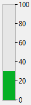

Un indicateur de progression (également appelé "thermomètre") est conçu pour afficher ou définir graphiquement des valeurs numériques ou date/heure.


## Utiliser des indicateurs

Vous pouvez utiliser les jauges pour afficher ou définir des valeurs. Par exemple, si un indicateur de progression se voit affecter une valeur par une méthode, il affiche la valeur. Si l’utilisateur modifie manuellement la valeur indiquée par la jauge, la valeur contenue par l’objet est modifiée. Cette valeur peut être utilisée pour un autre objet tel qu’un champ, un objet saisissable ou un objet non saisissable.

La variable associée à l'indicateur contrôle l’affichage. Vous pouvez y placer des valeurs ou utiliser les valeurs qu’il stocke à l’aide des méthodes. Par exemple, la méthode suivante peut être utilisée pour contrôler un thermomètre :

```4d
 vTherm:=[Employees]Salary
```

Cette méthode affecte la valeur du champ Salary à la variable vTherm. Cette méthode est associée au champ Salary.

Réciproquement, vous pouvez utiliser un indicateur pour contrôler la valeur d’un champ. L’utilisateur se sert alors de l'indicateur pour saisir la valeur du champ. Dans ce cas la méthode devient :

```4d
 [Employees]Salary:=vTherm
```

La méthode affecte la valeur de l'indicateur au champ Salary. Lorsque l’utilisateur modifie la valeur affichée par l'indicateur, la valeur du champ Salary est modifiée.


## Thermomètre par défaut



Le thermomètre est l'indicateur de progression standard.

Vous pouvez afficher une barre de progression horizontale ou verticale. Ce paramètre est déterminé par la forme de l’objet que vous dessinez.

Plusieurs options graphiques sont disponibles : valeurs minimales/maximales, graduations, paliers.

### Propriétés prises en charge
[Barber shop](properties_Scale.md#barber-shop) - [Gras](properties_Text.md#bold) - [Style de bordure](properties_BackgroundAndBorder.md#border-line-style) -[Bas](properties_CoordinatesAndSizing.md#bottom) - [Classe](properties_Object.md#css-class) - [Afficher graduation](properties_Scale.md#display-graduation) - [Saisissable](properties_Entry.md#enterable) - [Exécuter méthode objet](properties_Action.md#execute-object-method) - [Type d'expression](properties_Object.md#expression-type) (uniquement "integer", "number", "date", ou "time") - [Police](properties_Text.md#font) - [Couleur de police](properties_Text.md#font-color) - [Taille de police](properties_Text.md#font-size) - [Hauteur](properties_CoordinatesAndSizing.md#height) - [Italique](properties_Text.md#italic) - [Unité de graduation](properties_Scale.md#graduation-step) -[Message d'aide](properties_Help.md#help-tip) - [Dimensionnement horizontal](properties_ResizingOptions.md#horizontal-sizing) - [Emplacement étiquette](properties_Scale.md#label-location) - [Gauche](properties_CoordinatesAndSizing.md#left) - [Maximum](properties_Scale.md#maximum) - [Minimum](properties_Scale.md#minimum) - [Format numérique](properties_Display.md#number-format) - [Nom objet](properties_Object.md#object-name) - [Droite](properties_CoordinatesAndSizing.md#right) - [Step](properties_Scale.md#step) - [Haut](properties_CoordinatesAndSizing.md#top) - [Type](properties_Object.md#type) - [Souligné](properties_Text.md#underline) - [Variable ou Expression](properties_Object.md#variable-or-expression) - [Dimensionnement Vertical](properties_ResizingOptions.md#vertical-sizing) - [Visibilité](properties_Display.md#visibility) - [Largeur](properties_CoordinatesAndSizing.md#width)


## Barber shop


**Le barber shop** est une variante du thermomètre par défaut. Pour active cette variante, vous devez définir la propriété du [Barber shop](properties_Scale.md#barber-shop).
> En code JSON, supprimez simplement la propriété "max" de l'objet thermomètre par défaut pour activer le barber shop.

Le barber shop affiche une animation continue, telle que le [spinner](spinner.md). Les thermomètres “Barber shop” sont généralement utilisés pour indiquer à l’utilisateur que le programme est en train d’effectuer une opération longue. Lorsque le thermomètre est sélectionné, le thème ["Graduations"](properties_Scale.md) de la liste des propriétés est masqué.

A l’exécution du formulaire, l'objet n’est pas animé. Vous devez gérer l’animation en passant une valeur à [la variable ou expression qui lui est associée](properties_Object.md#variable-or-expression) :

* 1 = Démarrer l'animation,
* 0 = Stopper l’animation.


### Propriétés prises en charge
[Barber shop](properties_Scale.md#barber-shop) - [Gras](properties_Text.md#bold) - [Style de bordure](properties_BackgroundAndBorder.md#border-line-style) -[Bas](properties_CoordinatesAndSizing.md#bottom) - [Classe](properties_Object.md#css-class) - [Saisissable](properties_Entry.md#enterable) - [Executer méthode objet](properties_Action.md#execute-object-method) - [Type d'expression](properties_Object.md#expression-type) (uniquement "integer", "number", "date", ou "time") - [Police](properties_Text.md#font) - [Couleur de police](properties_Text.md#font-color) - [Taille de police](properties_Text.md#font-size) - [Hauteur](properties_CoordinatesAndSizing.md#height) - [Message d'aide](properties_Help.md#help-tip) - [Dimensionnement horizontal](properties_ResizingOptions.md#horizontal-sizing) - [Italique](properties_Text.md#italic) - [Gauche](properties_CoordinatesAndSizing.md#left) - [Nom d'objet](properties_Object.md#object-name) - [Droite](properties_CoordinatesAndSizing.md#right) - [Haut](properties_CoordinatesAndSizing.md#top) - [Type](properties_Object.md#type) - [Souligné](properties_Text.md#underline) - [Variable ou Expression](properties_Object.md#variable-or-expression) - [Dimensionnement vertical](properties_ResizingOptions.md#vertical-sizing) - [Visibilité](properties_Display.md#visibility) - [Largeur](properties_CoordinatesAndSizing.md#width)


## Voir également
- [règle](ruler.md)
- [stepper](stepper.md)