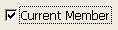
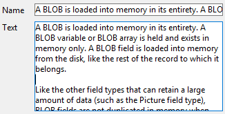
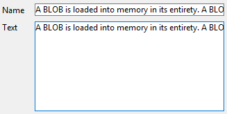

## Correction orthographique

4D inclut des fonctionnalités de correction orthographique intégrées et personnalisables. Les [zones de saisie](input_overview.md) de type texte peuvent être vérifiées, ainsi que les documents [4D Write Pro](writeProArea_overview.md).

La propriété Correction orthographique active la vérification orthographique pour chaque objet. Lorsqu'elle est activée, une vérification orthographique est effectuée automatiquement lors de la saisie des données. Vous pouvez également exécuter la commande de langage 4D `SPELL CHECKING` pour chaque objet à vérifier.

#### Grammaire JSON

| Nom        | Type de données | Valeurs possibles |
| ---------- | --------------- | ----------------- |
| spellcheck | boolean         | true, false       |

#### Objets pris en charge

[Zone 4D Write Pro](writeProArea_overview.md) - [Zone de saisie](input_overview.md)

---

## Menu contextuel

Permet à l'utilisateur d'accéder à un menu contextuel standard dans l'objet lorsque le formulaire est exécuté.

Pour une [zone de saisie](input_overview.md) image, en plus des commandes d'édition standard (Couper, Copier, Coller et Effacer), le menu contient la commande **Omporter...** qui peut être utilisée pour importer une image stockée dans un fichier, ainsi que la commande **Enregistrer sous...** , qui peut être utilisée pour enregistrer l'image sur le disque. Le menu peut également être utilisé pour modifier le format d"affichage de l'image : les options **Tronquée non centrée**, **Non tronquée** et **Proportionnelle centrée** sont proposées. The modification of the [display format](properties_Display.md#picture-format) using this menu is temporary; it is not saved with the record.

Pour une [zone de saisie](input_overview.md) de type texte et [multi-style](properties_Text.md#multi-style), en plus des commandes d'édition standard, le menu contextuel fournit les commandes suivantes :

- **Polices...**: affiche la boîte de dialogue système de police
- **Polices récentes**: affiche les noms des polices récentes sélectionnées pendant la session. La liste peut stocker jusqu'à 10 polices (au-delà, la dernière police utilisée remplace la plus ancienne). Par défaut, cette liste est vide et l'option n'est pas affichée. Vous pouvez gérer cette liste en utilisant les commandes `SET RECENT FONTS` et `FONT LIST`.
- commandes pour les modifications de style prises en charge : police, taille, style, couleur et couleur d'arrière-plan. Lorsque l'utilisateur modifie un attribut de style via ce menu contextuel, 4D génère l'événement formulaire `On After Edit`.

Pour une [Zone Web](webArea_overview.md), le contenu du menu dépend du moteur de rendu de la plate-forme. Il est possible de contrôler l'accès au menu contextuel via la commande [`WA SET PREFERENCE`](https://doc.4d.com/4Dv17R6/4D/17-R6/WA-SET-PREFERENCE.301-4310780.en.html).

#### Grammaire JSON

| Nom         | Type de données | Valeurs possibles                         |
| ----------- | --------------- | ----------------------------------------- |
| contextMenu | string          | "automatic" (utilisé si manquant), "none" |

#### Objets pris en charge

[Zone de saisie](input_overview.md) - [Zone Web](webArea_overview.md) - [Zone 4D Write Pro](writeProArea_overview.md)

---

## Saisissable

L'attribut Saisissable indique si les utilisateurs peuvent entrer des valeurs dans l'objet.

Les objets sont saisissables par défaut. Si vous voulez rendre un champ ou un objet non-saisissable pour ce formulaire, vous pouvez désactiver la propriété Saisissable pour l'objet. Un objet non-saisissable ne fait qu'afficher des données. Vous contrôlez les données avec des méthodes qui utilisent le nom du champ ou de la variable. Vous pouvez toujours utiliser les événements formulaire `On Clicked`, `On Double Clicked`, `On Drag Over`, `On Drop`, `On Getting Focus` et `On Losing Focus` avec des objets non-saisissables. Cela facilite la gestion des menus contextuels personnalisés et vous permet de concevoir des interfaces où vous pouvez glisser-déposer et sélectionner des variables non-saisissables.

Lorsque cette propriété est désactivée, tous les pop-up menus associés à une colonne de listbox via une liste sont désactivés.

#### Grammaire JSON

| Nom       | Type de données | Valeurs possibles |
| --------- | --------------- | ----------------- |
| enterable | boolean         | true, false       |

#### Objets pris en charge

[Zones 4D Write Pro](writeProArea_overview.md) - [Check Box](checkbox_overview.md) - [Liste hiérarchique](list_overview.md) - [Zone de saisie](input_overview.md) - [Colonne List Box](listbox_overview.md#list-box-columns) - [Barre de progression](progressIndicator.md) - [Règle](ruler.md) - [Stepper](stepper.md)

---

## Filtres de saisie

Un filtre de saisie contrôle exactement ce que l’utilisateur peut taper au clavier pendant la saisie. A la différence des listes de [valeurs obligatoires](properties_RangeOfValues.md#required-list) par exemple, les filtres de saisie fonctionnent sur une base de caractère par caractère. Par exemple, si un numéro de composant est toujours constitué de trois lettres suivies de trois chiffres, vous pouvez contraindre la saisie à respecter cette forme. Vous pouvez même contrôler les lettres et les chiffres particuliers.

Un filtre de saisie n’est effectif que pendant la saisie. Il n’a aucun effet sur l’affichage des données une fois que l'objet est désélectionné. En général, les filtres de saisie sont utilisés conjointement avec les [formats d'affichage](properties_Display.md). Le filtre agit pendant la saisie et le format d’affichage assure un affichage approprié de la valeur après sa saisie.

Pendant la saisie de données, un filtre de saisie évalue chaque caractère au moment où il est saisi. Si l’utilisateur tente de taper un caractère invalide (un chiffre à la place d’une lettre, par exemple), 4D refuse la saisie du caractère. Le caractère invalide reste inchangé jusqu'à ce que l'utilisateur saisisse un caractère valide.

Les filtres de saisie peuvent aussi être utilisés pour afficher des caractères de formatage afin d’éviter à l’utilisateur de les taper. Par exemple, un numéro de téléphone français est constitué d’un chiffre de code opérateur suivi d’un chiffre de zone et d’un nombre à huit chiffres groupés par paires. Un format d’affichage peut être utilisé pour afficher le code opérateur entre parenthèses et pour afficher un tiret entre les paires de chiffres. Lorsqu’un tel format est utilisé, l’utilisateur n’a pas besoin de saisir les parenthèses ou le tiret.

### Définition d'un filtre de saisie

La plupart du temps, les [filtres intégrés](#default-entry-filters) de 4D répondront à vos besoins. Toutefois, vous pouvez créer des filtres personnalisés:

- vous pouvez directement entrer une chaîne de définition de filtre
- ou vous pouvez entrer le nom d'un filtre de saisie créé dans l'éditeur de filtres de la Boîte à outils. Les noms des filtres personnalisés que vous créez commencent par une barre verticale (|).

Pour plus d'informations sur la création de filtres de saisie, voir [Codes de filtre et de format](https://doc.4d.com/4Dv18/4D/18/Filter-and-format-codes.300-4575706.en.html).

### Filtres par défaut

Ce tableau explique chaque filtre présent dans la liste déroulante Filtre de saisie :

| Filtres de saisie               | Description                                                                                                                                                                   |
| ------------------------------- | ----------------------------------------------------------------------------------------------------------------------------------------------------------------------------- |
| ~A                              | Permet la saisie de toute lettre, mais les transforme en caractères majuscules.                                                                                               |
| &9                              | Permet tout chiffre.                                                                                                                                                          |
| &A                              | Ne permet que la saisie de lettres majuscules.                                                                                                                                |
| &a                              | Ne permet que la saisie de lettres (minuscules et majuscules).                                                                                                                |
| &@                              | Ne permet que la saisie de caractères alphanumériques. Pas de caractères spéciaux.                                                                                            |
| ~a##                            | Abréviation du nom de l'état (par exemple, CA). Permet la saisie de deux lettres, mais les transforme en caractères majuscules.                                               |
| !0&9##/##/##                    | Filtre standard de saisie des dates. Affiche des zéros aux emplacements de saisie. Permet la saisie de tout chiffre.                                                          |
| !0&9 Day: ## Month: ## Year: ## | Filtre personnalisé de saisie des dates. Affiche des zéros aux emplacements de saisie. Permet la saisie de tout chiffre. Deux entrées après chaque mot.                       |
| !0&9##:##                       | Filtre de saisie d’heure. Limité aux heures et aux minutes. Affiche des zéros aux emplacements de saisie. Autorise quatre chiffres, séparés par un deux-points.               |
| !0&9## Hrs ## Mins ## Secs      | Filtre de saisie d’heure. Affiche des zéros aux emplacements de saisie. Autorise deux chiffres avant chaque mot.                                                              |
| !0&9Hrs: ## Mins: ## Secs: ##   | Filtre de saisie d’heure. Affiche des zéros aux emplacements de saisie. Autorise deux chiffres après chaque mot.                                                              |
| !0&9##-##-##-##                 | Format de numéro de téléphone local. Affiche des zéros aux emplacements de saisie. Permet la saisie de tout chiffre. Deux entrées, trait d'union, deux entrées, etc.          |
| !_&9(###)!0###-####             | Numéro de téléphone interurbain. Affiche des tirets de soulignement dans les trois premiers espaces de saisie, puis des zéros.                                                |
| !0&9###-###-###                 | Numéro de téléphone interurbain. Affiche des zéros aux emplacements de saisie. Permet la saisie de tout chiffre. Trois entrées, tirets, trois entrées, tiret, quatre entrées. |
| !0&9###-##-###                  | Numéro de sécurité sociale. Affiche des zéros aux emplacements de saisie. Permet la saisie de tout chiffre.                                                                   |
| ~"A-Z;0-9; ;,;.;-"              | Lettres majuscules et ponctuation. Autorise uniquement les lettres majuscules, chiffres, espaces, virgules, points et traits d'union.                                         |
| &"a-z;0-9; ;,;.;-"              | Lettres majuscules et minuscules et ponctuation. Autorise les lettres minuscules, chiffres, espaces, virgules, points et traits d'union.                                      |
| &"0-9;.;-"                      | Nombres. Autorise uniquement les chiffres, les points décimaux et les traits d'union (signe inférieur).                                                                       |

#### Grammaire JSON

| Nom         | Type de données | Valeurs possibles                                    |
| ----------- | --------------- | ---------------------------------------------------- |
| entryFilter | string          | <li>Entry filter code</li> ou <li>Nom du filtre de saisie (les noms des filtres commencent par &#124;)</li> |

#### Objets pris en charge

[Check Box](checkbox_overview.md) - [Combo Box](comboBox_overview.md) - [Liste hiérarchique](list_overview.md) - [Zone de saisie](input_overview.md) - [Colonne List Box](listbox_overview.md#list-box-columns)

---

## Focusable

Lorsque la propriété **Focusable** est activée pour un objet, l'objet peut avoir le focus (et peut donc être activé par le clavier par exemple). Il est entouré d'une ligne grise pointillée lorsqu'il est sélectionné — sauf lorsque l'option [Cacher rectangle de focus](properties_Appearance.md#hide-focus-rectangle) a également été sélectionnée.

> Un [objet de saisie](input_overview.md) est toujours focusable s'il a la propriété [Saisissable](#enterable).

-  Case à cocher affichant le focus quand elle est sélectionnée

-  Case à cocher sélectionnée, mais n'affichant pas le focus |

Lorsque la propriété **Focusable** est sélectionnée pour un objet non saisissable, l'utilisateur peut sélectionner, copier ou même glisser-déposer le contenu de la zone.

#### Grammaire JSON

| Nom       | Type de données | Valeurs possibles |
| --------- | --------------- | ----------------- |
| focusable | boolean         | true, false       |

#### Objets pris en charge

[Zones 4D Write Pro](writeProArea_overview.md) - [Bouton](button_overview.md) - [Case à cocher](checkbox_overview.md) - [Liste déroulante](dropdownList_Overview.md) - [Liste hiérarchique](list_overview.md) - [Zone de saisie](input_overview.md) - [List Box](listbox_overview.md) - [Zone de Plug-in](pluginArea_overview.md) - [Bouton Radio](radio_overview.md) - [Sous-formulaire](subform_overview.md)

---

## Configuration du clavier

Cette propriété associe une configuration de clavier spécifique à une [zone de saisie](input_overview.md). Par exemple, dans une application internationale, si un formulaire contient un champ dont le contenu doit être saisi en caractères grecs, vous pouvez associer la configuration de clavier "grec" à ce champ. De cette façon, lors de la saisie des données, la configuration du clavier est automatiquement modifiée lorsque ce champ a le focus.

Par défaut, la saisie utilise la configuration courante du clavier.

> Vous pouvez également définir et lire la configuration clavier dynamiquement en utilisant les commandes `OBJECT SET KEYBOARD LAYOUT` et `OBJECT Get keyboard layout`.

#### Grammaire JSON

| Nom             | Type de données | Valeurs possibles                                                            |
| --------------- | --------------- | ---------------------------------------------------------------------------- |
| keyboardDialect | text            | Code de langue, par exemple "ar-ma" ou "cs". Voir RFC3066, ISO639 et ISO3166 |

#### Objets pris en charge

[Zones 4D Write Pro](writeProArea_overview.md) - [Zone de saisie](input_overview.md)

---

## Multilignes

Cette propriété est disponible pour les [objets de zone de saisie](input_overview.md) contenant les expressions de type texte et les champs de type alpha et texte. Elle peut prendre trois valeurs : Oui, Non, Automatique (par défaut).

#### Automatique

- Dans les zones mono-lignes, les mots situés en fin de ligne sont tronqués et il n’y a pas de retours à la ligne.
- Dans les zones multi-lignes, 4D effectue des retours à la ligne automatiques :  
  

#### Non

- Dans les zones mono-lignes, les mots situés en fin de ligne sont tronqués et il n’y a pas de retours à la ligne.
- Il n’y a aucun retour à la ligne : le texte est toujours affiché sur une seule ligne. Si le champ ou la variable alpha ou texte contient des retour chariots, le texte situé après le premier retour chariot est effacé dès que la zone est modifiée :  
  

#### Oui

Lorsque cette valeur est sélectionnée, la propriété est gérée par l'option [Retour à la ligne](properties_Display.md#wordwrap).

#### Grammaire JSON

| Nom       | Type de données | Valeurs possibles                                   |
| --------- | --------------- | --------------------------------------------------- |
| multiline | text            | "yes", "no", "automatic" (par défaut si non défini) |

#### Objets pris en charge

[Zone de saisie](input_overview.md)

---

## Texte exemple

4D peut afficher un texte d'exemple dans les champs de vos formulaires.

Le texte d'exemple apparaît en filigrane dans un champ, fournissant une aide, une indication ou un exemple pour la saisie des données. Ce texte disparaît dès que l'utilisateur entre un caractère dans la zone :

Le texte d'exemple est affiché à nouveau si le contenu du champ est effacé.

Un texte exemple peut être affiché pour les types de données suivants :

- chaîne (texte ou alpha)
- date et heure lorsque la propriété **Vide si null** est activée.

Vous pouvez utiliser une référence XLIFF sous la forme ":xliff:resname" en tant que texte exemple, par exemple :

 :xliff:PH_Lastname

Vous passez seulement la référence dans le champ "Texte exemple" ; il n'est pas possible de combiner une référence avec du texte statique.
> Vous pouvez également définir et lire le texte exemple par programmation en utilisant les commandes [OBJECT SET PLACEHOLDER](https://doc.4d.com/4Dv20/4D/20/OBJECT-SET-PLACEHOLDER.301-4128243.en.html) et [OBJECT Get placeholder](https://doc.4d.com/4Dv20/4D/20/OBJECT-Get-placeholder.301-4128249.en.html).

#### Grammaire JSON

| Nom         | Type de données | Valeurs possibles                                                  |
| ----------- | --------------- | ------------------------------------------------------------------ |
| placeholder | string          | Texte à afficher (grisé) lorsque l'objet ne contient aucune valeur |

#### Objets pris en charge

[Combo Box](comboBox_overview.md) - [Zone de saisie](input_overview.md)

#### Voir également

[Message d'aide](properties_Help.md)

---

## Sélection toujours visible

Cette propriété conserve la sélection visible dans l'objet après qu'il ait perdu le focus. Cela facilite l'implémentation d'interfaces qui permettent de modifier le style du texte (voir [Multi-style](properties_Text.md#multi-style)).

#### Grammaire JSON

| Nom           | Type de données | Valeurs possibles |
| ------------- | --------------- | ----------------- |
| showSelection | boolean         | true, false       |

#### Objets pris en charge

[Zones 4D Write Pro](writeProArea_overview.md) - [Zone de saisie](input_overview.md)

---

## Equivalent clavier

Cette propriété permet d'associer des touches (raccourcis clavier) aux [boutons](button_overview.md), [boutons radio](radio_overview.md)et [cases à cocher](checkbox_overview.md). Ils permettent à l'utilisateur d'actionner l'objet à l'aide du clavier au lieu d'avoir à utiliser la souris.

Vous pouvez configurer cette option en cliquant sur le bouton [...] de la propriété Equivalent clavier de la Liste des propriétés.

> Vous pouvez également assigner un raccourci à une commande de menu personnalisée. S'il y a un conflit entre deux raccourcis, l'objet actif a la priorité. Pour plus d'informations sur l'association des raccourcis avec les menus, reportez-vous à la section [Définition des propriétés du menu](https://doc.4d.com/4Dv17R5/4D/17-R5/Setting-menu-properties.300-4163525.en.html).

Pour afficher une liste de tous les raccourcis utilisés dans l'environnement de développement de 4D, consultez la page [Raccourcis](https://doc.4d.com/4Dv17R5/4D/17-R5/Shortcuts-Page.300-4163701.en.html) dans la boîte de dialogue Préférences.

#### Grammaire JSON

| Nom             | Type de données | Valeurs possibles                                  |
| --------------- | --------------- | -------------------------------------------------- |
| shortcutAccel   | boolean         | true, false (Ctrl Windows/Command macOS)           |
| shortcutAlt     | boolean         | true, false                                        |
| shortcutCommand | boolean         | true, false                                        |
| shortcutControl | boolean         | true, false (macOS Control)                        |
| shortcutShift   | boolean         | true, false                                        |
|                 |                 |                                                    |
| shortcutKey     | string          | <li>toute touche de caractère : "a", "b"...</li><li>[F1]" -> "[F15]", "[Return]", "[Enter]", "[Backspace]", "[Tab]", "[Esc]", "[Del]", "[Home]", "[End]", "[Help]", "[Page up]", "[Page down]", "[left arrow]", "[right arrow]", "[up arrow]", "[down arrow]"</li> |

#### Objets pris en charge

[Bouton](button_overview.md) - [Case à cocher](checkbox_overview.md) - [Bouton image](pictureButton_overview.md) - [Bouton Radio](radio_overview.md)

---

## Saisie sur clic unique

Active le passage direct en mode édition dans les list box.

Lorsque cette option est activée, les cellules de list box basculent en mode édition après un simple clic utilisateur, indépendamment du fait que la zone de list box ait été sélectionnée préalablement. Notez que cette option permet de modifier les cellules même lorsque le [mode de sélection](properties_ListBox.md#selection-mode) de la list box est défini sur "Aucun".

Lorsque cette option n'est pas activée, les utilisateurs doivent d'abord sélectionner la ligne de la cellule puis cliquer sur la cellule pour modifier son contenu.

#### Grammaire JSON

| Nom             | Type de données | Valeurs possibles |
| --------------- | --------------- | ----------------- |
| singleClickEdit | boolean         | true, false       |

#### Objets pris en charge

[List Box](listbox_overview.md)
