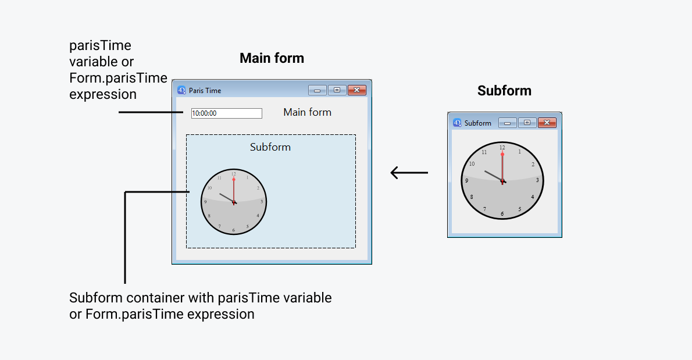
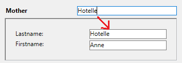

Un sous-formulaire est un formulaire inclus dans un autre formulaire.


## Terminologie

Afin de bien définir les notions mises en oeuvre avec les sous-formulaires, voici quelques définitions relatives aux termes employés :

*   **Sous-formulaire** : formulaire destiné à être inclus dans un autre formulaire, lui-même nommé formulaire parent.
*   **Formulaire parent** : formulaire contenant un ou plusieurs sous-formulaire(s).
*   **Conteneur de sous-formulaire** : objet inclus dans le formulaire parent, contenant une instance du sous-formulaire.
*   **Instance de sous-formulaire** : la représentation d’un sous-formulaire dans un formulaire parent. Cette notion est importante car il est possible d’afficher plusieurs instances d’un même sous-formulaire dans un formulaire parent.
*   **Formulaire liste écran** : instance de sous-formulaire en liste.
*   **Formulaire détaillé** : formulaire de saisie en page associé au sous-formulaire en liste et accessible via un double-clic dans la liste.


## Sous-formulaires en liste

Un sous-formulaire en liste vous permet de saisir, visualiser et modifier des données dans d’autres tables. Les sous-formulaires en liste sont généralement utilisés avec les bases de données utilisant des liens de type 1 vers N. Un sous-formulaire en liste affiche les enregistrements de la table N liée par un lien automatique de type 1 vers N. Vous pouvez disposer de plusieurs sous-formulaires provenant de différentes tables dans le même formulaire. En revanche, il n’est pas possible de placer deux sous-formulaires appartenant à la même table dans une même page de formulaire.

Par exemple, une base de gestion de contacts peut utiliser une instance de sous-formulaire en liste pour afficher tous les contacts d’une société. Bien que les contacts apparaissent dans l’écran général, l’information est en fait stockée dans la table liée. A l’aide d’un lien 1 vers N, la conception de cette base de données rend facile le stockage d’un nombre illimité de contacts pour chacune des sociétés. Avec des liens automatiques, vous pouvez permettre la saisie de données dans la table liée sans programmation.

Bien que les sous-formulaires en liste soient généralement associés aux tables N, une instance de sous-formulaire peut afficher des enregistrements de toute autre table de la base de données.

Vous pouvez également permettre à l’utilisateur de saisir des données dans le formulaire liste. Suivant la configuration du sous-formulaire, l’utilisateur pourra afficher le formulaire détaillé en double-cliquant sur un sous-enregistrement ou en utilisant les commandes d’ajout et de modification des sous-enregistrements.

> 4D propose trois actions standard, permettant de répondre aux besoins élémentaires de gestion des sous-enregistrements : `Modifier sous-enregistrement`, `Supprimer sous-enregistrement` et `Ajouter sous-enregistrement`. Lorsque le formulaire comporte plusieurs instances de sous-formulaires, l’action s’applique au sous-formulaire ayant le focus.


## Sous-formulaires en page

Les sous-formulaires en mode page peuvent afficher des données relatives à l'enregistrement courant ou toute valeur pertinente en fonction du contexte (variables, images, etc.). Il peuvent également, et c'est là leur intérêt majeur, comporter des fonctionnalités avancées et interagir avec le formulaire parent (widgets). Les sous-formulaires en page bénéficient de propriétés et d'événements spécifiques, et peuvent être entièrement contrôlés par programmation.

Le sous-formulaire en page utilise le formulaire entrée désigné par la propriété [Formulaire détaillé](properties_Subform.md#detail-form). A la différence d’un sous-formulaire en mode liste, le formulaire utilisé peut provenir de la même table que le formulaire parent. Il est également possible d’utiliser un formulaire projet. En exécution, un sous-formulaire en mode page dispose des caractéristiques d’affichage standard d’un formulaire entrée.

> Les widgets 4D sont des objets composés prédéfinis. Ils sont décrits en détail dans le manuel [4D Widgets](https://doc.4d.com/4Dv19/4D/19/4D-Widgets.100-5462909.en.html).


### Utilisation de la variable ou de l'expression liée

Vous pouvez lier [une variable ou une expression](properties_Object.md#variable-or-expression) à un objet conteneur de sous-formulaire. Cette fonction est très utile pour synchroniser les valeurs du formulaire parent et de son/ses sous-formulaire(s).

Par défaut, 4D crée une variable ou une expression de [type objet](properties_Object.md#expression-type) pour un conteneur de sous-formulaire, ce qui vous permet de partager des valeurs dans le contexte du sous-formulaire à l'aide de la commande `Form`. Cependant, vous pouvez utiliser une variable ou une expression de n'importe quel type scalaire (time, integer, etc.), en particulier si vous n'avez besoin de partager qu'une seule valeur :

- Définissez une variable ou une expression liée de type scalaire et appelez les commandes `OBJECT Get subform container value` et `OBJECT SET SUBFORM CONTAINER VALUE` pour échanger des valeurs lorsque les événements de formulaire [On Bound Variable Change](../Events/onBoundVariableChange.md) ou [On Data Change](../Events/onDataChange.md) se produisent. Cette solution est recommandée pour synchroniser une seule valeur.
- Définissez une variable ou une expression liée de type **objet** et utilisez la commande `Form` pour accéder à ses propriétés à partir du sous-formulaire. Cette solution est recommandée pour synchroniser plusieurs valeurs.


### Synchronisation du formulaire parent et du sous-formulaire (valeur unique)

Relier la même variable ou expression au conteneur du sous-formulaire et à d'autres objets du formulaire parent vous permet de relier les contextes du formulaire parent et du sous-formulaire pour apporter la touche finale à des interfaces sophistiquées. Imaginez un sous-formulaire contenant une horloge affichant une heure statique, insérée dans un formulaire parent contenant une [zone de saisie ](input_overview.md):



Dans le formulaire parent, les deux objets (zone de saisie et conteneur de sous-formulaire) ***ont la même valeur que ***Variable ou expression******. Il peut s'agir d'une variable (par exemple `parisTime`) ou d'une expression (par exemple `Form.parisTime`).

:::info

Pour afficher une heure statique, vous devez utiliser le [type de données](properties_DataSource.md#data-type-expression-type) approprié pour la [variable ou l'expression](properties_Object.md#variable-or-expression) :

- Si vous utilisez une variable (par exemple `parisTime`), elle doit être de type `texte` ou `heure`.
- Si vous utilisez une expression (par exemple `Form.myValue`), elle doit contenir une valeur `texte`.

La valeur texte doit être formatée "hh:mm:ss".

:::

Dans le sous-formulaire, l'objet horloge est géré par la propriété `Form.clockValue`.


#### Mise à jour du contenu d'un sous-formulaire

Scénario 1 : La valeur de la variable ou de l'expression du formulaire parent est modifiée et cette modification doit être transmise à un sous-formulaire.

`parisTime` ou `Form.parisTime` devient "12:15:00" dans le formulaire parent, soit parce que l'utilisateur l'a saisi, soit parce qu'il a été mis à jour dynamiquement (via l'instruction `String(Current time)` par exemple). Cela déclenche l'événement [On Bound Variable Change](../Events/onBoundVariableChange.md) dans la méthode formulaire du sous-formulaire.

Le code suivant est exécuté :

```4d  
// Méthode formulaire du sous-formulaire
If (Form event code=On Bound Variable Change) //la variable ou l'expression liée a été modifiée dans le formulaire parent
    Form.clockValue:=OBJECT Get subform container value //synchroniser la valeur locale
End if
```

Il met à jour la valeur de `Form.clockValue` dans le sous-formulaire :


L’événement formulaire [Sur modif variable liée](../Events/onBoundVariableChange.md) est généré :

- dès qu'une valeur est assignée à la variable/expression du formulaire parent, même si la même valeur est réassignée
- si le sous-formulaire appartient à la page formulaire courante ou à la page 0.

A noter que, comme dans l'exemple ci-dessus, il est préférable d'utiliser la commande `OBJECT Get subform container value` qui renvoie la valeur de l'expression dans le conteneur du sous-formulaire plutôt que l'expression elle-même car il est possible d'insérer plusieurs sous-formulaires dans le même formulaire parent (par exemple, une fenêtre affichant différents fuseaux horaires contient plusieurs horloges).

La modification de la variable ou de l'expression liée déclenche des événements formulaire qui vous permettent de synchroniser les valeurs du formulaire parent et du sous-formulaire :

- Utilisez l'événement formulaire [On Bound Variable Change](../Events/onBoundVariableChange.md) pour indiquer au sous-formulaire (méthode formulaire du sous-formulaire) que la variable ou l'expression a été modifiée dans le formulaire parent.
- Utilisez l'événement formulaire [On Data Change](../Events/onDataChange.md) pour indiquer au conteneur du sous-formulaire que la valeur de la variable ou de l'expression a été modifiée dans le sous-formulaire.


#### Mise à jour du contenu d'un formulaire parent

Scénario 2 : Le contenu du sous-formulaire est modifié et cette modification doit être répercutée dans le formulaire parent.

Dans le sous-formulaire, le bouton modifie la valeur de l'expression `Form.clockValue` de type Texte attachée à l'objet horloge. Cela déclenche l'événement formulaire [On Data Change](../Events/onDataChange.md) dans l'objet horloge (cet événement doit être sélectionné pour l'objet), qui met à jour la valeur `Form.parisTime` dans le formulaire principal.

Le code suivant est exécuté :

```4d  
// méthode objet de l'horloge du sous-formulaire
If (Form event code=On Data Change) //quelle que soit la manière dont la valeur est modifiée
    OBJECT SET SUBFORM CONTAINER VALUE(Form.clockValue) //Pousser la valeur dans le conteneur
End if
```


Chaque fois que la valeur de `Form.clockValue` change dans le sous-formulaire, `parisTime` ou `Form.parisTime` dans le conteneur du sous-formulaire est également mis à jour.


> Si la valeur de la variable ou de l'expression est définie à plusieurs endroits, 4D utilise la dernière valeur chargée. L'ordre de chargement suivant est appliqué : 1-Méthodes objet du sous-formulaire, 2-Méthode formulaire du sous-formulaire, 3-Méthodes objet du formulaire parent, 4-Méthode formulaire du formulaire parent.


### Synchronisation du formulaire parent et du sous-formulaire (valeurs multiples)

Par défaut, 4D associe une variable ou une expression de [type objet](properties_Object.md#expression-type) à chaque sous-formulaire. Le contenu de cet objet peut être lu et/ou modifié à partir du formulaire parent et du sous-formulaire, ce qui permet de partager plusieurs valeurs dans un contexte local.

Lorsqu'il est lié à un conteneur de sous-formulaire, cet objet est renvoyé par la commande `Form` directement dans le sous-formulaire. Comme les objets sont toujours passés par référence, si l'utilisateur modifie la valeur d'une propriété dans le sous-formulaire, cette valeur sera automatiquement enregistrée dans l'objet lui-même et donc disponible pour le formulaire parent. En revanche, si une propriété de l'objet est modifiée par l'utilisateur dans le formulaire parent ou par programmation, elle sera automatiquement mise à jour dans le sous-formulaire. Aucune gestion d'événement n'est nécessaire.

Par exemple, dans un sous-formulaire, les inputs sont liés aux propriétés de l'objet `Form` (du sous-formulaire) :


Dans le formulaire parent, vous affichez le sous-formulaire deux fois. Chaque conteneur de sous-formulaire est lié à une expression qui est une propriété de l'objet `Form` (du formulaire parent) :


Le bouton ne crée que les propriétés `mother` et `father` de l'objet `Form` du parent :

```4d
//Add values button object method
Form.mother:=New object("lastname"; "Hotel"; "firstname"; "Anne")
Form.father:=New object("lastname"; "Golf"; "firstname"; "Félix")
```

Lorsque vous exécutez le formulaire et cliquez sur le bouton, vous constatez que toutes les valeurs sont correctement affichées :


Si vous modifiez une valeur dans le formulaire parent ou dans le sous-formulaire, elle est automatiquement mise à jour dans l'autre formulaire car le même objet est utilisé :

 

### Utilisation de pointeurs (compatibilité)

Dans les versions antérieures à 4D 19 R5, la synchronisation entre les formulaires parents et les sous-formulaires était gérée par des **pointeurs**. Par exemple, pour mettre à jour un objet de type sous-formulaire, vous pouviez appeler le code suivant :

```4d  
// Méthode formulaire de sous formulaire
If (Form event code=On Bound Variable Change) 
    ptr:=OBJECT Get pointer(Object subform container) 
    clockValue:=ptr-> 
End if
```

**Ce principe est toujours pris en charge à des fins de compatibilité, mais il est désormais obsolète, car il ne permet pas de lier des expressions à des sous-formulaires.** Il ne doit plus être utilisé dans vos développements. Dans tous les cas, il est recommandé d'utiliser la [commande `Form`](#synchronizing-parent-form-and-subform-multiple-values) ou les [commandes `OBJECT Get subform container value` et `OBJECT SET SUBFORM CONTAINER VALUE`](#synchronizing-parent-form-and-subform-single-value) pour synchroniser les valeurs du formulaire et du sous-formulaire.


### Programmation inter-formulaires avancée

La communication entre le formulaire parent et les instances du sous-formulaire peut nécessiter d'aller au-delà de l'échange de valeurs par l'intermédiaire de la variable liée. En effet, vous pouvez souhaiter mettre à jour des variables dans les sous-formulaires en fonction d’actions effectuées dans le formulaire parent et inversement. Si l’on reprend l’exemple du sous-formulaire de type "pendule dynamique", on peut souhaiter définir une ou plusieurs heures d’alerte par pendule.

Pour répondre à ces besoins, 4D propose les mécanismes suivants :

- Appel de l’objet conteneur depuis le sous-formulaire via la commande `CALL SUBFORM CONTAINER`
- Exécution d’une méthode dans le contexte du sous-formulaire via la commande `EXECUTE METHOD IN SUBFORM`

> La commande `GOTO OBJECT` peut rechercher l’objet de destination dans le formulaire parent même si elle exécutée depuis un sous-formulaire.


#### Commande CALL SUBFORM CONTAINER

La commande `CALL SUBFORM CONTAINER` permet à une instance de sous-formulaire d'envoyer un [événement](../Events/overview.md) à l'objet conteneur de sous-formulaire, qui peut alors le traiter dans le contexte du formulaire parent. L’événement est reçu dans la méthode de l’objet conteneur. Il peut s’agir à l’origine de tout événement détecté par le sous-formulaire (clic, glisser-déposer, etc.).

Le code de l’événement est libre (par exemple, 20000 ou -100). Vous pouvez soit utiliser un code correspondant à un événement existant (par exemple, 3 pour `Sur validation`), soit utiliser un code personnalisé. Dans le premier cas, seuls les événements présents dans la liste des événements "cochables" des conteneurs de sous-formulaire peuvent être utilisés (cf. Liste des propriétés). Dans le second cas, le code ne doit correspondre à aucun événement formulaire existant. Il est conseillé d’utiliser une valeur négative pour avoir l’assurance que 4D n’utilisera pas ce code dans les versions futures.

Pour plus d'informations, reportez-vous à la description de la commande `CALL SUBFORM CONTAINER`.

#### Commande EXECUTE METHOD IN SUBFORM

La commande `EXECUTE METHOD IN SUBFORM` permet à un formulaire ou à l’un de ses objets de demander l’exécution d’une méthode dans le contexte de l’instance du sous-formulaire, ce qui lui donne accès aux variables, objets, etc., du sous-formulaire. Cette méthode peut en outre recevoir des paramètres.

Ce mécanisme est illustré dans le schéma suivant :


Pour plus d'informations, reportez-vous à la description de la commande `EXECUTE METHOD IN SUBFORM`.


## Propriétés prises en charge

[Border Line Style](properties_BackgroundAndBorder.md#border-line-style) - [Bottom](properties_CoordinatesAndSizing.md#bottom) - [Class](properties_Object.md#css-class) - [Detail Form](properties_Subform.md#detail-form) - [Double click on empty row](properties_Subform.md#double-click-on-empty-row) - [Double click on row](properties_Subform.md#double-click-on-row) - [Enterable in list](properties_Subform.md#enterable-in-list) - [Expression Type](properties_Object.md#expression-type) - [Focusable](properties_Entry.md#focusable) - [Height](properties_CoordinatesAndSizing.md#height) - [Hide focus rectangle](properties_Appearance.md#hide-focus-rectangle) - [Horizontal Scroll Bar](properties_Appearance.md#horizontal-scroll-bar) - [Horizontal Sizing](properties_ResizingOptions.md#horizontal-sizing) - [Left](properties_CoordinatesAndSizing.md#left) - [List Form](properties_Subform.md#list-form) - [Method](properties_Action.md#method) - [Object Name](properties_Object.md#object-name) - [Print Frame](properties_Print.md#print-frame) - [Right](properties_CoordinatesAndSizing.md#right) - [Selection mode](properties_Subform.md#selection-mode) - [Source](properties_Subform.md#source) - [Top](properties_CoordinatesAndSizing.md#top) - [Type](properties_Object.md#type) - [Variable or Expression](properties_Object.md#variable-or-expression) - [Vertical Scroll Bar](properties_Appearance.md#vertical-scroll-bar) - [Vertical Sizing](properties_ResizingOptions.md#vertical-sizing) - [Visibility](properties_Display.md#visibility) - [Width](properties_CoordinatesAndSizing.md#width) 
