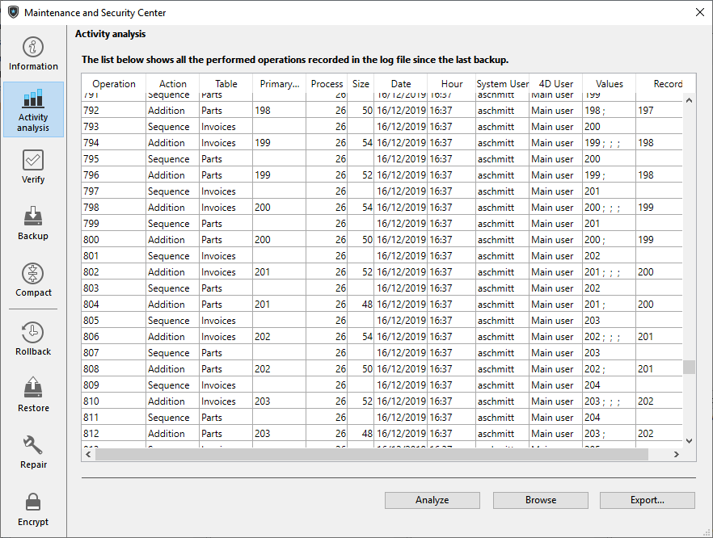

La page Analyse d'activités du CSM permet de visualiser le contenu du fichier d’historique courant. This function is useful for parsing the use of an application or detecting the operation(s) that caused errors or malfunctions. In the case of an application in client-server mode, it allows verifying operations performed by each client machine.
> Il est également possible de revenir en arrière parmi les opérations effectuées sur les données de la base. Pour plus d’informations sur ce point, reportez-vous à la section [Page Retour](rollback.md) arrière.

Chaque opération élémentaire enregistrée dans le fichier d’historique apparaît sous forme d’une ligne. Les colonnes fournissent diverses informations concernant l’opération. Vous pouvez réorganiser les colonnes comme vous le souhaitez en cliquant sur leur en-tête.

Les informations affichées permettent d’identifier la source et le contexte de chaque opération :

- **Opération** : numéro de séquence de l’opération dans le fichier d’historique.
- **Action** : type d’opération effectuée. Cette colonne peut contenir les opérations suivantes :
    - Ouverture du fichier de données : ouverture d’un fichier de données.
    - Fermeture du fichier de données : fermeture du fichier de données ouvert.
    - Création d’un contexte : création d’un process définissant un contexte d’exécution.
    - Fermeture d’un contexte : fermeture d’un process.
    - Ajout : création et stockage d’un enregistrement.
    - Ajout d’un BLOB : stockage d’un BLOB dans un champ BLOB.
    - Suppression : suppression d’un enregistrement.
    - Modification : modification d’un enregistrement.
    - Début de transaction : transaction démarrée.
    - Validation de transaction : transaction validée.
    - Annulation de transaction : transaction annulée.
    - Contexte de mise à jour : modification des données supplémentaires (ex : un appel à `CHANGE CURRENT USER` ou `SET USER ALIAS`).

- **Table** : table à laquelle appartient l’enregistrement ajouté/supprimé/modifié ou le BLOB.
- **Clé primaire/BLOB** : contenu de la clé primaire de l'enregistrement (lorsque la clé primaire est composée de plusieurs champs, les valeurs sont séparées par des points-virgules), ou numéro de séquence du BLOB impliqué dans l’opération.
- **Process** : numéro interne du process dans lequel l’opération a été effectuée. Ce numéro interne correspond au contexte de l’opération. Taille : taille en octets des données traitées par l’opération.
- **Taille** : taille (en octets) des données traitées par l’opération.
- **Date et Heure** : date et heure à laquelle l’opération a été effectuée.
- **4D User**: 4D user name of the user that performed the operation. Si un alias est défini pour l'utilisateur, l'alias s'affiche à la place du nom d'utilisateur 4D.
- **System User**: System name of the user that performed the operation. Si un alias est défini pour l'utilisateur, l'alias s'affiche à la place du nom d'utilisateur 4D.
- **Valeurs** : valeurs des champs de l’enregistrement en cas d’ajout ou de modification. Les valeurs sont séparées par des “;”. Seules les valeurs représentables sous forme alphanumérique sont affichées.  
  ***Note** : Si la base est chiffrée et si aucune clé de données valide correspondant au fichier d'historique n'a été fournie, les valeurs chiffrées ne sont pas affichées dans cette colonne.*
- **Enregistrements** : Numéro de l’enregistrement.

Click on **Analyze** to update the contents of the current log file of the selected application (named by default dataname.journal). The Browse button can be used to select and open another log file for the application. Le bouton **Exporter...** vous permet d’exporter le contenu du fichier sous forme de texte.

