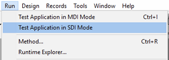

Les barres de menu fournissent la principale interface des applications personnalisées. Pour chaque application personnalisée, vous devez créer au moins une barre de menu avec au moins un menu. Par défaut, Menu Bar #1 est la barre de menu qui est affichée dans l'application. Vous pouvez modifier la barre de menu affichée à l'aide de la commande `SET MENU BAR`.

4D vous permet d’associer une image d’accueil personnalisée à chaque barre de menus et de prévisualiser une barre à tout moment.

## Image d'accueil

Vous pouvez enrichir l’apparence de chaque barre de menus en lui associant une image d’accueil personnalisée. La fenêtre contenant l’image d’accueil est affichée en-dessous de la barre de menus lorsqu’elle apparaît. Elle peut contenir un logo ou tout type d’image. Par défaut, 4D affiche un logo comme image dans la fenêtre d’accueil :

Une image d’accueil personnalisée peut provenir de toute application graphique. 4D vous permet de coller une image du presse-papiers, d’utiliser une image de la bibliothèque ou toute image présente sur votre disque dur. Tous les formats d’image standard pris en charge par 4D sont utilisables.

L'image d'accueil peut être uniquement paramétrée dans l'éditeur de menus : sélectionnez la barre de menus à laquelle vous souhaitez associer une image d’accueil personnalisée. Notez la zone "Image de fond" à droite de la fenêtre. Pour ouvrir directement une image stockée sur votre disque, cliquez sur le bouton **Ouvrir** ou cliquez dans la zone “Image de fond”. Un pop up menu apparaît :
- Pour coller une image se trouvant dans le Presse-papiers, choisissez la commande **Coller**.
- Pour ouvrir une image stockée dans un fichier disque, choisissez la commande **Ouvrir**. Si vous avez choisi la commande Ouvrir, une boîte de dialogue standard d’ouverture de fichiers apparaît, vous permettant de sélectionner le fichier image à utiliser. Une fois définie, l’image s’affiche en taille réduite dans la zone. Elle est alors associée à la barre de menus.

Vous pouvez visualiser le résultat final en testant la barre de menus (cf. paragraphe suivant). En mode Application, l’image est affichée dans la fenêtre d’accueil avec un format du type “tronqué centré”.

> Vous pouvez choisir d’afficher ou de masquer cette fenêtre en cochant l'option **Afficher la barre d'outils** dans les Propriétés.

Pour supprimer l’image personnalisée et afficher l’image par défaut, cliquez sur le bouton **Effacer** ou cliquez dans la zone “Image de fond” et choisissez la commande **Effacer** dans le pop up menu.

## Prévisualiser la barre de menus

L’éditeur de menus vous permet de visualiser à tout moment les menus personnalisés et la fenêtre d’accueil sans quitter la fenêtre de la boîte à outils.

Pour cela, il vous suffit de sélectionner la barre de menus et de choisir la commande **Tester la barre de menus “Barre n°N”** dans le menu contextuel ou le menu d’options de l’éditeur.

4D affiche un aperçu de la barre de menus ainsi que de l’écran d’accueil. Vous pouvez dérouler les menus et les sous-menus pour prévisualiser leur contenu. En revanche, les menus ne sont pas actifs. Pour pouvoir tester le fonctionnement des menus et la barre d’outils, vous devez utiliser la commande **Tester l’application** dans le menu **Exécution**.

:::info

If the **Use SDI mode on Windows** option is selected in the ["Interface" page of the Settings dialog box](../settings/interface.md#display-windows), the **Test Application** menu allows you to test your application in [SDI or MDI mode](sdi.md) on Windows:

:::
