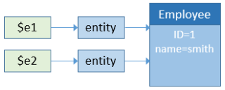

Dans ORDA, vous accédez aux données via des [entités](dsMapping.md#entity) (entities) et des [sélections d'entités](dsMapping.md#entity-selection) (entity selections). Ces objets vous permettent de créer, mettre à jour, rechercher ou trier les données du datastore.


## Créer une entité

Il existe deux façons de créer une nouvelle entité dans une dataclass :

*   Les entités étant des références à des enregistrements de base de données, vous pouvez créer des entités en créant des enregistrements en utilisant le langage 4D "classique", puis les référencer avec des méthodes ORDA telles que `entity.next()` ou `entitySelection.first()`.
*   Vous pouvez également créer une entité à l'aide de la méthode `dataClass.new()`.

Gardez à l'esprit que l'entité est créée uniquement en mémoire. Si vous souhaitez l'ajouter à la banque de données, vous devez appeler la méthode `entity.save ()`.

Les attributs de l'entité sont directement disponibles en tant que propriétés de l'objet entité. Pour plus d'informations, reportez-vous à [Utilisation des attributs d'entité](#using-entity-attributes).

Par exemple, nous voulons créer une nouvelle entité dans la dataclass "Employee" dans le datastore courant avec "John" et "Dupont" affectés aux attributs de prénom et de nom :

```4d
var $myEntity : cs.EmployeeEntity
$myEntity:=ds.Employee.new() //Créer un nouvel objet de type entité
$myEntity.name:="Dupont" //assigner 'Dupont' à l'attribut 'name'
$myEntity.firstname:="John" //assigner 'John' à l'attribut 'firstname' 
$myEntity.save() //sauvegarder l'entité
```
> Une entité est définie uniquement dans le process où elle a été créée. Vous ne pouvez pas, par exemple, stocker une référence à une entité dans une variable interprocess et l'utiliser dans un autre process.

## Entités et références

Une entité contient une référence à un enregistrement 4D. Différentes entités peuvent référencer le même enregistrement 4D. De plus, comme une entité peut être stockée dans une variable objet 4D, différentes variables peuvent contenir une référence à la même entité.

Si vous exécutez le code suivant :

```4d
 var $e1; $e2 : cs.EmployeeEntity
 $e1:=ds.Employee.get(1) //accéder à l'employé avec ID 1
 $e2:=$e1
 $e1.name:="Hammer"
  //les variables $e1 et $e2 partagent la référence à la même entité
  //$e2.name contient "Hammer"
```

Ceci est illustré par le graphique suivant :


Maintenant, si vous exécutez :

```4d
 var $e1; $e2 : cs.EmployeeEntity
 $e1:=ds.Employee.get(1)
 $e2:=ds.Employee.get(1)
 $e1.name:="Hammer"
  //la variable $e1 contient une référence vers une entité
  //variable $e2 contient une autre référence vers une autre entité
  //$e2.name contient "smith"
```

Ceci est illustré par le graphique suivant :



A noter cependant que les entités font référence au même enregistrement. Dans tous les cas, si vous appelez la méthode `entity.save()`, l'enregistrement sera mis à jour (sauf en cas de conflit, voir [Verrouillage d'entité](#entity-locking)).

En fait, `$e1` et `$e2` ne sont pas l'entité elle-même, mais des références à l'entité. Cela signifie que vous pouvez les passer directement à n'importe quelle fonction ou méthode, et qu'elle agira comme un pointeur, et plus rapidement qu'un pointeur 4D. Par exemple :

```4d
 For each($entity;$selection)
    do_Capitalize($entity)
 End for each
```

Et la méthode est :

```4d
 $entity:=$1
 $name:=$entity.lastname
 If(Not($name=Null))
    $name:=Uppercase(Substring($name;1;1))+Lowercase(Substring($name;2))
 End if
 $entity.lastname:=$name
```

Vous pouvez gérer les entités comme n'importe quel autre objet dans 4D et passer leurs références directement en tant que [paramètres](Concepts/parameters.md).
> Avec les entités, il n'y a pas de notion de "enregistrement courant" comme dans le langage classique de 4D. Vous pouvez utiliser autant d'entités que nécessaire, en même temps. Il n'existe pas non plus de verrouillage automatique d'une entité (voir [Verrouillage d'une entité](#entity-locking)). Lorsqu'une entité est chargée, elle utilise le mécanisme de [lazy loading](glossary.md#lazy-loading), ce qui signifie que seules les informations nécessaires sont chargées. Néanmoins, en mode client/serveur, l'entité peut être automatiquement chargée directement si nécessaire.


## Utilisation des attributs d'entités

Les attributs d'entité stockent les données et sont reliés aux champs correspondants dans la table correspondante. Les attributs d'entité du type de stockage peuvent être définis ou obtenus sous forme de propriétés simples de l'objet entité, tandis que l'entité de type **relatedEntity** ou **relatedEntities** renverra une entité ou une sélection d'entité.
> Pour plus d'informations sur le type d'attribut, reportez-vous au paragraphe [Attributs de stockage et de relation](dsMapping.md#storage-and-relation-attributes).

Par exemple, pour définir un attribut de stockage :

```4d
 $entity:=ds.Employee.get(1) //obtenir l'attribut d'Employee avec l'ID 1
 $name:=$entity.lastname //obtenir le nom de l'employé, par exemple "Smith"
$entity.lastname:="Jones" //définir le nom de l'employé
$entity.save() //sauvegarder les modifications
```

> Les champs Blob des bases de données (les [blobs scalaires](Concepts/dt_blob.md) sont automatiquement convertis en attributs d'objets blob ([`4D.Blob`](Concepts/dt_blob.md)) lorsqu'ils sont traités par ORDA. Lorsque vous sauvegardez un attribut d'objet blob, gardez à l'esprit que, contrairement à la taille de l'objet blob qui n'est limitée que par la mémoire disponible, la taille du champ Blob est limitée à 2 Go.

L'accès à un attribut associé dépend du type d'attribut. Par exemple, avec la structure suivante :


Vous pouvez accéder aux données via le ou les objets associé(s) :

```4d
 $entity:=ds.Project.all().first().theClient //récupérer l'entité Company associée au projet
 $EntitySel:=ds.Company.all().first().companyProjects //récupère la sélection de projets pour l'entreprise(Company)
```

Notez que dans l'exemple ci-dessus, *theClient* et *companyProjects* sont des attributs de relation et représentent une relation directe entre les deux dataclasses. Cependant, les attributs de relation peuvent également être créés sur des chemins via des relations à plusieurs niveaux, y compris des références circulaires. Par exemple, considérons la structure suivante :


Chaque employé peut être un manager et peut avoir un manager. Pour obtenir le manager du manager d'un employé, vous pouvez simplement écrire :

```4d
 $myEmp:=ds.Employee.get(50)
 $manLev2:=$myEmp.manager.manager.lastname
```

## Assigner des valeurs aux attributs de relation

Dans l'architecture ORDA, les attributs de relation contiennent directement des données liées aux entités :

*   Un attribut de relation de type N-> 1 (type **relatedEntity**) contient une entité
*   Un attribut de relation de type 1-> N (type **relatedEntities**) contient une sélection d'entité

Regardons la structure (simplifiée) suivante :


Dans cet exemple, une entité de la dataclass "Employee" contient un objet de type Entité dans l'attribut "employer" (ou une valeur nulle). Une entité de la dataclass "Company" contient un objet de type EntitySelection dans l'attribut "staff" (ou une valeur nulle).
> Dans ORDA, la propriété Automatic ou Manual des relations ne produit aucun effet.

Pour attribuer une valeur directement à l'attribut "employer", vous devez passer une entité existante de la dataclass "Company". Par exemple :

```4d
 $emp:=ds.Employee.new() // créer un employé
 $emp.lastname:="Smith" // attribuer une valeur à un attribut
 $emp.employer:=ds.Company.query("name =:1";"4D")[0]  //attribuer une entité de "company"
 $emp.save()
```

Vous pouvez également obtenir directement l'entité "1" liée par le biais de sa valeur de clé primaire (nombre ou texte). Par exemple :

```4d
 $emp:=ds.Employee.new()
 $emp.lastname:="Wesson"
 $emp.employer:=ds.Company.get(2)
  //on obtient l'entité Company avec la valeur de clé primaire 2
  //on l'assigne à l'employé
 $emp.save()
```

Ceci est particulièrement utile lorsque vous importez un grand nombre de données à partir d'une base de données relationnelle. Ce type d'import contient généralement une colonne "ID", qui référence une clé primaire que vous pouvez ensuite affecter directement à un attribut de relation.


Vous pouvez attribuer ou modifier la valeur d'un attribut d'entité associé "1" à partir de la dataclass "N" directement via l'attribut associé. Par exemple, si vous souhaitez modifier l'attribut de nom d'une entité "Company" associée d'une entité "Employee", vous pouvez écrire :

```code4d
 $emp:=ds.Employee.get(2) // charge l'entité Employee avec la clé primaire 2
 $emp.employer.name:="4D, Inc." //modifier l'attribut de nom de la société associée
 $emp.employer.save() //sauvegarder l'attribut associé
  //l'entité associée est mise à jour
```

## Créer une entity selection (sélection d'entités)

Vous pouvez créer un objet de type [entity selection](dsMapping.md#entity-selection) comme suit :

*   Lancez une requête sur les entités [dans une dataclass](API/DataClassClass.md#query) ou dans une [sélection d'entités existante](API/EntitySelectionClass.md#query);
*   Utilisez la fonction de dataclass [`.all()`](API/DataClassClass.md#all) pour sélectionner toutes les entités d'une dataclass;
*   Utilisez la commande `Create entity selection` ou la fonction de dataclass [`.newSelection()`](API/DataClassClass.md#newselection) pour créer une sélection d'entités vide;
*   Utilisez la fonction [`.copy()`](API/EntitySelectionClass.md#copy) pour dupliquer une sélection d'entités existante;
*   Utilisez l'une des diverses fonctions de [Entity selection class](API/EntitySelectionClass.md) qui retourne une nouvelle sélection d'entité, telle que [`entitySelection.or()`](API/EntitySelectionClass.md#or);
*   En utilisant un attribut de relation de type "related entities" (voir ci-dessous).

Vous pouvez créer et utiliser simultanément autant de sélections d'entités différentes que vous le souhaitez pour une dataclass. A noter qu'une sélection d'entité ne contient que des références à des entités. Différentes sélections d'entités peuvent contenir des références vers les mêmes entités.

### Entity selections partageables ou modifiables

Une "entity selection" peut être **partageable** (lisible par plusieurs processus, mais non modifiable après sa création) ou **modifiable** (supporte la fonction [`.add()`](API/EntitySelectionClass.md#add), mais utilisable uniquement par le processus actuel).

#### Propriétés

Une entity selection **partageable** a les caractéristiques suivantes :

- elle peut être stockée dans un objet partagé ou une collection partagée, et peut être passée comme paramètre entre plusieurs process ou workers ;
- elle peut être stockée dans plusieurs objets partagés ou collections partagées, ou dans un objet partagé ou une collection partagée qui appartient déjà à un groupe ;
- elle ne permet pas d'ajouter de nouvelles entités. Essayer d'ajouter une entité à une entity selection partageable génèrera une erreur (1637 - Cette entity selection ne peut pas être modifiée). Pour ajouter une entité à une entity selection partageable, vous devez d'abord la transformer en une entity selection non partageable à l'aide de la fonction [`.copy()`](API/EntitySelectionClass.md#copy), avant d'appeler [`.add()`](API/EntitySelectionClass.md#add).

> La plupart des fonctions d'entity selection (telles que [`.slice()`](API/EntitySelectionClass.md#slice), [`.and()`](API/EntitySelectionClass.md#and)...) prennent en charge les entity selection partageables car elles n'ont pas besoin de modifier l'entity selection d'origine (elles en retournent une nouvelle).

Une entity selection **modifiable** a les caractéristiques suivantes :

- elle ne peut pas être partagée entre les process, ni être stockée dans un objet partagé ou une collection partagée. Essayer de stocker une entity selection non partageable dans un objet partagé ou une collection partagée génèrera une erreur (-10721 - Type de valeur non pris en charge dans un objet partagé ou une collection partagée) ;
- elle accepte l'ajout de nouvelles entités, c'est-à-dire qu'elle supporte la fonction [`.add()`](API/EntitySelectionClass.md#add).


#### Comment les définir ?

La nature **partageable** ou **modifiable** d'une entity selection est définie lors de sa création (elle ne peut pas être modifiée par la suite). Vous pouvez connaître la nature d'une entity selection à l'aide de la fonction [.isAlterable()](API/EntitySelectionClass.md#isalterable) ou de la commande `OB Is shared`.


Une nouvelle entity selection est **partageable** dans les cas suivants :

- la nouvelle entity selection résulte d'une fonction de classe ORDA appliquée à une dataClass : [dataClass.all()](API/DataClassClass.md#all), [dataClass.fromCollection()](API/DataClassClass.md#fromcollection), [dataClass.query()](API/DataClassClass.md#query),
- la nouvelle entity selection est fondée sur une relation [entity.*attributeName*](API/EntityClass.md#attributename) (par exemple, "company.employees") lorsque *attributeName* est un attribut lié1 vers N mais que l'entity n'appartient pas à une entity selection.
- la nouvelle entity selection est explicitement copiée comme partageable avec [entitySelection.copy()](API/EntitySelectionClass.md#copy) ou `OB Copy` (c'est-à-dire avec l'option `ck shared`).

Voici un exemple :
```4d
$myComp:=ds.Company.get(2) //$myComp n'appartient pas à une entity selection
$employees:=$myComp.employees //$employees est partageable
```

Une nouvelle entity selection est **modifiable** dans les cas suivants :

- la nouvelle entity selection est créée vide à l'aide de la fonction [dataClass.newSelection()](API/DataClassClass.md#newselection) ou de la commande `Create entity selection`,
- la nouvelle entity selection est explicitement copiée comme modifiable avec [entitySelection.copy()](API/EntitySelectionClass.md#copy) ou `OB Copy` (c'est-à-dire sans l'option `ck shared`).

Voici un exemple :
```4d
$toModify:=ds.Company.all().copy() //$toModify est modifiable
```


Une nouvelle entity selection **hérite** de la nature de l'entity selection originale dans les cas suivants :

- la nouvelle entity selection résulte de l'une des diverses fonctions de classes ORDA appliquées à une entity selection existante ([.query()](API/EntitySelectionClass.md#query), [.slice()](API/EntitySelectionClass.md#slice), etc.) .
- la nouvelle entity selection est basée sur une relation :
    - [entity.*attributeName*](API/EntityClass.md#attributename) (par exemple, "company.employees") lorsque *attributeName* est un attribut lié1 vers N mais que l'entity appartient à une "entity selection" (de même nature que [getSelection](API/EntityClass.md#getselection)
    - [entitySelection.*attributeName*](API/EntitySelectionClass.md#attributename) (e.g. "employees.employer") lorsque *attributeName* est un attribut lié (de même nature que celle de la "entity selection"),
    - [.extract()](API/EntitySelectionClass.md#extract), lorsque la collection résultante contient des sélections d'entités (de même nature que l'entity selection'").

Exemples :

```4d
$highSal:=ds.Employee.query("salary >= :1"; 1000000)   
    //$highSal is shareable because of the query on dataClass
$comp:=$highSal.employer //$comp is shareable because $highSal is shareable

$lowSal:=ds.Employee.query("salary <= :1"; 10000).copy() 
    //$lowSal is alterable because of the copy()
$comp2:=$lowSal.employer //$comp2 is alterable because $lowSal is alterable
```

:::note Entity selections renvoyées par le serveur

Dans l'architecture client/serveur, les entity selections renvoyées par le serveur sont toujours partageables sur le client, même si \[`copy()`\](../API/EntitySelectionClass.md#copy) a été appelée sur le serveur. Pour rendre une telle entity selection modifiable côté client, vous devez exécuter \[`copy()`\](../API/EntitySelectionClass.md#copy) côté client. Voici un exemple :

```4d
    //une fonction est toujours exécutée sur le serveur
exposed Function getSome() : cs.MembersSelection
    return This.query("ID >= :1" ; 15).orderBy("ID ASC")

    //dans une méthode, exécutée du côté distant
var $result : cs.MembersSelection
var $alterable : Boolean
$result :=ds.Members.getSome() // $result est partageable
$alterable:=$result.isAlterable() //False

$result:=ds.Members.getSome().copy() // $result est maintenant modifiable
$alterable:=$result.isAlterable() // True
```

:::


#### Partage d'une entity selection entre process (exemple)

Vous travaillez avec deux entity selections que vous souhaitez transmettre à un process worker afin qu'il puisse envoyer des mails aux personnes concernées :

```4d

var $paid; $unpaid : cs.InvoicesSelection
//We get entity selections for paid and unpaid invoices

$paid:=ds.Invoices.query("status=:1"; "Paid")
$unpaid:=ds.Invoices.query("status=:1"; "Unpaid")

//We pass entity selection references as parameters to the worker
CALL WORKER("mailing"; "sendMails"; $paid; $unpaid)

```

La méthode `sendMails` :

```4d 

 #DECLARE ($paid : cs.InvoicesSelection; $unpaid : cs.InvoicesSelection)
 var $invoice : cs.InvoicesEntity

 var $server; $transporter; $email; $status : Object

  //Prepare emails
 $server:=New object()
 $server.host:="exchange.company.com"
 $server.user:="myName@company.com"
 $server.password:="my!!password"
 $transporter:=SMTP New transporter($server)
 $email:=New object()
 $email.from:="myName@company.com"

  //Loops on entity selections
 For each($invoice;$paid)
    $email.to:=$invoice.customer.address // email address of the customer
    $email.subject:="Payment OK for invoice # "+String($invoice.number)
    $status:=$transporter.send($email)
 End for each

 For each($invoice;$unpaid)
    $email.to:=$invoice.customer.address // email address of the customer
    $email.subject:="Please pay invoice # "+String($invoice.number)
    $status:=$transporter.send($email)
 End for each
```


### Entity selections et attributs de stockage

Tous les attributs de stockage (texte, numérique, booléen, date) sont disponibles en tant que propriétés d'entity selections et propriétés d'entités. Lorsqu'il est utilisé avec une entity selection, un attribut scalaire retourne une collection de valeurs scalaires. Par exemple :

```4d
 $locals:=ds.Person.query("city = :1" ; "San Jose") //entity selection de personnes
 $localEmails:=$locals.emailAddress //collection d'adresses électroniques (chaînes de caractères)
```

Ce code retourne dans *$localEmails* une collection d'adresses e-mail sous forme de chaînes.

### Entity selections et attributs relationnels

En plus des multiples manières d'effectuer des recherches, vous pouvez également utiliser les attributs relationnels comme propriétés des entity selections afin de renvoyer de nouvelles entity selections. Par exemple, considérons la structure suivante :


```4d
 $myParts:=ds.Part.query("ID < 100") //Retourner les pièces dont l'ID est inférieur à 100
 $myInvoices:=$myParts.invoiceItems.invoice
  //Toutes les factures dont au moins une ligne est liée à une pièce dans $myParts
```

La dernière ligne renverra, dans $myInvoices, une sélection d'entité de toutes les factures qui ont au moins un poste de facture lié à une partie de la sélection d'entités myParts. Lorsqu'un attribut relationnel est utilisé comme propriété d'une entity selection, le résultat est toujours une autre entity selection, même si une seule entité est retournée. Lorsqu'un attribut relationnel est utilisé comme propriété d'une entity selection et qu'aucune entité n'est retournée, le résultat est une entity selection vide, et non nulle.


## Verrouillage d'une entité

Vous devez souvent gérer d'éventuels conflits pouvant survenir lorsque plusieurs utilisateurs ou process se chargent et tentent de modifier les mêmes entités en même temps. Le verrouillage des enregistrements est une méthodologie utilisée dans les bases de données relationnelles pour éviter les mises à jour incohérentes des données. Le concept consiste soit à verrouiller un enregistrement lors de sa lecture afin qu'aucun autre process ne puisse le mettre à jour, soit à vérifier lors de la sauvegarde d'un enregistrement qu'un autre process ne l'a pas modifié depuis sa lecture. Le premier est appelé **verrouillage d'enregistrement pessimiste** et garantit qu'un enregistrement modifié peut être écrit au détriment du verrouillage des enregistrements pour d'autres utilisateurs. Ce dernier est appelé **verrouillage d'enregistrement optimiste** et il échange la garantie des privilèges d'écriture sur l'enregistrement contre la flexibilité de décider des privilèges d'écriture uniquement si l'enregistrement doit être mis à jour. Dans le verrouillage d'enregistrement pessimiste, l'enregistrement est verrouillé même s'il n'est pas nécessaire de le mettre à jour. Dans le verrouillage d'enregistrement optimiste, la validité de la modification d'un enregistrement est évaluée au moment de la mise à jour.

ORDA vous propose deux modes de verrouillage d'entité :

- un mode automatique "optimiste", adapté à la plupart des applications,
- un mode "pessimiste" permettant de verrouiller les entités avant d'y accéder.

### Verrouillage optimiste automatique

Ce mécanisme automatique est basé sur le concept de "verrouillage optimiste" qui est particulièrement adapté aux problématiques des applications web. Ce concept se caractérise par les principes de fonctionnement suivants :

*   Toutes les entités peuvent toujours être chargées en lecture-écriture; il n'y a pas de «verrouillage» *a priori* des entités.
*   Chaque entité possède un marqueur de verrouillage interne qui est incrémenté à chaque fois qu'il est enregistré.
*   Lorsqu'un utilisateur ou un process tente de sauvegarder une entité à l'aide de la méthode `entity.save()`, 4D compare la valeur du marqueur de l'entité à sauvegarder avec celle de l'entité trouvée dans les données (en cas de modification) :
    *   Lorsque les valeurs correspondent, l'entité est enregistrée et la valeur du marqueur interne est incrémentée.
    *   Lorsque les valeurs ne correspondent pas, cela signifie qu'un autre utilisateur a modifié cette entité entre-temps. La sauvegarde n'est pas effectuée et une erreur est retournée.

Le diagramme suivant illustre le verrouillage optimiste :

1. Deux process chargent la même entité.<br/><br/>

2. Le premier process modifie l'entité et valide le changement. La méthode `entity.save()` est appelée. Le moteur 4D compare automatiquement la valeur du marqueur interne de l'entité modifiée avec celle de l'entité stockée dans les données. Puisqu'ils correspondent, l'entité est enregistrée et la valeur de son marqueur est incrémentée.<br/><br/>

3. Le deuxième process modifie également l'entité chargée et valide ses modifications. La méthode `entity.save()` est appelée. Etant donné que la valeur de marqueur de l'entité modifiée ne correspond pas à celle de l'entité stockée dans les données, la sauvegarde n'est pas effectuée et une erreur est retournée.<br/><br/>


Cela peut également être illustré par le code suivant :

```4d
 $person1:=ds.Person.get(1) //Référence à l'entité
 $person2:=ds.Person.get(1) //Autre référence à la même entité
 $person1.name:="Bill"
 $result:=$person1.save() //$result.success=true, modification enregistrée
 $person2.name:="William"
```

Dans cet exemple, nous attribuons à $person1 une référence à l'entité "person" avec une clé de 1. Nous attribuons ensuite une autre référence de la même entité à la variable $person2. Avec $person1, nous modifions le prénom de la personne et sauvegardons l'entité. Lorsque nous essayons de faire de même avec $person2, 4D vérifie que l'entité sur le disque est la même que lors de la première attribution de la référence dans $person1. Puisqu'elles ne sont pas identiques, 4D retourne "faux" dans la propriété "success" et ne sauvegarde pas la deuxième modification.

Lorsque cette situation se produit, vous pouvez, par exemple, recharger l'entité à partir du disque à l'aide de la fonction `entity.reload()` afin d'essayer à nouveau d'effectuer la modification. La fonction `entity.save()` propose également une option "automerge" pour sauvegarder l'entité dans le cas où des process modifient des attributs qui ne sont pas les mêmes.

> Les marqueurs d'enregistrements ne sont pas utilisés dans les **transactions ** car il n'existe qu'une seule copie d'un enregistrement dans ce contexte. Quel que soit le nombre d'entités qui référencent un enregistrement, c'est la même copie qui est modifiée. Ainsi, les opérations `entity.save()` ne génèrent jamais d'erreurs de marqueur.

### Verrouillage pessimiste

Vous pouvez verrouiller et déverrouiller des entités à la demande lorsque vous accédez aux données. Lorsqu'une entité est verrouillée par un process, elle est chargée en lecture/écriture dans ce process mais elle est verrouillée pour tous les autres process. L'entité peut être chargée uniquement en mode lecture seule dans ces process; ses valeurs ne peuvent pas être modifiées ou enregistrées.

This feature is based upon two methods of the `Entity` class:

*   [`entity.lock()`](../API/EntityClass.md#lock)
*   [`entity.unlock()`](../API/EntityClass.md#unlock)

Pour plus d'informations, reportez-vous aux descriptions de ces méthodes.

> Les verrous pessimistes peuvent également être gérés par l'intermédiaire de l'[API REST](../REST/$lock.md).


### Utilisation simultanée des verrouillages classiques 4D et des verrouillages pessimistes ORDA

L'utilisation des commandes classiques et ORDA pour le verrouillage des enregistrements est basé sur les principes suivants :

*   Un verrouillage défini avec une commande 4D classique sur un enregistrement empêche ORDA de verrouiller l'entité correspondant à l'enregistrement.
*   Un verrouillage défini avec ORDA sur une entité empêche les commandes 4D classiques de verrouiller l'enregistrement correspondant à l'entité.

Ces principes sont illustrés dans le diagramme suivant :


Les **verrouillages de transaction** s'appliquent également aux commandes classiques et aux commandes ORDA. Dans une application multiprocess ou multi-utilisateurs, un verrouillage défini dans une transaction sur un enregistrement par une commande classique aura pour effet d'empêcher tout autre process de verrouiller les entités liées à cet enregistrement (ou inversement), jusqu'à ce que la transaction soit validée ou annulée.

*   Exemple avec un verrouillage défini par une commande classique :<br/><br/>
*   Exemple avec un verrouillage défini par une méthode ORDA :<br/><br/>
