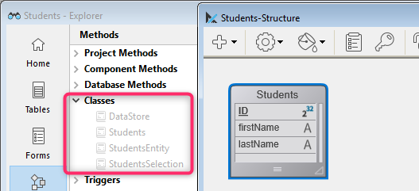

ORDA vous permet de créer des fonctions de classe de haut niveau au-dessus du modèle de données. Cela vous permet d'écrire du code orienté métier et de le «publier» comme une API. Le datastore, les dataclasses, les entity selections et les entités sont tous disponibles en tant qu'objets de classe pouvant contenir des fonctions.

Par exemple, vous pouvez créer une fonction `getNextWithHigherSalary()` dans la classe `EmployeeEntity` pour retourner les employés ayant un salaire supérieur à celui qui est sélectionné. Il serait aussi simple à appeler que :

```4d
$nextHigh:=ds.Employee.get(1).getNextWithHigherSalary()
```

Les développeurs peuvent utiliser ces fonctions non seulement dans des datastores locaux, mais aussi dans des architectures client/serveur et distantes :

```4d
 //$cityManager est la référence d'un datastore distant
Form.comp.city:=$cityManager.City.getCityName(Form.comp.zipcode)
```

Grâce à cette fonctionnalité, toute la logique métier de votre application 4D peut être stockée comme une couche indépendante afin d'être facilement maintenue ou réutilisée avec un niveau de sécurité élevé :

- Elle vous permet de «masquer» la complexité globale de la structure physique sous-jacente et d'exposer uniquement des fonctions compréhensibles et prêtes à l'emploi.

- Si la structure physique évolue, il vous suffit d'adapter le code de la fonction et les applications clientes continueront de les appeler de manière transparente.

- Par défaut, toutes les fonctions de classe de votre modèle de données (y compris [les fonctions des champs calculés](#computed-attributes)) ne sont pas exposées (**not exposed**) aux applications distantes et ne peuvent pas être appelées à partir de requêtes REST. Vous devez déclarer explicitement chaque fonction publique et alias avec le mot-clé [`exposed`](#exposed-vs-non-exposed-functions).


De plus, 4D [crée préalablement et automatiquement](#creating-classes) les classes pour chaque objet de modèle de données disponible.


## Architecture

ORDA fournit des **classes génériques** exposées via le [class store](Concepts/classes.md#class-stores) **`4D`**, ainsi que des **classes utilisateurs** (étendant les classes génériques) exposées dans le [class store](Concepts/classes.md#class-stores) **`cs`** :


Toutes les classes de modèle de données ORDA sont exposées en tant que propriétés du class store **`cs`**. Les classes ORDA suivantes sont disponibles :

| Class                       | Nom de l'exemple     | Instanciée par                                                                                                                                                                                                                                                                                                                                                                                                                                                                                                                                                                                                                                                                                                                                                                                                                                                         |
| --------------------------- | -------------------- | ---------------------------------------------------------------------------------------------------------------------------------------------------------------------------------------------------------------------------------------------------------------------------------------------------------------------------------------------------------------------------------------------------------------------------------------------------------------------------------------------------------------------------------------------------------------------------------------------------------------------------------------------------------------------------------------------------------------------------------------------------------------------------------------------------------------------------------------------------------------------- |
| cs.DataStore                | cs.DataStore         | commande [`ds`](API/DataStoreClass.md#ds)                                                                                                                                                                                                                                                                                                                                                                                                                                                                                                                                                                                                                                                                                                                                                                                                                              |
| cs.*DataClassName*          | cs.Employee          | [`dataStore.DataClassName`](API/DataStoreClass.md#dataclassname), `dataStore["DataClassName"]`                                                                                                                                                                                                                                                                                                                                                                                                                                                                                                                                                                                                                                                                                                                                                                         |
| cs.*DataClassName*Entity    | cs.EmployeeEntity    | [`dataClass.get()`](API/DataClassClass.md#get), [`dataClass.new()`](API/DataClassClass.md#new), [`entitySelection.first()`](API/EntitySelectionClass.md#first), [`entitySelection.last()`](API/EntitySelectionClass.md#last), [`entity.previous()`](API/EntityClass.md#previous), [`entity.next()`](API/EntityClass.md#next), [`entity.first()`](API/EntityClass.md#first), [`entity.last()`](API/EntityClass.md#last), [`entity.clone()`](API/EntityClass.md#clone)                                                                                                                                                                                                                                                                                                                                                                                                   |
| cs.*DataClassName*Selection | cs.EmployeeSelection | [`dataClass.query()`](API/DataClassClass.md#query), [`entitySelection.query()`](API/EntitySelectionClass.md#query), [`dataClass.all()`](API/DataClassClass.md#all), [`dataClass.fromCollection()`](API/DataClassClass.md#fromcollection), [`dataClass.newSelection()`](API/DataClassClass.md#newselection), [`entitySelection.drop()`](API/EntitySelectionClass.md#drop), [`entity.getSelection()`](API/EntityClass.md#getselection), [`entitySelection.and()`](API/EntitySelectionClass.md#and), [`entitySelection.minus()`](API/EntitySelectionClass.md#minus), [`entitySelection.or()`](API/EntitySelectionClass.md#or), [`entitySelection.orderBy()`](API/EntitySelectionClass.md#or), [`entitySelection.orderByFormula()`](API/EntitySelectionClass.md#orderbyformula), [`entitySelection.slice()`](API/EntitySelectionClass.md#slice), `Create entity selection` |

> Les classes utilisateur ORDA sont stockées sous forme de fichiers de classe standard (.4dm) dans le sous-dossier Classes du projet [(voir ci-dessous)](#class-files).

De plus, les instances d'objet de classes utilisateurs du modèles de données ORDA bénéficient des propriétés et fonctions de leurs parents:

- un objet de classe Datastore peut appeler des fonctions de la [classe générique ORDA Datastore](API/DataStoreClass.md).
- un objet de classe Dataclass peut appeler des fonctions de la [classe générique ORDA Dataclass](API/DataClassClass.md).
- un objet de classe Entity selection peut appeler des fonctions de la [classe générique ORDA Entity selection](API/EntitySelectionClass.md).
- un objet de classe Entity peut appeler des fonctions de la [classe générique ORDA Entity](API/EntityClass.md).


## Description de la classe

<details><summary>Historique</summary>

| Release | Modifications                                                                                                                    |
| ------- | -------------------------------------------------------------------------------------------------------------------------------- |
| 19 R4   | Attributs alias dans la classe Entity                                                                                            |
| 19 R3   | Attributs calculés dans la classe Entity                                                                                         |
| 18 R5   | Les fonctions des classes du modèle de données ne sont pas exposées par défaut en REST. Nouveaux mots-clés `exposed` et `local`. |
</details>


### Classe DataStore


Une base de données 4D expose sa propre classe DataStore dans le class store `cs`.

- **Extends**: 4D.DataStoreImplementation
- **Nom de classe** : cs.DataStore

Vous pouvez créer des fonctions dans la classe DataStore qui seront disponibles via l'objet `ds`.

#### Exemple

```4d  
// cs.DataStore class

Class extends DataStoreImplementation

Function getDesc
  $0:="Database exposing employees and their companies"
```


Cette foncton peut alors être appelée :

```4d
$desc:=ds.getDesc() //"Database exposing..."
```


### Classe DataClass

Chaque table exposée avec ORDA affiche une classe DataClass dans le class store `cs`.

- **Extends** : 4D.DataClass
- **Nom de classe **: cs.*DataClassName* (où *DataClassName* est le nom de la table)
- **Exemple ** : cs.Employee


#### Exemple

```4D
// cs.Company class


Class extends DataClass

// Retourne les entreprises dont le revenu est supérieur à la moyenne
// Retourne une sélection d'entités relative à l'entreprise DataClass 

Function GetBestOnes()
    $sel:=This.query("revenues >= :1";This.all().average("revenues"));
    $0:=$sel
```

Vous pouvez ensuite obtenir une sélection d'entité des "meilleures" entreprises en exécutant le code suivant :


```4d
    var $best : cs.CompanySelection
    $best:=ds.Company.GetBestOnes()
```

> [Les champs calculés](#computed-attributes) sont définis dans [la classe Entity](#entity-class).


#### Exemple avec un datastore distant

Le catalogue *City* suivant est exposé dans un datastore distant (vue partielle) :


La classe `City Class` fournit une API :

```4d  
// cs.City class

Class extends DataClass

Function getCityName()
    var $1; $zipcode : Integer
    var $zip : 4D.Entity
    var $0 : Text

    $zipcode:=$1
    $zip:=ds.ZipCode.get($zipcode)
    $0:="" 

    If ($zip#Null)
        $0:=$zip.city.name
    End if
```

L'application cliente ouvre une session sur le datastore distant :

```4d
$cityManager:=Open datastore(New object("hostname";"127.0.0.1:8111");"CityManager")
```

Une application cliente peut alors utiliser l'API pour obtenir la ville correspondant au code postal (par exemple) à partir d'un formulaire :

```4d
Form.comp.city:=$cityManager.City.getCityName(Form.comp.zipcode)

```


### Classe EntitySelection

Chaque table exposée avec ORDA affiche une classe EntitySelection dans le class store `cs`.

- **Extends** : 4D.EntitySelection
- **Nom de classe** : *DataClassName*Selection (où *DataClassName* est le nom de la table)
- **Exemple ** : cs.EmployeeSelection


#### Exemple

```4d
// Classe cs.EmployeeSelection 


Classe extends EntitySelection

//Extrait, de cette sélection d'entité, les employés ayant un salaire supérieur à la moyenne

Function withSalaryGreaterThanAverage
    C_OBJECT($0)
    $0:=This.query("salary > :1";This.average("salary")).orderBy("salary")

```

Vous pouvez alors obtenir les employés dont le salaire est supérieur à la moyenne, dans une sélection d'entité, en exécutant le code suivant :

```4d
$moreThanAvg:=ds.Company.all().employees.withSalaryGreaterThanAverage()
```

### Classe Entity

Chaque table exposée avec ORDA affiche une classe Entity dans le class store `cs`.

- **Extends** : 4D.Entity
- **Nom de classe **: *DataClassName*Entity (où *DataClassName* est le nom de la table)
- **Exemple ** : cs.CityEntity

#### Attributs calculés

Les classes Entity vous permettent de définir des **attributs calculés** à l'aide de mots-clés spécifiques :

- `Function get` *attributeName*
- `Function set` *attributeName*
- `Function query` *attributeName*
- `Function orderBy` *attributeName*

For information, please refer to the [Computed attributes](#computed-attributes-1) section.

#### Attributs de type alias

Entity classes allow you to define **alias attributes**, usually over related attributes, using the `Alias` keyword:

`Alias` *attributeName* *targetPath*

For information, please refer to the [Alias attributes](#alias-attributes-1) section.


#### Exemple

```4d
// cs.CityEntity class

Class extends Entity

Function getPopulation()
    $0:=This.zips.sum("population")


Function isBigCity(): Boolean
// La fonction getPopulation() est utilisable dans la classe
$0:=This.getPopulation()>50000
```

Vous pouvez ensuite appeler ce code :

```4d
var $cityManager; $city : Object

$cityManager:=Open datastore(New object("hostname";"127.0.0.1:8111");"CityManager")
$city:=$cityManager.City.getCity("Caguas")

If ($city.isBigCity())
    ALERT($city.name + " is a big city")
End if
```

### Règles spécifiques

Lors de la création ou de la modification de classes de modèles de données, vous devez veiller aux règles décrites ci-dessous :

- Puisqu'ils sont utilisés pour définir des noms de classe DataClass automatiques dans le [class store](Concepts/classes.md#class-stores) **cs**, les tables 4D doivent être nommées afin d'éviter tout conflit dans l'espace de nommage **cs**. En particulier :
    - Ne donnez pas le même nom à une table 4D et à une [classe d'utilisateurs](Concepts/classes.md#class-names) (user class). Si un tel cas se produit, le constructeur de la classe utilisateur devient inutilisable (un avertissement est retourné par le compilateur).
    - N'utilisez pas de nom réservé pour une table 4D (par exemple "DataClass").

- Lors de la définition d'une classe, assurez-vous que l'instruction [`Class extends`](Concepts/classes.md#class-extends-classnameclass) correspond exactement au nom de la classe parente (sensible à la casse). Par exemple, `Class extends EntitySelection` pour une classe de sélection d'entité.

- Vous ne pouvez pas instancier un objet de classe de modèle de données avec le mot clé `new()` (une erreur est retournée). Vous devez utiliser une des méthodes standard listées dans la colonne [`Instanciée par` du tableau des classes ORDA](#architecture).

- Vous ne pouvez pas remplacer une fonction de classe ORDA native du [class store](Concepts/classes.md#class-stores) **`4D`** par une fonction de classe utilisateur de modèle de données.


### Exécution préemptive

Lors de la compilation, les fonctions de classe du modèle de données sont exécutées :

- dans **des process préemptifs ou coopératifs** (en fonction du process appelant) dans des applications monoposte,
- dans **des process préemptifs** dans des applications client/serveur (sauf si le mot-clé [`local`](#local-functions) est utilisé, auquel cas il dépend du process appelant comme dans le cas d'un monoposte).

Si votre projet est conçu de façon à être exécuté en client/serveur, assurez-vous que le code de la fonction de classe du modèle de données est thread-safe. Si un code thread-unsafe est appelé, une erreur sera générée au moment de l'exécution (aucune erreur ne sera déclenchée au moment de la compilation puisque l'exécution coopérative est prise en charge dans les applications monoposte).


## Attributs calculés


### Vue d’ensemble

Un champ calculé est un attribut de dataclass avec un type de données qui masque un calcul. [Les classes 4D standard](Concepts/classes.md) implémentent le concept de propriétés calculées avec des [fonctions d'accès](Concepts/classes.md#function-get-and-function-set) telles que `get` (*getter*) et `set` (*setter*). Les attributs de dataclass ORDA bénéficient de cette fonctionnalité et l'étendent avec deux fonctions supplémentaires : `query` et `orderBy`.

Un champ calculé nécessite au minimum une fonction `get` qui décrit comment sa valeur sera calculée. Lorsqu'une fonction *getter* est fournie à un attribut, 4D ne crée pas l'espace de stockage sous-jacent dans le datastore mais substitue le code de la fonction chaque fois que l'attribut est accédé. Si l'attribut n'est pas consulté, le code ne s'exécute jamais.

Un champ calculé peut également mettre en œuvre une fonction `set`, qui s'exécute chaque fois qu'une valeur est attribuée à l'attribut. La fonction *setter* décrit ce qui est à faire avec la valeur attribuée, généralement en la redirigeant vers un ou plusieurs attributs de stockage ou, dans certains cas, vers d'autres entités.

Tout comme les champs de stockage, les champs calculés peuvent être inclus dans les **requêtes**. Par défaut, lorsqu'un champ calculé est utilisé dans une requête ORDA, il est calculé une fois par entité examinée. Dans certains cas, cela est suffisant. . Cependant, pour de meilleures performances, notamment en client/serveur, les champs calculés peuvent implémenter une fonction de requête `query` qui s'appuie sur les attributs des dataclass et qui bénéficie de leurs index.

De même, les champs calculés peuvent être inclus dans des **tris**. Lorsqu'un champ calculé est utilisé dans un tri ORDA, l'attribut est calculé une fois par entité examinée. Tout comme dans les requêtes, les champs calculés peuvent mettre en œuvre une fonction `orderBy` qui substitue d'autres attributs pendant le tri, améliorant ainsi les performances.


### Comment définir les attributs calculés

Créez un champ calculé en définissant un accesseur `get` dans la [**classe entity**](#entity-class) de la dataclass. L'attribut calculé sera automatiquement disponible dans les attributs de la dataclass et dans les attributs de l'entité.

D'autres fonctions de champs calculés (`set`, `query` et `orderBy`) peuvent également être définies dans la classe entity. Elles sont facultatives.

Dans les fonctions de champs calculés, [`This`](Concepts/classes.md#this) désigne l'entité. Les attributs calculés peuvent être utilisés et traités comme n'importe quel attribut de dataclass, c'est-à-dire qu'ils seront traités par les fonctions de [classe entity](API/EntityClass.md) ou de [classe entity selection](API/EntitySelectionClass.md).

> Les attributs calculés d'ORDA ne sont pas exposés ([**exposed**](#exposed-vs-non-exposed-functions)) par défaut. Exposez un champ calculé en ajoutant le mot-clé `exposed` lors de la définition de la fonction **get**.

> **Les fonctions get et set** peuvent avoir la propriété [**local**](#local-functions) pour optimiser le traitement client/serveur.


### `Function get <attributeName>`

#### Syntaxe

```4d
{local} {exposed} Function get <attributeName>({$event : Object}) -> $result : type
// code
```
La fonction *getter* est obligatoire pour déclarer le champ calculé *attributeName*. Chaque fois que l'on accède à l'*attributeName*, 4D évalue le code de la fonction `getter` et retourne la valeur *$result*.

> Un attribut calculé peut utiliser la valeur d'un ou plusieurs autres attributs calculés. Les appels récursifs génèrent des erreurs.

La fonction *getter* définit le type de données du champ calculé grâce au paramètre *$result*. Les types de résultats suivants sont autorisés :

- Scalar (text, boolean, date, time, number)
- Object
- Image
- BLOB
- Entity (i.e. cs.EmployeeEntity)
- Entity selection (i.e. cs.EmployeeSelection)

Les propriétés du paramètre *$event* sont les suivantes :

| Propriété     | Type    | Description                                                                                                   |
| ------------- | ------- | ------------------------------------------------------------------------------------------------------------- |
| attributeName | Text    | Nom de l'attribut calculé                                                                                     |
| dataClassName | Text    | Nom de la dataclass                                                                                           |
| kind          | Text    | "get"                                                                                                         |
| Résultat      | Variant | Optionnel. Complétez cette propriété avec la valeur Null si vous souhaitez qu'un champ scalaire retourne Null |


#### Exemples

- L'attribut calculé *fullName* :

```4d
Function get fullName($event : Object)-> $fullName : Text

  Case of   
    : (This.firstName=Null) & (This.lastName=Null)
        $event.result:=Null //utiliser le résultat pour retourner Null
    : (This.firstName=Null)
        $fullName:=This.lastName
    : (This.lastName=Null)
        $fullName:=This.firstName
    Else 
        $fullName:=This.firstName+" "+This.lastName
    End case 
```

- Un attribut calculé peut être basé sur un attribut relatif à une entité :

```4d
Function get bigBoss($event : Object)-> $result: cs.EmployeeEntity
    $result:=This.manager.manager

```

- Un attribut calculé peut être basé sur un attribut relatif à une entity selection :

```4d
Function get coWorkers($event : Object)-> $result: cs.EmployeeSelection
    If (This.manager.manager=Null)
        $result:=ds.Employee.newSelection()
    Else 
        $result:=This.manager.directReports.minus(this)
    End if
```

### `Function set <attributeName>`


#### Syntaxe

```4d

{local} Function set <attributeName>($value : type {; $event : Object})
// code
```

La fonction *setter* s'exécute chaque fois qu'une valeur est attribuée à l'attribut. Cette fonction traite généralement la ou les valeurs d'entrée et le résultat est réparti entre un ou plusieurs autres attributs.

Le paramètre *$value* reçoit la valeur attribuée à l'attribut.

Les propriétés du paramètre *$event* sont les suivantes :

| Propriété     | Type    | Description                           |
| ------------- | ------- | ------------------------------------- |
| attributeName | Text    | Nom de l'attribut calculé             |
| dataClassName | Text    | Nom de la dataclass                   |
| kind          | Text    | "set"                                 |
| value         | Variant | Valeur à gérer par l'attribut calculé |

#### Exemple

```4d
Function set fullName($value : Text; $event : Object)
    var $p : Integer
    $p:=Position(" "; $value)       
    This.firstname:=Substring($value; 1; $p-1)  // "" if $p<0
    This.lastname:=Substring($value; $p+1)
```


### `Function query <attributeName>`

#### Syntaxe

```4d
Function query <attributeName>($event : Object)
Function query <attributeName>($event : Object) -> $result : Text
Function query <attributeName>($event : Object) -> $result : Object
// code
```

Cette fonction prend en charge trois syntaxes :

- Avec la première syntaxe, vous traitez l'ensemble de la requête via la propriété de l'objet objet `$event.result`.
- Avec les deuxième et troisième syntaxes, la fonction retourne une valeur dans *$result* :
    - Si *$result* est Text, il doit s'agir d'une chaîne de requête valide
    - Si *$result* est Object, il doit contenir deux propriétés :

    | Propriété          | Type       | Description                                               |
    | ------------------ | ---------- | --------------------------------------------------------- |
    | $result.query      | Text       | Chaîne de requête valide avec placeholders (:1, :2, etc.) |
    | $result.parameters | Collection | valeurs pour placeholders                                 |

La fonction `query` s'exécute à chaque fois qu'une requête utilisant le champ calculé est lancée. Il est utile de personnaliser et d'optimiser les requêtes en s'appuyant sur les attributs indexés. Lorsque la fonction `query` n'est pas implémentée pour un champ calculé, la recherche est toujours séquentielle (basée sur l'évaluation de toutes les valeurs à l'aide de la fonction `get <AttributeName>`).

> The following features are not supported: - calling a `query` function on computed attributes of type Entity or Entity selection, - using the `order by` keyword in the resulting query string.

Les propriétés du paramètre *$event* sont les suivantes :

| Propriété     | Type    | Description                                                                                                                                                                                                                                                                                                                                                                        |
| ------------- | ------- | ---------------------------------------------------------------------------------------------------------------------------------------------------------------------------------------------------------------------------------------------------------------------------------------------------------------------------------------------------------------------------------- |
| attributeName | Text    | Nom de l'attribut calculé                                                                                                                                                                                                                                                                                                                                                          |
| dataClassName | Text    | Nom de la dataclass                                                                                                                                                                                                                                                                                                                                                                |
| kind          | Text    | "query"                                                                                                                                                                                                                                                                                                                                                                            |
| value         | Variant | Valeur à gérer par l'attribut calculé                                                                                                                                                                                                                                                                                                                                              |
| operator      | Text    | Opérateur de requête (voir également la fonction de classe [`query`](API/DataClassClass.md#query)). Valeurs possibles :<li>== (égal à, @ est un joker)</li><li>=== (égal à, @ n'est pas un joker)</li><li>!= (non égal à, @ est un joker)</li><li>!== (non égal à, @ n'est pas un joker)</li><li>< (inférieur à)</li><li><= (less than or equal to)</li><li>> (supérieur à)</li><li>>= (supérieur ou égal à)</li><li>IN (inclus dans)</li><li>% (contient un mot-clé)</li> |
| Résultat      | Variant | Valeur devant être gérée par le champ calculé. Passez `Null` dans cette propriété si vous voulez laisser 4D exécuter la requête par défaut (toujours séquentielle pour les champs calculés).                                                                                                                                                                                       |

> Si la fonction retourne une valeur dans *$result* et qu'une autre valeur est attribuée à la propriété `$event.result`, la priorité est donnée à `$event.result`.

#### Exemples

- Requête sur le champ calculé *fullName*.

```4d
Function query fullName($event : Object)->$result : Object

    var $fullname; $firstname; $lastname; $query : Text
    var $operator : Text
    var $p : Integer
    var $parameters : Collection

    $operator:=$event.operator
    $fullname:=$event.value

    $p:=Position(" "; $fullname) 
    If ($p>0)
        $firstname:=Substring($fullname; 1; $p-1)+"@"
        $lastname:=Substring($fullname; $p+1)+"@"
        $parameters:=New collection($firstname; $lastname) //collection de deux éléments
    Else 
        $fullname:=$fullname+"@"
        $parameters:=New collection($fullname) // collection d'un seul élément
    End if 

    Case of 
    : ($operator="==") | ($operator="===")
        If ($p>0)
            $query:="(firstName = :1 and lastName = :2) or (firstName = :2 and lastName = :1)"
        Else 
            $query:="firstName = :1 or lastName = :1"
        End if 
    : ($operator="!=")
        If ($p>0)
            $query:="firstName != :1 and lastName != :2 and firstName != :2 and lastName != :1"
        Else 
            $query:="firstName != :1 and lastName != :1"
        End if 
    End case 

    $result:=New object("query"; $query; "parameters"; $parameters)
```

> A noter que l'utilisation de placeholders dans les requêtes basées sur la saisie de texte par l'utilisateur est recommandée pour des raisons de sécurité (voir la description de [`query()`](API/DataClassClass.md#query)).

Code d'appel, par exemple :

```4d
$emps:=ds.Employee.query("fullName = :1"; "Flora Pionsin")
```

- Cette fonction gère les requêtes sur le champ calculé *age* et retourne un objet avec des paramètres :

```4d
Function query age($event : Object)->$result : Object

    var $operator : Text
    var $age : Integer
    var $_ages : Collection

    $operator:=$event.operator

    $age:=Num($event.value)  // entier
    $d1:=Add to date(Current date; -$age-1; 0; 0)
    $d2:=Add to date($d1; 1; 0; 0)
    $parameters:=New collection($d1; $d2)

    Case of 

        : ($operator="==")
            $query:="birthday > :1 and birthday <= :2"  // après jour1 et avant ou égal à jour2

        : ($operator="===") 

            $query:="birthday = :2"  // d2 = deuxième date calculée (= jour anniversaire)

        : ($operator=">=")
            $query:="birthday <= :2"

            //... autres opérateurs           


    End case 


    If (Undefined($event.result))
        $result:=New object
        $result.query:=$query
        $result.parameters:=$parameters
    End if

```

Code d'appel, par exemple :

```4d
// personnes âgées de 20 à 21 ans (-1 jour)
$twenty:=people.query("age = 20")  // appelle le cas "=="

// personnes âgées de 20 ans aujourd'hui
$twentyToday:=people.query("age === 20") // équivalent à people.query("age is 20") 

```


### `Function orderBy <attributeName>`

#### Syntaxe

```4d
Function orderBy <attributeName>($event : Object)
Function orderBy <attributeName>($event : Object)-> $result : Text

// code
```

La fonction `orderBy` s'exécute chaque fois que le champ calculé doit être ordonné. Elle permet de trier l'attribut calculé. Par exemple, vous pouvez trier *fullName* sur les prénoms puis les noms, ou inversement. Lorsque la fonction `orderBy` n'est pas implémentée pour un champ calculé, le tri est toujours séquentiel (basé sur l'évaluation de toutes les valeurs à l'aide de la fonction `get <AttributeName>`).

> L'appel d'une fonction `orderBy` sur des champs calculés de type Entity class ou Entity selection class **n'est pas pris en charge**.

Les propriétés du paramètre *$event* sont les suivantes :

| Propriété     | Type    | Description                                                                                                        |
| ------------- | ------- | ------------------------------------------------------------------------------------------------------------------ |
| attributeName | Text    | Nom de l'attribut calculé                                                                                          |
| dataClassName | Text    | Nom de la dataclass                                                                                                |
| kind          | Text    | "orderBy"                                                                                                          |
| value         | Variant | Valeur à gérer par l'attribut calculé                                                                              |
| operator      | Text    | "desc" or "asc" (default)                                                                                          |
| descending    | Boolean | `true` pour l'ordre décroissant, `false` pour l'ordre croissant                                                    |
| Résultat      | Variant | Valeur devant être gérée par le champ calculé. Passez `Null` si vous voulez laisser 4D exécuter le tri par défaut. |

> Vous pouvez utiliser soit `l'opérateur`, soit la propriété `descending`. C'est essentiellement une question de style de programmation (voir les exemples).

Vous pouvez retourner la chaîne `orderBy` soit dans la propriété de l'objet `$event.result`, soit dans le résultat de la fonction *$result*. Si la fonction retourne une valeur dans *$result* et qu'une autre valeur est attribuée à la propriété `$event.result`, la priorité est donnée à `$event.result`.


#### Exemple

Vous pouvez saisir du code conditionnel :

```4d
Function orderBy fullName($event : Object)-> $result : Text
    If ($event.descending=True)
        $result:="firstName desc, lastName desc" 
    Else 
        $result:="firstName, lastName" 
    End if
```

Vous pouvez également saisir du code compact :

```4d
Function orderBy fullName($event : Object)-> $result : Text
    $result:="firstName "+$event.operator+", "lastName "+$event.operator

```

Le code conditionnel est nécessaire dans certains cas :

```4d
Function orderBy age($event : Object)-> $result : Text

    If ($event.descending=True)
        $result:="birthday asc" 
    Else 
        $result:="birthday desc" 
    End if

```


## Attributs de type alias

### Vue d’ensemble

Un attribut **alias** est construit au-dessus d'un autre attribut du modèle de données, nommé attribut **cible**. L'attribut cible peut appartenir à une dataclass liée (accessible via n'importe quel niveau de relation) ou à la même dataclass. Un attribut alias ne stocke aucune donnée, mais uniquement le chemin vers son attribut cible. Vous pouvez définir autant d'attributs alias que vous le souhaitez dans une dataclass.

Les attributs Alias sont particulièrement utiles pour gérer les relations N vers N. Ils apportent plus de lisibilité et de simplicité dans le code et dans les recherches en permettant de s'appuyer sur des concepts métier plutôt que sur des détails d'implémentation.

### Comment définir des attributs alias

You create an alias attribute in a dataclass by using the `Alias` keyword in the [**entity class**](#entity-class) of the dataclass.


### `Alias <attributeName> <targetPath>`


#### Syntaxe

```
{exposed} Alias <attributeName> <targetPath>
```

*attributeName* must comply with [standard rules for property names](../Concepts/identifiers.md#object-properties).

*targetPath* is an attribute path containing one or more levels, such as "employee.company.name". If the target attribute belongs to the same dataclass, *targetPath* is the attribute name.

Un alias peut être utilisé comme partie d'un chemin d'un autre alias.

A [computed attribute](#computed-attributes-1) can be used in an alias path, but only as the last level of the path, otherwise, an error is returned. Par exemple, si "fullName" est un attribut calculé, un alias avec le chemin "employee.fullName" est valide.

> ORDA alias attributes are **not exposed** by default. You must add the [`exposed`](#exposed-vs-non-exposed-functions) keyword before the `Alias` keyword if you want the alias to be available to remote requests.


### Utiliser les attributs alias

Les attributs alias sont en lecture seule (sauf lorsqu'ils sont basés sur un attribut scalaire de la même dataclass, voir le dernier exemple ci-dessous). Ils peuvent être utilisés à la place de leur chemin d'attribut cible dans les fonctions ORDA telles que :

| Function                                       |
| ---------------------------------------------- |
| `dataClass.query()`, `entitySelection.query()` |
| `entity.toObject()`                            |
| `entitySelection.toCollection()`               |
| `entitySelection.extract()`                    |
| `entitySelection.orderBy()`                    |
| `entitySelection.orderByFormula()`             |
| `entitySelection.average()`                    |
| `entitySelection.count()`                      |
| `entitySelection.distinct()`                   |
| `entitySelection.sum()`                        |
| `entitySelection.min()`                        |
| `entitySelection.max()`                        |
| `entity.diff()`                                |
| `entity.touchedAttributes()`                   |

> Gardez à l'esprit que les attributs alias sont calculés sur le serveur. Dans les configurations à distance, la mise à jour des attributs d'alias dans les entités nécessite que les entités soient rechargées à partir du serveur.

### Propriétés des alias

Alias attribute [`kind`](../API/DataClassClass.md#attributename) is "alias".

An alias attribute inherits its data [`type`](../API/DataClassClass.md#attributename) property from the target attribute:

- if the target attribute [`kind`](../API/DataClassClass.md#attributename) is "storage", the alias data type is of the same type,
- if the target attribute [`kind`](../API/DataClassClass.md#attributename) is "relatedEntity" or "relatedEntities", the alias data type is of the `4D.Entity` or `4D.EntitySelection` type ("*classname*Entity" or "*classname*Selection").

Alias attributes based upon relations have a specific [`path`](../API/DataClassClass.md#attributename) property, containing the path of their target attributes. Alias attributes based upon attributes of the same dataclass have the same properties as their target attributes (and no `path` property).


### Exemples

Considérant le modèle suivant :


Dans la dataclasse Teacher, un attribut alias renvoie tous les élèves d'un enseignant :

```4d
// cs.TeacherEntity class

Class extends Entity

Alias students courses.student //relatedEntities 
```

Dans la dataclass Student, un attribut alias renvoie tous les enseignants d'un élève:


```4d
// cs.StudentEntity class

Class extends Entity

Alias teachers courses.teacher //relatedEntities 
```

Dans la dataclass Course :

- un attribut alias renvoie une autre libellé pour l'attribut "name"
- un attribut alias renvoie le nom de l'enseignant
- un attribut alias renvoie le nom de l'étudiant


```4d
// cs.CourseEntity class

Class extends Entity

Exposed Alias courseName name //scalar 
Exposed Alias teacherName teacher.name //scalar value
Exposed Alias studentName student.name //scalar value

```

Vous pouvez alors exécuter les recherches suivantes :

```4d
// Trouver le cours nommé "Archaeology"
ds.Course.query("courseName = :1";"Archaeology")

// Trouver les cours donnés par le professeur Smith
ds.Course.query("teacherName = :1";"Smith")

// Trouver des cours auxquels l'étudiant "Martin" assiste
ds.Course.query("studentName = :1";"Martin")

// Trouver des étudiants qui ont M. Smith en tant qu'enseignant 
ds.Student.query("teachers.name = :1";"Smith")

// Trouver des enseignants qui ont M. Martin comme étudiant
ds.Teacher.query("students.name = :1"; Martin")
// Notez que cette chaîne de recherche très simple traite une requête complexe 
// incluant une double jointure, comme vous pouvez le voir dans le queryPlan:   
// "Join on Table: Course : Teacher.ID = Course.teacherID,    
// subquery:[ Join on Table : Student: Course.studentID = Student.ID,
// subquery:[ Student.name === Martin]]"
```


Vous pouvez également modifier la valeur de l'alias *courseName*:

```4d
// Renommer un cours en utilisant son attribut alias
$arch:=ds.Course.query("courseName = :1";"Archaeology")
$arch.courseName:="Archaeology II"
$arch.save() //courseName et name sont "Archaeology II"
```


## Fonctions exposées et non exposées

For security reasons, all of your data model class functions and alias attributes are **not exposed** (i.e., private) by default to remote requests.

Les requêtes à distance incluent :

- Les requêtes envoyées par des applications 4D distantes connectées via `Open datastore`
- Les requêtes REST

> Les requêtes client/serveur 4D standard ne sont pas impactées. Les fonctions de classe de modèle de données sont toujours disponibles dans cette architecture.

Une fonction qui n'est pas exposée n'est pas disponible sur les applications distantes et ne peut être appelée sur aucune instance d'objet à partir d'une requête REST. Si une application distante tente d'accéder à une fonction non exposée, l'erreur «-10729 - Méthode membre inconnue» est retournée.

Pour permettre à une fonction de classe de modèle de données d'être appelée par une requête distante, vous devez la déclarer explicitement à l'aide du mot-clé `exposed`. La syntaxe formelle est la suivante :

```4d  
// déclarer une fonction exposée
exposed Function <functionName>   
```

> Le mot-clé `exposed` ne peut être utilisé qu'avec les fonctions de classe du modèle de données. S'il est utilisé avec une fonction de [classe utilisateur standard](Concepts/classes.md), il est ignoré et une erreur est retournée par le compilateur.

### Exemple

Vous voulez qu'une fonction exposée utilise une fonction privée dans une classe dataclass :

```4d
Class extends DataClass

//Fonction publique
exposed Function registerNewStudent($student : Object) -> $status : Object

var $entity : cs.StudentsEntity

$entity:=ds.Students.new()
$entity.fromObject($student)
$entity.school:=This.query("name=:1"; $student.schoolName).first()
$entity.serialNumber:=This.computeSerialNumber()
$status:=$entity.save()

//fonction (privée) non exposée
Function computeIDNumber()-> $id : Integer
//calculer un nouveau numéro d'ID
$id:=...

```

Lorsque le code est appelé :

```4d
var $remoteDS; $student; $status : Object
var $id : Integer

$remoteDS:=Open datastore(New object("hostname"; "127.0.0.1:8044"); "students")
$student:=New object("firstname"; "Mary"; "lastname"; "Smith"; "schoolName"; "Math school")

$status:=$remoteDS.Schools.registerNewStudent($student) // OK
$id:=$remoteDS.Schools.computeIDNumber() // Erreur "Unknown member method" 
```


## Fonctions locales

Par défaut dans l'architecture client/serveur, les fonctions de modèle de données ORDA sont exécutées **sur le serveur**. Cela garantit généralement les meilleures performances puisque seuls la requête de fonction et le résultat sont envoyés sur le réseau.

Cependant, il peut arriver qu'une fonction soit entièrement exécutable côté client (par exemple, lorsqu'elle traite des données qui se trouvent déjà dans le cache local). Dans ce cas, vous pouvez économiser des requêtes au serveur et ainsi améliorer les performances de l'application en saisissant le mot-clé `local`. La syntaxe formelle est la suivante :

```4d  
// déclarer une fonction à exécuter localement en client/serveur 
local Function <functionName>   
```

Avec ce mot-clé, la fonction sera toujours exécutée côté client.

> Le mot-clé `local` ne peut être utilisé qu'avec les fonctions de classe du modèle de données. S'il est utilisé avec une fonction de [classe utilisateur standard](Concepts/classes.md), il est ignoré et une erreur est retournée par le compilateur.

A noter que la fonction sera exécutée avec succès même si elle nécessite d'accéder au serveur (par exemple si le cache ORDA est expiré). Toutefois, il est fortement recommandé de s'assurer que la fonction locale n'accède pas aux données sur le serveur, sinon l'exécution locale pourrait n'apporter aucun avantage en termes de performances. Une fonction locale qui génère de nombreuses requêtes au serveur est moins efficace qu'une fonction exécutée sur le serveur qui ne retournerait que les valeurs résultantes. Prenons l'exemple suivant, avec une fonction sur l'entité Schools :

```4d
// Obtenir les élèves les plus jeunes  
// Utilisation inappropriée du mot-clé local
local Function getYoungest
    var $0 : Object
    $0:=This.students.query("birthDate >= :1"; !2000-01-01!).orderBy("birthDate desc").slice(0; 5)
```
- **sans** le mot clé `local`, le résultat est donné en une seule requête
- **avec** le mot-clé `local`, 4 requêtes sont nécessaires : une pour obtenir les élèves de l'entité Schools, une pour la `query()`, une pour le `orderBy()` et une pour la `slice()`. Dans cet exemple, l'utilisation du mot-clé `local` est inappropriée.


### Exemples

#### Calcul de l'âge

Considérons une entité avec un attribut *birthDate*. Nous souhaitons définir une fonction `age()` qui serait appelée dans une list box. Cette fonction peut être exécutée sur le client, ce qui évite de déclencher une requête au serveur pour chaque ligne de la list box.

Dans la classe *StudentsEntity* :

```4d
Class extends Entity

local Function age() -> $age: Variant

If (This.birthDate#!00-00-00!)
    $age:=Year of(Current date)-Year of(This.birthDate)
Else 
    $age:=Null
End if
```

#### Vérification des attributs

Nous souhaitons vérifier la cohérence des attributs d'une entité chargée sur le client et mise à jour par l'utilisateur, avant de demander au serveur de les enregistrer.

Sur la classe *StudentsEntity*, la fonction locale `checkData()` vérifie l'âge de l'étudiant :

```4d
Class extends Entity

local Function checkData() -> $status : Object

$status:=New object("success"; True)
Case of
    : (This.age()=Null)
        $status.success:=False
        $status.statusText:="The birthdate is missing" 

    :((This.age() <15) | (This.age()>30) )
        $status.success:=False
        $status.statusText:="The student must be between 15 and 30 - This one is "+String(This.age())
End case
```

Code d'appel :

```4d
var $status : Object

//Form.student est chargé avec tous ses a attributs et mis à jour sur un Form
$status:=Form.student.checkData()
If ($status.success)
    $status:=Form.student.save() // appelle le serveur
End if
```


## Prise en charge dans l'IDE 4D


### Fichiers de classe (class files)

Une classe utilisateur ORDA de modèle de données est définie en ajoutant, au [même emplacement que les fichiers de classe usuels](Concepts/classes.md#class-files) (c'est-à-dire dans le dossier `/Sources/Classes` du dossier projet), un fichier .4dm avec le nom de la classe. Par exemple, une classe d'entité pour la dataclass `Utilities` sera définie via un fichier `UtilitiesEntity.4dm`.


### Créer des classes

4D crée préalablement et automatiquement des classes vides en mémoire pour chaque objet de modèle de données disponible.




> Par défaut, les classes ORDA vides ne sont pas affichées dans l'Explorateur. Vous devez les afficher en sélectionnant **Afficher toutes les dataclasses** dans le menu d'options de l'Explorateur : 

Les classes utilisateurs ORDA ont une icône différente des autres classes. Les classes vides sont grisées :


Pour créer un fichier de classe ORDA, il vous suffit de double-cliquer sur la classe prédéfinie correspondante dans l'Explorateur. 4D crée le fichier de classe et ajoute le code `extends`. Par exemple, pour une classe Entity :

```
Class extends Entity
```

Une fois qu'une classe est définie, son nom n'est plus grisé dans l'Explorateur.


### Modifier des classes

To open a defined ORDA class in the 4D Code Editor, select or double-click on an ORDA class name and use **Edit...** from the contextual menu/options menu of the Explorer window:


Pour les classes ORDA basées sur le datastore local (`ds`), vous pouvez accéder directement au code de la classe depuis la fenêtre de 4D Structure :


### Éditeur de code

Dans l'éditeur de code 4D, les variables typées en tant que classe ORDA bénéficient automatiquement des fonctions d'auto-complétion. Exemple avec une variable de classe Entity :


