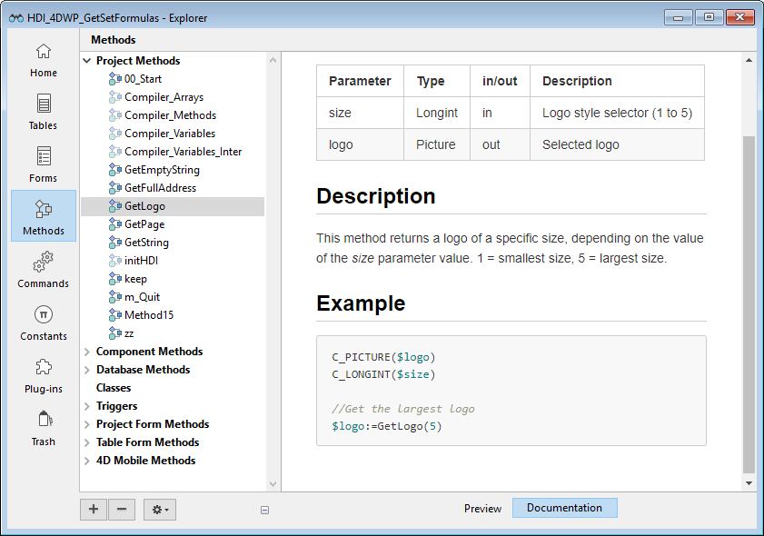
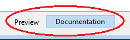

Dans les projets d'application, vous pouvez documenter vos méthodes ainsi que vos classes, formulaires, tables ou champs. La création d'une documentation est particulièrement appropriée pour les projets développés par plusieurs programmeurs et s'inscrit généralement dans les bonnes pratiques en matière de programmation. La documentation peut contenir la description d'un élément ainsi que toute information nécessaire pour comprendre comment l'élément fonctionne dans l'application.

Les éléments de projet suivants peuvent être documentés :

- Méthodes (méthodes base, méthodes composants, méthodes projet, méthodes formulaire, méthodes 4D Mobile et triggers)
- Classes
- Formulaires
- Tables et champs

Vos fichiers de documentation sont écrits dans la syntaxe Markdown (fichiers .md) à l'aide de n'importe quel éditeur prenant en charge le Markdown. Ils sont stockés en tant que fichiers indépendants dans votre dossier Project.

La documentation s'affiche dans la zone d'aperçu (panneau de droite) de l'Explorateur :



Il peut également être partiellement exposé en tant que [conseils de l'éditeur de code](#viewing-documentation-in-the-code-editor).


## Fichiers documentation

### Nom du fichier de documentation

Les fichiers de documentation ont le même nom que l'élément auquel ils sont rattachés, avec l'extension ".md". Par exemple, le fichier de documentation rattaché à la méthode projet `myMethod.4dm` sera nommé `myMethod.md`.

Dans l'Explorateur, 4D affiche automatiquement le fichier de documentation avec le même nom que l'élément sélectionné (voir ci-dessous).


### Architecture des fichiers de documentation

Tous les fichiers de documentation sont stockés dans le dossier `Documentation`, situé au premier niveau du dossier Package.

L'architecture du dossier `Documentation` est la suivante :

- `Documentation`
    + `Classes`
        * myClass.md
    + `DatabaseMethods`
        * onStartup.md
        * ...
    + `Formulaires`
        * loginDial.md
        * ...
    + `Methods`
        * myMethod.md
        * ...
    + `TableForms`
        * **1**
            - input.md
            - ...
        * ...
    + `Triggers`
        * table1.md
        * ...

- Un formulaire projet et sa méthode de formulaire projet partagent le même fichier de documentation pour le formulaire et la méthode.
- Un formulaire table et sa méthode de formulaire table partagent le même fichier de documentation pour le formulaire et la méthode.

> Renommer ou supprimer un élément documenté dans votre projet renomme ou supprime également le fichier Markdown associé à l'élément.


## Documentation dans l'Explorateur

### Visualiser la documentation

Pour afficher la documentation dans la fenêtre de l'Explorateur :

1. Assurez-vous que la zone d'aperçu est affichée.
2. Sélectionnez l'élément documenté dans la liste de l'Explorateur.
3. Cliquez sur le bouton **Documentation** situé sous la zone d'aperçu.



- Si aucun fichier de documentation n'a été trouvé pour l'élément sélectionné, un bouton **Créer** s'affiche (voir ci-dessous).

- Sinon, s'il existe un fichier de documentation pour l'élément sélectionné, le contenu est affiché dans la zone. Le contenu n'est pas directement modifiable dans le volet.

### Modifier le fichier documentation

Vous pouvez créer et/ou modifier un fichier de documentation Markdown à partir de la fenêtre de l'Explorateur pour l'élément sélectionné.

S'il n'y a pas de fichier de documentation pour l'élément sélectionné, vous pouvez :

- cliquez sur le bouton **Créer** dans le volet `Documentation` ou,
- choisissez l'option **Modifier la documentation...** dans le menu contextuel ou le menu d'options de l'Explorateur.


4D crée automatiquement un fichier .md nommé correctement avec un modèle de base à l'emplacement approprié et l'ouvre avec votre éditeur Markdown par défaut.

Si un fichier de documentation existe déjà pour l'élément sélectionné, vous pouvez l'ouvrir avec votre éditeur Markdown en choisissant l'option **Modifier la documentation...** dans le menu contextuel ou le menu d'options de l'Explorateur.


## Visualiser la documentation dans l'éditeur de code

L'éditeur de code 4D affiche une partie de la documentation d'une méthode dans son info-bulle.


Si un fichier nommé `\&#060;MethodName&#062 ;.md` existe dans le dossier `\&#060;package&#062;/documentation` , l'éditeur de code affiche (par priorité) :

- Tout texte saisi dans une balise de commentaire HTML (`<!-- documentation commande -->`) en haut du fichier markdown.

- Ou, si aucune balise de commentaire html n'est utilisée, la première phrase après une balise `# Description` du fichier markdown.  
  Dans ce cas, la première ligne contient le **prototype ** de la méthode, généré automatiquement par l'analyseur de code 4D.

:::note

Sinon, l'éditeur de code affiche [le bloc de commentaire en haut du code de la méthode](../code-editor/write-class-method.md#using-help-tips).

:::


## Définition du fichier de documentation

4D utilise un modèle de base pour créer de nouveaux fichiers de documentation. Ce modèle propose des fonctionnalités spécifiques qui vous permettent [d'afficher des informations dans l'éditeur de code](#viewing-documentation-in-the-code-editor).

Cependant, vous pouvez utiliser toutes les [balises Markdown prises en charge](#supported-markdown).

De nouveaux fichiers de documentation sont créés avec les contenus par défaut suivants :


| Ligne                                   | Description                                                                                                                                                                                            |
| --------------------------------------- | ------------------------------------------------------------------------------------------------------------------------------------------------------------------------------------------------------ |
| `<!-- Type here your summary -->` | Commentaire HTML. Utilisé en priorité comme description de méthode dans les [infobulles de l'éditeur de code](#viewing-documentation-in-the-code-editor)                                               |
| ## Description                         | Titre de niveau 2 en Markdown. La première phrase qui suit cette balise est utilisée comme description d'une méthode dans les infobulles de l'éditeur de code si le commentaire HTML n'est pas utilisé |
| ## Example                             | Titre de niveau 2, vous pouvez utiliser cette zone pour afficher un exemple de code                                                                                                                    |
| ` ```4d Type here your example``` `     | Utilisé pour formater des exemples de code 4D (utilise la bibliothèque highlight.js)                                                                                                                   |


### Prise en charge du markdown
- La balise de titre est prise en charge :

```md
# Title 1
## Title 2
### Title 3
```

- Les balises de style (italique, gras, barré) sont prises en charge :

```md
_italic_
**bold**
**_bold/italic_**
~~strikethrough~~
```


- La balise de bloc de code (\```4d ... ```) est prise en charge avec le formatage du code 4D :

````md
```4d
    var $txt : Text
    $txt:="Hello world!"  
```
````
- La balise de tableau est prise en charge :

```md
| Parameter | Type   | Description  |
| --------- | ------ | ------------ |
| wpArea    | Text |Write pro area|
| toolbar   | Text |Toolbar name  |
```


- La balise de lien est prise en charge :

```md
// Case 1
La [documentation](https://doc.4d.com) de la commande ...

// Case 2
[4D blog][1]

[1]: https://blog.4d.com
```

- Les balises d'image sont prises en charge :

```md


[](https://blog.4d.com)
```
[](https://blog.4d.com)

> Pour plus d'informations, consultez le [guide Markdown de GitHub](https://guides.github.com/features/mastering-markdown/).


## Exemple

Dans le fichier `WP SwitchToolbar.md`, vous pouvez écrire :

````md
<!-- This method returns a different logo depending on the size parameter -->


GetLogo (size) -> logo


| Parameter | Type   | in/out | Description |
| --------- | ------ | ------ | ----------- |
| size      | Integer | in | Logo style selector (1 to 5)  |
| logo      | Picture | out | Selected logo |


## Description

This method returns a logo of a specific size, depending on the value of the *size* parameter.
1 = smallest size, 5 = largest size.

## Example

```4d
C_PICTURE($logo)
C_LONGINT($size)

//Get the largest logo
$logo:=GetLogo(5)
```
````

- Vue de l'explorateur :


- Vue de l'éditeur de code :

