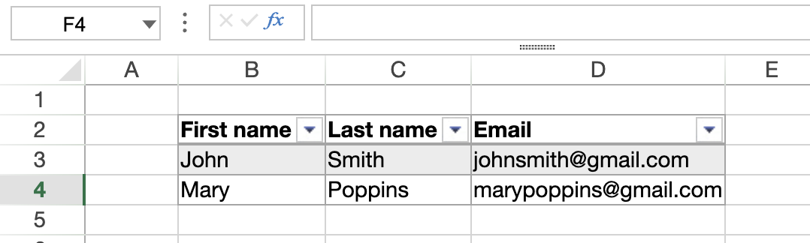
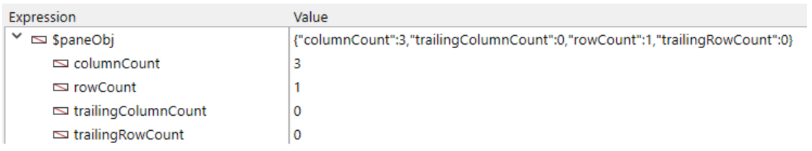
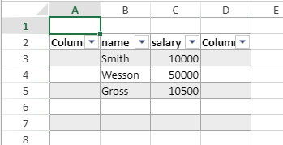
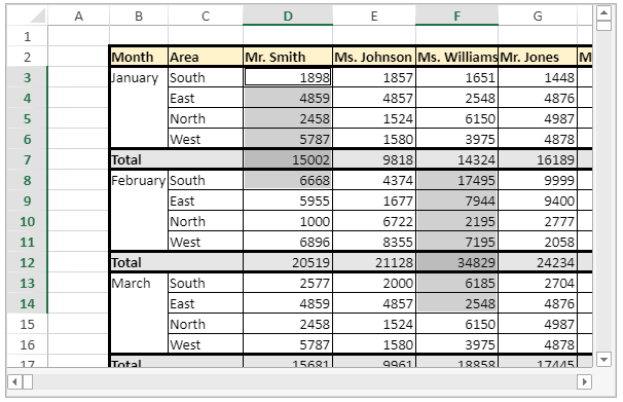
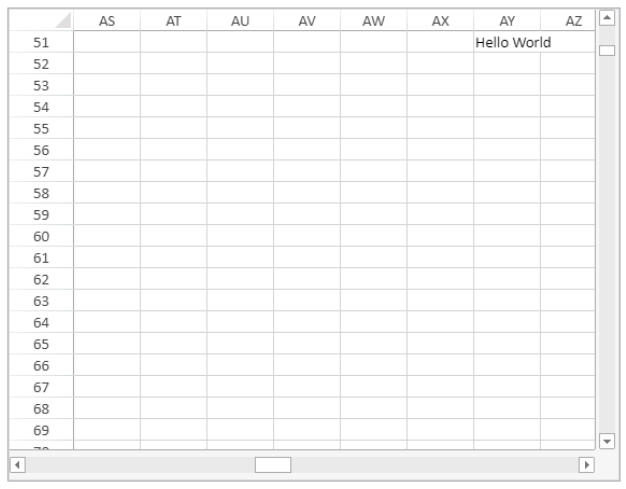

> **Attention** : Les commandes listées dans cette page ne sont pas thread-safe.

[A](#a) - [C](#c) - [D](#d) - [E](#e) - [F](#f) - [G](#g) - [I](#i) - [M](#m) - [N](#n) - [O](#o) - [P](#p) - [R](#r) - [S](#s)

## A

### VP ADD FORMULA NAME

<!-- REF #_method_.VP ADD FORMULA NAME.Syntax -->

**VP ADD FORMULA NAME** ( *vpAreaName* : Text ; *vpFormula* : Text ; *name* : Text { ; *options* : Object } )<!-- END REF -->

<!-- REF #_method_.VP ADD FORMULA NAME.Params -->

| Paramètres | Type   |    | Description                                             |
| ---------- | ------ | -- | ------------------------------------------------------- |
| vpAreaName | Text   | -> | Nom d'objet formulaire zone 4D View Pro                 |
| vpFormula  | Text   | -> | Formule 4D View Pro                                     |
| name       | Text   | -> | Nom de la formule                                       |
| options    | Object | -> | Options de la formule nommée|<!-- END REF -->

|

#### Description

La commande `VP ADD FORMULA NAME` <!-- REF #_method_.VP ADD FORMULA NAME.Summary -->permet de créer ou de modifier une formule nommée dans le document courant<!-- END REF -->.
> Les formules nommées créées par cette commande sont stockées dans le document.

Passez le nom de la zone 4D View Pro dans *vpAreaName*. Si vous passez un nom inexistant, une erreur est retournée.

Passez la formule 4D View Pro que vous souhaitez nommer dans *vpFormula*. Pour plus d'informations sur la syntaxe des formules, veuillez consulter la section [Formules et Fonctions](formulas.md).

Passez le nouveau nom de la formule dans *name*. Si le nom est déjà utilisé dans le même scope, la nouvelle formule nommée remplace la formule existante. A noter que vous pouvez utiliser le même nom pour plusieurs scopes (ci-dessous).

Vous pouvez passer un objet avec des propriétés additionnelles pour la plage nommée dans *options*. Les propriétés suivantes sont prises en charge :

| Propriété | Type   | Description                                                                                                                                                                                                                                                                                                                                                                    |
| --------- | ------ | ------------------------------------------------------------------------------------------------------------------------------------------------------------------------------------------------------------------------------------------------------------------------------------------------------------------------------------------------------------------------------ |
| scope     | Number | Scope de la formule. Vous pouvez passer l'indice de la feuille (la numérotation commence à zéro) ou utiliser les constantes suivantes : <li>`vk current sheet`</li><li>`vk workbook`</li>Le scope détermine si le nom d'une formule est propre à une feuille (*scope*=sheet index ou `vk current sheet`), ou s'il s'applique à l'ensemble du classeur (*scope*=`vk workbook`). |
| comment   | Text   | Commentaire associé à une formule nommée                                                                                                                                                                                                                                                                                                                                       |

#### Exemple

```4d
VP ADD FORMULA NAME("ViewProArea";"SUM($A$1:$A$10)";"Total2")
```

#### Voir également

[Cell references](formulas.md#cell-references)<br/>[VP Get formula by name](#vp-get-formula-by-name)<br/>[VP Get names](#vp-get-names)

### VP ADD RANGE NAME

<!-- REF #_method_.VP ADD RANGE NAME.Syntax -->

**VP ADD RANGE NAME** ( *rangeObj* : Object ; *name* : Text { ; *options* : Object } )<!-- END REF -->

<!-- REF #_method_.VP ADD RANGE NAME.Params -->

| Paramètres | Type   |    | Description                                             |
| ---------- | ------ | -- | ------------------------------------------------------- |
| rangeObj   | Object | -> | Objet plage                                             |
| name       | Text   | -> | Nom de la formule                                       |
| options    | Object | -> | Options de la formule nommée|<!-- END REF -->

|

#### Description

La commande `VP ADD RANGE NAME` <!-- REF #_method_.VP ADD RANGE NAME.Summary -->crée ou modifie une plage nommée dans le document courant<!-- END REF -->.
> Les plages nommées créées par cette commande sont stockées dans le document.

Dans *rangeObj*, passez la plage que vous souhaitez nommer, et passez le nouveau nom de la plage dans *name*. Si le nom est déjà utilisé dans le même scope, la nouvelle plage nommée remplace la plage existante. A noter que vous pouvez utiliser le même nom pour plusieurs scopes (ci-dessous).

Vous pouvez passer un objet avec des propriétés supplémentaires pour la plage nommée dans *options*. Les propriétés suivantes sont prises en charge :

| Propriété | Type   | Description                                                                                                                                                                                                                                                                                                                                                                |
| --------- | ------ | -------------------------------------------------------------------------------------------------------------------------------------------------------------------------------------------------------------------------------------------------------------------------------------------------------------------------------------------------------------------------- |
| scope     | Number | Scope de la plage. Vous pouvez passer l'indice de la feuille (la numérotation commence à zéro) ou utiliser les constantes suivantes : <li>`vk current sheet`</li><li>`vk workbook`</li>Le scope détermine si le nom d'une plage est propre à une feuille (*scope*=sheet index ou `vk current sheet`), ou s'il s'applique à l'ensemble du classeur (*scope*=`vk workbook`). |
| comment   | Text   | Commentaire associé à une plage nommée                                                                                                                                                                                                                                                                                                                                     |
> * Une plage nommée est en réalité une formule nommée contenant des coordonnées. `VP ADD RANGE NAME` facilite la création de plages nommées, mais la commande [`VP ADD FORMULA NAME`](#vp-add-formula-name) permet également d'en créer.
> * Les formules définissant des plages nommées peuvent être récupérées à l'aide de la commande [`VP Get formula by name`](#vp-get-formula-by-name).

#### Exemple

Vous souhaitez créer une plage nommée à partir d'une plage contenant une cellule :

```4d
$range:=VP Cell("ViewProArea";2;10)
VP ADD RANGE NAME($range;"Total1")
```

#### Voir également

[VP Get names](#vp-get-names)<br/>[VP Name](#vp-name)

### VP ADD SELECTION

<!-- REF #_method_.VP ADD SELECTION.Syntax -->

**VP ADD SELECTION** ( *rangeObj* : Object )<!-- END REF -->

<!-- REF #_method_.VP ADD SELECTION.Params -->

| Paramètres | Type |    | Description                             |
| ---------- | ---- | -- | --------------------------------------- |
| rangeObj   | Text | -> | Objet plage |<!-- END REF -->

|

#### Description

La commande `VP ADD SELECTION` <!-- REF #_method_.VP ADD SELECTION.Summary -->ajoute les cellules spécifiées aux cellules sélectionnées<!-- END REF -->.

Dans *rangeObj*, passez un objet plage de plusieurs cellules à ajouter à la sélection courante.
> La cellule active n'est pas modifiée.

#### Exemple

Les cellules sélectionnées sont les suivantes :


Le code suivant ajoutera des cellules à votre sélection :

```4d
$currentSelection:=VP Cells("myVPArea";3;4;2;3)
VP ADD SELECTION($currentSelection)
```

Résultat:


#### Voir également

[VP Get active cell](#vp-get-active-cell)<br/>[VP Get selection](#vp-get-selection)<br/>[VP RESET SELECTION](#vp-reset-selection)<br/>[VP SET ACTIVE CELL](#vp-set-active-cell)<br/>[VP SET SELECTION](#vp-set-selection)<br/>[VP SHOW CELL](#vp-show-cell)

### VP ADD SHEET

<!-- REF #_method_.VP ADD SHEET.Syntax -->
**VP ADD SHEET** ( *vpAreaName* : Text )<br/>**VP ADD SHEET** ( *vpAreaName* : Text ; *index* : Integer )<br/>**VP ADD SHEET** ( *vpAreaName* : Text ; *sheet* : Integer ; *name* : Text )<!-- END REF -->

<!-- REF #_method_.VP ADD SHEET.Params -->

| Paramètres | Type    |    | Description                                  |
| ---------- | ------- | -- | -------------------------------------------- |
| vpAreaName | Text    | -> | Nom d'objet formulaire zone 4D View Pro      |
| sheet      | Integer | -> | Indice de la nouvelle feuille                |
| name       | Text    | -> | Nom de la feuille|<!-- END REF -->

|

#### Description

La commande `VP ADD SHEET` <!-- REF #_method_.VP ADD SHEET.Summary -->insère une feuille dans le document chargé dans *vpAreaName*.<!-- END REF -->

Passez le nom de la zone 4D View Pro dans *vpAreaName*.

Dans *sheet*, vous pouvez passer le numéro de la nouvelle feuille. Si l'*index* passé est inférieur ou égal à 0, la commande insère la nouvelle feuille au début. Si l'*index* est supérieur au nombre de feuilles, la commande insère la nouvelle feuille après les feuilles existantes.
> La numérotation démarre à 0.

Dans *name*, vous pouvez passer un nom pour la nouvelle feuille. Le nouveau nom ne peut pas contenir les caractères suivants : `*, :, [, ], ?,\,/`

#### Exemple

Le document comporte actuellement 3 feuilles :


Pour insérer une feuille à la troisième position (index 2) et la nommer "March" :

```4d
VP ADD SHEET("ViewProArea";2;"March")
```


#### Voir également

[VP REMOVE SHEET](#vp-remove-sheet)

### VP ADD SPAN

<!-- REF #_method_.VP ADD SPAN.Syntax -->
**VP ADD SPAN** ( *rangeObj* : Object )<!-- END REF -->

<!-- REF #_method_.VP ADD SPAN.Params -->

| Paramètres | Type   |    | Description                            |
| ---------- | ------ | -- | -------------------------------------- |
| rangeObj   | Object | -> | Objet plage|<!-- END REF -->

|

#### Description

La commande `VP ADD SPAN` combine les cellules de *rangeObj* en une seule cellule fusionnée.

Dans *rangeObj*, passez une plage de cellules. Les cellules de la plage sont jointes, afin de créer une cellule plus large qui s'étend sur plusieurs colonnes et/ou lignes. Vous pouvez passer plusieurs plages de cellules pour créer plusieurs fusions de cellules en même temps. A noter que si les plages de cellules se chevauchent, seule la première plage est utilisée.

> * Seules les données contenues dans la cellule supérieure gauche sont affichées. Les données des autres cellules combinées sont cachées jusqu'à ce que la fusion soit retirée.
> * Les données masquées, contenues dans les cellules fusionnées, sont accessibles via des formules (commençant par la cellule supérieure gauche).

#### Exemple

Pour fusionner les cellules First quarter et Second quarter avec les deux cellules côte à côte, et de fusionner la cellule South area avec les deux lignes en-dessous :


```4d
 //  Plage First quarter
 $q1:=VP Cells("ViewProArea";2;3;3;1)

// Plage Second quarter
 $q2:=VP Cells("ViewProArea";5;3;3;1)

  // Plage South area
 $south:=VP Cells("ViewProArea";0;5;1;3)

 VP ADD SPAN(VP Combine ranges($q1;$q2;$south))
```


#### Voir également

[4D View Pro Range Object Properties](getting-started.md#using-range-objects)<br/>[VP Get spans](#vp-get-spans)<br/>[VP REMOVE SPAN](#vp-remove-span)

### VP ADD STYLESHEET

<!-- REF #_method_.VP ADD STYLESHEET.Syntax -->
**VP ADD STYLESHEET** ( *vpAreaName* : Text ; *styleName* : Text ; *styleObj* : Object { ; *sheet* : Integer } )<!-- END REF -->

<!-- REF #_method_.VP ADD STYLESHEET.Params -->

| Paramètres | Type    |    | Description                                                                |
| ---------- | ------- | -- | -------------------------------------------------------------------------- |
| vpAreaName | Text    | -> | Nom d'objet formulaire zone 4D View Pro                                    |
| styleName  | Text    | -> | Nom du style                                                               |
| styleObj   | Object  | -> | Objet définissant les propriétés de l'attribut                             |
| sheet      | Integer | -> | Indice de la feuille (feuille courante si omis)|<!-- END REF -->

|

#### Description

La commande `VP ADD STYLESHEET` <!-- REF #_method_.VP ADD STYLESHEET.Summary -->crée ou modifie la feuille de style *styleName* basée sur la combinaison de propriétés indiquées dans *styleObj* dans le document courant<!-- END REF -->. Si une feuille de style ayant le même nom et le même index existe déjà dans le document, cette commande l'écrasera et le remplacera avec les nouvelles valeurs.

> Les feuilles de style créées par cette commande sont sauvegardées avec le document.

Passez le nom de la zone 4D View Pro dans *vpAreaName*. Si vous passez un nom inexistant, une erreur est retournée.

Le paramètre *styleName* vous permet de nommer la feuille de style. Si le nom existe déjà dans le même scope, la nouvelle feuille de style remplace la feuille existante. A noter que vous pouvez utiliser le même nom pour plusieurs scopes (ci-dessous).

Dans *styleObj*, définissez les propriétés de la feuille de style (ex : police, alignement, bordures, etc.). For the full list of style properties, see [Style object properties](configuring.md#style-object-properties).

Vous pouvez désigner l'emplacement dans lequel vous souhaitez définir la feuille de style dans le paramètre optionnel *sheet*, à l'aide de l'indice de la feuille (la numérotation commence à zéro) ou à l'aide des constantes suivantes :

* `vk current sheet`
* `vk workbook`

Si une feuille de style *styleName* est définie au niveau du workbook et de la feuille lors de son paramétrage, le niveau de la feuille est prioritaire par rapport à celui du workbook.

Vous pouvez appliquer la feuille de style à l'aide des commandes [VP SET DEFAULT STYLE](#vp-set-default-style) ou [VP SET CELL STYLE](#vp-set-cell-style).

#### Exemple

Le code suivant :

```4d
$styles:=New object
$styles.backColor:="green"

//Objet Bordure de ligne
$borders:=New object("color";"green";"style";vk line style medium dash dot)

$styles.borderBottom:=$borders
$styles.borderLeft:=$borders
$styles.borderRight:=$borders
$styles.borderTop:=$borders

VP ADD STYLESHEET("ViewProArea";"GreenDashDotStyle";$styles)

//Pour appliquer le style
VP SET CELL STYLE(VP Cells("ViewProArea";1;1;2;2);New object("name";"GreenDashDotStyle"))
```

créera et appliquera l'objet style *GreenDashDotStyle* suivant :

```
{
 backColor:green,
 borderBottom:{color:green,style:10},
 borderLeft:{color:green,style:10},
 borderRight:{color:green,style:10},
 borderTop:{color:green,style:10}
}
```

#### Voir également

[4D View Pro Style Objects and Style Sheets](configuring.md#style-objects--style-sheets)<br/>[VP Get stylesheet](#vp-get-stylesheet)<br/>[VP Get stylesheets](#vp-get-stylesheets)<br/>[VP REMOVE STYLESHEET](#vp-remove-stylesheet)<br/>[VP SET CELL STYLE](#vp-set-cell-style)<br/>[VP SET DEFAULT STYLE](#vp-set-default-style)

### VP All

<!-- REF #_method_.VP All.Syntax -->
**VP All** ( *vpAreaName* : Text { ; *sheet* : Integer } )  : Object<!-- END REF -->

<!-- REF #_method_.VP All.Params -->

| Paramètres | Type    |    | Description                                                   |
| ---------- | ------- | -- | ------------------------------------------------------------- |
| vpAreaName | Text    | -> | Nom d'objet formulaire zone 4D View Pro                       |
| sheet      | Integer | -> | Numéro d'indice de la feuille (feuille courante si omis)      |
| Résultat   | Object  | <- | Objet plage de toutes les cellules|<!-- END REF -->

|

#### Description

La commande `VP ALL` <!-- REF #_method_.VP All.Summary -->retourne une nouvelle plage référençant toutes les cellules<!-- END REF -->.

Passez le nom de la zone 4D View Pro dans *vpAreaName*. Si vous passez un nom inexistant, une erreur est retournée.

Dans le paramètre optionnel *sheet*, vous pouvez désigner une feuille spécifique dans laquelle sera définie la plage (la numérotation commence à zéro). Si le paramètre est omis ou si vous passez `vk current sheet`, la feuille courante est utilisée.

#### Exemple

Vous souhaitez définir une plage pour toutes les cellules de la feuille courante :

```4d
$all:=VP All("ViewProArea") // toutes les cellules de la feuille courante
```

#### Voir également

[VP Cell](#vp-cell)<br/>[VP Cells](#vp-cells)<br/>[VP Column](#vp-column)<br/>[VP Combine ranges](#vp-combine-ranges)<br/>[VP Name](#vp-name)<br/>[VP Row](#vp-row)

## C

### VP Cell

<!-- REF #_method_.VP Cell.Syntax -->
**VP Cell** ( *vpAreaName* ; *column* : Integer ; *row* : Integer ; Text { ; *sheet* : Integer } )  : Object<!-- END REF -->

<!-- REF #_method_.VP Cell.Params -->

| Paramètres | Type    |    | Description                                              |
| ---------- | ------- | -- | -------------------------------------------------------- |
| vpAreaName | Text    | -> | Nom d'objet formulaire zone 4D View Pro                  |
| column     | Longint | -> | Indice de la colonne                                     |
| row        | Longint | -> | Indice de la ligne                                       |
| sheet      | Integer | -> | Numéro d'indice de la feuille (feuille courante si omis) |
| Résultat   | Object  | <- | Objet plage d'une seule cellule                          |
<!-- END REF -->

#### Description

La commande `VP Cells` <!-- REF #_method_.VP Cell.Summary -->retourne une nouvelle plage référençant une cellule<!-- END REF -->.

> Cette commande s'applique aux plages d'une seule cellule. Pour créer une plage de plusieurs cellules, utilisez la commande [VP Cells](#vp-cells).

Passez le nom de la zone 4D View Pro dans *vpAreaName*. Si vous passez un nom inexistant, une erreur est retournée.

Le paramètre *column* définit la colonne de la plage. Passez l'indice de la colonne dans ce paramètre.

Le paramètre *row* définit la ligne de la plage. Passez l'indice de la ligne dans ce paramètre.

Dans le paramètre optionnel *sheet*, vous pouvez désigner l'indice de la feuille dans laquelle sera définie la plage. Si le paramètre est omis ou si vous passez `vk current sheet`, la feuille courante est utilisée par défaut.

> l'indexation démarre à 0.

#### Exemple

Vous souhaitez définir une plage pour la cellule de la feuille courante (sur la feuille courante) :


Le code est le suivant :

```4d
$cell:=VP Cell("ViewProArea";2;4) // C5
```

#### Voir également

[VP All](#vp-all)<br/>[VP Cells](#vp-cells)<br/>[VP Column](#vp-column)<br/>[VP Combine ranges](#vp-combine-ranges)<br/>[VP Name](#vp-name)<br/>[VP Row](#vp-row)

### VP Cells

<!-- REF #_method_.VP Cells.Syntax -->
**VP Cells** ( *vpAreaName* : Text ; *column*: Integer ; *row*: Integer ; *columnCount* : Integer ; *rowCount* : Integer { ; *sheet* : Integer } ) : Object<!-- END REF -->

<details><summary>Historique</summary>

| Release | Modifications |
| ------- | ------------- |
| 17 R4   | Ajout         |
</details>

<!-- REF #_method_.VP Cells.Params -->

| Paramètres  | Type    |    | Description                                              |
| ----------- | ------- | -- | -------------------------------------------------------- |
| vpAreaName  | Text    | -> | Nom d'objet formulaire zone 4D View Pro                  |
| column      | Integer | -> | Indice de la colonne                                     |
| row         | Integer | -> | Indice de la ligne                                       |
| columnCount | Integer | -> | Nombre de colonnes                                       |
| rowCount    | Integer | -> | Nombre de lignes                                         |
| sheet       | Integer | -> | Numéro d'indice de la feuille (feuille courante si omis) |
| Résultat    | Object  | <- | Objet de plage de cellules|<!-- END REF -->

|

#### Description

La commande `VP Cells` <!-- REF #_method_.VP Cells.Summary -->retourne une nouvelle plage référençant des cellules spécifiques<!-- END REF -->.

Passez le nom de la zone 4D View Pro dans *vpAreaName*. Si vous passez un nom inexistant, une erreur est retournée.

Le paramètre *column* définit la première colonne de la plage de cellules. Passez l'indice de la colonne (la numérotation commence à zéro) dans ce paramètre. Si la plage contient plusieurs colonnes, vous devez également utiliser le paramètre *columnCount*.

Dans le paramètre *row*, vous pouvez définir l'emplacement de la ou des lignes de la plage de cellules. Passez l'indice de la ligne (la numérotation commence à zéro) dans ce paramètre. Si la plage contient plusieurs lignes, vous devez également utiliser le paramètre *rowCount*.

Le paramètre *columnCount* vous permet de définir le nombre total de colonnes comprises dans la plage. *columnCount* doit être supérieur à 0.

Le paramètre *rowCount* vous permet de définir le nombre total de lignes comprises dans la plage. *rowCount* doit être supérieur à 0.

Dans le paramètre optionnel *sheet*, vous pouvez désigner une feuille spécifique dans laquelle sera définie la plage (la numérotation commence à zéro). Si le paramètre est omis ou si vous passez `vk current sheet`, la feuille courante est utilisée par défaut.

#### Exemple

Vous souhaitez définir un objet plage pour les cellules suivantes (de la feuille courante) :


Le code est le suivant :

```4d
$cells:=VP Cells("ViewProArea";2;4;2;3) // de C5 à D7
```

#### Voir également

[VP All](#vp-all)<br/>[VP Cells](#vp-cells)<br/>[VP Column](#vp-column)<br/>[VP Combine ranges](#vp-combine-ranges)<br/>[VP Name](#vp-name)<br/>[VP Row](#vp-row)

### VP Column

<!-- REF #_method_.VP Column.Syntax -->
**VP Column** ( *vpAreaName* : Text ; *column*: Integer ; *columnCount* : Integer { ; *sheet* : Integer } ) : Object<!-- END REF -->

<!-- REF #_method_.VP Column.Params -->

| Paramètres  | Type    |    | Description                                              |
| ----------- | ------- | -- | -------------------------------------------------------- |
| vpAreaName  | Text    | -> | Nom d'objet formulaire zone 4D View Pro                  |
| column      | Integer | -> | Indice de la colonne                                     |
| columnCount | Integer | -> | Nombre de colonnes                                       |
| sheet       | Integer | -> | Numéro d'indice de la feuille (feuille courante si omis) |
| Résultat    | Object  | <- | Objet de plage de cellules|<!-- END REF -->

|

#### Description

La commande `VP Column` <!-- REF #_method_.VP Column.Summary -->retourne une nouvelle plage référençant une ou plusieurs colonnes<!-- END REF -->.

Passez le nom de la zone 4D View Pro dans *vpAreaName*. Si vous passez un nom inexistant, une erreur est retournée.

Le paramètre *column* définit la première colonne de la plage. Passez l'indice de la colonne (la numérotation commence à zéro) dans ce paramètre. Si la plage contient plusieurs colonnes, vous devez également utiliser le paramètre optionnel *columnCount*.

Le paramètre optionnel *columnCount* vous permet de définir le nombre total de colonnes comprises dans la plage. *columnCount* doit être supérieur à 0. Si le paramètre est omis, la valeur 1 sera définie par défaut et une plage de type colonne sera créée.

Dans le paramètre optionnel *sheet*, vous pouvez désigner une feuille spécifique dans laquelle sera définie la plage (la numérotation commence à zéro). Si le paramètre est omis ou si vous passez `vk current sheet`, la feuille courante est utilisée par défaut.

#### Exemple

Vous souhaitez définir une plage pour la colonne ci-dessous (dans la feuille courante) :


Le code est le suivant :

```4d
 $column:=VP Column("ViewProArea";3) // colonne D
```

#### Voir également

[VP All](#vp-all)<br/>[VP Cells](#vp-cells)<br/>[VP Column](#vp-column)<br/>[VP Combine ranges](#vp-combine-ranges)<br/>[VP Name](#vp-name)<br/>[VP Row](#vp-row)<br/>[VP SET COLUMN ATTRIBUTES](#vp-set-column-attributes)

### VP COLUMN AUTOFIT

<!-- REF #_method_.VP COLUMN AUTOFIT.Syntax -->
**VP COLUMN AUTOFIT** ( *rangeObj* : Object )<!-- END REF -->

<!-- REF #_method_.VP COLUMN AUTOFIT.Params -->

| Paramètres | Type   |    | Description                            |
| ---------- | ------ | -- | -------------------------------------- |
| rangeObj   | Object | -> | Objet plage|<!-- END REF -->

|

#### Description

La commande `VP COLUMN AUTOFIT` <!-- REF #_method_.VP COLUMN AUTOFIT.Summary -->dimensionne automatiquement la ou les colonne(s) dans *rangeObj* en fonction de leur contenu<!-- END REF -->.

Dans *rangeObj*, passez un objet plage contenant une plage de colonnes dont la taille doit être gérée automatiquement.

#### Exemple

Les colonnes suivantes sont toutes de la même taille et n'affichent pas certaines parties du texte :


La sélection des colonnes et l'exécution du code suivant :

```4d
 VP COLUMN AUTOFIT(VP Get selection("ViewProarea"))
```

redimensionne les colonnes pour correspondre à la taille du contenu :


#### Voir également

[VP ROW AUTOFIT](#vp-row-autofit)

### VP Combine ranges

<!-- REF #_method_.VP Combine ranges.Syntax -->
**VP Combine ranges** ( *rangeObj* : Object ; *otherRangeObj* : Object {;...*otherRangeObjN* : Object }  ) : Object<!-- END REF -->

<!-- REF #_method_.VP Combine ranges.Params -->

| Paramètres    | Type   |    | Description                                                   |
| ------------- | ------ | -- | ------------------------------------------------------------- |
| rangeObj      | Object | -> | Objet plage                                                   |
| otherRangeObj | Object | -> | Objet plage                                                   |
| Résultat      | Object | <- | Objet contenant une plage combinée|<!-- END REF -->

|

#### Description

La commande `VP Combine Ranges` <!-- REF #_method_.VP Combine ranges.Summary -->retourne une nouvelle plage qui comprend au moins deux plages existantes<!-- END REF -->. Toutes les plages doivent provenir de la même zone 4D View Pro.

Dans *rangeObj*, passez la première plage.

Dans *otherRangeObj*, passez une ou plusieurs autres plages à combiner avec *rangeObj*.
> La commande incorpore *rangeObj* et *otherRangeObj* par référence.

#### Exemple

Vous souhaitez combiner des plages de type cellule, colonne et ligne dans une nouvelle plage distincte :

```4d
 $cell:=VP Cell("ViewProArea";2;4) // C5
 $column:=VP Column("ViewProArea";3) // colonne D
 $row:=VP Row("ViewProArea";9) // ligne 10

 $combine:=VP Combine ranges($cell;$column;$row)
```

#### Voir également

[VP All](#vp-all)<br/>[VP Cells](#vp-cells)<br/>[VP Column](#vp-column)<br/>[VP Combine ranges](#vp-combine-ranges)<br/>[VP Name](#vp-name)<br/>[VP Row](#vp-row)<br/>[VP SET COLUMN ATTRIBUTES](#vp-set-column-attributes)

### VP Convert from 4D View

<!-- REF #_method_.VP Convert from 4D View.Syntax -->
**VP Convert from 4D View** ( *4DViewDocument* : Blob ) : Object<!-- END REF -->

<!-- REF #_method_.VP Convert from 4D View.Params -->

| Paramètres     | Type   |    | Description                                 |
| -------------- | ------ | -- | ------------------------------------------- |
| 4DViewDocument | Blob   | -> | Document 4D View                            |
| Résultat       | Object | <- | Objet 4D View Pro<!-- END REF -->

|

#### Description

La commande `VP Convert from 4D View` <!-- REF #_method_.VP Convert from 4D View.Summary -->vous permet de convertir un document 4D View existant en un objet 4D View Pro<!-- END REF -->.
> Cette commande ne nécessite pas l'installation du plug-in 4D View dans votre environnement.

Dans le paramètre *4DViewDocument*, passez une variable ou un champ BLOB contenant le document 4D View à convertir. La commande retourne un objet 4D View Pro dans lequel toutes les informations stockées à l'origine dans le document 4D View sont converties en attributs 4D View Pro.

#### Exemple

Vous souhaitez obtenir un objet 4D View Pro à partir d'une zone 4D View stockée dans un BLOB :

```4d
C_OBJECT($vpObj)
$vpObj:=VP Convert from 4D View($pvblob)
```

### VP Convert to picture

<!-- REF #_method_.VP Convert to picture.Syntax -->
**VP Convert to picture** ( *vpObject* : Object {; *rangeObj* : Object} ) : Picture<!-- END REF -->

<!-- REF #_method_.VP Convert to picture.Params -->

| Paramètres | Type    |    | Description                                     |
| ---------- | ------- | -- | ----------------------------------------------- |
| vpObject   | Object  | -> | Objet 4D View Pro contenant la zone à convertir |
| rangeObj   | Object  | -> | Objet plage                                     |
| Résultat   | Picture | <- | Image SVG de la zone|<!-- END REF -->

|

#### Description

La commande `VP Convert to picture` <!-- REF #_method_.VP Convert to picture.Summary -->convertit l'objet 4D View Pro *vpObject* (ou la plage *rangeObj* dans *vpObject*) en une image SVG<!-- END REF -->.

Cette commande est utile, par exemple :

* pour intégrer un document 4D View Pro dans un autre document, tel qu'un document 4D Write Pro
* pour imprimer un document 4D View Pro sans le charger dans une zone 4D View Pro.

Dans *vpObject*, passez l'objet 4D View Pro que vous souhaitez convertir. Cet objet doit avoir été préalablement analysé à l'aide de [VP Export to object](#vp-export-to-object) ou enregistré avec [VP EXPORT DOCUMENT](#vp-export-document).
> Le processus de conversion SVG nécessite que les expressions et les formats (cf. [Format de cellule](configuring.md#cell-format) 4D View Pro) inclus dans la zone 4D View Pro soient évalués au moins une fois, afin d'être correctement exportés. Si vous convertissez un document qui n'a pas été évalué au préalable, les expressions ou les formats peuvent être rendus de manière inattendue.

Dans *rangeObj*, passez une plage de cellules à convertir. Par défaut, si ce paramètre est omis, tout le contenu du document est converti.

Les contenus de document sont convertis en tenant compte de leurs attributs d'affichage, y compris les formats (voir la note ci-dessus), la visibilité des en-têtes, des colonnes et des lignes. La conversion des éléments suivants est prise en charge :

* Texte : style / police / taille / alignement / rotation / format
* Arrière-plan de cellule : couleur / image
* Bordure de cellule : épaisseur / couleur / style
* Fusion de cellules
* Images
* Hauteur de lignes
* Largeur de colonnes
* Visibilité : colonnes / lignes cachées.
> La visibilité du quadrillage dépend de l'attribut de document défini avec [VP SET PRINT INFO](#vp-set-print-info).

#### Résultat

La commande retourne une image au format SVG.

#### Exemple

Vous souhaitez convertir une zone 4D View Pro en SVG, prévisualiser le résultat et l'envoyer dans une variable image :

```4d
C_OBJECT($vpAreaObj)
C_PICTURE($vPict)
$vpAreaObj:=VP Export to object("ViewProArea")
$vPict:=VP Convert to picture($vpAreaObj) //exporter toute la zone
```

#### Voir également

[VP EXPORT DOCUMENT](#vp-export-document)<br/>[VP Export to object](#vp-export-to-object)<br/>[VP SET PRINT INFO](#vp-set-print-info)

### VP Copy to object

<details><summary>Historique</summary>

| Release | Modifications |
| ------- | ------------- |
| 19 R4   | Ajout         |
</details>

<!-- REF #_method_.VP Copy to object.Syntax -->
**VP Copy to object** ( *rangeObj* : Object {; *options* : Object} ) : Object<!-- END REF -->

<!-- REF #_method_.VP Copy to object.Params -->

| Paramètres | Type   |    | Description                                                             |
| ---------- | ------ | -- | ----------------------------------------------------------------------- |
| rangeObj   | Object | -> | Objet plage                                                             |
| options    | Object | -> | Options supplémentaires                                                 |
| Résultat   | Object | <- | Objet retourné. Contient les données copiées|<!-- END REF -->


|


#### Description

La commande `VP Copy to object` <!-- REF #_method_.VP Copy to object.Summary -->copie le contenu, le style et les formules de *rangeObj* vers un objet<!-- END REF -->.

Dans *rangeObj*, passez la plage de cellules contenant les valeurs, formatages et formules à copier. Si *rangeObj* est une plage combinée, seule la première est utilisée.

Vous pouvez passer un paramètre facultatif *options* contenant les propriétés suivantes :

| Propriété   | Type    | Description                                                                                                                       |
| ----------- | ------- | --------------------------------------------------------------------------------------------------------------------------------- |
| copy        | Boolean | *Vrai* (par défaut) pour conserver les valeurs, formatages et formules après exécution de la commande. *Faux* pour les supprimer. |
| copyOptions | Longint | Spécifie ce qui est copié ou déplacé. Valeurs possibles : <p><table><tr><th>Valeur</th><th>Description</th></tr><tr><td>`vk clipboard options all` (par défaut)</td><td>Copie tous les objets de données, y compris les valeurs, formats et formules.</td></tr><tr><td>`vk clipboard options formatting`</td><td>Copie uniquement les formats.</td></tr><tr><td>`vk clipboard options formulas`</td><td>Copie uniquement les formules.</td></tr><tr><td>`vk clipboard options formulas and formatting`</td><td>Copie les formules et les formats.</td></tr><tr><td>`vk clipboard options values`</td><td>Copie uniquement les valeurs.</td></tr><tr><td>`vk clipboard options value and formatting`</td><td>Copie les valeurs et les formats.</td></tr></table></p>                                                |

Les options de collage définies dans les [options de workbook](#vp-set-workbook-options) sont prises en compte.

La commande retourne un objet qui contient les données copiées.

#### Exemple

Cet exemple de code copie d'abord le contenu, valeurs, formats et formules d'une plage dans un objet puis les colle dans une autre plage :

```4d
var $originRange; $targetRange; $dataObject; $options : Object

$originRange:=VP Cells("ViewProArea"; 0; 0; 2; 5)

$options:=New object
$options.copy:=True
$options.copyOptions:=vk clipboard options all

$dataObject:=VP Copy to object($originRange; $options)

$targetRange:=VP Cell("ViewProArea"; 4; 0)
VP PASTE FROM OBJECT($targetRange; $dataObject; vk clipboard options all)
```

#### Voir également


[VP PASTE FROM OBJECT](#vp-paste-from-object)<br/>[VP MOVE CELLS](#vp-move-cells)<br/>[VP Get workbook options](#vp-get-workbook-options)<br/>[VP SET WORKBOOK OPTIONS](#vp-set-workbook-options)

### VP CREATE TABLE

<details><summary>Historique</summary>

| Release | Modifications                                                                                               |
| ------- | ----------------------------------------------------------------------------------------------------------- |
| 19 R8   | Support of theme options: `bandColumns`, `bandRows`, `highlightFirstColumn`, `highlightLastColumn`, `theme` |
| 19 R7   | Prise en charge de l'option `allowAutoExpand`                                                               |
| 19 R6   | Ajout                                                                                                       |
</details>

<!-- REF #_method_.VP CREATE TABLE.Syntax -->
**VP CREATE TABLE** ( *rangeObj* : Object ; *tableName* : Text {; *source* : Text} {; *options* : cs.ViewPro.TableOptions} )<!-- END REF -->

<!-- REF #_method_.VP CREATE TABLE.Params -->

| Paramètres | Type                                               |    | Description                                                  |
| ---------- | -------------------------------------------------- | -- | ------------------------------------------------------------ |
| rangeObj   | Object                                             | -> | Objet plage                                                  |
| tableName  | Text                                               | -> | Nom de la table                                              |
| source     | Text                                               | -> | Nom de la propriété du Data context à afficher dans la table |
| options    | [cs.ViewPro.TableOptions](classes.md#tableoptions) | -> | Options supplémentaires|<!-- END REF -->

|

#### Description

La commande `VP CREATE TABLE` <!-- REF #_method_.VP CREATE TABLE.Summary -->crée une table dans la plage spécifiée<!-- END REF -->. Vous pouvez créer une table dans une plage de cellules pour faciliter la gestion et l'analyse d'un groupe de données connexes. Un tableau contient généralement des données liées dans des lignes et des colonnes, et tire parti d'un [contexte de données](#vp-set-data-context).



Dans *rangeObj*, passez la plage de cellules dans laquelle la table sera créée.

Dans *tableName*, passez un nom pour la table. Le nom doit :

* être unique dans la feuille
* inclure au moins 5 caractères
* ne pas inclure d'espaces ou commencer par un nombre

In *source*, you can pass a property name of a [data context](#vp-set-data-context) to display its data in the table. This binds the table to the data context. When the data context is updated, the data displayed in the table is updated accordingly. The *source* property must contain a collection of objects and each element represents a row.

  * If you don't specify a *source*, the command creates an empty table with the size defined in *rangeObj*.
  * If the specified *source* cannot be fully displayed in the document, no table is created.

In the *options* parameter, pass an object of the [`cs.ViewPro.TableOptions` class](classes.md#tableoptions) that contains the table properties to set.

*columnCount* doit être supérieur à 0. Passez le nombre total de colonnes dans le paramètre *columnCount*.

  * When the column count in *rangeObj* exceeds the number of columns in *tableColumns*, the table is filled with additional empty columns.
  * When the column count in *rangeObj* is inferior to the number of *tableColumns*, the table displays a number of columns that match the range's column count.

If you pass a *source* but no *tableColumn* option, the command generates columns automatically. In this case, *rangeObj* must be a cell range. Otherwise, the first cell of the range is used. When generating columns automatically, the following rules apply:

* If the data passed to the command is a collection of objects, the property names are used as column titles. Par exemple :

```4d
([{ LastName: \"Freehafer\", FirstName: \"Nancy\"},{ LastName: \"John\", FirstName: \"Doe\"})
```
Here the titles of the columns would be `LastName` and `FirstName`.

* If the data passed to the command is a collection of scalar values, it must contain a collection of subcollections:

  * La collection de premier niveau contient des sous-collections de valeurs. Chaque sous-collection définit une ligne. Passez une collection vide pour sauter une ligne. The number of values in the first subcollection determines how many columns are created.
  * The subcollections' indices are used as column titles.
  * Chaque sous-collection définit les valeurs des cellules de la ligne. Values can be `Integer`, `Real`, `Boolean`, `Text`, `Date`, `Null`, `Time` or `Picture`. A `Time` value must be an a object containing a time attribute, as described in [VP SET VALUE](#vp-set-value).

> This only works when generating columns automatically. You cannot use a collection of scalar data with the *tableColumns* option.


#### Exemple

Pour créer une table en utilisant un contexte de données :

```4d
// Définir un contexte de données
var $data : Object

$data:=New object()
$data.people:=New collection()
$data.people.push(New object("firstName"; "John"; "lastName"; "Smith"; "email"; "johnsmith@gmail.com"))
$data.people.push(New object("firstName"; "Mary"; "lastName"; "Poppins"; "email"; "marypoppins@gmail.com"))


VP SET DATA CONTEXT("ViewProArea"; $data)

// Définir les colonnes de la table
var $options : cs.ViewPro.TableOptions

$options:=cs.ViewPro.TableOptions.new()
$options.tableColumns:=New collection()
$options.tableColumns.push(cs.ViewPro.TableColumns.new("name"; "First name"; "dataField"; "firstName"))
$options.tableColumns.push(cs.ViewPro.TableColumns.new("name"; "Last name"; "dataField"; "lastName"))
$options.tableColumns.push(cs.ViewPro.TableColumns.new("name"; "Email"; "dataField"; "email"))

// Créer une table à partir de la collection "people"
VP CREATE TABLE(VP Cells("ViewProArea"; 1; 1; $options.tableColumns.length; 1); "ContextTable"; "people"; $options)
```

Voici le résultat :


#### Voir également

[VP Find table](#vp-find-table)<br/>[VP Get table column attributes](#vp-get-table-column-attributes)<br/>[VP Get table column index](#vp-get-table-column-index)<br/>[VP INSERT TABLE COLUMNS](#vp-insert-table-columns)<br/>[VP INSERT TABLE ROWS](#vp-insert-table-rows)<br/>[VP REMOVE TABLE](#vp-remove-table)<br/>[VP RESIZE TABLE](#vp-resize-table)<br/>[VP SET DATA CONTEXT](#vp-set-data-context)<br/>[VP SET TABLE COLUMN ATTRIBUTES](#vp-set-table-column-attributes)<br/>[VP SET TABLE THEME](#vp-set-table-theme)


## D

### VP DELETE COLUMNS

<!-- REF #_method_.VP DELETE COLUMNS.Syntax -->
**VP DELETE COLUMNS** ( *rangeObj* : Object )<!-- END REF -->

<!-- REF #_method_.VP DELETE COLUMNS.Params -->

| Paramètres | Type   |    | Description                            |
| ---------- | ------ | -- | -------------------------------------- |
| rangeObj   | Object | -> | Objet plage|<!-- END REF -->

|

#### Description

La commande `VP DELETE COLUMNS` <!-- REF #_method_.VP DELETE COLUMNS.Summary -->supprime les colonnes de *rangeObj*<!-- END REF -->.

Dans *rangeObj*, passez un objet contenant les colonnes à supprimer. Si la plage qui est passée contient :

* des lignes et des colonnes, seules les colonnes sont supprimées.
* uniquement des lignes, la commande ne fait rien.
> Les colonnes sont supprimées de droite à gauche.

#### Exemple

Pour supprimer les colonnes sélectionnées par l'utilisateur (colonnes B, C et D de l'image ci-dessous) :


saisissez le code suivant :

```4d
VP DELETE COLUMNS(VP Get selection("ViewProArea"))
```

#### Voir également

[VP All](#vp-delete-rows)<br/>[VP Cells](#vp-insert-columns)<br/>[VP Column](#vp-insert-rows)

### VP DELETE ROWS

<!-- REF #_method_.VP DELETE ROWS.Syntax -->
**VP DELETE ROWS** ( *rangeObj* : Object )<!-- END REF -->

<!-- REF #_method_.VP DELETE ROWS.Params -->

| Paramètres | Type   |    | Description                            |
| ---------- | ------ | -- | -------------------------------------- |
| rangeObj   | Object | -> | Objet plage|<!-- END REF -->

|

#### Description

La commande `VP DELETE ROWS` <!-- REF #_method_.VP DELETE ROWS.Summary -->supprime les lignes de *rangeObj*<!-- END REF -->.

Dans *rangeObj*, passez un objet contenant les lignes à supprimer. Si la plage qui est passée contient :

* des lignes et des colonnes, seules les lignes sont supprimées.
* uniquement des colonnes, la commande ne fait rien.
> Les lignes sont supprimées du bas vers le haut.

#### Exemple

Pour supprimer les lignes sélectionnées par l'utilisateur (lignes 1, 2 et 3 de l'image ci-dessous) :


saisissez le code suivant :

```4d

 VP DELETE ROWS(VP Get selection("ViewProArea"))
```

#### Voir également

[VP All](#vp-delete-columns)<br/>[VP Cells](#vp-insert-columns)<br/>[VP Column](#vp-insert-rows)

## E

### VP EXPORT DOCUMENT

<!-- REF #_method_.VP EXPORT DOCUMENT.Syntax -->
**VP EXPORT DOCUMENT** ( *vpAreaName* : Text ; *filePath* : Text {; *paramObj* : Object} )<!-- END REF -->

<!-- REF #_method_.VP EXPORT DOCUMENT.Params -->

| Paramètres | Type   |    | Description                                 |
| ---------- | ------ | -- | ------------------------------------------- |
| vpAreaName | Text   | -> | Nom d'objet formulaire zone 4D View Pro     |
| filePath   | Text   | -> | Chemin d'accès du document                  |
| paramObj   | Object | -> | Options d'export|<!-- END REF -->

|

#### Description

La commande `VP EXPORT DOCUMENT` <!-- REF #_method_.VP EXPORT DOCUMENT.Summary -->exporte l'objet 4D View Pro attaché à la zone 4D View Pro *vpAreaName* vers un document sur disque en fonction des paramètres *filePath* et *paramObj*<!-- END REF -->.

Passez le nom de la zone 4D View Pro dans *vpAreaName*. Si vous passez un nom inexistant, une erreur est retournée.

Dans *filePath*, passez le chemin de destination et le nom du document que vous souhaitez exporter. Si vous ne spécifiez pas de chemin, le document sera sauvegardé au même niveau que le dossier Projet.

Vous pouvez préciser le format du document en incluant une extension après son nom :

* 4D View Pro (".4vp")
* Microsoft Excel (".xlsx")
* PDF (".pdf")
* CSV (".txt", or ".csv")

Si l'extension n'est pas incluse mais que le format est spécifié dans *paramObj*, le fichier exporté aura l'extension qui correspond au format, à l'exception du format CSV (aucune extension n'est ajoutée dans ce cas).

Le paramètre optionnel *paramObj* vous permet de définir plusieurs propriétés de l'objet 4D View Pro exporté et de lancer une méthode callback (ou méthode de rétro-appel) lorsque l'export est terminé.

| Propriété                  | Type    | Description                                                                                                                                                                                                                                                                                                                                                                                                                                                                                                                                                                          |
| -------------------------- | ------- | ------------------------------------------------------------------------------------------------------------------------------------------------------------------------------------------------------------------------------------------------------------------------------------------------------------------------------------------------------------------------------------------------------------------------------------------------------------------------------------------------------------------------------------------------------------------------------------ |
| format                     | text    | (optionnel) Désigne le format du fichier exporté : ".4vp" (par défaut), ".xlsx", ".pdf", ".csv" ou ".txt". Vous pouvez passer une des constantes suivantes :<li>`vk 4D View Pro format`</li><li>`vk csv format`</li><li>`vk MS Excel format`</li><li>`vk pdf format`</li>4D ajoute l'extension appropriée au nom du fichier si nécessaire. Si le format défini ne correspond pas à l'extension dans le *filePath*, il sera ajouté à la fin du *filePath*. Si un format n'est pas précisé et si aucune extension n'est fournie dans *filePath*, le format de fichier par défaut est utilisé. |
| password                   | text    | Microsoft Excel uniquement (optionnel) - Mot de passe utilisé pour protéger le document MS Excel                                                                                                                                                                                                                                                                                                                                                                                                                                                                                     |
| formula                    | object  | Méthode callback à lancer lorsque l'export est terminé. L'utilisation d'une méthode callback est nécessaire lorsque l'export est asynchrone (ce qui est le cas pour les formats PDF et Excel) si vous avez besoin d'un code à exécuter après l'export. La méthode callback doit être utilisée avec la commande [`Formula`](https://doc.4d.com/4dv19/help/command/en/page1597.html) (voir ci-dessous pour plus d'informations).                                                                                                                                                       |
| valuesOnly                 | boolean | Précise que seules les valeurs issues de formules (le cas échéant) seront exportées.                                                                                                                                                                                                                                                                                                                                                                                                                                                                                                 |
| includeFormatInfo          | boolean | True pour inclure les informations de formatage, sinon False (True par défaut). Les informations de formatage sont utiles dans certains cas, par exemple pour un export en SVG. D'un autre côté, mettre cette propriété à **false** permet de réduire la durée de l'export.                                                                                                                                                                                                                                                                                                          |
| includeBindingSource       | Boolean | 4DVP et Microsoft Excel uniquement. True (par défaut) pour exporter les valeurs du contexte de données courant en tant que valeurs de cellule dans le document exporté (les contextes de données eux-mêmes ne sont pas exportés). Sinon Faux. La liaison de cellule est toujours exportée. Pour la gestion des contextes de données et des fusions de cellules, voir [VP SET DATA CONTEXT](#vp-set-data-context) et [VP SET BINDING PATH](#vp-set-binding-path).                                                                                                                     |
| sheetIndex                 | number  | PDF uniquement (optionnel) - Numéro de la feuille à exporter (débute à 0). -2=toutes les feuilles visibles (par défaut), -1=feuille courante uniquement                                                                                                                                                                                                                                                                                                                                                                                                                              |
| pdfOptions                 | object  | PDF uniquement (optionnel) - Options pour l'export en PDF <p><table><tr><th>Propriété</th><th>Type</th><th>Description</th></tr><tr><td>creator</td><td>text</td><td>nom de l'application qui a créé le document original à partir duquel il a été converti.</td></tr><tr><td>title</td><td>text</td><td>titre du document.</td></tr><tr><td>author</td><td>text</td><td>nom de la personne ayant créé ce document.</td></tr><tr><td>keywords</td><td>text</td><td>mots-clés associés au document.</td></tr><tr><td>subject</td><td>text</td><td>sujet du document.</td></tr></table></p>                                                                                                                                                                                                                                                                                                                                                                                                                                                                                                  |
| csvOptions                 | object  | CSV uniquement (optionnel) - Options pour l'export en CSV <p><table><tr><th>Propriété</th><th>Type</th><th>Description</th></tr><tr><td>range</td><td>object</td><td>Objet plage de toutes les cellules</td></tr><tr><td>rowDelimiter</td><td>text</td><td>Délimiteur de ligne. Par défaut : "\r\n"</td></tr><tr><td>columnDelimiter</td><td>text</td><td>Délimiteur de colonne. Par défaut : ","</td></tr></table></p>                                                                                                                                                                                                                                                                                                                                                                                                                                                                                                  |
| `\<customProperty>` | any     | Propriété personnalisée qui sera disponible via le paramètre $3 dans la méthode de callback.                                                                                                                                                                                                                                                                                                                                                                                                                                                                                         |

**Notes sur le format Excel**:

* Lors de l'export d'un document 4D View Pro en un fichier au format Microsoft Excel, certains paramètres peuvent être perdus. Par exemple, les méthodes et formules 4D ne sont pas prises en charge par Excel. Vous pouvez vérifier les autres paramètres avec [cette liste proposée par GrapeCity](http://help.grapecity.com/spread/SpreadSheets10/webframe.html#excelexport.html).
* L'export dans ce format est exécuté de manière asynchrone, utilisez la propriété *formula* de *paramObj* pour le code à exécuter après l'export.

**Notes sur le format PDF** :

* Lors de l'export d'un document 4D View Pro en un fichier au format PDF, les polices utilisées dans le document sont automatiquement intégrées dans le fichier PDF. Seules les polices OpenType (fichiers .OTF ou .TTF) ayant une table Unicode peuvent être intégrées. Si aucun fichier de polices valide n'est trouvé pour une police, une police par défaut est utilisée à sa place.
* L'export dans ce format est exécuté de manière asynchrone, utilisez la propriété *formula* de *paramObj* pour le code à exécuter après l'export.

**Notes sur le format CSV** :

* Lors de l'export d'un document 4D View Pro en un fichier au format PDF, certains paramètres peuvent être perdus, car seuls le texte et les valeurs sont sauvegardés.
* Toutes les valeurs sont enregistrées sous la forme de chaînes entre guillemets. Pour plus d'informations sur les valeurs séparées par des délimiteurs, consultez [cet article de Wikipedia](https://en.wikipedia.org/wiki/Delimiter-separated_values).

Une fois que l'export est terminé, `VP EXPORT DOCUMENT` exécute automatiquement la méthode définie dans la propriété *formula* de *paramObj*, le cas échéant.

#### Passer une méthode callback (formula)

Lorsque vous passez le paramètre optionnel *paramObj*, la commande `VP EXPORT DOCUMENT` vous permet d'utiliser la commande [`Formula`](https://doc.4d.com/4dv19/help/command/en/page1597.html) pour appeler une méthode 4D qui sera exécutée une fois que l'export sera terminé. La méthode callback recevra les valeurs suivantes dans des variables locales :

| Variable |               | Type    | Description                                                |
| -------- | ------------- | ------- | ---------------------------------------------------------- |
| $1       |               | text    | Nom de l'objet 4D View Pro                                 |
| $2       |               | text    | Chemin d'accès de l'objet 4D View Pro exporté              |
| $3       |               | object  | Référence au *paramObj* de la commande                     |
| $4       |               | object  | Objet retourné par la méthode avec un message de statut    |
|          | .success      | boolean | Vrai si l'export est réussi, Faux sinon.                   |
|          | .errorCode    | integer | Code d'erreur. Peut être retourné par 4D ou JavaScript.    |
|          | .errorMessage | text    | Message d'erreur. Peut être retourné par 4D ou JavaScript. |

#### Exemple 1

Vous souhaitez exporter le contenu de la zone "VPArea" vers un document 4D View Pro sur le disque :

```4d
var $docPath: Text

$docPath:="C:\\Bases\\ViewProDocs\\MyExport.4VP"
VP EXPORT DOCUMENT("VPArea";$docPath)
//MyExport.4VP est sauvegardé sur votre disque
```

#### Exemple 2

Vous souhaitez exporter la feuille courante au format PDF :

```4d
var $params: Object
$params:=New object
$params.format:=vk pdf format
$params.sheetIndex:=-1
$params.pdfOptions:=New object("title";"Annual Report";"author";Current user)
VP EXPORT DOCUMENT("VPArea";"report.pdf";$params)
```

#### Exemple 3

Vous souhaitez exporter un document 4D View Pro au format ".xlsx" et appeler une méthode qui lance Microsoft Excel avec le document ouvert une fois que l'export est terminé :

```4d
 $params:=New object
 $params.formula:=Formula(AfterExport)
 $params.format:=vk MS Excel format //".xlsx"
 $params.valuesOnly:=True

 VP EXPORT DOCUMENT("ViewProArea";"c:\\tmp\\convertedfile";$params)
```

Méthode ***AfterExport*** :

```4d
 C_TEXT($1;$2)
 C_OBJECT($3;$4)
 $areaName:=$1
 $filePath:=$2
 $params:=$3
 $status:=$4

 If($status.success=False)
    ALERT($status.errorMessage)
 Else
    LAUNCH EXTERNAL PROCESS("C:\\Program Files\\Microsoft Office\\Office15\\excel "+$filePath)
 End if
```

#### Exemple 4

Vous souhaitez exporter la feuille courante dans un fichier `.txt` avec des valeurs séparées par des "|" :


```4d
var $params : Object
$params:=New object
$params.range:=VP Cells("ViewProArea";0;0;2;5)
$params.rowDelimiter:="\n"
$params.columnDelimiter:="|"
VP EXPORT DOCUMENT("ViewProArea";"c:\\tmp\\data.txt";New object("format";vk csv format;"csvOptions";$params))
```

Voici le résultat :


#### Voir également


[VP Convert to picture](#vp-convert-to-picture)<br/>[VP Export to object](#vp-export-to-object)<br/>[VP Column](#vp-import-document)<br/>[VP Print](#vp-print)

### VP Export to object

<!-- REF #_method_.VP Export to object.Syntax -->
**VP Export to object** ( *vpAreaName* : Text {; *options* : Object} ) : Object<!-- END REF -->

<!-- REF #_method_.VP Export to object.Params -->

| Paramètres | Type   |    | Description                                  |
| ---------- | ------ | -- | -------------------------------------------- |
| vpAreaName | Text   | -> | Nom d'objet formulaire zone 4D View Pro      |
| options    | Object | -> | Options d'export                             |
| Résultat   | Object | <- | Objet 4D View Pro|<!-- END REF -->

|

#### Description

La commande `VP Export to object` <!-- REF #_method_.VP Export to object.Summary --> retourne l'objet 4D View Pro attaché à la zone 4D View Pro *vpAreaName*<!-- END REF -->. Vous pouvez utiliser cette commande par exemple pour stocker la zone 4D View Pro dans un champ objet de la base de données 4D.

Passez le nom de la zone 4D View Pro dans *vpAreaName*. Si vous passez un nom inexistant, une erreur est retournée.

Dans le paramètre *options*, vous pouvez passer l'option d'export suivante, si nécessaire :

| Propriété            | Type    | Description                                                                                                                                                                                                                                                        |
| -------------------- | ------- | ------------------------------------------------------------------------------------------------------------------------------------------------------------------------------------------------------------------------------------------------------------------ |
| includeFormatInfo    | Boolean | True (défaut) pour inclure les informations de formatage, sinon False. Les informations de formatage sont utiles dans certains cas, par exemple pour un export en SVG. D'un autre côté, mettre cette propriété à **false** permet de réduire la durée de l'export. |
| includeBindingSource | Boolean | True (par défaut) pour exporter les valeurs du contexte de données courant en tant que valeurs de cellule dans l'objet exporté (les contextes de données eux-mêmes ne sont pas exportés). Sinon Faux. La liaison de cellule est toujours exportée.                 |

Pour plus d'informations sur les objets 4D View Pro, veuillez vous référer au paragraphe [objet 4D View Pro](configuring.md#objet-4d-view-pro).

#### Exemple 1

Vous souhaitez lire la propriété "version" de la zone 4D View Pro courante :

```4d
var $vpAreaObj : Object
var $vpVersion : Number
$vpAreaObj:=VP Export to object("vpArea")
 // $vpVersion:=OB Get($vpAreaObj;"version")
$vpVersion:=$vpAreaObj.version
```

#### Exemple 2

Vous souhaitez exporter la zone, en excluant les informations de formatage :

```4d
var $vpObj : Object
$vpObj:=VP Export to object("vpArea";New object("includeFormatInfo";False))
```

#### Voir également

[VP Convert to picture](#vp-convert-to-picture)<br/>[VP EXPORT DOCUMENT](#vp-export-document)<br/>[VP IMPORT FROM OBJECT](#vp-import-from-object)

## F

### VP Find

<!-- REF #_method_.VP Find.Syntax -->
**VP Find** (  *rangeObj* : Object ; *searchValue* : Text ) : Object<br/>**VP Find** (  *rangeObj* : Object ; *searchValue* : Text ; *searchCondition* : Object } ) : Object<br/>**VP Find** (  *rangeObj* : Object ; *searchValue* : Text ; *searchCondition* : Object ; *replaceValue* : Text ) : Object<!-- END REF -->

<!-- REF #_method_.VP Find.Params -->

| Paramètres      | Type   |    | Description                                      |
| --------------- | ------ | -- | ------------------------------------------------ |
| rangeObj        | Object | -> | Objet plage                                      |
| searchValue     | Text   | -> | Valeur de recherche                              |
| searchCondition | Object | -> | Objet contenant la/les condition(s) de recherche |
| replaceValue    | Text   | -> | Valeur de remplacement                           |
| Résultat        | Object | <- | Objet plage|<!-- END REF -->

|

#### Description

La commande `VP Find` <!-- REF #_method_.VP Find.Summary -->recherche dans *rangeObj* la *searchValue*<!-- END REF -->. Des paramètres facultatifs peuvent être utilisés pour affiner la recherche et/ou remplacer les résultats trouvés.

Dans le paramètre *rangeObj*, passez un objet contenant une plage à rechercher.

Le paramètre *searchValue* vous permet de passer le texte à rechercher dans *rangeObj*.

Vous pouvez passer le paramètre optionnel *searchCondition* pour préciser le fonctionnement de la recherche. Les propriétés suivantes sont prises en charge :

| Propriété   | Type    | Description                                                                                                                                                                                                                          |
| ----------- | ------- | ------------------------------------------------------------------------------------------------------------------------------------------------------------------------------------------------------------------------------------ |
| afterColumn | Integer | Le numéro de la colonne située juste avant la colonne de départ de la recherche. Si *rangeObj* est une plage combinée, le numéro de colonne indiqué doit provenir de la première plage. Valeur par défaut : -1 (début de *rangeObj*) |
| afterRow    | Integer | Le numéro de la colonne située juste avant la colonne de départ de la recherche. Si *rangeObj* est une plage combinée, le numéro de ligne indiqué doit provenir de la première plage. Valeur par défaut : -1 (début de *rangeObj*)   |
| all         | Boolean | <li>True -Toutes les cellules de *rangeObj* correspondant à *searchValue* sont retournées</li><li>False - (valeur par défaut) Seule la première cellule de *rangeObj* correspondant à *searchValue* est retournée</li>                                                                                                                                                                                 |
| flags       | Integer | <table><tr><td>`vk find flag exact match`</td><td>Tout le contenu de la cellule doit entièrement correspondre à la valeur de recherche</td></tr><tr><td>`vk find flag ignore case`</td><td>Les majuscules et les minuscules sont considérées comme identiques. Ex : "a" est considérée comme identique à "A".</td></tr><tr><td>`vk find flag none`</td><td>Aucun indicateur de recherche n'est pris en compte (par défaut)</td></tr><tr><td>`vk find flag use wild cards`</td><td>Les caractères génériques (\*,?) peuvent être utilisés dans la chaîne de recherche. Les caractères joker peuvent être utilisés dans n'importe quelle comparaison de chaînes pour correspondre à n'importe quel nombre de caractères :<li>\*  - Pour le caractère zéro ou plusieurs caractères (par exemple, rechercher "bl*" peut donner comme résultat "bl", "black", "blue", et "blob")</li><li>? pour un seul caractère (par exemple, rechercher "h?t" peut donner comme résultat "hot", "hat", et "hit"</li></td></tr></table>Ces marqueurs peuvent être combinés. Par exemple: <code>$search.flags:=vk find flag use wild cards+vk find flag ignore case</code>                                                                                                                                |
| order       | Integer | <table><tr><td>`vk find order by columns`</td><td>La recherche est effectuée par colonnes. Chaque ligne d'une colonne est recherchée avant que la recherche ne passe à la colonne suivante.</td></tr><tr><td>`vk find order by rows`</td><td>La recherche est effectuée par lignes. Chaque colonne d'une ligne est recherchée avant que la recherche ne passe à la colonne suivante (par défaut)</td></tr></table>                                                                                                                                                                                                           |
| target      | Integer | <table><tr><td>`vk find target formula`</td><td>La recherche est effectuée dans la formule de la cellule</td></tr><tr><td>`vk find target tag`</td><td>La recherche est effectuée dans la balise de la cellule</td></tr><tr><td>`vk find target text`</td><td>La recherche est effectuée dans le texte de la cellule (par défaut)</td></tr></table><p>Ces marqueurs peuvent être combinés. Par exemple :<code>$search.target:=vk find target formula+vk find target text</code></p>                                                                                                                                                                                 |

Dans le paramètre optionnel *replaceValue*, vous pouvez passer du texte pour remplacer toute instance du texte dans la *searchValue* trouvée dans *rangeObj*.

#### Objet retourné

La fonction retourne un objet de plage décrivant chaque valeur de recherche trouvée ou remplacée. Un objet de plage vide est retourné si aucun résultat n'est trouvé.

#### Exemple 1

Pour trouver la première cellule contenant le mot "Total" :

```4d
var $range;$result : Object

$range:=VP All("ViewProArea")

$result:=VP Find($range;"Total")
```

#### Exemple 2

Pour trouver "Total" et le remplacer par "Grand Total" :

```4d
var $range;$condition;$result : Object

$range:=VP All("ViewProArea")

$condition:=New object
$condition.target:=vk find target text
$condition.all:=True //Search entire document
$condition.flags:=vk find flag exact match

  // Replace the cells containing only 'Total' in the current sheet with "Grand Total"
$result:=VP Find($range;"Total";$condition;"Grand Total")

  // Check for empty range object
If($result.ranges.length=0)
    ALERT("No result found")
Else
    ALERT($result.ranges.length+" results found")
End if
```


### VP Find table

<details><summary>Historique</summary>

| Release | Modifications |
| ------- | ------------- |
| 19 R7   | Ajout         |
</details>

<!-- REF #_method_.VP Find table.Syntax -->
**VP Find table** ( *rangeObj* : Object ) : Text<!-- END REF -->

<!-- REF #_method_.VP Find table.Params -->

| Paramètres | Type   |    | Description                             |
| ---------- | ------ | -- | --------------------------------------- |
| rangeObj   | Object | -> | Plage de cellule                        |
| Résultat   | Text   | <- | Nom de table|<!-- END REF -->

|

#### Description

La commande `VP Find table` <!-- REF #_method_.VP Find table.Summary -->retourne le nom de la table à laquelle appartient la cellule de *rangeObj*<!-- END REF -->.

Dans *rangeObj*, passez une plage de cellules. Si les cellules désignées n'appartiennent pas à une table, la commande retourne une chaîne vide.

Si *rangeObj* n'est pas une plage de cellule ou contient plusieurs plages, seule la première cellule de la première plage est utilisée.

#### Exemple

```4d
var $attributes : Object
$attributes:=VP Get table column attributes("ViewProArea"; $tableName; 1)
If ($attributes.dataField#"")
     ...
     End if
End if
```


#### Voir également

[VP Get table range](#vp-get-table-range)


### VP FLUSH COMMANDS

<!-- REF #_method_.VP FLUSH COMMANDS.Syntax -->
**VP FLUSH COMMANDS** (  *vpAreaName* : Text )<!-- END REF -->

<!-- REF #_method_.VP FLUSH COMMANDS.Params -->

| Paramètres | Type |    | Description                                                              |
| ---------- | ---- | -- | ------------------------------------------------------------------------ |
| vpAreaName | Text | -> | Nom de la zone 4D View Pro dans le formulaire|<!-- END REF -->

|

#### Description

La commande `VP FLUSH COMMANDS` <!-- REF #_method_.VP FLUSH COMMANDS.Summary -->exécute immédiatement les commandes empilées et vide le buffer de commandes<!-- END REF -->.

Passez le nom de la zone 4D View Pro dans *vpAreaName*. Si vous passez un nom inexistant, une erreur est retournée.

Afin d'améliorer la performance et de réduire le nombre de requêtes envoyées, les commandes 4D View Pro appelées par le développeur sont stockées temporairement dans un buffer de commandes. Lorsqu'elle est appelée, la commande `VP FLUSH COMMANDS` exécute les commandes en lot au moment de quitter la méthode et vide le buffer de commandes.

#### Exemple

Vous souhaitez tracer l'exécution des commandes et vider le buffer :

```4d

 VP SET TEXT VALUE(VP Cell("ViewProArea1";10;1);"INVOICE")
 VP SET TEXT VALUE(VP Cell("ViewProArea1";10;2);"Invoice date: ")
 VP SET TEXT VALUE(VP Cell("ViewProArea1";10;3);"Due date: ")

 VP FLUSH COMMANDS(("ViewProArea1")
 TRACE
```

### VP Font to object

<!-- REF #_method_.VP Font to object.Syntax -->
**VP Font to object** (  *font* : Text ) : Object<!-- END REF -->


<!-- REF #_method_.VP Font to object.Params -->

| Paramètres | Type   |    | Description                                  |
| ---------- | ------ | -- | -------------------------------------------- |
| font       | Text   | -> | Chaîne raccourcie pour la police (shorthand) |
| Résultat   | Object | <- | Objet police                                 |
<!-- END REF -->


#### Description

La commande utilitaire `VP Font to object` <!-- REF #_method_.VP Font to object.Summary -->retourne un objet à partir d'une chaîne de police abrégée<!-- END REF -->. .

Dans le paramètre *font*, passez une chaîne de police abrégée pour indiquer les différentes propriétés d'une police (ex : "12 pt Arial"). Cliquez [ici](https://www.w3schools.com/cssref/pr_font_font.asp) pour en savoir plus sur les chaînes raccourcies pour la police.

L'objet retourné contient les attributs de police définis comme propriétés. Pour plus d'informations sur les propriétés disponibles, veuillez vous reporter à la commande [VP Object to font](#vp-object-to-font).

#### Exemple 1

Le code suivant :

```4d
$font:=VP Font to object("16pt arial")
```

retournera l'objet $font suivant :

```4d
{

family:arial
size:16pt
}
```

#### Exemple 2

Voir l'exemple de [`VP Object to font`](#vp-object-to-font).

#### Voir également

[4D View Pro Style Objects and Style Sheets](configuring.md#style-objects--style-sheets)<br/>[VP Object to font](#vp-object-to-font)<br/>[VP SET CELL STYLE](#vp-set-cell-style)<br/>[VP SET DEFAULT STYLE](#vp-set-default-style)

## G

### VP Get active cell

<!-- REF #_method_.VP Get active cell.Syntax -->
**VP Get active cell** (  *vpAreaName* : Text { ; *sheet* : Integer } ) : Object<!-- END REF -->

<!-- REF #_method_.VP Get active cell.Params -->

| Paramètres | Type    |    | Description                                                |
| ---------- | ------- | -- | ---------------------------------------------------------- |
| vpAreaName | Text    | -> | Nom d'objet formulaire zone 4D View Pro                    |
| sheet      | Integer | -> | Numéro d'indice de la feuille (feuille courante si omis)   |
| Résultat   | Object  | <- | Objet plage d'une seule cellule|<!-- END REF -->

|

#### Description

La commande `VP Get active cell` <!-- REF #_method_.VP Get active cell.Summary -->retourne un nouvel objet plage référençant la cellule active, dans laquelle de nouvelles données seront saisies<!-- END REF -->.

Passez le nom de la zone 4D View Pro dans *vpAreaName*. Si vous passez un nom inexistant, une erreur est retournée.

Dans le paramètre optionnel *sheet*, vous pouvez désigner une feuille spécifique dans laquelle sera définie la plage (la numérotation commence à zéro). Si le paramètre est omis ou si vous passez `vk current sheet`, la feuille courante est utilisée.

#### Exemple


Le code suivant récupèrera les coordonnées de la cellule active :

```4d
$activeCell:=VP Get active cell("myVPArea")

  //returns a range object containing:
  //$activeCell.ranges[0].column=3
  //$activeCell.ranges[0].row=4
  //$activeCell.ranges[0].sheet=0
```

#### Voir également

[VP ADD SELECTION](#vp-add-selection)<br/>[VP Get selection](#vp-get-selection)<br/>[VP RESET SELECTION](#vp-reset-selection)<br/>[VP SET ACTIVE CELL](#vp-set-active-cell)<br/>[VP SET SELECTION](#vp-set-selection)<br/>[VP SHOW CELL](#vp-show-cell)

### VP Get binding path

<details><summary>Historique</summary>

| Release | Modifications |
| ------- | ------------- |
| 19 R5   | Ajout         |

</details>

<!-- REF #_method_.VP Get binding path.Syntax -->
**VP Get binding path** ( *rangeObj* : Object ) : Text<!-- END REF -->

<!-- REF #_method_.VP Get binding path.Params -->

| Paramètres | Type   |    | Description                                                        |
| ---------- | ------ | -- | ------------------------------------------------------------------ |
| rangeObj   | Object | -> | Objet plage                                                        |
| Résultat   | Text   | <- | Nom de l'attribut associé à la cellule |<!-- END REF -->

|

#### Description

La commande `VP Get binding path` <!-- REF #_method_.VP Get binding path.Summary -->retourne dans *rangeObj* le nom de l'attribut associé à la cellule spécifiée<!-- END REF -->.

Dans *rangeObj*, passez un objet qui est soit une plage de cellules, soit une plage combinée de cellules. A noter que :

* Si *rangeObj* est une plage de plusieurs cellules, la commande retourne le nom d'attribut associé à la première cellule de la plage.
* Si *rangeObj* contient plusieurs plages de cellules, la commande retourne le nom d'attribut associé à la première cellule de la première plage.

#### Exemple


```4d
var $p; $options : Object
var $myAttribute : Text

$p:=New object
$p.firstName:="Freehafer"
$p.lastName:="Nancy"

VP SET DATA CONTEXT("ViewProArea"; $p)

VP SET BINDING PATH(VP Cell("ViewProArea"; 0; 0); "firstName")
VP SET BINDING PATH(VP Cell("ViewProArea"; 1; 0); "lastName")

$myAttribute:=VP Get binding path(VP Cell("ViewProArea"; 1; 0)) // "lastName"
```

#### Voir également

[VP SET BINDING PATH](#vp-set-binding-path)<br/>[VP Get data context](#vp-get-data-context)<br/>[VP SET DATA CONTEXT](#vp-get-data-context)

### VP Get cell style

<!-- REF #_method_.VP Get cell style.Syntax -->
**VP Get cell style** (  *rangeObj* : Object ) : Object<!-- END REF -->

<!-- REF #_method_.VP Get cell style.Params -->

| Paramètres | Type   |    | Description                            |
| ---------- | ------ | -- | -------------------------------------- |
| rangeObj   | Object | -> | Objet plage                            |
| Résultat   | Object | <- | Objet style|<!-- END REF -->

|

#### Description

La commande `VP Get cell style` <!-- REF #_method_.VP Get cell style.Summary -->retourne un [object style](configuring.md#style-objects) pour la première cellule de *rangeObj*<!-- END REF -->.

Dans *rangeObj*, passez une plage contenant le style à récupérer.

* Si *rangeObj* contient une plage cellule, le style de la cellule est retourné.
* Si *rangeObj* contient une plage qui n'est pas une plage cellule, le style de la première cellule de la plage est retourné.
* Si *rangeObj* contient plusieurs plages, seul le style de la première cellule de la première plage est retourné.

#### Exemple

Pour obtenir les détails concernant le style de la cellule sélectionnée (B2) :


Le code suivant :

```4d
$cellStyle:=VP Get cell style(VP Get selection("myDoc"))
```

... retournera cet objet :

```4d
{
  "backColor":"Azure",
  "borderBottom":
   {
     "color":#800080,
     "style":5
   }
  "font":"8pt Arial",
  "foreColor":"red",
  "hAlign":1,
  "isVerticalText":"true",
  "vAlign":0
}
```

#### Voir également

[VP GET DEFAULT STYLE](#vp-get-default-style)<br/>[VP SET CELL STYLE](#vp-set-cell-style)

### VP Get column attributes

<!-- REF #_method_.VP Get column attributes.Syntax -->
**VP Get column attributes** (  *rangeObj* : Object ) : Collection<!-- END REF -->

<!-- REF #_method_.VP Get column attributes.Params -->

| Paramètres | Type       |    | Description                                                     |
| ---------- | ---------- | -- | --------------------------------------------------------------- |
| rangeObj   | Object     | -> | Objet plage                                                     |
| Résultat   | Collection | <- | Collection de propriétés de colonnes|<!-- END REF -->

|

#### Description

La commande `VP Get column attributes` <!-- REF #_method_.VP Get column attributes.Summary -->retourne une collection de propriétés pour les colonnes de *rangeObj*<!-- END REF -->.

Dans *rangeObj*, passez un objet contenant une plage de colonnes dont les attributs seront récupérés.

La collection retournée contient les propriétés des colonnes, qu'elles aient ou non été définies par la commande [VP SET COLUMN ATTRIBUTES](#vp-set-column-attributes).

#### Exemple

Le code suivant :

```4d
C_OBJECT($range)
C_COLLECTION($attr)

$range:=VP Column("ViewProArea";1;2)
$attr:=VP Get column attributes($range)
```

... retournera une collection d'attributs de la plage donnée :


#### Voir également

[VP Get row attributes](#vp-get-row-attributes)<br/>[VP SET COLUMN ATTRIBUTES](#vp-set-column-attributes)<br/>[VP SET ROW ATTRIBUTES](#vp-set-row-attributes)

### VP Get column count

<!-- REF #_method_.VP Get column count.Syntax -->
**VP Get column count** ( *vpAreaName* : Text { ; *sheet* :  Integer } ) : Integer<!-- END REF -->

<!-- REF #_method_.VP Get column count.Params -->

| Paramètres | Type    |    | Description                                              |
| ---------- | ------- | -- | -------------------------------------------------------- |
| vpAreaName | Text    | -> | Nom d'objet formulaire zone 4D View Pro                  |
| sheet      | Integer | -> | Numéro d'indice de la feuille (feuille courante si omis) |
| Résultat   | Integer | <- | Nombre total de colonnes |<!-- END REF -->

|

#### Description

La commande `VP Get column count` <!-- REF #_method_.VP Get column count.Summary -->retourne le nombre total de colonnes de la *sheet* désignée<!-- END REF -->.

Passez le nom de la zone 4D View Pro dans *vpAreaName*. Si vous passez un nom inexistant, une erreur est retournée.

Vous pouvez définir où compter les colonnes à l'aide du paramètre optionnel *sheet* en passant le numéro d'indice de la feuille (la numérotation démarre à zéro). Si le paramètre est omis ou si vous passez `vk current sheet`, la feuille courante est utilisée.

#### Exemple

Le code suivant retourne le nombre de colonnes dans la zone 4D View Pro :

```4d
C_INTEGER($colCount)
$colCount:=VP Get column count("ViewProarea")
```

#### Voir également

[VP Get row count](#vp-get-row-count)<br/>[VP SET COLUMN COUNT](#vp-set-column-count)<br/>[VP SET ROW COUNT](#vp-set-row-count)

### VP Get current sheet

<!-- REF #_method_.VP Get current sheet.Syntax -->
**VP Get current sheet** ( *vpAreaName* : Text )<!-- END REF -->

<!-- REF #_method_.VP Get current sheet.Params -->

| Paramètres | Type    |    | Description                                              |
| ---------- | ------- | -- | -------------------------------------------------------- |
| vpAreaName | Text    | -> | Nom d'objet formulaire zone 4D View Pro                  |
| Résultat   | Integer | <- | Indice de la feuille courante|<!-- END REF -->

|

#### Description

La commande `VP Get current sheet` <!-- REF #_method_.VP Get current sheet.Summary -->retourne le numéro de la feuille courante dans *vpAreaName*. La feuille courante est la feuille sélectionnée dans le document.<!-- END REF -->

Passez le nom de la zone 4D View Pro dans *vpAreaName*.

> La numérotation démarre à 0.

#### Exemple

Lorsque la troisième feuille est sélectionnée :


La commande retourne 2 :

```4d
$index:=VP Get current sheet("ViewProArea")
```

#### Voir également

[VP SET CURRENT SHEET](#vp-set-current-sheet)

### VP Get data context

<details><summary>Historique</summary>

| Release | Modifications |
| ------- | ------------- |
| 19 R5   | Ajout         |

</details>

<!-- REF #_method_.VP Get data context.Syntax -->
**VP Get data context** ( *vpAreaName* : Text {; *sheet* : Integer } ) : Object<br/>**VP Get data context** ( *vpAreaName* : Text {; *sheet* : Integer } ) : Collection<!-- END REF -->

<!-- REF #_method_.VP Get data context.Params -->

| Paramètres | Type                     |    | Description                                              |
| ---------- | ------------------------ | -- | -------------------------------------------------------- |
| vpAreaName | Object                   | -> | Nom d'objet formulaire zone 4D View Pro                  |
| sheet      | Integer                  | -> | Indice de la feuille de laquelle obtenir le data context |
| Résultat   | Object &#124; Collection | <- | Data context|<!-- END REF -->

|

#### Description

La commande `VP Get data context` <!-- REF #_method_.VP Get data context.Summary -->retourne le data context courant d'une feuille de calcul<!-- END REF -->. The returned context includes any modifications made to the contents of the data context.

In *sheet*, pass the index of the sheet to get the data context from. If no index is passed, the command returns the data context of the current worksheet. If there is no context for the worksheet, the command returns `Null`.

The function returns an object or a collection depending on the type of data context set with [VP SET DATA CONTEXT](#vp-set-data-context).

#### Exemple

To get the data context bound to the following cells:


```4d
var $dataContext : Object

$dataContext:=VP Get data context("ViewProArea") // {firstName:Freehafer,lastName:Nancy}
```

#### Voir également

[VP SET DATA CONTEXT](#vp-set-data-context)<br/>[VP Get binding path](#vp-get-binding-path)<br/>[VP SET BINDING PATH](#vp-set-binding-path)

### VP Get default style

<!-- REF #_method_.VP Get default style.Syntax -->
**VP Get default style** ( *vpAreaName* : Text { ; *sheet* :  Integer } ) : Object<!-- END REF -->

<!-- REF #_method_.VP Get default style.Params -->

| Paramètres | Type    |    | Description                                              |
| ---------- | ------- | -- | -------------------------------------------------------- |
| vpAreaName | Text    | -> | Nom d'objet formulaire zone 4D View Pro                  |
| sheet      | Integer | -> | Numéro d'indice de la feuille (feuille courante si omis) |
| Résultat   | Object  | <- | Default style settings |<!-- END REF -->

|

#### Description

La commande `VP Get default style` <!-- REF #_method_.VP Get default style.Summary -->retourne un objet style par défaut pour une feuille<!-- END REF -->. L'objet retourné contient des propriétés basiques de rendu d'un document ainsi que les propriétés du style par défaut (le cas échéant) définies préalablement à l'aide de la méthode [VP SET DEFAULT STYLE](#vp-set-default-style). Pour plus d'informations sur les propriétés de style, consultez [Objets style et feuilles de style](configuring.md#style-objects--style-sheets).

Passez le nom de la zone 4D View Pro dans *vpAreaName*. Si vous passez un nom inexistant, une erreur est retournée.

Vous pouvez définir où compter les colonnes à l'aide du paramètre optionnel *sheet* en passant le numéro d'indice de la feuille (la numérotation démarre à zéro). Si le paramètre est omis ou si vous passez `vk current sheet`, la feuille courante est utilisée.

#### Exemple

Pour lire les détails du style par défaut de ce document :


Le code suivant :

```4d
$defaultStyle:=VP Get default style("myDoc")
```

retournera les informations suivantes dans l'objet *$defaultStyle* :

```4d
{
 backColor:#E6E6FA,
 hAlign:0,
 vAlign:0,
 font:12pt papyrus
}
```

#### Voir également

[VP Get cell style](#vp-get-cell-style)<br/>[VP SET DEFAULT STYLE](#vp-set-default-style)

### VP Get formula

<!-- REF #_method_.VP Get formula.Syntax -->
**VP Get formula** ( *rangeObj* : Object) : Text<!-- END REF -->

<!-- REF #_method_.VP Get formula.Params -->

| Paramètres | Type   |    | Description                        |
| ---------- | ------ | -- | ---------------------------------- |
| rangeObj   | Object | -> | Objet plage                        |
| Résultat   | Text   | <- | Formula|<!-- END REF -->

|

#### Description

La commande `VP Get formula` <!-- REF #_method_.VP Get formula.Summary -->récupère la formule depuis une plage de cellules désignée<!-- END REF -->.

Dans *rangeObj*, passez la plage dont vous souhaitez récupérer la formule. Si *rangeObj* désigne plusieurs cellules ou plusieurs plages, la formule de la première cellule est retournée. Si *rangeObj* est une cellule qui ne contient pas de formule, la commande retourne une chaine vide.

#### Exemple

```4d
  //fixer une formule
 VP SET FORMULA(VP Cell("ViewProArea";5;2);"SUM($A$1:$C$10)")

 $result:=VP Get formula(VP Cell("ViewProArea";5;2)) // $result="SUM($A$1:$C$10)"
```

#### Voir également

[VP Get formulas](#vp-get-formulas)<br/>[VP SET FORMULA](#vp-set-formula)<br/>[VP SET ROW COUNT](#vp-set-row-count)

### VP Get formula by name

<!-- REF #_method_.VP Get formula by name.Syntax -->
**VP Get formula by name** ( *vpAreaName* : Text ; *name* : Text { ; *scope* : Number } ) : Object<!-- END REF -->

<!-- REF #_method_.VP Get formula by name.Params -->

| Paramètres | Type   |    | Description                                                                      |
| ---------- | ------ | -- | -------------------------------------------------------------------------------- |
| vpAreaName | Text   | -> | Nom d'objet formulaire zone 4D View Pro                                          |
| name       | Text   | -> | Nom de la plage nommée                                                           |
| scope      | Number | -> | "Scope" cible (par défaut=feuille courante)                                      |
| Résultat   | Object | <- | Définition de la formule nommée ou de la plage nommée|<!-- END REF -->

|

#### Description

La commande `VP Get formula by name` <!-- REF #_method_.VP Get formula by name.Summary --> retourne la formule et le commentaire correspondant à la plage nommée ou à la formule nommée qui a été passée dans le paramètre *name*, ou retourne **null** si le nom n'existe pas dans le scope défini<!-- END REF -->.

Passez le nom de la zone 4D View Pro dans *vpAreaName*. Si vous passez un nom inexistant, une erreur est retournée.

Passez la plage nommée ou la formule nommée que vous souhaitez lire dans*name*. A noter que les plages nommées sont retournées sous forme de formules contenant des références absolues de cellules.

Le paramètre *scope* vous permet de définir l'espace de la zone dans lequel lire la formule, en passant l'indice de la feuille (la numérotation débute à 0) ou l'une des constantes suivantes :

* `vk current sheet`
* `vk workbook`

##### Objet retourné

L'objet retourné contient les propriétés suivantes :

| Propriété | Type | Description                                                                                                                                               |
| --------- | ---- | --------------------------------------------------------------------------------------------------------------------------------------------------------- |
| formula   | Text | Texte de la formule correspondant à la formule nommée ou à la plage nommée. Pour les plages nommées, la formule est une séquence de coordonnées absolues. |
| comment   | Text | Commentaire correspondant à la formule nommée ou à la plage nommée                                                                                        |

#### Exemple

```4d
$range:=VP Cell("ViewProArea";0;0)
VP ADD RANGE NAME("Total1";$range)

$formula:=VP Get formula by name("ViewProArea";"Total1")
  //$formula.formula=Sheet1!$A$1

$formula:=VP Get formula by name("ViewProArea";"Total")
  //$formula=null (if not existing)
```

#### Voir également

[VP ADD FORMULA NAME](#vp-add-formula-name)<br/>[VP Get names](#vp-get-names)

### VP Get formulas

<!-- REF #_method_.VP Get formulas.Syntax -->
**VP Get formulas** ( *rangeObj* : Object ) : Collection<!-- END REF -->

<!-- REF #_method_.VP Get formulas.Params -->

| Paramètres | Type       |    | Description                                                    |
| ---------- | ---------- | -- | -------------------------------------------------------------- |
| rangeObj   | Object     | -> | Objet plage                                                    |
| Résultat   | Collection | <- | Collection de valeurs d'une formule|<!-- END REF -->

|

#### Description

La commande `VP Get formulas` <!-- REF #_method_.VP Get formulas.Summary -->récupère les formules de *rangeObj*<!-- END REF -->.

Dans *rangeObj*, passez une plage dont vous souhaitez récupérer les formules. Si *rangeObj* désigne plusieurs plages, la formule de la première plage est retournée. Si *rangeObj* ne contient pas de formules, la commande retourne une chaîne vide.

La collection retournée est bidemensionnelle :

* La collection de premier niveau contient des sous-collections de formules. Chaque sous-collection représente une ligne.
* Chaque sous-collection définit les valeurs des cellules de la ligne. Les valeurs sont des éléments textuels contenant les formules des cellules.

#### Exemple

Vous souhaitez récupérer les formules des colonnes Sum et Average de ce document :


Vous pouvez utiliser ce code :

```4d
$formulas:=VP Get formulas(VP Cells("ViewProArea";5;1;2;3))
//$formulas[0]=[Sum(B2:D2),Average(B2:D2)]
//$formulas[1]=[Sum(B3:D3),Average(B3:D3)]
//$formulas[2]=[Sum(B4:D4),Average(C4:D4)]
```

#### Voir également

[VP Get formula](#vp-get-formula)<br/>[VP Get values](#vp-get-values)<br/>[VP SET FORMULAS](#vp-set-formulas)<br/>[VP SET VALUES](#vp-set-values)

### VP Get frozen panes

<!-- REF #_method_.VP Get frozen panes.Syntax -->
**VP Get frozen panes** ( vpAreaName : Text { ; sheet : Integer } ) : Object<!-- END REF -->

<!-- REF #_method_.VP Get frozen panes.Params -->

| Paramètres | Type    |    | Description                                                                                   |
| ---------- | ------- | -- | --------------------------------------------------------------------------------------------- |
| vpAreaName | Text    | -> | Nom d'objet formulaire zone 4D View Pro                                                       |
| sheet      | Integer | -> | Numéro d'indice de la feuille (feuille courante si omis)                                      |
| Résultat   | Object  | <- | Objet contenant des informations sur les colonnes et lignes figées|<!-- END REF -->

|

#### Description

La commande `VP Get frozen panes` <!-- REF #_method_.VP Get frozen panes.Summary -->retourne un objet contenant des informations sur les lignes et colonnes figées de *vpAreaName*<!-- END REF -->.

Passez le nom de la zone 4D View Pro dans *vpAreaName*. Si vous passez un nom inexistant, une erreur est retournée.

Dans le paramètre optionnel *sheet*, vous pouvez désigner une feuille spécifique dans laquelle sera définie la plage (la numérotation commence à zéro). Si le paramètre est omis ou si vous passez `vk current sheet`, la feuille courante est utilisée.

##### Objet retourné

La commande retourne un objet décrivant les lignes et colonnes figées. Cet objet peut avoir les propriétés suivantes :

| Propriété           | Type    | Description                                              |
| ------------------- | ------- | -------------------------------------------------------- |
| columnCount         | Integer | Le nombre de colonnes figées sur la gauche de la feuille |
| trailingColumnCount | Integer | Le nombre de colonnes figées sur la droite de la feuille |
| rowCount            | Integer | Le nombre de lignes figées en haut de la feuille         |
| trailingRowCount    | Integer | Le nombre de lignes figées en bas de la feuille          |

#### Exemple

Vous souhaitez récupérer des informations sur le nombre de colonnes et de lignes figées :

```4d
var $panesObj : Object

$panesObj:=VP Get frozen panes("ViewProArea")
```

L'objet retourné contient, par exemple :



#### Voir également

[VP SET FROZEN PANES](#vp-set-frozen-panes)

### VP Get names

<!-- REF #_method_.VP Get names.Syntax -->
**VP Get names** ( vpAreaName : Text { ; scope : Number } ) : Collection<!-- END REF -->

<!-- REF #_method_.VP Get names.Params -->

| Paramètres | Type       |    | Description                                                   |
| ---------- | ---------- | -- | ------------------------------------------------------------- |
| vpAreaName | Text       | -> | Nom d'objet formulaire zone 4D View Pro                       |
| scope      | Number     | -> | "Scope" cible (par défaut=feuille courante)                   |
| Résultat   | Collection | <- | Noms existant dans la zone définie|<!-- END REF -->

|

#### Description

La commande `VP Get names` <!-- REF #_method_.VP Get names.Summary -->retourne une collection de tous les "noms" définis dans la feuille courante ou dans la zone définie dans le paramètre *scope*<!-- END REF -->.

Passez le nom de la zone 4D View Pro dans *vpAreaName*. Si vous passez un nom inexistant, une erreur est retournée.

Le paramètre *scope* vous permet de définir l'espace de la zone dans lequel lire la formule, en passant l'indice de la feuille (la numérotation débute à 0) ou l'une des constantes suivantes :

* `vk current sheet`
* `vk workbook`

##### Collection retournée

La collection retournée contient un objet par nom. Les propriétés d'objets suivantes peuvent être retournées :

| Propriété           | Type | Description                |
| ------------------- | ---- | -------------------------- |
| result\[ ].name    | Text | nom de cellule ou de plage |
| result\[ ].formula | Text | formula                    |
| result\[ ].comment | Text | Commentaire associé au nom |

Les propriétés disponibles dépendent du type d'élément nommé (cellule nommée, plage nommée ou formule nommée).

#### Exemple

```4d
var $list : Collection


$list:=VP Get names("ViewProArea";2) //noms de la 3e feuille
```

#### Voir également

[VP ADD FORMULA NAME](#vp-get-formula)<br/>[VP ADD RANGE NAME](#vp-add-range-name)<br/>[VP Get formula by name](#vp-get-formula-by-name)<br/>[VP Name](#vp-name)

### VP Get print info

<!-- REF #_method_.VP Get print info.Syntax -->
**VP Get print info** ( vpAreaName : Text { ; sheet : Integer } ) : Object<!-- END REF -->

<!-- REF #_method_.VP Get print info.Params -->

| Paramètres | Type    |    | Description                                                              |
| ---------- | ------- | -- | ------------------------------------------------------------------------ |
| vpAreaName | Text    | -> | Nom d'objet formulaire zone 4D View Pro                                  |
| sheet      | Integer | -> | Numéro d'indice de la feuille (feuille courante si omis)                 |
| Résultat   | Object  | <- | Objet contenant les informations d'impression|<!-- END REF -->

|

#### Description

La commande `VP Get print info` <!-- REF #_method_.VP Get print info.Summary -->retourne un objet contenant les attributs d'impression de *vpAreaName*<!-- END REF -->.

Passez le nom de la zone 4D View Pro dans *vpAreaName*. Si vous passez un nom inexistant, une erreur est retournée.

Dans le paramètre optionnel *sheet*, vous pouvez désigner une feuille spécifique (la numérotation commence à zéro) dont vous souhaitez retourner les attributs d'impression.  Si le paramètre est omis ou si vous passez `vk current sheet`, la feuille courante est utilisée.

#### Exemple

Le code suivant :

```4d
$pinfo:=VP Get print info("ViewProArea")
```

... renvoie les attributs d'impression de la zone 4D View Pro définis dans la commande [VP SET PRINT INFO](#vp-set-print-info) :

```4d
{
bestFitColumns:false,
bestFitRows:false,
blackAndWhite:false,
centering:0,
columnEnd:8,
columnStart:0,
firstPageNumber:1,
fitPagesTall:1,
fitPagesWide:1,
footerCenter:"&BS.H.I.E.L.D. &A Sales Per Region",
footerCenterImage:,
footerLeft:,
footerLeftImage:,
footerRight:"page &P of &N",
footerRightImage:,
headerCenter:,
headerCenterImage:,
headerLeft:"&G",
headerLeftImage:logo.png,
headerRight:,
headerRightImage:,
margin:{top:75,bottom:75,left:70,right:70,header:30,footer:30},
orientation:2,
pageOrder:0,
pageRange:,
paperSize:{width:850,height:1100,kind:1},
qualityFactor:2,
repeatColumnEnd:-1,
repeatColumnStart:-1,
repeatRowEnd:-1,
repeatRowStart:-1,
rowEnd:24,
rowStart:0,
showBorder:false,
showColumnHeader:0,
showGridLine:false,
showRowHeader:0,
useMax:true,
watermark:[],
zoomFactor:1
}
```

#### Voir également

[4D View Pro Print Attributes](configuring.md#print-attributes)<br/>[VP SET PRINT INFO](#vp-set-print-info)

### VP Get row attributes

<!-- REF #_method_.VP Get row attributes.Syntax -->
**VP Get row attributes** ( rangeObj : Object ) : Collection<!-- END REF -->

<!-- REF #_method_.VP Get row attributes.Params -->

| Paramètres | Type       |    | Description                                                   |
| ---------- | ---------- | -- | ------------------------------------------------------------- |
| rangeObj   | Object     | -> | Objet plage                                                   |
| Résultat   | Collection | <- | Collection de propriétés de lignes|<!-- END REF -->

|

#### Description

La commande `VP Get row attributes` <!-- REF #_method_.VP Get row attributes.Summary -->retourne une collection de propriétés pour les lignes de *rangeObj*<!-- END REF -->.

Dans *rangeObj*, passez un objet contenant une plage de lignes dont les attributs seront récupérés.

La collection retournée contient les propriétés des lignes, qu'elles aient été définies ou non par la méthode [VP SET ROW ATTRIBUTES](#vp-set-row-attributes).

#### Exemple

Le code suivant retourne une collection d'attributs de la plage donnée :

```4d
var $range : Object
var $attr : Collection

$range:=VP Column("ViewProArea";1;2)
$attr:=VP Get row attributes($range)
```


#### Voir également

[VP Get column attributes](#vp-get-column-attributes)<br/>[VP SET COLUMN ATTRIBUTES](#vp-set-column-attributes)<br/>[VP SET ROW ATTRIBUTES](#vp-set-row-attributes)

### VP Get row count

<!-- REF #_method_.VP Get row count.Syntax -->
**VP Get row count** ( *vpAreaName* : Text {; *sheet* : Integer } ) : Integer<!-- END REF -->

<!-- REF #_method_.VP Get row count.Params -->

| Paramètres | Type    |    | Description                                              |
| ---------- | ------- | -- | -------------------------------------------------------- |
| vpAreaName | Text    | -> | Nom d'objet formulaire zone 4D View Pro                  |
| sheet      | Integer | -> | Numéro d'indice de la feuille (feuille courante si omis) |
| Résultat   | Integer | <- | Nombre total de lignes|<!-- END REF -->

|

#### Description

La commande `VP Get row count` <!-- REF #_method_.VP Get row count.Summary -->retourne le nombre total de lignes de la *sheet*<!-- END REF -->.

Passez le nom de la zone 4D View Pro dans *vpAreaName*. Si vous passez un nom inexistant, une erreur est retournée.

Vous pouvez définir l'emplacement du nombre de colonnes dans le paramère optionnel *sheet* à l'aide de l'indice de la feuille (la numérotation démarre à zéro). Si le paramètre est omis ou si vous passez `vk current sheet`, la feuille courante est utilisée.

#### Exemple

Le code suivant retourne le nombre de lignes dans la zone 4D View Pro :

```4d
var $rowCount : Integer
$rowCount:=VP Get row count("ViewProarea")
```

#### Voir également

[VP Get column count](#vp-get-column-count)<br/>[VP SET COLUMN COUNT](#vp-set-column-count)<br/>[VP SET ROW COUNT](#vp-set-row-count)

### VP Get selection

<!-- REF #_method_.VP Get selection.Syntax -->
**VP Get selection** ( *vpAreaName* : Text {; *sheet* : Integer } ) ) : Object<!-- END REF -->

<!-- REF #_method_.VP Get selection.Params -->

| Paramètres | Type    |    | Description                                              |
| ---------- | ------- | -- | -------------------------------------------------------- |
| vpAreaName | Text    | -> | Nom d'objet formulaire zone 4D View Pro                  |
| sheet      | Integer | -> | Numéro d'indice de la feuille (feuille courante si omis) |
| Résultat   | Object  | <- | Objet de plage de cellules|<!-- END REF -->

|

#### Description

La commande `VP Get selection` <!-- REF #_method_.VP Get selection.Summary -->retourne un nouvel objet plage référençant les cellules courantes sélectionnées<!-- END REF -->.

Passez le nom de la zone 4D View Pro dans *vpAreaName*. Si vous passez un nom inexistant, une erreur est retournée.

Dans le paramètre optionnel *sheet*, vous pouvez désigner une feuille spécifique dans laquelle sera définie la plage (la numérotation commence à zéro). Si le paramètre est omis ou si vous passez `vk current sheet`, la feuille courante est utilisée.

#### Exemple


Le code suivant récupèrera les coordonnées de la cellule active :

```4d
$currentSelection:=VP Get selection("myVPArea")


//returns a range object containing:  
//$currentSelection.ranges[0].column=5
//$currentSelection.ranges[0].columnCount=2
//$currentSelection.ranges[0].row=8
//$currentSelection.ranges[0].rowCount=6
```

#### Voir également

[VP ADD SELECTION](#vp-add-selection)<br/>[VP Get active cell](#vp-reset-selection)<br/>[VP SET ACTIVE CELL](#vp-set-active-cell)<br/>[VP SET SELECTION](#vp-set-selection)<br/>[VP SHOW CELL](#vp-show-cell)

### VP Get sheet count

<!-- REF #_method_.VP Get sheet count.Syntax -->
**VP Get sheet count** ( *vpAreaName* : Text ) : Integer<!-- END REF -->

<!-- REF #_method_.VP Get sheet count.Params -->

| Paramètres | Type    |    | Description                                   |
| ---------- | ------- | -- | --------------------------------------------- |
| vpAreaName | Text    | -> | Nom d'objet formulaire zone 4D View Pro       |
| Résultat   | Integer | <- | Nombre de feuilles|<!-- END REF -->

|

#### Description

La commande `VP Get sheet count` <!-- REF #_method_.VP Get sheet count.Summary -->retourne le nombre de feuilles dans le document chargé dans *vpAreaName*.<!-- END REF -->

Passez le nom de la zone 4D View Pro dans *vpAreaName*.


#### Exemple

Dans le document suivant :


Pour obtenir le nombre de feuilles et définir la feuille courante comme étant la dernière feuille :

```4d
 $count:=VP Get sheet count("ViewProArea")
  //définir la feuille courante comme étant la dernière feuille (l'indexation commence à 0) VP SET CURRENT SHEET("ViewProArea";$count-1)
```


#### Voir également

[VP Get sheet index](#vp-get-sheet-index)<br/>[VP SET SHEET COUNT](#vp-set-sheet-count)

### VP Get sheet index

<!-- REF #_method_.VP Get sheet index.Syntax -->
**VP Get sheet index** ( *vpAreaName* : Text ; *name* : Text ) : Integer<!-- END REF -->

<!-- REF #_method_.VP Get sheet index.Params -->

| Paramètres | Type    |    | Description                                              |
| ---------- | ------- | -- | -------------------------------------------------------- |
| vpAreaName | Text    | -> | Nom d'objet formulaire zone 4D View Pro                  |
| name       | Text    | -> | Nom de la feuille                                        |
| Résultat   | Integer | <- | Numéro d'indice de la feuille|<!-- END REF -->

|

#### Description

Si aucune feuille nommée *name* n'est trouvée dans le document, la méthode retourne -1. <!-- REF #_method_.VP Get sheet index.Summary -->Dans *name*, passez le nom de la feuille dont l'index sera retourné.<!-- END REF -->

Passez le nom de la zone 4D View Pro dans *vpAreaName*.

In *index*, pass the index of the sheet to remove. If the passed *index* does not exist, the command does nothing.
> La numérotation démarre à 0.

#### Exemple

Dans le document suivant :


Lire l'index de la feuille appelée "Total premier trimester" :

```4d
$index:=VP Get sheet index("ViewProArea";"Total premier trimestre") //retourne 2
```

#### Voir également

[VP Get sheet count](#vp-get-sheet-count)<br/>[VP Get sheet name](#vp-get-sheet-name)

### VP Get sheet name

<!-- REF #_method_.VP Get sheet name.Syntax -->
**VP Get sheet name** ( *vpAreaName* : Text ; *sheet* : Integer ) : Text<!-- END REF -->

<!-- REF #_method_.VP Get sheet name.Params -->

| Paramètres | Type    |    | Description                                  |
| ---------- | ------- | -- | -------------------------------------------- |
| vpAreaName | Text    | -> | Nom d'objet formulaire zone 4D View Pro      |
| sheet      | Integer | -> | Numéro d'indice de la feuille                |
| Résultat   | Text    | <- | Nom de la feuille|<!-- END REF -->

|

#### Description

La commande `VP Get sheet name` <!-- REF #_method_.VP Get sheet name.Summary -->retourne le nom de la feuille de *vpAreaName* dont vous avez le numéro en paramètre.<!-- END REF -->

Passez le nom de la zone 4D View Pro dans *vpAreaName*.

Dans *sheet*, passez le numéro de la feuille dont le nom sera retourné.

Si l'index passé n'existe pas, la méthode retourne un nom vide.
> La numérotation démarre à 0.

#### Exemple

Lire le nom de la troisième feuille du document :

```4d
$sheetName:=VP Get sheet name("ViewProArea";2)
```


#### Voir également

[VP Get sheet index](#vp-get-sheet-index)

### VP Get sheet options

<!-- REF #_method_.VP Get sheet options.Syntax -->
**VP Get sheet options** ( *vpAreaName* : Text {; *sheet* : Integer } ) ) : Object<!-- END REF -->

<!-- REF #_method_.VP Get sheet options.Params -->

| Paramètres | Type    |    | Description                                              |
| ---------- | ------- | -- | -------------------------------------------------------- |
| vpAreaName | Text    | -> | Nom d'objet formulaire zone 4D View Pro                  |
| sheet      | Integer | -> | Numéro d'indice de la feuille (feuille courante si omis) |
| Résultat   | Object  | <- | Objet options de la feuille|<!-- END REF -->

|

#### Description

La commande `VP Get sheet options` <!-- REF #_method_.VP Get sheet options.Summary -->retourne un objet contenant les options relatives à la feuille courante de la zone *vpAreaName*<!-- END REF -->.

Passez le nom de la zone 4D View Pro dans *vpAreaName*. Si vous passez un nom inexistant, une erreur est retournée.

Dans le paramètre optionnel *sheet*, vous pouvez désigner une feuille spécifique (la numérotation commence à zéro). Si le paramètre est omis ou si vous passez `vk current sheet`, la feuille courante est utilisée.

#### Objet retourné

La commande retourne un objet contenant les valeurs courantes pour toutes les options de feuille disponibles. La valeur d'une option peut avoir été modifiée par l'utilisateur ou par la méthode [VP SET SHEET OPTIONS](#vp-set-sheet-options).

Pour visualiser la liste complète des options, voir [Options feuille](configuring.md#sheet-options).

#### Exemple

```4d
$options:=VP Get sheet options("ViewProArea")
 If($options.colHeaderVisible) //les en-têtes des colonnes sont visibles
    ... //faire quelque chose
 End if
```

#### Voir également

[4D VIEW PRO SHEET OPTIONS](configuring.md#sheet-options)<br/>[VP SET SHEET OPTIONS](#vp-set-sheet-options)

### VP Get show print lines

<!-- REF #_method_.VP Get show print lines.Syntax -->
**VP Get show print lines** ( *vpAreaName* : Text {; *sheet* : Integer } ) : Boolean<!-- END REF -->

<!-- REF #_method_.VP Get show print lines.Params -->

| Paramètres | Type    |    | Description                                                                          |
| ---------- | ------- | -- | ------------------------------------------------------------------------------------ |
| vpAreaName | Text    | -> | Nom d'objet formulaire zone 4D View Pro                                              |
| sheet      | Integer | <- | Numéro d'indice de la feuille                                                        |
| Résultat   | Boolean | <- | Vrai si les lignes d'impression sont visibles, sinon Faux|<!-- END REF -->

|

#### Description

retourne `True` si les lignes de prévisualisation d'impression sont visibles et `False` si elles sont masquées. <!-- REF #_method_.VP Get show print lines.Summary -->La commande `VP Get show print lines`<!-- END REF -->

Passez le nom de la zone 4D View Pro dans *vpAreaName*.

Dans *sheet*, passez le numéro de la page cible. Si *sheet* est omis, la commande s'applique à la feuille courante.

> La numérotation démarre à 0.

#### Exemple

Le code suivant permet de vérifier si les lignes d'aperçu sont visibles ou masquées dans le document :

```4d
 var $result : Boolean
 $result:=VP Get show print lines("ViewProArea";1)
```

#### Voir également

[VP SET SHOW PRINT LINES](#vp-set-show-print-lines)

### VP Get spans

<!-- REF #_method_.VP Get spans.Syntax -->
**VP Get spans** ( *rangeObj* : Object ) : Object<!-- END REF -->

<!-- REF #_method_.VP Get spans.Params -->

| Paramètres | Type   |    | Description                                                                                |
| ---------- | ------ | -- | ------------------------------------------------------------------------------------------ |
| rangeObj   | Object | -> | Objet plage                                                                                |
| Résultat   | Object | <- | Objet de cellules fusionnées (cell spans) dans la plage définie|<!-- END REF -->

|

#### Description

La commande `VP Get spans` <!-- REF #_method_.VP Get spans.Summary -->récupère les cellules fusionnées (cell spans) de *rangeObj*<!-- END REF -->.

Dans *rangeObj*, passez une plage de cellules fusionnées que vous souhaitez récupérer. Si *rangeObj* ne contient pas de cellules fusionnées, une plage vide est retournée.

#### Exemple


Pour centrer le texte des cellules fusionnées dans ce document :


```4d
// Search for all cell spans
$range:=VP Get spans(VP All("ViewProArea"))

//center text
$style:=New object("vAlign";vk vertical align center;"hAlign";vk horizontal align center)
VP SET CELL STYLE($range;$style)
```

#### Voir également

[VP ADD SPAN](configuring.md#sheet-options)<br/>[VP REMOVE SPAN](#vp-remove-span)

### VP Get stylesheet

<!-- REF #_method_.VP Get stylesheet.Syntax -->
**VP Get stylesheet** ( *vpAreaName* : Text ; *styleName* : Text { ; *sheet* : Integer } ) : Object<!-- END REF -->

<!-- REF #_method_.VP Get stylesheet.Params -->

| Paramètres | Type    |    | Description                                              |
| ---------- | ------- | -- | -------------------------------------------------------- |
| vpAreaName | Text    | -> | Nom d'objet formulaire zone 4D View Pro                  |
| styleName  | Text    | -> | Nom du style                                             |
| sheet      | Integer | -> | Numéro d'indice de la feuille (feuille courante si omis) |
| Résultat   | Object  | <- | Objet feuille de style|<!-- END REF -->

|

#### Description

La commande `VP Get stylesheet` <!-- REF #_method_.VP Get stylesheet.Summary -->retourne l'objet feuille de style *styleName* qui contient les valeurs des propriétés définies<!-- END REF -->.

Passez le nom de la zone 4D View Pro dans *vpAreaName*. Si vous passez un nom inexistant, une erreur est retournée.

Dans *styleName*, passez le nom de la feuille de style que vous souhaitez lire.

Vous pouvez définir où lire la feuille de style via le paramètre *sheet* en passant le numéro d'indice de la feuille (la numérotation commence à partir de 0) ou à l'aide des constantes suivantes :

* `vk current sheet`
* `vk workbook`

#### Exemple

Le code suivant :

```4d
$style:=VP Get stylesheet("ViewProArea";"GreenDashDotStyle")
```

... retournera l'objet style *GreenDashDotStyle* de la feuille courante :

```4d
{
backColor:green,
borderBottom:{color:green,style:10},
borderLeft:{color:green,style:10},
borderRight:{color:green,style:10},
borderTop:{color:green,style:10}
}
```

#### Voir également

[4D View Pro Style Objects and Style Sheets](configuring.md#style-objects--style-sheets)<br/>[VP ADD STYLESHEET](#vp-set-sheet-options)<br/>[VP Get stylesheets](#vp-get-stylesheets)<br/>[VP REMOVE STYLESHEET](#vp-remove-stylesheet)

### VP Get stylesheets

<!-- REF #_method_.VP Get stylesheets.Syntax -->
**VP Get stylesheets** ( *vpAreaName* : Text { ; *sheet* : Integer } ) : Collection<!-- END REF -->

<!-- REF #_method_.VP Get stylesheets.Params -->

| Paramètres | Type       |    | Description                                                     |
| ---------- | ---------- | -- | --------------------------------------------------------------- |
| vpAreaName | Text       | -> | Nom d'objet formulaire zone 4D View Pro                         |
| sheet      | Integer    | -> | Cible (par défaut = feuille courante)                           |
| Résultat   | Collection | <- | Collection d'objets feuille de style|<!-- END REF -->

|

#### Description

La commande `VP Get stylesheets` <!-- REF #_method_.VP Get stylesheets.Summary -->retourne une collection d'objets feuille de style définis dans la *sheet*<!-- END REF -->.

Passez le nom de la zone 4D View Pro dans *vpAreaName*. Si vous passez un nom inexistant, une erreur est retournée.

Vous pouvez définir où lire les feuilles de style via le paramètre *sheet* en passant le numéro d'indice de la feuille (la numérotation commence à partir de 0) ou à l'aide des constantes suivantes :

* `vk current sheet`
* `vk workbook`

#### Exemple

Le code suivant retournera une collection de tous les objets style de la feuille courante :

```4d
$styles:=VP Get stylesheets("ViewProArea")
```

Dans ce cas, la feuille courante utilise deux objets style :

```4d
[
   {
     backColor:green,
     borderLeft:{color:green,style:10},
     borderTop:{color:green,style:10},
     borderRight:{color:green,style:10},
     borderBottom:{color:green,style:10},
     name:GreenDashDotStyle
   },
   {
     backColor:red,
     textIndent:10,
     name:RedIndent
   }
]
```

#### Voir également

[VP ADD STYLESHEET](#vp-add-stylesheet)<br/>[VP Get stylesheet](#vp-get-stylesheet)<br/>[VP REMOVE STYLESHEET](#vp-remove-stylesheet)


### VP Get table column attributes

<details><summary>Historique</summary>

| Release | Modifications |
| ------- | ------------- |
| 19 R7   | Ajout         |
</details>

<!-- REF #_method_.VP Get table column attributes.Syntax -->
**VP Get table column attributes** ( *vpAreaName* : Text ; *tableName* : Text ; *column* : Integer {; *sheet* : Integer } ) : Object<!-- END REF -->

<!-- REF #_method_.VP Get table column attributes.Params -->

| Paramètres | Type    |    | Description                                                |
| ---------- | ------- | -- | ---------------------------------------------------------- |
| vpAreaName | Text    | -> | Nom d'objet formulaire zone 4D View Pro                    |
| tableName  | Text    | -> | Nom de table                                               |
| column     | Integer | -> | Numéro de colonne de la table                              |
| sheet      | Integer | -> | Numéro d'indice de la feuille (feuille courante si omis)   |
| Résultat   | Object  | <- | Numéro d'indice de *columnName*|<!-- END REF -->


|


#### Description

La commande `VP Get table column attributes` <!-- REF #_method_.VP Get table column attributes.Summary -->retourne les attributs courants de la colonne *column* de la table *tableName*<!-- END REF -->.

Passez le nom de la zone 4D View Pro dans *vpAreaName*.

Dans *sheet*, passez le numéro de la page cible. Si aucun numéro n'est spécifié ou si vous passez -1, la commande s'applique à la feuille courante.
> La numérotation démarre à 0.

The command returns an object describing the current attributes of the *column*:

| Propriété           | Type    | Description                                                                                                                     |
| ------------------- | ------- | ------------------------------------------------------------------------------------------------------------------------------- |
| dataField           | text    | Nom de la propriété de la colonne de la table dans le contexte de données. Not returned if the table is displayed automatically |
| name                | text    | Nom de la colonne de la table.                                                                                                  |
| footerText          | text    | Valeur du pied de colonne.                                                                                                      |
| footerFormula       | text    | Formule de pied de colonne.                                                                                                     |
| filterButtonVisible | boolean | True if the table column's filter button is displayed, False otherwise.                                                         |

If *tableName* is not found or if *column* index is higher than the number of columns, the command returns **null**.

#### Exemple

```4d
$options:=VP Get sheet options("ViewProArea")
 If($options.colHeaderVisible) //les en-têtes des colonnes sont visibles
    ...
End if
```

#### Voir également

[VP CREATE TABLE](#vp-create-table)<br/>[VP Find table](#vp-find-table)<br/>[VP SET TABLE COLUMN ATTRIBUTES](#vp-set-table-column-attributes)<br/>[VP RESIZE TABLE](#vp-resize-table)


### VP Get table column index

<details><summary>Historique</summary>

| Release | Modifications |
| ------- | ------------- |
| 19 R7   | Ajout         |
</details>

<!-- REF #_method_.VP Get table column index.Syntax -->
**VP Get table column index** ( *vpAreaName* : Text ; *tableName* : Text ; *columnName* : Text {; *sheet* : Integer } ) : Integer<!-- END REF -->

<!-- REF #_method_.VP Get table column index.Params -->

| Paramètres | Type    |    | Description                                                |
| ---------- | ------- | -- | ---------------------------------------------------------- |
| vpAreaName | Text    | -> | Nom d'objet formulaire zone 4D View Pro                    |
| tableName  | Text    | -> | Nom de table                                               |
| columnName | Text    | -> | Nom de la colonne de la table                              |
| sheet      | Integer | -> | Numéro d'indice de la feuille (feuille courante si omis)   |
| Résultat   | Integer | <- | Numéro d'indice de *columnName*|<!-- END REF -->


|


#### Description

La commande `VP Get table column index` <!-- REF #_method_.VP Get table column index.Summary -->retourne le numéro d'indice de la colonne *columnName* dans la table *tableName*<!-- END REF -->.

Passez le nom de la zone 4D View Pro dans *vpAreaName*.

In *columnName*, pass the name of the table column for which you want to get the index.

Dans *sheet*, passez le numéro de la page cible. Si aucun numéro n'est spécifié ou si vous passez -1, la commande s'applique à la feuille courante.
> La numérotation démarre à 0.

Si *tableName* ou *columnName* n'est pas trouvé, la commande renvoie -1.

#### Exemple

```4d
    // Rechercher l'id colonne en fonction du nom de la colonne
var $id : Integer
$id:=VP Get table column index($area; $tableName; "Weight price")
    // Supprimer la colonne par id
VP REMOVE TABLE COLUMNS($area; $tableName; $id)
```


#### Voir également

[VP CREATE TABLE](#vp-create-table)<br/>[VP Find table](#vp-find-table)<br/>[VP Get table column attributes](#vp-get-table-column-attributes)<br/>[VP SET TABLE COLUMN ATTRIBUTES](#vp-set-table-column-attributes)


### VP Get table dirty rows

<details><summary>Historique</summary>

| Release | Modifications |
| ------- | ------------- |
| 19 R8   | Ajout         |
</details>

<!-- REF #_method_.VP Get table dirty rows.Syntax -->
**VP Get table dirty rows** ( *vpAreaName* : Text ; *tableName* : Text { ; *reset* : Boolean {; *sheet* : Integer }} ) : Collection<!-- END REF -->

<!-- REF #_method_.VP Get table dirty rows.Params -->

| Paramètres | Type       |    | Description                                                                                       |
| ---------- | ---------- | -- | ------------------------------------------------------------------------------------------------- |
| vpAreaName | Text       | -> | Nom d'objet formulaire zone 4D View Pro                                                           |
| tableName  | Text       | -> | Nom de table                                                                                      |
| reset      | Boolean    | -> | True to clear the dirty status from the current table, False to keep it untouched. Default=True   |
| sheet      | Integer    | -> | Numéro d'indice de la feuille (feuille courante si omis)                                          |
| Résultat   | Collection | <- | Collection of objects with all the items modified since the last reset|<!-- END REF -->


|


#### Description

The `VP Get table dirty rows` command <!-- REF #_method_.VP Get table dirty rows.Summary -->returns a collection of *dirty row* objects, containing items that were modified since the last reset in the specified *tableName*<!-- END REF -->.

Passez le nom de la zone 4D View Pro dans *vpAreaName*.

In *tableName*, pass the name of the table for which you want to get the dirty rows. Only modified columns bound to a [data context](#vp-set-data-context) will be taken into account.

By default, calling the command will clear the *dirty* status from the current table. To keep this status untouched, pass `False` in the *reset* parameter.

Dans *sheet*, passez le numéro de la page cible. Si aucun numéro n'est spécifié ou si vous passez -1, la commande s'applique à la feuille courante.

> La numérotation démarre à 0.

Each *dirty row* object in the returned collection contains the following properties:

| Propriété    | Type    | Description                        |
| ------------ | ------- | ---------------------------------- |
| item         | object  | Objet modifié de la ligne modifiée |
| originalItem | object  | Objet avant modification           |
| row          | integer | Index de la ligne modifiée         |

Si *tableName* n'est pas trouvé ou s'il ne contient pas de colonne modifiée, la commande renvoie une collection vide.

#### Exemple

Vous souhaitez compter le nombre de lignes éditées :

```4d
var $dirty : Collection
$dirty:=VP Get table dirty rows("ViewProArea"; "ContextTable"; False)
VP SET NUM VALUE(VP Cell("ViewProArea"; 0; 0); $dirty.length)
```

#### Voir également

[VP CREATE TABLE](#vp-create-table)<br/>[VP Find table](#vp-find-table)<br/>[VP SET TABLE COLUMN ATTRIBUTES](#vp-set-table-column-attributes)<br/>[VP RESIZE TABLE](#vp-resize-table)


### VP Get table range

<details><summary>Historique</summary>

| Release | Modifications |
| ------- | ------------- |
| 19 R7   | Ajout         |
</details>

<!-- REF #_method_.VP Get table range.Syntax -->
**VP Get table range** ( *vpAreaName* : Text ; *tableName* : Text {; *onlyData* : Integer {; *sheet* : Integer }} ) : Object<!-- END REF -->

<!-- REF #_method_.VP Get table range.Params -->

| Paramètres | Type    |    | Description                                                 |
| ---------- | ------- | -- | ----------------------------------------------------------- |
| vpAreaName | Text    | -> | Nom d'objet formulaire zone 4D View Pro                     |
| tableName  | Text    | -> | Nom de table                                                |
| onlyData   | Integer | -> | `vk table full range` (par défaut) ou `vk table data range` |
| sheet      | Integer | -> | Numéro d'indice de la feuille (feuille courante si omis)    |
| Résultat   | Object  | <- | Plage contenant la table|<!-- END REF -->

|

#### Description

La commande `VP Get table range` <!-- REF #_method_.VP Get table range.Summary -->retourne la plage de *tableName*<!-- END REF -->.

Passez le nom de la zone 4D View Pro dans *vpAreaName*.

In the *onlyData* parameter, you can pass one of the following constants to indicate if you want to get the data only:

| Constante             | Valeur | Description                                                                       |
| --------------------- | ------ | --------------------------------------------------------------------------------- |
| `vk table full range` | 0      | Get the cell range for the table area with footer and header (default if omitted) |
| `vk table data range` | 1      | Get the cell range for the table data area only                                   |

Dans *sheet*, passez le numéro de la page cible. Si aucun numéro n'est spécifié, la commande s'applique à la feuille en cours.
> La numérotation démarre à 0.

Si *tableName* n'est pas trouvé, la commande renvoie **null**.

#### Voir également

[VP RESIZE TABLE](#vp-resize-table)<br/> [VP Find table](#vp-find-table)


### VP Get table theme

<details><summary>Historique</summary>

| Release | Modifications |
| ------- | ------------- |
| 19 R8   | Ajout         |
</details>

<!-- REF #_method_.VP Get table theme.Syntax -->

**VP Get table theme** ( *vpAreaName* : Text ; *tableName* : Text ) : cs.ViewPro.TableTheme<!-- END REF -->

<!-- REF #_method_.VP Get table theme.Params -->

| Paramètres | Type                                           |    | Description                                                                     |
| ---------- | ---------------------------------------------- | -- | ------------------------------------------------------------------------------- |
| vpAreaName | Text                                           | -> | Nom d'objet formulaire zone 4D View Pro                                         |
| tableName  | Text                                           | -> | Nom de table                                                                    |
| Résultat   | [cs.ViewPro.TableTheme](classes.md#tabletheme) | <- | Valeurs des propriétés du thème de la table actuelle|<!-- END REF -->


|


#### Description

La commande `VP Get table theme` <!-- REF #_method_.VP Get table theme.Summary -->renvoie les valeurs des propriétés du thème actuel de la *tableName*<!-- END REF -->. Un thème de table peut être défini à l'aide de la commande [`VP CREATE TABLE`](#vp-create-table) ou [`VP SET TABLE THEME`](#vp-set-table-theme), ou via l'interface.

Dans *vpAreaName*, passez le nom de la zone 4D View Pro et dans *tableName*, le nom de la table.

La commande renvoie un objet de la classe [cs.ViewPro.TableTheme](classes.md#tabletheme) avec des propriétés et des valeurs qui décrivent le thème de table actuel.


#### Exemple

La commande renvoie un objet `theme` complet même si un un nom de [thème SpreadJS natif](https://www.grapecity.com/spreadjs/api/classes/GC.Spread.Sheets.Tables.TableThemes) a été utilisé pour définir le thème.

```4d
var $param : cs.ViewPro.TableTheme
$param:=cs.ViewPro.TableTheme.new()
$param.theme:="dark10" //utilisation d'un nom de thème natif

VP SET TABLE THEME("ViewProArea"; "ContextTable"; $param)
$vTheme:=VP Get table theme("ViewProArea"; "ContextTable")
$result:=Asserted(Value type($vTheme.theme)=Is object) //vrai
```


#### Voir également

[VP CREATE TABLE](#vp-create-table)<br/>[VP SET TABLE THEME](#vp-set-table-theme)


### VP Get tables

<details><summary>Historique</summary>

| Release | Modifications |
| ------- | ------------- |
| 19 R7   | Ajout         |
</details>

<!-- REF #_method_.VP Get tables.Syntax -->
**VP Get tables** ( *vpAreaName* : Text { ; *sheet* : Integer } ) : Collection<!-- END REF -->

<!-- REF #_method_.VP Get tables.Params -->

| Paramètres | Type       |    | Description                                                                   |
| ---------- | ---------- | -- | ----------------------------------------------------------------------------- |
| vpAreaName | Text       | -> | Nom d'objet formulaire zone 4D View Pro                                       |
| sheet      | Integer    | -> | Numéro d'indice de la feuille (feuille courante si omis)                      |
| Résultat   | Collection | <- | Collection de textes avec tous les noms des tables|<!-- END REF -->

|

#### Description

La commande `VP Get tables` <!-- REF #_method_.VP Get tables.Summary -->retourne une collection de tous les noms des tables définies dans *sheet*<!-- END REF -->.

Passez le nom de la zone 4D View Pro dans *vpAreaName*.

Dans *sheet*, passez le numéro de la page cible. Si aucun numéro n'est spécifié, la commande s'applique à la feuille en cours.
> La numérotation démarre à 0.


#### Exemple

Le code suivant retournera une collection de tous les noms de tables de la feuille courante :


```4d
$tables:=VP Get tables("ViewProArea")
//$tables contient par exemple ["contextTable","emailTable"]

```

#### Voir également

[VP CREATE TABLE](#vp-create-table)


### VP Get value

<!-- REF #_method_.VP Get value.Syntax -->
**VP Get value** ( *rangeObj* : Object ) : Object<!-- END REF -->

<!-- REF #_method_.VP Get value.Params -->

| Paramètres | Type   |    | Description                                                      |
| ---------- | ------ | -- | ---------------------------------------------------------------- |
| rangeObj   | Object | -> | Objet plage                                                      |
| Résultat   | Object | <- | Objet contenant une valeur de cellule|<!-- END REF -->

|

#### Description

The `VP SET VALUE` command <!-- REF #_method_.VP Get value.Summary -->récupère la valeur d'une cellule depuis une plage de cellules<!-- END REF -->.

Dans *rangeObj*, passez la plage dont vous souhaitez récupérer la valeur.

#### Objet retourné

L'objet retourné contiendra la propriété `value`, et la propriété `time` dans le cas d'une valeur date :

| Propriété | Type                                    | Description                                            |
| --------- | --------------------------------------- | ------------------------------------------------------ |
| value     | Entier long, Réel, Booléen, Texte, Date | Valeur de *rangeObj* (exceptée - time)                 |
| time      | Real                                    | Valeur heure (en secondes) si la valeur est du type js |

Si l'objet retourné inclut une date ou une heure, il est traité en tant que datetime et est complété comme suit :

* valeur heure - la date est complétée comme suit : December 30, 1899 au format dd/MM/yyyy (30/12/1899)
* valeur date - l'heure est complétée comme suit : minuit au format HH:mm:ss (00:00:00)

Si *rangeObj* contient plusieurs cellules ou plusieurs plages, la valeur de la première cellule est retournée. La commande retourne un objet null si la cellule est vide.


#### Exemple

```4d
$cell:=VP Cell("ViewProArea";5;2)
$value:=VP Get value($cell)
If(Value type($value.value)=Is text)
    VP SET TEXT VALUE($cell;New object("value";Uppercase($value.value))
End if
```

#### Voir également

[VP Get values](#vp-get-values)<br/>[VP SET VALUE](#vp-set-value)<br/>[VP SET VALUES](#vp-set-values)

### VP Get values

<!-- REF #_method_.VP Get values.Syntax -->
**VP Get values** ( *rangeObj* : Object ) : Collection<!-- END REF -->

<!-- REF #_method_.VP Get values.Params -->

| Paramètres | Type       |    | Description                                      |
| ---------- | ---------- | -- | ------------------------------------------------ |
| rangeObj   | Object     | -> | Objet plage                                      |
| Résultat   | Collection | <- | Collection de valeurs|<!-- END REF -->

|

#### Description

La commande `VP Get values` <!-- REF #_method_.VP Get values.Summary --> récupère les valeurs de *rangeObj*<!-- END REF -->.

Dans *rangeObj*, passez une plage dont vous souhaitez récupérer les valeurs. Si *rangeObj* comprend plusieurs plages, seule la première plage est utilisée.

La collection retournée par `VP Get values` contient une collection bidimensionnelle :

* Chaque élément de la collection de premier niveau représente une ligne et contient une sous-collection de valeurs
* Chaque sous-collection contient des valeurs des cellule de la ligne. Les valeurs peuvent être de type entier, réel, booléen, texte, null. Si une valeur est de type date ou heure, elle est retournée en un objet dont les propriétés sont les suivantes :

 | Propriété | Type | Description                                            |
 | --------- | ---- | ------------------------------------------------------ |
 | value     | Date | Valeur dans la cellule (sauf heure)                    |
 | time      | Real | Valeur heure (en secondes) si la valeur est du type js |

Les dates ou les heures sont considérées comme un datetime et sont complétées comme suit :

* valeur de type heure - la partie date est complétée comme étant le 30 décembre 1899
* valeur de type date - la partie heure est complétée comme étant minuit (00:00:00:000)

#### Exemple

Vous souhaitez lire les valeurs allant de C4 à G6 :


```4d
$result:=VP Get values(VP Cells("ViewProArea";2;3;5;3))
// $result[0]=[4,5,null,hello,world]
// $result[1]=[6,7,8,9,null]
// $result[2]=[null,{time:42,value:2019-05-29T00:00:00.000Z},null,null,null]
```

#### Voir également

[VP Get formulas](#vp-get-formulas)<br/>[VP Get value](#vp-get-value)<br/>[VP SET FORMULAS](#vp-set-formulas)<br/>[VP SET VALUES](#vp-set-values)

### VP Get workbook options

<!-- REF #_method_.VP Get workbook options.Syntax -->

**VP Get workbook options** ( *vpAreaName* : Text ) : Object<!-- END REF -->

<!-- REF #_method_.VP Get workbook options.Params -->

| Paramètres | Type   |    | Description                                                        |
| ---------- | ------ | -- | ------------------------------------------------------------------ |
| vpAreaName | Text   | -> | Nom d'objet formulaire zone 4D View Pro                            |
| Résultat   | Object | <- | Objet contenant les options de workbook|<!-- END REF -->

|

#### Description

`VP Get workbook options` <!-- REF #_method_.Get workbook options.Summary -->
retourne un objet contenant les options du workbook dans *vpAreaName*<!-- END REF -->

Passez le nom de la zone 4D View Pro dans *vpAreaName*.

The returned object contains all the workbook options (default and modified ones), in the workbook.

The list of workbook options is referenced in [`VP SET WORKBOOK OPTIONS`'s description](#vp-set-workbook-options).

#### Exemple

```4d
var $workbookOptions : Object

$workbookOptions:=VP Get workbook options("ViewProArea")
```

#### Voir également

[VP SET WORKBOOK OPTIONS](#vp-set-workbook-options)

## I

### VP IMPORT DOCUMENT

<!-- REF #_method_.VP IMPORT DOCUMENT.Syntax -->
**VP IMPORT DOCUMENT** ( *vpAreaName* : Text ; *filePath* : Text { ; *paramObj* : Object} ) <!-- END REF -->

<!-- REF #_method_.VP IMPORT DOCUMENT.Params -->

| Paramètres | Type   |    | Description                                 |
| ---------- | ------ | -- | ------------------------------------------- |
| vpAreaName | Text   | -> | Nom d'objet formulaire zone 4D View Pro     |
| filePath   | Text   | -> | Chemin d'accès du document                  |
| paramObj   | Object | -> | Options d'import|<!-- END REF -->

|

#### Description

La commande `VP IMPORT DOCUMENT` <!-- REF #_method_.VP IMPORT DOCUMENT.Summary -->importe et affiche le document désigné par *filePath* dans la zone 4D View Pro *vpAreaName*<!-- END REF -->. Le document importé remplace toutes les données déjà présentes dans la zone.

Passez le nom de la zone 4D View Pro dans *vpAreaName*. Si vous passez un nom inexistant, une erreur est retournée.

Dans *filePath*, passez le chemin et le nom du document à importer. Les formats suivants sont pris en charge :

* Les documents 4D View Pro (extension ".4vp")
* Microsoft Excel (extension ".xlsx")

* documents texte (extension ".txt", ".csv", le document doit être en utf-8)

Si l'extension du document n'est pas une extension reconnue, telle que `.4vp` ou `.xslx`, le document est considéré comme un document texte. Vous devez passer un chemin d'accès complet, sauf si le document est situé au même niveau que le dossier Project, auquel cas vous pouvez simplement passer son nom.

> When importing a Microsoft Excel-formatted file into a 4D View Pro document, some settings may be lost. You can verify your settings with [this list from GrapeCity](http://help.grapecity.com/spread/SpreadSheets10/webframe.html#excelexport.html).

Une erreur est retournée si le paramètre `filePath` est invalide, ou si le fichier est manquant ou mal-formé.

Le paramètre optionnel *paramObj* vous permet de définir les propriétés du document importé :

| Paramètres |                 | Type   | Description                                                                                                                                                                                                                                                                                             |
| ---------- | --------------- | ------ | ------------------------------------------------------------------------------------------------------------------------------------------------------------------------------------------------------------------------------------------------------------------------------------------------------- |
| formula    |                 | object | Nom d'une méthode callback (ou méthode rétro-rappel) à lancer lorsque l'import est terminé. La méthode doit utiliser la commande [`Formula`](https://doc.4d.com/4dv19/help/command/en/page1597.html). The callback method must be passed with the [`Formula`](../API/FunctionClass.md#formula) command. |
| password   |                 | text   | Microsoft Excel uniquement (optionnel) - Mot de passe utilisé pour protéger un document Microsoft Excel.                                                                                                                                                                                                |
| csvOptions |                 | object | options d'import csv                                                                                                                                                                                                                                                                                    |
|            | range           | object | Plage de cellules contenant la première cellule dans laquelle les données seront saisies. Si la plage spécifiée n'est pas une plage de cellules, seule la première cellule de la plage est utilisée.                                                                                                    |
|            | rowDelimiter    | text   | Délimiteur de ligne. S'il n'est pas défini, le délimiteur est automatiquement déterminé par 4D.                                                                                                                                                                                                         |
|            | columnDelimiter | text   | Délimiteur de colonne. Par défaut : ","                                                                                                                                                                                                                                                                 |

> Pour plus d'informations sur le format CSV et les valeurs séparées par un délimiteur en général, voir [cet article sur Wikipedia](https://en.wikipedia.org/wiki/Delimiter-separated_values)

#### Exemple 1

Vous souhaitez importer un document 4D View Pro stocké sur le disque, à l'ouverture du formulaire :

```4d
C_TEXT($docPath)
If(Form event code=On VP Ready) //La zone 4D View Pro est chargée et prête
    $docPath:="C:\\Bases\\ViewProDocs\\MyExport.4VP"
    VP IMPORT DOCUMENT("VPArea";$docPath)
End if
```

#### Exemple 2

Vous souhaitez importer un document Microsoft Excel protégé par un mot de passe dans 4D View Pro :

```4d
$o:=New object
$o.password:="excel123"

VP IMPORT DOCUMENT("ViewProArea";"c:\\tmp\\excelfilefile.xlsx";$o)
```

```4d
    //myImport callback method
#DECLARE($area : Text; $filePath : Text; $param : Object; $status : Object)

If ($status.success)
     ALERT("Import successfully completed")
Else
     ALERT("Error: "+$status.errorMessage)
End if
```


#### Exemple 3

Vous souhaitez importer un fichier `.txt` qui utilise une virgule (",") comme délimiteur :


```4d
$params:=New object
$params.range:=VP Cells("ViewProArea";0;0;2;5)
VP IMPORT DOCUMENT("ViewProArea";"c:\\import\\my-file.txt";New object("csvOptions";$params))
```

Here's the result: 

#### Voir également


[VP EXPORT DOCUMENT](#vp-export-document)<br/>[VP NEW DOCUMENT](#vp-new-document)

### VP IMPORT FROM OBJECT

<!-- REF #_method_.VP IMPORT FROM OBJECT.Syntax -->
**VP IMPORT FROM OBJECT** ( *vpAreaName* : Text  { ; *viewPro* : Object} ) <!-- END REF -->

<!-- REF #_method_.VP IMPORT FROM OBJECT.Params -->

| Paramètres | Type   |    | Description                                  |
| ---------- | ------ | -- | -------------------------------------------- |
| vpAreaName | Text   | -> | Nom d'objet formulaire zone 4D View Pro      |
| viewPro    | Object | -> | Objet 4D View Pro|<!-- END REF -->

|

#### Description

La commande `VP IMPORT FROM OBJECT` <!-- REF #_method_.VP IMPORT FROM OBJECT.Summary -->importe et affiche l'objet 4D View Pro *viewPro* dans la zone 4D View Pro *vpAreaName*<!-- END REF -->. Le contenu de l'objet importé remplace toutes les données insérées auparavant dans la zone.

Passez le nom de la zone 4D View Pro dans *vpAreaName*. Si vous passez un nom inexistant, une erreur est retournée.

Dans *viewPro*, passez un objet 4D View Pro valide. Cet objet peut avoir été créé en utilisant [VP Export to object](#vp-export-to-object) ou manuellement. For more information on 4D View Pro objects, please refer to the [4D View Pro object](configuring.md#4d-view-pro-object) section.

Une erreur est retournée si l'objet *viewPro* est invalide.

#### Exemple

Vous souhaitez importer une feuille de calcul précédemment stockée dans un champ objet :

```4d
QUERY([VPWorkBooks];[VPWorkBooks]ID=10)
VP IMPORT FROM OBJECT("ViewProArea1";[VPWorkBooks]SPBook)
```

#### Voir également

[VP Export to object](#vp-export-to-object)

### VP INSERT COLUMNS

<!-- REF #_method_.VP INSERT COLUMNS.Syntax -->
**VP INSERT COLUMNS** ( *rangeObj* : Object ) <!-- END REF -->

<!-- REF #_method_.VP INSERT COLUMNS.Params -->

| Paramètres | Type   |    | Description                            |
| ---------- | ------ | -- | -------------------------------------- |
| rangeObj   | Object | -> | Objet plage|<!-- END REF -->

|

#### Description

La commande `VP INSERT COLUMNS` <!-- REF #_method_.VP INSERT COLUMNS.Summary -->insère les colonnes définies dans *rangeObj*<!-- END REF -->.

Dans *rangeObj*, passez un objet plage indiquant la colonne de début (la colonne qui définit l'emplacement de la nouvelle colonne à insérer) et le nombre de colonnes à insérer. Si le nombre de colonnes à insérer est omis (non défini), une seule colonne est insérée.

De nouvelles colonnes sont insérées sur la gauche, directement avant la première colonne de *rangeObj*.

#### Exemple

Pour insérer 3 colonnes avant la deuxième colonne :

```4d
VP INSERT COLUMNS(VP Column("ViewProArea";1;3))
```

Le résultat est le suivant :


#### Voir également

[VP DELETE COLUMNS](#vp-delete-columns)<br/>[VP DELETE ROWS](#vp-delete-rows)<br/>[VP INSERT ROWS](#vp-insert-rows)

### VP INSERT ROWS

<!-- REF #_method_.VP INSERT ROWS.Syntax -->
**VP INSERT ROWS** ( *rangeObj* : Object ) <!-- END REF -->

<!-- REF #_method_.VP INSERT ROWS.Params -->

| Paramètres | Type   |    | Description                            |
| ---------- | ------ | -- | -------------------------------------- |
| rangeObj   | Object | -> | Objet plage|<!-- END REF -->

|

#### Description

La commande `VP INSERT ROWS` <!-- REF #_method_.VP INSERT ROWS.Summary -->insère les lignes définies dans *rangeObj*<!-- END REF -->.

Dans *rangeObj*, passez un objet plage indiquant la ligne de début (la ligne qui définit l'emplacement de la nouvelle ligne à insérer) et le nombre de lignes à insérer. Si le nombre de lignes à insérer est omis (non défini), une seule ligne est insérée.

De nouvelles lignes sont insérées directement avant la première ligne de *rangeObj*.

#### Exemple

Pour insérer 3 lignes avant la première ligne :

```4d
VP INSERT ROWS(VP Row("ViewProArea";0;3))
```

Le résultat est le suivant :


#### Voir également

[VP DELETE COLUMNS](#vp-delete-columns)<br/>[VP DELETE ROWS](#vp-delete-rows)<br/>[VP INSERT COLUMNS](#vp-insert-columns)

### VP INSERT TABLE COLUMNS

<details><summary>Historique</summary>

| Release | Modifications |
| ------- | ------------- |
| 19 R7   | Ajout         |
</details>

<!-- REF #_method_.VP INSERT TABLE COLUMNS.Syntax -->
**VP INSERT TABLE COLUMNS** ( *vpAreaName* : Text ; *tableName* : Text ; *column* : Integer {; *count* : Integer {; *insertAfter* : Integer {; *sheet* : Integer }}} )<!-- END REF -->

<!-- REF #_method_.VP INSERT TABLE COLUMNS.Params -->

| Paramètres  | Type    |    | Description                                                                |
| ----------- | ------- | -- | -------------------------------------------------------------------------- |
| vpAreaName  | Text    | -> | Nom d'objet formulaire zone 4D View Pro                                    |
| tableName   | Text    | -> | Nom de table                                                               |
| column      | Integer | -> | Index dans la table de la colonne de départ à insérer                      |
| count       | Text    | -> | Nombre de colonnes à ajouter (doit être >0)                                |
| insertAfter | Integer | -> | `vk table insert before` ou `vk table insert after` *column*               |
| sheet       | Integer | -> | Indice de la feuille (feuille courante si omis)|<!-- END REF -->

|

#### Description

La commande `VP INSERT TABLE COLUMNS` <!-- REF #_method_.VP INSERT TABLE COLUMNS.Summary -->inserts one or *count* empty column(s) in the specified *tableName* at the specified *column* index<!-- END REF -->.

When a column has been inserted with this command, you typically modify its contents using the [VP SET TABLE COLUMN ATTRIBUTES](#vp-set-table-column-attributes) command.

In the *insertAfter* parameter, you can pass one of the following constants to indicate if the column(s) must be inserted before or after the *column* index:

| Constante                | Valeur | Description                                               |
| ------------------------ | ------ | --------------------------------------------------------- |
| `vk table insert before` | 0      | Insert column(s) before the *column* (default if omitted) |
| `vk table insert after`  | 1      | Insert column(s) after the *column*                       |

This command inserts some columns in the *tableName* table, NOT in the sheet. The total number of columns of the sheet is not impacted by the command. Data present at the right of the table (if any) are automatically moved right according to the number of added columns.

If *tableName* does not exist or if there is not enough space in the sheet, nothing happens.


#### Exemple

Voir les exemples pour [VP INSERT TABLE ROWS](#vp-insert-table-rows) et [VP SET TABLE COLUMN ATTRIBUTES](#vp-set-table-column-attributes).


#### Voir également

[VP INSERT TABLE ROWS](#vp-insert-table-rows)<br/>[VP REMOVE TABLE COLUMNS](#vp-remove-table-columns)<br/>[VP SET TABLE COLUMN ATTRIBUTES](#vp-set-table-column-attributes)


### VP INSERT TABLE ROWS

<details><summary>Historique</summary>

| Release | Modifications |
| ------- | ------------- |
| 19 R7   | Ajout         |
</details>

<!-- REF #_method_.VP INSERT TABLE ROWS.Syntax -->
**VP INSERT TABLE ROWS** ( *vpAreaName* : Text ; *tableName* : Text ; *row* : Integer {; *count* : Integer {; *insertAfter* : Integer {; *sheet* : Integer }}} )<!-- END REF -->

<!-- REF #_method_.VP INSERT TABLE ROWS.Params -->

| Paramètres  | Type    |    | Description                                                                |
| ----------- | ------- | -- | -------------------------------------------------------------------------- |
| vpAreaName  | Text    | -> | Nom d'objet formulaire zone 4D View Pro                                    |
| tableName   | Text    | -> | Nom de table                                                               |
| row         | Integer | -> | Index in the table of the starting row to insert                           |
| count       | Text    | -> | Number of rows to add (must be >0)                                         |
| insertAfter | Integer | -> | `vk table insert before` or `vk table insert after` *row*                  |
| sheet       | Integer | -> | Indice de la feuille (feuille courante si omis)|<!-- END REF -->

|

#### Description

The `VP INSERT TABLE ROWS` command <!-- REF #_method_.VP INSERT TABLE ROWS.Summary -->inserts one or *count* empty row(s) in the specified *tableName* at the specified *row* index<!-- END REF -->.

In the *insertAfter* parameter, you can pass one of the following constants to indicate if the row(s) must be inserted before or after the *row* index:

| Constante                | Valeur | Description                                         |
| ------------------------ | ------ | --------------------------------------------------- |
| `vk table insert before` | 0      | Insert row(s) before the *row* (default if omitted) |
| `vk table insert after`  | 1      | Insert row(s) after the *row*                       |

This command inserts some rows in the *tableName* table, NOT in the sheet. The total number of rows of the sheet is not impacted by the command. Data present below the table (if any) are automatically moved down according to the number of added rows.

If the *tableName* table is bound to a [data context](#vp-set-data-context), the command inserts new, empty element(s) in the collection.

If *tableName* does not exist or if there is not enough space in the sheet, nothing happens.


#### Exemple

Vous créez une table avec un contexte de données :

```4d
var $context : Object
$context:=New object()

$context.col:=New collection
$context.col.push(New object("name"; "Smith"; "salary"; 10000))
$context.col.push(New object("name"; "Wesson"; "salary"; 50000))
$context.col.push(New object("name"; "Gross"; "salary"; 10500))

VP SET DATA CONTEXT("ViewProArea"; $context)

VP CREATE TABLE(VP Cells("ViewProArea"; 1; 1; 3; 3); "PeopleTable"; "col")
```


You want to insert two rows and two columns in the table, you can write:

```4d
VP INSERT TABLE ROWS("ViewProArea"; "PeopleTable"; 1; 2)
VP INSERT TABLE COLUMNS("ViewProArea"; "PeopleTable"; 1; 2)
```


#### Voir également

[VP INSERT TABLE COLUMNS](#vp-insert-table-columns)<br/>[VP REMOVE TABLE ROWS](#vp-remove-table-rows)


## M

### VP MOVE CELLS


<details><summary>Historique</summary>

| Release | Modifications |
| ------- | ------------- |
| 19 R4   | Ajout         |
</details>

<!-- REF #_method_.VP MOVE CELLS.Syntax -->
**VP MOVE CELLS** ( *originRange* : Object ; *targetRange* : Object ; *options* : Object )<!-- END REF -->

<!-- REF #_method_.VP MOVE CELLS.Params -->

| Paramètres  | Type   |    | Description                                          |
| ----------- | ------ | -- | ---------------------------------------------------- |
| originRange | Object | -> | Cell range to copy from                              |
| targetRange | Object | -> | Target range for the values, formatting and formulas |
| options     | Object | -> | Options supplémentaires|<!-- END REF -->

|

#### Description

The `VP MOVE CELLS` command <!-- REF #_method_.VP MOVE CELLS.Summary -->moves or copies the values, style and formulas from *originRange* to *targetRange*<!-- END REF -->.

*originRange* and *targetRange* can refer to different View Pro areas.

In *originRange*, pass a range object containing the values, style, and formula cells to copy or move. If *originRange* is a combined range, only the first one is used.

In *targetRange*, pass the range of cells where the cell values, style, and formulas will be copied or moved.

The *options* parameter has several properties:

| Propriété    | Type    | Description                                                                                                                                       |
| ------------ | ------- | ------------------------------------------------------------------------------------------------------------------------------------------------- |
| copy         | Boolean | Determines if the values, formatting and formulas of the cells in *originRange* are removed after the command executes:<ul><li>*False* (default) to remove them</li><li>*True* to keep them</li></ul> |
| pasteOptions | Longint | Specifies what is pasted. Valeurs possibles : <p><table><tr><th>Valeur</th><th>Description</th></tr><tr><td>`vk clipboard options all` (par défaut)</td><td>Pastes all data objects, including values, formatting, and formulas.</td></tr><tr><td>`vk clipboard options formatting`</td><td>Pastes only the formatting.</td></tr><tr><td>`vk clipboard options formulas`</td><td>Pastes only the formulas.</td></tr><tr><td>`vk clipboard options formulas and formatting`</td><td>Pastes the formulas and formatting.</td></tr><tr><td>`vk clipboard options values`</td><td>Pastes only the values.</td></tr><tr><td>`vk clipboard options value and formatting`</td><td>Pastes the values and formatting.</td></tr></table></p>                                                                           |


Les options de collage définies dans les [options de workbook](#vp-set-workbook-options) sont prises en compte.

#### Exemple

Pour copier le contenu, les valeurs, le formatage et les formules d'une plage d'origine :

```4d
var $originRange; $targetRange; $options : Object

$originRange:=VP Cells("ViewProArea"; 0; 0; 2; 5)

$targetRange:=VP Cells("ViewProArea"; 4; 0; 2; 5)

$options:=New object
$options.copy:=True
$options.pasteOptions:=vk clipboard options all

VP MOVE CELLS($originRange; $targetRange; $options)
```

#### Voir également

[VP Copy to object](#vp-copy-to-object)<br/>[VP PASTE FROM OBJECT](#vp-paste-from-object)<br/>[VP SET WORKBOOK OPTIONS](#vp-set-workbook-options)

## N

### VP Name

<!-- REF #_method_.VP Name.Syntax -->
**VP Name** ( *vpAreaName* : Text ; *rangeName* : Text { ; *sheet* : Integer }  ) : Object <!-- END REF -->

<!-- REF #_method_.VP Name.Params -->

| Paramètres | Type    |    | Description                                         |
| ---------- | ------- | -- | --------------------------------------------------- |
| vpAreaName | Text    | -> | Nom d'objet formulaire zone 4D View Pro             |
| rangeName  | Text    | -> | Nom de plage existante                              |
| sheet      | Integer | -> | Emplacement de la plage (si omis, feuille courante) |
| Résultat   | Object  | <- | Plage nommée|<!-- END REF -->

|

#### Description

La commande `VP Name` <!-- REF #_method_.VP Name.Summary -->retourne un nouvel objet plage référençant une plage nommée<!-- END REF -->.

Passez le nom de la zone 4D View Pro dans *vpAreaName*. Si vous passez un nom inexistant, une erreur est retournée.

Le paramètre *rangeName* indique une plage de cellule nommée existante.

In the optional *sheet* parameter, you can designate a specific spreadsheet where *rangeName* is defined. Si le paramètre est omis, la feuille courante est utilisée par défaut. Vous pouvez sélectionner explicitement la feuille courante ou l'intégralité du classeur (workbook) à l'aide des constantes suivantes :

* `vk current sheet`
* `vk workbook`

#### Exemple

Vous souhaitez assigner une valeur à une plage nommée "Total".

```4d
// name the B5 cell as Total
VP ADD RANGE NAME(VP Cell("ViewProArea";1;4);"Total")
$name:=VP Name("ViewProArea";"Total")
VP SET NUM VALUE($name;285;"$#,###.00")
```

#### Voir également

[VP ADD RANGE NAME](#vp-add-range-name)<br/>[VP ALL](#vp-all)<br/>[VP Cell](#vp-cell)<br/>[VP Cells](#vp-cells)<br/>[VP Column](#vp-column)<br/>[VP Combine ranges](#vp-combine-ranges)<br/>[VP Get names](#vp-get-names)<br/>[VP REMOVE NAME](#vp-remove-name)<br/>[VP Row](#vp-row)

### VP NEW DOCUMENT

<!-- REF #_method_.VP NEW DOCUMENT.Syntax -->
**VP NEW DOCUMENT** ( *vpAreaName* : Text ) <!-- END REF -->

<!-- REF #_method_.VP NEW DOCUMENT.Params -->

| Paramètres | Type |    | Description                                                              |
| ---------- | ---- | -- | ------------------------------------------------------------------------ |
| vpAreaName | Text | -> | Nom de la zone 4D View Pro dans le formulaire|<!-- END REF -->

|

#### Description

La commande `VP NEW DOCUMENT` <!-- REF #_method_.VP NEW DOCUMENT.Summary -->charge et affiche un nouveau document par défaut dans l'objet de la zone de formulaire 4D View Pro *vpAreaName*<!-- END REF -->. Le nouveau document vide remplace toutes les données auparavant insérées dans la zone.

Passez le nom de la zone 4D View Pro dans *vpAreaName*. Si vous passez un nom inexistant, une erreur est retournée.

#### Exemple

Vous souhaitez afficher un document vide dans l'objet formulaire "myVPArea" :

```4d
VP NEW DOCUMENT("myVPArea")
```

#### Voir également

[VP IMPORT DOCUMENT](#vp-import-document)

---

## O

### VP Object to font

<!-- REF #_method_.VP Object to font.Syntax -->
**VP Object to font** ( *fontObj* : Object ) : Text <!-- END REF -->

<!-- REF #_method_.VP Object to font.Params -->

| Paramètres | Type   |    | Description                                              |
| ---------- | ------ | -- | -------------------------------------------------------- |
| fontObj    | Object | -> | Objet police                                             |
| Résultat   | Text   | <- | Police raccourcie (shorthand)|<!-- END REF -->

|

#### Description

La commande `VP Object to font` <!-- REF #_method_.VP Object to font.Summary -->returns a font shorthand string from *fontObj*<!-- END REF -->.

Dans *fontObj*, passez un objet contenant les propriétés de police. Les propriétés suivantes sont prises en charge :

| Propriété | Type | Description                                                                                                             | Valeurs possibles                                                                                                                                                                                                                                                                                                         | Obligatoire |
| --------- | ---- | ----------------------------------------------------------------------------------------------------------------------- | ------------------------------------------------------------------------------------------------------------------------------------------------------------------------------------------------------------------------------------------------------------------------------------------------------------------------- | ----------- |
| family    | text | Définit la police.                                                                                                      | tout type de famille de police standard ou générique. Ex : Ex : Ex : "Arial", "Helvetica", "serif", "arial,sans-serif"                                                                                                                                                                                                    | Oui         |
| size      | text | Définit la taille de la police. Le line-height peut être ajouté au font-size : font-size/line-height : Ex : "15pt/20pt" | un chiffre avec l'une des unités suivantes : <li>"em", "ex", "%", "px", "cm", "mm", "in", "pt", "pc", "ch", "rem", "vh", "vw", "vmin", "vmax"</li>ou l'une des constantes suivantes :<li>`vk font size large`</li><li>`vk font size larger`</li><li>`vk font size x large`</li><li>`vk font size xx large`</li><li>`vk font size small`</li><li>`vk font size smaller`</li><li>`vk font size x small`</li><li>`vk font size xx small`</li> | Oui         |
| style     | text | Style de police.                                                                                                        | <li>`vk font style italic`</li><li>`vk font style oblique`</li>                                                                                                                                                                                                                                                                      | Non         |
| variant   | text | Police en petites majuscules.                                                                                           | <li>`vk font variant small caps`</li>                                                                                                                                                                                                                                                                                                | Non         |
| weight    | text | Définit l'épaisseur de la police.                                                                                       | <li>`vk font weight 100`</li><li>`vk font weight 200`</li><li>`vk font weight 300`</li><li>`vk font weight 400`</li><li>`vk font weight 500`</li><li>`vk font weight 600`</li><li>`vk font weight 700`</li><li>`vk font weight 800`</li><li>`vk font weight 900`</li><li>`vk font weight bold`</li><li>`vk font weight bolder`</li><li>`vk font weight lighter`</li>  | Non         |

Cet objet peut être créé à l'aide de la commande [VP Font to object](#vp-font-to-object).

La chaîne raccourcie retournée peut être affectée à la propriété "font" d'une cellule à l'aide, par exemple, de [VP SET CELL STYLE](#vp-set-cell-style).

#### Exemple

```4d
$cellStyle:=VP Get cell style($range)

$font:=VP Font to object($cellStyle.font)
$font.style:=vk font style oblique
$font.variant:=vk font variant small caps
$font.weight:=vk font weight bolder

$cellStyle.font:=VP Object to font($font)
///$cellStyle.font contient "bolder oblique small-caps 16pt arial"
```

#### Voir également

[4D View Pro Style Objects and Style Sheets](configuring.md#style-objects--style-sheets)<br/>[VP Font to object](#vp-font-to-object)<br/>[VP SET CELL STYLE](#vp-set-cell-style)<br/>[VP SET DEFAULT STYLE](#vp-set-default-style)

## P


### VP PASTE FROM OBJECT

<details><summary>Historique</summary>

| Release | Modifications |
| ------- | ------------- |
| 19 R4   | Ajout         |
</details>

<!-- REF #_method_.PASTE FROM OBJECT.Syntax -->
**VP PASTE FROM OBJECT** ( *rangeObj* : Object ; *dataObject* : Object {; *options* : Longint} )<!-- END REF -->

<!-- REF #_method_.PASTE FROM OBJECT.Params -->

| Paramètres | Type    |    | Description                                         |
| ---------- | ------- | -- | --------------------------------------------------- |
| rangeObj   | Object  | -> | Objet plage de cellules                             |
| dataObject | Object  | -> | Object containing the data to be pasted             |
| options    | Longint | -> | Specifies what is pasted|<!-- END REF -->

|

#### Description

The `VP PASTE FROM OBJECT` command <!-- REF #_method_.PASTE FROM OBJECT.Summary -->pastes the contents, style and formulas stored in *dataObject* to the *rangeObj* object<!-- END REF -->.

In *rangeObj*, pass the cell range object where the values, formatting, and/or formula cells will be pasted. If *rangeObj* refers to more than one cell, only the first one is used.

In *dataObject*, pass the object that contains the cell data, formatting, and formulas to be pasted.

In the optional *options* parameter, you can specify what to paste in the cell range. Valeurs possibles :

| Constante                                      | Description                                                          |
| ---------------------------------------------- | -------------------------------------------------------------------- |
| `vk clipboard options all`                     | Pastes all data objects, including values, formatting, and formulas. |
| `vk clipboard options formatting`              | Pastes only the formatting.                                          |
| `vk clipboard options formulas`                | Pastes only the formulas.                                            |
| `vk clipboard options formulas and formatting` | Pastes formulas and formatting.                                      |
| `vk clipboard options values`                  | Pastes only values.                                                  |
| `vk clipboard options value and formatting`    | Pastes values and formatting.                                        |

Les options de collage définies dans les [options de workbook](#vp-set-workbook-options) sont prises en compte.

Collection de données à charger dans le contexte de données

#### Exemple

Voir l'exemple de [VP Copy to object](#vp-copy-to-object)

#### Voir également

[VP Copy to object](#vp-copy-to-object)<br/>[VP MOVE CELLS](#vp-move-cells)<br/>[VP Get workbook options](#vp-get-workbook-options)<br/>[VP SET WORKBOOK OPTIONS](#vp-set-workbook-options)

### VP PRINT

<!-- REF #_method_.VP PRINT.Syntax -->
**VP PRINT** ( *vpAreaName* : Text  { ; *sheet* : Integer } ) <!-- END REF -->

<!-- REF #_method_.VP PRINT.Params -->

| Paramètres | Type    |    | Description                                                                |
| ---------- | ------- | -- | -------------------------------------------------------------------------- |
| vpAreaName | Text    | -> | Nom d'objet formulaire zone 4D View Pro                                    |
| sheet      | Integer | -> | Indice de la feuille (feuille courante si omis)|<!-- END REF -->

|

#### Description

The `VP PRINT` command <!-- REF #_method_.VP PRINT.Summary -->opens a print dialog window to print *vpAreaName*<!-- END REF -->.

Passez la zone 4D View Pro à imprimer dans le paramètre *vpAreaName*. La commande ouvrira la fenêtre de dialogue d'impression permettant de définir l'imprimante et les propriétés de la page.
> The properties defined in the print dialog window are for the printer paper, they are not the printing properties for the 4D View Pro area. Printing properties for 4D View Pro areas are defined using the [VP SET PRINT INFO](#vp-set-print-info) command. It is highly recommended that the properties for both the printer and the 4D View Pro area match, otherwise the printed document may not correspond to your expectations.

Dans le paramètre optionnel *sheet*, vous pouvez définir une feuille (sheet) spécifique à imprimer (la numérotation démarre à zéro). S'il est omis, la feuille courante est utilisée par défaut. Vous pouvez sélectionner explicitement la feuille courante ou le workbook entier à l'aide des constantes suivantes :

* `vk current sheet`
* `vk workbook`

> * 4D View Pro areas can only be printed with the `VP PRINT` command.
> * Commands from the 4D **Printing** language theme are not supported by `VP PRINT`.
> * This command is intended for individual printing by the final end user. For automated print jobs, it is advised to export the 4D View Pro area as a PDF with the [VP EXPORT DOCUMENT](#vp-export-document) method.

#### Exemple

Le code suivant :

```4d
 VP PRINT("myVPArea")
```

Ouvrira une fenêtre de dialogue d'impression :


#### Voir également

[VP EXPORT DOCUMENT](#vp-export-document)<br/>[VP SET PRINT INFO](#vp-set-print-info)

## R

### VP RECOMPUTE FORMULAS


<!-- REF #_method_.VP RECOMPUTE FORMULAS.Syntax -->
**VP RECOMPUTE FORMULAS** ( *vpAreaName* : Text ) <!-- END REF -->

<!-- REF #_method_.VP RECOMPUTE FORMULAS.Params -->

| Paramètres | Type |    | Description                                                              |
| ---------- | ---- | -- | ------------------------------------------------------------------------ |
| vpAreaName | Text | -> | Nom de la zone 4D View Pro dans le formulaire|<!-- END REF -->

|

#### Description

La commande `VP RECOMPUTE FORMULAS` <!-- REF #_method_.VP RECOMPUTE FORMULAS.Summary -->évalue immédiatement toutes les formules dans *vpAreaName*<!-- END REF -->. Par défaut, 4D calcule automatiquement les formules lorsqu'elles sont insérées, importées ou exportées. `VP RECOMPUTE FORMULAS` vous permet de forcer le calcul à tout moment (ex : si les formules sont modifiées ou si les formules contiennent des appels vers la base). La commande lance l'exécution de la commande [VP FLUSH COMMANDS](#vp-flush-commands) pour exécuter les commandes stockées et vider le tampon de commandes, puis calcule toutes les formules dans le workbook.

Passez le nom de la zone 4D View Pro dans *vpAreaName*. Si vous passez un nom inexistant, une erreur est retournée.
> Assurez-vous que la commande n'a pas été exécutée auparavant à l'aide de `VP RECOMPUTE FORMULAS`, sinon la commande ne fait rien.


#### Exemple

Pour actualiser toutes les forumules du workbook, saisissez le code suivant :

```4d
VP RECOMPUTE FORMULAS("ViewProArea")
```

#### Voir également

[VP RESUME COMPUTING](#vp-resume-computing)<br/>[VP SUSPEND COMPUTING](#vp-suspend-computing)

### VP REMOVE NAME

<!-- REF #_method_.VP REMOVE NAME.Syntax -->
**VP REMOVE NAME** ( *vpAreaName* : Text  ; *name*  : Text { ; *sheet* : Integer } )<!-- END REF -->

<!-- REF #_method_.VP REMOVE NAME.Params -->

| Paramètres | Type    |    | Description                                                            |
| ---------- | ------- | -- | ---------------------------------------------------------------------- |
| vpAreaName | Text    | -> | Nom d'objet formulaire zone 4D View Pro                                |
| name       | Text    | -> | Nom de la plage nommée ou de la formule nommée à supprimer             |
| scope      | Integer | -> | "Scope" cible (par défaut=feuille courante)|<!-- END REF -->

|

#### Description

La commande `VP REMOVE NAME` <!-- REF #_method_.VP REMOVE NAME.Summary -->supprime la plage nommée ou la formule nommée passée dans le paramètre *name* dans le *scope* défini<!-- END REF -->.

Passez le nom de la zone 4D View Pro dans *vpAreaName*. Si vous passez un nom inexistant, une erreur est retournée.

Passez la plage nommée ou la formule nommée que vous souhaitez supprimer dans *name*.

Le paramètre *scope* vous permet de définir l'emplacement dans lequel vous souhaitez supprimer le nom, en passant l'indice de la feuille (la numérotation débute à 0) ou l'une des constantes suivantes :

* `vk current sheet`
* `vk workbook`

#### Exemple

```4d
$range:=VP Cell("ViewProArea";0;0)
VP ADD RANGE NAME("Total1";$range)

VP REMOVE NAME("ViewProArea";"Total1")
$formula:=VP Get formula by name("ViewProArea";"Total1")
//$formula=null
```


#### Voir également

[VP Name](#vp-name)

### VP REMOVE SHEET

<!-- REF #_method_.VP REMOVE SHEET.Syntax -->
**VP REMOVE SHEET** ( *vpAreaName* : Text ; *index*: Integer ) <!-- END REF -->

<!-- REF #_method_.VP REMOVE SHEET.Params -->

| Paramètres | Type    |    | Description                                             |
| ---------- | ------- | -- | ------------------------------------------------------- |
| vpAreaName | Text    | -> | Nom d'objet formulaire zone 4D View Pro                 |
| index      | Integer | -> | Index of the sheet to remove|<!-- END REF -->

|

#### Voir également

[VP ADD SHEET](#vp-add-sheet)

#### Description

The `VP REMOVE SHEET` command <!-- REF #_method_.VP REMOVE SHEET.Summary -->removes the sheet with the specified *index* from the document loaded in *vpAreaName*<!-- END REF -->.

Passez le nom de la zone 4D View Pro dans *vpAreaName*.

In *sheet*, pass the index of the sheet to be set as current sheet. If the index passed is inferior to 0 or exceeds the number of sheets, the command does nothing.
> La numérotation démarre à 0.

#### Exemple

Le document comporte actuellement 3 feuilles :


Supprimer la troisième feuille :

```4d
VP REMOVE SHEET("ViewProArea";2)
```


### VP REMOVE SPAN

<!-- REF #_method_.VP REMOVE SPAN.Syntax -->
**VP REMOVE SPAN** ( *rangeObj* : Object ) <!-- END REF -->

<!-- REF #_method_.VP REMOVE SPAN.Params -->

| Paramètres | Type   |    | Description                            |
| ---------- | ------ | -- | -------------------------------------- |
| rangeObj   | Object | -> | Objet plage|<!-- END REF -->
|
#### Description

La commande `VP REMOVE SPAN` <!-- REF #_method_.VP REMOVE SPAN.Summary -->removes the span from the cells in *rangeObj*<!-- END REF -->.

Dans *rangeObj*, passez un objet plage de la fusion. Les cellules fusionnées de la plage sont divisées en cellules individuelles.

#### Exemple

Pour retirer toutes les fusions de cellules de ce document :


```4d
 //identifier toutes les cellules fusionnées 
 $span:=VP Get spans(VP All("ViewProArea"))

  //retirer les fusions
 VP REMOVE SPAN($span)
```

Résultat:


#### Voir également

[VP ADD SPAN](#vp-add-span)<br/>[VP Get spans](#vp-get-spans)

### VP REMOVE STYLESHEET

<!-- REF #_method_.VP REMOVE STYLESHEET.Syntax -->
**VP REMOVE STYLESHEET** ( *vpAreaName* : Text ; *styleName* : Text { ; *sheet* : Integer } ) <!-- END REF -->

<!-- REF #_method_.VP REMOVE STYLESHEET.Params -->

| Paramètres | Type    |    | Description                                                                |
| ---------- | ------- | -- | -------------------------------------------------------------------------- |
| vpAreaName | Text    | -> | Nom d'objet formulaire zone 4D View Pro                                    |
| styleName  | Text    | -> | Nom du style à supprimer                                                   |
| sheet      | Integer | -> | Indice de la feuille (feuille courante si omis)|<!-- END REF -->

|

#### Description

La commande `VP REMOVE STYLESHEET` <!-- REF #_method_.VP REMOVE STYLESHEET.Summary -->supprime la feuille de style transmise dans *styleName* depuis la *vpAreaName*<!-- END REF -->.

Passez le nom de la zone 4D View Pro dans *vpAreaName*. Si vous passez un nom inexistant, une erreur est retournée.

Passez le nom de la feuille de style que vous souhaitez supprimer dans le paramètre *styleName* .

Vous pouvez définir, dans le paramètre optionnel *sheet*, l'emplacement dans lequel vous souhaitez supprimer le style, à l'aide de l'indice de la feuille (la numérotation commence à partir de 0) ou à l'aide des constantes suivantes :

* `vk current sheet`
* `vk workbook`

#### Exemple

Pour supprimer l'objet style *GreenDashDotStyle* de la feuille courante :

```4d
VP REMOVE STYLESHEET("ViewProArea";"GreenDashDotStyle")
```

#### Voir également

[VP ADD STYLESHEET](#vp-add-stylesheet)<br/>[VP Get stylesheet](#vp-get-stylesheet)<br/>[VP Get stylesheets](#vp-get-stylesheets)

### VP REMOVE TABLE

<details><summary>Historique</summary>

| Release | Modifications |
| ------- | ------------- |
| 19 R6   | Ajout         |
</details>

<!-- REF #_method_.VP REMOVE TABLE.Syntax -->
**VP REMOVE TABLE** ( *vpAreaName* : Object; *tableName* : Text {; *options* : Integer} {; *sheet* : Integer}} )<!-- END REF -->

<!-- REF #_method_.VP REMOVE TABLE.Params -->

| Paramètres | Type    |    | Description                                                                |
| ---------- | ------- | -- | -------------------------------------------------------------------------- |
| vpAreaName | Text    | -> | Nom de la zone 4D View Pro                                                 |
| tableName  | Text    | -> | Nom de la table à supprimer                                                |
| options    | Integer | -> | Options supplémentaires                                                    |
| sheet      | Integer | -> | Indice de la feuille (feuille courante si omis)|<!-- END REF -->

|

#### Description

The `VP REMOVE TABLE` command <!-- REF #_method_.VP REMOVE TABLE.Summary -->removes a table<!-- END REF --> that you created with [VP CREATE TABLE](#vp-create-table).

In *vpAreaName*, pass the name of the area where the table to remove is located.

In *tableName*, pass the name of the table to remove.

In *options*, you can specify additional behavior. Valeurs possibles :

| Constante             | Valeur | Description                         |
| --------------------- | ------ | ----------------------------------- |
| vk table remove all   | 0      | Remove all including style and data |
| vk table remove style | 1      | Remove style but keep data          |
| vk table remove data  | 2      | Remove data but keep style          |

Table names are defined at sheet level. You can specify where the table is located using the optional *sheet* parameter (indexing starts at 0).

#### Exemple

To remove the "people" table in the second sheet and keep the data in the cells:

```4d
VP REMOVE TABLE("ViewProArea"; "people"; vk table remove style; 2)
```

#### Voir également

[VP CREATE TABLE](#vp-create-table)


### VP REMOVE TABLE COLUMNS

<details><summary>Historique</summary>

| Release | Modifications |
| ------- | ------------- |
| 19 R7   | Ajout         |
</details>

<!-- REF #_method_.VP REMOVE TABLE COLUMNS.Syntax -->
**VP REMOVE TABLE COLUMNS** ( *vpAreaName* : Text ; *tableName* : Text ; *column* : Integer {; *count* : Integer {; *sheet* : Integer }}} )<!-- END REF -->

<!-- REF #_method_.VP REMOVE TABLE COLUMNS.Params -->

| Paramètres | Type    |    | Description                                                                |
| ---------- | ------- | -- | -------------------------------------------------------------------------- |
| vpAreaName | Text    | -> | Nom d'objet formulaire zone 4D View Pro                                    |
| tableName  | Text    | -> | Nom de table                                                               |
| column     | Integer | -> | Index in the table of the starting column to remove                        |
| count      | Text    | -> | Number of columns to remove (must be >0)                                   |
| sheet      | Integer | -> | Indice de la feuille (feuille courante si omis)|<!-- END REF -->

|

#### Description

The `VP REMOVE TABLE COLUMNS` command <!-- REF #_method_.VP REMOVE TABLE COLUMNS.Summary -->removes one or *count* column(s) in the specified *tableName* at the specified *column* index<!-- END REF -->. The command removes values and styles.

The command removes columns from the *tableName* table, NOT from the sheet. The total number of columns of the sheet is not impacted by the command. The total number of columns of the sheet is not impacted by the command.

If *tableName* does not exist, nothing happens.


#### Exemple

To remove two columns from 3rd column of the "dataTable" table:

```4d
VP REMOVE TABLE COLUMNS("ViewProArea"; "dataTable"; 3; 2)
```

#### Voir également

[VP INSERT TABLE COLUMNS](#vp-insert-table-columns)<br/>[VP REMOVE TABLE ROWS](#vp-remove-table-rows)


### VP REMOVE TABLE ROWS

<details><summary>Historique</summary>

| Release | Modifications |
| ------- | ------------- |
| 19 R7   | Ajout         |
</details>

<!-- REF #_method_.VP REMOVE TABLE ROWS.Syntax -->
**VP REMOVE TABLE ROWS** ( *vpAreaName* : Text ; *tableName* : Text ; *row* : Integer {; *count* : Integer {; *sheet* : Integer }}} )<!-- END REF -->

<!-- REF #_method_.VP REMOVE TABLE ROWS.Params -->

| Paramètres | Type    |    | Description                                                                |
| ---------- | ------- | -- | -------------------------------------------------------------------------- |
| vpAreaName | Text    | -> | Nom d'objet formulaire zone 4D View Pro                                    |
| tableName  | Text    | -> | Nom de table                                                               |
| row        | Integer | -> | Index in the table of the starting row to remove                           |
| count      | Text    | -> | Number of rows to remove (must be >0)                                      |
| sheet      | Integer | -> | Indice de la feuille (feuille courante si omis)|<!-- END REF -->

|

#### Description

La commande `VP REMOVE TABLE ROWS` <!-- REF #_method_.VP REMOVE TABLE ROWS.Summary -->The `VP REMOVE TABLE ROWS` command<!-- END REF -->. The command removes values and styles.

This command removes rows from the *tableName* table, NOT from the sheet. The total number of rows of the sheet is not impacted by the command. The total number of rows of the sheet is not impacted by the command.

If the *tableName* table is bound to a [data context](#vp-set-data-context), the command removes element(s) from the collection.

If *tableName* does not exist, nothing happens.


#### Exemple

To remove two rows from 3rd row of the "dataTable" table:

```4d
VP REMOVE TABLE ROWS("ViewProArea"; "dataTable"; 3; 2)
```

#### Voir également

[VP INSERT TABLE ROWS](#vp-insert-table-rows)<br/>[VP REMOVE TABLE COLUMNS](#vp-remove-table-columns)


### VP RESET SELECTION

<!-- REF #_method_.VP RESET SELECTION.Syntax -->
**VP RESET SELECTION** ( *vpAreaName* : Text { ; *sheet* : Integer } ) <!-- END REF -->

<!-- REF #_method_.VP RESET SELECTION.Params -->

| Paramètres | Type    |    | Description                                                                |
| ---------- | ------- | -- | -------------------------------------------------------------------------- |
| vpAreaName | Text    | -> | Nom d'objet formulaire zone 4D View Pro                                    |
| sheet      | Integer | -> | Indice de la feuille (feuille courante si omis)|<!-- END REF -->

|

#### Description

La commande `VP RESET SELECTION` <!-- REF #_method_.VP RESET SELECTION.Summary -->désélectionne toutes les cellules, ce qui fait qu'il n'y a pas de sélection courante ou de cellule active visible<!-- END REF -->.

> Une cellule active par défaut (cellule A1) reste définie pour les commandes 4D View Pro.

Passez le nom de la zone 4D View Pro dans *vpAreaName*. Si vous passez un nom inexistant, une erreur est retournée.

Dans le paramètre optionnel *sheet*, vous pouvez désigner une feuille spécifique dans laquelle sera définie la plage (la numérotation commence à zéro). Si le paramètre est omis, la feuille courante est utilisée par défaut. Vous pouvez sélectionner explicitement la feuille courante à l'aide de la constante suivante :

* `vk current sheet`

#### Exemple

Vous souhaitez déselectionner toutes les cellules (la cellule active et toute autre cellule sélectionée) :

```4d
VP RESET SELECTION("myVPArea")
```

#### Voir également

[VP ADD SELECTION](#vp-add-selection)<br/>[VP Get active cell](#vp-get-active-cell)<br/>[VP Get selection](#vp-get-selection)<br/>[VP SET ACTIVE CELL](#vp-set-active-cell)<br/>[VP SET SELECTION](#vp-set-selection)<br/>[VP SHOW CELL](#vp-show-cell)


### VP RESIZE TABLE

<details><summary>Historique</summary>

| Release | Modifications |
| ------- | ------------- |
| 19 R7   | Ajout         |
</details>

<!-- REF #_method_.VP RESIZE TABLE.Syntax -->
**VP RESIZE TABLE** ( *rangeObj* : Object; *tableName* : Text )<!-- END REF -->

<!-- REF #_method_.VP RESIZE TABLE.Params -->

| Paramètres | Type   |    | Description                                |
| ---------- | ------ | -- | ------------------------------------------ |
| rangeObj   | Object | -> | Nouvelle plage de la table                 |
| tableName  | Text   | -> | Nom de la table|<!-- END REF -->

|

#### Description

La commande `VP RESIZE TABLE` <!-- REF #_method_.VP RESIZE TABLE.Summary -->modifie la taille du *tableName* par rapport au *rangeObj*<!-- END REF -->.

Les règles suivantes s'appliquent :

- Headers must remain in the same row and the resulting table range must overlap the original table range.
- If the row count of the resized table is inferior to the initial row count, values inside cropped rows or columns are kept if they were not bound to a [data context](#vp-set-data-context), otherwise they are deleted.
- If the table expands on cells containing data:
    - if rows are added, data is deleted,
    - if columns are added, data are kept and are displayed in new columns.

If *tableName* does not exist, nothing happens.


#### Exemple

Vous créez une table avec un contexte de données :

```4d
var $context : Object
$context:=New object()

$context.col:=New collection
$context.col.push(New object("name"; "Smith"; "salary"; 10000))
$context.col.push(New object("name"; "Wesson"; "salary"; 50000))
$context.col.push(New object("name"; "Gross"; "salary"; 10500))

VP SET DATA CONTEXT("ViewProArea"; $context)

VP CREATE TABLE(VP Cells("ViewProArea"; 1; 1; 3; 3); "PeopleTable"; "col")
```


You want to add one column before and after the table as well as two empty rows. Vous pouvez écrire :

```4d
VP RESIZE TABLE(VP Cells("ViewProArea"; 0; 1; 4; 6); "PeopleTable")
```




#### Voir également

[VP CREATE TABLE](#vp-create-table)<br/>[VP Get table range](#vp-get-table-range)


### VP RESUME COMPUTING

<!-- REF #_method_.VP RESUME COMPUTING.Syntax -->
**VP RESUME COMPUTING** ( *vpAreaName* : Text ) <!-- END REF -->

<!-- REF #_method_.VP RESUME COMPUTING.Params -->

| Paramètres | Type |    | Description                                                              |
| ---------- | ---- | -- | ------------------------------------------------------------------------ |
| vpAreaName | Text | -> | Nom de la zone 4D View Pro dans le formulaire|<!-- END REF -->

|

#### Description

La commande `VP RESUME COMPUTING` <!-- REF #_method_.VP RESUME COMPUTING.Summary --> recommence le calcul des formules dans *vpAreaName*<!-- END REF -->.

La commande réactive le service de calcul de 4D View Pro. Les formules impactées par des modifications apportées durant la suspension des calculs sont mises à jour, et les formules ajoutées après l'exécution de `VP RESUME COMPUTING` sont calculées.

Passez le nom de la zone 4D View Pro dans *vpAreaName*. Si vous passez un nom inexistant, une erreur est retournée.

> Le service de calcul de 4D View Pro maintient un compteur d'actions de suspension/reprise. Ainsi, chaque exécution de commande `VP RESUME COMPUTING` doit être compensée par une exécution correspondante de la commande [VP SUSPEND COMPUTING](#vp-suspend-computing).

#### Exemple

Voir l'exemple dans [VP SUSPEND COMPUTING](#vp-suspend-computing).

#### Voir également

[VP RECOMPUTE FORMULAS](#vp-recompute-formulas)<br/>[VP SUSPEND COMPUTING](#vp-suspend-computing)

### VP Row

<!-- REF #_method_.VP Row.Syntax -->
**VP Row** ( *vpAreaName* : Text; *row* : Integer { ; *rowCount* : Integer { ; *sheet* : Integer } } ) : Object <!-- END REF -->

<!-- REF #_method_.VP Row.Params -->

| Paramètres | Type    |    | Description                             |
| ---------- | ------- | -- | --------------------------------------- |
| vpAreaName | Text    | -> | Nom d'objet formulaire zone 4D View Pro |
| row        | Integer | -> | Indice de la ligne                      |
| rowCount   | Integer | -> | Nombre de lignes                        |

|sheet  |Integer|->|Sheet index (current sheet if omitted)| |Result |Object|<-|Range object of row(s)|<!-- END REF -->

#### Description

La commande `VP Row` <!-- REF #_method_.VP Row.Summary -->retourne un nouvel objet de plage référençant une ou plusieurs lignes spécifiques<!-- END REF -->.

Passez le nom de la zone 4D View Pro dans *vpAreaName*. Si vous passez un nom inexistant, une erreur est retournée.

Le paramètre *row* définit la première ligne de la plage. Passez l'indice de la ligne (la numérotation commence à zéro) dans ce paramètre. Pass the row index (counting begins at 0) in this parameter.

Dans le paramètre *row*, vous pouvez définir l'emplacement de la ou des lignes de la plage de cellules. *rowCount* doit être supérieur à 0. Passez l'indice de la ligne (la numérotation commence à zéro) dans ce paramètre.

Dans le paramètre optionnel *sheet*, vous pouvez désigner une feuille spécifique dans laquelle sera définie la plage (la numérotation commence à zéro). Si le paramètre est omis, la feuille courante est utilisée par défaut. Vous pouvez sélectionner explicitement la feuille courante à l'aide de la constante suivante :

* `vk current sheet`

#### Exemple

|


Vous pouvez écrire :

```4d
$row:=VP Row("ViewProArea";9) // row 10
```

#### Voir également

[VP All](#vp-all)<br/>[VP Cell](#vp-cell)<br/>[VP Cells](#vp-cells)<br/>[VP Column](#vp-column)<br/>[VP Combine ranges](#vp-combine-ranges)<br/>[VP Name](#vp-name)

### VP ROW AUTOFIT

<!-- REF #_method_.VP ROW AUTOFIT.Syntax -->
**VP ROW AUTOFIT** ( *rangeObj* : Object) <!-- END REF -->

<!-- REF #_method_.VP ROW AUTOFIT.Params -->

| Paramètres | Type   |    | Description                            |
| ---------- | ------ | -- | -------------------------------------- |
| rangeObj   | Object | -> | Objet plage|<!-- END REF -->

|

#### Description

La commande `VP ROW AUTOFIT` <!-- REF #_method_.VP ROW AUTOFIT.Summary -->dimensionne automatiquement la ou les ligne(s) dans *rangeObj* en fonction de leur contenu<!-- END REF -->.

Dans *rangeObj*, passez un objet plage contenant une plage de lignes dont la taille est gérée automatiquement.

#### Exemple

Les lignes suivantes n'affichent pas correctement le texte :


```4d
 VP ROW AUTOFIT(VP Row("ViewProArea";1;2))
```

Résultat:


#### Voir également

[VP Column autofit](#vp-column-autofit)

### VP Run offscreen area

<!-- REF #_method_.VP Run offscreen area.Syntax -->
**VP Run offscreen area** ( *parameters* : Object) : Mixed<!-- END REF -->

<!-- REF #_method_.VP Run offscreen area.Params -->

| Paramètres | Type   |    | Description                                                                                                  |
| ---------- | ------ | -- | ------------------------------------------------------------------------------------------------------------ |
| parameters | Object | -> | Objet contenant les attributs de la zone hors écran                                                          |
| Résultat   | Mixed  | <- | Propriété `.result` de l'objet `.onEvent`, ou Null s'il ne retourne pas de valeur|<!-- END REF -->

|

#### Description

La commande `VP Run offscreen area` <!-- REF #_method_.VP Run offscreen area.Summary -->crée une zone hors écran dans la mémoire qui peut être utilisée pour traiter les commandes et les fonctions de la zone 4D View Pro<!-- END REF -->.

Dans l'objet *parameters*, passez l'une des propriétés optionnelles suivantes. Ces propriétés seront disponibles grâce à la commande `This` dans la méthode `onEvent` et référencent l'instance :

| Propriété                | Type            | Description                                                                                                                                                                                                                                                                                                                                                                                                                                                                                                                                                                                                                                                                       |
| ------------------------ | --------------- | --------------------------------------------------------------------------------------------------------------------------------------------------------------------------------------------------------------------------------------------------------------------------------------------------------------------------------------------------------------------------------------------------------------------------------------------------------------------------------------------------------------------------------------------------------------------------------------------------------------------------------------------------------------------------------- |
| area                     | text            | Le nom de la zone hors écran. S'il est omis ou null, un nom générique est assigné (ex : OffscreenArea1).                                                                                                                                                                                                                                                                                                                                                                                                                                                                                                                                                                          |
| onEvent                  | objet (formula) | Une méthode callback qui sera lancée lorsque la zone hors écran sera prête. Elle peut être soit :<li>une fonction `onEvent` d'une classe, soit</li><li>un objet `Formula`</li>Par défaut, la méthode callback est appelée sur les événements [`On VP Ready`](../Events/onVpReady.md), [`On Load`](../Events/onLoad.md), [`On Unload`](../Events/onUnload.md), [`On End URL Loading`](../Events/onEndUrlLoading.md), [`On URL Loading Error`](../Events/onUrlLoadingError.md), [`On VP Range Changed`](../Events/onVpRangeChanged.md), ou [`On Timer`](../Events/onTimer.md). La méthode callback peut être utilisée pour accéder à [l'objet 4D View Pro](configuring.md#4d-view-pro-form-object-variable). |
| autoQuit                 | boolean         | Vrai (valeur par défaut) si la commande doit stopper l'exécution de la formule lorsque les événements [`On End URL Loading`](../Events/onEndUrlLoading.md) ou [`On URL Loading Error`](../Events/onUrlLoadingError.md) se produisent. Si faux, vous devez utiliser les commandes `CANCEL` ou `ACCEPT` dans la méthode callback *onEvent*.                                                                                                                                                                                                                                                                                                                                         |
| timeout                  | number          | Durée maximale (exprimée en secondes) avant la fermeture de la zone si aucun événement n'est généré. Si elle est fixée à 0, aucune limitation n'est appliquée. Valeur par défaut : 60                                                                                                                                                                                                                                                                                                                                                                                                                                                                                             |
| result                   | mixte           | Résultat du traitement (le cas échéant)                                                                                                                                                                                                                                                                                                                                                                                                                                                                                                                                                                                                                                           |
| `<customProperty>` | mixte           | Tout attribut personnalisé qui sera disponible dans la méthode callback *onEvent*.                                                                                                                                                                                                                                                                                                                                                                                                                                                                                                                                                                                                |


La propriété suivante est automatiquement ajoutée par la commande, si nécessaire :

| Propriété      | Type    | Description                                            |
| -------------- | ------- | ------------------------------------------------------ |
| timeoutReached | boolean | Ajouté avec la valeur vrai si le timeout a été dépassé |

> La zone hors écran est uniquement disponible durant l'exécution de la commande `VP Run offscreen area`. Elle sera automatiquement détruite à la fin de l'exécution.

Les commandes suivantes peuvent être utilisées dans la méthode callback (de rétro-appel) :

* `ACCEPT`
* `CANCEL`
* `SET TIMER`
* `WA Evaluate JavaScript`
* `WA EXECUTE JAVASCRIPT FUNCTION`

#### Exemple 1

Vous souhaitez créer une zone 4D View Pro hors écran et lire la valeur d'une cellule :

```4d
// cs.OffscreenArea class declaration
Class constructor ($path : Text)
 This.filePath:=$path

// This function will be called on each event of the offscreen area
Function onEvent()
 Case of
  :(FORM Event.code=On VP Ready)
      VP IMPORT DOCUMENT(This.area;This.filePath)
       This.result:=VP Get value(VP Cell(This.area;6;22))

       ALERT("The G23 cell contains the value: "+String(This.result))
 End case

```

La méthode callback (de rétro-appel) *OffscreenArea* :

```4d
$o:=cs.OffscreenArea.new()
$result:=VP Run offscreen area($o)
```

#### Exemple 2

Vous souhaitez charger un grand document hors écran, attendre que tous les calculs soient terminés et l'exporter au format PDF :


```4d
//cs.OffscreenArea class declaration
Class constructor($pdfPath : Text)
 This.pdfPath:=$pdfPath
 This.autoQuit:=False
 This.isWaiting:=False

Function onEvent()
 Case of
     :(FORM Event.code=On VP Ready)
 // Document import
   VP IMPORT DOCUMENT(This.area;$largeDocument4VP)
         This.isWaiting:=True

 // Start a timer to verify if all calculations are finished.
 // If during this period the "On VP Range Changed" is thrown, the timer will be restarted
 // The time must be defined according to the computer configuration.
   SET TIMER(60)

  :(FORM Event.code=On VP Range Changed)
 // End of calculation detected. Restarts the timer
         If(This.isWaiting)
           SET TIMER(60)
         End if

  :(FORM Event.code=On Timer)
 // To be sure to not restart the timer if you call others 4D View command after this point
         This.isWaiting:=False

 // Stop the timer
   SET TIMER(0)

 // Start the PDF export
        VP EXPORT DOCUMENT(This.area;This.pdfPath;New object("formula";Formula(ACCEPT)))

     :(FORM Event.code=On URL Loading Error)
         CANCEL
 End case
```

La méthode callback (de rétro-appel) *OffscreenArea* :

```4d
$o:=cs.OffscreenArea.new()

$result:=VP Run offscreen area($o)
```

#### Voir également

[Article de blog : Fin du chargement des documents](https://blog.4d.com/4d-view-pro-end-of-document-loading/)

## S

### VP SET ACTIVE CELL

<!-- REF #_method_.VP SET ACTIVE CELL.Syntax -->
**VP SET ACTIVE CELL** ( *rangeObj* : Object) <!-- END REF -->

<!-- REF #_method_.VP SET ACTIVE CELL.Params -->

| Paramètres | Type   |    | Description                            |
| ---------- | ------ | -- | -------------------------------------- |
| rangeObj   | Object | -> | Objet plage|<!-- END REF -->

|

#### Description

La commande `VP SET ACTIVE CELL` <!-- REF #_method_.VP SET ACTIVE CELL.Summary -->définit une cellule spécifiée comme active<!-- END REF -->.

Dans *rangeObj*, passez une plage contenant une seule cellule en tant qu'objet (reportez-vous à [VP Cell](#vp-cell)). Si *rangeObj* n'est pas une plage de cellule ou contient plusieurs plages, seule la première cellule de la première plage est utilisée.

#### Exemple

Le code suivant déterminera comme active la cellule de la colonne D, ligne 5 :

```4d
$activeCell:=VP Cell("myVPArea";3;4)
VP SET ACTIVE CELL($activeCell)
```


#### Voir également

[VP ADD SELECTION](#vp-add-selection)<br/>[VP Get active cell](#vp-get-active-cell)<br/>[VP Get selection](#vp-get-selection)<br/>[VP RESET SELECTION](#vp-reset-selection)<br/>[VP SET SELECTION](#vp-set-selection)<br/>[VP SHOW CELL](#vp-show-cell)

### VP SET ALLOWED METHODS

<!-- REF #_method_.VP SET ALLOWED METHODS.Syntax -->
**VP SET ALLOWED METHODS** ( *methodObj* : Object) <!-- END REF -->

<!-- REF #_method_.VP SET ALLOWED METHODS.Params -->


| Paramètres | Type   |    | Description                                                               |
| ---------- | ------ | -- | ------------------------------------------------------------------------- |
| methodObj  | Object | -> | Méthodes autorisées dans les zones 4D View Pro|<!-- END REF -->

|
> **Compatibilité**
> 
> Pour plus de flexibilité, il est recommandé d'utiliser la commande [`VP SET CUSTOM FUNCTIONS`](#vp-set-custom-functions) qui vous permet de désigner des formules 4D pouvant être appelées depuis des zones 4D View Pro. Dès que `VP SET CUSTOM FUNCTIONS` est appelé, `VP SET ALLOWED METHODS` est ignoré. 4D View Pro prend également en charge la commande générique de 4D `SET ALLOWED METHODS` dans le cas où ni `VP SET CUSTOM FUNCTIONS` ni `VP SET ALLOWED METHODS` sont appelées, néanmoins l'utilisation de la commande générique n'est pas recommandée.


#### Description

La commande `VP SET ALLOWED METHODS` <!-- REF #_method_.VP SET ALLOWED METHODS.Summary -->désigne les méthodes de projet qui peuvent être appelées dans les formules de 4D View Pro<!-- END REF -->. Cette commande s'applique à toutes les zones 4D View Pro qui ont été crées après l'appel de la commande durant la session. Elle peut être appelée à plusieurs reprises dans la même session pour créer différentes configurations.

Par défaut, à des fins de sécurité, si vous n'exécutez pas la commande `VP SET ALLOWED METHODS`, aucun appel à une méthode n'est autorisé dans les zones 4D View Pro -- sauf si la commande générique de 4D, `SET ALLOWED METHODS`, a été utilisée (voir la note de compatibilité). L'utilisation d'une méthode non autorisée dans une formule affiche une erreur #NAME? dans la zone 4D View Pro.

Dans le paramètre *methodObj*, passez un objet dans lequel chaque propriété porte le nom d'une fonction à définir dans les zones 4D View Pro :

| Propriété              |            |            | Type                | Description                                                                                                                                                                                                                                                                                                                                                                                                                                                                                                                                                                    |
| ---------------------- | ---------- | ---------- | ------------------- | ------------------------------------------------------------------------------------------------------------------------------------------------------------------------------------------------------------------------------------------------------------------------------------------------------------------------------------------------------------------------------------------------------------------------------------------------------------------------------------------------------------------------------------------------------------------------------ |
| `<functionName>` |            |            | Object              | Description de la fonction personnalisée. Le nom de la propriété `<functionName>` définit le nom de la fonction personnalisée à afficher dans les formules de 4D View Pro (aucun espace n'est autorisé)                                                                                                                                                                                                                                                                                                                                                                  |
|                        | method     |            | Text                | (obligatoire) Nom de la méthode projet 4D existante à autoriser                                                                                                                                                                                                                                                                                                                                                                                                                                                                                                                |
|                        | parameters |            | Collection d'objets | Collection de paramètres (dans l'ordre dans lequel ils sont définis dans la méthode).                                                                                                                                                                                                                                                                                                                                                                                                                                                                                          |
|                        |            | \[ ].name | Text                | Nom d'un paramètre à afficher pour `<functionName>`.**Note**: Les noms des paramètres ne doivent pas contenir d'espace.                                                                                                                                                                                                                                                                                                                                                                                                                                                  |
|                        |            | \[ ].type | Number              | Type de paramètre. Types pris en charge :<li>`Is Boolean`</li><li>`Is date`</li><li>`Is Integer`</li><li>`Is object`</li><li>`Is real`</li><li>`Is text`</li><li>`Is time`</li>S'il est omis, par défaut la valeur est automatiquement envoyée avec son type, exceptées les valeurs date ou heure qui sont envoyées sous forme d'objet (voir la section [Paramètres](formulas.md#parameters)). Si type est défini sur `Is object`, l'objet possède la même structure que l'objet retourné par [`VP Get value`](#vp-get-value). |
|                        | summary    |            | Text                | Description de la fonction à afficher dans 4D View Pro                                                                                                                                                                                                                                                                                                                                                                                                                                                                                                                         |
|                        | minParams  |            | Number              | Nombre minimum de paramètres                                                                                                                                                                                                                                                                                                                                                                                                                                                                                                                                                   |
|                        | maxParams  |            | Number              | Nombre maximum de paramètres. Si vous passez un nombre supérieur à la largeur de parameters, il est possible de déclarer des paramètres "optionnels" avec leur type par défaut                                                                                                                                                                                                                                                                                                                                                                                                 |

#### Exemple

Vous souhaitez autoriser deux méthodes dans vos zones 4D View Pro :

```4d
C_OBJECT($allowed)
 $allowed:=New object //paramètre pour la commande

 $allowed.Hello:=New object //crée une première fonction simple nommée "Hello"
 $allowed.Hello.method:="My_Hello_Method" //définit la méthode 4D
 $allowed.Hello.summary:="Hello prints hello world" 

 $allowed.Byebye:=New object //crée une deuxième fonction avec des paramètres nommée "Byebye" 
 $allowed.Byebye.method:="My_ByeBye_Method"
 $allowed.Byebye.parameters:=New collection
 $allowed.Byebye.parameters.push(New object("name";"Message";"type";Is text))
 $allowed.Byebye.parameters.push(New object("name";"Date";"type";Is date))
 $allowed.Byebye.parameters.push(New object("name";"Time";"type";Is time))
 $allowed.Byebye.summary:="Byebye prints a custom timestamp" 
 $allowed.Byebye.minParams:=3
 $allowed.Byebye.maxParams:=3

 VP SET ALLOWED METHODS($allowed)
```

Une fois ce code exécuté, les fonctions définies peuvent être utilisées dans des formules 4D View Pro :


> Dans les formules de 4D View Pro, les noms des fonctions sont automatiquement affichés en majuscules.

#### Voir également

[4D functions](formulas.md#4d-functions)<br/>[VP SET CUSTOM FUNCTIONS](#vp-set-custom-functions)

### VP SET BINDING PATH

<details><summary>Historique</summary>

| Release | Modifications |
| ------- | ------------- |
| 19 R5   | Ajout         |

</details>

<!-- REF #_method_.VP SET BINDING PATH.Syntax -->
**VP SET BINDING PATH** ( *rangeObj* : Object  ; *dataContextAttribute*  : Text) <!-- END REF -->

<!-- REF #_method_.VP SET BINDING PATH.Params -->

| Paramètres           | Type   |    | Description                                                             |
| -------------------- | ------ | -- | ----------------------------------------------------------------------- |
| rangeObj             | Object | -> | Objet plage                                                             |
| dataContextAttribute | Text   | -> | Name of the attribute to bind to *rangeObj* |<!-- END REF -->

|

#### Description

The `VP SET BINDING PATH` command <!-- REF #_method_.VP SET BINDING PATH.Summary -->The `VP SET BINDING PATH` command<!-- END REF -->. After you set a data context using the [SET DATA CONTEXT](#vp-set-data-context) method. When loaded, if the data context contains the attribute, the value of *dataContextAttribute* is automatically displayed in the cells in *rangeObj*.

Dans *rangeObj*, passez un objet qui est soit une plage de cellules, soit une plage combinée de cellules.

* If *rangeObj* is a range with several cells, the command binds the attribute to the first cell of the range.
* If *rangeObj* contains several ranges of cells, the command binds the attribute to the first cell of each range.

If *dataContextAttribute* is an empty string, the function removes the current binding. In *dataContextAttribute*, pass the name of the attribute to bind to *rangeObj*.

> Attributes of type collection are not supported. When you pass the name of a collection attribute, the command does nothing.

#### Exemple

Set a data context and bind the `firstName` and `lastName` attribute to cells:

```4d
var $p : Object

$p:=New object
$p.firstName:="Freehafer"
$p.lastName:="Nancy"

VP SET DATA CONTEXT("ViewProArea"; $p)

VP SET BINDING PATH(VP Cell("ViewProArea"; 0; 0); "firstName")
VP SET BINDING PATH(VP Cell("ViewProArea"; 1; 0); "lastName")
```


#### Voir également

[VP Get binding path](#vp-get-binding-path)<br/>[VP Get data context](#vp-get-data-context)<br/>[VP SET DATA CONTEXT](#vp-get-data-context)

### VP SET BOOLEAN VALUE

<!-- REF #_method_.VP SET BOOLEAN VALUE.Syntax -->
**VP SET BOOLEAN VALUE** ( *rangeObj* : Object  ; *boolValue* : Boolean) <!-- END REF -->

<!-- REF #_method_.VP SET BOOLEAN VALUE.Params -->

| Paramètres | Type    |    | Description                                       |
| ---------- | ------- | -- | ------------------------------------------------- |
| rangeObj   | Object  | -> | Objet plage                                       |
| boolValue  | Boolean | -> | Valeur booléen à fixer|<!-- END REF -->

|

#### Description

La commande `VP SET BOOLEAN VALUE` <!-- REF #_method_.VP SET BOOLEAN VALUE.Summary -->affecte une valeur spécifiée à une plage de cellules désignée<!-- END REF -->.

Dans *rangeObj*, passez la plage de cellule(s) (créée par exemple avec [`VP Cell`](#vp-cell) ou [`VP Column`](#vp-column)) dont vous souhaitez indiquer la valeur. Si *rangeObj* comprend plusieurs cellules, la valeur indiquée sera répétée dans chaque cellule.


Le paramètre *boolValue* vous permet de passer la valeur booléenne (**True** ou **False**) qui sera assignée à *rangeObj*.


#### Exemple

```4d
//Fixez la valeur de la cellule à False
 VP SET BOOLEAN VALUE(VP Cell("ViewProArea";3;2);False)
```

#### Voir également

[VP SET VALUE](#vp-set-value)

### VP SET BORDER

<!-- REF #_method_.VP SET BORDER.Syntax -->
**VP SET BORDER** ( *rangeObj* : Object ; *borderStyleObj* : Object  ; *borderPosObj* : Object ) <!-- END REF -->

<!-- REF #_method_.VP SET BORDER.Params -->

| Paramètres     | Type   |    | Description                                                         |
| -------------- | ------ | -- | ------------------------------------------------------------------- |
| rangeObj       | Object | -> | Objet plage                                                         |
| borderStyleObj | Object | -> | Objet contenant le style de bordure                                 |
| borderPosObj   | Object | -> | Objet contenant le placement des bordures<!-- END REF -->

|

#### Description

La commande `VP SET BORDER` <!-- REF #_method_.VP SET BORDER.Summary -->applique le(s) style(s) de bordure défini(s) dans *borderStyleObj* et *borderPosObj* à la plage définie dans *rangeObj*<!-- END REF -->.

Dans *rangeObj*, passez une plage de cellules à laquelle s'appliquera le style de bordure. Si *rangeObj* contient plusieurs cellules, les bordures appliquées avec `VP SET BORDER` seront appliquées à *rangeObj* dans son intégralité (contrairement à la commande [`VP SET CELL STYLE`](#vp-set-cell-style) qui les applique à chaque cellule de *rangeObj*). Si une feuille de style a déjà été appliquée, `VP SET BORDER` remplaceront les paramètres de bordure appliqués antérieurement à *rangeObj*.

Le paramètre *borderStyleObj* vous permet de définir le style des lignes de la bordure. *borderStyleObj* prend en charge les propriétés suivantes :

| Propriété | Type    | Description                                       | Valeurs possibles                                                                                                                                                                                                                                                                                                                                                            |
| --------- | ------- | ------------------------------------------------- | ---------------------------------------------------------------------------------------------------------------------------------------------------------------------------------------------------------------------------------------------------------------------------------------------------------------------------------------------------------------------------- |
| color     | text    | Defines the color of the border. Default = black. | CSS color "#rrggbb" syntax (preferred syntax), CSS color "rgb(r,g,b)" syntax (alternate syntax), CSS color name (alternate syntax)                                                                                                                                                                                                                                           |
| style     | Integer | Defines the style of the border. Default = empty. | <li>`vk line style dash dot`</li><li>`vk line style dash dot dot`</li><li>`vk line style dashed`</li> <li>`vk line style dotted`</li><li>`vk line style double`</li><li>`vk line style empty`</li><li>`vk line style hair`</li> <li>`vk line style medium`</li><li>`vk line style medium dash dot`</li><li>`vk line style medium dash dot dot`</li><li>`vk line style medium dashed`</li><li>`vk line style slanted dash dot`</li><li>`vk line style thick`</li><li>`vk line style thin`</li> |

Les bordures appliquées à l'aide de `VP SET CELL STYLE` seront appliquées à chaque cellule de *rangeObj*, contrairement à la commande [VP SET BORDER](#vp-set-border) qui applique les bordures à l'ensemble de *rangeObj*.

| Propriété       | Type    | Description                                                                            |
| --------------- | ------- | -------------------------------------------------------------------------------------- |
| all             | boolean | Style de la ligne de bordure appliqué à toutes les bordures.                           |
| left            | boolean | Style de la ligne de bordure appliqué à la bordure de gauche.                          |
| top             | boolean | Style de la ligne de bordure appliqué à la bordure supérieure.                         |
| right           | boolean | Style de la ligne de bordure appliqué à la bordure de droite.                          |
| bottom          | boolean | Style de la ligne de bordure appliqué à la bordure inférieure.                         |
| outline         | boolean | Style de la ligne de bordure appliqué uniquemet aux bordures extérieures.              |
| inside          | boolean | Style de la ligne de bordure appliqué uniquemet aux bordures intérieures.              |
| innerHorizontal | boolean | Style de la ligne de bordure appliqué uniquemet aux bordures horizontales intérieures. |
| innerVertical   | boolean | Style de la ligne de bordure appliqué uniquemet aux bordures verticales intérieures.   |

#### Exemple 1

Ce code applique la bordure suivante autour de la plage :

```4d
$border:=New object("color";"red";"style";vk line style thick)
$option:=New object("outline";True)
VP SET BORDER(VP Cells("ViewProArea";1;1;3;3);$border;$option)
```


#### Exemple 2

Ce code illustre, en termes de définition des bordures, la différence entre la commande `VP SET BORDER` et la commande [`VP SET CELL STYLE`](#vp-set-cell-style) :

```4d
// Appliquer des bordure à l'aide de VP SET BORDER
 $border:=New object("color";"red";"style";vk line style thick)
 $option:=New object("outline";True)
 VP SET BORDER(VP Cells("ViewProArea";1;1;3;3);$border;$option)

 // // Appliquer des bordures à l'aide de VP SET CELL STYLE
 $cellStyle:=New object
 $cellStyle.borderBottom:=New object("color";"blue";"style";vk line style thick)
 $cellStyle.borderRight:=New object("color";"blue";"style";vk line style thick)
 VP SET CELL STYLE(VP Cells("ViewProArea";4;4;3;3);$cellStyle)
```


#### Voir également

[VP SET CELL STYLE](#vp-set-cell-style)

### VP SET CELL STYLE


<!-- REF #_method_.VP SET CELL STYLE.Syntax -->

**VP SET CELL STYLE** ( *rangeObj* : Object  ; *styleObj*  : Object) <!-- END REF -->

<!-- REF #_method_.VP SET CELL STYLE.Params -->

| Paramètres | Type   |    | Description                            |
| ---------- | ------ | -- | -------------------------------------- |
| rangeObj   | Object | -> | Objet plage                            |
| styleObj   | Object | -> | Objet style|<!-- END REF -->

|

#### Description

La commande `VP SET CELL STYLE` <!-- REF #_method_.VP SET CELL STYLE.Summary -->applique le(s) style(s) défini(s) dans *styleObj* aux cellules définies dans *rangeObj*<!-- END REF -->.

Dans *rangeObj*, passez une plage de cellules à laquelle s'appliquera le style. Si *rangeObj* contient plusieurs cellules, le style s'applique à chaque cellule.
> Voir également

Le paramètre *styleObj* vous permet de passer un objet contenant des propriétés de style. Vous pouvez utiliser une feuille de style existante ou créer un nouveau style. Si *styleObj* contient à la fois une feuille de style existante et des propriétés de style supplémentaires, la feuille de style existante s'applique, suivie des propriétés supplémentaires.

Attribuez la valeur NULL pour supprimer un style et rétablir les paramètres de style par défaut (le cas échéant) :

* attribuer la valeur NULL à *styleObj* supprimera toutes les propriétés de style de *rangeObj*,
* attribuer la valeur NULL à un attribut supprimera l'attribut spécifique de *rangeObj*.

Pour plus d'informations sur les objets style et les feuilles de style, consultez le paragraphe [Objets style](configuring.md#style-objects).

#### Exemple

```4d
$style:=New object
$style.font:="8pt Arial"
$style.backColor:="Azure"
$style.foreColor:="red"
$style.hAlign:=1
$style.isVerticalText:=True
$style.borderBottom:=New object("color";"#800080";"style";vk line style thick)
$style.backgroundImage:=Null //supprimer un attribut spécifique

VP SET CELL STYLE(VP Cell("ViewProArea";1;1);$style)
```


#### Voir également

[VP ADD STYLESHEET](#vp-add-stylesheet)<br/>[VP Font to object](#vp-font-to-object)<br/>[VP Get cell style](#vp-get-cell-style)<br/>[VP Object to font](#vp-object-to-font)<br/>[VP SET BORDER](#vp-set-border)<br/>[VP SET DEFAULT STYLE](#vp-set-default-style)

### VP SET COLUMN ATTRIBUTES

<!-- REF #_method_.VP SET COLUMN ATTRIBUTES.Syntax -->
**VP SET COLUMN ATTRIBUTES** ( *rangeObj* : Object  ; *propertyObj* : Object) <!-- END REF -->

<!-- REF #_method_.VP SET COLUMN ATTRIBUTES.Params -->

| Paramètres  | Type   |    | Description                                                             |
| ----------- | ------ | -- | ----------------------------------------------------------------------- |
| rangeObj    | Object | -> | Objet plage                                                             |
| propertyObj | Object | -> | Objet contenant les propriétés de la colonne|<!-- END REF -->

|

#### Description

La commande `VP SET COLUMN ATTRIBUTES` <!-- REF #_method_.VP SET COLUMN ATTRIBUTES.Summary --> applique les attributs définis dans la propriété *propertyObj* aux colonnes de la plage *rangeObj*<!-- END REF -->.

Dans *rangeObj*, passez un objet contenant une plage. Si la plage contient des colonnes et des lignes, les attributs s'appliquent uniquement aux colonnes.

Le paramètre *propertyObj* vous permet de renseigner les attributs à appliquer aux colonnes de *rangeObj*. Ces attributs sont :

| Propriété | Type    | Description                                                                         |
| --------- | ------- | ----------------------------------------------------------------------------------- |
| width     | number  | Largeur de colonne exprimée en pixels                                               |
| pageBreak | boolean | Vrai pour insérer un saut de page avant la première colonne de la plage, sinon faux |
| visible   | boolean | Vrai si la colonne est visible, sinon faux                                          |
| resizable | boolean | Vrai si la colonne peut être redimensionnée, sinon faux                             |
| header    | text    | Texte de l'en-tête de la colonne                                                    |

#### Exemple

Pour modifier la taille de la deuxième colonne et définir un en-tête, le code suivant :

```4d
C_OBJECT($column;$properties)

$column:=VP Column("ViewProArea";1) //colonne B
$properties:=New object("width";100;"header";"Hello World")

VP SET COLUMN ATTRIBUTES($column;$properties)
```


#### Voir également

[VP Column](#vp-column)<br/>[VP Get column attributes](#vp-get-column-attributes)<br/>[VP Get row attributes](#vp-get-row-attributes)<br/>[VP SET ROW ATTRIBUTES](#vp-set-row-attributes)

### VP SET COLUMN COUNT

<!-- REF #_method_.VP SET COLUMN COUNT.Syntax -->
**VP SET COLUMN COUNT** ( *vpAreaName* : Text , *columnCount* : Integer { , *sheet* : Integer } ) <!-- END REF -->

<!-- REF #_method_.VP SET COLUMN COUNT.Params -->

| Paramètres  | Type    |    | Description                                                                |
| ----------- | ------- | -- | -------------------------------------------------------------------------- |
| vpAreaName  | Text    | -> | Nom d'objet formulaire zone 4D View Pro                                    |
| columnCount | Integer | -> | Nombre de colonnes                                                         |
| sheet       | Integer | -> | Indice de la feuille (feuille courante si omis)|<!-- END REF -->

|

#### Description

La commande `VP SET COLUMN COUNT` <!-- REF #_method_.VP SET COLUMN COUNT.Summary -->définit le nombre total de colonnes dans *vpAreaName*<!-- END REF -->.


Passez le nom de la zone 4D View Pro dans *vpAreaName*. Si vous passez un nom inexistant, une erreur est retournée.

Passez le nombre total de lignes dans le paramètre *rowCount*. *columnCount* doit être supérieur à 0.

Dans le paramètre optionnel *sheet*, vous pouvez désigner une feuille de calcul spécifique dans laquelle s'appliquera *columnCount* (la numérotation démarre à zéro). Si le paramètre est omis, la feuille courante est utilisée par défaut. Vous pouvez sélectionner explicitement la feuille courante à l'aide de la constante suivante :

* `vk current sheet`

#### Exemple

Le code suivant définit cinq colonnes dans la zone 4D View Pro :

```4d
VP SET COLUMN COUNT("ViewProArea";5)
```


#### Voir également

[VP Get column count](#vp-get-column-count)<br/>[VP Get row count](#vp-get-row-count)<br/>[VP SET ROW COUNT](#vp-set-row-count)

### VP SET CURRENT SHEET

<!-- REF #_method_.VP SET CURRENT SHEET.Syntax -->
**VP SET CURRENT SHEET** ( *vpAreaName* : Text ; *sheet* : Integer)<!-- END REF -->

<!-- REF #_method_.VP SET CURRENT SHEET.Params -->

| Paramètres | Type    |    | Description                                                      |
| ---------- | ------- | -- | ---------------------------------------------------------------- |
| vpAreaName | Text    | -> | Nom d'objet formulaire zone 4D View Pro                          |
| sheet      | Integer | <- | Index de la nouvelle feuille courante|<!-- END REF -->

|

#### Description

La commande `VP SET CURRENT SHEET` <!-- REF #_method_.VP SET CURRENT SHEET.Summary -->The `VP SET CURRENT SHEET` command<!-- END REF --> . La feuille courante est la feuille sélectionnée dans le document.


Passez le nom de la zone 4D View Pro dans *vpAreaName*.

Dans *sheet*, passez le numéro de la page cible. If no index is specified or if you pass -1, the command applies to the current sheet.

> La numérotation démarre à 0.

#### Exemple

The document's current sheet is the first sheet:


Set the current sheet to the third sheet:

```4d
VP SET CURRENT SHEET("ViewProArea";2)
```


#### Voir également

[VP Get current sheet](#vp-get-current-sheet)

### VP SET CUSTOM FUNCTIONS

<!-- REF #_method_.VP SET CUSTOM FUNCTIONS.Syntax -->
**VP SET CUSTOM FUNCTIONS** ( *vpAreaName* : Text ; *formulaObj* : Object  ) <!-- END REF -->

<!-- REF #_method_.VP SET CUSTOM FUNCTIONS.Params -->

| Paramètres | Type   |    | Description                              |
| ---------- | ------ | -- | ---------------------------------------- |
| vpAreaName | Text   | -> | Nom d'objet formulaire zone 4D View Pro  |
| formulaObj | Object | -> | Objet formule|<!-- END REF -->

|

#### Description

La commande `VP SET CUSTOM FUNCTIONS` <!-- REF #_method_.VP SET CUSTOM FUNCTIONS.Summary -->désigne les formules 4D qui peuvent être appelées directement depuis des formules 4D View Pro<!-- END REF -->. .

Les formules spécifiées par `VP SET CUSTOM FUNCTIONS` apparaissent dans un menu pop-up lorsque la première lettre de leur nom est saisie. Voir la page [Formules et Fonctions](formulas.md).

> La numérotation démarre à 0.

Passez le nom de la zone 4D View Pro dans *vpAreaName*. Si vous passez un nom inexistant, une erreur est retournée.

Dans le paramètre *formulaObj*, passez un objet contenant les formules 4D pouvant être appelées par des formules 4D View Pro et des propriétés supplémentaires. Chaque propriété `customFunction` passée dans *formulaObj* devient le nom d'une fonction dans la zone 4D View Pro.

| Propriété                |            |            | Type                | Description                                                                                                                                                                                                                                                                                                                                                                                                                                                                                                                                                               |
| ------------------------ | ---------- | ---------- | ------------------- | ------------------------------------------------------------------------------------------------------------------------------------------------------------------------------------------------------------------------------------------------------------------------------------------------------------------------------------------------------------------------------------------------------------------------------------------------------------------------------------------------------------------------------------------------------------------------- |
| `<customFunction>` |            |            | Object              | Description de la fonction personnalisée. `<customFunction>` définit le nom de la fonction personnalisée à afficher dans les formules de 4D View Pro (aucun espace n'est autorisé)                                                                                                                                                                                                                                                                                                                                                                                  |
|                          | formula    |            | Object              | Objet formule 4D (obligatoire). Voir la commande `Formula`.                                                                                                                                                                                                                                                                                                                                                                                                                                                                                                               |
|                          | parameters |            | Collection d'objets | Collection de paramètres (dans l'ordre dans lequel ils sont définis dans la formule)                                                                                                                                                                                                                                                                                                                                                                                                                                                                                      |
|                          |            | \[ ].name | Text                | Nom du paramètre à afficher dans 4D View Pro                                                                                                                                                                                                                                                                                                                                                                                                                                                                                                                              |
|                          |            | \[ ].type | Number              | Type de paramètre. Types pris en charge :<li>`Is Boolean`</li><li>`Is date`</li><li>`Is Integer`</li><li>`Is object`</li><li>`Is real`</li><li>`Is text`</li><li>`Is time`</li>If *type* is omitted or if the default value (-1) is passed, the value is automatically sent with its type, except date or time values which are sent as an object (see [Parameters](formulas.md#parameters) section).If *type* is `Is object`, the object has the same structure as the object returned by [VP Get value](#vp-get-value). |
|                          | summary    |            | Text                | Description de la formule à afficher dans 4D View Pro                                                                                                                                                                                                                                                                                                                                                                                                                                                                                                                     |
|                          | minParams  |            | Number              | Nombre minimum de paramètres                                                                                                                                                                                                                                                                                                                                                                                                                                                                                                                                              |
|                          | maxParams  |            | Number              | Nombre maximum de paramètres. Passer un nombre supérieur à la longueur de *parameters* permet de déclarer les paramètres "optionnels" avec un type par défaut                                                                                                                                                                                                                                                                                                                                                                                                             |
> **ATTENTION**
> * Dès que `VP SET CUSTOM FUNCTIONS` est appelé, les méthodes autorisées par la commande `VP SET ALLOWED METHODS` (le cas échéant) sont ignorées dans la zone 4D View Pro.
> * Dès que `VP SET CUSTOM FUNCTIONS` est appelé, les fonctions basées sur les commandes `SET TABLE TITLES` et `SET FIELD TITLES` sont ignorées dans la zone 4D View Pro.

#### Exemple

Vous souhaitez utiliser des objets Formule dans une zone 4D View Pro pour ajouter des chiffres, récupérer le sexe et le nom de famille d'un client :

```4d
Case of
    :(FORM Event.code=On Load)

       var $o : Object
       $o:=New object

// Définir la fonction "addnum" d'une méthode nommée "addnum"
       $o.addnum:=New object
       $o.addnum.formula:=Formula(addnum)
       $o.addnum.parameters:=New collection
       $o.addnum.parameters.push(New object("name";"num1";"type";Is Integer))
       $o.addnum.parameters.push(New object("name";"num2";"type";Is Integer))

// Définir la fonction "ClientLastName" d'un champ de base de données
       $o.ClientLastName:=New object
       $o.ClientLastName.formula:=Formula([Customers]lastname)
       $o.ClientLastName.summary:="Nom de famille du client courant"

// Définir la fonction "label" d'une expression 4D avec un paramètre
       $o.label:=New object
       $o.label.formula:=Formula(ds.Customers.get($1).label)
       $o.label.parameters:=New collection
       $o.label.parameters.push(New object("name";"ID";"type";Is Integer))

// Définir la fonction "Title" d'une variable nommée "Title"
       $o.Title:=New object
       $o.Title.formula:=Formula(Title)

       VP SET CUSTOM FUNCTIONS("ViewProArea";$o)

End case
```

#### Voir également

[VP SET ALLOWED METHODS](#vp-set-allowed-methods)

### VP SET DATA CONTEXT

<details><summary>Historique</summary>

| Release | Modifications |
| ------- | ------------- |
| 19 R5   | Ajout         |

</details>

<!-- REF #_method_.VP SET DATA CONTEXT.Syntax -->
**VP SET DATA CONTEXT** ( *vpAreaName* : Text ; *dataObj* : Object {; *options* : Object } {; *sheet* : Integer} )<br/>**VP SET DATA CONTEXT** ( *vpAreaName* : Text ; *dataColl* : Collection ; {*options* : Object } {; *sheet* : Integer} )<!-- END REF -->

<!-- REF #_method_.VP SET DATA CONTEXT.Params -->

| Paramètres | Type       |    | Description                                                 |
| ---------- | ---------- | -- | ----------------------------------------------------------- |
| vpAreaName | Object     | -> | Nom d'objet formulaire zone 4D View Pro                     |
| dataObj    | Object     | -> | Objet de données à charger dans le contexte de données      |
| dataColl   | Collection | -> | Collection de données à charger dans le contexte de données |
| options    | Object     | -> | Options supplémentaires                                     |
| sheet      | Integer    | -> | Numéro d'indice de la feuille|<!-- END REF -->

|

#### Description

La commande `VP SET DATA CONTEXT` <!-- REF #_method_.VP SET DATA CONTEXT.Summary -->définit le contexte de données d'une feuille<!-- END REF -->. Un contexte de données est un objet ou une collection lié à une feuille de calcul et dont le contenu peut être utilisé pour remplir automatiquement les cellules de la feuille, soit en utilisant une option de génération automatique, soit la méthode [VP SET BINDING PATH](#vp-set-binding-path). En revanche, la commande [VP Get data context](#vp-get-data-context) peut renvoyer un contexte contenant des modifications apportées par l'utilisateur.

Passez le nom de la zone 4D View Pro dans *vpAreaName*. Si vous passez un nom inexistant, une erreur est retournée.

Dans *dataObj* ou *dataColl*, transmettez un objet ou une collection contenant les données à charger dans le contexte de données. Les images sont converties en schémas URI de données.

Pour passer une valeur heure dans *dataObj* ou *dataColl*, encapsulez-la dans un objet possédant les propriétés suivantes (voir [example 4](#example-4---date-and-time-syntax)):

| Propriété | Type                                     | Description                                          |
| --------- | ---------------------------------------- | ---------------------------------------------------- |
| value     | Integer, Real, Boolean, Text, Date, Null | Valeur à placer dans le contexte                     |
| time      | Real                                     | Valeur heure (en secondes) à placer dans le contexte |

Le paramètre *valueObj* est un objet qui définit la valeur et le [format](configuring.md#cell-format) à assigner à *rangeObj*. Il peut contenir les propriétés suivantes :

| Propriété           | Type   | Description                                                                                                                                                                                                                                                            |
| ------------------- | ------ | ---------------------------------------------------------------------------------------------------------------------------------------------------------------------------------------------------------------------------------------------------------------------- |
| reset               | Object | Vrai pour réinitialiser le contenu de la feuille avant de charger le nouveau contexte, Faux (par défaut) dans le cas contraire.                                                                                                                                        |
| autoGenerateColumns | Object | Utilisé uniquement lorsque les données sont une collection. Vrai (par défaut) pour spécifier que les colonnes doivent être générées automatiquement lorsque le contexte de données est lié. Dans ce cas, les règles suivantes s'appliquent : <ul><li>Si *dataColl* est une collection d'objets, les noms d'attributs sont utilisés comme titres de colonnes (voir exemple 2).</li><li>Si *dataColl* contient des sous-collections de valeurs scalaires, chaque sous-collection définit les valeurs d'une ligne (voir exemple 3). La première sous-collection détermine le nombre de colonnes créées.</li></ul> |

Dans *sheet*,, transmettez l'index de la feuille qui recevra le contexte de données. If no index is passed, the context is applied to the current sheet.

If you export your document to an object using [VP Export to object](#vp-export-to-object), or to a 4DVP document using [VP EXPORT DOCUMENT](#vp-export-document), the `includeBindingSource` option lets you copy the contents of the current contexts as cell values in the exported object or document. For more details, refer to the description of those methods.

#### Exemple

Pass an object and bind the context data to cells in the first row:

```4d
var $data : Object

$data:=New object

$data.firstName:="Freehafer"
$data.lastName:="Nancy"

VP SET DATA CONTEXT("ViewProArea"; $data)

VP SET BINDING PATH(VP Cell("ViewProArea"; 0; 0); "firstName")
VP SET BINDING PATH(VP Cell("ViewProArea"; 1; 0); "lastName")

```


#### Exemple 2

Pass a collection of objects and generate columns automatically:


```4d
var $options : Object
var $data : Collection

$data:=New collection()
$data.push(New object("firstname"; "John"; "lastname"; "Smith"))
$data.push(New object("firstname"; "Mary"; "lastname"; "Poppins"))

$options:=New object("autoGenerateColumns"; True)

VP SET DATA CONTEXT("ViewProArea"; $data; $options)
```


#### Exemple 3

The *data* passed as a parameter is a collection that contains subcollections. Each subcollection defines the contents of a row:

```4d
var $data : Collection
var $options : Object

$data:=New collection
$data.push(New collection(1; 2; 3; False; ""))  // 5 columns are created
$data.push(New collection)  // Second row is empty
$data.push(New collection(4; 5; Null; "hello"; "world"))  // Third row has 5 values
$data.push(New collection(6; 7; 8; 9))  // Fourth row has 4 values

$options:=New object("autoGenerateColumns"; True)

VP SET DATA CONTEXT("ViewProArea"; $data; $options)
```


#### Example 4 - Date and time syntax

```4d
var $data : Collection
var $options : Object

$data:= New collection()

// Dates can be passed as scalar values
$data.push(New collection("Date"; Current date))

// Time values must be passed as object attributes
$data.push(New collection("Time"; New object("time"; 5140)))

// Date + time example
$data.push(New collection("Date + Time"; New object("value"; Current date; "time"; 5140)))

$options:=New object("autoGenerateColumns"; True)

VP SET DATA CONTEXT("ViewProArea"; $data; $options)
```

Voici le résultat une fois les colonnes générées :


#### Voir également

[VP SET BINDING PATH](#vp-set-binding-path)<br/>[VP Get binding path](#vp-get-binding-path)<br/>[VP Get data context](#vp-get-data-context)

### VP SET DATE TIME VALUE

<!-- REF #_method_.VP SET DATE TIME VALUE.Syntax -->
**VP SET DATE TIME VALUE** ( *rangeObj* : Object ; *dateValue* : Date ; *timeValue* : Time {; *formatPattern* : Text } ) <!-- END REF -->

<!-- REF #_method_.VP SET DATE TIME VALUE.Params -->

| Paramètres    | Type   |    | Description                                    |
| ------------- | ------ | -- | ---------------------------------------------- |
| rangeObj      | Object | -> | Objet plage                                    |
| dateValue     | Date   | -> | Valeur date à fixer                            |
| timeValue     | Time   | -> | Valeur heure à fixer                           |
| formatPattern | Text   | -> | Format de la valeur|<!-- END REF -->

|

#### Description

La commande `VP SET DATE TIME VALUE` <!-- REF #_method_.VP SET DATE TIME VALUE.Summary -->affecte une valeur de date et d'heure spécifiée à une plage de cellules désignée<!-- END REF -->.

Dans *rangeObj*, passez la plage de cellule(s) (créée par exemple avec [`VP Cell`](#vp-cell) ou [`VP Column`](#vp-column)) dont vous souhaitez indiquer la valeur. Si *rangeObj* comprend plusieurs cellules, la valeur indiquée sera répétée dans chaque cellule.

Le paramètre *dateValue* indique une valeur date à assigner à *rangeObj*.

Le paramètre *timeValue* indique une valeur heure (exprimée en secondes) à assigner à *rangeObj*.

Le paramètre optionnel *formatPattern* définit un modèle pour les paramètres *dateValue* et *timeValue*. Pour plus d'informations sur les modèles et les caractères de formatage, veuillez consulter la section [Format date et heure](configuring.md#formats-date-et-heure).

#### Exemple

```4d
//Attribuer la date et l'heure locales à la valeur de la cellule 

 VP SET DATE TIME VALUE(VP Cell("ViewProArea";6;2);Current time;Current date;vk pattern full date time)

 //Attribuer le 18 décembre à la valeur de la cellule
 VP SET DATE TIME VALUE(VP Cell("ViewProArea";3;9);!2024-12-18!;?14:30:10?;vk pattern sortable date time)
```

#### Voir également

[4D View Pro cell format](configuring.md#cell-format)<br/>[VP SET DATE VALUE](#vp-set-date-value)<br/>[VP SET TIME VALUE](#vp-set-time-value)<br/>[VP SET VALUE](#vp-set-value)

### VP SET DATE VALUE

<!-- REF #_method_.VP SET DATE VALUE.Syntax -->
**VP SET DATE VALUE** ( *rangeObj* : Object ; *dateValue* : Date { ; *formatPattern* : Text } ) <!-- END REF -->

<!-- REF #_method_.VP SET DATE VALUE.Params -->

| Paramètres    | Type   |    | Description                                    |
| ------------- | ------ | -- | ---------------------------------------------- |
| rangeObj      | Object | -> | Objet plage                                    |
| dateValue     | Date   | -> | Valeur date à fixer                            |
| formatPattern | Text   | -> | Format de la valeur|<!-- END REF -->

|

#### Description

La commande `VP SET DATE VALUE` <!-- REF #_method_.VP SET DATE VALUE.Summary -->affecte une valeur de date spécifiée à une plage de cellules désignée<!-- END REF -->.

Dans *rangeObj*, passez la plage de cellule(s) dont vous souhaitez indiquer la valeur. Si *rangeObj* comprend plusieurs cellules, la valeur indiquée sera répétée dans chaque cellule.

Le paramètre *dateValue* indique une valeur date à assigner à *rangeObj*.

Le paramètre optionnel *formatPattern* définit un modèle pour le paramètre *dateValue*. Passez un format personnalisé ou utilisez ou utilisez l'une des constantes suivantes :

| Constante               | Description                             | Configuration par défaut des US |
| ----------------------- | --------------------------------------- | ------------------------------- |
| `vk pattern long date`  | Format ISO 8601 long pour la date       | "dddd, dd MMMM yyyy"            |
| `vk pattern month day`  | Format ISO 8601 pour le mois et le jour | "MMMM dd"                       |
| `vk pattern short date` | Format ISO 8601 court pour la date      | "MM/dd/yyyy"                    |
| `vk pattern year month` | Format ISO 8601 pour le mois et l'année | "yyyy MMMM"                     |

Pour plus d'informations sur les modèles et les caractères de formatage, veuillez consulter la section [Format date et heure](configuring.md#formats-date-et-heure).

#### Exemple

```4d
//Définir la valeur de la cellule à la date du jour
 VP SET DATE VALUE(VP Cell("ViewProArea";4;2);Current date))

 //Définir la valeur de la cellule à une date spécifique avec un format désigné
 VP SET DATE VALUE(VP Cell("ViewProArea";4;4);Date("12/25/94");"d/m/yy ")
 VP SET DATE VALUE(VP Cell("ViewProArea";4;6);!2005-01-15!;vk pattern month day)
```

#### Voir également

[4D View Pro cell format](configuring.md#cell-format)<br/>[VP SET DATE TIME VALUE](#vp-set-date-time-value)<br/>[VP SET VALUE](#vp-set-value)

### VP SET DEFAULT STYLE

<!-- REF #_method_.VP SET DEFAULT STYLE.Syntax -->
**VP SET DEFAULT STYLE** ( *vpAreaName* : Text ; *styleObj* : Object { ; *sheet* : Integer } ) <!-- END REF -->

<!-- REF #_method_.VP SET DEFAULT STYLE.Params -->

| Paramètres | Type    |    | Description                                                                     |
| ---------- | ------- | -- | ------------------------------------------------------------------------------- |
| vpAreaName | Text    | -> | Nom d'objet formulaire zone 4D View Pro                                         |
| styleObj   | Object  | -> | Objet style                                                                     |
| sheet      | Integer | -> | Indice de la feuille (par défaut = feuille courante)|<!-- END REF -->

|

#### Description

La commande `VP SET DEFAULT STYLE` <!-- REF #_method_.VP SET DEFAULT STYLE.Summary -->définit le style dans *styleObj* comme style par défaut pour une *sheet*<!-- END REF -->.

Passez le nom de la zone 4D View Pro dans *vpAreaName*. Si vous passez un nom inexistant, une erreur est retournée.

Le paramètre *styleObj* vous permet de passer un objet contenant des paramètres de style. Vous pouvez utiliser une feuille de style existante ou créer un nouveau style. Pour plus d'informations, consultez [Objets style](configuring.md#style-objects).

Dans le paramètre optionnel *sheet*, vous pouvez désigner une feuille spécifique dans laquelle le style sera défini. Si le paramètre est omis, la feuille courante est utilisée par défaut. Vous pouvez sélectionner explicitement la feuille courante à l'aide de la constante suivante :

* `vk current sheet`

#### Exemple

```4d
$style:=New object
$style.hAlign:=vk horizontal align left
$style.font:="12pt papyrus"
$style.backColor:="#E6E6FA" //couleur light purple

VP SET DEFAULT STYLE("myDoc";$style)
```


#### Voir également

[VP ADD STYLESHEET](#vp-add-stylesheet)<br/>[VP Font to object](#vp-font-to-object)<br/>[VP Get default style](#vp-get-default-style)<br/>[VP Object to font](#vp-object-to-font)<br/>[VP SET BORDER](#vp-set-border)<br/>[VP SET CELL STYLE](#vp-set-cell-style)

### VP SET FIELD

<!-- REF #_method_.VP SET FIELD.Syntax -->
**VP SET FIELD** ( *rangeObj* : Object ; *field* : Pointer { ; *formatPattern* : Text } ) <!-- END REF -->

<!-- REF #_method_.VP SET FIELD.Params -->

| Paramètres    | Type    |    | Description                                    |
| ------------- | ------- | -- | ---------------------------------------------- |
| rangeObj      | Object  | -> | Objet plage                                    |
| champ         | Pointer | -> | Référence au champ dans la structure virtuelle |
| formatPattern | Text    | -> | Format du champ|<!-- END REF -->

|

#### Description

La commande `VP SET FIELD` <!-- REF #_method_.VP SET FIELD.Summary -->affecte un champ virtuel de la base de données 4D à une plage de cellules désignée<!-- END REF -->.

Dans *rangeObj*, passez la plage de cellule(s) dont vous souhaitez indiquer la valeur. Si *rangeObj* comprend plusieurs cellules, le champ spécifié sera lié à chaque cellule.

Le paramètre *field* indique un [champ virtuel](formulas.md#referencing-fields-using-the-virtual-structure) de la base 4D à assigner à *rangeObj*. Le nom de la structure virtuelle pour le *field* peut être visualisé dans la barre de formule. Si du contenu est déjà présent dans l'une des cellules de *rangeObj*, il sera remplacé par *rangeObj*.

Le paramètre optionnel *formatPattern* définit un modèle pour le paramètre *field*. Vous pouvez passer n'importe quel [format personnalisé](configuring.md#format-des-cellules) valide.

#### Exemple

```4d
VP SET FIELD(VP Cell("ViewProArea";5;2);->[TableName]Field)
```

#### Voir également

[VP SET VALUE](#vp-set-value)

### VP SET FORMULA

<!-- REF #_method_.VP SET FORMULA.Syntax -->
**VP SET FORMULA** ( *rangeObj* : Object ; *formula* : Text { ; *formatPattern* : Text } ) <!-- END REF -->


<!-- REF #_method_.VP SET FORMULA.Params -->

| Paramètres | Type |  | Description |
| ---------- | ---- |  | ----------- |
|            |      |  |             |

|rangeObj |Objet|->|Objet de plage| |formula |Text|->|Formule ou méthode 4D| |formatPattern |Text|->|Format du champ|<!-- END REF -->

#### Description


La commande `VP SET FORMULA` <!-- REF #_method_.VP SET FORMULA.Summary -->affecte une formule ou une méthode 4D spécifique à une plage de cellules désignée<!-- END REF -->.

Dans *rangeObj*, passez la plage de cellule(s) (créée par exemple avec [`VP Cell`](#vp-cell) ou [`VP Column`](#vp-column)) dont vous souhaitez indiquer la valeur. Si *rangeObj* comprend plusieurs cellules, la formule spécifiée sera liée à chaque cellule.

Le paramètre *formula* indique un nom de formule ou de méthode 4D à assigner à *rangeObj*.

> Si la formule ** est une chaîne de caractères, utilisez le point `.` comme séparateur numérique et la virgule `,` comme séparateur de paramètres. Si une méthode 4D est utilisée, elle doit être autorisée à l'aide de la commande [`VP SET ALLOWED METHODS`](#vp-set-allowed-method).

Le paramètre optionnel *formatPattern* définit un [pattern](configuring.md#cell-format) (modèle) pour le paramètre *formula*.

Vous pouvez supprimer la formule de *rangeObj* en la remplaçant par une chaîne vide ("").

#### Exemple 1

```4d
VP SET FORMULA(VP Cell("ViewProArea";5;2);"SUM($A$1:$C$10)")
```

#### Exemple 2

Pour supprimer la formule :

```4d
VP SET FORMULA(VP Cell("ViewProArea";5;2);"")
```

#### Exemple 3

```4d
VP SET FORMULA($range; "SUM(A1,B7,C11)") //"," pour séparer les paramètres
```

#### Voir également

[Cell format](configuring.md#cell-format)<br/>[VP Get Formula](#vp-get-formula)<br/>[VP SET FORMULAS](#vp-set-formulas)<br/>[VP SET VALUE](#vp-set-value)

### VP SET FORMULAS

<!-- REF #_method_.VP SET FORMULAS.Syntax -->
**VP SET FORMULAS** ( *rangeObj* : Object ; *formulasCol* : Collection ) <!-- END REF -->

<!-- REF #_method_.VP SET FORMULAS.Params -->

| Paramètres  | Type       |    | Description                                       |
| ----------- | ---------- | -- | ------------------------------------------------- |
| rangeObj    | Object     | -> | Objet plage de cellules                           |
| formulasCol | Collection | -> | Collection de formules|<!-- END REF -->

|

#### Description

La commande `VP SET FORMULAS` <!-- REF #_method_.VP SET FORMULAS.Summary -->assigne une collection de formules à partir de la plage de cellules spécifiée<!-- END REF -->.

Dans *rangeObj*, passez la plage de la cellule (créée avec [VP Cell](#vp-cell)) dont vous souhaitez indiquer la formule. Si *rangeObj* comprend plusieurs plages, seule la première plage est utilisée.

Le paramètre *formulasCol* est une collection bidimensionnelle :

* La collection de premier niveau contient des sous-collections de formules. Chaque sous-collection définit une ligne.
* Chaque sous-collection définit les valeurs des cellules de la ligne. Les valeurs doivent être des éléments textuels contenant les formules à associer aux cellules.

> Si la formule est une chaîne, utilisez le point `.` comme séparateur numérique et la virgule `,` comme séparateur de paramètres. Si une méthode 4D est utilisée, elle doit être autorisée à l'aide de la commande [`VP SET ALLOWED METHODS`](#vp-set-allowed-method).

Vous pouvez supprimer les formules dans *rangeObj* en les remplaçant par une chaîne vide ("").

#### Exemple 1

```4d
$formulas:=New collection
$formulas.push(New collection("MAX(B11,C11,D11)";"myMethod(G4)")) // Première ligne
$formulas.push(New collection("SUM(B11:D11)";"AVERAGE(B11:D11)")) // Deuxième ligne

VP SET FORMULAS(VP Cell("ViewProArea";6;3);$formulas) // Associer les formules et les formules
```

*myMethod* :

```4d
$0:=$1*3.33
```


#### Exemple 2

Pour supprimer des formules :

```4d
$formulas:=New collection
$formulas.push(New collection("";"")) // première collection
$formulas.push(New collection("";"")) // deuxième collection

VP SET FORMULAS(VP Cell("ViewProArea";0;0);$formulas) // Assigner à des cellules
```

#### Voir également

[VP Get Formulas](#vp-get-formulas)<br/>[VP GET VALUES](#vp-get-values)[VP SET FORMULA](#vp-set-formula)<br/>[VP SET VALUES](#vp-set-values)

### VP SET FROZEN PANES

<!-- REF #_method_.VP SET FROZEN PANES.Syntax -->
**VP SET FROZEN PANES** ( *vpAreaName* : Text ; *paneObj* : Object { ; *sheet* : Integer } ) <!-- END REF -->

<!-- REF #_method_.VP SET FROZEN PANES.Params -->

| Paramètres | Type    |    | Description                                                        |
| ---------- | ------- | -- | ------------------------------------------------------------------ |
| vpAreaName | Text    | -> | Nom d'objet formulaire zone 4D View Pro                            |
| paneObj    | Object  | -> | Objet contenant des informations sur les colonnes et lignes figées |
| sheet      | Integer | -> | Numéro d'indice de la feuille (feuille courante si omis)           |
<!-- END REF -->


#### Description

La commande `VP SET FROZEN PANES` <!-- REF #_method_.VP SET FROZEN PANES.Summary -->définit l'état gelé des colonnes et des lignes dans *paneObj* afin qu'elles soient toujours affichées dans *vpAreaName*<!-- END REF -->. . Un trait continu s'affiche pour indiquer que des lignes et colonnes sont figées. L'emplacement du trait dépend de l'emplacement de la ligne ou colonne figée dans la feuille :

* **Colonnes de gauche ou de droite** : Pour les colonnes situées à gauche de la feuille, le trait s'affiche sur le côté droit de la dernière colonne figée. Pour les colonnes situées à droite de la feuille, le trait s'affiche sur le côté gauche de la prmeière colonne figée.
* **Lignes du haut ou du bas** : Pour les lignes situées en haut de la feuille, le trait s'affiche en-dessous de la première ligne figée. Pour les lignes situées en bas de la feuille, le trait s'affiche au-dessus de la première ligne figée.

Passez le nom de la zone 4D View Pro dans *vpAreaName*. Si vous passez un nom inexistant, une erreur est retournée.

Vous pouvez passer un objet définissant les lignes et colonnes à figer dans le paramètre *paneObj*. Si vous fixez la valeur d'une propriété de colonne ou de ligne à zéro, cela réinitialise (ne fige plus) la propriété. Si une propriété est définie sur une valeur inférieure à zéro, la commande ne fait rien. Vous pouvez passer :

| Propriété           | Type    | Description                                              |
| ------------------- | ------- | -------------------------------------------------------- |
| columnCount         | Integer | Le nombre de colonnes figées sur la gauche de la feuille |
| trailingColumnCount | Integer | Le nombre de colonnes figées sur la droite de la feuille |
| rowCount            | Integer | Le nombre de lignes figées en haut de la feuille         |
| trailingRowCount    | Integer | Le nombre de lignes figées en bas de la feuille          |

Dans le paramètre optionnel *sheet*, vous pouvez désigner une feuille spécifique dans laquelle sera définie la plage (la numérotation commence à zéro). Si le paramètre est omis, la feuille courante est utilisée par défaut. Vous pouvez sélectionner explicitement la feuille courante à l'aide de la constante suivante :

* `vk current sheet`

#### Exemple

Vous souhaitez figer les trois premières colonnes de gauche, deux colonnes de droite et la première ligne :

```4d
C_OBJECT($panes)

$panes:=New object
$panes.columnCount:=3
$panes.trailingColumnCount:=2
$panes.rowCount:=1

VP SET FROZEN PANES("ViewProArea";$panes)
```


#### Voir également

[VP Get frozen panes](#vp-get-frozen-panes)

### VP SET NUM VALUE

<!-- REF #_method_.VP SET NUM VALUE.Syntax -->
**VP SET NUM VALUE** ( *rangeObj* : Object ; *numberValue* : Number { ; *formatPattern* : Text } ) <!-- END REF -->

<!-- REF #_method_.VP SET NUM VALUE.Params -->

| Paramètres    | Type   |    | Description                                    |
| ------------- | ------ | -- | ---------------------------------------------- |
| rangeObj      | Object | -> | Objet plage                                    |
| numberValue   | Number | -> | Valeur du nombre à fixer                       |
| formatPattern | Text   | -> | Format de la valeur|<!-- END REF -->

|

#### Description

La commande `VP SET NUM VALUE` <!-- REF #_method_.VP SET NUM VALUE.Summary -->affecte une valeur numérique spécifiée à une plage de cellules désignée<!-- END REF -->.

Dans *rangeObj*, passez la plage de cellule(s) (créée par exemple avec [`VP Cell`](#vp-cell) ou [`VP Column`](#vp-column)) dont vous souhaitez indiquer la valeur. Si *rangeObj* comprend plusieurs cellules, la valeur indiquée sera répétée dans chaque cellule.

Le paramètre *numberValue* indique une valeur numérique à assigner à *rangeObj*.

Le paramètre optionnel *formatPattern* définit un [pattern](configuring.md#cell-format) pour le paramètre *numberValue*.

#### Exemple

```4d
//Définir la valeur de la cellule à 2
VP SET NUM VALUE(VP Cell("ViewProArea";3;2);2)

//Définir la valeur de la cellule et la formater en dollars
VP SET NUM VALUE(VP Cell("ViewProArea";3;2);12.356;"_($* #,##0.00_)")
```

#### Voir également

[Cell format](configuring.md#cell-format)<br/>[VP SET VALUE](#vp-set-value)

### VP SET PRINT INFO

<!-- REF #_method_.VP SET PRINT INFO.Syntax -->
**VP SET PRINT INFO** ( *vpAreaName* : Text ; *printInfo* : Object { ; *sheet* : Integer }  ) <!-- END REF -->

<!-- REF #_method_.VP SET PRINT INFO.Params -->

| Paramètres | Type    |    | Description                                                                |
| ---------- | ------- | -- | -------------------------------------------------------------------------- |
| vpAreaName | Text    | -> | Nom de la zone 4D View Pro                                                 |
| printInfo  | Object  | -> | Objet contenant les attributs d'impression                                 |
| sheet      | Integer | -> | Indice de la feuille (feuille courante si omis)|<!-- END REF -->

|

#### Description

La commande `VP SET PRINT INFO` <!-- REF #_method_.VP SET PRINT INFO.Summary -->définit les attributs à utiliser lors de l'impression de *vpAreaName*<!-- END REF -->.

Passez le nom de la zone 4D View Pro que vous souhaitez imprimer dans *vpAreaName*. Si vous passez un nom inexistant, une erreur est retournée.

Vous pouvez passer un objet contenant les définitions de plusieurs attributs d'impression dans le paramètre *printInfo*. Pour consulter la liste complète des attributs disponibles, veuillez vous reporter à [Attributs d'impression](configuring.md#print-attributes).

Dans le paramètre optionnel *sheet*, vous pouvez définir une feuille (sheet) spécifique à imprimer (la numérotation démarre à zéro). Si le paramètre est omis, la feuille courante est utilisée par défaut. Vous pouvez sélectionner explicitement la feuille courante à l'aide de la constante suivante :

* `vk current sheet`

#### Exemple

Le code suivant imprimera une nouvelle zone 4D View Pro dans un document PDF :


```4d
var $printInfo : Object

//déclarer l'objet d'attributs d'impression
$printInfo:=New object

//definir les attributs d'impression
$printInfo.headerCenter:="&BS.H.I.E.L.D. &A Sales Per Region"
$printInfo.firstPageNumber:=1
$printInfo.footerRight:="page &P of &N"
$printInfo.orientation:=vk print page orientation landscape
$printInfo.centering:=vk print centering horizontal
$printInfo.columnStart:=0
$printInfo.columnEnd:=8
$printInfo.rowStart:=0
$printInfo.rowEnd:=24

$printInfo.showGridLine:=True

//Ajouter un logo
$printInfo.headerLeftImage:=logo.png
$printInfo.headerLeft:="&G"

$printInfo.showRowHeader:=vk print visibility hide
$printInfo.showColumnHeader:=vk print visibility hide
$printInfo.fitPagesWide:=1
$printInfo.fitPagesTall:=1

//imprimer un document PDF
VP SET PRINT INFO ("ViewProArea";$printInfo)

//exporter le PDF
VP EXPORT DOCUMENT("ViewProArea";"Sales2018.pdf";New object("formula";Formula(ALERT("PDF ready!"))))
```

Le PDF :


#### Voir également

[4D View Pro print attributes](configuring.md#print-attributes)<br/>[VP Convert to picture](#vp-convert-to-picture)<br/>[VP Get print info](#vp-get-print-info)<br/>[VP PRINT](#vp-print)

### VP SET ROW ATTRIBUTES

<!-- REF #_method_.VP SET ROW ATTRIBUTES.Syntax -->
**VP SET ROW ATTRIBUTES** ( *rangeObj* : Object ; *propertyObj* : Object  ) <!-- END REF -->

<!-- REF #_method_.VP SET ROW ATTRIBUTES.Params -->

| Paramètres  | Type   |    | Description                                                          |
| ----------- | ------ | -- | -------------------------------------------------------------------- |
| rangeObj    | Object | -> | Plage de lignes                                                      |
| propertyObj | Object | -> | Objet contenant les propriétés de la ligne<!-- END REF -->

|

#### Description

La commande `VP SET ROW ATTRIBUTES` <!-- REF #_method_.VP SET ROW ATTRIBUTES.Summary -->applique les attributs définis dans la propriété *propertyObj* aux lignes de la plage *rangeObj*<!-- END REF -->.

Dans *rangeObj*, passez un objet contenant une plage. Si la plage contient des colonnes et des lignes, les attributs s'appliquent uniquement aux lignes.

Le paramètre *propertyObj* vous permet de renseigner les attributs à appliquer aux lignes de *rangeObj*. Ces attributs sont :

| Propriété | Type    | Description                                                                       |
| --------- | ------- | --------------------------------------------------------------------------------- |
| height    | number  | Hauteur de la ligne exprimée en pixels                                            |
| pageBreak | boolean | Vrai pour insérer un saut de page avant la première ligne de la plage, sinon faux |
| visible   | boolean | Vrai si la ligne est visible, sinon faux                                          |
| resizable | boolean | Vrai si la ligne peut être redimensionnée, sinon faux                             |
| header    | text    | Texte de l'en-tête de la ligne                                                    |

#### Exemple

Pour modifier la taille de la deuxième ligne et définir l'en-tête, saisissez le code suivant :

```4d
var $row; $properties : Object

$row:=VP Row("ViewProArea";1)
$properties:=New object("height";75;"header";"June")

VP SET ROW ATTRIBUTES($row;$properties)
```


#### Voir également

[VP Get row attributes](#vp-get-row-attributes)<br/>[VP get column attributes](#vp-get-column-attributes)<br/>[VP SET ROW ATTRIBUTES](#vp-set-row-attributes)

### VP SET ROW COUNT


<!-- REF #_method_.VP SET ROW COUNT.Syntax -->
**VP SET ROW COUNT** ( *vpAreaName* : Text ; *rowCount* : Integer { ; *sheet* : Integer }  ) <!-- END REF -->

<!-- REF #_method_.VP SET ROW COUNT.Params -->

| Paramètres | Type    |    | Description                                                                |
| ---------- | ------- | -- | -------------------------------------------------------------------------- |
| vpAreaName | Text    | -> | Nom d'objet formulaire zone 4D View Pro                                    |
| rowCount   | Integer | -> | Nombre de lignes                                                           |
| sheet      | Integer | -> | Indice de la feuille (feuille courante si omis)|<!-- END REF -->

|

#### Description

La commande `VP SET ROW COUNT` <!-- REF #_method_.VP SET ROW COUNT.Summary -->définit le nombre total de lignes dans *vpAreaName*<!-- END REF -->.

Passez le nom de la zone 4D View Pro dans *vpAreaName*. Si vous passez un nom inexistant, une erreur est retournée.

Passez le nombre total de lignes dans le paramètre *rowCount* . *rowCount* doit être supérieur à 0.

Dans le paramètre optionnel *sheet*, vous pouvez désigner une feuille de calcul spécifique dans laquelle s'appliquera *rowCount* (la numérotation démarre à zéro). Si le paramètre est omis, la feuille courante est utilisée par défaut. Vous pouvez sélectionner explicitement la feuille courante à l'aide de la constante suivante :

* `vk current sheet`

#### Exemple

Le code suivant définit cinq lignes dans la zone 4D View Pro :

```4d
VP SET ROW COUNT("ViewProArea";5)
```


#### Voir également

[VP Get column count](#vp-get-column-count)<br/>[VP get row-count](#vp-get-row-count)<br/>[VP SET COLUMN COUNT](#vp-set-column-count)

### VP SET SELECTION

<!-- REF #_method_.VP SET SELECTION.Syntax -->
**VP SET SELECTION** ( *rangeObj* : Object  ) <!-- END REF -->

<!-- REF #_method_.VP SET SELECTION.Params -->

| Paramètres | Type   |    | Description                                           |
| ---------- | ------ | -- | ----------------------------------------------------- |
| rangeObj   | Object | -> | Objet de plage de cellules|<!-- END REF -->

|

#### Description

La commande `VP SET SELECTION` <!-- REF #_method_.VP SET SELECTION.Summary -->définit les cellules spécifiées comme la sélection et la première cellule comme la cellule active<!-- END REF -->.

Dans *rangeObj*, passez un objet plage de cellule(s) à désigner comme sélection courante.

#### Exemple


```4d
$currentSelection:=VP Combine ranges(VP Cells("myVPArea";3;2;1;6);VP Cells("myVPArea";5;7;1;7))
VP SET SELECTION($currentSelection)
```



#### Voir également

[VP Get active cell](#vp-get-active-cell)<br/>[VP Get selection](#vp-get-selection)<br/>[VP RESET SELECTION](#vp-reset-selection)<br/>[VP SET ACTIVE CELL](#vp-set-active-cell)<br/>[VP ADD SELECTION](#vp-add-selection)<br/>[VP SHOW CELL](#vp-show-cell)

### VP SET SHEET COUNT

<!-- REF #_method_.VP SET SHEET COUNT.Syntax -->
**VP SET SHEET COUNT** ( *vpAreaName* : Text ; *number* : Integer  ) <!-- END REF -->

<!-- REF #_method_.VP SET SHEET COUNT.Params -->

| Paramètres | Type    |    | Description                                   |
| ---------- | ------- | -- | --------------------------------------------- |
| vpAreaName | Text    | -> | Nom d'objet formulaire zone 4D View Pro       |
| number     | Integer | -> | Nombre de feuilles|<!-- END REF -->

|

#### Description

La commande `VP SET SHEET COUNT` <!-- REF #_method_.VP SET SHEET COUNT.Summary -->définit le nombre de feuilles dans *vpAreaName*<!-- END REF -->.

Dans `number`, indiquez un nombre correspondant au nombre de feuilles que le document contiendra après l'exécution de la commande.
> **Attention**: La commande supprimera des feuilles si le nombre précédent de feuilles dans votre document est supérieur au nombre passé. Par exemple, si votre document comporte 5 feuilles et que vous avez fixé le nombre de feuilles à 3, la commande supprimera les feuilles numérotées 4 et 5.

#### Exemple

Le document comporte actuellement une feuille :


Pour régler le nombre de feuilles sur 3 :

```4d
VP SET SHEET COUNT("ViewProArea";3)
```


#### Voir également

[VP Get sheet count](#vp-get-sheet-count)

### VP SET SHEET NAME

<!-- REF #_method_.VP SET SHEET NAME.Syntax -->
**VP SET SHEET NAME** ( *vpAreaName* : Text ; *name* : Text { ; *sheet*: Integer} )<!-- END REF -->

<!-- REF #_method_.VP SET SHEET NAME.Params -->

| Paramètres | Type    |    | Description                                               |
| ---------- | ------- | -- | --------------------------------------------------------- |
| vpAreaName | Text    | -> | Nom d'objet formulaire zone 4D View Pro                   |
| name       | Text    | -> | Nouveau nom de la feuille                                 |
| sheet      | Integer | -> | Index de la feuille à renommer|<!-- END REF -->

|

#### Description

La commande `VP SET SHEET NAME` <!-- REF #_method_.VP SET SHEET NAME.Summary -->renomme une feuille dans le document chargé dans *vpAreaName*<!-- END REF -->.

Passez le nom de la zone 4D View Pro dans *vpAreaName*.

Dans *name*, passez le nouveau nom de la feuille.

Dans *sheet*, passez le numéro de la feuille à renommer.

> La numérotation démarre à 0.

Si aucune *sheet* n'est fournie, la commande renomme la feuille courante.

Le nouveau nom ne peut pas contenir les caractères suivants : `*, :, [, ], ?,\,/`

La commande ne fait rien si :

* le nouveau nom contient des caractères interdits
* la valeur du nouveau nom est vide
* le nouveau nom existe déjà
* the passed *sheet* does not exist

#### Exemple

Le nom de la troisième feuille est "Total premier trimestre" :

```4d
VP SET SHEET NAME("ViewProArea";"Total first quarter";2)
```


### VP SET SHEET OPTIONS

<!-- REF #_method_.VP SET SHEET OPTIONS.Syntax -->
**VP SET SHEET OPTIONS** ( *vpAreaName* : Text; *sheetOptions* : Object { ; *sheet* : Integer}  ) <!-- END REF -->

<!-- REF #_method_.VP SET SHEET OPTIONS.Params -->

| Paramètres   | Type   |    | Description                                                                |
| ------------ | ------ | -- | -------------------------------------------------------------------------- |
| vpAreaName   | Object | -> | Nom de la zone 4D View Pro                                                 |
| sheetOptions | Object | -> | Option(s) de la feuille à définir                                          |
| sheet        | Object | -> | Indice de la feuille (feuille courante si omis)|<!-- END REF -->

|

#### Description

La commande `VP SET SHEET OPTIONS` <!-- REF #_method_.VP SET SHEET OPTIONS.Summary -->permet de définir diverses options de feuille de la zone *vpAreaName*<!-- END REF -->.

Passez le nom de la zone 4D View Pro dans *vpAreaName*. Si vous passez un nom inexistant, une erreur est retournée.

Passez un objet contenant les options à définir dans le paramètre *sheetOptions*. Pour visualiser la liste complète des options disponibles, veuillez vous reporter aux [Sheet Options](configuring.md#sheet-options) de 4D View Pro.

Dans le paramètre optionnel *sheet*, vous pouvez désigner une feuille spécifique (la numérotation commence à zéro). Si le paramètre est omis, la feuille courante est utilisée par défaut. Vous pouvez sélectionner explicitement la feuille courante à l'aide de la constante suivante :

* `vk current sheet`

#### Exemple 1

Vous souhaitez protéger toutes les cellules à l'exception de la plage C5:D10 :

```4d
// Activer la protection sur la feuille courante
var $options : Object

$options:=New object
$options.isProtected:=True
VP SET SHEET OPTIONS("ViewProArea" ;$options)

// marquer les cellules C5:D10 comme 'déverrouillées'
VP SET CELL STYLE(VP Cells("ViewProArea";2;4;2;6);New object("locked";False))
```

#### Exemple 2

Vous souhaitez protéger votre document pendant que vos utilisateurs redimensionnent les lignes et colonnes :

```4d
var $options : Object

$options:=New object
// Activer la protection
$options.isProtected:=True
$options.protectionOptions:=New object
// Permettre à l'utilisateur de redimensionner les lignes
$options.protectionOptions.allowResizeRows=True;
// Permettre à l'utilisateur de redimensionner les colonnes
$options.protectionOptions.allowResizeColumns=True;

// Appliquer la protection à la feuille courante
VP SET SHEET OPTIONS("ViewProArea";$options)
```

#### Exemple 3

Vous souhaitez personnaliser la couleur des onglets, des lignes figées, du quadrillage, du fond de la sélection et de la bordure de la sélection :

```4d
var $options : Object

$options:=New object
// Personnaliser la couleur de l'onglet de la feuille 1
$options.sheetTabColor:="Black"
$options.gridline:=New object("color";"Purple")
$options.selectionBackColor:="rgb(255,128,0,0.4)"
$options.selectionBorderColor:="Yellow"
$options.frozenlineColor:="Gold"

VP SET SHEET OPTIONS("ViewProArea";$options;0)

// Personnaliser la couleur de l'onglet de la feuille 2
$options.sheetTabColor:="red"

VP SET SHEET OPTIONS("ViewProArea";$options;1)

// Personnaliser la couleur de l'onglet de la feuille 3
$options.sheetTabColor:="blue"

VP SET SHEET OPTIONS("ViewProArea";$options;2)
```

Résultat:


#### Exemple 4

Vous souhaitez masquer le quadrillage et les en-têtes des lignes et colonnes.

```4d
var $options : Object

$options:=New object

$options.gridline:=New object()
$options.gridline.showVerticalGridline:=False
$options.gridline.showHorizontalGridline:=False
$options.rowHeaderVisible:=False
$options.colHeaderVisible:=False

VP SET SHEET OPTIONS("ViewProArea";$options)
```

Résultat:


#### Voir également

[4D View Pro sheet options](configuring.md#sheet-options)<br/>[VP Get sheet options](#vp-get-sheet-options)

### VP SET SHOW PRINT LINES

<!-- REF #_method_.VP SET SHOW PRINT LINES.Syntax -->
**VP SET SHOW PRINT LINES** ( *vpAreaName* : Text { ; visible : Boolean}{ ; *sheet* : Integer} )<!-- END REF -->

<!-- REF #_method_.VP SET SHOW PRINT LINES.Params -->

| Paramètres | Type    |    | Description                                                                |
| ---------- | ------- | -- | -------------------------------------------------------------------------- |
| vpAreaName | Text    | -> | Nom d'objet formulaire zone 4D View Pro                                    |
| visible    | Boolean | -> | Lignes d'impression affichées si True (par défaut), cachées si False       |
| sheet      | Integer | -> | Indice de la feuille (feuille courante si omis)|<!-- END REF -->

|

#### Description

La commande `VP SET SHOW PRINT LINES` <!-- REF #_method_.VP SET SHOW PRINT LINES.Summary --> permet d'afficher ou non les lignes d'aperçu avant impression dans une feuille de calcul.<!-- END REF -->.

Passez le nom de la zone 4D View Pro dans *vpAreaName*.

Dans *visible*, passez `True` pour afficher les lignes d'impression, et `False` pour les cacher. `True` est passé par défaut.

Dans *sheet*, passez le numéro de la page cible. Si aucun numéro n'est spécifié, la commande s'applique à la feuille en cours.


> La numérotation démarre à 0.

La position des lignes d'impression d'une feuille de calcul varie en fonction des sauts de page de cette feuille.

#### Exemple

Le code suivant affiche les lignes d'impression dans la deuxième feuille d'un document :

```4d
VP SET SHOW PRINT LINES("ViewProArea";True;1)

```


Avec un saut de page :


#### Voir également

[4D Get show print lines](#vp-get-show-print-lines)


### VP SET TABLE COLUMN ATTRIBUTES

<details><summary>Historique</summary>

| Release | Modifications |
| ------- | ------------- |
| 19 R7   | Ajout         |
</details>

<!-- REF #_method_.VP SET TABLE COLUMN ATTRIBUTES.Syntax -->
**VP SET TABLE COLUMN ATTRIBUTES** ( *vpAreaName* : Text ; *tableName* : Text ; *column* : Integer ; *attributes* : Object {; *sheet* : Integer } )<!-- END REF -->

<!-- REF #_method_.VP SET TABLE COLUMN ATTRIBUTES.Params -->

| Paramètres | Type    |    | Description                                                                |
| ---------- | ------- | -- | -------------------------------------------------------------------------- |
| vpAreaName | Text    | -> | Nom d'objet formulaire zone 4D View Pro                                    |
| tableName  | Text    | -> | Nom de table                                                               |
| column     | Integer | -> | Numéro de colonne de la table                                              |
| attributes | Object  | -> | Attribut(s) à appliquer à *column*                                         |
| sheet      | Integer | -> | Indice de la feuille (feuille courante si omis)|<!-- END REF -->

|

#### Description

La commande `VP SET TABLE COLUMN ATTRIBUTES` <!-- REF #_method_.VP SET TABLE COLUMN ATTRIBUTES.Summary -->applique les *attribute* définis à la colonne *column* dans la *tableName*<!-- END REF -->.

Passez le nom de la zone 4D View Pro dans *vpAreaName*.

Dans le paramètre *attributes*, passez un objet contenant les propriétés à définir :

| Propriété           | Type    | Description                                                                                                                                                                                       |
| ------------------- | ------- | ------------------------------------------------------------------------------------------------------------------------------------------------------------------------------------------------- |
| dataField           | text    | Nom de la propriété de la colonne de la table dans le contexte de données.                                                                                                                        |
| name                | text    | Nom de la colonne de la table. Doit être unique dans la table. Si ce nom est déjà utilisé par une autre colonne, il n'est pas appliqué et un nom par défaut est automatiquement utilisé.          |
| formula             | text    | Définit la formule pour chaque cellule de la colonne. Voir [Structured Reference Formulas dans la documentation de SpreadJS](https://www.grapecity.com/spreadjs/docs/features/tablegen/structref) |
| footerText          | text    | Valeur du pied de colonne.                                                                                                                                                                        |
| footerFormula       | text    | Formule de pied de colonne.                                                                                                                                                                       |
| filterButtonVisible | boolean | Définit si le bouton de filtre de la colonne de la table est affiché (la valeur par défaut est `True` lors de la création de la table).                                                           |

Dans *sheet*, passez le numéro de la page cible. Si aucun numéro n'est spécifié ou si vous passez -1, la commande s'applique à la feuille courante.
> La numérotation démarre à 0.

Si *tableName* n'est pas trouvé ou si *column* est supérieur au nombre de colonnes, la commande ne fait rien.


#### Exemple

Vous créez une table avec un contexte de données :

```4d
var $context;$options : Object

$context:=New object()
$context.col:=New collection()
$context.col.push(New object("name"; "Smith"; "firstname"; "John"; "salary"; 10000))
$context.col.push(New object("name"; "Wesson"; "firstname"; "Jim"; "salary"; 50000))
$context.col.push(New object("name"; "Gross"; "firstname"; "Maria"; "salary"; 10500))
VP SET DATA CONTEXT("ViewProArea"; $context)

    //Définition des colonnes de la table
$options:=New object()
$options.tableColumns:=New collection()
$options.tableColumns.push(New object("name"; "Last Name"; "dataField"; "name"))
$options.tableColumns.push(New object("name"; "Salary"; "dataField"; "salary"))

VP CREATE TABLE(VP Cells("ViewProArea"; 1; 1; 2; 3); "PeopleTable"; "col"; $options)
```


Vous souhaitez ensuite insérer une colonne contenant des données provenant du contexte de données et masquer certains boutons de filtrage :

```4d
    //insérer une colonne
VP INSERT TABLE COLUMNS("ViewProArea" ; "PeopleTable" ; 1 ; 1)

var $param : Object
$param:=New object()
    // Lier la colonne au champ firstname du datacontext
$param.dataField:="firstname"
    // Changer le nom par défaut de la colonne en "First name"
    // et cacher le bouton de filtrage
$param.name:="Prénom"
$param.filterButtonVisible:=False

VP SET TABLE COLUMN ATTRIBUTES("ViewProArea" ; "PeopleTable" ; 1 ; $param)

    // Masquer le bouton de filtrage de la première colonne
VP SET TABLE COLUMN ATTRIBUTES("ViewProArea" ; "PeopleTable" ; 0 ; \
    New object("filterButtonVisible" ; False))

```


#### Voir également

[VP CREATE TABLE](#vp-create-table)<br/>[VP Find table](#vp-find-table)<br/>[VP Get table column attributes](#vp-get-table-column-attributes)<br/>[VP RESIZE TABLE](#vp-resize-table)


### VP SET TABLE THEME

<details><summary>Historique</summary>

| Release | Modifications |
| ------- | ------------- |
| 19 R8   | Ajout         |
</details>

<!-- REF #_method_.VP SET TABLE THEME.Syntax -->
**VP SET TABLE THEME** ( *vpAreaName* : Text ; *tableName* : Text ; *options* : cs.ViewPro.TableTheme )<!-- END REF -->

<!-- REF #_method_.VP SET TABLE THEME.Params -->

| Paramètres | Type                                           |    | Description                                                          |
| ---------- | ---------------------------------------------- | -- | -------------------------------------------------------------------- |
| vpAreaName | Text                                           | -> | Nom d'objet formulaire zone 4D View Pro                              |
| tableName  | Text                                           | -> | Nom de table                                                         |
| options    | [cs.ViewPro.TableTheme](classes.md#tabletheme) | -> | Propriétés du thème de la table à modifier<!-- END REF -->


|


#### Description

La commande `VP SET TABLE THEME` <!-- REF #_method_.VP SET TABLE THEME.Summary -->modifie le thème courant de la table *tableName*<!-- END REF -->.

Dans *vpAreaName*, passez le nom de la zone 4D View Pro et dans *tableName*, le nom de la table à modifier.

Dans le paramètre *options* , passez un objet de la classe [`cs.ViewPro.TableTheme`](classes.md#tabletheme) qui contient les propriétés du thème à modifier.


#### Exemple 1

Vous souhaitez définir un thème prédéfini pour une table :

```4d
var $param : cs.ViewPro.TableTheme
$param:=cs.ViewPro.TableTheme.new()
$param.theme:="medium2"
VP SET TABLE THEME("ViewProArea"; "myTable"; $param)
```

#### Exemple 2

Vous souhaitez obtenir ce rendu de colonne alterné :


```4d
var $param : cs.ViewPro.TableTheme
$param:=cs.ViewPro.TableTheme.new()

// Activer le rendu bandColumn
$param.bandColumns:=True
$param.bandRows:=False

// Créer l'objet thème avec les styles d'en-tête et de colonne
$param.theme:=cs.ViewPro.TableThemeOptions.new()

var $styleHeader; $styleColumn; $styleColumn2 : cs.ViewPro.TableStyle

$styleHeader:=cs.ViewPro.TableStyle.new()
$styleHeader.backColor:="Gold"
$styleHeader.foreColor:="#03045E"
$param.theme.headerRowStyle:=$styleHeader

$styleColumn1:=cs.ViewPro.TableStyle.new()
$styleColumn1.backColor:="SkyBlue"
$styleColumn1.foreColor:="#03045E"
$param.theme.firstColumnStripStyle:=$styleColumn1

$styleColumn2:=cs.ViewPro.TableStyle.new()
$styleColumn2.backColor:="LightCyan"
$styleColumn2.foreColor:="#03045E"
$param.theme.secondColumnStripStyle:=$styleColumn2

VP SET TABLE THEME("ViewProArea" ; "myTable" ; $param)

```


#### Voir également

[VP CREATE TABLE](#vp-create-table)<br/>[VP Get table theme](#vp-get-table-theme)


### VP SET TEXT VALUE

<!-- REF #_method_.VP SET TEXT VALUE.Syntax -->
**VP SET TEXT VALUE** ( *rangeObj* : Object ; *textValue* : Text { ; *formatPattern* : Text }  ) <!-- END REF -->

<!-- REF #_method_.VP SET TEXT VALUE.Params -->

| Paramètres    | Type   |    | Description                                    |
| ------------- | ------ | -- | ---------------------------------------------- |
| rangeObj      | Object | -> | Objet plage                                    |
| textValue     | Text   | -> | Valeur texte à fixer                           |
| formatPattern | Text   | -> | Format de la valeur|<!-- END REF -->

|

#### Description

La commande `VP SET TEXT VALUE` <!-- REF #_method_.VP SET TEXT VALUE.Summary -->affecte une valeur de texte spécifiée à une plage de cellules désignée<!-- END REF -->.

Dans *rangeObj*, passez la plage de cellule(s) (créée par exemple avec [`VP Cell`](#vp-cell) ou [`VP Column`](#vp-column)) dont vous souhaitez indiquer la valeur. Si *rangeObj* comprend plusieurs cellules, la valeur indiquée sera répétée dans chaque cellule.

Le paramètre *textValue* indique une valeur texte à assigner à *rangeObj*.

Le paramètre optionnel *formatPattern* définit un [pattern](configuring.md#format-des-cellules) pour le paramètre *textValue*.

#### Exemple

```4d
VP SET TEXT VALUE(VP Cell("ViewProArea";3;2);"Test 4D View Pro")
```

#### Voir également

[Cell Format](configuring.md#cell-format)<br/>[VP SET VALUE](#vp-set-value)

### VP SET TIME VALUE

<!-- REF #_method_.VP SET TIME VALUE.Syntax -->
**VP SET TIME VALUE** ( *rangeObj* : Object ; *timeValue* : Text { ; *formatPattern* : Text }  ) <!-- END REF -->

<!-- REF #_method_.VP SET TIME VALUE.Params -->

| Paramètres    | Type   |    | Description                                    |
| ------------- | ------ | -- | ---------------------------------------------- |
| rangeObj      | Object | -> | Objet plage                                    |
| timeValue     | Text   | -> | Valeur heure à fixer                           |
| formatPattern | Text   | -> | Format de la valeur|<!-- END REF -->

|

#### Description

La commande `VP SET TIME VALUE` <!-- REF #_method_.VP SET TIME VALUE.Summary -->affecte une valeur temporelle spécifiée à une plage de cellules désignée<!-- END REF -->.

Dans *rangeObj*, passez la plage de cellule(s) (créée par exemple avec [`VP Cell`](#vp-cell) ou [`VP Column`](#vp-column)) dont vous souhaitez indiquer la valeur. Si *rangeObj* comprend plusieurs cellules, la valeur indiquée sera répétée dans chaque cellule.

Le paramètre *timeValue* spécifie une heure exprimée en secondes à attribuer à *rangeObj*.

Le paramètre optionnel *formatPattern* définit un [pattern](configuring.md#format-des-cellules) (modèle) pour le paramètre *timeValue*.

#### Exemple

```4d
//Définit la valeur à l'heure courante
VP SET TIME VALUE(VP Cell("ViewProArea";5;2);Current time)

//Définit la valeur à une heure spécifique avec un format désigné
VP SET TIME VALUE(VP Cell("ViewProArea";5;2);?12:15:06?;vk pattern long time)
```

#### Voir également

[Cell Format](configuring.md#cell-format)<br/>[VP SET DATE TIME VALUE](#vp-set-date-time-value)<br/>[VP SET VALUE](#vp-set-value)

### VP SET VALUE

<!-- REF #_method_.VP SET VALUE.Syntax -->
**VP SET VALUE** ( *rangeObj* : Object ; *valueObj* : Object ) <!-- END REF -->

<!-- REF #_method_.VP SET VALUE.Params -->

| Paramètres | Type   |    | Description                                                         |
| ---------- | ------ | -- | ------------------------------------------------------------------- |
| rangeObj   | Object | -> | Objet plage                                                         |
| valueObj   | Object | -> | Valeurs des cellules et options de format<!-- END REF -->

|

#### Description

La commande `VP SET VALUE` <!-- REF #_method_.VP SET VALUE.Summary -->affecte une valeur spécifiée à une plage de cellules désignée<!-- END REF -->.

Cette commande vous permet d'utiliser un code générique pour définir et formater les types de valeurs dans *rangeObj*, alors que d'autres commandes, telles que [`VP SET TEXT VALUE`](#vp-set-text-value) et [`VP SET NUM VALUE`](#vp-set-num-value), limitent les valeurs à des types spécifiques.

Dans *rangeObj*, passez la plage de cellule(s) (créée par exemple avec [`VP Cell`](#vp-cell) ou [`VP Column`](#vp-column)) dont vous souhaitez indiquer la valeur. Si *rangeObj* comprend plusieurs cellules, la valeur indiquée sera répétée dans chaque cellule.

Le paramètre *valueObj* est un objet qui définit la valeur et le [format](configuring.md#cell-format) à assigner à *rangeObj*. Il peut contenir les propriétés suivantes :

| Propriété | Type                                     | Description                                                                                                                                                                                           |
| --------- | ---------------------------------------- | ----------------------------------------------------------------------------------------------------------------------------------------------------------------------------------------------------- |
| value     | Integer, Real, Boolean, Text, Date, Null | Valeur à assigner à *rangeObj* (exceptée heure). Passez null pour effacer le contenu de la cellule.                                                                                                   |
| time      | Real                                     | Valeur heure (en secondes) à assigner à *rangeObj*                                                                                                                                                    |
| format    | Text                                     | Modèle pour la propriété value/time. Pour plus d'informations sur les modèles et les caractères de formatage, veuillez consulter la section [Format de cellule](configuring.md#formats-des-cellules). |

#### Exemple

```4d
//Fixer la valeur de la cellule à Faux
 VP SET VALUE(VP Cell("ViewProArea";3;2);New object("value";False))

 //Fixer la valeur de la cellule à 2
 VP SET VALUE(VP Cell("ViewProArea";3;2);New object("value";2))

 //Fixer la valeur de la cellule à $125,571.35
 VP SET VALUE(VP Cell("ViewProArea";3;2);New object("value";125571.35;"format";"_($* #,##0.00_)"))

 //Fixer la valeur de la cellule à Hello World!
VP SET VALUE(VP Cell("ViewProArea";3;2);New object("value";"Hello World!"))

 //Fixer la valeur de la cellule à date du jour
 VP SET VALUE(VP Cell("ViewProArea";4;2);New object("value";Current date))

 //Fixer la valeur de la cellule à heure courante
 VP SET VALUE(VP Cell("ViewProArea";5;2);New object("time";Current time))

 //Fixer la valeur de la cellule à une date et une heure spécifiques
 VP SET VALUE(VP Cell("ViewProArea";3;9);New object("value";!2024-12-18!);"time";?14:30:10?;"format";vk pattern full date time))

 //Effacer le contenu de la cellule
 VP SET VALUE(VP Cell("ViewProArea";3;9);New object("value";Null))!

VP SET VALUE(VP Cell("ViewProArea";3;2);New object("value";"Hello World!"))

//Set the cell value as current date
VP SET VALUE(VP Cell("ViewProArea";4;2);New object("value";Current date))

//Set the cell value as current hour
VP SET VALUE(VP Cell("ViewProArea";5;2);New object("time";Current hour))

//Set the cell value as specific date and time
VP SET VALUE(VP Cell("ViewProArea";3;9);New object("value";!2024-12-18!);"time";?14:30:10?;"format";vk pattern full date time))

//Erase cell content
VP SET VALUE(VP Cell("ViewProArea";3;9);New object("value";Null))
```

#### Voir également

[Cell Format](configuring.md#cell-format)<br/>[VP Get values](#vp-get-value)<br/>[VP SET VALUE](#vp-set-value)<br/>[VP SET BOOLEAN VALUE](#vp-set-boolean-value)<br/>[VP SET DATE TIME VALUE](#vp-set-date-time-value)<br/>[VP SET FIELD](#vp-set-field)<br/>[VP SET FORMULA](#vp-set-formula)<br/>[VP SET NUM VALUE](#vp-set-num-value)<br/>[VP SET TEXT VALUE](#vp-set-text-value)<br/>[VP SET TIME VALUE](#vp-set-time-value)

### VP SET VALUES


<!-- REF #_method_.VP SET VALUES.Syntax -->
**VP SET VALUES** ( *rangeObj* : Object ; *valuesCol* : Collection ) <!-- END REF -->

<!-- REF #_method_.VP SET VALUES.Params -->

| Paramètres | Type       |    | Description                                      |
| ---------- | ---------- | -- | ------------------------------------------------ |
| rangeObj   | Object     | -> | Objet plage                                      |
| valuesCol  | Collection | -> | Collection de valeurs|<!-- END REF -->

|

#### Description

La commande `VP SET VALUES` <!-- REF #_method_.VP SET VALUES.Summary -->assigne une collection de valeurs à partir de la plage de cellules spécifiée<!-- END REF -->.

Dans *rangeObj*, passez une plage de cellule (créée via [`VP Cell`](#vp-cell)) dont vous souhaitez indiquer la valeur. La cellule définie dans *rangeObj* est utilisée pour déterminer le point de départ.
> * Si *rangeObj* n'est pas une plage de cellules, seule la première cellule de la plage est utilisée.
> * Si *rangeObj* comprend plusieurs plages, seule la première cellule de la première plage est utilisée.

Le paramètre *valuesCol* est bidimensionnel :


* La collection de premier niveau contient des sous-collections de valeurs. Chaque sous-collection définit une ligne. Passez une collection vide pour sauter une ligne.
* Chaque sous-collection définit les valeurs des cellules de la ligne. Les valeurs peuvent être de type entier long, réel, booléen, texte, date, null ou objet. Si la valeur est un objet, elle peut avoir les propriétés suivantes :

 | Propriété | Type                                     | Description                         |
 | --------- | ---------------------------------------- | ----------------------------------- |
 | value     | Integer, Real, Boolean, Text, Date, Null | Valeur dans la cellule (sauf heure) |
 | time      | Real                                     | Valeur heure (en secondes)          |

#### Exemple

```4d
$param:=New collection
 $param.push(New collection(1;2;3;False)) //première ligne, 4 valeurs
 $param.push(New collection) //deuxième ligne, inchangé
 $param.push(New collection(4;5;Null;"hello";"world")) // troisième ligne, 5 valeurs
 $param.push(New collection(6;7;8;9)) // quatrième ligne, 4 valeurs
 $param.push(New collection(Null;New object("value";Current date;"time";42))) //cinquième ligne, 1 valeur
 VP SET VALUES(VP Cell("ViewProArea";2;1);$param)
```


#### Voir également

[VP Get formulas](configuring.md#vp-get-formulas)<br/>[VP Get value](#vp-get-value)<br/>[VP Get Values](#vp-get-values)<br/>[VP SET FORMULAS](#vp-set-formulas)<br/>[VP SET VALUE](#vp-set-value)

### VP SET WORKBOOK OPTIONS

<!-- REF #_method_.VP SET WORKBOOK OPTIONS.Syntax -->
**VP SET WORKBOOK OPTIONS** ( *vpAreaName* : Text ; *optionObj* : Object)<!-- END REF -->

<!-- REF #_method_.VP SET WORKBOOK OPTIONS.Params -->
| Paramètres | Type   |    | Description                                                        |
| ---------- | ------ | -- | ------------------------------------------------------------------ |
| vpAreaName | Text   | -> | Nom d'objet formulaire zone 4D View Pro                            |
| optionObj  | Object | -> | Objet contenant les options de workbook|<!-- END REF -->

|

#### Description

`VP SET WORKBOOK OPTIONS` <!-- REF #_method_.VP SET WORKBOOK OPTIONS.Summary -->
définit les options du classeur dans *vpAreaName*<!-- END REF -->.

Passez le nom de la zone 4D View Pro dans *vpAreaName*.

Dans *optionObj*, passez les options du classeur à appliquer à *vpAreaName*.

Si *optionObj* est vide, la commande ne fait rien.

Les options modifiées du classeur sont enregistrées avec le document.

Le tableau suivant répertorie les options de classeur disponibles :

| Propriété                             | Type                    | Description                                                                                                                                                                                                                                            |
| ------------------------------------- | ----------------------- | ------------------------------------------------------------------------------------------------------------------------------------------------------------------------------------------------------------------------------------------------------ |
| allowUserDragMerge                    | boolean                 | The drag merge operation is allowed (select cells and drag the selection to merge cells)                                                                                                                                                               |
| allowAutoCreateHyperlink              | boolean                 | Enables automatic creation of hyperlinks in the spreadsheet.                                                                                                                                                                                           |
| allowContextMenu                      | boolean                 | The built-in context menu can be opened.                                                                                                                                                                                                               |
| allowCopyPasteExcelStyle              | boolean                 | Styles from a spreadsheet can be copied and pasted to Excel, and vice-versa.                                                                                                                                                                           |
| allowDynamicArray                     | boolean                 | Enables dynamic arrays in worksheets                                                                                                                                                                                                                   |
| allowExtendPasteRange                 | boolean                 | Extends the pasted range if the pasted range is not enough for the pasted data                                                                                                                                                                         |
| allowSheetReorder                     | boolean                 | Sheet reordering is allowed                                                                                                                                                                                                                            |
| allowUndo                             | boolean                 | Undoing edits is allowed.                                                                                                                                                                                                                              |
| allowUserDeselect                     | boolean                 | Deselecting specific cells from a selection is allowed.                                                                                                                                                                                                |
| allowUserDragDrop                     | boolean                 | Drag and drop of range data is allowed                                                                                                                                                                                                                 |
| allowUserDragFill                     | boolean                 | Drag fill is allowed                                                                                                                                                                                                                                   |
| allowUserEditFormula                  | boolean                 | Formulas can be entered in cells                                                                                                                                                                                                                       |
| allowUserResize                       | boolean                 | Columns and rows can be resized                                                                                                                                                                                                                        |
| allowUserZoom                         | boolean                 | Zooming (ctrl + mouse wheel) is allowed                                                                                                                                                                                                                |
| autoFitType                           | number                  | Content is formatted to fit in cells, or cells and headers. Valeurs disponibles : <table><tr><th>Constante</th><th>Valeur</th><th>Description</th></tr><tr><td> vk auto fit type cell </td><td>0</td><td> The content autofits cells</td></tr><tr><td> vk auto fit type cell with header </td><td>1</td><td> The content autofits cells and headers</td></tr></table>                                                                                                                                            |
| backColor                             | string                  | A color string used to represent the background color of the area, such as "red", "#FFFF00", "rgb(255,0,0)", "Accent 5". The initial backgroundcolor is hidden when a backgroundImage is set.                                                          |
| backgroundImage                       | string / picture / file | Background image for the area.                                                                                                                                                                                                                         |
| backgroundImageLayout                 | number                  | How the background image is displayed. Valeurs disponibles : <table><tr><th>Constante</th><th>Valeur</th><th>Description</th></tr><tr><td> vk image layout center </td><td>1</td><td> In the center of the area.</td></tr><tr><td> vk image layout none </td><td>3</td><td> In the upper left corner of the area with its original size.</td></tr><tr><td> vk image layout stretch </td><td>0</td><td> Fills the area.</td></tr><tr><td> vk image layout zoom </td><td>2</td><td> Displayed with its original aspect ratio.</td></tr></table>                                                                                                                                                                |
| calcOnDemand                          | boolean                 | Formulas are calculated only when they are demanded.                                                                                                                                                                                                   |
| columnResizeMode                      | number                  | Resize mode for columns. Valeurs disponibles : <table><tr><th>Constante</th><th>Valeur</th><th>Description</th></tr><tr><td> vk resize mode normal </td><td>0</td><td> Use normal resize mode (i.e remaining columns are affected)</td></tr><tr><td> vk resize mode split </td><td>1</td><td> Use split mode (i.e remaining columns are not affected)</td></tr></table>                                                                                                                                                                              |
| copyPasteHeaderOptions                | number                  | Headers to include when data is copied to or pasted. Valeurs disponibles : <table><tr><th>Constante</th><th>Valeur</th><th>Description</th></tr><tr><td> vk copy paste header options all headers</td><td>3</td><td> Includes selected headers when data is copied; overwrites selected headers when data is pasted.</td></tr><tr><td> vk copy paste header options column headers </td><td>2</td><td> Includes selected column headers when data is copied; overwrites selected column headers when data is pasted.</td></tr><tr><td> vk copy paste header options no headers</td><td>0</td><td> Column and row headers are not included when data is copied; does not overwrite selected column or row headers when data is pasted.</td></tr><tr><td> vk copy paste header options row headers</td><td>1</td><td>  Includes selected row headers when data is copied; overwrites selected row headers when data is pasted.</td></tr></table>                                                                                                                                                  |
| customList                            | collection              | The list for users to customize drag fill, prioritize matching this list in each fill. Each collection item is a collection of strings. See on [GrapeCity's website](https://www.grapecity.com/spreadjs/docs/v13/online/AutoFillLists.html#b).         |
| cutCopyIndicatorBorderColor           | string                  | Border color for the indicator displayed when the user cuts or copies the selection.                                                                                                                                                                   |
| cutCopyIndicatorVisible               | boolean                 | Display an indicator when copying or cutting the selected item.                                                                                                                                                                                        |
| defaultDragFillType                   | number                  | The default drag fill type. Available values : <table><tr><th>Constante</th><th>Valeur</th><th>Description</th></tr><tr><td> vk auto fill type auto </td><td>5</td><td> Automatically fills cells. </td></tr><tr><td> vk auto fill type clear values </td><td>4</td><td> Clears cell values.</td></tr><tr><td> vk auto fill type copycells </td><td>0</td><td> Fills cells with all data objects, including values, formatting, and formulas.</td></tr><tr><td> vk auto fill type fill formatting only </td><td>2</td><td> Fills cells only with formatting.</td></tr><tr><td> vk auto fill type fill series </td><td>1</td><td> Fills cells with series. </td></tr><tr><td> vk auto fill type fill without formatting </td><td>3</td><td> Fills cells with values and not formatting. </td></tr></table>                                                                                                                                                                              |
| enableAccessibility                   | boolean                 | Accessibility support is enabled in the spreadsheet.                                                                                                                                                                                                   |
| enableFormulaTextbox                  | boolean                 | The formula text box is enabled.                                                                                                                                                                                                                       |
| grayAreaBackColor                     | string                  | A color string used to represent the background color of the gray area , such as "red", "#FFFF00", "rgb(255,0,0)", "Accent 5", and so on.                                                                                                              |
| highlightInvalidData                  | boolean                 | Invalid data is highlighted.                                                                                                                                                                                                                           |
| iterativeCalculation                  | boolean                 | Enables iterative calculation. See on [Grapecity's website](https://www.grapecity.com/spreadjs/docs/v14/online/calculating-iterative.html).                                                                                                            |
| iterativeCalculationMaximumChange     | numérique               | Maximum amount of change between two calculation values.                                                                                                                                                                                               |
| iterativeCalculationMaximumIterations | numérique               | Number of times the formula should recalculate.                                                                                                                                                                                                        |
| newTabVisible                         | boolean                 | Display a special tab to let users insert new sheets.                                                                                                                                                                                                  |
| numbersFitMode                        | number                  | Changes display mode when date/number data width is longer than column width. Valeurs disponibles : <table><tr><th>Constante</th><th>Valeur</th><th>Description</th></tr><tr><td> vk numbers fit mode mask</td><td>0</td><td> Replace data content with "###" and shows tip</td></tr><tr><td> vk numbers fit mode overflow </td><td>1</td><td> Display data content as a string. If next cell is empty, overflow the content.</td></tr></table>                                                                                                                         |
| pasteSkipInvisibleRange               | boolean                 | Paste or skip pasting data in invisible ranges: <ul><li>False (default): paste data</li><li>True: Skip pasting in invisible ranges</li></ul>See [Grapecity's docs](https://www.grapecity.com/spreadjs/docs/v14/online/paste-skip-data-invisible-range.html) for more information on invisible ranges.                    |
| referenceStyle                        | number                  | Style for cell and range references in cell formulas. Valeurs disponibles : <table><tr><th>Constante</th><th>Valeur</th><th>Description</th></tr><tr><td> vk reference style A1 </td><td>0</td><td> Use A1 style.</td></tr><tr><td> vk reference style R1C1 </td><td>1</td><td> Use R1C1 style</td></tr></table>                                                                                                                                                 |
| resizeZeroIndicator                   | number                  | Drawing policy when the row or column is resized to zero. Valeurs disponibles : <table><tr><th>Constante</th><th>Valeur</th><th>Description</th></tr><tr><td> vk resize zero indicator default </td><td>0</td><td> Uses the current drawing policy when the row or column is resized to zero.</td></tr><tr><td> vk resize zero indicator enhanced </td><td>1</td><td> Draws two short lines when the row or column is resized to zero.</td></tr></table>                                                                                                                                             |
| rowResizeMode                         | number                  | The way rows are resized. Available values are the same as columnResizeMode                                                                                                                                                                            |
| scrollbarAppearance                   | number                  | Scrollbar appearance. Valeurs disponibles : <table><tr><th>Constante</th><th>Valeur</th><th>Description</th></tr><tr><td> vk scrollbar appearance mobile</td><td>1</td><td> Mobile scrollbar appearance.</td></tr><tr><td> vk scrollbar appearance skin (default)</td><td>0</td><td> Excel-like classic scrollbar appearance.</td></tr></table>                                                                                                                                                                                 |
| scrollbarMaxAlign                     | boolean                 | The scroll bar aligns with the last row and column of the active sheet.                                                                                                                                                                                |
| scrollbarShowMax                      | boolean                 | The displayed scroll bars are based on the entire number of columns and rows in the sheet.                                                                                                                                                             |
| scrollByPixel                         | boolean                 | Enable precision scrolling by pixel.                                                                                                                                                                                                                   |
| scrollIgnoreHidden                    | boolean                 | The scroll bar ignores hidden rows or columns.                                                                                                                                                                                                         |
| scrollPixel                           | integer                 | Decides scrolling by that number of pixels at a time when scrollByPixel is true. The final scrolling pixels are the result of `scrolling delta * scrollPixel`. For example: scrolling delta is 3, scrollPixel is 5, the final scrolling pixels are 15. |
| showDragDropTip                       | boolean                 | Display the drag-drop tip.                                                                                                                                                                                                                             |
| showDragFillSmartTag                  | boolean                 | Display the drag fill dialog.                                                                                                                                                                                                                          |
| showDragFillTip                       | boolean                 | Display the drag-fill tip.                                                                                                                                                                                                                             |
| showHorizontalScrollbar               | boolean                 | Display the horizontal scroll bar.                                                                                                                                                                                                                     |
| showResizeTip                         | number                  | How to display the resize tip. Valeurs disponibles : <table><tr><th>Constante</th><th>Valeur</th><th>Description</th></tr><tr><td> vk show resize tip both </td><td>3</td><td> Horizontal and vertical resize tips are displayed.</td></tr><tr><td> vk show resize tip column </td><td>1</td><td> Only the horizontal resize tip is displayed.</td></tr><tr><td> vk show resize tip none </td><td>0</td><td> No resize tip is displayed.</td></tr><tr><td> vk show resize tip row </td><td>2</td><td> Only the vertical resize tip is displayed.</td></tr></table>                                                                                                                                                                        |
| showScrollTip                         | number                  | How to display the scroll tip. Valeurs disponibles : <table><tr><th>Constante</th><th>Valeur</th><th>Description</th></tr><tr><td> vk show scroll tip both </td><td>3</td><td> Horizontal and vertical scroll tips are displayed.</td></tr><tr><td> vk show scroll tip horizontal </td><td>1</td><td> Only the horizontal scroll tip is displayed.</td></tr><tr><td> vk show scroll tip none </td><td> No scroll tip is displayed.</td></tr><tr><td> vk show scroll tip vertical </td><td>2</td><td> Only the vertical scroll tip is displayed.</td></tr></table>                                                                                                                                                                        |
| showVerticalScrollbar                 | boolean                 | Display the vertical scroll bar.                                                                                                                                                                                                                       |
| tabEditable                           | boolean                 | The sheet tab strip can be edited.                                                                                                                                                                                                                     |
| tabNavigationVisible                  | boolean                 | Display the sheet tab navigation.                                                                                                                                                                                                                      |
| tabStripPosition                      | number                  | Position of the tab strip. Valeurs disponibles : <table><tr><th>Constante</th><th>Valeur</th><th>Description</th></tr><tr><td> vk tab strip position bottom </td><td>0</td><td> Tab strip position is relative to the bottom of the workbook.</td></tr><tr><td> vk tab strip position left </td><td>2</td><td> Tab strip position is relative to the left of the workbook.</td></tr><tr><td> vk tab strip position right </td><td>3</td><td> Tab strip position is relative to the right of the workbook.</td></tr><tr><td> vk tab strip position top </td><td>1</td><td> Tab strip position is relative to the top of the workbook.</td></tr></table>                                                                                                                                                                            |
| tabStripRatio                         | number                  | Percentage value (0.x) that specifies how much of the horizontal space will be allocated to the tab strip. The rest of the horizontal area (1 - 0.x) will allocated to the horizontal scrollbar.                                                       |
| tabStripVisible                       | boolean                 | Display the sheet tab strip.                                                                                                                                                                                                                           |
| tabStripWidth                         | number                  | Width of the tab strip when position is left or right. Default and minimum is 80.                                                                                                                                                                      |
| useTouchLayout                        | boolean                 | Whether to use touch layout to present the Spread component.                                                                                                                                                                                           |

#### Exemple

Pour définir l'option allowExtendpasteRange dans "ViewProArea" :

```4d
var $workbookOptions : Object

$workbookOptions:= New Object
$workbookOptions.allowExtendPasteRange:=True

VP SET WORKBOOK OPTIONS("ViewProArea";$workbookOptions)
```

#### Voir également

[VP Get workbook options](#vp-get-workbook-options)

### VP SHOW CELL

<!-- REF #_method_.VP SHOW CELL.Syntax -->
**VP SHOW CELL** ( *rangeObj* : Object { ; *vPos* : Integer; *hPos* : Integer } ) <!-- END REF -->

<!-- REF #_method_.VP SHOW CELL.Params -->

| Paramètres | Type    |    | Description                                                                            |
| ---------- | ------- | -- | -------------------------------------------------------------------------------------- |
| rangeObj   | Object  | -> | Objet plage                                                                            |
| vPos       | Integer | -> | Position verticale de la vue de la cellule ou de la ligne                              |
| hPos       | Integer | -> | Position horizontale de la vue de la cellule ou de la ligne|<!-- END REF -->

|

#### Description

La commande `VP SHOW CELL` <!-- REF #_method_.VP SHOW CELL.Summary -->repositionne verticalement et horizontalement la vue du *rangeObj*<!-- END REF -->.

Dans *rangeObj*, passez, en tant qu'objet, une plage de cellules que vous souhaitez afficher. La vue de *rangeObj* sera positionnée verticalement ou horizontalement (i.e., là où *rangeObj* apparait) en fonction des paramètres *vPos* et *hPos*. Le paramètre *vPos* définit la position verticale souhaitée pour afficher *rangeObj* et le paramètre *vPos* définit la position horizontale souhaitée pour afficher *rangeObj*.

Les sélecteurs suivants sont disponibles :

| Sélecteur             | Description                                                                                                                                                                                                                                                | Disponible avec *vPos* | Disponible avec *hPos* |
| --------------------- | ---------------------------------------------------------------------------------------------------------------------------------------------------------------------------------------------------------------------------------------------------------- | ---------------------- | ---------------------- |
| `vk position bottom`  | Alignement vertical vers le bas de la cellule ou de la ligne.                                                                                                                                                                                              | X                      |                        |
| `vk position center`  | Alignement vers le centre. L'alignement s'appliquera à la limite de la cellule, ligne ou colonne, en fonction de la position de la vue indiquée :<li>Position verticale de la vue - cellule ou ligne</li><li>Position horizontale de la vue - cellule ou ligne</li>                                                    | X                      | X                      |
| `vk position left`    | Alignement horizontal vers la gauche de la cellule ou de la colonne                                                                                                                                                                                        |                        | X                      |
| `vk position nearest` | Alignement vers la limite la plus proche (haut, bas, gauche, droite, centre). L'alignement s'appliquera à la limite de la cellule, ligne ou colonne, en fonction de la position de la vue indiquée :<li>Position verticale de la vue (haut, centre, bas) - cellule ou ligne </li><li>Position horizontale de la vue (gauche, centre, droite) - cellule ou ligne</li> | X                      | X                      |
| `vk position right`   | Alignement horizontal vers la droite de la cellule ou de la colonne                                                                                                                                                                                        |                        | X                      |
| `vk position top`     | Alignement vertical vers le haut de la cellule ou de la ligne                                                                                                                                                                                              | X                      |                        |
> Cette commande n'est efficace que si le repositionnement de la vue est possible. Par example, si *rangeObj* est contenu dans la cellule A1 (la première colonne et la première ligne) de la feuille courante, le repositionnement de la vue n'apportera aucun changement, étant donné que les limites verticales et horizontales ont déjà été atteintes (i.e., il n'est pas possible de faire dérouler davantage vers le haut ou vers la gauche). De même si *rangeObj* est contenu dans la cellule C3 et que la vue est repositionnée au centre ou en bas à droite. La vue demeure inchangée.

#### Exemple

Vous souhaitez visualiser la cellule dans la colonne AY, ligne 51, au centre de la zone 4D View Pro.

```4d
$displayCell:=VP Cell("myVPArea";50;50)
 // Déplacez la vue pour afficher la cellule
 VP SHOW CELL($displayCell;vk position center;vk position center)
```

Résultat:


Le même code ainsi que les sélecteurs verticaux et horizontaux ont été modifiés pour afficher la même cellule en haut à droite de la zone 4D View Pro :

```4d
$displayCell:=VP Cell("myVPArea";50;50)
  // Déplacez la vue pour afficher la cellule
 VP SHOW CELL($displayCell;vk position top;vk position right)
```

Résultat:



#### Voir également

[VP ADD CELL](#vp-add-cell)<br/>[VP Get active cell](#vp-get-active-cell)<br/>[VP Get selection](#vp-get-selection)<br/>[VP RESET SELECTION](#vp-reset-selection)<br/>[VP SET ACTIVE CELL](#vp-set-active-cell)<br/>[VP SET SELECTION](#vp-set-selection)

### VP SUSPEND COMPUTING

<!-- REF #_method_.VP SUSPEND COMPUTING.Syntax -->
**VP SUSPEND COMPUTING** ( *vpAreaName* : Text ) <!-- END REF -->

<!-- REF #_method_.VP SUSPEND COMPUTING.Params -->

| Paramètres | Type |    | Description                                                              |
| ---------- | ---- | -- | ------------------------------------------------------------------------ |
| vpAreaName | Text | -> | Nom de la zone 4D View Pro dans le formulaire|<!-- END REF -->

|

#### Description

La commande `VP SUSPEND COMPUTING` <!-- REF #_method_.VP SUSPEND COMPUTING.Summary -->arrête le calcul de toutes les formules dans *vpAreaName*<!-- END REF -->. Cette commande est utile lorsque vous souhaitez suspendre les calculs dans cette zone 4D View Pro, afin de modifier manuellement les formules sans générer d'erreurs avant la fin de vos modifications.

La commande met en pause les calculs dans 4D View Pro. Les formules déjà calculées restent inchangées, mais les formules ajoutées après `VP SUSPEND COMPUTING` et qui sont exécutées, ne sont pas calculées.

Passez le nom de la zone 4D View Pro dans *vpAreaName*. Si vous passez un nom inexistant, une erreur est retournée.
> Le service de calcul de 4D View Pro maintient un compteur d'actions de suspension/reprise. Ainsi, chaque exécution de `VP SUSPEND COMPUTING` doit être compensée par une exécution correspondante de la commande `VP RESUME COMPUTING`. Toute formule modifiée durant la phase de suspension des calculs sera recalculée lorsque la commande sera exécutée.

#### Exemple

Vous avez ajouté deux boutons au formulaire afin que l'utilisateur puisse suspendre/reprendre les calculs :


Le code du bouton Suspend Computing :

```4d
 //mettre les calculs sur pause pendant que les utilisateurs saisissent les informations
 If(FORM Event.code=On Clicked)

    VP SUSPEND COMPUTING("ViewProArea")

 End if
```

```4d
If(FORM Event.code=On Clicked)

    VP RESUME COMPUTING("ViewProArea")

End if
```

#### Voir également

[VP RECOMPUTE FORMULAS](#vp-recompute-formulas)<br/>[VP RESUME COMPUTING](#vp-resume-computing)
