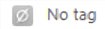
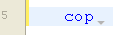
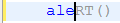
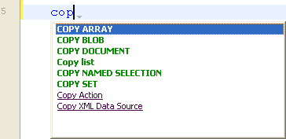
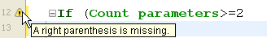
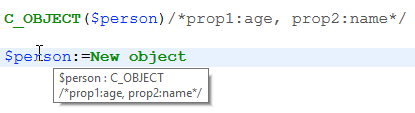
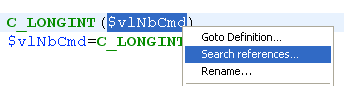

4D dispose d'un puissant éditeur de code intégré qui offre un large choix de fonctionnalités pour une édition de code hautement productive, telles que la complétion intelligente du code, la navigation dans le code, le débogage, la recherche, et bien plus encore.


L'éditeur de code fonctionne comme un éditeur de texte. L'écriture d'une méthode ou d'une classe est généralement une combinaison de saisie de texte, de sélection de composants et de déplacement d'éléments à partir de l'explorateur ou d'autres fenêtres. Vous pouvez également utiliser diverses fonctions d'anticipation (type-ahead) pour créer des méthodes plus rapidement.

Vous pouvez faire défiler le contenu des méthodes, des classes et des fonctions, qui peuvent comprendre jusqu'à 32 000 lignes de code ou 2 Go de texte.

L'éditeur de code 4D fournit un contrôle de base des erreurs de syntaxe. Un contrôle d'erreur supplémentaire est effectué lors de l'exécution du code. Pour plus d'informations sur la gestion des erreurs, voir [Débogage](../Debugging/basics.md).

## Interface

### Toolbar (Barre d’outils)

Chaque fenêtre de l'éditeur de code dispose d'une barre d'outils qui permet un accès instantané aux fonctionnalités de base liées à l'exécution et à l'édition du code.

| Élément                                 | Icône                                                                             | Description                                                                                                                                                                                                                                                                                                                                                                                       |
| --------------------------------------- | --------------------------------------------------------------------------------- | ------------------------------------------------------------------------------------------------------------------------------------------------------------------------------------------------------------------------------------------------------------------------------------------------------------------------------------------------------------------------------------------------- |
| **Exécuter la méthode**                 |                     | Lorsque vous travaillez avec des méthodes, chaque fenêtre de l'éditeur de code dispose d'un bouton qui peut être utilisé pour exécuter la méthode en cours. A l'aide du menu associé à ce bouton, vous pouvez choisir le type d'exécution:<ul><li> **Exécuter dans un nouveau process** : Crée un process et exécute la méthode en mode standard dans ce process.</li><li>**Exécuter et déboguer dans un nouveau process** : Crée un nouveau process et affiche la méthode dans la fenêtre du débogueur pour une exécution pas à pas dans ce process.</li><li>**Exécuter dans le process application** : Exécute la méthode en mode standard dans le contexte du process Application (en d'autres termes, la fenêtre d'affichage de l'enregistrement).</li><li>**Exécuter et déboguer dans le process application** : Affiche la méthode dans la fenêtre du débogueur pour une exécution pas à pas dans le contexte du processus d'application (en d'autres termes, la fenêtre d'affichage de l'enregistrement).</li></ul>Pour plus d'informations sur l'exécution des méthodes, voir [Méthodes projet](../Concepts/methods.md#calling-project-methods). |
| **Chercher dans la méthode**            |                                | Affiche la zone [*Chercher*](#find-and-replace).                                                                                                                                                                                                                                                                                                                                                  |
| **Liste des macros**                    |                              | Insère une macro dans la sélection. Cliquez sur la flèche déroulante pour afficher la liste des macros disponibles. Pour plus d'informations sur la création et l'instanciation des macros, voir [Macros](creating-using-macros.md).                                                                                                                                                              |
| **Contracter tout / Déployer tout**     |        | Ces boutons permettent de déployer ou de contracter toutes les structures de flux de contrôle du code.                                                                                                                                                                                                                                                                                            |
| **Propriétés de la méthode**            |        | Affiche la boîte de dialogue [Propriétés de la méthode](../Concepts/methods.md#project-method-properties) (méthodes de projet uniquement).                                                                                                                                                                                                                                                        |
| **Dernières valeurs du Presse-papiers** |  | Affiche les dernières valeurs stockées dans le presse-papiers.                                                                                                                                                                                                                                                                                                                                    |
| **Presse-papiers**                      |                        | Neuf presse-papiers sont disponibles dans l'éditeur de code. Vous pouvez [utiliser ces presse-papiers](./write-class-method.md#multiple-copy-paste-and-numbering-of-clipboards) en cliquant directement dessus ou en utilisant des raccourcis clavier. Vous pouvez utiliser l'[option Préférences](Preferences/methods.md#options-1) pour les masquer.                                            |
| **Menu déroulant de navigation**        |                        | Vous permet de naviguer à l'intérieur des méthodes et des classes avec du contenu étiqueté automatiquement ou des marqueurs déclarés manuellement. Voir ci-dessous                                                                                                                                                                                                                                |


### Zone d'édition

C'est ici que vous écrivez et modifiez votre code. L'éditeur indente automatiquement le texte du code et colore les différents éléments de la syntaxe pour une structure de code claire.

Vous pouvez personnaliser l'affichage de la zone d'édition. Toute personnalisation est automatiquement reportée sur toutes les fenêtres de l'éditeur de code :

| Option                                 | Description                                                                                                                                                                                                 | Set in...                                                                                                                                                                       |
| -------------------------------------- | ----------------------------------------------------------------------------------------------------------------------------------------------------------------------------------------------------------- | ------------------------------------------------------------------------------------------------------------------------------------------------------------------------------- |
| **font** and **font size**             | Sets the character font and size to be used in the editing area                                                                                                                                             | **Preferences** > [**Methods**](../Preferences/methods.md) or **Method > View** > **Bigger Font** or **Smaller Font**                                                           |
| **style and color of syntax elements** | assign a specific color and/or style to each type of element of the 4D language.  You can also change the different colors used in the interface of the editing area (highlighting, background, and so on). | Clic avec le bouton droit de la souris sur un élément de langage (variable, mot-clé, etc.) > Sous-menu **Style**. Or **Preferences** > [**Methods**](../Preferences/methods.md) |
| **spaces**                             | You can display the spaces between words using dots (.) instead of blank spaces. This option applies to all the code elements (command names, variables, comments, etc.).                                   | **Method > View > White Spaces**                                                                                                                                                |
| **thèmes**                             | You can select the Dark or Light theme, or set a custom one                                                                                                                                                 | **Preferences** > [**Methods**](../Preferences/methods.md)                                                                                                                      |
| **width of code indentations**         | Set the width of code indentations                                                                                                                                                                          | **Preferences** > [**Methods**](../Preferences/methods.md)                                                                                                                      |

#### Change bars

Colored bars instantly show you where lines of code were modified since the method was opened:


The change bars change colors to indicate whether or not the modifications were saved:

- yellow: Line was modified and method has not yet been saved.
- green: Line was modified and method has been saved.


### Zone des listes

La zone des listes permet d'afficher une ou plusieurs listes d'éléments nécessaires à l'écriture des méthodes et des classes (commandes, constantes, formulaires, etc.). Vous pouvez choisir le nombre et le contenu des listes affichées dans la fenêtre.

Par défaut, l'éditeur de code affiche quatre listes. Vous pouvez masquer ou afficher toutes les listes en cliquant sur l'icône en bas à droite de la fenêtre. 

Vous pouvez agrandir ou réduire la largeur relative de chaque zone de liste en faisant glisser l'une de ses partitions. Il est également possible d'ajuster la taille de la zone de liste par rapport à celle de la zone d'édition en faisant glisser la ligne de séparation entre les deux.

- Un double-clic sur un élément d'une liste entraîne son insertion dans la zone d'édition, à l'endroit où se trouve le curseur.
- Pour **modifier le contenu** d'une liste, cliquez sur la zone de titre de la liste concernée : un menu contextuel apparaît, vous permettant de choisir le type d'élément à afficher.


- Pour ajouter ou supprimer une liste, cliquez sur la zone de titre de l'une des listes et choisissez la commande correspondante dans le menu contextuel. La commande **Supprimer cette liste** est désactivée lorsque vous cliquez sur la dernière liste. Si vous souhaitez masquer toutes les listes, vous devez soit cliquer sur le bouton **show or hide lists**  en bas à droite de la fenêtre, soit les masquer par défaut dans **Preferences**.

- Vous pouvez masquer les listes dans toutes les fenêtres de la manière suivante :
  - Sélectionnez l'option **Affichage > Listes** dans le menu **Méthode** (une coche indique si les listes sont affichées)
  - Décochez l'option **Préférences** > **Méthodes** > **Options** > **Afficher les listes** . Pour que les modifications apportées dans la boîte de dialogue **Préférences** soient prises en compte, toutes les méthodes ouvertes, classes ou fonctions doivent d'abord être fermées puis rouvertes.

#### Listes d'éléments disponibles

Vous pouvez afficher les listes d'éléments suivantes dans la zone des listes de la fenêtre de l'éditeur de code :

- **Toutes les tables et les champs**: Noms des tables et des champs de la base de données sous la forme d'une liste hiérarchique. Lorsque vous insérez un nom de champ dans la méthode en double-cliquant sur son nom, 4D l'insère en respectant la syntaxe et ajoute le nom de la table ou de la sous-table selon le cas.
- **Table** (sous-menu) : Noms des champs de la table sélectionnée à l'aide d'un sous-menu.
- **Table actuelle**: noms des champs de la table actuelle (disponibles dans les déclencheurs, les méthodes de formulaire et les méthodes objet).
- **Formulaires Projet**: Nom des formulaires de projet de la base de données. Lorsque vous double-cliquez sur le nom d'un formulaire de projet, 4D l'insère en respectant la syntaxe : le nom du formulaire est inséré entre guillemets.
- **Formulaires table**: Noms des tables et des formulaires de la base de données sous la forme d'une liste hiérarchique. Lorsque vous insérez un nom de formulaire dans une méthode en double-cliquant sur son nom, 4D l'insère en respectant la syntaxe : le nom du formulaire est inséré entre guillemets et est précédé du nom de la table et d'un point-virgule. Par exemple: [Table]; "Formulaire".
- **Méthodes**: noms des méthodes du projet de la base de données.
- **Tous les dossiers**: Noms des dossiers et sous-dossiers d'objets définis dans la base de données, affichés sous la forme d'une liste hiérarchique. Les dossiers peuvent être utilisés pour organiser les objets de manière personnalisée. Ils sont gérés à partir de la page Démarrage de l'Explorateur.
- **Dossiers** (sous-menu) : Contenu du dossier sélectionné à l'aide d'un sous-menu.
- **Macros**: Noms des macros définies pour la base de données (voir [Créer et utiliser des macros](#creating-and-using-macros)).
- **Commandes**: Commandes du langage 4D par ordre alphabétique.
- **Commandes par thèmes**: Commandes du langage 4D classées par thème sous forme de liste hiérarchique.
- **Barres de menu**: Noms et numéros des barres de menu [créées avec l'éditeur de barres de menu 4D](../Menus/creating.md).
- **Constantes**: constantes 4D et celles des éventuels plug-ins, classées par thème sous forme de liste hiérarchique.
- **Listes**: Noms des listes.
- **Commandes des plug-ins**: Commandes pour tous les plug-ins installés dans la base de données (s'il y en a), classés par thème sous la forme d'une liste hiérarchique.
- **Mots clés SQL**: ensemble de mots-clés reconnus par l'analyseur de syntaxe SQL de 4D. Cette liste comprend des commandes (par exemple SELECT), des clauses (par exemple WHERE) ainsi que des fonctions (ABS).
- **Fonctions SQL**: fonctions SQL de 4D.

**Note :** A l'exception de l'élément Macros, toutes les listes sont classées par ordre alphabétique.

#### Enregistrer comme modèle

Vous pouvez enregistrer les listes définies dans la fenêtre de l'éditeur de code sous la forme d'un modèle. Une fois le modèle enregistré, les paramètres définis dans ce dernier seront utilisés pour chaque nouvelle fenêtre de l'éditeur de code qui sera ouverte.

Les paramètres suivants sont stockés dans le modèle :

- Taille relative des zones d'édition et de liste
- Nombre de listes
- Emplacement et contenu de chaque liste
- Largeur relative de chaque liste

Pour enregistrer une fenêtre de l'éditeur de code en tant que modèle, choisissez **Méthode** > **Enregistrer comme modèle**. Le modèle est enregistré immédiatement (aucune boîte de dialogue ne s'affiche). Il est stocké dans les **Préférences ** de l'application 4D. Si un modèle précédent existe déjà, il est remplacé.

### Zone de points d'arrêt

Cette zone, située à gauche de la zone d'édition, permet d'afficher les numéros de ligne et d'insérer des points d'arrêt directement à côté d'instructions spécifiques. Les points d'arrêt sont utiles pendant la phase de débogage de votre programmation. Ils arrêtent l'exécution de votre code à des endroits spécifiques et affichent le débogueur.

Pour plus d'informations sur les points d'arrêt, voir la section [Débogage](../Debugging/breakpoints.md#breakpoints) .

Vous pouvez afficher ou masquer les numéros de ligne dans la zone de points d'arrêt pour chaque fenêtre de l'éditeur de code.

- Pour activer ou désactiver l'affichage des numéros de ligne par défaut, choisissez **Préférences** > **Méthodes** > **Afficher numéros de lignes**.
- Pour modifier cet affichage séparément pour chaque fenêtre de l'éditeur de code, choisissez **Méthode** > **Affichage** > **Numéros de lignes**.

L'affichage des numéros de ligne permet de se repérer plus facilement dans la fenêtre. La commande **Méthode** > **Aller à la ligne n°...** vous permet également de profiter de cet affichage.

Ce type de recherche est utile lorsqu'il est utilisé conjointement avec le [compilateur](../Project/compiler.md), qui signale les erreurs d'exécution par le numéro de ligne où elles se produisent.

### Barre d'état

La barre d'état située en bas à droite de la fenêtre de l'éditeur affiche à tout moment la position du curseur :


- **Ln**: Numéro de ligne
- **Col**: Numéro de colonne, c'est-à-dire le niveau dans la hiérarchie des structures de programmation. Le premier niveau est 0. Le numéro de colonne est utile pour le débogage car cette information peut être fournie par l'interpréteur en cas d'erreur dans le code.
- **Ch**: Emplacement du caractère dans la ligne.
- : Masquer/afficher les listes.

Lorsque vous placez le curseur dans une commande, une fonction ou un paramètre, la barre d'état affiche la syntaxe de la commande. Si vous écrivez ou sélectionnez un paramètre, la zone affiche le paramètre actuel en **gras** : 

### Menu déroulant de navigation

Le menu de navigation vous aide à organiser votre code et à naviguer plus facilement dans vos classes et méthodes :


Certaines balises sont ajoutées automatiquement ; vous pouvez compléter la liste déroulante à l'aide de [marqueurs](#manual-tagging).

#### Navigation dans le code

Cliquez sur un élément de la liste déroulante pour accéder à sa première ligne dans le code. Vous pouvez également naviguer avec les touches fléchées et appuyer sur **Entrée**.

#### Balisage automatique

Les constructeurs, les déclarations de méthodes, les fonctions et les attributs calculés sont automatiquement balisés et ajoutés à la liste déroulante.

Lorsqu'il n'y a pas de balise dans la classe/méthode, l'outil affiche "No tag".

Les éléments suivants sont ajoutés automatiquement :

| Icône                                                                       | Élément                                       |
| --------------------------------------------------------------------------- | --------------------------------------------- |
|                          | Pas de balise                                 |
|                | Class constructor ou déclaration de méthode   |
|  | Attribut calculé (get, set, orderBy et query) |
|                      | Nom de la fonction de classe                  |

#### Balisage manuel

En ajoutant des marqueurs dans votre code, vous pouvez ajouter les balises suivantes à la liste déroulante :

| Icône                                                   | Élément        |
| ------------------------------------------------------- | -------------- |
|  | MARK : balise  |
|  | TODO : balise  |
|    | FIXME : balise |

Vous les déclarez en ajoutant des commentaires tels que :

```4d
// FIXME : Corrige les éléments suivants
```

Les déclarations ne sont pas sensibles à la casse ; écrire `fixme` : a le même effet.

L'ajout d'un trait d'union après la balise `MARK:` trace une ligne de séparation dans l'éditeur de code et dans le menu déroulant. Ainsi, cette saisie :


Se traduit par ceci :


Tous les marqueurs situés à l'intérieur des fonctions sont indentés dans la liste déroulante, à l'exception des balises `MARK:` situées à la fin des fonctions et non suivies d'instructions. Celles-ci apparaîtront au premier niveau.

#### Ordre d'affichage

Les balises sont affichées dans leur ordre d'apparition à l'intérieur de la méthode/classe.

Pour afficher les balises d'une méthode ou d'une classe par ordre alphabétique, effectuez l'une des opérations suivantes :

- Faites un **clic droit** sur l'outil déroulant
- maintenez la touche **Cmd** sous macOS ou **Alt** sous Windows, et cliquez sur l'outil de liste déroulante

> Les balises à l'intérieur des fonctions se déplacent avec leurs éléments parents.


### Raccourcis

De nombreuses fonctionnalités de l'éditeur de code de 4D sont disponibles par le biais de raccourcis clavier par défaut.

:::info macOS

Sous macOS, utilisez la touche **Command** au lieu de la touche **Ctrl** mentionnée (Windows).

:::

| **Shortcut**                                                    | **Action**                                                                                                                                 |
| --------------------------------------------------------------- | ------------------------------------------------------------------------------------------------------------------------------------------ |
| **Sélection et navigation**                                     |                                                                                                                                            |
| Double-clic                                                     | Select a language element name                                                                                                             |
| [Alt]+Double-clic                                               | Select a language element name contaning spaces (constant, method, etc.)                                                                   |
| [Shift]+[flèche droite]                                         | Create and enlarge the selection, character by character, to the right, or Reduce the selection, character by character, from the left     |
| [Shift]+[flèche gauche]                                         | Reduce the selection, character by character, from the right or Create and enlarge the selection, character by character, to the left      |
| [Shift]+[flèche vers le bas]                                    | Create and enlarge a selection, line by line, from the top to the bottom                                                                   |
| [Shift]+[flèche haut]                                           | Create and enlarge a selection, line by line, from the bottom to the top                                                                   |
| [Ctrl]+[Shift]+[flèche droite]                                  | Create and enlarge the selection, word by word, from the right                                                                             |
| [Ctrl]+[Shift]+[flèche gauche]                                  | Reduce the selection, word for word, from the right, or create and enlarge the selection, word by word, from the left                      |
| [Ctrl]+[flèche droite]                                          | Move the insertion point, word by word, from left to right                                                                                 |
| [Ctrl]+[flèche gauche]                                          | Move the insertion point, word by word, from right to left                                                                                 |
| [Alt]+[flèche vers le bas]                                      | Move the line(s) where the cursor is to the bottom                                                                                         |
| [Alt]+[flèche haut]                                             | Move the line(s) where the cursor is to the top                                                                                            |
| [Home]                                                          | Place the insertion point at the beginning of the line                                                                                     |
| [Fin]                                                           | Place the insertion point at the end of the line                                                                                           |
| [Ctrl]+[Home]                                                   | Place the insertion point at the beginning of the method                                                                                   |
| [Ctrl]+[Fin]                                                    | Place the insertion point at the end of the method                                                                                         |
| [Shift]+[Home]                                                  | Select all the characters in the line that are to the left of the cursor                                                                   |
| [Shift]+[Fin]                                                   | Select all the characters in the line that are to the right of the cursor                                                                  |
| [PgAV]                                                          | Scroll the contents of the method, page by page, from the bottom to the top (doesn't modify the insertion point)                           |
| [PgAR]                                                          | Scroll the contents of the method, page by page, from the top to the bottom (doesn't modify the insertion point)                           |
| [**Introspection**](#goto-definition)                           |                                                                                                                                            |
| [Ctrl]+K or [Alt]+double-click                                  | Same as [**Goto definition**](#goto-definition) command                                                                                    |
| \[Ctrl\] (Windows) or \[Alt\] (macOS)+hovering over a token | Underline the token (identified language element). Click on the underlined token = same as [**Goto definition**](#goto-definition) command |
| [**Chercher et remplacer**](#find-and-replace)                  |                                                                                                                                            |
| [Ctrl]+F                                                        | Chercher                                                                                                                                   |
| [Ctrl]+G                                                        | Find Next                                                                                                                                  |
| [Ctrl]+[Shift]+G                                                | Find Previous                                                                                                                              |
| [Ctrl]+E                                                        | Find Same Next                                                                                                                             |
| [Ctrl]+[Shift]+E                                                | Find Same Previous                                                                                                                         |
| [Ctrl]+[Alt]+F                                                  | Replace                                                                                                                                    |
| [Ctrl]+[Alt]+G                                                  | Replace Next                                                                                                                               |
| [Ctrl]+[Alt]+[Shift]+G                                          | Replace Previous                                                                                                                           |
| [**Presse-papiers**](#clipboards)                               |                                                                                                                                            |
| [Shift]+clic ou [Alt]+clic sur l'icône du presse-papiers        | Copy selected text to a clipboard                                                                                                          |
| [Ctrl]+[Shift]+number key                                       | Copy selected text to the number clipboard                                                                                                 |
| [Ctrl]+clic sur l'icône du presse-papiers                       | Paste contents of a clipboard at cursor location                                                                                           |
| [Ctrl]+number key                                               | Paste contents of the number clipboard at cursor location                                                                                  |

:::tip

La plupart de ces raccourcis peuvent être personnalisés dans la boîte de dialogue [Préférences 4D](../Preferences/shortcuts.md).

:::


## Editing Code

4D uses standard text editing techniques for typing and editing in the Code Editor.

The Code Editor uses display conventions (style, color) for the syntax elements. You can [customize these conventions](#customizing-the-editing-area). As you type, when you validate your entry, 4D evaluates the text of the line and applies the appropriate display format. 4D also indents each line to its proper level in relation to the preceding line when you use programming structures (If, End if...).

You can use the arrow keys to move from line to line quickly. Using the arrow keys to move across several lines is quicker than clicking because the editor delays evaluating the line for errors.

Under Windows, the code editor includes an Input Code Editor (IME) to facilitate code editing on Japanese or Chinese systems.

The Code Editor includes numerous [navigation shortcuts](#shortcuts).

#### Using the backslash

The backslash character (`\`) has a specific support in the 4D language:

- inserted at the end of lines, it allows to write a single statement on [several lines](../Concepts/quick-tour.md#code-on-several-lines).
- it allows to define [escape sequences](../Concepts/quick-tour.md#escape-sequences).


:::caution

The backslash character (`\`) is used as a separator in [pathnames under Windows](../Concepts/paths.md#windows). In general, 4D will correctly interpret Windows pathnames entered in the Code Editor by replacing the single backslash `\` with a double backslash ``\\`. For instance,``C:\MyDocuments`will become`C:\\MyDocuments`. However, if you write`"C:\MyDocuments\New"`, 4D will display`"C:\\MyDocuments\New"`. In this case, the second backslash is interpreted incorrectly as`\N`(an existing [escape sequence](../Concepts/quick-tour.md#escape-sequences)). You must therefore enter a double backslash`\\` when you want to have a backslash in front of a character used in one of the escape sequences recognized by 4D.

:::


### Drag-and-drop

From the Explorer, you can drag and drop tables, fields, forms, project methods, constants, or 4D commands. When you drag and drop an element, 4D always uses the correct syntax. For example, if you drag the field name First Name from the `[People]` table, it appears in the Code Editor as `[People]First Name`. Similarly, if you drag the Form name Input from the People table, it appears in the Code Editor as `[People];"Input"`.

When you insert a command by dragging it from the **Commands** page of the Explorer, it appears with its syntax (which consists of all of its parameters) in the Code Editor. This feature simply reminds you of the parameters that the command expects. You can then use a syntax that better suits your usage.


Vous pouvez également effectuer un glisser-déposer à l'intérieur d'une méthode, d'une classe ou d'une fonction, ou entre deux méthodes, classes ou fonctions différentes. Dans l'éditeur de code, le mécanisme de glisser-déposer est activé dès qu'une portion de texte est sélectionnée. By default, the drag-and-drop mechanism **moves** the selected text. In order to **copy** it, hold down the **Ctrl** key (Windows) or the **Option** key (macOS) during the operation.


### Changing case

You can automatically modify the case of selected characters using the commands in **Methods** > **Case** or the context menu of the editor:

- **Uppercase** / **Lowercase**: Switch the selected characters to uppercase or lowercase.
- **camelCase** / **CamelCase** : Switch the selected characters to "camel case". This consists in changing each first letter of a group of attached words to uppercase. This type of notation is often used for variable nomenclatures. hireDate and PurchaseDate are examples of two variants of camel case notation.

When you apply one of these commands to a text selection, the spaces and "_" characters are removed and the first letter of each word becomes uppercase.

### Swap expression

The **Swap Expression** function can be used to reverse the arguments of an expression assigning a value. For instance,

`variable1:=variable2`

becomes

`variable2:=variable1`

This function is extremely useful for reversing a set of assignments used to get or set properties, or to correct input errors. To use this function, select the line(s) to be modified, then choose **Method** > **Swap Expression** or use the context menu of the area. Within the selection, only the lines assigning a value will be modified.

### Presse-papiers

In addition to the standard copy-paste operation, 4D offers two additional functions that let you work with the contents of different clipboards:

- The program stores the last 10 "copy" or "cut" actions that were performed in the Code Editor in memory during the current session. Each of the different contents saved in this way can be reused at any time. To do this, use the **Clipboard History** command of the Code Editor context menu or the "Last Clipboard values" button of the toolbar:

    

    The first few words of the copied or cut items are displayed. Select an item to insert it at the current location of the cursor.

- Nine additional numbered clipboards are available and can be employed directly using the buttons of the Code Editor toolbar or [using keyboard shortcuts](#shortcuts):


### Moving lines

You can move the line where the cursor is directly without selecting it first using the **Move Lines Up** and **Move Lines Down** commands in the **Method** menu. You can also do this using the **Alt/Option** + **Up Arrow** or **Down Arrow** [keyboard shorcut](#shortcuts).


### Autocomplete functions

The Code Editor provides autocomplete functions. 4D automatically displays suggestions based on the first few characters typed.

In the example given below, typing the string "cop" causes the display of a blue triangle indicating that several suggestions are available:



When the characters you enter correspond to a single possibility, this suggested value appears greyed out (and is inserted if you hit the **Tab** key):  ---> 

> If you checked the **Insert () and closing } ) ] "** option in the **Methods** page of the **Preferences**, 4D will also automatically add **()** after a 4D command, keyword or project method that requires one or more mandatory arguments (after accepting a suggestion or completion):  -> 

Autocompletion also works with code structures (e.g. If..End if, For each...End for each): when you enter the first part of the structure, the Code Editor will automatically suggest the closing part:

If there are several suggestions available, 4D displays them in a pop-up list when you hit the **Tab** key:



The list is in alphabetical order. Choose the value by double-clicking it or scroll the list using the arrow keys of the keyboard and then hit **Enter**, **Carriage Return** or **Tab** to insert the selected value.

By default, you can also insert a suggested value by hitting one of the following delimiter `( ; : = < [ {` keys after selecting a value: the value inserted is then followed by the delimiter, ready for data entry.

  +  **(** key --> 

> You can disable the use of delimiters for inserting suggested values in **Preferences** > **Methods** > **Options**.

You can press the **Esc** key to close the pop-up list or you can continue typing while it is open. The values suggested in the pop-up list are updated as additional characters are typed.

If the characters typed correspond to different types of objects, the list displays them in their current style. The following types of objects can be displayed:

- 4D commands
- SQL commands
- User methods
- Table names
- Field names
- Constantes
- Local, process or interprocess variable, declared in the method
- Object property names
- Plug-in commands
- 4D keywords
- SQL keywords
- Macros (displayed between < >)

> For practical reasons, you can disable the automatic display of the list of suggestions for **constants**, **(local or interprocess) variables and object attributes** and/or **tables**. Ces options se trouvent dans **Préférences** > **Méthodes** > **Options**

#### Object property names

4D automatically displays case-sensitive suggestions of all valid object property names in 4D code when you:

- type a dot "." after an object or
- use the Tab key after a dereferenced object pointer "->".


> The `length` property is always included for use with collections.

Once created, property names are stored in an internal global list and are available anytime a method/class/function is opened, closed or changes focus.


The list of suggestions is dynamically updated while you edit code. When switching between windows, new/edited property names are always added to the global list. The list is also updated when you preview a method, class or function in the Explorer.

When the database is restarted, the list is reinitialized.

> You can disable the automatic display of object properties in **Preferences** > **Methods** > **suggestions**.


## Chercher et remplacer


The Code editor has powerful **find and replace** features that apply to the current window.

A search and replace area can be displayed in the toolbar of any method window:


To display this area, click on the **Find in method** icon of the [toolbar](#toolbar) or select a find or replace function either through a [**shortcut**](#shortcuts) or a command from the **Edit > Find** submenu. You can close this area at any moment by clicking on the **x** button at the rightmost side of the toolbar.

:::tip

The **Find in Design** feature in the 4D toolbar or in the **Edit** menu is not specific to the Code editor but may be used to search for a value among all the methods and classes.

:::


### Chercher

Select **Find > Find...** in the **Edit** menu or type **Ctrl+F** (Windows)/**Cmd+F** (macOS) to display/enable the *Search* area.

The search defined in this area will be performed in the code located in the window.

The **find** entry area enables you to enter the string to be searched for. This area is a combo box that stores the last 10 strings that have been searched for or replaced during the session. If you highlight text before choosing the **Find...** command, it will appear in this area. You can then either use this text or replace it with another.

Once a string is entered or selected, all occurrences found in the opened window are highlighted and the right side of the area displays the total number of hits found. It also indicates the current position of the cursor among all hits.

Hit the **Enter** key to select closest occurrence to the cursor. You can also click on the **Next / Previous** buttons  to select all occurrences sequentially towards the beginning or end of the current method, starting from the initial location of the cursor, or use the **Find Next** and **Find Previous** commands of the [**Edit** menu](#shortcuts).


#### Options

- **Case Sensitive** : Take the case of characters as they were entered in the find area into account. This option also takes into account diacritic characters. For instance, a search for "MyVar" will not find "myVar"; a search for "dej" will not find "déjà".
- **Whole Word** : Limit the search to exact occurrences of the word being searched for. Lorsque cette option est cochée, par exemple, une recherche sur "client" ne trouvera ni "clients" ni "myclient". Par défaut, cette option n'est pas cochée ; par conséquent, une recherche de "var" donnera "Myvar", "variation", etc.


### Replace

Click on the **v** toggle button on the left side of the *Search* area to display/hide the *Replace* area. You can also select **Find > Replace...** in the **Edit** menu or type **Ctrl+Alt+F** (Windows)/**Cmd+Alt+F** (macOS) .

The *Replace* entry area is used to define the character string that will replace the one defined above.

Click the **Replace** button to launch the search with all defined options and replace the first occurrence found. 4D begins searching from the current text insertion point and continues to the end of the method. It is then possible to continue finding/replacing using the **Replace Next** and **Replace Previous** commands of the [**Edit** menu](#shortcuts).

Click the **Replace all** button to replace all the occurrences corresponding to the search criteria directly in the open method.


### Find Same

The **Find Same** command is used to find character strings identical to the one selected. This command is only active if you have selected at least one character in the Code Editor.

The search carried out is of the "Find Next" type in the current code editor window.

The **Find Same Next** and **Find Same Previous** commands are used to find character strings *strictly* identical to the ones selected. For example, the case must match.


### Bookmark All

The **Edit > Bookmark All** command is enabled when a search has already been specified in the find or replace dialog box. When you select this command, 4D puts a bookmark at each line that contains an item corresponding to the "current" search criteria. This makes it easy to spot all the search results. For more information about bookmarks, refer to [Bookmarks](#bookmarks).


## Syntax errors

4D automatically checks the method syntax to see if it is correct. If you enter text or select a component that is not syntactically correct, 4D displays a symbol to indicate the incorrect expression . When you move the mouse over the symbol, a help tip displays the cause of the error:



When entering code, you can immediately check the syntax of the current line (without advancing to the next line) by pressing the **Enter** key on the numeric keypad. 4D evaluates the line, formats it, marks any errors, and places the insertion point at the end of the line. When a line of a method, class or function is marked as having improper syntax, check and fix the entry. If the line becomes correct, 4D removes the error symbol. When you save or close the window, the entire method is validated. You can also force validation by pressing the **Enter** key.

When the method, class or function is validated, 4D checks for:

- basic syntax errors
- the structure of statements (`If`, `End if` and so on)
- matching enclosing characters in the code such as parentheses or quotation marks. When you type an enclosing character, 4D indicates the match by framing the start/end characters with gray rectangles:


> If you click on an enclosing character in the code, 4D indicates its match with gray rectangles by default. You can modify the way 4D indicates matching enclosing characters or disable this feature in **Preferences** > **Methods** > **Options** > **Matching parentheses**.

The Code Editor can only check for obvious syntax errors (misspellings and the like). It does not check for errors that only occur during execution. Execution errors are caught by 4D when the code is executed.

4D has a built-in debugger (see [Debugging](../Debugging/debugger.md)) for handling and correcting these errors. The compiler also provides indispensable help for detecting errors. For more information about the compiler, refer to the [Compilation](../Project/compiler.md) chapter.

## Help tips

The Code Editor provides various contextual information using help tips. They appear when you mouse over an object.

:::tip

The [status bar](#status-bar) also provides contextual information.

:::

- **Errors**: When you mouse over the symbol indicating an error to the left of the editing area, a help tip displays the cause of the error (see [Syntax errors](#syntax-errors)).

- **4D command documentation**: When you move the mouse over a 4D command or function, a help tip provides its syntax along with a brief description of how it works. 

- **Variable type and description**: When you mouse over a variable, a help tip shows its type (if it has been explicitly defined in the method) and associated comment, if any. 

- **Project methods or functions**: When you mouse over a project method or class function, a help tip displays:

  - either the comments specified in the Explorer.
  - or the first few lines of the method or class function if it includes comments (lines beginning with // or /*...*/ comment block). It is common practice to insert documentation for the method as well as its parameters in the form of comments at the beginning of the method. You can get this information directly in the help tip, just make sure to first remove any comments found in the Explorer. Comments at the beginning of a method:  Help tip in another method: 

- You can also create a **dedicated documentation file** named `<MethodName>.md` in the `<package>/documentation` folder. See [Viewing documentation in the code editor](../Project/documentation.md#viewing-documentation-in-the-code-editor)


## Comment / Uncomment

Le langage 4D supporte les [commentaires](../Concepts/quick-tour.md#comments), qui sont des lignes de code inactives. L'éditeur de code n'applique pas de style particulier dans les commentaires. The length of comments is limited to the maximum size of 32,000 characters per line. Le nombre de lignes n'est pas limité.

There are two kinds of comments: `//comment` (single line comment) and `/*comment*/`(inline comments or multiline comment blocks).

Des commentaires peuvent être créés en tapant les caractères `/`. Ou encore, la commande **Comment/Uncomment** , présente dans le menu **Method** ainsi que dans le menu contextuel de l'éditeur de code, permet de marquer un groupe de lignes de code sélectionnées en tant que commentaires d'une seule ligne ou, au contraire, de supprimer les caractères de commentaires d'une seule ligne d'une sélection. Pour utiliser cette commande, sélectionnez le code à marquer comme commenté, puis sélectionnez la commande **Comment/Uncomment** :

 --> 

Lorsque la sélection ne contient que du code actif, la commande **Comment** est appliquée. Lorsque la sélection comprend à la fois du code actif et des lignes commentées, une paire supplémentaire de caractères de commentaire ( // ) est ajoutée à ces dernières ; de cette façon, elles conserveront leur statut de commentaire initial si la ligne est ensuite "décommentée". Lorsque la sélection ne contient que des lignes commentées, la commande **Uncomment** est appliquée.

> The **Comment/Uncomment** command only operates with full lines --- it cannot be used to comment only part of a line.


## Expand / Collapse

4D code located inside loops and conditions can now be collapsed or expanded, in order to facilitate the reading of methods:

- Expanded code: 

- Collapsed code: 

If you place the mouse over the expand button [...], a help tip appears, displaying the first lines of the hidden code.

A collapsed portion of code can be selected, copied, pasted or deleted. All the lines included therein will be copied, pasted or deleted respectively. When a portion of code is pasted, it is automatically expanded.

There are several ways to expand and collapse code:

- Click on the expand/collapse icons ([+] and [-] under Windows) or on the opening button [...]
- Use the commands of the **Method > Collapse/Expand** submenu:

  - **Collapse Selection** / **Expand Selection**: collapses or expands all the code structures found in the text selection.
  - **Collapse Current Level** / **Expand Current Level**: collapses or expands the code structure at the level where the cursor is located. These commands are also available in the **context menu** of the editor.
  - **Collapse All** / **Expand All**: collapses or expands all the loops and conditions of a method. These commands are also available in the toolbar of the editor.


## Blocks

Blocks can be defined by:

- Guillemets
- Parentheses
- A logical structure (If/Else/End if, While/End while, Repeat/Until Case of/End case)
- Braces

### Select Enclosing Block

The **Select Enclosing Block** function is used to select the "enclosing block" of the code containing the insertion point.

If a block of text is already selected, the function selects the enclosing block of the next highest level and so on, until the entire method is selected.

Pressing **Ctrl+Shift+B** (Windows) or **Command+Shift+B** (macOS) enables you to reverse this operation and deselect the last enclosing block selected.

**Note:** If the insertion point is placed in an `If` or `Else` type structure, the enclosing block will be the one containing, respectively, the `If` or `Else` statement.


### Start of Block or End of Block

Two commands make it easier to move around within code structures (e.g. `If...Else...End if`):

- **Start Of Block**: places the cursor at the start of the current structure, just before the initial keyword.
- **End Of Block**: places the cursor at the end of the current structure, just after the final keyword.

These commands are found in the **Method** menu as well as the context menu of the editor. You can also use the following shortcuts:

- Windows: **Ctrl + up arrow** or **Ctrl** + **down arrow**‚
- macOS: **Command** + **up arrow** or **Command** +**down arrow**.

## Bookmarks

4D lets you associate bookmarks with certain lines in your methods. You can then browse quickly within the code by passing from one bookmark to another using specific commands.


A bookmark moves along with its original row if additional rows are inserted in the method. Bookmarks are saved with the methods.

Bookmarks are managed using the **Bookmarks** submenu of the **Method** menu:

- **Toggle**: Associates a bookmark with the current line (where the cursor is located) if it does not already have one or removes the existing bookmark if it does. This function is also available using the **Toggle Bookmark** command of the editor's context menu or using the **Ctrl+F3** (Windows) or **Command+F3** (macOS) keyboard shortcut.
- **Remove All**: Removes all bookmarks from the foreground window.
- **Goto Next** / **Goto Previous**: Enables browsing among bookmarks in the window. Selecting one of these commands places the cursor on the first character of the line associated with the bookmark concerned. You can also use the keyboard shortcuts **F3** (go to next) or **Shift+F3** (go to previous).

:::info

You can use bookmarks as markers for lines that contain an [item found by a search](#find). In this case, 4D automatically adds the bookmarks. For more information, refer to [Bookmark all](#bookmark-all).

:::

## Reveal in Explorer

The **Reveal in Explorer...** command opens an Explorer window with the target element selected. To do this, place the cursor inside the element's name or select it, then choose **Method** > **Reveal in Explorer...** .


## Search Callers

The **Search Callers** command in the **Method** menu is only enabled for project methods. It searches for all the objects (other methods or menus) that reference the project method.

**Note:** The **Search Callers...** command is also available in **Explorer** > **Methods**

This command displays its results in a new window.


## Goto Definition

The **Goto Definition** command opens the definition of an element referenced in the Code Editor. To do this, place the cursor inside the object name or select it, and choose **Method** > **Goto Definition...** or use the context menu of the editor.

:::tip

This feature is also available through the keyboard shortcut **Ctrl+K** (Windows) / **Command+K** (macOS) or  **Alt+double-click**.

:::

The effect of the **Goto Definition...** command varies depending on the target element:

- with a project method, it displays the contents of the method in a new window of the Code Editor
- with a class name or class function, it opens the class in the the Code Editor
- with a built-in 4D command or function, it has the same effect as the [**Show documentation**](#show-documentation) command.

## Show documentation

The **Show documentation...** command opens the documentation for the target element. To do this, place the cursor inside the element's name or select it, then choose **Method** > **Show documentation...** or use the contextual menu. The effect varies depending on the target element. Par exemple :

- Selecting a project method or a user class and choosing **Show documentation...** selects the method in the Explorer and switches to the documentation tab
- Selecting a 4D command, function, or class name and choosing **Show documentation...** displays the online documentation.
- If no element is selected, the command opens the documentation of the method currently opened in the Code Editor, [if any](../Project/documentation.md).

:::tip

To display the documentation of a 4D "classic" language command, select the command name or simply place the cursor in the name and press **F1**. The documentation of the command is displayed in a new window of your default browser. 4D looks for the documentation depending on the settings made in the Preferences (see [Documentation location](../Preferences/general.md#documentation-location)).

:::


## Search References

The **Search References...** command found in the **Method** menu or the context menu of the Code Editor finds all the objects (methods and forms) in the project where the current item of the method is referenced (used).

The current item is either the one selected or the one where the cursor is located. It can be a field name, variable name, command, string, and so on. For example, the following action looks for all the occurrences of the *vlNbCmd* variable in the database:



This command displays its results in a new window.

