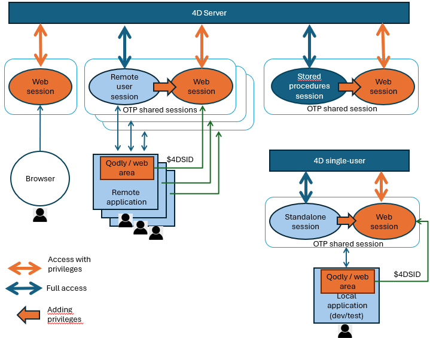

Une **session desktop** est un contexte d'exécution lié à l'utilisateur sur 4D Server ou 4D mono-utilisateur qui ne résulte pas d'un accès web ou REST.

Tout comme dans une [**session utilisateur web**](../WebServer/sessions.md), le code exécuté dans une session desktop a accès à un objet [`Session`](../API/SessionClass.md) qui fournit des fonctions et des propriétés permettant de stocker les valeurs de session et de les partager entre les process utilisateur, par exemple en utilisant l'objet [`session.storage`](../API/SessionClass.md#storage).

Toutefois, à la différence du code exécuté dans les sessions utilisateurs Web, le code exécuté dans les sessions desktop n'est pas soumis aux règles des [rôles et privilèges](../ORDA/privileges.md). Il peut accéder à toutes les parties de l'application 4D, y compris ORDA et les classes du modèle de données. Sur 4D Server, la fonctionnalité des [utilisateurs et groupes](../Users/handling_users_groups.md) permet de gérer les accès des utilisateurs.

Vous pouvez néanmoins [**partager** une session desktop avec une session web](#sharing-a-desktop-session-for-web-accesses) afin qu'un utilisateur desktop puisse accéder à votre application 4D par le biais d'une interface web, en utilisant par exemple des pages Qodly et des zones web.

## Types de sessions {#session-types}

Les sessions desktop comprennent :

- les **Sessions utilisateur distant** : Dans les applications client/serveur, la session qui gère les process utilisateur sur le serveur.
- les **Sessions des procédures stockées** : Dans les applications client/serveur, la session utilisateur virtuelle unique qui gère toutes les procédures stockées exécutées sur le serveur.
- les **Sessions autonomes**: Objet de session locale retourné dans une application mono-utilisateur (utile dans les phases de développement et de test des applications client/serveur).

:::note

N'oubliez pas que des [**Sessions Web**](../WebServer/sessions.md) sont utilisées dès qu'on accède au projet 4D via des requêtes Web ou REST et que les [sessions évolutives](../WebServer/sessions.md#enabling-web-sessions) sont activées.

:::

Le diagramme suivant montre les différents types de sessions et leur interaction :



## Sessions utilisateurs distants {#remote-user-sessions}

Sur le serveur, dans les "process utilisateur" (c'est-à-dire les process liés aux utilisateurs distants), la commande [`Session`](../commands/session.md) renvoie un objet `session` décrivant la session de l'utilisateur courant. Cet objet est géré via les fonctions et les propriétés de la classe [`Session`](../API/SessionClass.md).

:::note

Sur un 4D distant, la commande [`Session`](../commands/session) renvoie toujours null.

:::

:::tip Articles de blog sur le sujet

[Objet session distante 4D avec connexion Client/Serveur et procédure stockée](https://blog.4d.com/new-4D-remote-session-object-with-client-server-connection-and-stored-procedure).

:::

### Utilisation

L'objet `session` vous permet de gérer les informations et les privilèges de la session de l'utilisateur distant.

Vous pouvez partager des données entre tous les process de la session utilisateur en utilisant l'objet partagé [`session.storage`](../API/SessionClass.md#storage). Par exemple, vous pouvez lancer une procédure d'authentification et de vérification de l'utilisateur lorsqu'un client se connecte au serveur, impliquant la saisie d'un code envoyé par e-mail ou SMS dans l'application. Ensuite, vous ajoutez les informations de l'utilisateur au storage de session, ce qui permet au serveur d'identifier l'utilisateur. De cette façon, le serveur 4D peut accéder aux informations de l'utilisateur pour tous les process clients, permettant l'écriture de code personnalisé en fonction du rôle de l'utilisateur.

Vous pouvez également attribuer des privilèges à une session d'utilisateur distant pour contrôler l'accès lorsque la session provient de pages Qodly exécutées dans des zones Web.

### Disponibilité

L'objet `session` de l'utilisateur distant est disponible depuis :

- Les méthodes projet qui ont l'attribut [Exécuter sur serveur](../Project/project-method-properties.md#execute-on-server) (elles sont exécutées dans le process jumeau du process client),
- Les Triggers,
- Les [fonctions ORDA du modèle de données](../ORDA/ordaClasses.md) (sauf celles déclarées avec le mot-clé [`local`](../ORDA/ordaClasses.md#local-functions)),
- Les méthodes base telles que [`On Server Open Connection`](../commands/on-server-open-connection-database-method) et [`On Server Close Connection`](../commands/on-server-close-connection-database-method).

## Sessions de procédures stockées {#stored-procedure-sessions}

Sur le serveur, toutes les [procédures stockées](https://doc.4d.com/4Dv20/4D/20/Stored-Procedures.300-6330553.en.html) partagent la même session utilisateur virtuelle.

### Utilisation

Vous pouvez partager des données entre tous les process d'une session de procédure stockée à l'aide de l'objet partagé [`session.storage`](../API/SessionClass.md#storage).

### Disponibilité

L'objet `session` des procédures stockées est disponible depuis :

- les méthodes projet appelées par la commande [`Execute on Server`](../commands-legacy/execute-on-server.md),
- les [fonctions ORDA du modèle de données](../ORDA/ordaClasses.md) appelées à partir d'une procédure stockée,
- les méthodes base telles que [`On Server Startup`](../commands/on-server-startup-database-method) et [`On Server Shutdown`](../commands/on-server-shutdown-database-method).

## Sessions autonomes {#standalone-sessions}

Une session autonome est une session mono-utilisateur qui s'exécute lorsque vous travaillez localement avec 4D.

### Utilisation

La session autonome peut être utilisée pour développer et tester votre application client/serveur et son interaction avec les sessions web et le [partage d'OTP](#sharing-a-desktop-session-for-web-accesses). Vous pouvez utiliser l'objet `session` dans votre code d'une session autonome tout comme l'objet `session` des sessions distantes.

### Disponibilité

L'objet `session` d'une application autonome est disponible pour toutes les méthodes et le code exécutés sur l'application 4D.

## Partage d'une session desktop pour les accès web {#sharing-a-desktop-session-for-web-accesses}

Les sessions desktop peuvent être utilisées pour gérer les accès web d'un même utilisateur à l'application et ainsi contrôler ses [privilèges](../ORDA/privileges.md). Cette possibilité est particulièrement utile pour les applications Client/serveur dans lesquelles des [pages Qodly](https://developer.4d.com/qodly/4DQodlyPro/pageLoaders/pageLoaderOverview) sont utilisées pour l'interface, sur des machines clientes distantes. Avec cette configuration, vos applications disposent d'interfaces web modernes basées sur les CSS, tout en bénéficiant de la puissance et de la simplicité du développement intégré client/serveur. Dans ces applications, les pages Qodly sont exécutées dans des [zones Web](../FormObjects/webArea_overview.md) 4D standard.

Pour gérer cette configuration en production, vous devez utiliser des sessions utilisateur distant. En fait, les requêtes provenant à la fois de l'application 4D distante et de ses pages Qodly chargées dans les zones Web doivent fonctionner au sein de la même session. Il suffit de partager la session entre le client distant et ses pages web afin de disposer du même [session storage](../API/SessionClass.md#storage) et de la même licence client, quelle que soit l'origine de la requête (web ou 4D distant).

Notez que les [privileges](../ORDA/privileges.md) doivent être définis dans la session avant d'exécuter une requête web, afin que l'utilisateur obtienne automatiquement ses privilèges pour l'accès au web (voir l'exemple). N'oubliez pas que les privilèges **ne s'appliquent qu'aux requêtes provenant du web**.

Vous pouvez développer cette configuration dans votre application 4D Developer (mono-utilisateur) : vous pouvez utiliser la [session autonome](#standalone-sessions) pour coder et tester toutes les fonctionnalités liées à l'accès web, que votre application soit destinée à un déploiement mono-utilisateur ou client/serveur.

Les sessions partagées sont gérées par des [tokens OTP](../WebServer/sessions.md#session-token-otp). Les sessions partagées sont gérées par des [tokens OTP](../WebServer/sessions.md#session-token-otp). Après avoir créé un token OTP pour la session distante, vous ajoutez le token (par l'intermédiaire de la valeur du paramètre `$4DSID`) aux requêtes Web envoyées à partir des zones Web contenant des pages Qodly (ou à partir de n'importe quel navigateur Web) afin que la session de l'utilisateur sur le serveur soit identifiée et partagée.

:::note

Lors de la création d'un token OTP en environnement client/serveur, vous devez exécuter le [code de création de l'OTP](../API/SessionClass.md#createotp) **sur le serveur** (l'objet `Session` est Null sur un 4D distant). Vous pouvez par exemple utiliser la méthode base [`On Server Open Connection`](../commands-legacy/on-server-open-connection-database-method.md).

:::

:::tip Article(s) de blog sur le sujet

[Intégrez des pages Qodly dans une zone Web 4D sans frais supplémentaires](https://blog.4d.com/share-your-4d-remote-client-session-with-web-accesses/)<br/>
[Améliorez votre interface Desktop avec des widgets Web en utilisant 4D Qodly Pro](https://blog.4d.com/build-modern-hybrid-desktop-apps-with-4d-and-qodly-pro/)

:::

### Exemple

Dans un formulaire, obtenez un OTP et ouvrez une page Qodly dans une zone Web :

```4d
Form.otp:=getOTP

Form.url:="http://localhost/$lib/renderer/?w=Products&$4DSID="+Form.otp

WA OPEN URL(*; "QodlyPage"; Form.url)

```

La méthode de projet *getOTP* (avec la propriété [**Exécuter sur le serveur**](../Project/project-method-properties.md#execute-on-server) en Client/Server) :

```4d
// En client/serveur:
// ----------------
// Méthode exécutée sur le serveur car l'objet session est sur le serveur
// L'objet Session est Null sur le client 
//

#DECLARE() : Text

return Session.createOTP()

```

Voici le code utilisé pour placer le privilège "viewProducts" dans la session :

```4d
// En client/serveur:
// ----------------
// Ce code doit être exécuté sur le serveur car l'objet session est sur le serveur
// L'objet Session est Null sur la session client 

Session.clearPrivileges() // Nettoie la session de ses anciens privilèges
Session.setPrivileges("viewProducts")
```

