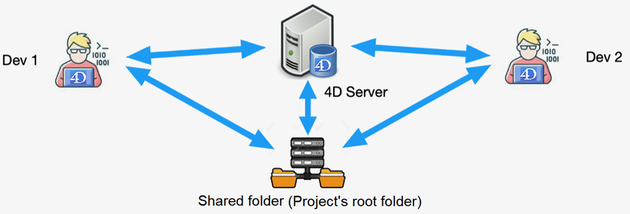

Les applications 4D Desktop peuvent être utilisées dans une configuration Client/Serveur, en tant qu'applications client/serveur fusionnées ou en tant que projets distants.

- Les **applications client/serveur fusionnées** sont générées par le [Générateur d'application](building.md#clientserver-page). Elles sont utilisées pour les déploiements d'applications.

- Les **projets distants** sont des fichiers [.4DProject](Project/architecture.md) ouverts par 4D Server et accessibles avec 4D en mode distant. Le serveur envoie une version .4dz du projet ([format compressé](building.md#build-compiled-structure)) au 4D distant, donc les fichiers de structure sont en lecture seule. Cette configuration est généralement utilisée pour les tests d'application.

> La connexion à un projet distant à partir de **la même machine que 4D Server** permet de modifier les fichiers du projet. Cette [fonctionnalité spécifique](#using-4d-and-4d-server-on-the-same-machine) permet de développer une application client/serveur dans le même contexte que le contexte de déploiement.

## Ouvrir une application client/serveur fusionnée

Une application client/serveur fusionnée est personnalisée et son démarrage est simplifié :

- Pour lancer la partie serveur, l’utilisateur double-clique simplement sur l’application serveur. Il n’est pas nécessaire de sélectionner le fichier projet.
- Pour lancer la partie cliente, l’utilisateur double-clique simplement sur l’application cliente, qui se connecte directement à l’application serveur.

Ces principes sont détaillés dans la page du [Générateur d'application](building.md#what-is-a-clientserver-application).

## Ouvrir un projet distant

La première fois que vous vous connectez à un projet 4D Server via un 4D distant, vous utiliserez généralement la boîte de dialogue de connexion standard. A chaque fois que 4D effectue une action **Enregistrer tout** depuis l'environnement de développement (explicitement depuis le menu **Fichier** ou implicitement en passant en mode application par exemple), 4D Server recharge de manière synchrone les fichiers du projet.

Pour vous connecter à distance à un projet 4D Server :

1. Effectuez l'une des opérations suivantes :
   - Sélectionnez **Se connecter à 4D Server** dans la boîte de dialogue de l'Assistant de bienvenue
   - Sélectionnez **Ouvrir > Projet distant...** à partir du menu **Fichier** ou du bouton **Ouvrir** de la barre d'outils.

La boîte de dialogue de connexion à 4D Server apparaît. Cette boîte de dialogue comporte trois onglets : **Récent**, **Disponible** et **Personnalisé**.

Si 4D Server est connecté au même sous-réseau que le 4D distant, sélectionnez **Disponible**. 4D Server inclut un système de diffusion intégré qui, par défaut, publie le nom des projets 4D Server disponibles sur le réseau. La liste est triée par ordre d'apparition et est mise à jour dynamiquement.

Pour vous connecter à un serveur de la liste, double-cliquez sur son nom ou sélectionnez-le et cliquez sur le bouton **OK**.

Si le projet publié n'est pas affiché dans la liste **Disponible**, sélectionnez **Personnalisé**. La page Personnalisé vous permet de vous connecter à un serveur publié sur le réseau en utilisant son adresse réseau et en lui attribuant un nom personnalisé.

- **Nom du projet** : définit le nom local du projet 4D Server. Ce nom sera utilisé dans la page **Récent** pour faire référence au projet.
- **Adresse réseau** : L'adresse IP de la machine sur laquelle le 4D Server a été lancé.
  - Si deux serveurs sont exécutés simultanément sur la même machine, l'adresse IP doit être suivie de deux points et d'un numéro de port, par exemple : `192.168.92.104:19814`.
  - Par défaut, le port de publication d'un 4D Server est 19813. Ce numéro peut être modifié dans les paramètres du projet.

> L'option [**Activer le mode développement**](#development-mode) ouvre la connexion à distance dans un mode lecture/écriture spécial et nécessite de pouvoir accéder au dossier du projet depuis le 4D distant.

Une fois que cette page attribue un serveur, cliquez sur le bouton **OK** pour vous connecter au serveur.

Une fois la connexion au serveur établie, le projet distant sera répertorié dans l'onglet **Récent**.

### Mettre à jour des fichiers de projet sur le serveur

4D Server crée et envoie automatiquement aux machines distantes une version [.4dz](building.md#build-compiled-structure) du fichier de projet *.4DProject* (non compressé) en mode interprété.

- Une version .4dz mise à jour du projet est automatiquement produite lorsque cela est nécessaire, c'est-à-dire lorsque le projet a été modifié et rechargé par 4D Server. Le projet est rechargé :
  - automatiquement, lorsque la fenêtre de l'application 4D Server arrive à l'avant de l'OS ou lorsque l'application 4D sur la même machine enregistre une modification (voir ci-dessous).
  - lorsque la commande [`RELOAD PROJECT`](../commands/reload-project) est exécutée. L'appel de cette commande est nécessaire lorsque, par exemple, vous avez extrait une nouvelle version du projet depuis la plateforme de contrôle de version.

### Mettre à jour des fichiers de projet sur les machines distantes

Lorsqu'une version .4dz mise à jour du projet a été produite sur 4D Server, les machines 4D distantes connectées doivent se déconnecter et se reconnecter à 4D Server afin de bénéficier de la version mise à jour.

## Utiliser 4D et 4D Server sur la même machine

Lorsque 4D se connecte à un 4D Server sur la même machine, l'application se comporte comme 4D en mode monoposte et l'environnement de développement permet d'éditer les fichiers du projet. Cette fonctionnalité vous permet de développer une application client/serveur dans le même contexte que le contexte de déploiement.

> Lorsque 4D se connecte à un 4D Server sur la même machine, le **mode de développement** est automatiquement activé, quel que soit l'état de l'option [Activer le mode développement](#development-mode).

A chaque fois que 4D effectue une action **Enregistrer tout** depuis l'environnement de développement (explicitement depuis le menu **Fichier** ou implicitement en passant en mode application par exemple), 4D Server recharge de manière synchrone les fichiers du projet. 4D attend que 4D Server termine le rechargement des fichiers du projet avant de continuer.

Veillez cependant aux différences de comportement suivantes, comparées à [l'architecture projet standard](Project/architecture.md) :

- le dossier userPreferences.\{username\} utilisé par 4D n'est pas le même que celui utilisé par 4D Server dans le dossier projet. Au lieu de cela, il s'agit d'un dossier dédié, nommé "userPreferences", stocké dans le dossier système du projet (c'est-à-dire au même emplacement que lors de l'ouverture d'un projet .4dz).
- le dossier utilisé par 4D pour les données dérivées n'est pas le dossier "DerivedData" du dossier projet. Il s'agit plutôt d'un dossier dédié nommé "DerivedDataRemote" situé dans le dossier système du projet.
- le fichier catalog.4DCatalog n'est pas édité par 4D mais par 4D Server. Les informations du catalogue sont synchronisées à l'aide des requêtes client/serveur
- le fichier directory.json n'est pas édité par 4D mais par 4D Server. Les informations du répertoire sont synchronisées à l'aide des requêtes client/serveur
- 4D utilise ses propres composants internes et plug-ins au lieu de ceux de 4D Server.

> Il n'est pas recommandé d'installer des plug-ins ou des composants au niveau de l'application 4D ou 4D Server.

## Mode développement

Le **Mode développement** de 4D Server est un mode spécial d'ouverture de projet qui permet l'accès en lecture/écriture aux applications 4D distantes connectées. Le projet doit être disponible en [**interprété**](../Concepts/interpreted.md).

Ce mode permet à un ou plusieurs développeurs de travailler simultanément sur le même projet dans l'environnement de Développement. Lorsqu'un projet est ouvert en **mode développement** :

- les fichiers du projet sont disponibles en lecture/écriture afin que vous puissiez éditer les méthodes, les formulaires, etc.
- plusieurs développeurs 4D distants peuvent ouvrir simultanément les mêmes fichiers du projet interprété et les modifier. Un système de verrouillage automatique empêche les accès simultanés à la même ressource.
- les modifications sont mises à la disposition de tous les développeurs distants. A noter cependant qu'il n'y a pas de "push" automatique vers les développeurs distants., ils doivent actualiser pour obtenir les dernières versions des fichiers (un rafraîchissement est effectué chaque fois que le développeur passe du mode développement au mode application par exemple, ou lorsqu'il sélectionne **Enregistrer tout** dans le menu **Fichier**).

Pour utiliser ce mode, sélectionnez l'option **Activer le mode développement** dans la [boîte de dialogue de connexion](#opening-a-remote-project) à partir de votre 4D distant. Vous êtes invité à **Sélectionner le fichier de projet 4D** : vous devez sélectionner le [fichier .project](../Project/architecture.md#applicationname4dproject-file) que 4D Server a ouvert. Si vous sélectionnez un autre fichier, une boîte de dialogue d'alerte vous avertit que le mode développement n'est pas disponible. Cela signifie que le 4D distant doit avoir accès au dossier du projet sur le réseau (l'ensemble du dossier du projet doit être partagé, c'est-à-dire le dossier racine du projet).

:::caution

Pour des raisons de performance avec cette configuration, il est fortement recommandé de stocker le dossier du projet sur un serveur de fichiers dédié (par exemple un NAS) sur un réseau local.

:::

:::note

Lorsque le serveur et le 4D distant se trouvent sur la même machine, [des règles supplémentaires s'appliquent](#using-4d-and-4d-server-on-the-same-machine).

:::

Voici un aperçu de l'architecture du mode de développement :

:::note Compatibilité

Cette fonctionnalité est destinée aux équipes de développement qui ont l'habitude de travailler sur des bases de données binaires et qui souhaitent bénéficier des fonctionnalités des projets tout en conservant leur organisation actuelle. Cependant, pour un développement multi-utilisateurs sur des projets 4D, nous recommandons d'utiliser une architecture standard où les développeurs travaillent sur leur machine et gèrent leur travail à l'aide d'outils de gestion de version (Git, SVN, etc.). Cette organisation offre une grande flexibilité en permettant aux développeurs de travailler sur différentes branches, et de comparer, fusionner, ou annuler les modifications qui ont été apportées.

:::

:::tip Article(s) de blog sur le sujet

[Développement simultané sur 4D Server en mode projet](https://blog.4d.com/developing-concurrently-on-4d-server-in-project-mode/)

:::

## Code execution location

In a client/server application, it is important to know where your code will be actually executed: **server-side** or **client-side**. Execution location is crucial when you want to implement user session-related code, share information between processes, access data, etc.

The following table summarizes where the code is executed by default and how to switch its execution location (if allowed). Note that **local** means that the code will be executed on the machine from where it is actually called.

| Code                                                                                                                                                                                                                                                                                                            | Default execution | How to switch                                                                                                                                                                                                                                                                                                              |
| --------------------------------------------------------------------------------------------------------------------------------------------------------------------------------------------------------------------------------------------------------------------------------------------------------------- | ----------------- | -------------------------------------------------------------------------------------------------------------------------------------------------------------------------------------------------------------------------------------------------------------------------------------------------------------------------- |
| [ORDA data model functions](../ORDA/ordaClasses.md)                                                                                                                                                                                                                                                             | server            | use `local` keyword in function definition                                                                                                                                                                                                                                                                                 |
| ORDA computed attribute functions [`get()`](../ORDA/ordaClasses.md#function-get-attributename), [`set()`](../ORDA/ordaClasses.md#function-set-attributename)                                                                                                                                                    | server            | use `local` keyword in function definition                                                                                                                                                                                                                                                                                 |
| ORDA computed attribute functions [`query()`](../ORDA/ordaClasses.md#function-query-attributename), [`orderBy()`](../ORDA/ordaClasses.md#function-orderby-attributename)                                                                                                                                        | server            | n/a                                                                                                                                                                                                                                                                                                                        |
| ORDA event functions [(general)](../ORDA/orda-events.md)                                                                                                                                                                                                                                     | server            | n/a                                                                                                                                                                                                                                                                                                                        |
| ORDA event function [`constructor()`](../ORDA/ordaClasses.md#class-constructor-1)                                                                                                                                                                                                                               | local             | n/a                                                                                                                                                                                                                                                                                                                        |
| ORDA event function [`event touched()`](../ORDA/orda-events.md#function-event-touched)                                                                                                                                                                                                                          | server            | use `local` keyword in function definition                                                                                                                                                                                                                                                                                 |
| [User class functions](../Concepts/classes.md#function)                                                                                                                                                                                                                                                         | local             | n/a                                                                                                                                                                                                                                                                                                                        |
| [Shared or session singleton function](../Concepts/classes.md#singleton-classes)                                                                                                                                                                                                                                | local             | use `server` keyword in function definition                                                                                                                                                                                                                                                                                |
| Trigger                                                                                                                                                                                                                                                                                                         | server            | n/a                                                                                                                                                                                                                                                                                                                        |
| Project method called from a client                                                                                                                                                                                                                                                                             | client            | check [**Execute on server** option](../Project/project-method-properties.md#execute-on-server). Le code est exécuté dans le processus jumeau du [processus de session utilisateur](./sessions.md#remote-user-sessions-remote-user-sessions)                                                               |
|                                                                                                                                                                                                                                                                                                                 |                   | call [`Execute on server`](../commands/execute-on-server) command. Le code est exécuté dans la [session de procédures stockées] (./sessions.md#stored-procedure-sessions-stored-procedure-sessions) |
| Project method called from a stored procedure on the server                                                                                                                                                                                                                                                     | server            | call [`EXECUTE ON CLIENT`](../commands/execute-on-client) command. The target client must have been [registered](../commands/register-client)                                                                                                                                                              |
| Object method                                                                                                                                                                                                                                                                                                   | local             | n/a                                                                                                                                                                                                                                                                                                                        |
| Database methods:<ul><li>On Backup Shutdown</li><li>On Backup Startup</li><li>On Server Close Connection</li><li>On Server Open Connection</li><li>On Server Shutdown</li><li>On Server Startup</li><li>On SQL Authentication</li><li>On Web Authentication</li><li>On Web Connection</li></ul> | server            | n/a                                                                                                                                                                                                                                                                                                                        |
| Database methods:<ul><li>On Startup</li><li>On Exit</li><li>On Drop</li></ul>                                                                                                                                                                                                                   | client            | n/a                                                                                                                                                                                                                                                                                                                        |