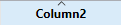
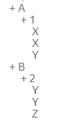
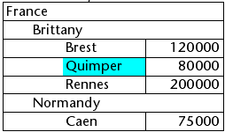
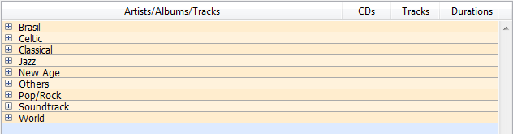

Les list box sont des objets actifs complexes permettant d’afficher et de saisir des données sous forme de tableaux. Ils peuvent être liés au contenu de la base de données, comme les sélections d'entités ("entity selections") et les sélections d'enregistrement, ou à tout contenu linguistique tel que les collections et les tableaux. Ils incluent des fonctionnalités avancées concernant la saisie de données, le tri des colonnes, la gestion des événements, l'apparence personnalisée, le déplacement des colonnes, etc.


Une list box contient une ou plusieurs colonnes dont le contenu est automatiquement synchronisé. Le nombre de colonnes est en principe illimité (il dépend des ressources de la machine).

## Vue d’ensemble

### Principes d'utilisation basiques

En exécution, les list box permettent d’afficher et de saisir des données sous forme de listes. Pour passer une cellule en mode édition ([si la saisie est autorisée pour la colonne associée](#managing-entry)), il suffit de cliquer deux fois sur la valeur qu’elle contient :


Les utilisateurs peuvent saisir et afficher du texte sur plusieurs lignes au sein d’une cellule de list box. Pour ajouter un retour à la ligne, appuyez sur les touches **Ctrl+Retour chariot** sous Windows, ou appuyez sur les touches **Option+Retour chariot** sous macOS.

Les booléens et les images peuvent être affichés dans des cellules, ainsi que des dates, des heures ou des nombres. Il est possible de trier les valeurs de colonne en cliquant sur un en-tête ([tri standard](#managing-sorts)). Toutes les colonnes sont automatiquement synchronisées.

Il est également possible de redimensionner chaque colonne, et l'utilisateur peut modifier l'ordre des [colonnes](properties_ListBox.md#locked-columns-and-static-columns) et des [lignes](properties_Action.md#movable-rows) en les déplaçant à l'aide de la s Notez que les list box peuvent être utilisées [en mode hiérarchique](#hierarchical-list-boxes). Notez que les list box peuvent être utilisées [en mode hiérarchique](#hierarchical-list-boxes).

L'utilisateur peut sélectionner une ou plusieurs lignes à l'aide des raccourcis standard : **Maj + clic** pour une sélection adjacente et **Ctrl + clic** (Windows) ou **Commande + clic** (macOS) pour une sélection non adjacente.

### Parties de list box

Une list box est composée de quatre parties distinctes :

- the [list box object](./listbox-object.md) in its entirety,
- [columns](./listbox-column.md),
- column [headers](./listbox-header-footer.md#headers), and
- column [footers](./listbox-header-footer.md#footers).


Chaque partie dispose de son propre nom d’objet et de propriétés spécifiques. Par exemple, le nombre de colonnes ou la couleur alternée de chaque ligne sont définies dans les propriétés de l’objet list box, la largeur de chaque colonne est définie dans les propriétés des colonnes et la police de l’en-tête est définie dans les propriétés des en-têtes.

Il est possible d'ajouter une méthode objet à l'objet list box et/ou à chaque colonne de la list box. Les méthodes objet sont appelées dans l'ordre suivant :

1. Méthode objet de chaque colonne
2. Méthode objet de la list box

La méthode objet de colonne obtient les événements qui se produisent dans son [en-tête](./listbox-header-footer.md#headers) et son [pied](./listbox-header-footer.md#footers).

### Types de list box

Il existe différents types de list box avec leurs propres comportements et propriétés spécifiques. Il existe différents types de list box avec leurs propres comportements et propriétés spécifiques.

- **Tableaux**: chaque colonne est liée à un tableau 4D. Les list box basées sur des tableaux peuvent être affichées sous forme de [list box hiérarchiques](listbox_overview.md#list-box-hierarchiques).
- **Sélection** (**Sélection courante** ou **Sélection temporaire**) : chaque colonne est liée à une expression (par exemple un champ) qui est évaluée pour chaque enregistrement de la sélection.
- **Collection ou Entity selection** : chaque colonne est liée à une expression qui est évaluée pour chaque élément de la collection ou chaque entité de l'entity selection.

> &#062; Il n'est pas possible de combiner différents types de list box dans le même objet list box. La source de données est définie lors de la création de la list box. Il n'est alors plus possible de la modifier par programmation.

### Gestion des list box

Vous pouvez configurer complètement un objet de type list box via ses propriétés, et vous pouvez également le gérer dynamiquement par programmation.

Pour plus d'informations, reportez-vous à la page [List Box Commands Summary](https://doc.4d.com/4Dv20/4D/20.6/List-Box-Commands-Summary.300-7487600.en.html) du *Manuel de référence du langage 4D*. The 4D Language includes a dedicated "List Box" theme for list box commands, but commands from various other themes, such as "Object properties" commands or [`EDIT ITEM`](../commands/edit-item), [`Displayed line number`](../commands/displayed-line-number) commands can also be used.

## Gestion de la saisie

Pour qu’une cellule de list box soit saisissable, il est nécessaire que les conditions suivantes soient réunies :

- La colonne de la cellule a été définie comme [Saisissable](properties_Entry.md#enterable) (dans le cas contraire, les cellules de la colonne ne seront jamais saisissables).
- Dans l’événement formulaire `On Before Data Entry`, $0 ne retourne pas -1. Lorsque le curseur arrive dans la cellule, l'événement `On Before Data Entry` est généré dans la méthode de la colonne. Si, dans le contexte de cet événement, $0 est défini sur -1, la cellule est considérée comme non saisissable. Si l'événement a été généré après avoir appuyé sur **Tab** ou **Maj+Tab**, le focus va respectivement à la cellule suivante ou à la précédente. Si la valeur de $0 n'est pas -1 (par défaut $0 est 0), la cellule est saisissable et passe en mode d'édition.

Imaginons par exemple une list box contenant deux tableaux, de type date et texte. Le tableau date n’est pas saisissable mais le tableau texte est saisissable si la date n’est pas déjà passée.


Voici la méthode de la colonne *tText* :

```4d
 Case of
    :(FORM event.code=On Before Data Entry) // une cellule prend le focus
       LISTBOX GET CELL POSITION(*;"lb";$col;$row)
  // identification de la cellule
       If(arrDate{$row}<Current date) // si la date est avant aujourd'hui
          $0:=-1 // la cellule n'est pas saisissable
       Else
  // sinon la cellule est saisissable
       End if
 End case
```

L’événement `On Before Data Entry` est retourné avant `On Getting Focus`.

Afin de préserver la cohérence des données pour les list box de type de sélection et entity sélection, tout enregistrement/entité modifié(e) est automatiquement sauvegardé(e) dès que la cellule est validée, c'est-à-dire :

- lorsque la cellule est désactivée (l'utilisateur appuie sur la touche tabulation, clique, etc.),
- lorsque la list box n'a plus le focus,
- lorsque le formulaire perd le focus.

La séquence typique d'événements générés pendant la saisie ou la modification des données est la suivante :

| Action                                                                                                             | Type(s) de Listbox        | Séquence d'événements                                                                                                                                                                                                                                                                                                                                |
| ------------------------------------------------------------------------------------------------------------------ | -------------------------------------------- | ---------------------------------------------------------------------------------------------------------------------------------------------------------------------------------------------------------------------------------------------------------------------------------------------------------------------------------------------------- |
| Une cellule passe en mode édition (action de l'utilisateur ou appel de la commande `EDIT ITEM`) | Tous                                         | On Before Data Entry                                                                                                                                                                                                                                                                                                                                 |
|                                                                                                                    | Tous                                         | On Getting Focus                                                                                                                                                                                                                                                                                                                                     |
| Sa valeur est modifiée                                                                                             | Tous                                         | On Before Keystroke                                                                                                                                                                                                                                                                                                                                  |
|                                                                                                                    | Tous                                         | On After Keystroke                                                                                                                                                                                                                                                                                                                                   |
|                                                                                                                    | Tous                                         | On After Edit                                                                                                                                                                                                                                                                                                                                        |
| Un utilisateur valide et quitte la cellule                                                                         | List box de type sélection                   | Sauvegarde                                                                                                                                                                                                                                                                                                                                           |
|                                                                                                                    | List box de type sélection d'enregistrements | Trigger On saving an existing record (si défini)                                                                                                                                                                                                                                                                                  |
|                                                                                                                    | List box de type sélection                   | On Data Change(\*)                                                                                                                                                                                                                                                                                                                |
|                                                                                                                    | List box de type entity selection            | L'entité est sauvegardée avec l'option automerge, verrouillage optimiste (voir entity.save()). En cas de sauvegarde réussie, l'entité est rafraîchie avec la dernière mise à jour effectuée. Si la sauvegarde échoue, une erreur est affichée. |
|                                                                                                                    | Tous                                         | On Losing Focus                                                                                                                                                                                                                                                                                                                                      |

(\*) Avec les list box de type entity selection, dans l'événement "On Data Change" :

- l'objet [élément courant](properties_DataSource.md#element-courant) contient la valeur avant modification.
- l'objet `This` contient la valeur modifiée.

> La saisie de données dans les list box de type collection/entity selection présente une limitation lorsque l'expression est évaluée comme nulle. Dans ce cas, il n'est pas possible de modifier ou de supprimer la valeur nulle dans la cellule.

## Gestion des sélections

La gestion des sélections s'effectue différemment selon que la list box de type tableau, sélection d'enregistrements, ou collection/entity selection :

- **List box de type sélection :** les sélections sont gérées par l'intermédiaire d'un ensemble appelé par défaut `$ListboxSetN` (N débute à 0 et est incrémenté en fonction du nombre de list box dans le formulaire), que vous pouvez modifier si nécessaire. Cet ensemble est [défini dans les propriétés](properties_ListBox.md#highlight-set) de la list box. Il est maintenu automatiquement par 4D : si l'utilisateur sélectionne une ou plusieurs ligne(s) dans la list box, l'ensemble est immédiatement mis à jour. A l'inverse, il est possible d'utiliser les commandes du thème "Ensembles" afin de modifier par programmation la sélection dans la list box.

- **List box de type collection/entity selection** : les sélections sont gérées via des propriétés de list box dédiées :
  - [Elément courant](properties_DataSource.md#current-item) est un objet qui reçoit l'élément/l'entité sélectionné(e),
  - [Eléments sélectionnés](properties_DataSource.md#selected-items) est une collection/une entity selection d'éléments sélectionnés
  - [Position élément courant](properties_DataSource.md#current-item-position) retourne la position de l'élément ou de l'entité sélectionné(e).

- **List box de type tableau :** la commande `LISTBOX SELECT ROW` permet de sélectionner par programmation une ou plusieurs lignes de list box.
  En outre, [la variable associée à l’objet List box](properties_Object.md#variable-or-expression) peut être utilisée pour lire, fixer ou stocker les sélections de lignes dans l’objet. Cette variable correspond à un tableau de booléens automatiquement créé et maintenu par 4D. La taille de ce tableau est déterminée par celle de la list box : il contient le même nombre d’éléments que le plus petit tableau associé aux colonnes.
  Chaque élément de ce tableau contient `Vrai` si la ligne correspondante est sélectionnée et `Faux` sinon. 4D met à jour le contenu de ce tableau en fonction des actions utilisateur. A l’inverse, vous pouvez modifier la valeur des éléments de ce tableau afin de modifier la sélection dans la list box.
  En revanche, vous ne pouvez ni insérer ni supprimer de ligne dans ce tableau ; il n’est pas possible non plus de le retyper. La commande `Count in array` est utile dans ce cas pour connaître le nombre de lignes sélectionnées.
  Par exemple, cette méthode permet d’inverser la sélection de la première ligne de la list box (type tableau) :

```4d
 ARRAY BOOLEAN(tBListBox;10)
  // tBListBox est le nom de la variable associée à la List box dans le formulaire
 If(tBListBox{1}=True)
    tBListBox{1}:=False
 Else
    tBListBox{1}:=True
 End if
```

> La commande [`OBJECT SET SCROLL POSITION`](../commands/object-set-scroll-position) fait défiler les lignes de la list box de manière à afficher la première ligne sélectionnée ou une ligne spécifiée.

### Personnaliser la représentation des sélections de lignes

Lorsque l'option [Cacher surlignage sélection](properties_Appearance.md#cacher-surlignage-selection) est sélectionnée, vous devez gérer la représentation visuelle des sélections dans la list box à l'aide des options d'interface disponibles. Comme les sélections elles-mêmes sont gérées par 4D, cela signifie que :

- Pour les list box de type tableau, vous devez parcourir le tableau booléen associé à la list box afin de déterminer quelles lignes sont sélectionnées.
- Pour les list box de type sélection, vous devez vérifier si l'enregistrement courant (ligne) appartient à l'ensemble spécifié dans la propriété [Ensemble surlignage](properties_ListBox.md#highlight-set) de la list box.

Vous pouvez alors définir par programmation des couleurs d'arrière-plan, des couleurs ou des styles de polices spécifiques permettant de visualiser l'apparence des lignes sélectionnées. Pour cela, vous pouvez utiliser des tableaux ou des expressions en fonction du type de list box affiché (cf. sections suivantes).

> Utilisez la constante `lk inherited` pour appliquer l'apparence courante de la list box (couleur d'arrière-plan, style de police, etc.).

#### List box de type sélection

Pour déterminer quelles lignes sont sélectionnées, vous devez tester si elles sont incluses dans l'ensemble désigné par la propriété [Ensemble surlignage](properties_ListBox.md#ensemble-surlignage) de la list box. Vous pouvez alors personnaliser l'apparence des lignes sélectionnées à l'aide d'une ou plusieurs [expressions de couleur et de style](#using-arrays-and-expressions).

N'oubliez pas que les expressions sont automatiquement réévaluées à chaque fois que :

- la sélection dans la list box est modifiée,
- la list box prend ou perd le focus,
- la fenêtre formulaire contenant la list box passe au premier plan ou quitte le premier plan.

#### List box de type tableau

Pour déterminer quelles lignes sont sélectionnées, vous devez parcourir le tableau booléen [Variable ou Expression](properties_Object.md#variable-or-expression) associé à la list box.

Vous pouvez alors personnaliser l'apparence des lignes sélectionnées à l'aide d'un ou plusieurs [tableaux de couleur et de style](#using-arrays-and-expressions).

Notez que les tableaux de list box utilisés pour définir l'apparence des lignes sélectionnées doivent être recalculés dans l'événement formulaire `On Selection Change` ; cependant, vous pouvez également modifier ces tableaux dans les événements formulaire

- `On Getting Focus` (propriété de list box)
- `On Losing Focus` (propriété de list box)
- `On Activate` (propriété de formulaire)
- `On Deactivate` (propriété de formulaire) ...en fonction du moment et de la manière dont vous souhaitez représenter visuellement le changement de focus des sélections.

##### Exemple

Vous avez choisi de cacher le surlignage système et souhaitez représenter les sélections dans la list box à l'aide d'une couleur de fond verte, comme dans cet exemple :


Avec une list box de type tableau, vous devez mettre à jour le [Tableau couleurs de fond](properties_BackgroundAndBorder.md#row-background-color-array) par programmation. Dans le formulaire JSON, vous avez défini le Tableau couleurs de fond suivant pour la list box :

```
	"rowFillSource": "_ListboxBackground",
```

Dans la méthode objet de la list box, vous pouvez écrire :

```4d
 Case of
    :(FORM event.code=On Selection Change)
       $n:=Size of array(LB_Arrays)
       ARRAY LONGINT(_ListboxBackground;$n) // couleur arrière plan de ligne
       For($i;1;$n)
          If(LB_Arrays{$i}=True) // sélectionnée
             _ListboxBackground{$i}:=0x0080C080 // vert
          Else // non sélectionnée
             _ListboxBackground{$i}:=lk inherited
          End if
       End for
 End case
```

Pour une list box de type sélection, vous pouvez utiliser une méthode pour mettre à jour l'[Expression couleur arrière-plan](properties_BackgroundAndBorder.md#background-color-expression) en fonction de l'ensemble spécifié dans la propriété [Ensemble surlignage](properties_ListBox.md#highlight-set) pour produire le même effet.

Par exemple, dans le formulaire JSON, vous avez défini l'ensemble surlignage et l'expression de couleur de fond suivants pour la list box :

```
	"highlightSet": "$SampleSet",
	"rowFillSource": "UI_SetColor",
```

Dans la méthode *UI_SetColor*, vous pouvez écrire :

```4d
 If(Is in set("$SampleSet"))
    $color:=0x0080C080 // arrière plan vert
 Else
    $color:=lk inherited
 End if

 $0:=$color
```

> Dans les list box hiérarchiques, les lignes de rupture ne peuvent pas être surlignées lorsque l'option [Cacher surlignage sélection](properties_Appearance.md#cacher-surlignage-selection) est sélectionnée. Comme il n'est pas possible d'avoir des couleurs distinctes pour les en-têtes de même niveau, il n'y a aucun moyen de surligner une ligne de rupture spécifique par programmation.

## Gestion des tris

Le tri dans une list box peut être standard ou personnalisé. Lorsqu'une colonne de list box est triée, toutes les autres colonnes sont toujours synchronisées automatiquement.

### Tri standard

Par défaut, une list box gère automatiquement les tris standard des colonnes en cas de clic sur l’en-tête. Un tri standard est un tri alphanumérique des valeurs de la colonne, alternativement croissant / décroissant lors de clics successifs.

Il est possible d'activer ou d'inactiver le tri utilisateur standard via la propriété [Triable](properties_Action.md#triable)” de la list box (sélectionnée par défaut).

La prise en charge du tri standard dépend du type de list box :

| Type de list box                | Prise en charge du tri standard | Commentaires                                                                                                                                                                                                                                                                                                                                                                                                                                                                                                                                                             |
| ------------------------------- | ------------------------------- | ------------------------------------------------------------------------------------------------------------------------------------------------------------------------------------------------------------------------------------------------------------------------------------------------------------------------------------------------------------------------------------------------------------------------------------------------------------------------------------------------------------------------------------------------------------------------ |
| Collection d'objets             | Oui                             | <ul><li>Les colonnes "This.a" ou "This.a.b" sont triables.</li><li>La [propriété source de la list box](properties_Object.md#variable-or-expression) doit être une [expression assignable](../Concepts/quick-tour.md#assignable-vs-non-assignable-expressions).</li></ul>                                                                                                                                                                                                                                                                                                |
| Collection de valeurs scalaires | Non                             | Utiliser un tri personnalisé avec la fonction [`orderBy()`](../API/CollectionClass.md#orderby)                                                                                                                                                                                                                                                                                                                                                                                                                                                                           |
| Entity selection                | Oui                             | <ul><li>La [propriété source de la list box](properties_Object.md#variable-or-expression) doit être une [expression assignable](../Concepts/quick-tour.md#assignable-vs-non-assignable-expressions).</li><ul><li>La [propriété source de la list box](properties_Object.md#variable-or-expression) doit être une [expression assignable](../Concepts/quick-tour.md#assignable-vs-non-assignable-expressions).</li> For this, you need to use custom sort with [`orderByFormula()`](../API/EntitySelectionClass.md#orderbyformula) function (see example below)</li></ul> |
| Sélection courante              | Oui                             | Seules les expressions simples sont triables (par exemple `[Table_1]Champ_2`)                                                                                                                                                                                                                                                                                                                                                                                                                                                                         |
| Sélection temporaire            | Non                             |                                                                                                                                                                                                                                                                                                                                                                                                                                                                                                                                                                          |
| Tableaux                        | Oui                             | Les colonnes liées à des tableaux d'images et de pointeurs ne sont pas triables                                                                                                                                                                                                                                                                                                                                                                                                                                                                                          |

### Tri personnalisé

Le développeur peut mettre en place des tris personnalisés, par exemple en utilisant la commande [`LISTBOX SORT COLUMNS`](../commands/listbox-sort-columns) et/ou en combinant les événements formulaire [`On Header Click`](../Events/onHeaderClick) et [`On After Sort`](../Events/onAfterSort) et les commandes 4D correspondantes.

Les tris personnalisés vous permettent de :

- effectuer des tris multi-niveaux sur plusieurs colonnes, grâce à la commande [`LISTBOX SORT COLUMNS`](../commands/listbox-sort-columns),
- utiliser des fonctions telles que [`collection.orderByMethod()`](../API/CollectionClass.md#orderbymethod) ou [`entitySelection.orderByFormula()`](../API/EntitySelectionClass.md#orderbyformula) pour trier les colonnes en fonction de critères complexes.

#### Exemple

Vous souhaitez trier une list box en utilisant les valeurs d'une propriété stockée dans un attribut d'objet lié. Vous avez la structure suivante :


Vous concevez une list box de type entity selection liée à l'expression `Form.child`. Dans l'événement formulaire `On Load`, vous exécutez `Form.child:=ds.Child.all()`.

Vous affichez deux colonnes :

| Child name  | Parent's nickname            |
| ----------- | ---------------------------- |
| `This.name` | `This.parent.extra.nickname` |

Si vous voulez trier la list box en utilisant les valeurs de la deuxième colonne, vous devez écrire :

```4d
If (Form event code=On Header Click)
	Form.child:=Form.child.orderByFormula("This.parent.extra.nickname"; dk ascending)
End if
```

### Variable d'en-tête de colonne

La valeur de la [variable associée à l’en-tête d’une colonne](properties_Object.md#variable-or-expression) permet de gérer une information supplémentaire : le tri courant de la colonne (lecture) et l’affichage de la flèche de tri.

- Si la variable est définie sur 0, la colonne n'est pas triée et la flèche de tri n'est pas affichée.  
  

- Si la variable est définie sur 1, la colonne est triée par ordre croissant et la flèche de tri s'affiche.  
  

- Si la variable est définie sur 2, la colonne est triée par ordre décroissant et la flèche de tri s'affiche.  
  

> Seules les [variables](Concepts/variables.md) déclarées ou dynamiques peuvent être utilisées comme variables d'en-tête de colonne. Les autres types d'[expressions](Concepts/quick-tour.md#expressions) telles que `Form.sortValue` ne sont pas pris en charge.

Vous pouvez définir la valeur de la variable (par exemple, Header2:=2) afin de "forcer" l'affichage de la flèche de tri. Le tri de la colonne lui-même n'est pas modifié dans ce cas ; c'est au développeur de s'en charger.

> La commande [`OBJECT SET FORMAT`](../commands/object-set-format) offre un support spécifique pour les icônes dans les en-têtes de list box, ce qui peut être utile lorsque vous souhaitez travailler avec une icône de tri personnalisée.

## Gestion des styles et des couleurs

Vous disposez de plusieurs possibilités pour définir des couleurs de fond, des couleurs de police et des styles de police dans les list box :

- au niveau des [propriétés de l’objet list box](./listbox-object.md),
- au niveau des [propriétés de la colonne,](./listbox-column.md),
- en utilisant des [tableaux ou expressions](#using-arrays-and-expressions) pour la list box et/ou pour chaque colonne,
- au niveau du texte de chaque cellule (si [texte multistyle](properties_Text.md#multi-style)).

### Priorité & héritage

Des principes de priorité et d'héritage sont observés lorsqu’une même propriété est définie à plusieurs niveaux.

1. (highest priority) Cell (if multi-style text)
2. Tableaux/Méthodes colonne
3. Tableaux/Méthodes list box
4. Propriétés de colonne
5. Propriétés de list box
6. (lowest priority) Meta Info expression (for collection or entity selection list boxes)

Par exemple, si vous définissez un style de caractères dans les propriétés de la list box et un autre via un tableau de styles pour la colonne, ce dernier sera pris en compte.

Pour chaque attribut (style, couleur et couleur de fond), un **héritage** est mis en oeuvre lorsque la valeur par défaut est utilisée :

- pour les attributs des cellules : valeurs d’attributs des lignes
- pour les attributs des lignes : valeurs d’attributs des colonnes
- pour les attributs des colonnes : valeurs d’attributs de la list box

Ainsi, si vous souhaitez qu’un objet hérite de la valeur d’attribut du niveau supérieur, il vous suffit de passer `lk inherited` (valeur par défaut) à la commande de définition ou directement dans l’élément de tableau de style/couleur correspondant. Soit une list box contenant un style de caractère standard et des couleurs alternées :


Vous effectuez les modifications suivantes :

- fond de la ligne 2 est passé en rouge via la propriété [Tableau couleurs de fond](properties_BackgroundAndBorder.md#row-background-color-array) de l’objet list box,
- le style de la ligne 4 est passé en italique via la propriété [Tableau de styles](properties_Text.md#row-style-array) de l’objet list box,
- deux élements de la colonne 5 sont passés en gras via la propriété [Tableau de styles](properties_Text.md#row-style-array) de l’objet colonne 5,
- les éléments 2 de la colonne 1 et 2 sont passés en fond bleu via la propriété [Tableau couleurs de fond](properties_BackgroundAndBorder.md#row-background-color-array) des objets colonne 1 et 2 :


Pour restaurer l’apparence initiale de la list box, il suffit de :

- passer la constante `lk inherited` dans les éléments 2 des tableaux de fond des colonnes 1 et 2 : ils héritont alors de la couleur de fond rouge de la ligne.
- passer la constante `lk inherited` dans les éléments 3 et 4 des tableaux de style de la colonne 5 : ils héritont alors du style standard, hormis l’élément 4, qui passera en italique comme défini dans le tableau de style de la list box.
- passer la constante `lk inherited` dans l’élément 4 du tableau de style de la list box afin de supprimer le style italique.
- passer la constante `lk inherited` dans l’élément 2 du tableau de couleurs de fond de la list box afin de restaurer la couleur alternée d’origine de la list box.

### Utiliser des tableaux et des expressions

Selon le type de list box, vous pouvez utiliser différentes propriétés pour personnaliser les couleurs, les styles et l'affichage des lignes :

| Propriété            | List box tableau                                                                         | Liste box sélection                                                                         | List box collection ou entity selection                                                                                                                       |
| -------------------- | ---------------------------------------------------------------------------------------- | ------------------------------------------------------------------------------------------- | ------------------------------------------------------------------------------------------------------------------------------------------------------------- |
| Couleur de fond      | [Tableau couleurs de fond](properties_BackgroundAndBorder.md#row-background-color-array) | [Expression couleur de fond](properties_BackgroundAndBorder.md#background-color-expression) | [Expression couleur de fond](properties_BackgroundAndBorder.md#expression-couleur-de-fond) ou [Meta info expression](properties_Text.md#meta-info-expression) |
| Couleur de la police | [Tableau couleurs de police](properties_Text.md#row-font-color-array)                    | [Expression couleur police](properties_Text.md#font-color-expression)                       | [Expression couleur police](properties_Text.md#expression-couleur-police) or [Meta info expression](properties_Text.md#meta-info-expression)                  |
| Style de police      | [Tableau de styles](properties_Text.md#row-style-array)                                  | [Expression Style](properties_Text.md#style-expression)                                     | [Expression style](properties_Text.md#expression-style) ou [Meta info expression](properties_Text.md#meta-info-expression)                                    |
| Affichage            | [Tableau de contrôle des lignes](properties_ListBox.md#row-control-array)                | -                                                                                           | -                                                                                                                                                             |

## Gestion des impressions

Deux modes d’impression sont proposés : le **mode prévisualisation**, permettant d’imprimer une list box comme un objet de formulaire et le **mode avancé**, permettant de contrôler l’impression de l’objet list box lui-même au sein du formulaire. A noter que l'apparence "Impression" est proposée pour les list box dans l'éditeur de formulaires.

### Mode prévisualisation

L’impression d’une list box en mode prévisualisation consiste à imprimer directement la list box avec le formulaire qui la contient via les commandes d’impression standard ou la commande de menu **Imprimer**. La list box est imprimée dans l’état où elle se trouve dans le formulaire. Ce mode ne permet pas de contrôler précisément l’impression de l’objet ; en particulier, il ne permet pas d’imprimer toutes les lignes d’une list box contenant plus de lignes qu’elle ne peut en afficher.

### Mode avancé

Dans ce mode, l’impression des list box s’effectue par programmation, via la commande `Print object` (les formulaires projet et les formulaires table sont pris en charge). La commande [`LISTBOX GET PRINT INFORMATION`](../commands/listbox-get-print-information) permet de contrôler l'impression de l'objet.

Dans ce mode :

- La hauteur de l’objet list box est automatiquement réduite lorsque le nombre de lignes à imprimer est inférieur à la hauteur d’origine de l’objet (il n’y a pas de lignes "vides" imprimées). En revanche, la hauteur n’augmente pas automatiquement en fonction du contenu de l’objet. La taille de l'objet réellement imprimé peut être obtenue par la commande [`LISTBOX GET PRINT INFORMATION`](../commands/listbox-get-print-information).
- L'objet list box est imprimé "tel quel", c’est-à-dire en tenant compte de ses paramètres d’affichage courants : visibilité des en-têtes et des grilles, lignes affichées et masquées, etc.
  L'objet list box est imprimé "tel quel", c’est-à-dire en tenant compte de ses paramètres d’affichage courants : visibilité des en-têtes et des grilles, lignes affichées et masquées, etc.
  Ces paramètres incluent également la première ligne à imprimer : si vous appelez la commande [`OBJECT SET SCROLL POSITION`](../commands/object-set-scroll-position) avant de lancer l'impression, la première ligne imprimée dans la zone de liste sera celle désignée par la commande.
- Un mécanisme automatique facilite l’impression des list box contenant plus de lignes qu’il est possible d’en afficher : des appels successifs à `Print object` permettent d’imprimer à chaque fois un nouvel ensemble de lignes. La commande [`LISTBOX GET PRINT INFORMATION`](../commands/listbox-get-print-information) peut être utilisée pour vérifier l'état de l'impression en cours.

## List box hiérarchiques

Une list box hiérarchique est une list box dans laquelle le contenu de la première colonne apparaît sous forme hiérarchique. Ce type de représentation est adapté à la présentation d’informations comportant des valeurs répétées et/ou hiérarchiquement dépendantes (pays/région/ville...).

> Seules les [list box de type tableau](#array-list-boxes) peuvent être hiérarchiques.

Les list box hiérarchiques constituent un mode de représentation particulier des données, mais ne modifient pas la structure de ces données (les tableaux). Les list box hiérarchiques sont gérées exactement de la même manière que les list box non hiérarchiques.

### Définir une hiérarchie

Pour définir une list box hiérarchique, vous disposez de trois possibilités :

- Configurer manuellement les éléments hiérarchiques via la liste des propriétés dans l’éditeur de formulaires (ou éditer le formulaire JSON).
- Générer visuellement la hiérarchie à l’aide du pop up menu de gestion des list box, dans l’éditeur de formulaires.
- Utilisez les commandes [`LISTBOX SET HIERARCHY`](../commands/listbox-set-hierarchy) et [`LISTBOX GET HIERARCHY`](../commands/listbox-get-hierarchy).

#### Propriété List box hiérarchique

Cette propriété permet de définir que la list box doit être affichée sous forme hiérarchique. Dans le formulaire JSON, cette fonctionnalité est activée [lorsque la valeur de la propriété de la colonne *dataSource* est un tableau](properties_Object.md#array-list-box), c'est-à-dire une collection.

Des options supplémentaires (**Variable 1...10**) sont disponibles lorsqu'une *List box hiérarchique* est définie, correspondant à chaque élément du tableau *dataSource* à utiliser comme colonne de rupture. A chaque saisie d’une valeur dans un champ, une nouvelle ligne est ajoutée. Jusqu’à 10 variables peuvent être définies. Ces variables définissent les niveaux hiérarchiques à afficher dans la première colonne.

La première variable correspond toujours au nom de variable de la première colonne de la list box (les deux valeurs sont automatiquement liées). Cette première variable est toujours visible et saisissable. Par exemple : pays.
La seconde variable est également toujours visible et saisissable, elle définit le deuxième niveau hiérarchique. Par exemple : régions.
A partir du troisième champ, chaque variable dépend de celle qui la précède. Par exemple : départements, villes, etc. Un maximum de dix niveaux hiérarchiques peut être défini. Si vous effacez une valeur, l’ensemble de la liste hiérarchique définie remonte d’un niveau.

La dernière variable n’est jamais hiérarchique même si plusieurs valeurs identiques existent à ce niveau. Par exemple, en reprenant la configuration illustrée ci-dessus, imaginons que tab1 contienne les valeurs A A A B B B, tab2 les valeurs 1 1 1 2 2 2 et tab3 les valeurs X X Y Y Y Z. Dans ce cas, A, B, 1 et 2 pourront apparaître sous forme contractée, mais pas X et Y :



Ce principe n’est pas appliqué lorsqu’une seule variable est définie dans la hiérarchie : dans ce cas, les valeurs identiques pourront être groupées.

> Si vous définissez une hiérarchie basée sur les premières colonnes d’une list box existante, vous devez ensuite supprimer ou masquer ces colonnes (à l’exception de la première) sinon elles apparaîtront en double dans la list box. Si vous définissez la hiérarchie via le pop up menu de l’éditeur (cf. ci-dessous), les colonnes superflues sont automatiquement supprimées de la list box.

#### Créer une hiérarchie via le menu contextuel

Lorsque vous sélectionnez au moins une colonne en plus de la première dans un objet list box (de type tableau) dans l’éditeur de formulaires, la commande **Créer hiérarchie** est disponible dans le menu contextuel :


Cette commande est un raccourci pour définir une hiérarchie. Lorsque vous la choisissez, les actions suivantes sont effectuées :

- L'option **List box hiérarchique** est cochée pour l’objet dans la Liste des propriétés.
- Les variables des colonnes sont utilisées pour définir la hiérarchie. Elles remplacent les variables éventuellement déjà définies.
- Les colonnes sélectionnées n’apparaissent plus dans la list box (à l’exception du titre de la première).

Exemple : soit une list box dont les premières colonnes contiennent Pays, Région, Ville et Population. Lorsque Pays, Région et Ville sont sélectionnées (cf. illustration ci-dessus), si vous choisissez **Créer hiérarchie** dans le menu contextuel, une hiérarchie à trois niveaux est créée dans la première colonne, les colonnes 2 et 3 sont supprimées et la co


##### Annuler une hiérarchie

Lorsque la première colonne est sélectionnée et déjà définie comme hiérarchique, vous pouvez utiliser la commande **Annuler hiérarchie**. Lorsque vous choisissez cette commande, les actions suivantes sont effectuées :

- L’option **List box hiérarchique** est désélectionnée pour l’objet,
- Les niveaux hiérarchiques 2 à n sont supprimés et transformés en colonnes ajoutées dans la list box.

### Principes de fonctionnement

A la première ouverture d’un formulaire contenant une list box hiérarchique, par défaut toutes les lignes sont déployées.

Une ligne de rupture et un "noeud" hiérarchique sont automatiquement ajoutés dans la list box lorsque des valeurs sont répétées dans les tableaux. Par exemple, imaginons une list box contenant quatre tableaux définissant des villes, chaque ville étant caractérisée par un pays, une région, un nom et un nombre d’habitants :


Si cette list box est affichée sous forme hiérarchique (les trois premiers tableaux étant inclus dans la hiérarchie), vous obtenez :


Les tableaux ne sont pas triés avant la construction de la hiérarchie. If, for example, an array contains the data AAABBAACC, the hierarchy obtained is:
\>    A
\>    B
\>    A
\>    C

Pour déployer ou contracter un "nœud" hiérarchique, cliquez dessus. Si vous effectuez **Alt+clic** (Windows) ou **Option+clic** (macOS) sur le nœud, tous ses sous-éléments seront déployés ou contractés. Ces opérations peuvent également être effectuées par programmation à l'aide des commandes `LISTBOX EXPAND` et `LISTBOX COLLAPSE`.

Lorsque des valeurs de type date ou heure sont incluses dans une list box hiérarchique, elles sont affichées dans un format normalisé.

#### Gestion des tris dans les list box hiérarchiques

Dans une list box en mode hiérarchique, un tri standard (effectué suite à un clic dans un en-tête de colonne de la list box) est toujours construit de la manière suivante :

- En premier lieu, tous les niveaux de la colonne hiérarchique (première colonne) sont automatiquement triés par ordre croissant.
- Le tri est ensuite effectué par ordre croissant ou décroissant (suivant l’action utilisateur) sur les valeurs de la colonne où le clic a eu lieu.
- Toutes les colonnes sont synchronisées.
- Lors des tris ultérieurs des colonnes non hiérarchiques de la list box, seul le dernier niveau de la première colonne est trié. Il est possible de modifier le tri de cette colonne en cliquant sur son en-tête.

Soit par exemple la list box suivante, dans laquelle aucun tri spécifique n’est défini :


Si vous cliquez sur l’en-tête "Population" afin de trier les populations par ordre croissant (ou alternativement décroissant), les données apparaissent ainsi :


Comme pour toutes les list box, vous pouvez [désactiver le mécanisme de tri standard](properties_Action.md#sortable) en désélectionnant la propriété "Triable" pour la list box et gérer le tri par programmation.

#### Gestion des sélections et des positions dans les list box hiérarchiques

Une list box hiérarchique affiche un nombre variable de lignes à l’écran en fonction de l’état déployé/contracté des nœuds hiérachiques. Cela ne signifie pas pour autant que le nombre de lignes des tableaux varie. Seul l’affichage est modifié, pas les données. Il est important de comprendre ce principe car la gestion programmée des list box hiérarchiques se base toujours sur les données des tableaux, pas sur les données affichées. En particulier, les lignes de rupture ajoutées automatiquement ne sont pas prises en compte dans les tableaux d’options d’affichage (cf. ci-dessous).

Examinons par exemple les tableaux suivants :


Si ces tableaux sont représentés hiérarchiquement, la ligne "Quimper" ne sera pas affichée sur la deuxième ligne mais sur la quatrième, à cause des deux lignes de rupture ajoutées :


Quelle que soit la manière dont les données sont affichées dans la list box (hiérarchique ou non-hiérarchique), si vous souhaitez passer la ligne contenant "Quimper" en gras, vous devrez utiliser l’instruction <code>TabStyle{2} = bold</code>. Seule la position de la ligne dans les tableaux est prise en compte.

Ce principe est mis en oeuvre pour les tableaux internes permettant de gérer :

- les couleurs

- les couleurs de fond

- les styles

- les lignes masquées

- les sélections

Par exemple, si vous voulez sélectionner la ligne contenant Rennes, vous devez passer :

```4d
 ->MyListbox{3}:=True
```

*Non-hierarchical representation:*  


*Hierarchical representation:*  


> Si une ou plusieurs lignes sont masquées du fait que leurs parents ont été contractés, elles ne sont plus sélectionnées. Seules les lignes visibles (directement ou suite à un défilement) sont sélectionnables. Autrement dit, les lignes ne peuvent pas être à la fois sélectionnées et cachées.

Comme pour les sélections, la commande [`LISTBOX GET CELL POSITION`](../commands/listbox-get-cell-position) renvoie les mêmes valeurs pour une list box hiérarchique que pour une list box non hiérarchique. Cela signifie que dans les deux exemples ci-dessous, [`LISTBOX GET CELL POSITION`](../commands/listbox-get-cell-position) renverra la même position : (3;2).

*Non-hierarchical representation:*  


*Hierarchical representation:*  


Lorsque toutes les lignes d’une sous-hiérarchie sont masquées, la ligne de rupture est automatiquement masquée. Dans l’exemple ci-dessus, si les lignes 1 à 3 sont masquées, la ligne de rupture "Bretagne" n’apparaîtra pas.

#### Lignes de rupture

Si l'utilisateur sélectionne une ligne de rupture, [`LISTBOX GET CELL POSITION`](../commands/listbox-get-cell-position) renvoie la première occurrence de la ligne dans le tableau correspondant. Dans le cas suivant :


... [`LISTBOX GET CELL POSITION`](../commands/listbox-get-cell-position) retourne (2;4). Pour sélectionner une ligne de rupture par programmation, vous devez utiliser la commande [`LISTBOX SELECT BREAK`](../commands/listbox-select-break).

Les lignes de rupture ne sont pas prises en compte dans les tableaux internes permettant de gérer l’apparence graphique des list box (styles et couleurs). Il est toutefois possible de modifier ces caractéristiques pour les lignes de rupture via les commandes de gestion graphique des objets. Il suffit pour cela d’exécuter ces commandes appropriées sur les tableaux constituant la hiérarchie.

Soit par exemple la list box suivante (les noms des tableaux associés sont précisés entre parenthèses) :

*Non-hierarchical representation:*  


*Hierarchical representation:*  


En mode hiérarchique, les niveaux de rupture ne sont pas pris en compte par les tableaux de modification de style nommés `tStyle` et `tCouleurs`. Pour modifier la couleur ou le style des niveaux de rupture, vous devez exécuter les instructions suivantes :

```4d
 OBJECT SET RGB COLORS(T1;0x0000FF;0xB0B0B0)
 OBJECT SET FONT STYLE(T2;Bold)
```

> Dans ce contexte, seule la syntaxe utilisant la variable tableau peut fonctionner avec les commandes de propriété d’objet car les tableaux n’ont alors pas d’objet associé.

Résultat:


#### Gestion optimisée du déployer/contracter

Vous pouvez optimiser l’affichage et la gestion des list box hiérarchiques en tirant parti des événements formulaire `On Expand` et `On Collapse`.

Une list box hiérarchique est construite à partir du contenu des tableaux qui la constituent, elle ne peut donc être affichée que lorsque tous les tableaux sont chargés en mémoire. Il est donc difficile de construire de grandes list box hiérarchiques basées sur des tableaux générés à partir de données (via la commande [`SELECTION TO ARRAY`](../commands/selection-to-array)), non seulement en raison de la vitesse d'affichage, mais aussi de la mémoire utilisée.

L'utilisation des événements formulaire `On Expand` et `On Collapse` permet de surmonter ces contraintes : par exemple, vous pouvez n'afficher qu'une partie de la hiérarchie et charger/décharger les tableaux à la volée, en fonction des actions de l'utilisateur. Dans le contexte de ces événements, la commande [`LISTBOX GET CELL POSITION`](../commands/listbox-get-cell-position) renvoie la cellule sur laquelle l'utilisateur a cliqué pour développer ou réduire une ligne.

Dans ce cas, le remplissage et le vidage des tableaux doivent être effectués par le code. Les principes à mettre en oeuvre sont :

- A l’affichage de la listbox, seul le premier tableau doit être rempli. However, you must create a second array with empty values so that the list box displays the expand/collapse buttons:  
  

- Lorsque l’utilisateur clique sur un bouton de déploiement, vous pouvez traiter l’événement `On Expand`. La commande [`LISTBOX GET CELL POSITION`](../commands/listbox-get-cell-position) renvoie la cellule concernée et vous permet de construire la hiérarchie appropriée : vous remplissez le premier tableau avec les valeurs répétées et le second avec les valeurs envoyées par la commande [`SELECTION TO ARRAY`](../commands/selection-to-array) et vous insérez autant de lignes que nécessaire dans la zone de liste à l'aide de la commande [`LISTBOX INSERT ROWS`](../commands/listbox-insert-rows).  
  

- Lorsque l’utilisateur clique sur un bouton de contraction, vous pouvez traiter l’événement `On Collapse`. La commande [`LISTBOX GET CELL POSITION`](../commands/listbox-get-cell-position) renvoie la cellule concernée : vous supprimez autant de lignes que nécessaire de la zone de liste à l'aide de la commande [`LISTBOX DELETE ROWS`](../commands/listbox-delete-rows).


