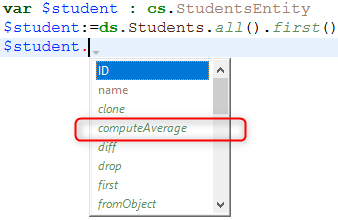

Le code 4D utilisé dans votre projet est écrit dans des [méthodes](../Concepts/methods.md) et des [classes](../Concepts/classes.md).

L'IDE de 4D vous offre diverses fonctionnalités pour créer, modifier, exporter ou supprimer votre code. Vous utiliserez généralement l'[éditeur intégré de code 4D](../code-editor/write-class-method.md) pour travailler avec votre code. Vous pouvez également utiliser d'autres éditeurs tels que **VS Code**, pour lequel l'extension [4D-Analyzer](https://github.com/4d/4D-Analyzer-VSCode) est disponible.

## Créer des méthodes

Une méthode dans 4D est stockée dans un fichier **.4dm** situé dans le dossier approprié du dossier [`/Project/Sources/`](../Project/architecture.md#sources).

Vous pouvez créer [plusieurs types de méthodes](../Concepts/methods.md#method-types) :

- Tous les types de méthodes peuvent être créés ou ouverts à partir de la fenêtre de l'**Explorateur** (à l'exception des méthodes objet qui sont gérées à partir de l'[éditeur de formulaires](../FormEditor/formEditor.md)).
- Les méthodes projet peuvent également être créées ou ouvertes à partir du menu **Fichier** ou de la barre d'outils (**Nouveau/Méthode...** ou **Ouvrir/Méthode...**) ou à l'aide de raccourcis dans la [fenêtre de l'éditeur de code](../code-editor/write-class-method.md#shortcuts).
- Les **triggers** peuvent également être créés ou ouverts depuis [l'éditeur de structure](../Develop-legacy/triggers.md#activating-and-creating-a-trigger).
- Les méthodes formulaire peuvent également être créées ou ouvertes à partir de l'[éditeur de formulaires](../FormEditor/formEditor.md).

## Créer des classes

### Classes utilisateur

Une classe utilisateur dans 4D est définie par un fichier de méthode spécifique (**.4dm**), stocké dans le dossier [`/Project/Sources/Classes/`](../Project/architecture.md#sources). Le nom du fichier est le nom de la classe. Par exemple, une classe nommée "Polygon" sera stockée dans le fichier suivant :

```
Project folder Project Sources Classes Polygon.4dm
```

Vous pouvez créer un fichier de classe à partir du menu **Fichier** ou de la barre d'outils (**Nouveau/Classe...**) ou dans la page **Méthodes** de la fenêtre de l'**Explorateur**. Vous pouvez également utiliser le raccourci **Ctrl+Maj+Alt+k**.

Dans la **page Méthodes** de l'Explorateur, les classes sont regroupées dans la catégorie **Classes**.

Pour créer une nouvelle classe, vous pouvez :

- sélectionner la catégorie **Classes** et cliquez sur le bouton  .
- sélectionner **Nouvelle classe...** dans le menu d'actions en bas de la fenêtre de l'Explorateur ou dans le menu contextuel du groupe Classes.
  
- sélectionnez **Nouveau> Classe...** dans le menu contextuel de la page d'accueil de l'Explorateur.

Lorsque vous nommez des classes, gardez à l'esprit les règles suivantes :

- Un [nom de classe](../Concepts/identifiers.md#classes) doit être conforme aux [règles de nommage des propriétés](../Concepts/identifiers.md#object-properties).
- Les noms de classe sont sensibles à la casse.
- Il n'est pas recommandé de donner le même nom à une classe et à une table de base de données, afin d'éviter tout conflit.

### Classes ORDA

Les [classes utilisateurs du modèle de données ORDA](../ORDA/ordaClasses.md) sont des fonctions de haut niveau créées au-dessus du modèle de données.

Une classe du modèle de données ORDA est définie en ajoutant, au même emplacement que les fichiers de classe standard (c'est-à-dire dans le dossier `/Sources/Classes` du dossier projet), un fichier .4dm avec le nom de la classe. Par exemple, une classe d'entité pour la dataclass `Utilities` sera définie via un fichier `UtilitiesEntity.4dm`.

4D crée préalablement et automatiquement des classes vides en mémoire pour chaque objet de modèle de données disponible.


Par défaut, les classes ORDA vides ne sont pas affichées dans l'Explorateur. Pour les afficher, vous devez sélectionner **Afficher toutes les dataclasses** dans le menu d'options de l'Explorateur :


Les classes utilisateurs ORDA ont une icône différente des autres classes. Les classes vides sont grisées :


Pour créer un fichier de classe ORDA, il vous suffit de double-cliquer sur la classe prédéfinie correspondante dans l'Explorateur. 4D crée le fichier de classe et ajoute le code [`extends`](../Concepts/classes.md#class-extends-classname). Par exemple, pour une classe Entity :

```
Class extends Entity
```

Une fois qu'une classe est définie, son nom n'est plus grisé dans l'Explorateur.

Pour ouvrir une classe ORDA définie dans l'éditeur de code de 4D, sélectionnez ou double-cliquez sur un nom de classe ORDA et utilisez **Edit...** depuis le menu contextuel/options de la fenêtre de l'Explorateur:


Pour les classes ORDA basées sur le datastore local (`ds`), vous pouvez accéder directement au code de la classe depuis la fenêtre de structure de 4D :


### Prise en charge dans l'IDE 4D

Dans les différentes fenêtres 4D (éditeur de code, compilateur, débogueur, explorateur d'exécution), le code de classe est essentiellement géré comme une méthode projet avec quelques spécificités :

- Dans l'éditeur de code :
  - une classe ne peut pas être exécutée
  - une fonction de classe est un bloc de code
  - **Aller à définition...** sur un objet membre permet de rechercher des déclarations de fonction de classe; par exemple, "$o.f()" donnera comme résultat de recherche "Function f".
  - **Chercher les références...** sur la déclaration de fonction de classe recherche la fonction utilisée comme membre d'objet; par exemple, "Function f" donnera comme résultat "$o.f()".
  - les variables typées en tant que classe utilisateur ou ORDA bénéficient automatiquement des fonctions d'auto-complétion. Exemple avec une variable de classe Entity :



- Dans l'explorateur d'exécution et le débogueur, les fonctions de classe sont affichées avec le `<ClassName>` constructeur ou `<ClassName>.<FunctionName>` le format.

## Supprimer des méthodes ou des classes

Pour supprimer une méthode ou une classe existante, vous pouvez :

- sur votre disque, supprimer le fichier *.4dm* du dossier "Sources",
- dans l'explorateur de 4D, sélectionnez la méthode ou la classe et cliquez sur  ou choisissez **Déplacer vers la corbeille** dans le menu contextuel.

> Pour supprimer une méthode objet, choisissez **Supprimer la méthode objet** dans l'[éditeur de formulaires](../FormEditor/formEditor.md) (menu **Objet** ou menu contextuel).

## Commandes du thème Accès objets développement

4D vous permet d'accéder par programmation au contenu et aux chemins de toutes les méthodes de vos applications, grâce au thème [**"Accès objets développement"**](../commands/theme/Design_Object_Access.md). Cette boîte à outils de code source facilite l’intégration de vos applications aux outils de contrôle du code, notamment les applications de gestion de versions (VCS). Elle permet également de mettre en place des systèmes avancés de [documentation du code](../Project/documentation.md), de construire un explorateur personnalisé ou encore d’organiser la sauvegarde régulière du code sous forme de fichiers sur disque.

Les principes suivants sont mis en œuvre :

- Chaque méthode et chaque formulaire dans une application 4D dispose d’une adresse sous forme de chemin d’accès. Par exemple, la méthode trigger de la table 1 est accessible à l’adresse "[trigger]/table_1". Chaque chemin d’accès d’objet est unique dans une application.
- L’accès aux objets de l’application 4D s’effectue à l’aide des commandes du thème **"Accès objets développement"**, par exemple [`METHOD GET NAMES`](../commands/method-get-names) ou [`METHOD GET PATHS`](../commands/method-get-paths).
- La plupart des commandes de ce thème fonctionnent en mode [interprété et compilé](../Concepts/interpreted.md). Cependant, les commandes qui modifient les propriétés ou accèdent aux contenus exécutables à partir des méthodes ne peuvent être utilisées qu'en mode interprété (voir le tableau ci-dessous).
- Toutes les commandes de ce thème sont utilisables avec 4D en mode local ou distant. En revanche, gardez à l’esprit que certaines commandes ne sont pas utilisables en mode compilé : la finalité du thème est la création d’outils personnalisés d’aide de développement. Les commandes ne doivent pas être utilisées pour modifier dynamiquement le fonctionnement d’un projet en exécution. Par exemple, vous ne pouvez pas utiliser [`METHOD SET ATTRIBUTE`](../commands/method-set-attribute) pour changer un attribut méthode en fonction du statut de l'utilisateur courant.
- Lorsqu'une commande de ce thème est appelée à partir d'un [composant](../Project/components.md), par défaut, elle accède aux objets du composant. Dans ce cas, pour accéder aux objets de l'hôte, il suffit de passer un `*` comme dernier paramètre.

### Utilisation en mode compilé

Pour des raisons liées au principe du processus de compilation, seules certaines commandes de ce thème peuvent être utilisées en mode compilé. Le tableau suivant indique la disponibilité des commandes en mode compilé :

| Commande                                                                 | Peut être utilisée en mode compilé |
| ------------------------------------------------------------------------ | ---------------------------------- |
| [Current method path](../commands/current-method-path)                   | Oui                                |
| [FORM GET NAMES](../commands/form-get-names)                             | Oui                                |
| [METHOD Get attribute](../commands/method-get-attribute)                 | Oui                                |
| [METHOD GET ATTRIBUTES](../commands/method-get-attributes)               | Oui                                |
| [METHOD GET CODE](../commands/method-get-code)                           | Non                                |
| [METHOD GET COMMENTS](../commands/method-get-comments)                   | Oui                                |
| [METHOD GET FOLDERS](../commands/method-get-folders)                     | Oui                                |
| [METHOD GET MODIFICATION DATE](../commands/method-get-modification-date) | Oui                                |
| [METHOD GET NAMES](../commands/method-get-names)                         | Oui                                |
| [METHOD Get path](../commands/method-get-path)                           | Oui                                |
| [METHOD GET PATHS](../commands/method-get-paths)                         | Oui                                |
| [METHOD GET PATHS FORM](../commands/method-get-paths-form)               | Oui                                |
| [METHOD OPEN PATH](../commands/method-open-path)                         | Non                                |
| [METHOD RESOLVE PATH](../commands/method-resolve-path)                   | Oui                                |
| [METHOD SET ACCESS MODE](../commands/method-set-access-mode)             | Oui                                |
| [METHOD SET ATTRIBUTE](../commands/method-set-attribute)                 | Non                                |
| [METHOD SET ATTRIBUTES](../commands/method-set-attributes)               | Non                                |
| [METHOD SET CODE](../commands/method-set-code)                           | Non                                |
| [METHOD SET COMMENTS](../commands/method-set-comments)                   | Non                                |

:::note

L'erreur -9762 "La commande ne peut pas être exécutée dans une base de données compilée" est générée lorsque la commande est exécutée en mode compilé.

:::

### Construction des chemins d'accès

Les chemins générés pour les objets 4D doivent être compatibles avec la gestion des fichiers du système d'exploitation. Les caractères qui sont interdits au niveau de l'OS tels que ":" sont automatiquement encodés dans les noms de méthode, afin que les fichiers générés puissent être intégrés automatiquement dans un système de contrôle de version.

Les caractères encodés sont les suivants :

| Caractère                    | Encodage |
| ---------------------------- | -------- |
| "                            | %22      |
| \*                           | %2A      |
| /                            | %2F      |
| :            | %3A      |
| \< | %3C      |
| \>                          | %3E      |
| ?                            | %3F      |
| \|                           | %7C      |
| \\                         | %5C      |
| %                            | %25      |

#### Exemples

`Form?1` est encodé `Form%3F1`  
`Button/1` est encodé `Button%2F1`