[L'architecture des projets](../Project/architecture.md) 4D est modulaire. Vous pouvez ajouter des fonctionnalités supplémentaires dans vos projets 4D en installant des [**composants**](Concepts/components.md) et des [**plug-ins**](../Concepts/plug-ins.md). Les composants sont constitués de code 4D, tandis que les plug-ins peuvent être [construits à l'aide de n'importe quel langage](../Extensions/develop-plug-ins.md).

You can [develop](../Extensions/develop-components.md) and [build](../Desktop/building.md) your own 4D components, or download public components shared by the 4D community that [can be found for example on GitHub](https://github.com/topics/4d-component).

Une fois installées dans votre environnement 4D, les extensions sont traitées comme des **dépendances** avec des propriétés spécifiques.

## Composants interprétés et compilés

Les composants peuvent être interprétés ou [compilés](../Desktop/building.md).

- Un projet 4D fonctionnant en mode interprété peut utiliser des composants interprétés ou compilés.
- Un projet 4D exécuté en mode compilé ne peut pas utiliser de composants interprétés. Dans ce cas, seuls les composants compilés peuvent être utilisés.

### Dossier racine (package)

Le dossier racine d'un composant (dossier *MyComponent.4dbase*) peut contenir :

- pour les **composants interprétés** : un [dossier project](../Project/architecture.md) standard. Le nom du dossier du dossier racine doit être suffixé **.4dbase** si vous voulez l'installer dans le dossier [**Components**](architecture.md#components) de votre projet.
- pour les **composants compilés** :
  - soit un dossier "Contents" contenant un fichier .4DZ, un dossier *Resources*, un fichier *Info.plist* (architecture recommandée)
  - soit directement un fichier .4DZ avec d'autres dossiers tels que *Resources*.

:::note

L'architecture de dossier "Contents" est recommandée pour les composants si vous voulez [notariser](../Desktop/building.md#about-notarization) vos applications sur macOS.

:::

## Emplacements des composants

When developing in 4D, the component files can be transparently stored in your computer or located on an external GitHub or GitLab repository.

:::note

This section describes how to work with components in the **4D** and **4D Server** environments. Dans les autres environnements, les composants sont gérés différemment :

- dans [4D en mode distant](../Desktop/clientServer.md), les composants sont chargés par le serveur et envoyés à l'application distante.
- dans les applications fusionnées, les composants sont [inclus à l'étape de construction](../Desktop/building.md#plugins--components-page).

:::

### Vue d’ensemble

Pour charger un composant dans votre projet 4D, vous pouvez soit :

- copier les fichiers des composants dans le [dossier **Components** de votre projet](architecture.md#components) (les dossiers des composants interprétés doivent être suffixés avec ".4dbase", voir ci-dessus),
- ou déclarer le composant dans le fichier **dependencies.json** de votre projet ; ceci est fait automatiquement pour les fichiers locaux lorsque vous [**ajoutez une dépendance en utilisant l'interface du Gestionnaire de dépendances**](#adding-a-github-dependency).

Les composants déclarés dans le fichier **dependencies.json** peuvent être stockés à différents endroits :

- au même niveau que le dossier racine de votre projet 4D : c'est l'emplacement par défaut,
- n'importe où sur votre machine : le chemin du composant doit être déclaré dans le fichier **environment4d.json**
- on a GitHub or [GitLab](https://blog.4d.com/integrate-4d-components-directly-from-gitlab) repository: the component path can be declared in the **dependencies.json** file or in the **environment4d.json** file, or in both files (a [local cache](#local-cache-for-dependencies) is then handled automatically).

Si le même composant est installé à différents endroits, un [ordre de priorité](#priority) est appliqué.

### dependencies.json et environment4d.json

#### dependencies.json

Le fichier **dependencies.json** référence tous les composants nécessaires à votre projet 4D. Ce fichier doit être placé dans le dossier **Sources** du dossier du projet 4D, par exemple :

```
	/MyProjectRoot/Project/Sources/dependencies.json
```

Il peut contenir :

- les noms des composants [stockés localement](#local-components) (chemin par défaut ou chemin défini dans un fichier **environment4d.json**),
- names of components [stored on GitHub or GitLab repositories](#components-stored-on-git-hosting-platforms) (their path can be defined in this file or in an **environment4d.json** file).

#### environment4d.json

Le fichier **environment4d.json** est facultatif. Il vous permet de définir des **chemins personnalisés** pour certains ou tous les composants déclarés dans le fichier **dependencies.json**. Ce fichier peut être stocké dans le dossier racine de votre projet ou dans l'un de ses dossiers parents, à n'importe quel niveau (jusqu'à la racine).

Les principaux avantages de cette architecture sont les suivants :

- vous pouvez stocker le fichier **environment4d.json** dans un dossier parent de vos projets et décider de ne pas le livrer (*commit*), ce qui vous permet d'avoir une organisation locale pour vos composants.
- if you want to use the same GitHub or GitLab repository for several of your projects, you can reference it in the **environment4d.json** file and declare it in the **dependencies.json** file.

### Priorité

Puisque les composants peuvent être installés de différentes manières, un ordre de priorité est appliqué lorsque le même composant est référencé à plusieurs endroits :

**Priorité la plus élevée**

1. Composants stockés dans le [dossier **Components** du projet](architecture.md#components).
2. Composants déclarés dans le fichier **dependencies.json** (le chemin déclaré dans **environment4d.json** remplace le chemin **dependencies.json** pour configurer un environnement local).
3. Composants utilisateurs 4D internes (par exemple 4D NetKit, 4D SVG...)

**Priorité la plus basse**

```mermaid
flowchart TB
    id1("1<br/>Composants du dossier Components du projet")
	~~~
    id2("2<br/>Composants listés dans dependencies.json")
	~~
    id2 -- environment4d.json donne le chemin --> id4("Charger le composant basé sur le chemin déclaré dans environment4d.json")
    ~~~
    id3("3<br/>Composants utilisateurs 4D internes")
    id2 -- environment4d.json ne donne pas de chemin --> id5("Charger le composant à côté du dossier raciner")
    ~~~
    id3("3<br/>Composants utilisateurs 4D internes")
```

Lorsqu'un composant ne peut pas être chargé à cause d'une autre instance du même composant située à un niveau de priorité plus élevé, les deux obtiennent un [statut](#dependency-status) spécifique : le composant non chargé reçoit le statut *Overloaded*, tandis que le composant chargé a le statut *Overloading*.

### Composants locaux

Vous déclarez un composant local dans le fichier [**dependencies.json** ](#dependenciesjson) de la manière suivante :

```json
{
    "dependencies": {
        "myComponent1" : {},
        "myComponent2" : {}
    }
}
```

... où "myComponent1" et "myComponent2" sont les noms des composants à charger.

Par défaut, si "myComponent1" et "myComponent2" ne sont pas déclarés dans un fichier [**environment4d.json**](#environment4djson), 4D cherchera le dossier package du composant (c'est-à-dire le dossier racine du projet du composant) au même niveau que le dossier du package de votre projet 4D, par exemple :

```
	/MyProjectRoot/
	/MyProjectComponentRoot/
```

Grâce à cette architecture, vous pouvez simplement copier tous vos composants au même niveau que vos projets et les référencer dans vos fichiers **dependencies.json**.

:::note

Si vous ne souhaitez pas utiliser l'architecture **dependencies.json**, vous pouvez installer des composants locaux en copiant leurs fichiers dans le [dossier **Components** de votre projet](architecture.md#components).

:::

#### Personnalisation des chemins des composants

Si vous souhaitez personnaliser l'emplacement des composants locaux, vous devez déclarer dans le fichier [**environment4d.json**](#environment4djson) les chemins des dépendances qui ne sont pas stockées au même niveau que le dossier projet.

Vous pouvez utiliser des chemins **relatifs** ou **absolus** (voir ci-dessous).

Exemples :

```json
{
	"dependencies": {
		"myComponent1" : "MyComponent1",  
		"myComponent2" : "../MyComponent2",  
 		"myComponent3" : "file:///Users/jean/MyComponent3"  
    }
}
```

:::note

Si un chemin de composant déclaré dans le fichier **environment4d.json** n'est pas trouvé lorsque le projet est démarré, le composant n'est pas chargé et récupère le [statut](#dependency-status) *Not found*, même si une version du composant existe à côté du dossier racine du projet.

:::

#### Chemins relatifs vs chemins absolus

Les chemins sont exprimés en syntaxe POSIX comme décrit dans [ce paragraphe](../Concepts/paths#posix-syntax).

Les chemins relatifs sont relatifs au fichier [`environment4d.json`](#environment4djson). Les chemins absolus sont liés à la machine de l'utilisateur.

L'utilisation de chemins relatifs est **recommandée** dans la plupart des cas, puisqu'ils fournissent flexibilité et portabilité de l'architecture des composants, surtout si le projet est hébergé dans un outil de contrôle de source. Les chemins absolus ne doivent être utilisés que pour les composants spécifiques à une machine et à un utilisateur.

### Components stored on Git hosting platforms {#components-stored-on-git-hosting-platforms}

4D components available as **releases** on GitHub and GitLab platforms can be referenced and automatically loaded and updated in your 4D projects.

:::note

Regarding components stored on GitHub or GitLab, both [**dependencies.json**](#dependenciesjson) and [**environment4d.json**](#environment4djson) files support the same contents.

:::

To be able to directly reference and use a 4D component stored on GitHub or GitLab, you need to configure the component's repository.

#### Configuring a GitHub repository

1. Compressez les fichiers des composants au format ZIP.
2. Nommez cette archive avec le même nom que le dépôt GitHub. For example, for a "my-4D-Component" repository, the archive must be named "my-4D-Component.zip".

- Intégrez l'archive dans une [release GitHub](https://docs.github.com/en/repositories/releasing-projects-on-github/managing-releases-in-a-repository) du dépôt.

Ces étapes peuvent être facilement automatisées, avec du code 4D ou en utilisant des actions GitHub, par exemple.

#### Configuring a GitLab repository

GitLab releases only store the name and URL of assets, they do not contain uploaded files. You need to provide your component's zip file as a link.

1. Upload the component's ZIP file somewhere, i.e. either on an external server, or [using GitLab Package Registry](#using-the-gitlab-package-registry) (generic package).
2. Create a [GitLab release](https://docs.gitlab.com/user/project/releases/) for your component, including the link to your component's file as release asset.

The asset name is typically an artifact link name (\<my-component\>.zip).

#### Using the GitLab Package Registry

The [GitLab Package Registry](https://docs.gitlab.com/user/packages/package_registry/) allows you to host your files in GitLab itself. Its main advantages include an authenticated access, stable and versioned urls, and the ability to associate binairies with release tags. To use the Package Registry:

1. Build your component file (for example: *MyComponent.zip*)
2. Upload it to the [generic packages repository](https://docs.gitlab.com/user/packages/generic_packages/) using a script (see [examples in the GitLab documentation](https://docs.gitlab.com/user/packages/generic_packages/#publish-a-single-file)).
3. **Deploy** \> **Package Registry** to see the result.
4. Use the package URL as a release asset link.
5. Associate it with the same Git tag.

:::tip Tutorial: Create and Use a 4D Component Release with Gitlab

<iframe width="560" height="315" src="https://www.youtube.com/embed/Zgx7MHWh9EE?si=K4oV-M2kzk6v2VSm" title="YouTube video player" frameborder="0" allow="accelerometer; autoplay; clipboard-write; encrypted-media; gyroscope; picture-in-picture; web-share" referrerpolicy="strict-origin-when-cross-origin" allowfullscreen></iframe>

:::

#### Déclaration des chemins

You declare components stored on GitHub and GitLab in the [**dependencies.json** file](#dependenciesjson) in the following way:

```json title="dependencies.json"
{
	"dependencies": {
		"myGitHubComponent1": {
			"github" : "JohnSmith/myGitHubComponent1"
		},
		"myGitLabComponent": {
			"gitlab" : "JohnSmith/myGitLabComponent"
		},
		"myPrivateGitLabComponent": {
			"gitlab" : "JohnSmith/myPrivateGitLabComponent",
			"host" : "https://myprivate-gitlab.com"
		},
		"myGitHubComponent2": {}
	}
}
```

- (GitLab dependencies only) Use the "host" property to declare a private GitLab self-hosted instance. Using only the "gitlab" property indicates a GitLab repository hosted on https://gitlab.com.
- "myGitHubComponent1" is referenced and declared for the project, although "myGitHubComponent2" is only referenced. Vous devez le déclarer dans le fichier [**environment4d.json**](#environment4djson) :

```json title="environment4d.json"
{
	"dependencies": {
		"myGitHubComponent2": {
			"github" : "JohnSmith/myGitHubComponent2"
		}
	}
}
```

"myGitHubComponent2" peut être utilisé par plusieurs projets.

#### Tags et versions

When a release is created in GitHub or GitLab, it is associated to a **tag** and a **version**. Le gestionnaire de dépendances utilise ces informations pour gérer la disponibilité automatique des composants.

:::note

Si vous sélectionnez la règle de dépendance [**Suivre la version 4D**](#defining-a-dependency-version-range), vous devez utiliser une [convention de nommage spécifique pour les tags](#naming-conventions-for-4d-version-tags).

:::

- Les **Tags** sont des textes qui référencent de manière unique une release. In the [**dependencies.json**](#dependenciesjson) and [**environment4d.json**](#environment4djson) files, you can indicate the release tag you want to use in your project. Par exemple :

```json title="dependencies.json"
{
	"dependencies": {
		"myFirstGitHubComponent": {
			"github": "JohnSmith/myFirstGitHubComponent",
			"tag": "beta2"
		}
	}
}
```

- Une release est également identifiée par une **version**. Le système de versionnement utilisé est basé sur le concept de [*Semantic Versioning*](https://regex101.com/r/Ly7O1x/3/), qui est le plus couramment utilisé. Chaque numéro de version est identifié comme suit : `majorNumber.minorNumber.pathNumber`. De la même manière que pour les tags, vous pouvez indiquer la version du composant que vous souhaitez utiliser dans votre projet, comme dans cet exemple :

```json title="dependencies.json"
{
	"dependencies": {
		"myFirstGitHubComponent": {
			"github": "JohnSmith/myFirstGitHubComponent",
			"version": "2.1.3"
		}
	}
}
```

Un intervalle est défini par deux versions sémantiques, un minimum et un maximum, avec les opérateurs "\< | > | >= | <= | =". Le `*` peut être utilisé comme substitut pour toutes les versions. Les préfixes ~ et ^ définissent les versions à partir d'un numéro, et jusqu'à respectivement la version majeure et mineure suivante.

Voici quelques exemples :

- "latest" (GitHub only): the GitHub release with the "latest" badge (to be selected by the developer).
- "highest" (GitLab only): the GitLab release with the highest semantic value.
- "\*" : la dernière version publiée.
- "1.\*" : toutes les versions de la version majeure 1.
- "1.2.\*" : tous les correctifs de la version mineure 1.2.
- ">=1.2.3" : la dernière version, à partir de la version 1.2.3.
- ">1.2.3" : la dernière version, en commençant par la version juste après la 1.2.3.
- "^1.2.3" : la dernière version 1, à partir de la version 1.2.3 et strictement inférieure à la version 2.
- "~1.2.3" : la dernière version 1.2, à partir de la version 1.2.3 et strictement inférieure à la version 1.3.
- "<=1.2.3" : la dernière version jusqu'à la 1.2.3.
- "1.0.0 - 1.2.3" ou ">=1.0.0 <=1.2.3" : version comprise entre 1.0.0 et 1.2.3.
- "`<1.2.3 || >=2`" : version qui n'est pas comprise entre 1.2.3 et 2.0.0.

Si vous ne spécifiez pas de tag ou de version, 4D récupère automatiquement la version "latest".

The Dependency manager checks periodically if component updates are available on the Git hosting platform. Si une nouvelle version est disponible pour un composant, un indicateur de mise à jour est alors affiché pour le composant dans la liste des dépendances, [en fonction de vos paramètres](#defining-a-dependency-version-range).

#### Conventions de nommage pour les tags de version 4D

If you want to use the [**Follow 4D Version**](#defining-a-dependency-version-range) dependency rule, the tags for component releases must comply with specific conventions.

- **Versions LTS** : Modèle `x.y.p`, où `x.y` correspond à la version principale de 4D à suivre et `p` (facultatif) peut être utilisé pour les versions correctives ou les mises à jour supplémentaires. Lorsqu'un projet spécifie qu'il suit la version 4D pour la version LTS *x.y*, le Gestionnaire de dépendances le résoudra comme "la dernière version x.\*" si elle est disponible ou "une version inférieure à x". Si une telle version n'existe pas, l'utilisateur en sera informé. Par exemple, "20.4" sera résolu par le Gestionnaire de dépendances comme "la dernière version du composant 20.\* ou une version inférieure à 20".

- **Versions R-Release** : Modèle `xRy.p`, où `x` et `y` correspondent à la version principale de 4D R à suivre et `p` (facultatif) peut être utilisé pour les versions correctives ou les mises à jour supplémentaires. Lorsqu'un projet spécifie qu'il suit la version 4D pour la version *xRy*, le Gestionnaire de dépendances le résoudra à la "dernière version inférieure à xR(y+1)" si elle est disponible. Si une telle version n'existe pas, l'utilisateur en sera informé. Si une telle version n'existe pas, l'utilisateur en sera informé.

:::note

Le développeur du composant peut définir une version 4D minimale dans le fichier [`info.plist`](../Extensions/develop-components.md#infoplist) du composant.

:::

#### Authentication and tokens

Si vous souhaitez intégrer un composant situé dans un référentiel privé, vous devez indiquer à 4D d'utiliser un token (*jeton*) de connexion pour y accéder.

- for GitHub: in your [GitHub token interface](https://github.com/settings/tokens), create a token with the recommended following properties:
  - type: **classic**
  - access rights: **repo**

- for GitLab: in your GitLab account, create a token with the following properties:
  - type: **Personal Access token**
  - scopes: **read_api** and **read_repository**

Vous devez ensuite [fournir votre token de connexion](#providing-your-access-token) au Gestionnaire de dépendances.

#### Cache local pour les dépendances

Referenced GitHub and GitLab components are downloaded in a local cache folder then loaded in your environment. Le dossier de cache local est stocké à l'emplacement suivant :

- on macOS: `$HOME/Library/Caches/<app name>/Dependencies`
- sous Windows : `C:\Users\<username>\AppData\Local\<app name>\Dependencies`

...où `<app name>` peut être "4D", "4D Server" ou "tool4D".

### Résolution automatique des dépendances

When you add or update a component (whether [local](#local-components) or [from a Git hosting platform](#components-stored-on-git-hosting-platforms)), 4D automatically resolves and installs all dependencies required by that component. Cela inclut :

- les **dépendances primaires** : Composants que vous déclarez explicitement dans votre fichier `dependencies.json`.
- les **dépendances secondaires** : Composants requis par des dépendances primaires ou d'autres dépendances secondaires, qui sont automatiquement résolues et installées.

Le gestionnaire de dépendances lit le fichier `dependencies.json` de chaque composant et installe récursivement toutes les dépendances nécessaires, en respectant les spécifications de version dans la mesure du possible. Il n'est donc pas nécessaire d'identifier et d'ajouter manuellement les dépendances imbriquées, une par une.

- **les résolutions de conflits** : Lorsque plusieurs dépendances nécessitent [différentes versions](#defining-a-dependency-version-range) du même composant, le gestionnaire de dépendances tente automatiquement de résoudre les conflits en trouvant une version qui satisfait toutes les plages de versions qui se chevauchent. Si une dépendance primaire entre en conflit avec des dépendances secondaires, la dépendance primaire est prioritaire.

:::note

Les fichiers `dependencies.json` sont ignorés dans les composants chargés depuis le dossier [**Components**](architecture.md#components).

:::

### dependency-lock.json

Un fichier `dependency-lock.json` est créé dans le dossier [`userPreferences`](architecture.md#userpreferencesusername) de votre projet.

Ce fichier enregistre des informations telles que le statut des dépendances, les chemins d'accès, les Url, les erreurs de chargement, ainsi que d'autres informations. Il peut être utile pour la gestion du chargement de composants ou le dépannage.

## Monitoring Project Dependencies {#monitoring-project-dependencies}

Dans un projet ouvert, vous pouvez ajouter, supprimer, mettre à jour et obtenir des informations sur les dépendances et leur statut courant de chargement dans la fenêtre **Dépendances**.

Pour afficher la fenêtre Dépendances :

- avec 4D, sélectionnez la ligne de menu **Développement/Dépendances du projet** (environnement de développement),<br/>
  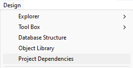

- avec 4D Server, sélectionnez la ligne de menu **Fenêtre/Dépendances du projet**.<br/>
  

La fenêtre Dépendances s'affiche alors. Les dépendances sont classées par nom par ordre alphabétique :

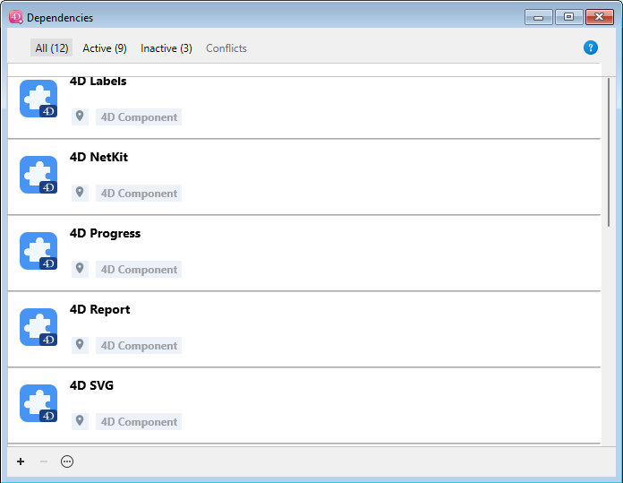

L'interface de la fenêtre Dépendances vous permet de gérer les dépendances (sur 4D monoposte et 4D Server).

### Filtrer les dépendances

Par défaut, toutes les dépendances identifiées par le Gestionnaire de dépendances sont listées, quel que soit leur [statut](#dependency-status). Vous pouvez filtrer les dépendances affichées en fonction de leur statut en sélectionnant l'onglet approprié en haut de la fenêtre :

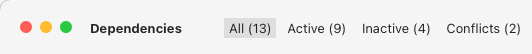

- **Toutes** : Toutes les dépendances, y compris les dépendances primaires (déclarées) et secondaires (résolues automatiquement), sous forme de liste.
- **Déclarées** : Les dépendances primaires qui sont explicitement déclarées dans le fichier `dependencies.json`. Cet onglet vous aide à distinguer les dépendances que vous avez directement ajoutées de celles qui ont été [automatiquement résolues](#automatic-dependency-resolution).
- **Actives** : Dépendances chargées et utilisables dans le projet. Il comprend des dépendances *overloading*, qui sont effectivement chargées. Les dépendances *overloaded* sont listées dans l'onglet **Conflits**, ainsi que toutes les dépendances conflictuelles.
- **Inactives** : Dépendances qui ne sont pas chargées dans le projet et qui ne sont pas disponibles. Diverses raisons peuvent expliquer ce statut : fichiers manquants, incompatibilité de version...
- **Conflits** : Les dépendances qui sont chargées mais qui surchargent au moins une autre dépendance à un [niveau de priorité](#priority) inférieur. Les dépendances surchargées sont également affichées afin que vous puissiez vérifier l'origine du conflit et prendre les mesures appropriées.

### Dépendances secondaires

Le panneau Dépendances indique les [**dépendances secondaires**](#automatic-dependency-resolution) en affichant comme [origin](#dependency-origin) `Dépendance de composant` :


Lorsque vous survolez une dépendance secondaire, une infobulle affiche la dépendance parente qui la requiert. Une dépendance secondaire ne peut pas être [supprimée](#removing-a-dependency) directement, vous devez supprimer ou modifier la dépendance primaire qui la requiert.

### Statut des dépendances

Les dépendances nécessitant l'attention du développeur sont signalées par une **étiquette de statut** à droite de la ligne et une couleur de fond spécifique :

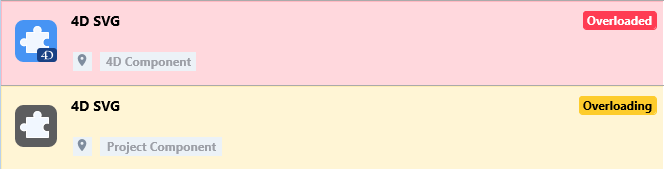

Les étiquettes de statut suivantes sont disponibles :

- **Overloaded** : La dépendance n'est pas chargée car elle est surchargée par une autre dépendance portant le même nom et ayant un [niveau de priorité](#priority) plus élevé.
- **Overloading** : La dépendance est chargée et surcharge une ou plusieurs autres dépendances avec le même nom à un [niveau de priorité](#priority) inférieur.
- **Non trouvé** : La dépendance est déclarée dans le fichier dependencies.json mais n'est pas trouvée.
- **Inactif** : La dépendance n'est pas chargée car elle n'est pas compatible avec le projet (par exemple, le composant n'est pas compilé pour la plate-forme actuelle).
- **Dupliqué** : La dépendance n'est pas chargée car une autre dépendance portant le même nom existe au même endroit (et est chargée).
- **Disponible après redémarrage** : La référence de la dépendance vient d'être ajoutée ou mise à jour [à l'aide de l'interface](#monitoring-project-dependencies), elle sera chargée une fois que l'application aura redémarré.
- **Déchargé après redémarrage** : La référence à la dépendance vient d'être supprimée [en utilisant l'interface](#removing-a-dependency), elle sera déchargée une fois que l'application aura redémarré.
- **Update available \<version\>**: A new version of the dependency matching your [component version configuration](#defining-a-dependency-version-range) has been detected.
- **Refreshed after restart**: The [component version configuration](#defining-a-dependency-version-range) of the dependency has been modified, it will be adjusted at the next startup.
- **Recent update**: A new version of the dependency has been loaded at startup.

:::tip

When you click on the **Available after restart** label, a dialog box is displayed and allows you to restart immediately.

:::

Une infobulle s'affiche lorsque vous survolez la ligne de dépendance, fournissant des informations supplémentaires sur le statut :

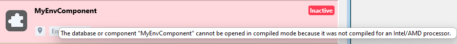

### Origine de la dépendance

Le panneau Dépendances liste toutes les dépendances du projet, quelle que soit leur origine. L'origine de la dépendance est fournie par l'étiquette sous son nom :

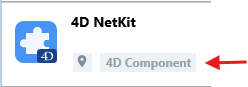

Les options suivantes sont disponibles :

| Étiquette                    | Description                                                                                                                                        |
| ---------------------------- | -------------------------------------------------------------------------------------------------------------------------------------------------- |
| Intégré à 4D                 | Composant 4D intégré, stocké dans le dossier `Components` de l'application 4D                                                                      |
| Déclaré dans le projet       | Composant déclaré dans le fichier [`dependencies.json`](#dependenciesjson)                                                                         |
| Déclaré dans l'environnement | Composant déclaré dans le fichier [`dependencies.json`](#dependenciesjson) et surchargé dans le fichier [`environment4d.json`](#environment4djson) |
| Dossier Components           | Composant situé dans le dossier [`Components`](architecture.md#components)                                                                         |
| Dépendance de composant      | Composant secondaire ([requis par un autre composant](#automatic-dependency-resolution))                                        |

**Cliquez avec le bouton droit de la souris** dans une ligne de dépendance et sélectionnez **Afficher sur le disque** pour révéler l'emplacement d'une dépendance :

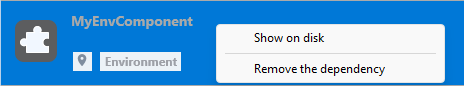

:::note

Cet élément n'est pas affiché si la dépendance est inactive parce que ses fichiers sont introuvables.

:::

L'icône du composant et le logo de l'emplacement fournissent des informations supplémentaires :

- Le logo du composant indique s'il est fourni par 4D ou par un développeur tiers.
- Local components can be differentiated from GitHub and GitLab components by a small icon.

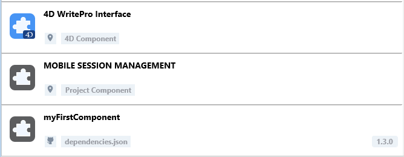

### Ajouter une dépendance locale

To add a local dependency, click on the **[+]** button in the footer area of the panel. La fenêtre suivante s'affiche :

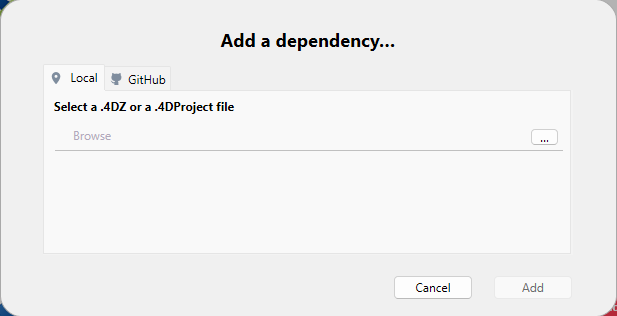

Make sure the **Local** tab is selected and click on the *...*\*\* button. Une boîte de dialogue standard d'ouverture de fichier s'affiche, vous permettant de sélectionner le composant à ajouter. Vous pouvez sélectionner un fichier [**.4DZ**](../Desktop/building.md#build-component) ou [**.4DProject**](architecture.md#applicationname4dproject-file).

Si l'élément sélectionné est valide, son nom et son emplacement sont affichés dans la boîte de dialogue.


Si l'élément sélectionné n'est pas valide, un message d'erreur s'affiche.

Cliquez sur **Ajouter** pour ajouter la dépendance au projet.

- Si vous sélectionnez un composant situé à côté du dossier racine du projet (emplacement par défaut), il est déclaré dans le fichier [**dependencies.json**](#dependenciesjson).
- Si vous sélectionnez un composant qui n'est pas situé à côté du dossier racinedu projet, il est déclaré dans le fichier [**dependencies.json**](#dependenciesjson) et son chemin est déclaré dans le fichier [**environment4d.json**](#environment4djson) (voir note). Le panneau Dépendances vous demande si vous souhaitez enregistrer un [chemin relatif ou absolu](#relative-paths-vs-absolute-paths).

:::note

Si aucun fichier [**environment4d.json**](#environment4djson) n'est déjà défini pour le projet à cette étape, il est automatiquement créé dans le dossier racine du projet (emplacement par défaut).

:::

La dépendance est ajoutée à la [liste des dépendances inactives](#dependency-status) avec le statut **Disponible après redémarrage**. Elle sera chargée une fois que l'application aura redémarré.

### Adding a GitHub or GitLab dependency

To add a [GitHub or GitLab dependency](#components-stored-on-git-hosting-platforms):

1. Click on the **[+]** button in the footer area of the panel and select the tab corresponding to your platform: **GitHub** or **GitLab**.

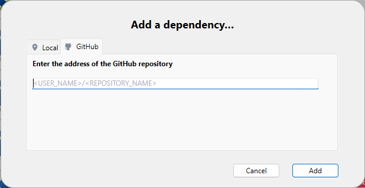

:::note

By default, [components developed by 4D](../Extensions/overview.md#components-developed-by-4d) are listed in the GitHub combo box, so that you can easily select and install these features in your environment:


Les composants déjà installés ne sont pas dans la liste.

:::

2. Enter the path of the GitHub or GitLab repository of the dependency. It could be:

- a **repository URL** (e.g. "https://github.com/vdelachaux/UI-with-Classes")
- (GitLab only) a self-hosted instance private server URL (e.g. "https://git-my-server.com/4d/components/mycomponent")
- a **user-account/repository-name string**, for example:


Once the connection is established, an icon  is displayed on the right side of the entry area. Vous pouvez cliquer sur cette icône pour ouvrir le dépôt dans votre navigateur par défaut.

:::note

Si le composant est stocké dans un [référentiel privé](#private-repositories) et que votre jeton personnel est manquant, un message d'erreur s'affiche et un bouton **Ajouter un jeton d'accès personnel...** apparaît (voir [Fournir votre jeton d'accès](#providing-your-access-token)).

:::

3. Définissez la [plage de versions des dépendances](#tags-and-versions) à utiliser pour ce projet. By defaut, "Latest" (GitHub) or "Highest" (GitLab) is selected, which means that the most recent version will be automatically used.

4. Cliquez sur le bouton **Ajouter** pour ajouter la dépendance au projet.

The dependency is declared in the [**dependencies.json**](#dependenciesjson) file and added to the [inactive dependency list](#dependency-status) with the **Available at restart** status. Elle sera chargée une fois que l'application aura redémarré.

#### Defining a dependency version range

Vous pouvez définir l'option [règle de dépendance](#tags-and-versions) pour une dépendance :

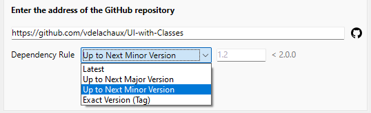

- **Suivre la version de 4D** (option par défaut, recommandée) : Télécharge la dernière version du composant compatible avec la version courante de 4D. Vous ne pouvez utiliser cette règle de dépendance que si les tags de release des composants respectent la [convention de nommage](#naming-conventions-for-4d-version-tags) appropriée. Cette option est **recommandée**, en particulier pour les [composants développés par 4D](../Extensions/overview.md#components-developed-by-4d).
- **Jusqu'à la version majeure suivante** : Définit une [plage sémantique de versions](#tags-and-versions) pour limiter les mises à jour à la version majeure suivante.
- **Jusqu'à la prochaine version mineure** : De même, limite les mises à jour à la version mineure suivante.
- **Version exacte (balise)** : Sélectionnez ou saisissez manuellement un [tag spécifique](#tags-and-versions) dans la liste disponible.
- **Latest** (GitHub) or **Highest** (GitLab): Allows to download the release with the corresponding tag, usually the most recent release. **Attention :** Bien que l'utilisation de cette option soit pratique au début du développement, il est préférable de l'éviter dans les projets en production ou partagés car elle récupère automatiquement les nouvelles versions, y compris les versions bêta, ce qui peut conduire à des mises à jour non souhaitées ou à des ruptures de compatibilité.

The current dependency version is displayed on the right side of the dependency item:

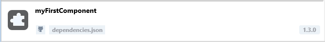

#### Modifying the dependency version range

You can modify the [version setting](#defining-a-dependency-version-range) for a listed dependency: select the dependency to modify and select **Edit the dependency...** from the contextual menu. Dans la boîte de dialogue "Editer la dépendance", modifiez le menu Règle de dépendance et cliquez sur **Appliquer**.

La modification de la plage de versions est utile par exemple si vous utilisez la fonction de mise à jour automatique et que vous souhaitez verrouiller une dépendance à un numéro de version spécifique.

### Mise à jour des dépendances

Le Gestionnaire de dépendances permet une gestion intégrée des mises à jour sur GitHub. Les fonctionnalités suivantes sont prises en charge :

- Vérification automatique et manuelle des versions disponibles
- Mise à jour automatique et manuelle des composants

Les opérations manuelles peuvent être effectuées **par dépendance** ou **pour toutes les dépendances**.

#### Vérification des nouvelles versions

Les mises à jour des dépendances sont régulièrement vérifiées sur GitHub. Cette vérification est effectuée de manière transparente en arrière-plan.

:::note

Si vous fournissez un [token d'accès](#providing-your-github-access-token), les vérifications sont effectuées plus fréquemment, car GitHub autorise alors une plus grande fréquence de requêtes aux dépôts.

:::

En outre, vous pouvez vérifier les mises à jour à tout moment, pour une seule dépendance ou pour toutes les dépendances :

- Pour vérifier les mises à jour d'une seule dépendance, cliquez avec le bouton droit de la souris sur la dépendance et sélectionnez **Vérifier les mises à jour** dans le menu contextuel.

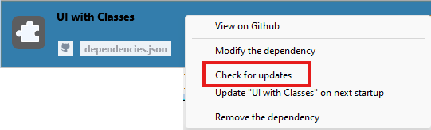

- Pour vérifier les mises à jour de toutes les dépendances, cliquez sur le menu **options** en bas de la fenêtre du gestionnaire de dépendances et sélectionnez **Vérifier les mises à jour**.

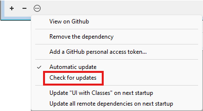

Si une nouvelle version de composant correspondant à votre [règle de version des dépendances](#defining-a-github-dependency-version-range) est détectée sur GitHub, un statut de dépendance spécifique est affiché :

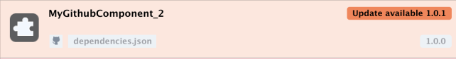

Vous pouvez décider de [mettre à jour le composant](#updating-dependencies) ou non.

Si vous ne souhaitez pas utiliser la mise à jour des composants (par exemple, vous souhaitez conserver une version spécifique), laissez simplement le statut courant (assurez-vous que l'option [**Mise à jour automatique**](#automatic-update) n'est pas cochée).

#### Mise à jour des dépendances

**Updating a dependency** means downloading a new version of the dependency from GitHub or GitLab and keeping it ready to be loaded the next time the project is started.

Vous pouvez mettre à jour les dépendances à tout moment, pour une seule dépendance ou pour toutes les dépendances :

- Pour mettre à jour une seule dépendance, cliquez avec le bouton droit de la souris sur la dépendance et sélectionnez **Mettre à jour<component name\> au prochain démarrage** dans le menu contextuel ou dans le menu **options** en bas de la fenêtre du gestionnaire de dépendances :

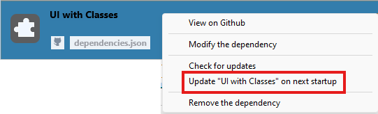

- Pour mettre à jour toutes les dépendances en une seule fois, cliquez sur le menu **options** en bas de la fenêtre du gestionnaire de dépendances et sélectionnez **Mettre à jour toutes les dépendances distantes au prochain démarrage** :

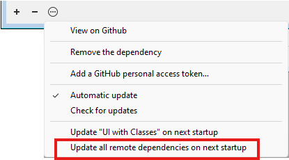

Dans tous les cas, quel que soit le statut courant de la dépendance, une vérification automatique est effectuée sur GitHub avant de mettre à jour la dépendance, afin de s'assurer que la version la plus récente est récupérée, [en fonction de la règle de version de votre composant](#defining-a-github-dependency-version-range).

Lorsque vous sélectionnez une commande de mise à jour :

- une boîte de dialogue s'affiche et propose de **redémarrer le projet**, afin que les dépendances mises à jour soient immédiatement disponibles. Il est généralement recommandé de redémarrer le projet pour évaluer les dépendances mises à jour.
- if you click **Later**, the update command is no longer available in the menu, meaning the action has been planned for the next startup.

#### Mise à jour automatique

L'option **Mise à jour automatique** est disponible dans le menu **options** en bas de la fenêtre du gestionnaire de dépendances.

When this option is checked (default), new GitHub or GitLab component versions matching your [component versioning configuration](#defining-a-github-dependency-version-range) are automatically updated for the next project startup. Cette option facilite la gestion quotidienne des mises à jour des dépendances, en éliminant la nécessité de sélectionner manuellement les mises à jour.

Lorsque cette option n'est pas cochée, une nouvelle version de composant correspondant à votre [règle de version des composants](#defining-a-github-dependency-version-range) n'est indiquée que comme disponible et nécessitera une [mise à jour manuelle](#updating-dependencies). Désélectionnez l'option **Mise à jour automatique** si vous souhaitez contrôler précisément les mises à jour des dépendances.

### Providing your access token

Registering your [personal access token](#authentication-and-tokens) in the Dependency manager is:

- mandatory if the component is stored on a private repository,
- recommandé pour une [vérification des mises à jour des dépendances](#updating-dependencies) plus fréquente.

#### Adding a token

To provide your GitHub or GitLab access token, you can either:

- click on **Add a personal access token...** button that is displayed in the "Add a dependency" dialog box after you entered a private repository path.


- or, select **Add a GitHub personal access token...** or **Add a GitLab personal access token...** in the Dependency manager menu at any moment. For GitLab access tokens, you can select the host:

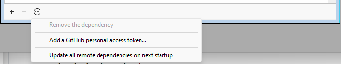

Vous pouvez ensuite saisir votre jeton d'accès personnel :


#### Editing a token

You can only enter one personal access token per host. Once a token has been entered, you can **edit** it.

Le jeton fourni est stocké dans un fichier **github.json** dans le [dossier actif 4D](../commands/get-4d-folder#active-4d-folder).

### Suppression d'une dépendance

Pour supprimer une dépendance de la fenêtre Dépendances, sélectionnez la dépendance à supprimer et cliquez sur le bouton **-** ou sélectionnez **Supprimer la dépendance** dans le menu contextuel. Vous pouvez sélectionner plusieurs dépendances, auquel cas l'action est appliquée à toutes les dépendances sélectionnées.

:::note

Seules les dépendances primaires déclarées dans le fichier [**dependencies.json**](#dependenciesjson) peuvent être supprimées dans la fenêtre Dépendances. Les dépendances secondaires ne peuvent pas être supprimées directement - pour supprimer une dépendance secondaire, vous devez supprimer la dépendance primaire qui la requiert. Si une dépendance sélectionnée ne peut pas être supprimée, le bouton **-** est désactivé et l'élément de menu **Supprimer la dépendance** est masqué.

:::

Une boîte de dialogue de confirmation s'affiche. Si la dépendance a été déclarée dans le fichier **environment4d.json**, une option permet de la supprimer :


Si vous confirmez la boîte de dialogue, le [statut](#dependency-status) de la dépendance supprimée est automatiquement modifié en "Déchargé après redémarrage". Elle sera chargée une fois que l'application aura redémarré.

#### Avertissements relatifs à l'utilisation des dépendances

Lorsque vous tentez de supprimer une dépendance primaire qui est requise par d'autres dépendances dans votre projet, vous serez averti que la dépendance est toujours en cours d'utilisation. Le système affichera les autres dépendances qui la requièrent et vous demandera de confirmer la suppression, car celle-ci peut entraîner l'arrêt du fonctionnement de ces composants dépendants.


