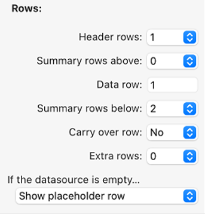
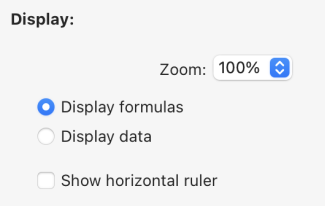
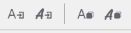

L'interface de 4D Write Pro offre un ensemble de palettes, qui permettent aux utilisateurs de personnaliser facilement un document 4D Write Pro.

Un développeur 4D peut facilement implémenter ces palettes dans leur application. Ainsi, les utilisateurs finaux peuvent gérer toutes les propriétés de 4D Write Pro, telles que les polices, l'alignement du texte, les signets, la mise en page des tableaux et les cadres.

## Installation et documentation

4D Write Pro Interface est un **composant 4D** qui doit être [installé dans votre projet](../Project/components.md#overview). Les fichiers sources de l'interface 4D Write Pro sont [fournis sur Github](https://github.com/4d/4D-WritePro-Interface).

La documentation principale de l'[interface 4D Write Pro](https://doc.4d.com/4Dv20/4D/20/Entry-areas.300-6263967.en.html) se trouve dans le *4D - Mode Développement*. Vous trouverez ci-dessous :

- la documentation de configuration de l'assistant de table,
- I.A intégrée documentation. documentation.

## Assistant de table

L'Assistant de table est là pour simplifier encore davantage la création de table basée sur les données de la base de données en utilisant des contextes, des sources de données et des formules.

L'Assistant de table, accessible aux utilisateurs finaux, charge les modèles fournis et configurés par les développeurs de 4D. Cela permet aux développeurs de personnaliser le modèle en fonction des cas d'utilisation spécifiques et des exigences métier des utilisateurs.

L'Assistant de table est fourni avec des modèles et des thèmes par défaut, que les développeurs peuvent configurer pour adapter son contenu en fonction des exigences spécifiques de l'application.

Pour implémenter l'Assistant de table dans votre application, les développeurs peuvent créer et configurer des fichiers de modèle.

### Interface de l'Assistant de table WP

L'utilisateur ouvre la boîte de dialogue de l'Assistant de table à partir de l'élément de menu "Insérer une table" dans la barre d'outils et la barre latérale de l'interface de 4D Write Pro.


À partir de cette interface, l'utilisateur peut sélectionner un modèle ou un tableau dans la première liste déroulante et un thème dans la deuxième.

##### Dans Colonnes :


Selon la sélection de l'utilisateur d'un modèle ou d'un tableau, l'utilisateur peut voir la liste des champs stockés dans le modèle (Blob et les types d'objets sont automatiquement exclus). Ensuite, ils peuvent sélectionner les colonnes à afficher dans le tableau en cochant la case devant le nom du champ et les ordonner en déplaçant et en faisant glisser la liste des champs.

##### Dans Lignes :



Dans l'Assistant de table, l'utilisateur peut également définir le nombre de lignes d'en-tête et de lignes supplémentaires (de 0 à 5 chacune), définir les [lignes de rupture](https://doc.4d.com/4Dv20/4D/20/Handling-tables.200-6229469.fr.html#6233076) (lignes de synthèse) au-dessus ou en dessous de la ligne de données, et choisir d'afficher/masquer les [lignes de report](https://doc.4d.com/4Dv20/4D/20/Handling-tables.200-6229469.fr.html#6236686).

De plus, l'utilisateur a la possibilité de choisir le comportement du tableau lorsque sa source de données est vide, grâce aux options suivantes : Afficher la ligne de données, Masquer la ligne de données, Masquer le tableau, Afficher la ligne d'espace réservé.

##### Dans Affichage :



L'utilisateur ajuste le niveau de zoom selon ses préférences en sélectionnant l'option souhaitée dans une liste déroulante, utilise des boutons radio pour afficher les formules ou les données pour une présentation claire, et choisit d'afficher une règle horizontale à l'aide d'une case à cocher.

Après avoir finalisé la création et la personnalisation de la table, l'utilisateur peut cliquer sur le bouton **Insérer** pour ajouter la table à son document WP.

Une fois que la table a été intégrée dans le document, l'utilisateur peut personnaliser son style. Les outils de mise en forme de la barre d'outils et de la barre latérale sont toujours disponibles.

### Configuration du modèle de l'Assistant de table WP

La configuration des modèles inclut:

- Définir des tables et des champs ainsi que préparer des formules adaptées à l'application à partir du [fichier de modèle](#template-files).
- Traduction des noms de table, de champ et de formule à partir du [fichier de traduction](#translation-files).
- Conception de styles graphiques et de thèmes personnalisés à partir du [fichier de thème](#theme-files).

Ces trois types de fichiers contribuent à la configuration de l'Assistant de table, et bien que chacun remplisse une fonction distincte, aucun d'entre eux n'est considéré comme un composant essentiel.

#### Fichiers de modèle

Le fichier de modèle vous permet de définir les éléments suivants :

- la formule qui retourne une sélection d'entité utilisée comme source de données de la table,
- les formules de rupture (si une ligne de rupture peut être insérée)
- les attributs de dataclass qui peuvent être utilisés comme colonnes de table,
- les formules disponibles dans les menus contextuels des lignes de rupture, de la ligne à reporter en bas, de la ligne de remplacement ou des autres lignes.

Le fichier modèle doit être stocké dans un dossier "[`Resources`](../Project/architecture.md#resources)/4DWP_Wizard/Templates" dans votre projet.

Le fichier de modèle au format JSON contient les attributs suivants :

| Attribut                             | Type       | Obligatoire | Description                                                                                                                                                                                                                    |
| :----------------------------------- | :--------- | :---------- | :----------------------------------------------------------------------------------------------------------------------------------------------------------------------------------------------------------------------------- |
| tableDataSource                      | Text       | x           | Formule de la source de données de la table                                                                                                                                                                                    |
| columns                              | Collection | x           | Collection des colonnes de la table                                                                                                                                                                                            |
| columns.check        | Text       | x           | Vrai lorsque la colonne est déjà cochée dans l'éditeur de modèle. Faux lorsque la colonne est décochée dans l'éditeur de modèle.                                                               |
| columns.header       | Text       | x           | Étiquette affichée à l'utilisateur                                                                                                                                                                                             |
| columns.source       | Text       | x           | Formula                                                                                                                                                                                                                        |
| ruptures/sauts                       | Collection |             | Collection d'objets de rupture. L'ordre des ruptures est important. Il correspond à l'ordre dans le document lorsque les ruptures se trouvent au-dessus des lignes de données. |
| breaks.label         | Text       | x           | Étiquette affichée à l'utilisateur                                                                                                                                                                                             |
| breaks.source        | Text       | x           | Formula                                                                                                                                                                                                                        |
| breakFormulas                        | Collection |             | Collection d'objets de formule applicables aux lignes de rupture                                                                                                                                                               |
| breakFormulas.label  | Text       | x           | Étiquette affichée à l'utilisateur                                                                                                                                                                                             |
| breakFormulas.source | Text       | x           | Formula                                                                                                                                                                                                                        |
| bcorFormulas                         | Collection |             | Collection d'objets de formule applicables aux lignes à reporter en bas                                                                                                                                                        |
| bcorFormulas.label   | Text       | x           | Étiquette affichée à l'utilisateur                                                                                                                                                                                             |
| bcorFormulas.source  | Text       | x           | Formula                                                                                                                                                                                                                        |
| extraFormulas                        | Collection |             | Collection d'objets de formule applicable aux lignes supplémentaires                                                                                                                                                           |
| extraFormulas.label  | Text       | x           | Étiquette affichée à l'utilisateur                                                                                                                                                                                             |
| extraFormulas.source | Text       | x           | Formula                                                                                                                                                                                                                        |
| placeholderFormulas                  | Collection |             | Collection d'objets de formule insérés dans la ligne de remplacement                                                                                                                                                           |

:::note Langue française

Si votre application est susceptible d'être exécutée sur un 4D avec une langue définie en français, assurez-vous d'utiliser [tokens](https://doc.4d.com/4Dv20/4D/20/Using-tokens-in-formulas.300-6237731.en.html) dans vos formules afin qu'elles soient correctement interprétées quelle que soit la configuration de la langue de l'utilisateur.

:::

##### Exemple

Voici un bref exemple de ce à quoi votre fichier JSON pourrait ressembler :

```json
{
    "tableDataSource": "ds.People.all().orderBy(\"toCompany.name asc, continent asc, country asc, city asc\")",
    "columns": [{
            "check": true,
            "header": "Firstname",
            "source": "This.item.firstname"
        }, {
            "check": true,
            "header": "Lastname",
            "source": "This.item.lastname"
        }, {
            "check": true,
            "header": "Salary",
            "source": "String(This.item.salary;\"###,###.00\")"
        }
    ],
    "breaks": [{
            "label": "Company",
            "source": "This.item.toCompany.name"
        }
    ],
    "breakFormulas": [{
            "label": "Company",
            "source": "This.item.toCompany.name"
	}, {
            "label": "Sum of salaries",
            "source": "String(This.breakItems.sum(\"salary\"); \"###,###.00\")"
        }
    ],
    "bcorFormulas": [{
            "label": "Sum of salaries",
            "source": "String(This.tableData.sum(\"salary\"); \"###,###.00\")"
        }
    ],
    "extraFormulas": [{
            "label": "Sum of salaries",
            "source": "String(This.tableData.sum(\"salary\"); \"###,###.00\")"
        }
    ]
}

```

#### Fichiers de traduction

Les fichiers de traduction traduisent les noms des modèles, thèmes, tables, champs et formules. Ces fichiers sont ajoutés au dossier "[`Resources`](../Project/architecture.md#resources)/4DWP_Wizard/Translations" de votre projet.

Chaque fichier de traduction doit être nommé avec le code de langue correspondant (par exemple "en" pour l'anglais ou "fr" pour le français).

Le fichier de traduction au format JSON contient les attributs suivants :

| Attribut  | Type       | Obligatoire | Description                                                                                        |
| :-------- | :--------- | :---------- | :------------------------------------------------------------------------------------------------- |
| tables    | Collection |             | Collection d'objets de table traduits                                                              |
| fields    | Collection |             | Collection d'objets de champ traduits                                                              |
| formulas  | Collection |             | Collection d'objets de formule traduits                                                            |
| fileNames | Collection |             | Collection d'objets fileName traduits (applicable au thème et au nom du modèle) |

Dans chacun de ces attributs, l'objet de traduction contient les attributs suivants :

| Attribut    | Type | Obligatoire | Description                            |
| :---------- | :--- | :---------- | :------------------------------------- |
| original    | Text | x           | Texte original destiné à la traduction |
| translation | Text | x           | Version traduite du texte original     |

La définition de ces attributs dans l'objet de traduction garantit une organisation et un alignement corrects entre le contenu source et le contenu traduit.

Si le nom du modèle ou la formule (rupture, ligne reportée ou supplémentaire) existe dans le fichier traduit, sa traduction est appliquée dans l'assistant de tableau. De plus, seule la table définie dans le fichier de traduction est affichée et traduite.

Le fichier de traduction sert un rôle supplémentaire lorsqu'un utilisateur sélectionne une table dans l'interface. Il peut filtrer les tables et les champs proposés à l'utilisateur. Par exemple, pour masquer les IDs de table, ce comportement est similaire aux commandes `SET TABLE TITLES` et `SET FIELD TITLES`.

##### Exemple

```json
{
    "tables": [{
            "original": "People",
            "translation": "Personne"
        }
    ],
    "fields": [{
            "original": "lastname",
            "translation": "Nom"
        }, {
            "original": "firstname",
            "translation": "Prénom"
        }, {
            "original": "salary",
            "translation": "Salaire"
        }, {
            "original": "company",
            "translation": "Société"
        }
    ],
    "formulas": [{
            "original": "Sum of salary",
            "translation": "Somme des salaires"
        }
    ]
}
    
```

#### Fichiers de thème

Une liste de thèmes est fournie par défaut dans le composant Interface 4D Write Pro, tels que "Arial", "CourierNew" et "YuGothic", disponibles en plusieurs variations comme "Bleu" et "Vert". Cependant, vous pouvez créer votre propre thème en le plaçant dans le dossier "[`Resources`](../Project/architecture.md#resources)/4DWP_Wizard/Themes" de votre projet.

Le fichier de thème au format JSON contient les attributs suivants:

| Attribut       | Type   | Obligatoire | Description                                                                                                                                                                                                                                  |
| :------------- | :----- | :---------- | :------------------------------------------------------------------------------------------------------------------------------------------------------------------------------------------------------------------------------------------- |
| default        | Object |             | Objet contenant le style par défaut applicable à toutes les lignes.                                                                                                                                                          |
| table          | Object |             | Objet contenant la définition de style applicable à la table.                                                                                                                                                                |
| rows           | Object |             | Objet contenant la définition de style applicable à toutes les lignes.                                                                                                                                                       |
| cells          | Object |             | Objet contenant la définition de style applicable à toutes les cellules.                                                                                                                                                     |
| header1        | Object |             | Objet contenant la définition de style applicable à la première ligne d'en-tête.                                                                                                                                             |
| header2        | Object |             | Objet contenant la définition de style applicable à la deuxième ligne d'en-tête.                                                                                                                                             |
| header3        | Object |             | Objet contenant la définition de style applicable à la ligne du troisième en-tête.                                                                                                                                           |
| header4        | Object |             | Objet contenant la définition de style applicable à la quatrième ligne d'en-tête.                                                                                                                                            |
| header5        | Object |             | Objet contenant la définition de style applicable à la cinquième ligne d'en-tête.                                                                                                                                            |
| headers        | Object |             | Objet contenant la définition de style applicable aux lignes d'en-tête, si un en-tête spécifique (comme header1, header2...) n'est pas défini.            |
| data           | Object |             | Objet contenant la définition du style applicable à la ligne de données répétée.                                                                                                                                             |
| break1         | Object |             | Objet contenant la définition du style applicable à la première ligne de rupture.                                                                                                                                            |
| break2         | Object |             | Objet contenant la définition du style applicable à la deuxième ligne de rupture.                                                                                                                                            |
| break3         | Object |             | Objet contenant la définition du style applicable à la troisième ligne de rupture.                                                                                                                                           |
| break4         | Object |             | Objet contenant la définition du style applicable à la quatrième ligne de rupture.                                                                                                                                           |
| break5         | Object |             | Objet contenant la définition du style applicable à la cinquième ligne de rupture.                                                                                                                                           |
| ruptures/sauts | Object |             | Objet contenant la définition du style applicable aux lignes de rupture, s'il s'agit d'une rupture spécifique (comme break1, break2...) n'est pas défini. |
| bcor           | Object |             | Objet contenant la définition du style applicable à la ligne à reporter en bas.                                                                                                                                              |
| placeholder    | Object |             | Objet contenant le style par défaut applicable à la ligne de remplacement.                                                                                                                                                   |

Pour chaque attribut utilisé dans votre fichier JSON (lignes d'en-tête, de données, à reporter en bas, de synthèse et autres lignes), vous pouvez définir les attributs WP suivants, indiqués avec leur [constante WP correspondante](https://doc.4d.com/4Dv20/4D/20/4D-Write-Pro-Attributes.300-6229528.en.html) :

| Attributs WP    | Constante WP correspondante |
| :-------------- | :-------------------------- |
| textAlign       | wk text align               |
| backgroundColor | wk background color         |
| borderColor     | wk border color             |
| borderStyle     | wk border style             |
| borderWidth     | wk border width             |
| font            | wk font                     |
| color           | wk font color               |
| fontFamily      | wk font family              |
| fontSize        | wk font size                |
| padding         | wk padding                  |

##### Exemple

```json
{
    "default": {
           "backgroundColor": "#F0F0F0",
           "borderColor": "#101010",
           "borderStyle": 1,
           "borderWidth": "0.5pt",
           "font": "Times New Roman",
           "color": "#101010",
           "fontFamily": "Times New Roman",
           "fontSize": "7pt",
           "padding": "2pt"
    },
    "table": {
           "backgroundColor": "#E1EAF3"
    },
    "header1": {
           "textAlign": 2,
           "borderColor": "#41548F",
           "borderWidth": "1.5pt",
           "backgroundColor": "#979BA9",
           "color": "#F4F4FF",
           "font": "Times New Roman Bold"
    },
    "data": {
           "fontSize": "13pt",
           "textAlign": 0
    },
    "break1": {
           "textAlign": 2,
           "fontSize": "15pt"
    }
}
    
```

#### Voir également

[4D Write Pro - Table Wizard (vidéo tutorial)](https://www.youtube.com/watch?v=2ChlTju-mtM)

## IA intégrée

Vous pouvez utiliser une IA intégrée dans l'interface de 4D Write Pro afin de traduire ou d'améliorer facilement vos documents sans avoir à utiliser une application d'IA externe.

Une fois la fonctionnalité d'IA activée, vous pouvez afficher une zone de conversation au-dessus de votre document 4D Write Pro et interagir avec *chatGPT* pour modifier le texte de la sélection ou du document lui-même.

:::note

L'interface de 4D Write Pro utilise OpenAI, pour lequel vous devez fournir votre propre clé (voir ci-dessous).

:::

### Limitations

Dans l'implémentation actuelle, la fonctionnalité présente les limitations suivantes :

- utilisation d'un fournisseur d'IA prédéfini et nécessité de fournir votre clé OpenAI
- fonctionnalités de conversation basiques
- aucune prise en charge des images
- commandes d'action prédéfinies non configurables
- traductions prédéfinies anglais/français et français/anglais uniquement

### Activation de la fonctionnalité d'IA

La boîte de dialogue d'IA est accessible en cliquant sur un bouton dans l'interface de 4D Write Pro. Ce bouton est **masqué par défaut**, vous devez l'activer explicitement.

Pour afficher le bouton de la boîte de dialogue IA, vous devez :

1. Obtenir une clé API sur le [site web d'OpenAI](https://openai.com/api/).
2. Exécuter le code 4D suivant :

```4d

WP SetAIKey ("<Your OpenAI Key>") //

```

:::note

Aucune vérification de la validité de la clé OpenAI n'est effectuée. Si celle-ci n'est pas valide, la zone de conversation *chatGPT* restera vide.

:::

Le bouton **I.A.** est alors affiché :


- dans la barre d'outils de 4D Write Pro, dans l'onglet **Importer Exporter**,
- dans le widget 4D Write Pro, dans l'onglet **Style de police**.

Cliquez sur le bouton pour afficher la boîte de dialogue d'IA.

### Boîte de dialogue d'IA

La boîte de dialogue d'IA de 4D Write Pro permet une interaction simple entre la zone de conversation et le document 4D Write Pro.

#### Zone d'invite

En bas de la fenêtre, la **zone d'invite** vous permet de saisir toute question à envoyer à l'IA.

Pour envoyer votre question à l'IA, cliquez sur le bouton **Envoyer** :


L'icône du bouton change lorsque la même requête est envoyée à nouveau :


Sur le côté gauche de cette zone, un menu contextuel propose des exemples d'actions courantes qui peuvent être déléguées à l'IA.

La sélection d'une action insère une question correspondante dans l'invite. Si nécessaire, vous pouvez modifier la question, puis cliquer sur le bouton **Envoyer** pour l'envoyer :


:::note

Les actions de traduction par défaut sont basées sur la configuration 4D par défaut actuelle et dépendent des langues disponibles.

:::

#### Boutons de copie

Ces boutons permettent des interactions de base entre la zone de conversation, le document 4D Write Pro sous-jacent et le presse-papiers :



- **Renvoyer le texte brut/Renvoyer le texte stylé** : Copie la dernière réponse ou la réponse sélectionnée de l'IA dans le document 4D Write Pro au point d'insertion courant, en remplaçant le texte sélectionné, le cas échéant.
- **Copier le texte brut/Copier le texte stylé** : Copie la dernière réponse ou la réponse sélectionnée de l'IA dans le presse-papiers.

Dans les deux cas, si la réponse comporte des styles, vous pouvez choisir de copier le texte avec ou sans les styles.

:::note

La zone de conversation utilise le langage Markdown pour mettre en forme le texte. Les styles de base tels que le gras, l'italique, le soulignement et les titres sont pris en charge. Lorsque vous collez du texte stylé provenant de l'IA dans la zone 4D Write Pro, certaines informations de mise en forme peuvent être perdues.

:::

#### Zone de conversation

La zone de conversation affiche l'ensemble des interactions entre vous et l'IA. Vous pouvez la faire défiler et sélectionner la partie de votre choix.

Pour vider cette zone, cliquez sur le bouton **Effacer** de la zone Historique (ce qui réinitialise la fenêtre et toutes les interactions).

#### Historique

La zone Historique répertorie toutes les invites que vous avez envoyées à l'IA. Vous pouvez masquer/afficher cette zone à l'aide du bouton situé dans le coin supérieur droit de la zone de conversation.

Le bouton **Effacer** permet de réinitialiser l'ensemble de la fenêtre et d'effacer toutes les interactions. Cela revient à fermer puis à rouvrir la boîte de dialogue d'IA.

