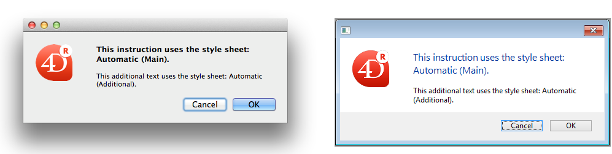
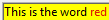
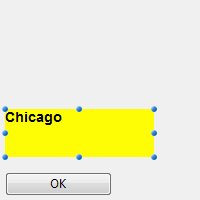
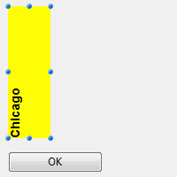

---

## Autoriser sélecteur police/couleur

Lorsque cette propriété est activée, les commandes [OPEN FONT PICKER](../commands/open-font-picker) et [OPEN COLOR PICKER](../commands/open-color-picker) peuvent être appelées pour afficher les fenêtres de sélection des polices et des couleurs du système. A l'aide de ces fenêtres, les utilisateurs peuvent modifier la police ou la couleur d'un objet formulaire dont le focus est accessible directement au clic. Lorsque cette propriété est désactivée (par défaut), les commandes d'ouverture du sélecteur ne produisent aucun effet.

#### Grammaire JSON

| Propriété            | Type de données | Valeurs possibles                           |
| -------------------- | --------------- | ------------------------------------------- |
| allowFontColorPicker | boolean         | false (par défaut), true |

#### Objets pris en charge

[Zone de saisie](input_overview.md)

---

## Souligné

Le texte sélectionné est plus foncé et plus épais.

Vous pouvez définir cette propriété en utilisant la commande [**OBJECT SET FONT STYLE**](../commands/object-set-font-style).

> Ceci est un texte normal.<br/>
> **Ceci est un texte en gras.**

#### Grammaire JSON

| Propriété  | Type de données | Valeurs possibles |
| ---------- | --------------- | ----------------- |
| fontWeight | text            | "normal", "bold"  |

#### Objets pris en charge

[Button](button_overview.md) - [Check Box](checkbox_overview.md) - [Combo Box](comboBox_overview.md) - [Drop-down List](dropdownList_Overview.md) - [Group Box](groupBox.md) - [Hierarchical List](list_overview.md) - [Input](input_overview.md) - [List Box](listbox_overview.md) - [List Box Column](listbox-column.md) - [List Box Footer](listbox-header-footer.md#footers) - [List Box Header](listbox-header-footer.md#headers) - [Radio Button](radio_overview.md) - [Text Area](text.md)

#### Commandes

[OBJECT Get font style](../commands/object-get-font-style) - [OBJECT SET FONT STYLE](../commands/object-set-font-style)

---

## Italique

Fait pencher le texte sélectionné légèrement vers la droite.

Vous pouvez également définir cette propriété via la commande [**OBJECT SET FONT STYLE**](../commands/object-set-font-style).

> Ceci est un texte normal.<br/>
> *Ceci est un texte en italique.*

#### Grammaire JSON

| Nom       | Type de données | Valeurs possibles  |
| --------- | --------------- | ------------------ |
| fontStyle | string          | "normal", "italic" |

#### Objets pris en charge

[Button](button_overview.md) - [Check Box](checkbox_overview.md) - [Combo Box](comboBox_overview.md) - [Drop-down List](dropdownList_Overview.md) - [Group Box](groupBox.md) - [Hierarchical List](list_overview.md) - [Input](input_overview.md) - [List Box](listbox_overview.md) - [List Box Column](listbox-column.md) - [List Box Footer](listbox-header-footer.md#footers) - [List Box Header](listbox-header-footer.md#headers) - [Radio Button](radio_overview.md) - [Text Area](text.md)

#### Commandes

[OBJECT Get font style](../commands/object-get-font-style) - [OBJECT SET FONT STYLE](../commands/object-set-font-style)

---

## Souligné

Une ligne est placée sous le texte.

#### Grammaire JSON

| Nom            | Type de données | Valeurs possibles     |
| -------------- | --------------- | --------------------- |
| textDecoration | string          | "normal", "underline" |

#### Objets pris en charge

[Button](button_overview.md) - [Check Box](checkbox_overview.md) - [Combo Box](comboBox_overview.md) - [Drop-down List](dropdownList_Overview.md) - [Group Box](groupBox.md) - [Hierarchical List](list_overview.md) - [Input](input_overview.md) - [List Box](listbox_overview.md) - [List Box Column](listbox-column.md) - [List Box Footer](listbox-header-footer.md#footers) - [List Box Header](listbox-header-footer.md#headers) - [Radio Button](radio_overview.md) - [Text Area](text.md)

#### Commandes

[OBJECT Get font style](../commands/object-get-font-style) - [OBJECT SET FONT STYLE](../commands/object-set-font-style)

---

## Police

Cette propriété vous permet d'indiquer le **thème de la police** ou la **famille de police** utilisé(e) dans l'objet.

> Les propriétés du **thème** et de la **famille** de police sont mutuellement exclusives. Un thème de police prend en charge les attributs de police, y compris la taille. Une famille de polices vous permet de définir le nom de la police, sa taille et sa couleur.

### Thème de police

La propriété de thème de police désigne un nom de style automatique. Les styles automatiques déterminent de manière dynamique la famille de police, la taille et la couleur de police à utiliser pour l'objet, en fonction des paramètres système. Ces paramètres dépendent de :

- la plateforme,
- la langue du système,
- et le type d'objet de formulaire.

Avec le thème de police, vous avez la garantie que les titres s'affichent toujours conformément aux normes de l'interface du système. Cependant, leur taille peut varier d'une machine à l'autre.

Trois thèmes de polices sont disponibles :

- **normal** : style automatique, appliqué par défaut à tout nouvel objet créé dans l'éditeur de formulaires.
- Les thèmes de polices **principaux** et **supplémentaires** ne sont pris en charge uniquement par les [zones de texte](text.md) et les [zones de saisie](input_overview.md). Ces thèmes sont principalement destinés à la conception de boîtes de dialogue. Ils font référence aux styles de police utilisés respectivement pour le texte principal et les informations supplémentaires dans vos fenêtres d'interface. Voici les boîtes de dialogue typiques (macOS et Windows) utilisant ces thèmes de polices :



> Les thèmes de polices gèrent la police ainsi que sa taille et sa couleur. Vous pouvez appliquer des propriétés de style personnalisées (Gras, Italique ou Souligné) sans modifier son fonctionnement.

#### Grammaire JSON

| Nom       | Type de données | Valeurs possibles              |
| --------- | --------------- | ------------------------------ |
| fontTheme | string          | "normal", "main", "additional" |

#### Objets pris en charge

[Button](button_overview.md) - [Check Box](checkbox_overview.md) - [Combo Box](comboBox_overview.md) - [Drop-down List](dropdownList_Overview.md) - [Group Box](groupBox.md) - [Hierarchical List](list_overview.md) - [Input](input_overview.md) - [List Box](listbox_overview.md) - [List Box Column](listbox-column.md) - [List Box Footer](listbox-header-footer.md#footers) - [List Box Header](listbox-header-footer.md#headers) - [Radio Button](radio_overview.md) - [Text Area](text.md)

#### Commandes

[OBJECT Get style sheet](../commands/object-get-style-sheet) - [OBJECT SET STYLE SHEET](../commands/object-set-style-sheet)

### Famille de police

Il existe deux types de noms de familles de polices :

- *family-name :* Le nom d'une famille de polices, comme "times", "courier", "arial", etc.
- *generic-family*: Le nom d'une famille générique, comme "serif", "sans-serif", "cursive", "fantasy", "monospace".

Vous pouvez le définir en utilisant la commande [`OBJECT SET FONT`](../commands/object-set-font).

#### Grammaire JSON

| Nom        | Type de données | Valeurs possibles               |
| ---------- | --------------- | ------------------------------- |
| fontFamily | string          | Nom d'une famille de police CSS |

> 4D recommande d'utiliser uniquement les polices [compatibles Web](https://www.w3schools.com/cssref/css_websafe_fonts.asp).

#### Objets pris en charge

[Button](button_overview.md) - [Check Box](checkbox_overview.md) - [Combo Box](comboBox_overview.md) - [Drop-down List](dropdownList_Overview.md) - [Group Box](groupBox.md) - [Hierarchical List](list_overview.md) - [Input](input_overview.md) - [List Box](listbox_overview.md) - [List Box Column](listbox-column.md) - [List Box Footer](listbox-header-footer.md#footers) - [List Box Header](listbox-header-footer.md#headers) - [Radio Button](radio_overview.md) - [Text Area](text.md)

#### Commandes

[OBJECT Get font](../commands/object-get-font) - [OBJECT SET FONT](../commands/object-set-font)

## Taille

Permet de définir en points la taille de police de l'objet.

#### Grammaire JSON

| Nom      | Type de données | Valeurs possibles                                                                  |
| -------- | --------------- | ---------------------------------------------------------------------------------- |
| fontSize | integer         | Taille de la police en points. Valeur minimale : 0 |

#### Objets pris en charge

[Button](button_overview.md) - [Check Box](checkbox_overview.md) - [Combo Box](comboBox_overview.md) - [Drop-down List](dropdownList_Overview.md) - [Group Box](groupBox.md) - [Hierarchical List](list_overview.md) - [Input](input_overview.md) - [List Box](listbox_overview.md) - [List Box Column](listbox-column.md) - [List Box Footer](listbox-header-footer.md#footers) - [List Box Header](listbox-header-footer.md#headers) - [Radio Button](radio_overview.md) - [Text Area](text.md)

#### Commandes

[OBJECT Get font size](../commands/object-get-font-size) - [OBJECT SET FONT SIZE](../commands/object-set-font-size)

---

## Couleur de la police

Désigne la couleur de la police.

> Cette propriété définit également la couleur de bordure (le cas échéant) de l'objet lorsque le style "plain" ou "dotted" est utilisé.

La couleur peut être spécifiée par :

- un nom de couleur - comme "red"
- une valeur HEX - comme "# ff0000"
- une valeur RVB - comme "rgb (255,0,0)"

Vous pouvez également définir cette propriété à l'aide de la commande [**OBJECT SET RGB COLORS**](../commands/object-set-rgb-colors).

#### Grammaire JSON

| Nom    | Type de données | Valeurs possibles                          |
| ------ | --------------- | ------------------------------------------ |
| stroke | string          | une valeur css; "transparent"; "automatic" |

#### Objets pris en charge

[Button](button_overview.md) - [Check Box](checkbox_overview.md) - [Combo Box](comboBox_overview.md) - [Drop-down List](dropdownList_Overview.md) - [Group Box](groupBox.md) - [Hierarchical List](list_overview.md) - [Input](input_overview.md) - [List Box](listbox_overview.md) - [List Box Column](listbox-column.md) - [List Box Footer](listbox-header-footer.md#footers) - [List Box Header](listbox-header-footer.md#headers) - [Progress Indicators](progressIndicator.md) - [Ruler](ruler.md) - [Radio Button](radio_overview.md) - [Text Area](text.md)

#### Commandes

[OBJECT GET RGB COLORS](../commands/object-get-rgb-colors) - [OBJECT SET RGB COLORS](../commands/object-set-rgb-colors)

---

## Expression couleur police

`List box de type collection/sélection/entity selection`

Utilisée pour appliquer une couleur de police personnalisée à chaque ligne de la list box. Vous devez utiliser des valeurs de couleur RVB. Pour plus d'informations, voir la description de la commande [`OBJECT SET RGB COLORS`](../commands/object-set-rgb-colors).

Vous devez saisir une expression ou une variable (les variables de type tableau ne peuvent pas être utilisées). L'expression ou la variable sera évaluée pour chaque ligne affichée. Vous pouvez utiliser les constantes décrites dans la commande [`OBJECT SET RGB COLORS`](../commands/object-set-rgb-colors).

Vous pouvez également définir cette propriété en utilisant la commande [`LISTBOX SET PROPERTY`](../commands/listbox-set-property) avec la constante `lk font color expression`.

> Cette propriété peut également être définie à l'aide d'une [expression Meta Info](properties_Text.md#meta-info-expression).

L'exemple suivant utilise un nom de variable : entrez *CompanyColor* pour l'**expression couleur police** et, dans la méthode formulaire, entrez le code suivant :

```4d
CompanyColor:=Choose([Companies]ID;Background color;Light shadow color;   
Foreground color;Dark shadow color)
```

#### Grammaire JSON

| Nom             | Type de données | Valeurs possibles         |
| --------------- | --------------- | ------------------------- |
| rowStrokeSource | string          | Expression couleur police |

#### Objets pris en charge

[List Box](listbox_overview.md)

#### Commandes

[LISTBOX Get property](../commands/listbox-get-property) - [LISTBOX SET PROPERTY](../commands/listbox-set-property)

---

## Expression style {#style-expression}

`List box de type collection/sélection/entity selection`

Utilisé pour appliquer un style de police personnalisé à chaque ligne de list box ou de chaque cellule de la colonne.

Vous devez saisir une expression ou une variable (les variables de type tableau ne peuvent pas être utilisées). L'expression ou variable sera évaluée pour chaque ligne affichée (si elle s'applique à la list box) ou chaque cellule affichée (si elle s'applique à la list box). Vous pouvez utiliser les constantes listées dans la commande [`LISTBOX SET ROW FONT STYLE`](../commands/listbox-set-row-font-style).

Exemple :

```4d
Choose([Companies]ID;Bold;Plain;Italic;Underline)
```

Vous pouvez également définir cette propriété en utilisant la commande [`LISTBOX SET PROPERTY`](../commands/listbox-set-property) avec la constante `lk font style expression`.

> Cette propriété peut également être définie à l'aide d'une [expression Meta Info](properties_Text.md#meta-info-expression).

#### Grammaire JSON

| Nom            | Type de données | Valeurs possibles                                                        |
| -------------- | --------------- | ------------------------------------------------------------------------ |
| rowStyleSource | string          | Expression de style à évaluer pour chaque ligne/cellule. |

#### Objets pris en charge

[List Box](listbox_overview.md) - [Colonne de List Box](listbox-column.md)

#### Commandes

[LISTBOX Get property](../commands/listbox-get-property) - [LISTBOX SET PROPERTY](../commands/listbox-set-property)

---

## Alignement horizontal

Emplacement horizontal du texte dans la zone où il apparait.

#### Grammaire JSON

| Nom       | Type de données | Valeurs possibles                                 |
| --------- | --------------- | ------------------------------------------------- |
| textAlign | string          | "right", "center", "left", "automatic", "justify" |

:::note

- "automatic" n'est pas pris en charge par les [cases à cocher](checkbox_overview.md) et les [boutons radio](radio_overview.md)
- "justify" n'est pris en charge que par les [zones de saisie](input_overview.md) et les [zones de texte](text.md)

:::

#### Objets pris en charge

[Button](button_overview.md) - [Check Box](checkbox_overview.md) (all styles except Regular and Flat) - [Combo Box](comboBox_overview.md) - [Drop-down List](dropdownList_Overview.md) - [Group Box](groupBox.md) - [Input](input_overview.md) - [List Box](listbox_overview.md) - [List Box Column](listbox-column.md) - [List Box Header](listbox-header-footer.md#headers) - [List Box Footer](listbox-header-footer.md#footers) - [Radio Button](radio_overview.md) (all styles except Regular and Flat) - [Text Area](text.md)

#### Commandes

[OBJECT Get horizontal alignment](../commands/object-get-horizontal-alignment) - [OBJECT SET HORIZONTAL ALIGNMENT](../commands/object-set-horizontal-alignment)

---

## Alignement vertical

Emplacement vertical du texte dans la zone où il apparait.

L'option **Default** (valeur JSON `automatique`) définit l'alignement en fonction du type de données identifiées dans chaque colonne :

- `bas` pour toutes les données (sauf les images) et
- `haut` pour les données de type image.

Cette propriété peut également être gérée par les commandes [`OBJECT Get vertical alignment`](../commands/object-get-vertical-alignment) et [`OBJECT SET VERTICAL ALIGNMENT`](../commands/object-set-vertical-alignment).

#### Grammaire JSON

| Nom           | Type de données | Valeurs possibles                      |
| ------------- | --------------- | -------------------------------------- |
| verticalAlign | string          | "automatic", "top", "middle", "bottom" |

#### Objets pris en charge

[List Box](listbox_overview.md) - [List Box Column](listbox-column.md) - [List Box Footer](listbox-header-footer.md#footers) - [List Box Header](listbox-header-footer.md#headers)

#### Commandes

[`OBJECT Get vertical alignment`](../commands/object-get-vertical-alignment) - [`OBJECT SET VERTICAL ALIGNMENT`](../commands/object-set-vertical-alignment)

---

## Meta info expression

`List box collection ou entity selection`

Indique une expression ou une variable qui sera évaluée pour chaque ligne affichée. Elle permet de définir un ensemble d'attributs texte des lignes. Vous devez passer une **variable objet** ou une **expression qui retourne un objet**. Les propriétés suivantes sont prises en charge :

| Nom de propriété | Type    | Description                                                                                                                                                                                                                                                                                                                                                                                                                                                                                                                                                                                                   |
| ---------------- | ------- | ------------------------------------------------------------------------------------------------------------------------------------------------------------------------------------------------------------------------------------------------------------------------------------------------------------------------------------------------------------------------------------------------------------------------------------------------------------------------------------------------------------------------------------------------------------------------------------------------------------- |
| stroke           | string  | Couleur de fond. Toute couleur CSS (ex : "#FF00FF"), "automatic", "transparent"                                                                                                                                                                                                                                                                                                                                                                                                                                                                            |
| fill             | string  | Couleur de la police. Toute couleur CSS (ex : "#FF00FF"), "automatic", "transparent"                                                                                                                                                                                                                                                                                                                                                                                                                                                                       |
| fontStyle        | string  | "normal","italic"                                                                                                                                                                                                                                                                                                                                                                                                                                                                                                                                                                                             |
| fontWeight       | string  | "normal","bold"                                                                                                                                                                                                                                                                                                                                                                                                                                                                                                                                                                                               |
| textDecoration   | string  | "normal","underline"                                                                                                                                                                                                                                                                                                                                                                                                                                                                                                                                                                                          |
| unselectable     | boolean | Désigne la ligne correspondante comme n'étant pas sélectionnable (c'est-à-dire que le surlignage n'est pas possible). Les zones saisissables ne sont plus saisissables si cette option est activée, à moins que l'option «Single-click Edit » ne soit également activée. Les contrôles tels que les cases à cocher et les listes restent fonctionnels. Ce paramètre est ignoré si le mode de sélection de la listbox est "None". Ce paramètre est ignoré si le mode de sélection de la listbox est "None". |
| disabled         | boolean | Désactive la ligne correspondante. Les zones saisissables ne sont plus saisissables si cette option est activée. Les textes et contrôles (cases à cocher, listes, etc.) apparaissent atténués ou grisés. Ce paramètre est ignoré si le mode de sélection de la listbox est "None".                                                                                                                                                                                                                         |

La propriété spéciale "cell" permet d'appliquer un ensemble de propriétés à une seule colonne :

| Nom de propriété |              |                | Type   | Description                                                                                                                                                                                                                                                                                                                                 |
| ---------------- | ------------ | -------------- | ------ | ------------------------------------------------------------------------------------------------------------------------------------------------------------------------------------------------------------------------------------------------------------------------------------------------------------------------------------------- |
| cell             |              |                | object | Propriétés à appliquer individuellement aux colonnes                                                                                                                                                                                                                                                                                        |
|                  | *columnName* |                | object | *columnName* est le nom d'objet de la colonne de listbox                                                                                                                                                                                                                                                                                    |
|                  |              | *propertyName* | string | Les propriétés "stroke", "fill", "fontStyle", "fontWeight" ou "textDecoration" (voir ci-dessus). **Note** : les propriétés "unselectable" et "disabled" ne peuvent être définies qu'au niveau de la ligne. Elles sont ignorées si elles sont passées dans l'objet "cell" |

> Les paramètres de style définis à l'aide de cette propriété sont ignorés si d'autres paramètres de style sont déjà définis à l'aide d'expressions (*i.e.*, [Expression style](#style-expression), [Expression couleur de police](#font-color-expression), [Expression couleur d'arrière-plan](./properties_BackgroundAndBorder.md#background-color-expression)).

**Exemples**

Dans une méthode projet *Color*, écrivez le code suivant :

```4d
//Méthode Color
//Définit la couleur de la police pour certaines lignes et la couleur d'arrière-plan pour les colonnes Col2 et Col3
Form.meta:=New object
If(This.ID>5) //ID est un attribut de la collection d'objets/entités
  Form.meta.stroke:="purple"
  Form.meta.cell:=New object("Col2";New object("fill" ; "black");\
    "Col3";New object("fill" ; "red"))
Else
  Form.meta.stroke:="orange"
End if
```

**Bonne pratique :** Pour des raisons d'optimisation, il est généralement recommandé de créer l'objet `meta.cell` une seule fois dans la méthode du formulaire :

```4d
  // méthode formulaire
 Case of
    :(Form event code=On Load)
       Form.colStyle:=New object("Col2";New object("fill" ; "black");\
        "Col3";New object("fill" ; "red"))  
 // vous pouvez également définir d'autres jeux de styles  
       Form.colStyle2:=New object("Col2";New object("fill" ; "green");\
        "Col3";New object("fontWeight" ; "bold"))  
 End case
```

La méthode *Color* contiendrait alors :

```4d
  //Méthode Color
 ...
 If(This.ID>5)
    Form.meta.stroke:="purple"
    Form.meta.cell:=Form.colStyle //réutiliser le même objet pour de meilleures performances
 Else
 	Form.meta.stroke:="orange"
	Form.meta.cell:=Form.colStyle2
 End if
 ...
```

#### Grammaire JSON

| Nom        | Type de données | Valeurs possibles                                                          |
| ---------- | --------------- | -------------------------------------------------------------------------- |
| metaSource | string          | Expression de l'objet à évaluer pour chaque ligne/cellule. |

#### Objets pris en charge

[List Box](listbox_overview.md)

#### Commandes

[LISTBOX Get property](../commands/listbox-get-property) - [LISTBOX SET PROPERTY](../commands/listbox-set-property)

---

## Multistyle

Cette propriété permet d'utiliser des [styles spécifiques](https://doc.4d.com/4Dv20/4D/20.6/Supported-tags.300-7488021.en.html) dans la zone sélectionnée. Lorsque cette option est cochée, 4D interprète toutes les balises `<SPAN> HTML` trouvées dans la zone.

Par défaut, cette option n'est pas activée.

#### Grammaire JSON

| Nom        | Type de données | Valeurs possibles |
| ---------- | --------------- | ----------------- |
| styledText | boolean         | true, false       |

#### Objets pris en charge

[Zone de saisie](input_overview.md) - [Colonne List Box](listbox-column.md)

#### Commandes

[LISTBOX Get property](../commands/listbox-get-property) - [LISTBOX SET PROPERTY](../commands/listbox-set-property) - [OBJECT Is styled text](../commands/object-is-styled-text) - ["Styled Text" theme](../ommands/theme/Styled_Text.md)

### Supported tags

You can use the following tags in 4D multi-style text areas.

#### 4D Expression

```html
<span style="-d4-ref:'expression'"> </span>
```

This tag inserts a 4D expression (expression, method, field, variable, command, etc.) in the text. The expression is tokenized and evaluated:

- when the expression is inserted
- when the object is loaded
- when the `computeExpressions` standard action is called from an interface object or by the [`INVOKE ACTION`](../commands/invoke-action) command
- when the [`ST COMPUTE EXPRESSIONS`](../commands/st-compute-expressions) command is executed
- when the [`ST FREEZE EXPRESSIONS`](../commands/st-freeze-expressions) command is executed, if the second `*` parameter is passed.

The evaluated value of the expression is not saved in the `<span>` tag, only its reference is.

Note: To ensure that expressions will be evaluated correctly regardless of the 4D language or version used, we recommend using the token syntax for elements whose name might vary between different versions (commands, tables, fields, constants). Par exemple, pour insérer la commande `Current time`, entrez `Current time:C178`. For more information about this, refer to *Using tokens in formulas*.

#### Variable URL

```html
<span><a href="url">Visible label</a></span>
```

This tag inserts a URL in the text. Exemple :

```html
<span><a href="http://www.4d.com/">4D Web Site</a></span>
```

#### User link

```html
<span style="-d4-ref-user:'myUserLink'">Click here</span>
```

"User links" look the same as URLs, but when you click them, they do not automatically open the source. You can pass any string you want as reference, and it is up to the developer to program any custom actions that occur when it is clicked. This means you can create links which are not URLs but references to files, 4D methods, and so on, that you can open or execute when they are clicked. The [`ST Get content type`](../commands/st-get-content-type) command detects if a user link has been clicked.

User links are defined using the [`ST SET TEXT`](../commands/st-set-text) command. Par exemple :

```4d
ST SET TEXT(txtVar;"This is a user link: <span style=\"-d4-ref-user:'UserLink'\">User Label</span>";$start;$end)
```

#### Custom tags

You can insert any tag in plain text, for example ``. It is stored in the code of the plain text without being interpreted or displayed. This is particularly useful in the context of e-mails in HTML format and including pictures for example.

#### Style tags

This paragraph lists the attributes of \<SPAN> tags that are supported by 4D in rich text areas. You can use these tags to implement custom style handling. Only the tags listed below are supported by 4D for style variations.

- Font name: `<SPAN STYLE="font-family: DESDEMONA"> ... </SPAN>`
- Font size: `<SPAN STYLE="font-size: 20pt"> ... </SPAN>`
- Style de police:
  - Bold `<SPAN STYLE="font-weight: bold"> ... </SPAN>`
  - Italic `<SPAN STYLE="font-style: italic"> ... </SPAN>`
  - Normal `<SPAN STYLE="font-style: normal"> ... </SPAN>`
  - Underline `<SPAN STYLE="text-decoration: underline"> ... </SPAN>`
  - Strikethrough `<SPAN STYLE="text-decoration:line-through">...</SPAN>`

*Note: The "strikethrough" style is not supported under macOS, but this tag can still be managed by programming.*

- Font colors: `<SPAN STYLE="color:green"> ... </SPAN>` or `<SPAN STYLE="color:#006CCC">...</SPAN>`
- Background colors: `<SPAN STYLE="background-color:green"> ... </SPAN>` or `<SPAN STYLE="background-color:#006CCC">...</SPAN>`

#### Color values

For font color and background color attributes, the color value can be either the hexadecimal code for an RGB color, or the name of one of the 16 HTML colors defined for standard CSS by the W3C:


### Working with text handling commands

#### Interface utilisateur

The commands that can be used to manipulate text objects by programming do not take any style tags integrated into the text into account. They act upon displayed text only. This concerns the following commands:

- [User Interface](../commands/theme/User_Interface.md) theme commands
- [`HIGHLIGHT TEXT`](../commands/highlight-text)
- [`GET HIGHLIGHT`](../commands/get-highlight)

When you use these commands with commands that manipulate character strings, it is necessary to filter the formatting characters using the [`ST Get plain text`](../commands/st-get-plain-text) command:

```4d
 HIGHLIGHT TEXT([Products]Notes;1;Length(ST Get plain text([Products]Notes))+1)
```

#### Objets (Formulaires)

The commands that can be used to modify the style of objects (for example, [`OBJECT SET FONT`](../commands/object-set-font)) apply to the whole object and not to the selection.

If the object does not have the focus when the command is executed, the modification is applied simultaneously to the object (the text area) and to its associated variable. If the object does have the focus, the modification is carried out on the object but not on the associated variable. The modification is only applied to the variable when the object loses the focus. Keep this principle in mind when programming text areas.

:::note

If the [**Store with default style tags**](#store-with-default-style-tags) option is checked for the object, the use of these commands will cause a modification of the tags saved with each object.

:::

Note also that only default properties are affected by these commands (as well as any properties saved by means of default tags). Custom style tags remain as they are. For example, given a multi-style area where default tags were saved:


The plain text of the area is as follows:

```html
<span style="text-align:left;font-family:'Segoe UI';font-size:9pt;color:#009900">This is the word <span style="color:#D81E05">red</span></span>
```

Si vous exécutez le code suivant :

```4d
OBJECT SET COLOR(*;"myArea";-(Blue+(256*Yellow)))
```

The red color remains:



and code is:

```html
<span style="text-align:left;font-family:'Segoe UI';font-size:9pt;color:#0000FF">This is the word <span style="color:#D81E05">red</span></span>
```

The following commands are concerned:

- [`OBJECT SET RGB COLORS`](../commands/object-set-rgb-colors)
- [`OBJECT SET FONT`](../commands/object-set-font)
- [`OBJECT SET FONT STYLE`](../commands/object-set-font-style)
- [`OBJECT SET FONT SIZE`](../commands/object-set-font-size)

In the context of multi-style areas, such commands should be used to set default styles only. To manage styles during database execution, we recommend using the [commands of the "Styled Text" theme](../commands/theme/Styled_Text.md).

#### Get edited text

When it is used with a rich text area, the [`Get edited text`](../commands/get-edited-text) command returns the text of the current area including any style tags.

To retrieve the "plain" text (text without tags) being edited, you must use the [`ST Get plain text`](../commands/st-get-plain-text) command:

```4d
ST Get plain text(Get edited text)
```

#### Query and order by commands

Queries and sorts carried out among multi-style objects take into account any style tags saved in the object. If a style modification has been made within a word, searching for the word will not be successful.

To be able to carry out valid searches and sorts, you must use the [`ST Get plain text`](../commands/st-get-plain-text) command. Par exemple :

```4d
QUERY BY FORMULA([MyTable];ST Get plain text([MyTable]MyFieldStyle)="very well")
```

---

## Orientation

Modifie l'orientation (rotation) d'une zone de texte. Les zones de texte peuvent être pivotées par incréments de 90°. Chaque valeur d'orientation est appliquée tout en conservant le même point de départ inférieur gauche pour l'objet :

| Valeur d'orientation              | Résultat                                       |
| --------------------------------- | ---------------------------------------------- |
| 0 (par défaut) |  |
| 90                                |  |
| 180                               |  |
| 270                               |  |

En plus des [zones de texte statiques](text.md), les objets de texte des [zones de saisie](input_overview.md) peuvent être pivotés lorsqu'ils ne sont pas [saisissables](properties_Entry.md#enterable). Lorsqu'une propriété de rotation est appliquée à un objet de saisie, la propriété saisissable est supprimée (le cas échéant). Cet objet est alors exclu de l'ordre de saisie.

#### Grammaire JSON

| Nom       | Type de données | Valeurs possibles |
| --------- | --------------- | ----------------- |
| textAngle | number          | 0, 90, 180, 270   |

#### Objets pris en charge

[Zone de saisie](input_overview.md) (non saisissable) - [Zone de texte](text.md)

#### Commandes

[OBJECT Get text orientation](../commands/object-get-text-orientation) - [OBJECT SET TEXT ORIENTATION](../commands/object-set-text-orientation)

---

## Tableau couleurs de police {#row-font-color-array}

`List box de type tableau`

Permet de définir un style de police personnalisé à chaque ligne de list box ou de chaque cellule de la colonne.

Le nom d'un tableau Entier Long doit être utilisé. Chaque élément de ce tableau correspond à une ligne de la zone de list box (si elle est appliquée à la liste box) ou à une cellule de la colonne (si elle est appliquée à une colonne), le tableau doit donc avoir la même taille que le tableau associé à la colonne. Vous pouvez utiliser les constantes décrites dans la commande [`OBJECT SET RGB COLORS`](../commands/object-set-rgb-colors). Si vous souhaitez que la cellule hérite de la couleur d'arrière-plan définie au niveau supérieur, passez la valeur -255 à l'élément de tableau correspondant.

#### Grammaire JSON

| Nom             | Type de données | Valeurs possibles            |
| --------------- | --------------- | ---------------------------- |
| rowStrokeSource | string          | Nom d'un tableau entier long |

#### Objets pris en charge

[List Box](listbox_overview.md) - [Colonne de List Box](listbox-column.md)

#### Commandes

[`LISTBOX Get array`](../commands/listbox-get-array) - [`LISTBOX GET ARRAYS`](../commands/listbox-get-arrays) - [`LISTBOX SET ARRAY`](../commands/listbox-set-array)

---

## Row Style Array {#row-style-array}

`List box de type tableau`

<a href="listbox_overview.md">List Box</a> - <a href="listbox_overview.md#list-box-columns">Colonne List Box</a>

Le nom d'un tableau Entier Long doit être utilisé. Chaque élément de ce tableau correspond à une ligne de la zone de list box (si elle est appliquée à la liste box) ou à une cellule de la colonne (si elle est appliquée à une colonne), le tableau doit donc avoir la même taille que le tableau associé à la colonne. Pour remplir le tableau (à l'aide d'une méthode), utilisez les constantes listées dans la commande [`LISTBOX SET ROW FONT STYLE`](../commands/listbox-set-row-font-style). Vous pouvez ajouter des constantes ensemble pour combiner plusieurs styles. Si vous souhaitez que la cellule hérite du style défini au niveau supérieur, passez la valeur -255 à l'élément de tableau correspondant.

#### Grammaire JSON

| Nom            | Type de données | Valeurs possibles                             |
| -------------- | --------------- | --------------------------------------------- |
| rowStyleSource | string          | Nom d'un tableau entier long. |

#### Objets pris en charge

[List Box](listbox_overview.md) - [Colonne de List Box](listbox-column.md)

#### Commandes

[`LISTBOX Get array`](../commands/listbox-get-array) - [`LISTBOX GET ARRAYS`](../commands/listbox-get-arrays) - [`LISTBOX SET ARRAY`](../commands/listbox-set-array)

---

## Stocker les balises par défaut

Cette propriété n'est disponible que pour une zone de saisie [multi-styles](#multi-style).
Lorsque cette propriété est activée, la zone stockera les balises de style avec le texte, même si aucune modification n'a été apportée. Dans ce cas, les balises correspondent au style par défaut. Lorsque cette propriété est désactivée, seules les balises de style modifiées sont stockées.

Par exemple, voici un texte qui inclut une modification de style :


Lorsque la propriété est désactivée, la zone ne stocke que la modification qui a été apportée. Les contenus stockés sont donc :

```
Quelle <SPAN STYLE="font-size:13.5pt">belle</SPAN> journée !
```

Lorsque la propriété est activée, la zone stocke toutes les informations de mise en forme. La première balise générique décrit le style par défaut puis chaque variation fait l'objet d'une paire de balises imbriquées. Les contenus stockés dans la zone sont donc :

```
<SPAN STYLE="font-family:'Arial';font-size:9pt;text-align:left;font-weight:normal;font-style:normal;text-decoration:none;color:#000000;background-color:#FFFFFF">What a <SPAN STYLE="font-size:13.5pt">beautiful</SPAN> day!</SPAN>
```

#### Grammaire JSON

| Nom               | Type de données | Valeurs possibles                                            |
| ----------------- | --------------- | ------------------------------------------------------------ |
| storeDefaultStyle | boolean         | true, false (par défaut). |

#### Objets pris en charge

[Zone de saisie](input_overview.md)

