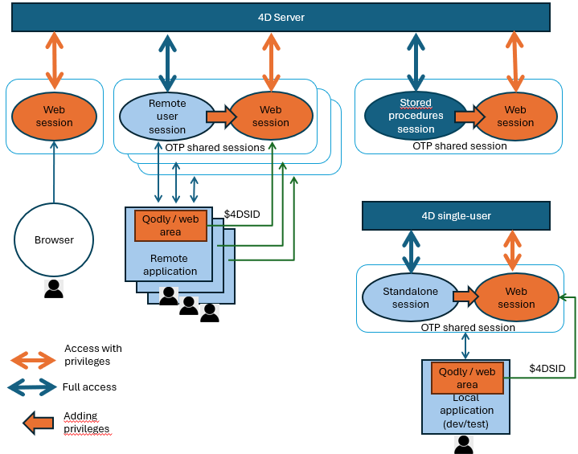

A **desktop session** is a user-related execution context on 4D Server or 4D single-user that does not result from any web or REST access.

Just like in a [**web user session**](../WebServer/sessions.md), the code executed in a desktop session has access to a [`Session`](../API/SessionClass.md) object which provides functions and properties allowing you to store session values and to share them between user processes, for example using the [`session.storage`](../API/SessionClass.md#storage) object.

However, unlike the code executed in web user sessions, the code executed in desktop sessions is not controlled by [roles and privileges](../ORDA/privileges.md). It can access any parts of the 4D application, including ORDA and data model classes. On 4D Server, [users and groups feature](../Users/handling_users_groups.md) can manage user accesses.

You can nevertheless [**share** a desktop session with a web session](#sharing-a-desktop-session-for-web-accesses) so that a desktop user can access your 4D application through a web interface, using for example Qodly pages and Web areas.

## Types de sessions

Desktop sessions include:

- **Remote user sessions**: In client/server applications, the session that manages the user processes on the server.
- **Stored procedures sessions**: In client/server applications, the unique virtual user session that manages all stored procedures executed on the server.
- **Standalone sessions**: Local session object returned in single-user application (useful in development and test phases of client/server applications).

:::note

Keep in mind that [**Web sessions**](../WebServer/sessions.md) are used as soon as the 4D project is accessed through web or REST requests and [scalable sessions](../WebServer/sessions.md#enabling-web-sessions) are enabled.

:::

The following diagram shows the different session types and how they interact:



## Sessions utilisateur distant

On the server, in "user processes" (i.e. processes related to remote users), the [`Session`](../commands/session.md) command returns a `session` object describing the current user session. Cet objet est géré via les fonctions et les propriétés de la classe [`Session`](../API/SessionClass.md).

:::note

On a remote 4D, the `session` object always returns null.

:::

:::tip Articles de blog sur le sujet

[Objet session distante 4D avec connexion Client/Serveur et procédure stockée](https://blog.4d.com/new-4D-remote-session-object-with-client-server-connection-and-stored-procedure).

:::

### Utilisation

L'objet `session` vous permet de gérer les informations et les privilèges de la session de l'utilisateur distant.

Vous pouvez partager des données entre tous les process de la session utilisateur en utilisant l'objet partagé [`session.storage`](../API/SessionClass.md#storage). Par exemple, vous pouvez lancer une procédure d'authentification et de vérification de l'utilisateur lorsqu'un client se connecte au serveur, impliquant la saisie d'un code envoyé par e-mail ou SMS dans l'application. Ensuite, vous ajoutez les informations de l'utilisateur au storage de session, ce qui permet au serveur d'identifier l'utilisateur. De cette façon, le serveur 4D peut accéder aux informations de l'utilisateur pour tous les process clients, permettant l'écriture de code personnalisé en fonction du rôle de l'utilisateur.

Vous pouvez également attribuer des privilèges à une session d'utilisateur distant pour contrôler l'accès lorsque la session provient de pages Qodly exécutées dans des zones Web.

### Disponibilité

L'objet `session` de l'utilisateur distant est disponible depuis :

- Les méthodes projet qui ont l'attribut [Exécuter sur serveur](../Project/code-overview.md#execute-on-server) (elles sont exécutées dans le process jumeau du process client),
- Les Triggers,
- ORDA [data model functions](../ORDA/ordaClasses.md) (except those declared with the [`local`](../ORDA/ordaClasses.md#local-functions) keyword),
- Database methods such as [`On Server Open Connection`](../commands/on-server-open-connection-database-method) and [`On Server Close Connection`](../commands/on-server-close-connection-database-method).

## Stored procedure sessions

On the server, all [stored procedures](https://doc.4d.com/4Dv20/4D/20/Stored-Procedures.300-6330553.en.html) share the same virtual user session.

### Utilisation

You can share data between all processes of a store procedure session using the [`session.storage`](../API/SessionClass.md#storage) shared object.

### Disponibilité

The `session` object of stored procedures is available from:

- Project methods that are called by the [`Execute on Server`](../commands-legacy/execute-on-server.md) command,
- ORDA [data model functions](../ORDA/ordaClasses.md) called from a stored procedure,
- Database methods such as [`On Server Startup`](../commands/on-server-startup-database-method) and [`On Server Shutdown`](../commands/on-server-shutdown-database-method).

## Standalone sessions

A standalone session is the single-user session running when you work locally with 4D.

### Utilisation

The standalone session can be used to develop and test your client/server application and its interaction with web sessions and [OTP sharing](#sharing-a-desktop-session-for-web-accesses). You can use the `session` object in your code in standalone session just as the `session` object of the remote sessions.

### Disponibilité

The `session` object of a standalone is available from all methods and code executed on the 4D application.

## Sharing a desktop session for web accesses

Desktop sessions can be used to handle web accesses to the application by the same user and thus, manage their [privileges](../ORDA/privileges.md). This possibility is particularly useful for Client/Server applications where [Qodly pages](https://developer.4d.com/qodly/4DQodlyPro/pageLoaders/pageLoaderOverview) are used for the interface, running on remote machines. Avec cette configuration, vos applications disposent d'interfaces web modernes basées sur les CSS, tout en bénéficiant de la puissance et de la simplicité du développement intégré client/serveur. Dans ces applications, les pages Qodly sont exécutées dans des [zones Web](../FormObjects/webArea_overview.md) 4D standard.

To manage this configuration in production, you need to use remote user sessions. Actually, requests coming from both the remote 4D application and its Qodly pages loaded in Web areas need to work inside the same session. You just have to share the session between the remote client and its web pages so that you can have the same [session storage](../API/SessionClass.md#storage) and client license, wherever the request comes from (web or remote 4D).

Note that [privileges](../ORDA/privileges.md) should be set in the session before executing a web request, so that the user automatically gets their privileges for web access (see example). Keep in mind that privileges **only apply to requests coming from the web**.

You can develop this configuration in your 4D Developer application (single-user): you can use the [standalone session](#standalone-sessions) to code and test all features related to web access, whether your application is intended for single-user or client/server deployment.

Les sessions partagées sont gérées par des [tokens OTP](../WebServer/sessions.md#session-token-otp). After you created an OTP token for the desktop session on the server or on the single-user 4D application, you add the token (through the `$4DSID` parameter value) to web requests sent from Web areas containing Qodly pages (or from any web browser) so that the user session on the server or the single-user application is identified and shared. Du côté du serveur web, si une requête web contient un *id OTP* dans le paramètre $4DSID, la session correspondant à ce token OTP est utilisée.

:::note

When creating an OTP token in client/server environment, you need to execute the [OTP creation code](../API/SessionClass.md#createotp) **on the server** (the `Session` object is Null on a remote 4D). You can use for example the [`On Server Open Connection`](../commands-legacy/on-server-open-connection-database-method.md) database method.

:::

:::tip Article(s) de blog sur le sujet

[Embed Qodly pages in a 4D web area without extra cost](https://blog.4d.com/embed-qodly-pages-in-a-4d-web-area-without-extra-cost)

:::

### Exemple

In a form, get an OTP and open a Qodly page in a Web area:

```4d
Form.otp:=getOTP

Form.url:="http://localhost/$lib/renderer/?w=Products&$4DSID="+Form.otp

WA OPEN URL(*; "QodlyPage"; Form.url)

```

The *getOTP* project method (with the [**Execute on server** property](../Project/project-method-properties.md#execute-on-server) in Client/Server):

```4d
// In Client Server:
// ----------------
// Method executed on the server because the session object is on the server
// The Session object is Null on the client 
//

#DECLARE() : Text

return Session.createOTP()

```

Here is the code used to put the "viewProducts" privilege in the session:

```4d
// In Client Server:
// ----------------
// This code must be executed on the server because the session object is on the server
// The Session object is Null on the client 

Session.clearPrivileges() // Clean the session from its old privileges
Session.setPrivileges("viewProducts")
```

