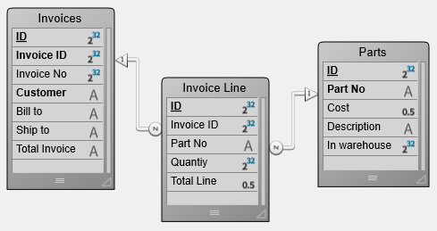
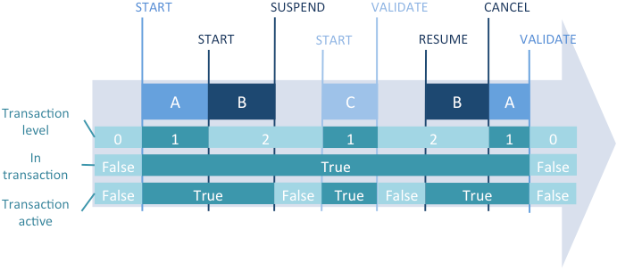

## Description

Les transactions sont une série de modifications effectuées à l'intérieur d'un process sur des données reliées entre elles. Une transaction n'est sauvegardée de façon définitive dans la base que si la transaction est validée. Si une transaction n'est pas complétée, parce qu'elle est annulée ou en raison d'un quelconque événement extérieur, les modifications ne sont pas sauvegardées.

Pendant une transaction, toutes les modifications effectuées sur les données de la base dans le process sont stockées localement dans un buffer temporaire. Si la transaction est acceptée avec [`VALIDATE TRANSACTION`](../commands-legacy/validate-transaction.md) ou [`validateTransaction()`](../API/DataStoreClass.md#validatetransaction), les changements sont sauvegardés de façon définitive. Si la transaction est annulée avec [`CANCEL TRANSACTION`](../commands-legacy/cancel-transaction.md) ou [`cancelTransaction()`](../API/DataStoreClass.md#canceltransaction), les changements ne sont pas sauvegardés. Dans tous les cas, ni la sélection courante ni l'enregistrement courant ne sont modifiés par les commandes de gestion des transactions.

4D prend en charge les transactions imbriquées, c'est-à-dire les transactions sur plusieurs niveaux hiérarchiques. Le nombre de sous-transactions autorisées est illimité. La commande [`Transaction level`](../commands-legacy/transaction-level.md) permet de connaître le niveau courant de transaction dans lequel le code est exécuté. Lorsque vous utilisez des transactions imbriquées, le résultat de chaque sous-transaction dépend de la validation ou de l'annulation de la transaction du niveau supérieur. Si la transaction supérieure est validée, les résultats des sous-transactions sont entérinés (validation ou annulation). En revanche, si la transaction supérieure est annulée, toutes les sous-transactions sont annulées, quels que soient leurs sous-résultats.


4D inclut une fonctionnalité vous permettant de [suspendre temporairement et de réactiver des transactions](#suspending-transactions) dans votre code 4D. Lorsqu'une transaction est suspendue, vous pouvez exécuter des opérations indépendantes de la transaction elle-même puis la réactiver afin de la valider ou de l'annuler, de façon classique. 

### Exemple

L'exemple de cette section s'appuie sur la structure présentée ci-dessous. C'est une base relativement simple de facturation. Les lignes de factures sont stockées dans une table appelée [Invoice Lines], qui est reliée à la table [Invoices] par une relation entre les champs [Invoices]Invoice ID et [Invoice Lines]Invoice ID. Lorsqu'une facture est ajoutée, un numéro unique est calculé avec la commande [`Sequence number`](../commands-legacy/sequence-number.md). Le lien entre [Invoices] et [Invoice Lines] est du type aller-retour automatique. L'option "Mise à jour auto dans les sous-formulaires" est cochée. La lien entre [Invoice Lines] et [Parts] est manuel.





Quand un utilisateur saisit une facture, les actions suivantes doivent être exécutées :

Ajouter un enregistrement dans la table [Invoices].
Ajouter plusieurs enregistrements dans la table [Invoice Lines].
Mettre à jour le champ [Parts]In Warehouse pour chaque pièce figurant sur la facture.

En d'autres termes, vous devez sauvegarder les données liées. C'est la situation type où vous devez utiliser une transaction. Vous pourrez ainsi être certain de pouvoir soit sauvegarder tous ces enregistrements pendant l'opération, soit annuler la transaction si un enregistrement ne peut être ajouté ou mis à jour.

Si vous n'utilisez pas une transaction, vous ne pouvez pas garantir l'intégrité logique des données de votre base. Par exemple, si un enregistrement parmi ceux de la table [Parts] est verrouillé, vous ne pourrez pas mettre à jour la quantité stockée dans le champ [Parts]In Warehouse. Ce champ sera alors logiquement incorrect. La somme des pièces vendues et restantes dans l'entrepôt ne sera pas égale à la quantité d'origine saisie dans l'enregistrement. Vous pouvez éviter cette situation en utilisant les transactions.

Il y a plusieurs façons d'effectuer une saisie sous transaction :

1. Vous pouvez gérer les transactions en utilisant les commandes de transaction [`START TRANSACTION`](../commands-legacy/start-transaction.md), [`VALIDATE TRANSACTION`](../commands-legacy/validate-transaction.md) et [`CANCEL TRANSACTION`](../commands-legacy/cancel-transaction.md). Vous pouvez par exemple écrire :

```4d
 READ WRITE([Invoice Lines])
 READ WRITE([Parts])
 FORM SET INPUT([Invoices];"Input")
 Repeat
    START TRANSACTION
    ADD RECORD([Invoices])
    If(OK=1)
       VALIDATE TRANSACTION
    Else
       CANCEL TRANSACTION
    End if
 Until(OK=0)
 READ ONLY(*)
```

2. Pour réduire les verrouillages des enregistrements pendant la saisie de données, vous pouvez aussi choisir de gérer les transactions à partir de la méthode du formulaire et d'accéder aux tables en LECTURE ECRITURE uniquement quand cela est nécessaire.
Vous effectuez la saisie de données en utilisant le formulaire de saisie pour [Invoices], qui contient la table liée [Invoice Lines] dans un sous-formulaire. Le formulaire comporte deux boutons : *bAnnuler* et *bOK*. Aucune action ne leur est attribuée.

La boucle d'ajout devient alors :


```4d
 READ WRITE([Invoice Lines])
 READ ONLY([Parts])
 FORM SET INPUT([Invoices];"Input")
 Repeat
    ADD RECORD([Invoices])
 Until(bOK=0)
 READ ONLY([Invoice Lines])
```

Notez que la table [Parts] est désormais en "lecture seulement" pendant la saisie de données. L'accès en lecture/écriture ne s'active que si les données sont validées.

La transaction est ouverte dans la méthode du formulaire entrée de la table [Invoices] :


```4d
 Case of
    :(Form event code=On Load)
       START TRANSACTION
       [Invoices]Invoice ID:=Sequence number([Invoices]Invoice ID)
    Else
       [Invoices]Total Invoice:=Sum([Invoice Lines]Total line)
 End case
```

Si vous cliquez sur le bouton *bAnnuler*, la saisie et la transaction doivent être annulées. Voici la méthode objet du bouton *bAnnuler* :

```4d
 Case of
    :(Form event code=On Clicked)
       CANCEL TRANSACTION
       CANCEL
 End case
```

Si vous cliquez sur le bouton *bOK*, la saisie et la transaction doivent être acceptées. Voici la méthode objet du bouton *bOK* :


```4d
 Case of
    :(Form event code=On Clicked)
       var $NbLines:=Records in selection([Invoice Lines])
       READ WRITE([Parts]) //Passer en lecture/écriture pour accéder à la table [Parts]
       FIRST RECORD([Invoice Lines]) //Commencer à la première ligne
       var $ValidTrans:=True //Tout devrait marcher
       var $Line : Integer
       For($Line;1;$NbLines) //Pour chaque ligne
          RELATE ONE([Invoice Lines]Part No)
          OK:=1 //Vous voulez continuer
          While(Locked([Parts]) & (OK=1)) 
          //Essayer d'obtenir l'enregistrement en lecture/écriture
             CONFIRM("The Part "+[Invoice Lines]Part No+" is in use. Wait?")
             If(OK=1)
                DELAY PROCESS(Current process;60)
                LOAD RECORD([Parts])
             End if
          End while
          If(OK=1)
               //Mettre à jour quantité dans l'entrepôt
             [Parts]In Warehouse:=[Parts]In Warehouse-[Invoice Lines]Quantity
             SAVE RECORD([Parts]) //Sauvegarder l'enregistrement
          Else
             $Line:=$NbLines+1 //Sortir de la boucle
             $ValidTrans:=False
          End if
          NEXT RECORD([Invoice Lines]) //Aller à la ligne suivante
       End for
       READ ONLY([Parts]) //Mettre la table en mode lecture seulement
       If($ValidTrans)
          SAVE RECORD([Invoices]) //Sauvegarder les enregistrements
          VALIDATE TRANSACTION //Valider toutes les modifications de la base
       Else
          CANCEL TRANSACTION //Tout annuler
       End if
       CANCEL //Quitter le formulaire
 End case
```

Dans le code ci-dessus, quel que soit le bouton sur lequel l'utilisateur a cliqué, nous appelons la commande `CANCEL`. Le nouvel enregistrement n'est pas validé par un appel à [`ACCEPT`](../commands-legacy/accept.md) mais par [`SAVE RECORD`](../commands-legacy/save-record.md). De plus, vous remarquez que [`SAVE RECORD`](../commands-legacy/save-record.md) est appelée juste avant la commande [`VALIDATE TRANSACTION`](../commands-legacy/validate-transaction.md). Ainsi, la sauvegarde de l'enregistrement [Invoices] est partie intégrante de la transaction. Appeler la commande [`ACCEPT`](../commands-legacy/accept.md) validerait aussi l'enregistrement mais dans ce cas, la transaction serait validée avant le stockage de la facture. Autrement dit, l'enregistrement serait sauvegardé en-dehors de la transaction.

En fonction de vos besoins, personnalisez votre base à votre convenance, comme dans les exemples précédents. Dans le dernier exemple, la gestion du verrouillage des enregistrements de la table [Parts] pourrait être plus élaborée.


## Suspendre des transactions

### Principe  

Suspendre une transaction est utile notamment lorsque vous devez, depuis une transaction, lancer certaines opérations qui n'ont pas besoin d'être effectuées sous le contrôle de cette transaction. Par exemple, imaginez le cas d'un client qui passe une commande, donc via une transaction, et qui en profite pour mettre à jour son adresse postale. Finalement, le client se ravise et annule sa commande. La transaction est annulée, mais pour autant vous ne souhaitez pas que la mise à jour de l'adresse le soit également. Ce cas peut typiquement être géré via la suspension de la transaction. Trois commandes permettent de gérer la suspension et la réactivation des transactions :

- [`SUSPEND TRANSACTION`](../commands-legacy/suspend-transaction.md): suspend la transaction courante. Tous les enregistrements en cours de mise à jour ou de création restent verrouillés.
- [`RESUME TRANSACTION`](../commands-legacy/resume-transaction.md): réactive une transaction suspendue, le cas échéant.
- [`Active transaction`](../commands-legacy/active-transaction.md): retourne Faux si la transaction courante est suspendue ou s'il n'y a pas de transaction courante, et Vrai si elle est démarrée ou réactivée.

### Exemple  

Cet exemple présente un cas typique où la suspension d'une transaction est utile. Dans une base de facturation (Invoices), nous voulons obtenir un nouveau numéro de facture durant une transaction. Ce numéro est calculé et stocké dans une table [Settings]. Dans un environnement multi-utilisateur, les accès doivent être protégés ; cependant, à cause de la transaction, la table [Settings] pourrait être verrouillée par un autre utilisateur alors même que ses données ne dépendent pas de la transaction principale. Dans ce cas, vous pouvez suspendre la transaction pour l'accès à la table.


```4d
  //Méthode standard qui crée une facture
 START TRANSACTION
 ...
 CREATE RECORD([Invoices])
 //appel de la méthode pour obtenir un numéro disponible
 [Invoices]InvoiceID:=GetInvoiceNum 
 ...
 SAVE RECORD([Invoices])
 VALIDATE TRANSACTION

 ```

La méthode *GetInvoiceNum* suspend la transaction avant de s'exécuter. A noter que ce code fonctionnera même si la méthode est appelée en-dehors de toute transaction :

```4d
  //GetInvoiceNum project method
  //GetInvoiceNum -> Next available invoice number
 #DECLARE -> $freeNum : Integer
 SUSPEND TRANSACTION
 ALL RECORDS([Settings])
 If(Locked([Settings])) //accès multi-utilisateur
    While(Locked([Settings]))
       MESSAGE("Waiting for locked Settings record")
       DELAY PROCESS(Current process;30)
       LOAD RECORD([Settings])
    End while
 End if
 [Settings]InvoiceNum:=[Settings]InvoiceNum+1
 $freeNum:=[Settings]InvoiceNum
 SAVE RECORD([Settings])
 UNLOAD RECORD([Settings])
 RESUME TRANSACTION

```

### Détail du fonctionnement

#### Que se passe-t-il quand une transaction est suspendue ?  

Lorsqu'une transaction est suspendue, les principes de fonctionnement suivants s'appliquent :

- Vous pouvez accéder aux enregistrements qui ont été ajoutés ou modifiés durant la transaction, et vous ne pouvez pas accéder aux enregistrements qui ont été supprimés durant la transaction.
- Vous pouvez créer, sauvegarder, supprimer ou modifier des enregistrements en-dehors de la transaction.
- Vous pouvez démarrer une nouvelle transaction, mais à l'intérieur de cette transaction incluse, vous ne pourrez pas voir les enregistrements ou les valeurs d'enregistrements qui auront été modifié(s) ou ajouté(e)s dans la transaction suspendue. En fait, cette nouvelle transaction est totalement indépendante de celle qui a été suspendue, comme s'il s'agissait d'une transaction dans un autre process, et puisque la transaction suspendue pourra être par la suite validée ou annulée, tout enregistrement modifié ou annulé est automatiquement masqué pour la nouvelle transaction. Dès que vous validerez ou annulerez cette nouvelle transaction, vous pourrez à nouveau accéder à ces enregistrements. 
- Tous les enregistrements modifiés, supprimés ou ajoutés à l'intérieur de la transaction suspendue restent verrouillés pour les autres process. If vous tentez de modifier ou de supprimer ces enregistrements hors de la transaction ou dans une autre transaction, une erreur est générée.

Ces principes sont résumés dans le schéma suivant :


*Les valeurs modifiées durant la transaction A (enregistrement ID1 prend la valeur Val11) ne sont pas disponibles dans une nouvelle transaction (B) créée pendant la période de suspension. Les valeurs modifiées durant la période de suspension (enregistrement ID2 prend la valeur Val22 et enregistrement ID3 prend la valeur Val33) sont sauvegardées même après que la transaction A a été annulée.*

Des fonctionnalités spécifiques ont été ajoutées pour prendre en charge les erreurs :

- L'enregistrement courant de chaque table devient temporairement verrouillé s'il est modifié pendant la transaction et est automatiquement déverrouillé lorsque la transaction est réactivée. Ce mécanisme est important pour empêcher que des parties de la transaction soient sauvegardées de manière impromptue.
- Si vous exécutez une séquence invalide telle que *start transaction / suspend transaction / start transaction / resume transaction*, une erreur est générée. Ce mécanisme prévient tout éventuel oubli de valider ou d'annuler des sous-transactions incluses avant de réactiver une transaction suspendue.


#### Transactions suspendues et statut du process 

La commande [`In transaction`](../commands-legacy/in-transaction.md) retourne Vrai dès qu'une transaction a été démarrée, même si elle a été suspendue. Pour savoir si la transaction courante a été suspendue, vous devez utiliser la commande [`Active transaction`](../commands-legacy/active-transaction.md) qui retourne Faux dans ce cas. 

Ces deux commandes, cependant, retournent également Faux si aucune transaction n'a été démarrée. Vous pourrez alors avoir besoin d'utiliser la commande [`Transaction level`](../commands-legacy/transaction-level.md), qui retourne 0 dans ce contexte (pas de transaction démarrée).

Le schéma suivant illustre les différents contextes de transaction et les valeurs correspondantes retournées par les commandes de transaction :




