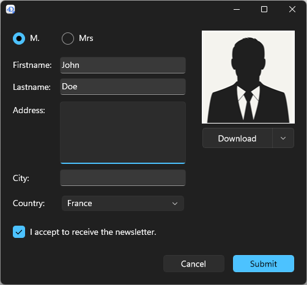
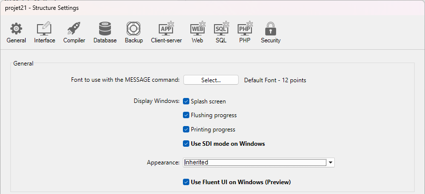
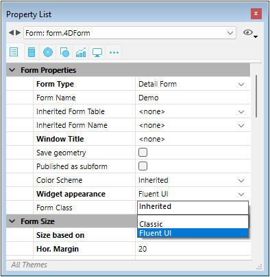

Les formulaires fournissent l'interface par laquelle les informations sont saisies, modifiées et imprimées dans une application de bureau. A l'aide des formulaires, les utilisateurs peuvent interagir avec les données d'une base de données et imprimer des rapports. Les formulaires permettent de créer des boîtes de dialogue personnalisées, des palettes ou toute fenêtre personnalisée.


Les formulaires peuvent également contenir d'autres formulaires grâce aux fonctionnalités suivantes :

- [objets de sous-formulaire](FormObjects/subform_overview.md)
- [formulaires hérités](./properties_FormProperties.md#inherited-form-name)

## Création de formulaires

Vous pouvez ajouter ou modifier des formulaires 4D à l'aide des éléments suivants :

- **L'interface 4D Developer :** Créez de nouveaux formulaires à partir du menu **Fichier** ou de la fenêtre de l' **Explorateur**.
- **L'éditeur de formulaires **: Modifiez vos formulaires à l'aide de l'**[éditeur de formulaires](FormEditor/formEditor.md)**.
- **Le code JSON :** Créez et concevez vos formulaires à l'aide de JSON et enregistrez les fichiers de formulaire à [l'emplacement approprié](Project/architecture#sources). Voici un exemple :

```
{
    "windowTitle": "Hello World",
    "windowMinWidth": 220,
    "windowMinHeight": 80,
    "method": "HWexample",
    "pages": [
        null,
        {
            "objects": {
                "text": {
                "type": "text",
                "text": "Hello World!",
                "textAlign": "center",
                "left": 50,
                "top": 120,
                "width": 120,
                "height": 80
                },
                "image": {
                "type": "picture",
                "pictureFormat": "scaled",
                "picture": "/RESOURCES/Images/HW.png",
                "alignment":"center", 
                "left": 70,
                "top": 20, 
                "width":75, 
                "height":75        
                },
                "button": {
                "type": "button",
                "text": "OK",
                "action": "Cancel",
                "left": 60,
                "top": 160,


                "width": 100,
                "height": 20
                }
            }
        }
    ]
}
```

## Formulaire projet et formulaire table

Il existe deux catégories de formulaires :

- **Les formulaires projet** - Formulaires indépendants qui ne sont rattachés à aucune table. Ils sont destinés plus particulièrement à la création de boîtes de dialogue d'interface et de composants. Les formulaires projet peuvent être utilisés pour créer des interfaces facilement conformes aux normes du système d'exploitation.

- **Les formulaires table** - Rattachés à des tables spécifiques et bénéficient ainsi de fonctions automatiques utiles pour développer des applications basées sur des bases de données. En règle générale, une table possède des formulaires d'entrée et de sortie séparés.

En règle générale, vous sélectionnez la catégorie de formulaire lorsque vous créez le formulaire, mais vous pouvez la modifier par la suite.

## Pages formulaire

Chaque formulaire est composé d'au moins deux pages :

- une page 1 : une page principale, affichée par défaut
- une page 0 : une page de fond, dont le contenu est affiché sur une page sur deux.

Vous pouvez créer plusieurs pages pour un formulaire d'entrée. Si le nombre de champs ou de variables est supérieur au nombre maximal supporté sur un écran, vous pouvez créer des pages supplémentaires pour les afficher. Plusieurs pages vous permettent d'effectuer les opérations suivantes :

- Placez les informations les plus importantes sur la première page et les informations les moins importantes sur les autres pages.
- Organisez chaque sujet sur sa propre page.
- Réduir ou éliminer le défilement pendant la saisie des données en définissant [l'ordre de saisie](formEditor.md#data-entry-order).
- Prévoyez de l'espace autour des éléments du formulaire pour un design d'écran attrayant.

Les pages multiples sont utiles uniquement pour les formulaires d'entrée. Elles ne sont pas destinées à être imprimées. Lorsqu'un formulaire de plusieurs pages est imprimé, seule la première page est imprimée.

Il n'y a aucune restriction sur le nombre de pages qu'un formulaire peut contenir. Le même champ peut apparaître en un nombre de fois illimité dans un formulaire et sur autant de pages que vous le souhaitez. Toutefois, plus vous aurez de pages dans un formulaire, plus il sera long à afficher.

Un formulaire multi-pages contient à la fois une page d'arrière-plan et plusieurs pages d'affichage. Les objets placés sur la page d'arrière-plan peuvent être visibles sur toutes les pages d'affichage, mais il ne peuvent être sélectionnés et modifiés que sur la page d'arrière-plan. Dans les formulaires multi-pages, vous devez placer votre palette de boutons sur la page d'arrière-plan. Vous devez également inclure un ou plusieurs objets sur la page d'arrière-plan qui fournissent à l'utilisateur des outils de navigation de page.

## Rendu Fluent UI (Developer Preview)

Sous Windows, 4D prend en charge le rendu de formulaire **Fluent UI**, l'interface utilisateur graphique moderne de Microsoft, basée sur la technologie **WinUI 3**. **WinUI 3** est la base du Windows App SDK et représente les prochaines interfaces graphiques de Windows.

| Light theme                             | Dark theme                                   |
| --------------------------------------- | -------------------------------------------- |
|  |  |

:::caution Developer Preview

La prise en charge de Fluent UI est actuellement en phase d'aperçu pour les développeurs. Il ne doit pas être utilisé en production.

:::

:::info macOS

Cette fonctionnalité ne peut être utilisée que sous Windows. Sous macOS, elle est ignorée.

:::

### Disponibilité du rendu Fluent UI

Le rendu Fluent UI est disponible dans les environnements d'exécution suivants uniquement :

- Windows avec la version 1.7.3 du [Windows App SDK](https://learn.microsoft.com/en-us/windows/apps/windows-app-sdk/downloads) installée (vous devez installer ce SDK sur toute machine Windows affichant vos formulaires).
- Application 4D fusionnée [autonome](../Desktop/building.md#build-stand-alone-application) ou [cliente](../Desktop/building.md#build-client-application)
- [Fonction **Tester l'application**](../Menus/bars.md#previewing-menu-bars) disponible dans le menu **Exécution**.

:::note

Si le Windows App SDK n'est pas correctement installé, 4D utilisera le rendu classique pour vos formulaires sans erreur.

:::

### Activer le rendu Fluent UI

Vous pouvez activer le mode de rendu Fluent UI au niveau de l'application ou au niveau du formulaire. Le paramétrage du formulaire a la priorité par rapport aux paramètres de l'application.

#### Paramètres de l'application

Cochez l'option **Utiliser Fluent UI sous Windows** dans la page "Interface" de la boîte de dialogue des Propriétés.



Dans ce cas, le mode de rendu Fluent UI sera utilisé par défaut sur Windows pour tous les formulaires.

#### Paramètres du formulaire

Chaque formulaire peut définir son propre rendu via la propriété **Apparence des contrôles**. Les options suivantes sont disponibles :

- **Hérité** : hérite des propriétés globales de l'application (par défaut),
- **Classic** : utilise le style classique de Windows,
- **Fluent UI** : active le rendu moderne basé sur Fluent UI. <br/>
  

La [propriété de formulaire JSON](./properties_JSONref.md) correspondante est `fluentUI` avec la valeur undefined (i.e. hérité, valeur par défaut), "true" ou "false".

### Caractéristiques et limitations

Le rendu Fluent UI offre des contrôles modernes et agréables, la prise en charge des thèmes système dark/light, un rendu plus fluide optimisé pour les écrans haute résolution et une expérience utilisateur cohérente alignée sur les applications Microsoft récentes.

Lorsque vous utilisez les formulaires 4D avec le rendu Fluent UI, vous devez prêter attention aux points suivants :

- La commande `FORM Window theme` renvoie le thème d'affichage réel du formulaire courant. Valeurs possibles : "Classic" ou "FluentUI". S'il n'y a pas de formulaire courant ou si la commande est appelée sous macOS, une chaîne vide est renvoyée.
- Si [`GET STYLE SHEET INFO`](../commands-legacy/get-style-sheet-info.md) est appelée dans le contexte d'un formulaire, les informations renvoyées concernent l'apparence courante du formulaire (Classic ou FluentUI). Si la commande est appelée en dehors du contexte d'un formulaire, les informations renvoyées concernent les [propriétés globales du projet](#application-setting).
- [`SET MENU ITEM STYLE`](../commands-legacy/set-menu-item-style.md) avec le paramètre *itemStyle* `Underline` n'est pas pris en charge (ignoré) pour les menus pop up.
- Un rectangle de focus peut être ajouté aux [zones de saisie](../FormObjects/input_overview.md) image et texte.
- L'objet de formulaire [Stepper](../FormObjects/stepper.md) ne prend pas en charge l'événement [double-clic](../Events/onDoubleClicked.md).
- Les [boutons circulaires](../FormObjects/button_overview.md#circle) sont pris en charge (comme sur macOS).
- Les commandes [`WA ZOOM IN`](../commands-legacy/wa-zoom-in.md) / [`WA ZOOM OUT`](../commands-legacy/wa-zoom-out.md) ne sont pas prises en charge dans les zones Web avec moteur de rendu système.

## Formulaires hérités

Les formulaires 4D peuvent utiliser et être utilisés comme «formulaires hérités», ce qui signifie que tous les objets du *Formulaire A* peuvent être utilisés dans le *Formulaire B*. Dans ce cas, *Formulaire B* "hérite" des objets du *Formulaire A*.

Les références à un formulaire hérité est toujours active : si un élément d'un formulaire hérité est modifié (par exemple le style des boutons), tous les formulaires qui l’utilisent seront automatiquement modifiés.

Tous les formulaires (formulaires table et formulaires projet) peuvent être désignés comme un formulaire hérité. Cependant, les éléments qu'ils contiennent doivent être compatibles avec une utilisation dans différentes tables de base de données.

A l’exécution du formulaire, les objets sont chargés et combinés dans l’ordre suivant :

1. Page zéro du formulaire hérité
2. Page 1 du formulaire hérité
3. Page zéro du formulaire ouvert
4. Page courante du formulaire ouvert.

Cet ordre détermine [l'ordre de saisie](formEditor.md#data-entry-order) par défaut des objets dans le formulaire.

> Seules les pages 0 et 1 du formulaire hérité peuvent apparaître dans les autres formulaires.

Les propriétés ainsi que la méthode d’un formulaire ne sont pas prises en compte lorsque celui-ci est utilisé comme formulaire hérité. En revanche, les méthodes des objets qu’il contient sont appelées.

Pour définir un formulaire hérité, les propriétés [Nom du formulaire hérité](properties_FormProperties.md#inherited-form-name) et [Table du formulaire hérité](properties_FormProperties.md#inherited-form-table) (pour un formulaire table) doivent être définies dans le formulaire qui héritera de quelque chose d'un autre formulaire.

Un formulaire peut hériter d'un formulaire projet, en configurant la propriété [Table du formulaire hérité](properties_FormProperties.md#inherited-form-table) sur `\<aucun>` dans la liste des propriétés (ou " " dans JSON).

Pour stopper l’héritage d’un formulaire, choisissez l’option `\<aucun>` dans la Liste des propriétés (ou " " dans JSON) pour la propriété [Nom du formulaire hérité](properties_FormProperties.md#inherited-form-name).

> Il est possible de définir un formulaire hérité dans un formulaire qui servira à son tour de formulaire hérité pour un troisième formulaire. La combinaison des objets s’effectue alors de manière récursive. 4D détecte les boucles récursives (par exemple si le formulaire [table1]form1 est défini comme formulaire hérité de [table1]form1, c’est-à-dire de lui-même) et interrompt le chaînage des formulaires.

## Propriétés prises en charge

[Barre de menu associée](properties_Menu.md#associated-menu-bar) - [Hauteur fixe](properties_WindowSize.md#fixed-height) - [Largeur fixe](properties_WindowSize.md#fixed-width) - [Saut de formulaire](properties_Markers.md#form-break) - [Détail du formulaire](properties_Markers.md#form-detail) - [Pied de formulaire](properties_Markers.md#form-footer) - [En-tête de formulaire](properties_Markers.md#form-header) - [Nom du formulaire](properties_FormProperties.md#form-name) - [Type de formulaire](properties_FormProperties.md#form-type) - [Nom du formulaire hérité](properties_FormProperties.md#inherited-form-name) - [Tableau de formulaire hérité](properties_FormProperties.md#inherited-form-table) - [Hauteur maximale](properties_WindowSize.md#maximum-height-minimum-height) - [Largeur maximale](properties_WindowSize.md#maximum-width-minimum-width) - [Méthode](properties_Action.md#method) - [Hauteur minimale](properties_WindowSize.md#maximum-height-minimum-height) - [Largeur minimale](properties_WindowSize.md#maximum-width-minimum-width) - [Pages](properties_FormProperties.md#pages) - [Paramètres d'impression](properties_Print.md#settings) - [Publié en tant que sous-formulaire](properties_FormProperties.md#published-as-subform) - [Enregistrer la géométrie](properties_FormProperties.md#save-geometry) - [Titre de la fenêtre](properties_FormProperties.md#window-title)
