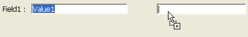

---

## Glissable

Contrôlez si l'utilisateur peut faire glisser l'objet et comment il peut le faire. Par défaut, aucune opération de glisser n'est autorisée.

Deux modes de glisser-déposer sont proposés dans 4D :

- Un mode **personnalisé**, dans lequel le glisser déclenche l'événement formulaire `Sur début glisser` dans le contexte de l'objet. <strong x-id="1">Custom</strong>: In this mode, any drag operation performed on the object triggers the <code>On Begin Drag</code> form event in the context of the object.  
  You then manage the drag action using a method. Ce mode vous permet de mettre en place des interfaces basées sur le glisser-déposer, y compris des interfaces qui ne déplacent pas nécessairement des données mais qui peuvent effectuer tout type d'action, telle que l'ouverture de fichiers ou le lancement d'un calcul. Ce mode est basé sur un ensemble de propriétés, d'événements et de commandes spécifiques à partir du thème `Conteneur de données`.
- Un mode **automatique**, dans lequel 4D **copie** du texte ou des images directement à partir de l'objet formulaire. Il peut alors être utilisé dans la même zone 4D, entre deux zones 4D, ou entre 4D et une autre application. Par exemple, le glisser-déposer automatique vous permet de copier une valeur entre deux champs sans utiliser de programmation :  
    
  
  Dans ce mode, l'événement de formulaire `On Begin Drag` n'est PAS généré. Si vous souhaitez "forcer" l'utilisation du glissement personnalisé alors que le glissement automatique est activé, maintenez la touche **Alt** (Windows) ou **Option** (macOS) enfoncée pendant l'action. Cette option n'est pas disponible pour les images.

Pour plus d'informations, reportez-vous à [Glisser-déposer](https://doc.4d.com/4Dv20/4D/20.6/Drag-and-Drop.300-7487471.en.html) dans le manuel *Langage 4D*.

#### Grammaire JSON

| Nom      | Type de données | Valeurs possibles                                                                                |
| -------- | --------------- | ------------------------------------------------------------------------------------------------ |
| dragging | text            | "none" (par défaut), "custom", "automatic" (hors list box) |

#### Objets pris en charge

[4D Write Pro areas](writeProArea_overview.md) - [Combo Box](comboBox_overview.md) - [Input](input_overview.md) - [Hierarchical List](list_overview.md) - [List Box](listbox_overview.md) - [Plug-in Area](pluginArea_overview.md)

#### Commandes

[OBJECT GET DRAG AND DROP OPTIONS](../commands-legacy/object-get-drag-and-drop-options.md) - [OBJECT SET DRAG AND DROP OPTIONS](../commands-legacy/object-set-drag-and-drop-options.md)

#### Voir également

[Droppable](#droppable)

---

## Déposable

Contrôlez si et comment l'objet peut être la destination d'une opération de glisser-déposer.

Deux modes de glisser-déposer sont proposés dans 4D :

- Un mode **personnalisé**, dans lequel le déposer déclenche les événements formulaire `Sur glisser` et `Sur déposer` dans le contexte de l'objet. Un mode <strong x-id="1">personnalisé</strong>, dans lequel le déposer déclenche les événements formulaire <code>Sur glisser</code> et <code>Sur déposer</code> dans le contexte de l'objet.  
  You then manage the drag action using a method. Ce mode vous permet de mettre en place des interfaces basées sur le glisser-déposer, y compris des interfaces qui ne déplacent pas nécessairement des données mais qui peuvent effectuer tout type d'action, telle que l'ouverture de fichiers ou le lancement d'un calcul. Ce mode est basé sur un ensemble de propriétés, d'événements et de commandes spécifiques à partir du thème `Conteneur de données`.
- Un mode **automatique**, dans lequel 4D gère automatiquement — si possible — l’insertion des données glissées de type texte ou image et déposées sur l’objet (les données sont collées dans l’objet). Les événements `Sur glisser` et `Sur déposer` ne sont pas générés. En revanche, les événements `Sur après modification` (lors du déposer) et `Sur données modifiées` (lorsque l'objet perd le focus) sont générés.

Pour plus d'informations, reportez-vous à [Glisser-déposer](https://doc.4d.com/4Dv20/4D/20.6/Drag-and-Drop.300-7487471.en.html) dans le manuel *Langage 4D*.

#### Grammaire JSON

| Nom      | Type de données | Valeurs possibles                                                                                |
| -------- | --------------- | ------------------------------------------------------------------------------------------------ |
| dropping | text            | "none" (par défaut), "custom", "automatic" (hors list box) |

#### Objets pris en charge

[4D Write Pro area](writeProArea_overview.md) - [Button](button_overview.md) - [Combo Box](comboBox_overview.md) - [Input](input_overview.md) - [Hierarchical List](list_overview.md) - [List Box](listbox_overview.md) - [Picture button](pictureButton_overview.md) - [Plug-in Area](pluginArea_overview.md)

#### Commandes

[OBJECT GET DRAG AND DROP OPTIONS](../commands-legacy/object-get-drag-and-drop-options.md) - [OBJECT SET DRAG AND DROP OPTIONS](../commands-legacy/object-set-drag-and-drop-options.md)

#### Voir également

[Draggable](#draggable)

---

## Exécuter méthode objet

Lorsque cette option est activée, la méthode objet est exécutée avec l'événement `On Data Change` *au moment où* l'utilisateur change la valeur de l'indicateur. Lorsque l'option est désactivée, la méthode est exécutée *après* la modification.

#### Grammaire JSON

| Nom                 | Type de données | Valeurs possibles |
| ------------------- | --------------- | ----------------- |
| continuousExecution | boolean         | true, false       |

#### Objets pris en charge

[Indicateur de progression](progressIndicator.md) - [Règle](ruler.md) - [Stepper](stepper.md)

---

## Méthode

Référence d'une méthode attachée à l'objet. Les méthodes d'objet "gèrent" généralement l'objet pendant que le formulaire est affiché ou imprimé. Vous n'appelez pas de méthode objet - 4D l'appelle automatiquement lorsqu'un événement implique l'objet auquel la méthode objet est rattachée.

Plusieurs types de références de méthode sont pris en charge :

- un chemin de fichier de méthode objet standard, c'est-à-dire qui utilise le modèle suivant :  
  `ObjectMethods/objectName.4dm`  
  ... où `objectName` est le véritable [nom de l'objet](properties_Object.md#object-name). Ce type de référence indique que le fichier de méthode se trouve à l'emplacement par défaut ("sources/forms/*formName*/ObjectMethods/"). Dans ce cas, 4D gère automatiquement la méthode objet lorsque des opérations sont exécutées sur l'objet formulaire (renommage, duplication, copier/coller, etc.)

- un nom de méthode projet : nom d'une méthode projet existante sans extension de fichier, par exemple :
  `myMethod`
  Dans ce cas, 4D ne fournit pas de support automatique pour les opérations sur les objets.

- un chemin de fichier de méthode personnalisé comprenant l'extension .4dm, par exemple :  
  `../../CustomMethods/myMethod.4dm`
  Vous pouvez également utiliser un filesystem :  
  `/RESOURCES/Buttons/bOK.4dm`
  Dans ce cas, 4D ne fournit pas de support automatique pour les opérations sur les objets.

#### Grammaire JSON

| Nom    | Type de données | Valeurs possibles                                                                          |
| ------ | --------------- | ------------------------------------------------------------------------------------------ |
| method | text            | Chemin de fichier standard ou personnalisé de la méthode objet ou nom de la méthode projet |

#### Objets pris en charge

[4D View Pro Area](viewProArea_overview.md) - [4D Write Pro Area](writeProArea_overview.md) - [Button](button_overview.md) - [Button Grid](buttonGrid_overview.md) - [Check Box](checkbox_overview.md) - [Combo Box](comboBox_overview.md) - [Dropdown list](dropdownList_Overview.md) - [Forms](FormEditor/forms.md) - [Hierarchical List](list_overview.md) - [Input](input_overview.md) - [List Box](listbox_overview.md) - [List Box Column](listbox_overview.md#list-box-columns) - [Picture Button](pictureButton_overview.md) - [Picture Pop up menu](picturePopupMenu_overview.md) - [Plug-in Area](pluginArea_overview.md) - [Progress Indicators](progressIndicator.md) - [Radio Button](radio_overview.md) - [Ruler](ruler.md) - [Spinner](spinner.md) - [Splitter](splitters.md) - [Stepper](stepper.md) - [Subform](subform_overview.md) - [Tab control](tabControl.md) - [Web Area](webArea_overview.md)

---

## Lignes déplaçables

`List box de type tableau`

Autorise le déplacement des lignes pendant l'exécution. Cette option est sélectionnée par défaut. Elle n'est pas disponible pour les [list box de type sélection](listbox_overview.md#selection-list-boxes) ni pour les [list box en mode hiérarchique](properties_Hierarchy.md#hierarchical-list-box).

#### Grammaire JSON

| Nom         | Type de données | Valeurs possibles |
| ----------- | --------------- | ----------------- |
| movableRows | boolean         | true, false       |

#### Objets pris en charge

[List Box](listbox_overview.md)

#### Commandes

[LISTBOX Get property](../commands/listbox-get-property.md) - [LISTBOX SET PROPERTY](../commands/listbox-set-property.md)

---

## Multi-sélectionnable

Permet la sélection de plusieurs enregistrements/options dans une [liste hiérarchique](list_overview.md).

#### Grammaire JSON

| Nom           | Type de données | Valeurs possibles            |
| ------------- | --------------- | ---------------------------- |
| selectionMode | text            | "multiple", "single", "none" |

#### Objets pris en charge

[Hierarchical List](list_overview.md)

#### Commandes

[GET LIST PROPERTIES](../commands-legacy/get-list-properties.md) - [SET LIST PROPERTIES](../commands-legacy/set-list-properties.md)

---

## Triable

Permet de trier les données de colonne en cliquant sur un en-tête de [Listbox](listbox_overview.md). Cette option est sélectionnée par défaut. Les tableaux image (colonnes) ne peuvent pas être triés à l'aide de cette fonction.

Dans les list box basées sur une sélection d'enregistrements, la fonction de tri standard est disponible uniquement :

- Lorsque la source de données est *Sélection courante*,
- Avec des colonnes associées à des champs (de type Alpha, Numérique, Date, Heure ou Booléen).

Dans d'autres cas (list box basées sur des sélections nommées, colonnes associées à des expressions), la fonction de tri standard n'est pas disponible. Un tri de list box standard modifie l'ordre de la sélection courante dans la base de données. Cependant, les enregistrements en surbrillance et l'enregistrement courant ne sont pas modifiés. Un tri standard synchronise toutes les colonnes de la list box, y compris les colonnes calculées.

#### Grammaire JSON

| Nom      | Type de données | Valeurs possibles |
| -------- | --------------- | ----------------- |
| sortable | boolean         | true, false       |

#### Objets pris en charge

[List Box](listbox_overview.md)

#### Commandes

[LISTBOX Get property](../commands/listbox-get-property.md) - [LISTBOX SET PROPERTY](../commands/listbox-set-property.md)

---

## Action standard

Les actions types effectuées par les objets actifs (par exemple, permettre à l'utilisateur d'accepter, d'annuler ou de supprimer des enregistrements, de passer d'un enregistrement à l'autre ou d'une page à l'autre dans un formulaire à plusieurs pages, etc.) ont été prédéfinies par 4D comme des actions standard. Elles sont décrites en détail dans la section [Actions standard](https://doc.4d.com/4Dv20/4D/20.2/Standard-actions.300-6750239.en.html) du *manuel de développement*.

Vous pouvez associer à la fois une action standard et une méthode projet à un objet. Dans ce cas, l'action standard est généralement exécutée après la méthode et 4D utilise cette action pour activer/désactiver l'objet en fonction du contexte courant. Lorsqu’un objet est désactivé, la méthode projet associée ne peut être exécutée.

#### Grammaire JSON

| Nom    | Type de données | Valeurs possibles                                                                                                             |
| ------ | --------------- | ----------------------------------------------------------------------------------------------------------------------------- |
| action | string          | Le nom d'une [action standard valide](https://doc.4d.com/4Dv20/4D/20.2/Standard-actions.300-6750239.en.html). |

#### Objets pris en charge

[Button](button_overview.md) - [Button Grid](buttonGrid_overview.md) - [Check Box](checkbox_overview.md) - [Drop-down List](dropdownList_Overview.md) - [List Box](listbox_overview.md) - [Picture Button](pictureButton_overview.md) - [Picture Pop-up Menu](picturePopupMenu_overview.md) - [Tab control](tabControl.md)

#### Commandes

[`OBJECT Get action`](../commands-legacy/object-get-action.md) - [`OBJECT SET ACTION`](../commands-legacy/object-set-action.md)

