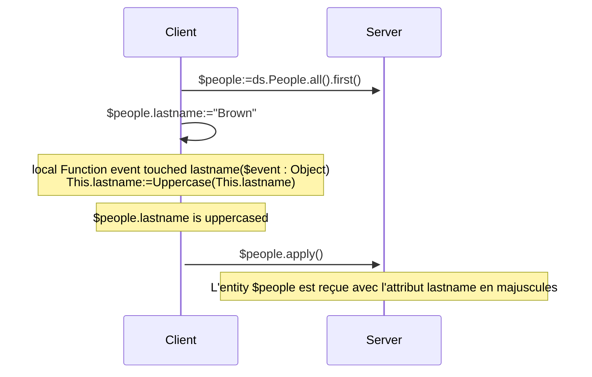
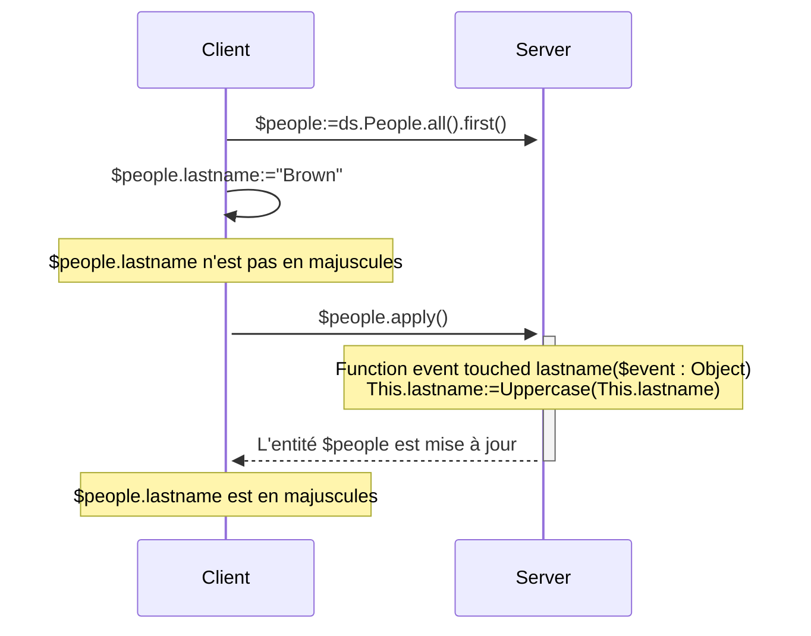
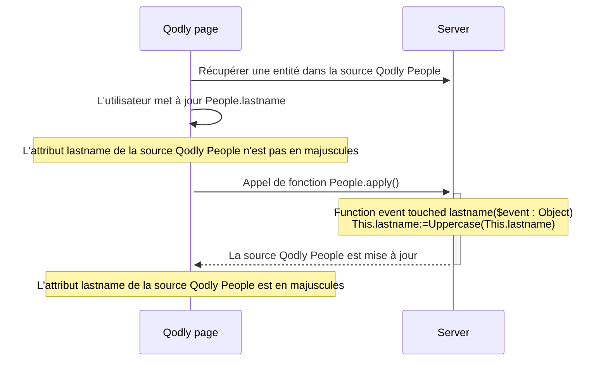

<details><summary>Historique</summary>

| Release | Modifications                                                                                                |
| ------- | ------------------------------------------------------------------------------------------------------------ |
| 21      | Événements ajoutés : validateSave / saving / afterSave / validateDrop / dropping / afterDrop |
| 20 R10  | ajout événement touched                                                                                      |

</details>

Les événements d'entité sont des fonctions qui sont automatiquement invoquées par ORDA chaque fois que des entités et des attributs d'entité sont touchés (ajoutés, supprimés ou modifiés). Vous pouvez écrire des événements très simples, puis les rendre plus sophistiqués.

Vous ne pouvez pas déclencher directement l'exécution d'une fonction d'événement. Les événements sont appelés automatiquement par ORDA en fonction des actions de l'utilisateur ou des opérations effectuées par le code sur les entités et leurs attributs.

:::tip Article(s) de blog sur le sujet

[ORDA - Gérer une logique événementielle lors des actions de persistance des données](https://blog.4d.com/orda-handle-an-event-driven-logic-during-database-operations)

:::

:::info Note de compatibilité

Les événements d'entité ORDA dans le datastore sont équivalents aux triggers dans la base de données 4D. Cependant, les actions déclenchées au niveau de la base de données 4D à l'aide des commandes du langage classique 4D ou des actions standard ne déclenchent pas les événements ORDA. Notez également que, contrairement aux triggers, les événements d'entité ORDA ne verrouillent pas l'ensemble de la table sous-jacente d'une dataclass lors de l'enregistrement ou de la suppression d'entités. Plusieurs événements peuvent se dérouler en parallèle tant qu'ils concernent des entités distinctes (c'est-à-dire des enregistrements distincts).

:::

## Vue d’ensemble

### Niveau de l'événement

Une fonction d'événement d'entité est toujours définie dans la [classe Entity](../ORDA/ordaClasses.md#entity-class).

Un événement peut être défini au niveau de l'**entité** et/ou de l'**attribut** (y compris les [**attributs calculés**](../ORDA/ordaClasses.md#computed-attributes)). Dans le premier cas, il sera déclenché pour tous les attributs de l'entité ; dans l'autre cas, il ne sera déclenché que pour l'attribut ciblé.

Pour un même événement, vous pouvez définir différentes fonctions pour différents attributs.

Vous pouvez également définir le même événement au niveau de l'attribut et de l'entité. L'événement attribut est appelé en premier, puis l'événement entité.

### Exécution en configuration distante

En général, les événements ORDA sont exécutés sur le serveur.

Cependant, dans une configuration client/serveur, la fonction d'événement `touched()` peut être exécutée sur **le serveur ou le client**, en fonction de l'utilisation du mot-clé [`local`](./ordaClasses.md#local-functions). Une implémentation spécifique côté client permet de déclencher l'événement sur le client.

:::note

Les fonctions ORDA [`constructor()`](./ordaClasses.md#class-constructor) sont toujours exécutées sur le client.

:::

Avec les autres configurations à distance (c'est-à-dire les [applications Qodly](https://developer.4d.com/qodly), les [requêtes API REST](../REST/REST_requests.md), ou les requêtes via [`Open datastore`](../commands/open-datastore.md)), la fonction d'événement `touched()` est toujours exécutée **côté serveur**. Cela signifie que vous devez vous assurer que le serveur peut "voir" qu'un attribut a été touché pour déclencher l'événement (voir ci-dessous).

### Tableau de synthèse

Le tableau suivant liste les événements d'entité ORDA ainsi que leurs règles.

| Evénement                             | Niveau   | Nom de la fonction                                      |                 (C/S) Exécuté sur                | Peut arrêter l'action en renvoyant une erreur |
| :------------------------------------ | :------- | :------------------------------------------------------ | :-----------------------------------------------------------------: | --------------------------------------------- |
| Instanciation d'entité                | Entity   | [`constructor()`](./ordaClasses.md#class-constructor-1) |                                client                               | non                                           |
| Attribut touched                      | Attribut | `event touched <attrName>()`                            | Dépend du mot-clé [`local`](../ORDA/ordaClasses.md#local-functions) | non                                           |
|                                       | Entity   | `event touched()`                                       | Dépend du mot-clé [`local`](../ORDA/ordaClasses.md#local-functions) | non                                           |
| Avant l'enregistrement d'une entité   | Attribut | `validateSave <attrName>()`                             |                                server                               | oui                                           |
|                                       | Entity   | `validateSave()`                                        |                                server                               | oui                                           |
| Pendant l'enregistrement d'une entité | Attribut | `saving <attrName>()`                                   |                                server                               | oui                                           |
|                                       | Entity   | `saving()`                                              |                                server                               | oui                                           |
| Après l'enregistrement d'une entité   | Entity   | `afterSave()`                                           |                                server                               | non                                           |
| Avant la suppression d'une entité     | Attribut | `validateDrop <attrName>()`                             |                                server                               | oui                                           |
|                                       | Entity   | `validateDrop()`                                        |                                server                               | oui                                           |
| Pendant la suppression d'une entité   | Attribut | `dropping <attrName>()`                                 |                                server                               | oui                                           |
|                                       | Entity   | `dropping()`                                            |                                server                               | oui                                           |
| Après la suppression d'une entité     | Entity   | `afterDrop()`                                           |                                server                               | non                                           |

:::note

La fonction [`constructor()`](./ordaClasses.md#class-constructor-1) n'est pas en soi une fonction d'événement, mais elle est toujours appelée lorsqu'une nouvelle entité est instanciée.

:::

## Paramètre *event*

Les fonctions d'événement acceptent un seul objet *event* comme paramètre. Lorsque la fonction est appelée, le paramètre est rempli avec diverses propriétés :

| Nom de propriété    | Disponibilité                                                                                                                            | Type                  | Description                                                                                                                    |   |
| :------------------ | :--------------------------------------------------------------------------------------------------------------------------------------- | :-------------------- | :----------------------------------------------------------------------------------------------------------------------------- | - |
| "kind"              | Toujours                                                                                                                                 | String                | Nom de l'événement : "touched", "validateSave", "saving", "afterSave", "validateDrop", "dropping", "afterDrop" |   |
| *attributeName*     | Uniquement pour les événements définis au niveau des attributs ("validateSave", "saving", "validateDrop", "dropping") | String                | Nom de l'attribut (*ex.* "firstname")                                                       |   |
| *dataClassName*     | Toujours                                                                                                                                 | String                | Nom du verre de données (*ex.* "Company")                                                   |   |
| "savedAttributes"   | Uniquement dans [`afterSave()`](#function-event-aftersave)                                                                               | Collection de chaînes | Noms des attributs correctement enregistrés                                                                                    |   |
| "droppedAttributes" | Uniquement dans [`afterDrop()`](#function-event-afterdrop)                                                                               | Collection de chaînes | Noms des attributs correctement supprimés                                                                                      |   |
| "saveStatus"        | Uniquement dans [`afterSave()`](#function-event-aftersave)                                                                               | String                | "success" si l'enregistrement a réussi, "failed" sinon                                                                         |   |
| "dropStatus"        | Uniquement dans [`afterDrop()`](#function-event-afterdrop)                                                                               | String                | "success" si la suppression a réussi, "failed" sinon                                                                           |   |

## Objet error

[Certaines fonctions d'événement](#summary-table) peuvent renvoyer un **objet error** pour déclencher une erreur et arrêter l'action en cours.

Lorsqu'une erreur survient dans un événement, les autres événements sont stoppés à la première erreur signalée et l'action (enregistrement pu suppression) est également arrêtée. Cette erreur est envoyée avant d'autres erreurs potentielles telles que [stamp has changed, entity locked](../API/EntityClass.md#save), etc.

### Propriétés de l'objet error

| Propriété          | Type    | Description                                                                                                                                                                                                                                                                                                                                                                                                                                                                                                                                                                                                                                  | Fixé par le développeur                                     |
| ------------------ | ------- | -------------------------------------------------------------------------------------------------------------------------------------------------------------------------------------------------------------------------------------------------------------------------------------------------------------------------------------------------------------------------------------------------------------------------------------------------------------------------------------------------------------------------------------------------------------------------------------------------------------------------------------------- | ----------------------------------------------------------- |
| errCode            | Integer | Identique à la commande [`Last errors`](../commands/last-errors.md)                                                                                                                                                                                                                                                                                                                                                                                                                                                                                                                                                                          | Oui                                                         |
| message            | Text    | Identique à la commande [`Last errors`](../commands/last-errors.md)                                                                                                                                                                                                                                                                                                                                                                                                                                                                                                                                                                          | Oui                                                         |
| extraDescription   | Object  | Informations libres à définir                                                                                                                                                                                                                                                                                                                                                                                                                                                                                                                                                                                                                | Oui                                                         |
| seriousError       | Boolean | Utilisé uniquement avec les événements de validation (voir ci-dessous). <li>`True` : crée une [erreur critique (imprévisible)](../Concepts/error-handling.md#predictable-vs-unpredictable-errors) et déclenche une exception. Ajoute le statut `dk status serious validation error`</li><li>`False` : crée seulement une [erreur silencieuse (prévisible)](../Concepts/error-handling.md#predictable-vs-unpredictable-errors). Ajoute le statut `dk status validation failed`.</li> | Oui (par défaut : False) |
| componentSignature | Text    | Toujours "DBEV"                                                                                                                                                                                                                                                                                                                                                                                                                                                                                                                                                                                                                              | Non                                                         |

- Les [erreurs critiques](../Concepts/error-handling.md#predictable-vs-unpredictable-errors) sont empilées dans la collection de la propriété `errors` de l'objet **Result** renvoyé par les fonctions [`save()`](../API/EntityClass.md#save) ou [`drop()`](../API/EntityClass.md#drop).
- Dans le cas d'une erreur déclenchée par un événement **validate**, la propriété `seriousError` permet de choisir le niveau d'erreur à générer :
  - Si **true** : une erreur critique est déclenchée et doit être traitée par le [code de traitement des erreurs](../Concepts/error-handling.md#predictable-vs-unpredictable-errors), par exemple un ["try catch"](../Concepts/error-handling.md#trycatchend-try). Dans l'objet résultat de la fonction appelante, `status` vaut `dk status serious validation error` et `statusText` vaut "Serious Validation Error". L'erreur est levée à la fin de l'événement et parvient au client qui demande l'action d'enregistrement/suppression (client REST par exemple).
  - Si **false** (défaut) : une [erreur silencieuse (prévisible) est générée](../Concepts/error-handling.md#predictable-vs-unpredictable-errors). Elle ne déclenche aucune exception et n'est pas empilée dans les erreurs retournées par la commande [`Last errors`](../commands/last-errors.md). Dans l'objet résultat de la fonction appelante, `status` vaut `dk status validation failed` et `statusText` vaut "Mild Validation Error".
- Dans le cas d'une erreur déclenchée par un événement **saving/dropping**, lorsqu'un objet d'erreur est renvoyé, l'erreur est toujours définie comme critique, quelle que soit la valeur de la propriété `seriousError`.

## Description des fonctions

### `Function event touched`

#### Syntaxe

```4d
{local} Function event touched($event : Object)
{local} Function event touched <attributeName>($event : Object)
// code
```

Cet événement est déclenché chaque fois qu'une valeur est modifiée dans l'entité.

- Si vous avez défini la fonction au niveau de l'entité (première syntaxe), elle est déclenchée pour des modifications sur n'importe quel attribut de l'entité.
- Si vous avez défini la fonction au niveau de l'attribut (deuxième syntaxe), elle n'est déclenchée que pour les modifications sur cet attribut.

Cet événement est déclenché dès que le moteur de 4D Server / 4D détecte une modification de la valeur de l'attribut qui peut être due aux actions suivantes :

- en **client/serveur avec le [mot-clé `local`](../ORDA/ordaClasses.md#local-functions)** ou en **4D mono-utilisateur** :
  - l'utilisateur saisit une valeur dans un formulaire 4D,
  - le code 4D effectue une assignation avec l'opérateur `:=`. L'événement est également déclenché en cas d'auto-assignation (`$entity.attribute:=$entity.attribute`).
- en **client/serveur sans le mot-clé `local`** : du code 4D effectue une assignation avec l'opérateur `:=` est [exécuté sur le serveur](../commands-legacy/execute-on-server.md).
- en **client/serveur sans le mot-clé `local`**, une **[application Qodly](https://developer.4d.com/qodly)** ou **[datastore distant](../commands/open-datastore.md)** : l'entité est reçue sur le serveur 4D lors de l'appel d'une fonction ORDA (sur l'entité ou avec l'entité en tant que paramètre). Cela signifie que vous devrez peut-être mettre en place une fonction *refresh* ou *preview* sur l'application distante qui envoie une requête ORDA au serveur et déclenche l'événement.
- avec le serveur REST : la valeur est reçue sur le serveur REST avec une [requête REST](../REST/$method.md#methodupdate) (`$method=update`)

La fonction reçoit un objet [*event*](#event-parameter) en paramètre.

Si cette fonction [génère](../commands/throw) une erreur, elle n'arrêtera pas l'action en cours.

:::note

Cet événement est également déclenché :

- lorsque les attributs sont assignés par l'événement [`constructor()`](./ordaClasses.md#class-constructor-1),
- lorsque les attributs sont modifiés via l'[Explorateur de données](../Admin/dataExplorer.md).

:::

#### Exemple 1

Vous souhaitez mettre en majuscules tous les attributs de texte d'une entité lorsqu'elle est mise à jour.

```4d
    //ProductsEntity class
Function event touched($event : Object)
	
	If (Value type(This[$event.attributeName])=Is text)
		This[$event.attributeName]:=Uppercase(This[$event.attributeName])
	End if 
```

#### Exemple 2

L'événement "touched" est utile quand il n'est pas possible d'écrire un code de requête indexée dans [`Function query()`](./ordaClasses.md#function-query-attributename) pour un [attribut calculé](./ordaClasses.md#computed-attributes).

C'est le cas, par exemple, lorsque votre fonction [`query`](./ordaClasses.md#function-query-attributename) doit comparer la valeur de différents attributs de la même entité. Vous devez utiliser des formules dans la requête ORDA renvoyée, ce qui déclenche des requêtes séquentielles.

Pour bien comprendre ce cas, examinons les deux attributs calculés suivants :

```4d
Function get onGoing() : Boolean
        return ((This.departureDate<=Current date) & (This.arrivalDate>=Current date))

Function get sameDay() : Boolean
        return (This.departureDate=This.arrivalDate)
```

Même si elles sont très similaires, ces fonctions ne peuvent pas être associées à des requêtes identiques car elles ne comparent pas les mêmes types de valeurs. Le premier compare les attributs à une valeur donnée, tandis que le second compare les attributs entre eux.

- Pour l'attribut *onGoing*, la fonction [`query`](./ordaClasses.md#function-query-attributename) est simple à écrire et utilise des attributs indexés :

```4d
Function query onGoing($event : Object) : Object
    var $operator : Text
    var $myQuery : Text
    var $onGoingValue : Boolean
    var $parameters : Collection
    $parameters:=New collection()

    $operator:=$event.operator
    Case of 
            : (($operator="=") | ($operator="==") | ($operator="==="))
                $onGoingValue:=Bool($event.value)
            : (($operator="!=") | ($operator="!=="))
                $onGoingValue:=Not(Bool($event.value))
            Else 
                return {query: ""; parameters: $parameters}
    End case 

    $myQuery:=($onGoingValue) ? "departureDate <= :1 AND arrivalDate >= :1" : "departureDate > :1 OR arrivalDate < :1"
        // la chaîne de requête ORDA utilise des attributs indexés, elle sera indexée
    $parameters.push(Current date)
    return {query: $myQuery; parameters: $parameters}
```

- Pour l'attribut *sameDay*, la fonction [`query`](./ordaClasses.md#function-query-attributename) requiert une requête ORDA basée sur des formules et sera séquentielle :

```4d
Function query sameDay($event : Object) : Text
    var $operator : Text
    var $sameDayValue : Boolean

    $operator:=$event.operator
    Case of 
        : (($operator="=") | ($operator="==") | ($operator="==="))
            $sameDayValue:=Bool($event.value)
        : (($operator="!=") | ($operator="!=="))
            $sameDayValue:=Not(Bool($event.value))
        Else 
            return ""
        End case 

    return ($sameDayValue) ? "eval(This.departureDate = This.arrivalDate)" : "eval(This.departureDate != This.arrivalDate)"
        // la requête ORDA utilise une formule, elle ne sera pas indexée

```

- L'utilisation d'un attribut **scalaire** *sameDay* mis à jour lorsque d'autres attributs sont "touched" permet de gagner du temps :

```4d
    //BookingEntity class

Function event touched departureDate($event : Object) 

    This.sameDay:=(This.departureDate = This.arrivalDate) 
//
//
Function event touched arrivalDate($event : Object) 

    This.sameDay:=(This.departureDate = This.arrivalDate)

```

#### Exemple 3 (diagramme) : Client/serveur avec le mot-clé `local` :



#### Exemple 4 (diagramme) : Client/serveur avec le mot-clé `local`



#### Exemple 5 (diagramme) : Application Qodly



### `Function event validateSave`

#### Syntaxe

```4d
Function event validateSave($event : Object)
Function event validateSave <attributeName>($event : Object)
// code
```

Cet événement est déclenché chaque fois qu'une entité est sur le point d'être sauvegardée.

- si vous avez défini la fonction au niveau de l'entité (première syntaxe), elle est appelée pour tout attribut de l'entité.
- si vous avez défini la fonction au niveau de l'attribut (deuxième syntaxe), elle n'est appelée que pour cet attribut. Cette fonction n'est **pas** exécutée si l'attribut n'a pas été modifié dans l'entité.

La fonction reçoit un objet [*event*](#event-parameter) en paramètre.

Cet événement est déclenché par les fonctions suivantes :

- [`entity.save()`](../API/EntityClass.md#save)
- [`dataClass.fromCollection()`](../API/DataClassClass.md#fromcollection)

Cet événement est déclenché **avant** que l'entité ne soit réellement sauvegardée et vous permet de vérifier la cohérence des données afin d'interrompre l'action si nécessaire. Par exemple, vous pouvez vérifier dans cet événement que "date de départ" < "date d'arrivée".

Pour stopper l'action, le code de la fonction doit renvoyer un [objet erreur](#error-object).

:::note

Il n'est pas recommandé de mettre à jour l'entité dans le cadre de cette fonction (en utilisant `This`).

:::

#### Exemple

Dans cet exemple, il n'est pas permis de sauvegarder un produit dont la marge est inférieure à 50 %. En cas d'attribut de prix non valide, vous renvoyez un objet erreur et arrêtez ainsi l'action de sauvegarde.

```4d
// ProductsEntity class
//
// event validateSave au niveau attribut
Function event validateSave margin($event : Object) : Object
	
var $result : Object
	
//L'utilisateur ne peut pas créer un produit dont la marge est < 50%
If (This.margin<50)
	$result:={errCode: 1; message: "The validation of this product failed"; \
	extraDescription: {info: "The margin of this product ("+String(This.margin)+") is lower than 50%"}; seriousError: False}
End if 
return $result

```

### `Function event saving`

#### Syntaxe

```4d
Function event saving($event : Object)
Function event saving <attributeName>($event : Object)
// code
```

Cet événement est déclenché chaque fois qu'une entité est sur le point d'être sauvegardée.

- Si vous avez défini la fonction au niveau de l'entité (première syntaxe), elle est appelée pour tout attribut de l'entité. La fonction est exécutée même si aucun attribut n'a été touché dans l'entité (par exemple, dans le cas de l'envoi de données à une application externe à chaque fois qu'une sauvegarde est effectuée).
- Si vous avez défini la fonction au niveau de l'attribut (deuxième syntaxe), elle n'est appelée que pour cet attribut. La fonction n'est **pas** exécutée si l'attribut n'a pas été touché dans l'entité.

La fonction reçoit un objet [*event*](#event-parameter) en paramètre.

Cet événement est déclenché par les fonctions suivantes :

- [`entity.save()`](../API/EntityClass.md#save)
- [`dataClass.fromCollection()`](../API/DataClassClass.md#fromcollection)

Cet événement est déclenché **pendant que** l'entité est sauvegardée. Si une fonction d'événement [`validateSave()`](#function-event-validatesave) a été définie, la fonction d'événement `saving()` est appelée si aucune erreur n'a été déclenchée par `validateSave()`. Par exemple, vous pouvez utiliser cet événement pour créer un document sur un compte Google Drive.

:::note

La logique applicative doit générer les erreurs qui ne peuvent pas être détectées lors des événements `validateSave()`, par exemple une erreur de réseau.

:::

Lors de l'action de sauvegarde, des erreurs du moteur 4D peuvent être générées (index, le marqueur stamp a changé, pas assez d'espace sur le disque).

Pour stopper l'action, le code de la fonction doit renvoyer un [objet erreur](#error-object).

#### Exemple

Lorsqu'un fichier est sauvegardé sur le disque, intercepter par exemple les erreurs liées à l'espace disque.

```4d
// Classe ProductsEntity
// Evénement save au niveau de l'attribut
Function event saving userManualPath($event : Object) : Object
	
var $result : Object
var $userManualFile : 4D.File
var $fileCreated : Boolean
	
If (This.userManualPath#"")
	$userManualFile:=File(This.userManualPath)
				
	// Le fichier du manuel de l'utilisateur est créé sur le disque
	// Cela peut échouer s'il n'y a plus d'espace disponible
	Try
        // Le contenu du fichier a été généré et stocké dans une carte dans Storage.docMap précédemment
	    $docInfo:=Storage.docMap.query("name = :1" ; This.name).first()
        $userManualFile.setContent($docInfo.content)
	Catch
		// Il n'y a plus de place sur le disque par exemple
		$result:={/
            errCode : 1 ; message : "Error during the save action for this product" ; /
            extraDescription : {info : "Il n'y a pas d'espace disponible sur le disque pour stocker le manuel de l'utilisateur"}/
        }
	End try
End if 
	
return $result

```

:::note

Le contenu du fichier est généré en dehors de l'événement `saving` car cela peut prendre du temps.

:::

### `Function event afterSave`

#### Syntaxe

```4d
Function event afterSave($event : Object)
// code
```

Cet événement est déclenché juste après la sauvegarde d'une entité dans le fichier de données, lorsqu'au moins un attribut a été modifié. Elle n'est pas exécutée si aucun attribut n'a été modifié dans l'entité.

Cet événement est utile après la sauvegarde des données pour propager l'action de sauvegarde en dehors de l'application ou pour exécuter des tâches d'administration. Par exemple, il peut être utilisé pour envoyer un courriel de confirmation après la sauvegarde des données. Ou, en cas d'erreur lors de l'enregistrement des données, il peut effectuer un retour en arrière pour restaurer un état cohérent des données.

La fonction reçoit un objet [*event*](#event-parameter) en paramètre.

- Pour éviter les boucles infinies, appeler un [`save()`](../API/EntityClass.md#save) sur l'entité courante (via `This`) dans cette fonction n'est **pas autorisé**. Cela provoquera une erreur.
- Faire un throw d'un [objet erreur](#error-object) n'est **pas pris en charge** par cette fonction.

#### Exemple

Si une erreur s'est produite lors de l'événement de sauvegarder ci-dessus, la valeur de l'attribut est réinitialisée en conséquence dans l'événement `afterSave` :

```4d
// Classe ProductsEntity
Function event afterSave($event : Object)
	
If (($event.status.success=False) && ($event.status.errors=Null))  
    // $event.status.errors est rempli si l'erreur provient de l'événement validateSave
		
	// L'attribut userManualPath n'a pas été correctement sauvegardé
	// Sa valeur est réinitialisée
	If ($event.savedAttributes.indexOf("userManualPath")=-1)
		This.userManualPath:="
		This.status:="KO"
	End if 
		
End if 
```

### `Function event validateDrop`

#### Syntaxe

```4d
Function event validateDrop($event : Object)
Function event validateDrop <attributeName>($event : Object)
// code
```

Cet événement est déclenché chaque fois qu'une entité est sur le point d'être supprimée.

- Si vous avez défini la fonction au niveau de l'entité (première syntaxe), elle est appelée pour tout attribut de l'entité.
- Si vous avez défini la fonction au niveau de l'attribut (deuxième syntaxe), elle n'est appelée que pour cet attribut.

La fonction reçoit un objet [*event*](#event-parameter) en paramètre.

Cet événement est déclenché par les fonctionnalités suivantes :

- [`entity.drop()`](../API/EntityClass.md#drop)
- [`entitySelection.drop()`](../API/DataClassClass.md#fromcollection)
- [règles de contrôle de la suppression](https://doc.4d.com/4Dv20/4D/20.2/Relation-properties.300-6750290.en.html#107320) qui peuvent être définies au niveau de la structure de la base de données.

Cet événement est déclenché **avant** que l'entité ne soit effectivement supprimée, ce qui permet de vérifier la cohérence des données et, le cas échéant, d'interrompre l'action de suppression.

Pour stopper l'action, le code de la fonction doit renvoyer un [objet erreur](#error-object).

#### Exemple

Dans cet exemple, il n'est pas permis de supprimer un produit qui n'est pas libellé "TO DELETE". Dans ce cas, vous renvoyez un objet d'erreur et stoppez ainsi l'action de suppression.

```4d
// Classe ProductsEntity

Function event validateDrop status($event : Object) : Object

var $result : Objet

// Les produits doivent être marqués TO DELETE pour être supprimables
If (This.status#"TO DELETE")
    $result:={errCode : 1 ; message : "Vous ne pouvez pas supprimer ce produit" ; \
    extraDescription : {info : "Ce produit doit être marqué comme à supprimer"} ; seriousError : False}
End if 

return $result
```

### `Function event dropping`

#### Syntaxe

```4d
Function event dropping($event : Object)
Function event dropping <attributeName>($event : Object)
// code
```

Cet événement est déclenché chaque fois qu'une entité est supprimée.

- Si vous avez défini la fonction au niveau de l'entité (première syntaxe), elle est appelée pour tout attribut de l'entité.
- Si vous avez défini la fonction au niveau de l'attribut (deuxième syntaxe), elle n'est appelée que pour cet attribut.

La fonction reçoit un objet [*event*](#event-parameter) en paramètre.

Cet événement est déclenché par les fonctionnalités suivantes :

- [`entity.drop()`](../API/EntityClass.md#drop)
- [`entitySelection.drop()`](../API/DataClassClass.md#fromcollection)
- [règles de contrôle de la suppression](https://doc.4d.com/4Dv20/4D/20.2/Relation-properties.300-6750290.en.html#107320) qui peuvent être définies au niveau de la structure de la base de données.

Cet événement est déclenché **pendant que** l'entité est effectivement supprimée. Si une fonction d'événement [`validateDrop()`](#function-event-validatedrop) a été définie, la fonction d'événement `dropping()` est appelée si aucune erreur n'a été générée par `validateDrop()`.

:::note

La logique applicative doit générer les erreurs qui ne peuvent pas être détectées lors des événements `validateDrop()`, par exemple une erreur de réseau.

:::

Pour stopper l'action, le code de la fonction doit renvoyer un [objet erreur](#error-object).

#### Exemple

Voici un exemple d'événement `dropping` au niveau de l'entité :

```4d
// Classe ProductsEntity
Function event dropping($event : Object) : Object

var $result : Object
var $userManualFile : 4D.File

$userManualFile:=File(This.userManualPath)

    // Lors de la suppression d'un produit, son manuel d'utilisation est également supprimé sur le disque
    // Cette action peut échouer
Try
    If ($userManualFile.exists)
        $userManualFile.delete()
    End if 
Catch
    // La suppression du manuel d'utilisation a échoué
    $result:={errCode : 1 ; message : "Drop failed" ; extraDescription : {info : "Le manuel de l'utilisateur ne peut pas être supprimé"}}
End try

return $result
```

### `Function event afterDrop`

#### Syntaxe

```4d
Function event afterDrop($event : Object)
// code
```

Cet événement est déclenché juste après la suppression d'une entité.

Cet événement est utile après la suppression de données pour propager l'action de suppression en dehors de l'application ou pour exécuter des tâches d'administration. Par exemple, il peut être utilisé pour envoyer un courriel d'annulation après la suppression de données. Ou, en cas d'erreur lors de la suppression des données, il peut enregistrer une information permettant à l'administrateur de vérifier la cohérence des données.

La fonction reçoit un objet [*event*](#event-parameter) en paramètre.

- Pour éviter les boucles infinies, appeler [`drop()`](../API/EntityClass.md#drop) sur l'entité courante (à travers `This`) dans cette fonction n'est **pas autorisé**. Cela provoquera une erreur.
- Faire un throw d'un [objet erreur](#error-object) n'est **pas pris en charge** par cette fonction.

:::note

L'entité supprimée est référencée par `This` et existe toujours en mémoire.

:::

#### Exemple

Si l'action de suppression a échoué, le produit doit être vérifié manuellement :

```4d
Function event afterDrop($event : Object)

var $status : Object

If (($event.status.success=False) && ($event.status.errors=Null)) 
        //$event.status.errors est rempli 
        //si l'erreur provient de l'événement validateDrop
    This.status:="Check this product - Drop action failed"
    $status:=This.save()
End if 

```

