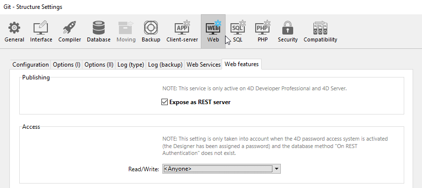

Using standard HTTP requests, the 4D REST Server allows external applications to access the data of your application directly, *i.e.* to retrieve information about the dataclasses in your project, manipulate data, log into your web application, and much more.

Pour commencer à utiliser les fonctionnalités REST, vous devez démarrer et configurer le serveur 4D REST.

## Démarrage du serveur REST

Pour des raisons de sécurité, par défaut, 4D ne répond pas aux requêtes REST. Si vous souhaitez démarrer le serveur REST, cochez l'option **Exposer en tant que serveur REST** dans la page **Web** > **Web Features** des paramètres de la structure afin que les requêtes REST soient traitées.



> Les services REST utilisent le serveur HTTP 4D; vous devez donc vous assurer que le serveur web 4D est lancé.

Le message d'avertissement "Attention, vérifiez les privilèges d'accès" s'affiche lorsque vous cochez cette option, pour attirer votre attention sur le fait que lorsque les services REST sont activés, l'accès par défaut aux objets de base de données est gratuit tant que les accès REST n'ont pas été configurés.

> Vous devez redémarrer l'application 4D pour que vos modifications soient prises en compte.

## Contrôle de l'accès REST

Par défaut, les accès REST sont ouverts à tous les utilisateurs, ce qui n'est évidemment pas recommandé pour des raisons de sécurité et de contrôle de l'utilisation des licences clientes.

Depuis 4D 20 R6, vous configurez les accès REST en activant le mode [**force login**](authUsers.md#force-login-mode) et en créant une fonction [`authentify()`](authUsers.md#function-authentify) dans la classe datastore pour authentifier les utilisateurs et attribuer des privilèges à leur session web.

:::note Compatibilité

La zone **Accès** de la boîte de dialogue Propriétés n'est disponible que dans les projets convertis pour des raisons de compatibilité. Voir [Accès](../settings/web.md#access) pour plus d'informations.

:::

## Exposer les tables et les champs

Une fois les services REST activés dans l'application 4D, une session REST peut par défaut accéder à toutes les tables et à tous les champs de la base de données 4D via l'[interface du datastore](ORDA/dsMapping.md#datastore). Ainsi, elle peut utiliser leurs données. Par exemple, si votre base de données contient une table [Employee], il est possible d'écrire :

```
http://127.0.0.1:8044/rest/Employee/?$filter="salary>10000"

```

Cette requête retournera tous les employés dont le champ "salary" est supérieur à 10 000.

> Les tables et/ou champs 4D dont l'attribut est "invisible" sont également exposés par défaut dans REST.

Si vous souhaitez personnaliser les objets du datastore accessibles via REST, vous devez désactiver l'exposition de chaque table et/ou champ que vous souhaitez masquer. Lorsqu'une requête REST tente d'accéder à une ressource non autorisée, 4D retourne une erreur.

### Exposer des tables

Par défaut, toutes les tables sont exposées dans REST.

Pour des raisons de sécurité, vous pouvez choisir d'exposer uniquement certaines tables du datastore aux appels REST. Par exemple, si vous avez créé une table [Users] stockant les noms d'utilisateur et les mots de passe, il serait préférable de ne pas l'exposer.

Pour supprimer l'exposition REST d'une table :

1. Affichez l'Inspecteur de table dans l'Editeur de structure et sélectionnez la table à modifier.

2. Uncheck the **Expose as REST resource** option:
   
   Do this for each table whose exposure needs to be modified.

### Exposer des champs

Par défaut, tous les champs d'une base 4D sont exposés dans REST.

Vous pouvez choisir d'exposer certains champs de vos tables en REST. Par exemple, vous pouvez ne pas souhaiter exposer le champ [Employees]Salary.

Pour supprimer l'exposition REST d'un champ :

1. Affichez l'Inspecteur de champ dans l'Editeur de structure et sélectionnez le champ à modifier.

2. Décochez la case **Exposer en tant que ressource REST** pour le champ.
   
   Répétez cette opération pour chaque champ dont l'exposition doit être modifiée.

> Pour qu'un champ soit accessible via REST, la table parente doit l'être également. Si la table parente n'est pas exposée, aucun de ses champs ne le sera, quel que soit leur statut.

## Mode préemptif

Sur 4D Server, les requêtes REST sont automatiquement traitées par des process préemptifs, **même en mode interprété**. Vous devez vous assurer que votre code est [compatible avec une exécution préemptive](../WebServer/preemptiveWeb.md#writing-thread-safe-web-server-code).

> Pour déboguer le code web interprété sur la machine serveur, assurez-vous que le débogueur est [attaché au serveur](../Debugging/debugging-remote.md) ou [à une machine distante](../Debugging/debugging-remote.md). Les process Web passent alors en mode coopératif et le code du serveur Web peut être débogué.

Avec 4D monoposte, le code interprété s'exécute toujours en mode coopératif.
