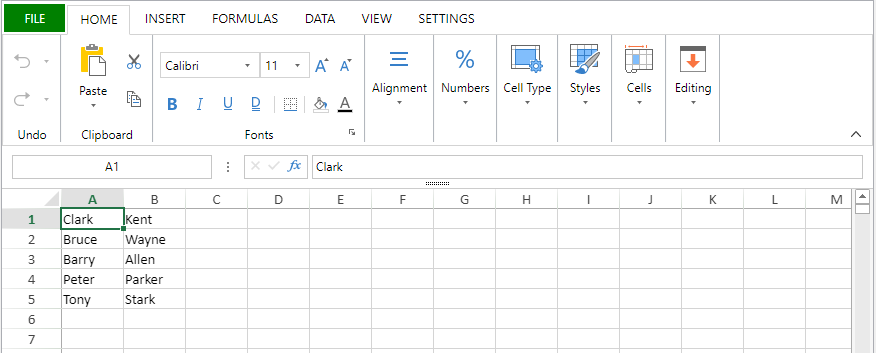

<details><summary>Historique</summary>

| Release | Modifications                                                                                  |
| ------- | ---------------------------------------------------------------------------------------------- |
| 20 R9   | Déclenchement de la fonction de rappel après que les fonctions personnalisées soient terminées |
| 20 R2   | Prise en charge des documents .sjs                                             |

</details>

<!-- REF #_method_.VP EXPORT DOCUMENT.Syntax -->

**VP EXPORT DOCUMENT** ( *vpAreaName* : Text ; *filePath* : Text {; *paramObj* : Object} )<!-- END REF -->

<!-- REF #_method_.VP EXPORT DOCUMENT.Params -->

| Paramètres | Type   |    | Description                             |                  |
| ---------- | ------ | -- | --------------------------------------- | ---------------- |
| vpAreaName | Text   | -> | Nom d'objet formulaire zone 4D View Pro |                  |
| filePath   | Text   | -> | Chemin d'accès du document              |                  |
| paramObj   | Object | -> | Options d'export                        | <!-- END REF --> |

## Description

La commande `VP EXPORT DOCUMENT` <!-- REF #_method_.VP EXPORT DOCUMENT.Summary -->exporte l'objet 4D View Pro attaché à la zone 4D View Pro *vpAreaName* vers un document sur disque en fonction des paramètres *filePath* et *paramObj*<!-- END REF -->.

Dans *vpAreaName*, passez le nom de la zone 4D View Pro. Si vous passez un nom inexistant, une erreur est retournée.

Dans *filePath*, passez le chemin de destination et le nom du document à exporter. Si vous ne spécifiez pas de chemin, le document sera sauvegardé au même niveau que le dossier Projet.

Vous pouvez préciser le format du document en incluant une extension après son nom :

- 4D View Pro (".4vp")
- Microsoft Excel (".xlsx")
- PDF (".pdf")
- CSV (".txt", or ".csv")
- [SpreadJS document](https://developer.mescius.com/spreadjs/docs/features/spreadjs-file-format) (".sjs")

Si l'extension n'est pas incluse, mais que le format est spécifié dans *paramObj*, le fichier exporté aura l'extension correspondant au format, sauf pour le format CSV (aucune extension n'est ajoutée dans ce cas).

Le paramètre optionnel *paramObj* vous permet de définir plusieurs propriétés pour l'objet 4D View Pro exporté, ainsi que lancer une méthode de callback lorsque l'exportation est terminée.

| Propriété            |                           | Type                        | Description                                                                                                                                                                                                                                                                                                                                                                                                                                                                                                                                                                                                                                                                                                                                                                                                        |
| -------------------- | ------------------------- | --------------------------- | ------------------------------------------------------------------------------------------------------------------------------------------------------------------------------------------------------------------------------------------------------------------------------------------------------------------------------------------------------------------------------------------------------------------------------------------------------------------------------------------------------------------------------------------------------------------------------------------------------------------------------------------------------------------------------------------------------------------------------------------------------------------------------------------------------------------ |
| format               |                           | text                        | (optional) When present, designates the exported file format: ".4vp" (default), ".csv", ".xlsx", ".pdf", or ".sjs". You can use the following constants:<li>`vk 4D View Pro format`</li><li>`vk csv format`</li><li>`vk MS Excel format`</li><li>`vk pdf format`</li><li>`vk sjs format`</li>4D adds the appropriate extension to the file name if needed. If the format specified doesn't correspond with the extension in *filePath*, it will be added to the end of *filePath*. If a format is not specified and no extension is provided in *filePath*, the default file format is used. |
| password             |                           | text                        | Microsoft Excel uniquement (optionnel) - Mot de passe utilisé pour protéger le document MS Excel                                                                                                                                                                                                                                                                                                                                                                                                                                                                                                                                                                                                                                                                                                |
| formula              |                           | 4D.Function | Méthode callback à lancer lorsque l'export est terminé. L'utilisation d'une méthode callback est nécessaire lorsque l'export est asynchrone (ce qui est le cas pour les formats PDF et Excel) si vous avez besoin d'un code à exécuter après l'export. The callback method must be passed with the [`Formula`](../../commands/formula.md) command. See [Passing a callback method (formula)](#passing-a-callback-method-formula).                                                                                                                                                                                                                                                                            |
| valuesOnly           |                           | boolean                     | Précise que seules les valeurs issues de formules (le cas échéant) seront exportées.                                                                                                                                                                                                                                                                                                                                                                                                                                                                                                                                                                                                                                                                                            |
| includeFormatInfo    |                           | boolean                     | True pour inclure les informations de formatage, sinon False (True par défaut). Les informations de formatage sont utiles dans certains cas, par exemple pour un export en SVG. On the other hand, setting this property to **false** allows reducing export time.                                                                                                                                                                                                                                                                                                                                                                                                                                                                              |
| includeBindingSource |                           | boolean                     | 4DVP et Microsoft Excel uniquement. True (par défaut) pour exporter les valeurs du contexte de données courant en tant que valeurs de cellule dans le document exporté (les contextes de données eux-mêmes ne sont pas exportés). Sinon Faux. La liaison de cellule est toujours exportée. For data context and cell binding management, see [VP SET DATA CONTEXT](vp-set-data-context.md) and [VP SET BINDING PATH](vp-set-binding-path.md).                                                                                                                                                                                                                                                |
| sheetIndex           |                           | number                      | PDF uniquement (optionnel) - Numéro de la feuille à exporter (débute à 0). -2=toutes les feuilles visibles (**par défaut**), -1=feuille courante uniquement                                                                                                                                                                                                                                                                                                                                                                                                                                                                                                                                                                               |
| pdfOptions           |                           | object                      | PDF uniquement (optionnel) - Options pour pdf                                                                                                                                                                                                                                                                                                                                                                                                                                                                                                                                                                                                                                                                                                                                                   |
|                      | creator                   | text                        | nom de l'application qui a créé le document original à partir duquel il a été converti.                                                                                                                                                                                                                                                                                                                                                                                                                                                                                                                                                                                                                                                                                                            |
|                      | title                     | text                        | titre du document.                                                                                                                                                                                                                                                                                                                                                                                                                                                                                                                                                                                                                                                                                                                                                                                 |
|                      | author                    | text                        | nom de la personne ayant créé ce document.                                                                                                                                                                                                                                                                                                                                                                                                                                                                                                                                                                                                                                                                                                                                                         |
|                      | keywords                  | text                        | mots-clés associés au document.                                                                                                                                                                                                                                                                                                                                                                                                                                                                                                                                                                                                                                                                                                                                                                    |
|                      | subject                   | text                        | sujet du document.                                                                                                                                                                                                                                                                                                                                                                                                                                                                                                                                                                                                                                                                                                                                                                                 |
| csvOptions           |                           | object                      | CSV uniquement (optionnel) - Options pour l'export en CSV                                                                                                                                                                                                                                                                                                                                                                                                                                                                                                                                                                                                                                                                                                                                       |
|                      | range                     | object                      | Objet plage de toutes les cellules                                                                                                                                                                                                                                                                                                                                                                                                                                                                                                                                                                                                                                                                                                                                                                                 |
|                      | rowDelimiter              | text                        | Délimiteur de ligne. Par défaut : <code>"\r\n"</code>                                                                                                                                                                                                                                                                                                                                                                                                                                                                                                                                                                                                                                                                                                                              |
|                      | columnDelimiter           | text                        | Délimiteur de colonne. Par défaut : <code>","</code>                                                                                                                                                                                                                                                                                                                                                                                                                                                                                                                                                                                                                                                                                                                               |
| sjsOptions           |                           | object                      | SJS uniquement (optionnel) - Options pour l'export en sjs                                                                                                                                                                                                                                                                                                                                                                                                                                                                                                                                                                                                                                                                                                                                       |
|                      | includeAutoMergedCells    | boolean                     | whether to include the automatically merged cells, default is false.                                                                                                                                                                                                                                                                                                                                                                                                                                                                                                                                                                                                                                                                                                                               |
|                      | includeBindingSource      | boolean                     | whether to include the binding source, default is true.                                                                                                                                                                                                                                                                                                                                                                                                                                                                                                                                                                                                                                                                                                                                            |
|                      | includeCalcModelCache     | boolean                     | whether to include the extra data of calculation. Can be faster when open the file with those data, default is false.                                                                                                                                                                                                                                                                                                                                                                                                                                                                                                                                                                                                                                                              |
|                      | includeEmptyRegionCells   | boolean                     | whether to include any empty cells (cells with no data or only style) outside the used data range, default is true.                                                                                                                                                                                                                                                                                                                                                                                                                                                                                                                                                                                                                                                             |
|                      | includeFormulas           | boolean                     | whether to include the formulas, default is true.                                                                                                                                                                                                                                                                                                                                                                                                                                                                                                                                                                                                                                                                                                                                                  |
|                      | includeStyles             | boolean                     | whether to include the style, default is true.                                                                                                                                                                                                                                                                                                                                                                                                                                                                                                                                                                                                                                                                                                                                                     |
|                      | includeUnusedNames        | boolean                     | whether to include the unused custom names, default is true.                                                                                                                                                                                                                                                                                                                                                                                                                                                                                                                                                                                                                                                                                                                                       |
|                      | saveAsView                | boolean                     | whether to apply the format string to exporting values, default is false.                                                                                                                                                                                                                                                                                                                                                                                                                                                                                                                                                                                                                                                                                                                          |
| excelOptions         |                           | object                      | Excel only (optional) - Options for Excel export                                                                                                                                                                                                                                                                                                                                                                                                                                                                                                                                                                                                                                                                                                                                                |
|                      | includeBindingSource      | boolean                     | Whether to include the binding source when exporting, default false.                                                                                                                                                                                                                                                                                                                                                                                                                                                                                                                                                                                                                                                                                                                               |
|                      | includeStyles             | boolean                     | Whether to include the style when exporting, default true.                                                                                                                                                                                                                                                                                                                                                                                                                                                                                                                                                                                                                                                                                                                                         |
|                      | includeFormulas           | boolean                     | Whether to include the formula when exporting, default true.                                                                                                                                                                                                                                                                                                                                                                                                                                                                                                                                                                                                                                                                                                                                       |
|                      | saveAsView                | boolean                     | Whether to apply the format string to exporting value when exporting, default false.                                                                                                                                                                                                                                                                                                                                                                                                                                                                                                                                                                                                                                                                                                               |
|                      | rowHeadersAsFrozenColumns | boolean                     | Whether to treat the row headers as frozen columns when exporting, default false.                                                                                                                                                                                                                                                                                                                                                                                                                                                                                                                                                                                                                                                                                                                  |
|                      | columnHeadersAsFrozenRows | boolean                     | Whether to treat the column headers as frozen rows when exporting, default false.                                                                                                                                                                                                                                                                                                                                                                                                                                                                                                                                                                                                                                                                                                                  |
|                      | includeAutoMergedCells    | boolean                     | Whether to include the automatically merged cells when exporting, default false.                                                                                                                                                                                                                                                                                                                                                                                                                                                                                                                                                                                                                                                                                                                   |
|                      | includeCalcModelCache     | boolean                     | Whether to include the extra data of calculation. Can be faster when open the file with those data, default false.                                                                                                                                                                                                                                                                                                                                                                                                                                                                                                                                                                                                                                                                 |
|                      | includeUnusedNames        | boolean                     | Whether to include the unused custom name when exporting, default true.                                                                                                                                                                                                                                                                                                                                                                                                                                                                                                                                                                                                                                                                                                                            |
|                      | includeEmptyRegionCells   | boolean                     | Whether to include any empty cells(cells with no data or only style) outside the used data range, default true.                                                                                                                                                                                                                                                                                                                                                                                                                                                                                                                                                                                                                                                                 |
|                      | password                  | text                        | Password to set to open the workbook.                                                                                                                                                                                                                                                                                                                                                                                                                                                                                                                                                                                                                                                                                                                                                              |
| `\<customProperty>` |                           | any                         | Propriété personnalisée qui sera disponible via le paramètre $3 dans la méthode de callback.                                                                                                                                                                                                                                                                                                                                                                                                                                                                                                                                                                                                                                                                                                       |

**Notes sur le format Excel** :

- Lors de l'export d'un document 4D View Pro en un fichier au format Microsoft Excel, certains paramètres peuvent être perdus. Par exemple, les méthodes et formules 4D ne sont pas prises en charge par Excel. Vous pouvez vérifier d'autres paramètres avec [cette liste de SpreadJS] (https://developer.mescius.com/spreadjs/docs/excelimpexp/excelexport).
- Exporting in this format is run asynchronously, use the `formula` property of the *paramObj* for code to be executed after the export.
- Using *excelOptions* object is recommended when exporting in ".xlsx" format. Make sure to not mix this object with legacy first level properties (*password*, *includeBindingSource*...) to avoid potiental issues.

**Notes sur le format PDF** :

- Lors de l'export d'un document 4D View Pro en un fichier au format PDF, les polices utilisées dans le document sont automatiquement intégrées dans le fichier PDF. Seules les polices OpenType (fichiers .OTF ou .TTF) ayant une table Unicode peuvent être intégrées. Si aucun fichier de polices valide n'est trouvé pour une police, une police par défaut est utilisée à sa place.
- Exporting in this format is run asynchronously, use the `formula` property of the *paramObj* for code to be executed after the export.

**Notes sur le format CSV** :

- Lors de l'export d'un document 4D View Pro en un fichier au format PDF, certains paramètres peuvent être perdus, car seuls le texte et les valeurs sont sauvegardés.
- Toutes les valeurs sont enregistrées sous la forme de chaînes entre guillemets. Pour plus d'informations sur les valeurs séparées par des délimiteurs, voir [cet article sur Wikipédia](https://en.wikipedia.org/wiki/Delimiter-separated_values).
- Exporting in this format is run asynchronously, use the `formula` property of the *paramObj* for code to be executed after the export.

**Notes sur le format de fichier SpreadJS** :

- [Fichiers SpreadJS](https://developer.mescius.com/spreadjs/docs/features/spreadjs-file-format) sont des fichiers zippés.
- Exporting in this format is run asynchronously, use the `formula` property of the *paramObj* for code to be executed after the export.

Une fois l'opération d'exportation terminée, `VP EXPORT DOCUMENT` déclenche automatiquement l'exécution de la méthode définie dans la propriété *formula* de *paramObj*, si elle est utilisée.

## Passer une méthode callback (formula)

En incluant le paramètre optionnel *paramObj*, la commande vous permet d'utiliser la commande [`Formula`](../../commands/formula.md) pour appeler une méthode 4D qui sera exécutée une fois l'exportation terminée. La méthode callback recevra les valeurs suivantes dans des variables locales :

| Paramètres |                               | Type    | Description                                              |
| ---------- | ----------------------------- | ------- | -------------------------------------------------------- |
| param1     |                               | text    | Nom de l'objet 4D View Pro                               |
| param2     |                               | text    | Chemin d'accès de l'objet 4D View Pro exporté            |
| param3     |                               | object  | Une référence au *paramObj* de la commande               |
| param4     |                               | object  | Objet retourné par la méthode avec un message de statut  |
|            | .success      | boolean | Vrai si l'export est réussi, Faux sinon. |
|            | .errorCode    | integer | Code d'erreur.                           |
|            | .errorMessage | text    | Message d'erreur.                        |

## Exemple 1

Vous souhaitez exporter le contenu de la zone "VPArea" vers un document 4D View Pro sur le disque :

```4d
var $docPath: Text

$docPath:="C:\\Bases\\ViewProDocs\\MyExport.4VP"
VP EXPORT DOCUMENT("VPArea";$docPath)
//MyExport.4VP est sauvegardé sur votre disque
```

## Exemple 2

Vous souhaitez exporter la feuille courante au format PDF :

```4d
var $params:={}
$params.format:=vk pdf format
$params.sheetIndex:=-1
$params.pdfOptions:=New object("title";"Annual Report";"author";Current user)
VP EXPORT DOCUMENT("VPArea";"report.pdf";$params)
```

## Exemple 3

Vous souhaitez exporter un document 4D View Pro au format ".xlsx" et appeler une méthode qui lance Microsoft Excel avec le document ouvert une fois que l'export est terminé :

```4d
 var $params:={}
 $params.formula:=Formula(AfterExport)
 $excelOptions:={includeStyles:false;includeFormulas:true}
 $params.excelOptions:=$excelOptions
 VP EXPORT DOCUMENT("ViewProArea";"c:\\tmp\\convertedfile.xlsx";$params)
```

Méthode ***AfterExport*** :

```4d
 #DECLARE($areaName : Text ; $filePath : Text ; $params : Object ; $status : Object )

 If($status.success=False)
    ALERT($status.errorMessage)
 Else
    LAUNCH EXTERNAL PROCESS("C:\\Program Files\\Microsoft Office\\Office15\\excel "+$filePath)
 End if
```

## Exemple 4

Vous souhaitez exporter la feuille courante dans un fichier `.txt` avec des valeurs séparées par des "|" :



```4d
var $params:={}
$params.range:=VP Cells("ViewProArea";0;0;2;5)
$params.rowDelimiter:="\n"
$params.columnDelimiter:="|"
VP EXPORT DOCUMENT("ViewProArea";"c:\\tmp\\data.txt";New object("format";vk csv format;"csvOptions";$params))
```

Voici le résultat :


## Voir également

[VP Convert to picture](vp-convert-to-picture.md)<br/>
[VP Export to object](vp-export-to-object.md)<br/>
[VP IMPORT DOCUMENT](vp-import-document.md)<br/>
[VP Print](vp-print.md)<br/>
[4D View Pro: Excel import/export update (blog post)](https://blog.4d.com/4d-view-pro-excel-import-export-update)
