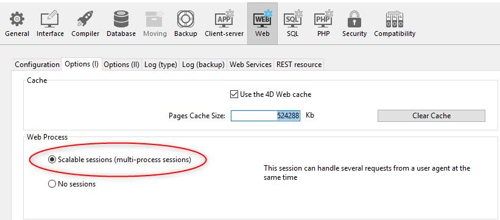

Le serveur Web de 4D offre des fonctions intégrées pour la gestion des **sessions Web**. La création et la maintenance de sessions Web vous permettent de contrôler et d'améliorer l'expérience utilisateur de votre application web. Lorsque les sessions web sont activées, les clients web peuvent réutiliser le même contexte de serveur d'une requête à une autre.

Les sessions Web permettent de :

- gérer simultanément plusieurs requêtes depuis le même client web via un nombre illimité de process préemptifs (les sessions web sont **évolutives**),
- gérer la session à travers un objet `Session` et une [API de session](API/SessionClass.md),
- stocker et partager des données entre les process d'un client web en utilisant le [.storage](../API/SessionClass.md#storage) de la session,
- associer des privilèges à l'utilisateur qui exécute la session.

:::tip Article(s) de blog sur le sujet

[Sessions évolutives pour applications web avancées](https://blog.4d.com/scalable-sessions-for-advanced-web-applications/)

:::

## Utilisations

Les sessions Web sont utilisées par :

- les [applications Web](gettingStarted.md) envoyant des requêtes http (y compris les [Web services SOAP](../commands/theme/Web_Services_Server.md) et les requêtes [/4DACTION](../WebServer/httpRequests.md#4daction)),
- les appels à l'[API REST](../REST/authUsers.md), qui sont effectués par les [datastores distants](../ORDA/remoteDatastores.md) et les [pages Qodly](qodly-studio.md).

## Activation des sessions web

La gestion de session peut être activée et désactivée sur votre serveur Web 4D. Il y a différentes façons d'activer la gestion de session :

- Utiliser l'option **Sessions évolutives** dans la page "Web/Options (I)" des Propriétés (réglage permanent) :
  

Cette option est sélectionnée par défaut dans les nouveaux projets. Elle peut cependant être désactivée en sélectionnant l'option **Pas de sessions**, auquel cas les fonctionnalités de session web sont désactivées (aucun objet `Session` n'est disponible).

- En utilisant la propriété [`.scalableSession`](API/WebServerClass.md#scalablession) de l'objet Web Server (à passer dans le paramètre *settings* de la fonction [`.start()`](API/WebServerClass.md#start) ). Dans ce cas, ce paramètre remplace l'option définie dans la boîte de dialogue Propriétés pour l'objet Web Server (il n'est pas stocké sur disque).

> La commande [`WEB SET OPTION`](../commands-legacy/web-set-option.md) peut également définir le mode de session du serveur Web principal.

Dans tous les cas, ce paramètre est local à la machine ; il peut donc être différent sur le serveur Web 4D Server et les serveurs Web des machines 4D distantes.

> **Compatibilité** : Une option **Anciennes sessions** est disponible dans les projets créés avec une version 4D antérieure à 4D v18 R6 (pour plus d'informations, veuillez consulter le site web [doc.4d.com](https://doc.4d.com)).

## Implémentation des sessions

Lorsque [les sessions sont activées](#enabling-web-sessions), des mécanismes automatiques sont mis en œuvre, sur la base d'un cookie privé défini par 4D lui-même : "4DSID_*AppName*", où *AppName* est le nom du projet d'application. Ce cookie référence la session web courante pour l'application.

:::info

Le nom du cookie peut être obtenu en utilisant la propriété [`.sessionCookieName`](API/WebServerClass.md#sessioncookiename).

:::

1. Dans chaque requête de client web, le serveur Web vérifie la présence et la valeur du cookie privé "4DSID__AppName_".

2. Si le cookie a une valeur, 4D recherche la session qui a créé ce cookie parmi les sessions existantes ; si cette session est trouvée, elle est réutilisée pour l'appel.

3. Si la requête du client ne correspond pas à une session déjà ouverte :

- une nouvelle session avec un cookie privé "4DSID__AppName_" est créée sur le serveur web
- un nouvel objet `Session` Guest est créé et est dédié à la session web évolutive.

:::note

La création d'une session web pour une requête REST peut nécessiter qu'une licence soit disponible, consultez [cette page](../REST/authUsers.md).

:::

L'objet `Session` de la session en cours peut ensuite être manipulé via la commande [`Session`](commands/session.md) dans le code de n'importe quel process web.


:::info

Les process Web ne se terminent généralement pas, ils sont recyclés dans un pool pour des raisons d'optimisation. Lorsqu'un process termine l'exécution d'une requête, il est replacé dans le pool et rendu disponible pour la requête suivante. Comme un process web peut être réutilisé par n'importe quelle session, les [variables process](Concepts/variables.md#process-variables) doivent être effacées par votre code à la fin de son exécution (en utilisant [`CLEAR VARIABLE`](../commands-legacy/clear-variable.md) par exemple). Ce nettoyage est nécessaire pour toute information liée au process, comme une référence à un fichier ouvert. C'est la raison pour laquelle **il est recommandé** d'utiliser l'objet [Session](API/SessionClass.md) lorsque vous souhaitez conserver les informations relatives à la session.

:::

## Stockage et partage des informations de session

Chaque objet `Session` fournit une propriété [`.storage`](API/SessionClass.md#storage) qui est un [objet partagé](Concepts/shared.md). Cette propriété vous permet de partager des informations entre tous les process gérés par la session.

## Durée de vie des sessions

Une session web évolutive est fermée lorsque:

- le serveur web est arrêté,
- le délai d'attente du cookie de session a été atteint.

La durée de vie d'un cookie inactif est de 60 minutes par défaut, ce qui signifie que le serveur Web fermera automatiquement les sessions inactives après 60 minutes.

Ce délai peut être défini en utilisant la propriété [`.idleTimeout`](API/SessionClass.md#idletimeout) de l'objet `Session` (le délai ne peut être inférieur à 60 minutes) ou le paramètre *connectionInfo* de la commande [`Open datastore`](../commands/open-datastore.md).

Lorsqu'une session web est fermée, si la commande [`Session`](commands/session.md) est appelée par la suite :

- l'objet `Session` ne contient pas de privilèges (c'est une session Guest)
- la propriété [`storage`](API/SessionClass.md#storage) est vide
- un nouveau cookie de session est associé à la session

:::info

Vous pouvez fermer une session à partir d'une page Qodly en utilisant la fonction [**logout**](qodly-studio.md#logout).

:::

## Privilèges

Les privilèges sont associés aux sessions utilisateur web. Sur le serveur web, vous pouvez fournir un accès spécifique ou des fonctionnalités en fonction des privilèges de la session.

Vous assignez des privilèges en utilisant la [fonction `.setPrivileges()`](API/SessionClass.md#setprivileges). Dans votre code, vous pouvez vérifier les privilèges de la session pour autoriser ou refuser l'accès à l'aide de la fonction [`.hasPrivilege()`](API/SessionClass.md#hasprivilege). Par défaut, les nouvelles sessions n'ont aucun privilège : ce sont des sessions **Guest** (la fonction [`isGuest()`](API/SessionClass.md#isguest) retourne true).

Voici un exemple :

```4d
If (Session.hasPrivilege("WebAdmin"))
	//Accès autorisé, on ne fait rien
Else
	//Afficher une page d'authentification
End if
```

:::info

Les privilèges sont implémentés au cœur de l'architecture ORDA, fournissant aux développeurs une technologie puissante pour contrôler l'accès aux fonctions du datastore et des dataclass. Pour plus d'informations, veuillez vous reporter à la section [**Privilèges**](../ORDA/privileges.md).

:::

## Exemple

Dans une application CRM, chaque commercial gère son propre portefeuille de clients. Le datastore contient au moins deux dataclass liées : Customers et SalesPersons (un commercial a plusieurs clients).


Nous voulons qu'un(e) commercial(e) s'authentifie, ouvre une session sur le serveur web et que les 3 meilleurs clients soient chargés dans la session.

1. Nous exécutons cette URL pour ouvrir une session :

```
http://localhost:8044/authenticate.shtml
```

> Dans un environnement de production, il est nécessaire d'utiliser une [connexion HTTPS](API/WebServerClass.md#httpsenabled) pour éviter la circulation d'informations non chiffrées sur le réseau.

2. La page `authenticate.shtml` est un formulaire contenant des champs de saisie *userId* et *password* et envoie une action POST 4DACTION :

```html
<!DOCTYPE html>
<html>
<body bgcolor="#ffffff">
<FORM ACTION="/4DACTION/authenticate" METHOD=POST>
	UserId: <INPUT TYPE=TEXT NAME=userId VALUE=""><br/>
	Password: <INPUT TYPE=TEXT NAME=password VALUE=""><br/>
<INPUT TYPE=SUBMIT NAME=OK VALUE="Log In">
</FORM>
</body>
</html>
```


3. La méthode projet d'authentification recherche la personne *userID* et valide le mot de passe par rapport à la valeur hachée déjà stockée dans la table *SalesPersons* :

```4d
var $indexUserId; $indexPassword; $userId : Integer
var $password : Text
var $userTop3; $sales; $info : Object


ARRAY TEXT($anames; 0)
ARRAY TEXT($avalues; 0)

WEB GET VARIABLES($anames; $avalues)

$indexUserId:=Find in array($anames; "userId")
$userId:=Num($avalues{$indexUserId})

$indexPassword:=Find in array($anames; "password")
$password:=$avalues{$indexPassword}

$sales:=ds.SalesPersons.query("userId = :1"; $userId).first()

If ($sales#Null)
    If (Verify password hash($password; $sales.password))
        $info:=New object()
        $info.userName:=$sales.firstname+" "+$sales.lastname
        Session.setPrivileges($info)
        Use (Session.storage)
            If (Session.storage.myTop3=Null)
                $userTop3:=$sales.customers.orderBy("totalPurchase desc").slice(0; 3)

                Session.storage.myTop3:=$userTop3
            End if
        End use
        WEB SEND HTTP REDIRECT("/authenticationOK.shtml")
    Else
        WEB SEND TEXT("This password is wrong")
    End if
Else
    WEB SEND TEXT("This userId is unknown")
End if
```

:::tip Articles de blog sur le sujet

[Sessions évolutives pour applications web avancées](https://blog.4d.com/scalable-sessions-for-advanced-web-applications/)

:::

## Token de session (OTP)

Le serveur web 4D vous permet de générer, de partager et d'utiliser des tokens de session OTP (One-Time Passcode). Les tokens (ou *jetons*) de session OTP sont utilisés pour sécuriser les communications avec des applications ou des sites web tiers. Pour plus d'informations sur OTP, veuillez vous référer à la page [Mot de passe à usage unique](https://en.wikipedia.org/wiki/One-time_password) sur Wikipedia.

Dans 4D, les tokens de session OTP sont utiles pour appeler des URL externes et être rappelé dans un autre navigateur ou appareil (mobile/ordinateur). Généralement, une application tierce envoie un courriel de confirmation contenant un lien de rappel sur lequel l'utilisateur doit cliquer. Le lien de rappel inclut le token OTP, de sorte que la session qui a déclenché le rappel est chargée avec ses données et ses privilèges. Ce principe vous permet de partager la même session sur plusieurs appareils. Grâce à cette architecture, le [cookie de session] (#session-implementation) n'est pas exposé sur le réseau, ce qui élimine le risque d'une attaque de type "man-in-the-middle".

:::tip Articles de blog sur le sujet

[Connectez vos applications Web à des systèmes tiers](https://blog.4d.com/connect-your-web-apps-to-third-party-systems/)

:::

### Vue d’ensemble

La séquence de base de l'utilisaton d'un token de session OTP dans une application web 4D est la suivante :

1. L'utilisateur web initie une action qui nécessite une connexion tierce sécurisée, par exemple une validation, à partir d'une session spécifique.
2. Dans votre code 4D, vous créez un nouvel OTP pour la session à l'aide de la fonction [`Session.createOTP()`](../API/SessionClass.md#createotp).
3. Vous envoyez une requête à l'application tierce avec le token de session inclus dans l'Uri de callback (rappel). Notez que la manière de fournir l'Uri de rappel à une application tierce dépend de son API (voir ci-dessous).
4. L'application tierce renvoie une requête à 4D avec le modèle que vous avez fourni dans l'Uri de rappel.
5. Le rappel de la requête est traité dans votre application.

Par définition, un token OTP ne peut être utilisé qu'une seule fois. Dans ce scénario, si une requête web est reçue avec un token de session comme paramètre qui a déjà été utilisé, la session initiale n'est pas restaurée.

### Traitement de l'OTP dans le callback

Les callbacks d'applications tierces qui incluent le token OTP peuvent être traités de différentes manières dans votre application 4D, en fonction de votre développement et de l'API tierce. En principe, vous avez deux possibilités pour gérer le token : via le paramètre **`$4DSID`** pour un traitement automatique, ou via un paramètre personnalisé que vous devez traiter.

#### Utilisation de `$4DSID` dans l'URL

L'utilisation du paramètre `$4DSID` est la façon la plus simple de traiter un callback de l'application tierce :

- Le token OTP est fourni en tant que paramètre directement dans l'url de callback en utilisant la syntaxe standard `?$4DSID=XXXX123`.
- Dans votre application 4D, vous implémentez un [HTTP Request handler](http-request-handler.md) dédié en utilisant les classes [`IncomingMessage`](../API/IncomingMessageClass.md) et [`OutgoingMessage`](../API/OutgoingMessageClass.md).
- Si le token `$4DSID` est valide, la session de l'utilisateur web concerné est **automatiquement restaurée** dans n'importe quel process web avec son *storage* et ses privilèges.

:::note

Une url [`4DACTION`](./httpRequests.md#4daction) peut également être utilisée du côté 4D.

:::

#### Utilisation d'un paramètre personnalisé

Le token OTP peut également être fourni en tant que paramètre personnalisé que vous devez traiter spécifiquement pour restaurer la session. Vous devez utiliser cette solution si :

- l'application tierce ne permet pas d'insérer des paramètres tels que `$4DSID` directement dans l'Uri de redirection, et fournit une API dédiée (l'implémentation dépend de l'application tierce),
- ou bien vous souhaitez appeler une fonction ORDA via REST pour traiter le callback, auquel cas vous devez transmettre l'OTP avec la [syntaxe des paramètres REST](../REST/ClassFunctions.md#parameters) (par exemple `?$params='["XXX123"]'`).

Dans les deux cas, vous devez extraire le token du paramètre personnalisé et appeler la fonction [`Session.restore()`](../API/SessionClass.md#restore) avec le token en paramètre.

#### Traitement d'un OTP non valide

Le token OTP est considéré comme invalide si :

- le token de session a déjà été utilisé,
- le token de session a expiré,
- le token de session n'existe pas,
- la session d'origine elle-même a expiré.

Dans ce cas, aucune session d'utilisateur Web n'est restaurée et la session courante (s'il y en a une) reste inchangée. En général, vous pouvez décider d'afficher une page de connexion ou d'ouvrir une session guest.

La vérification de la validité du token OTP reçu dépend de la manière dont il a été géré :

- Si vous avez utilisé un `$4DSID`, vous pouvez stocker une propriété d'état personnalisée dans le [storage de la session](../API/SessionClass.md#storage) au moment de la création du token, et vérifier cet état une fois que le token OTP a été reçu pour voir s'il s'agit de la même valeur (voir l'exemple).
- Si vous avez utilisé la fonction [`Session.restore()`](../API/SessionClass.md#restore), elle renvoie true si la session a été correctement restaurée.

### Scénario avec $4DSID

Le scénario utilisant la clé `$4DSID` est illustré dans le diagramme suivant :


La définition du gestionnaire de requêtes HTTP 4D :

```json
[
  {
    "class": "OperationsHandler",
    "method": "handleOperation",
    "regexPattern": "/my4DApp/completeOperation",
    "verbs": "get"
  }
]
```

La classe du singleton :

```4d
//Class OperationsHandler
shared singleton Class constructor()
    function handleOperation($request : 4D.IncomingMessage) 
    $session:=Session
```

### Scénario avec la fonction `restore`

Le scénario utilisant un paramètre personnalisé est illustré dans le diagramme suivant :


La définition du gestionnaire de requêtes HTTP 4D :

```json
[
  {
    "class": "OperationsHandler",
    "method": "handleOperation",
    "regexPattern": "/my4DApp/completeOperation",
    "verbs": "get"
  }
]
```

La classe du singleton :

```4d
//Class OperationsHandler
shared singleton Class constructor()
    Function handleOperation($req : 4D.IncomingMessage) : 4D.OutgoingMessage
    Session.restore($req.urlQuery.state)
```

### Exemple de validation d'email avec $4DSID

1. Un compte d'utilisateur est créé dans une dataclass *Users*. Un objet *$info* est reçu avec l'email et le mot de passe. Un OTP correspondant à la session courante est généré. Une URL est alors renvoyée avec l'OTP indiqué dans le paramètre $4DSID.

```4d
//cs.Users class

Function create($info : Object) : Text
	
var $user : cs.UsersEntity
var $status : Object
var $token : Text
	
$user:=This.new() //créatoin d'un user
$user.fromObject($info)
$status:=$user.save()
	
//Stockage d'information dans la session
//y compris le statut de création de l'utilisateur
Use (Session.storage)
	Session.storage.status:=New shared object("step"; "Waiting for validation email"; /
    "email"; $user.email; "ID"; $user.ID)
End use 
	
//Génération d'un OTP correspondant à la session
$token:=Session.createOTP()

// Renvoi d'un URL avec un paramètre $4DSID
return "https://my.server.com/tools/validateEmail?$4DSID="+$token`

```

2. L'utilisateur reçoit cette URL sous la forme d'un lien dans un courrier électronique. Le préfixe d'URL `/validateEmail` est traité par un [gestionnaire de requête HTTP personnalisé](./http-request-handler.md) :

```json
[
  {
    "class": "RequestHandler",
    "method": "validateEmail",
    "regexPattern": "/validateEmail",
    "verbs": "get"
  }
]
```

La fonction *validateEmail()* du singleton RequestHandler :

```4d
//validateEmail class

shared singleton Class constructor()

Function validateEmail() : 4D.OutgoingMessage
	
 var $result:=4D.OutgoingMessage.new()
    //La session qui a généré l'OTP est restaurée 
    //grâce au paramètre $4DSID fourni dans l'URL
 If (Session.storage.status.step="Waiting for validation email")
	
  $user:=ds.Users.get(Session.storage.status.ID)
  $user.emailValidated() //fixé à vrai
		
  $result.setBody("Congratulations <br>"\
  +"Your email "+Session.storage.status.email+" has been validated")
		
  $result.setHeader("Content-Type"; "text/html"	
  Use (Session.storage.status)
	Session.storage.status.step:="Email validated"
  End use
 Else
  $result.setBody("Invalid token")

 End if 
	
 return $result

```

Comme le paramètre `$4DSID` contient un OTP valide correspondant à la session d'origine, l'objet `Session` référence la session qui a créé l'OTP.

Un nouvel utilisateur est créé et des informations sont stockées dans la session, en particulier l'étape courante du processus de création du compte utilisateur (attente du courriel de validation) et l'identifiant de l'utilisateur.

### Contextes pris en charge

- Les schémas HTTP et HTTPS sont tous deux pris en charge.
- Seules des [sessions évolutives](#enabling-web-sessions) peuvent être réutilisées avec des tokens.
- Seules les sessions de la base de données hôte peuvent être réutilisées (les sessions créées dans les serveurs web des composants ne peuvent pas être restaurées).
- Les tokens ne sont pas pris en charge dans les sessions client/serveur ou les sessions mono-utilisateur.

### Durée de vie

Un token de session a une durée de vie, et la session elle-même a une durée de vie. La durée de vie du token de session peut être définie [lors de sa création](../API/SessionClass.md#createotp). Par défaut, la durée de vie du token est la même que la valeur [`.idleTimeout`](../API/SessionClass.md#idletimeout).

Une session n'est restaurée par un token que si ni la durée de vie du token de session ni celle de la session n'ont expiré. Dans les autres cas (le token de session a expiré et/ou la session elle-même a expiré), une session *guest* est créée lorsqu'une requête web avec un token de session est reçue.


