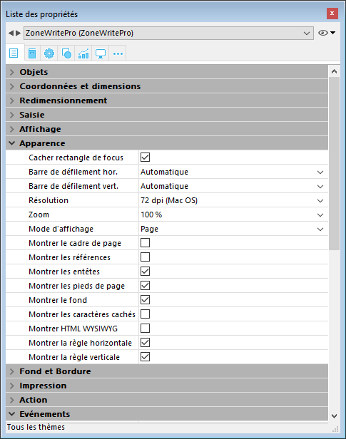
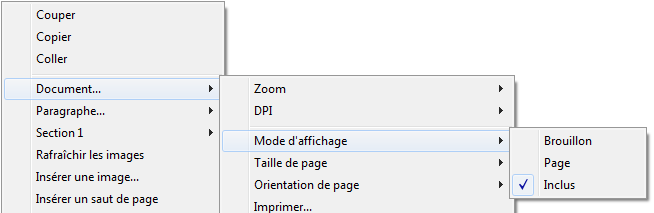

## Glisser-déposer 

Pour configurer les fonctionnalités de glisser-déposer dans vos zones 4D Write Pro, vous devez sélectionner les options appropriées dans le thème "Action" de la Liste des propriétés :

Les zones 4D Write Pro prennent en charge deux modes de glisser-déposer :

* **Mode personnalisé :**  lorsque seules les options "Glissable" et "Déposable" sont cochées.  
Dans ce mode, vous pouvez sélectionner du texte et commencer à le déplacer. La méthode objet est alors appelée avec l'événement [On Begin Drag Over](../../Events/onBeginDragOver.md), et vous pouvez alors définir l'action de déposer via du code personnalisé.  
* **Mode automatique :**  lorsque toutes les options sont cochées ("Glissable", "Déposable", "Glisser automatique" et "Déposer automatique"). Dans ce mode, Vous pouvez automatiquement déplacer ou copier (en maintenant la touche **Alt/Option**) le texte sélectionné. L'événement [On Begin Drag Over](../../Events/onBeginDragOver.md) n'est pas généré.

**Note :** Sélectionner uniquement les options "Glisser automatique" et "Déposer automatique" n'aura pas d'effet sur la zone 4D Write Pro. 

## Les propriétés d'affichage 

Les propriétés de vue des documents 4D Write Pro sont accessibles dans la Liste des propriétés pour les zones 4D Write Pro. Elles vous permettent de définir la façon dont un document sera visualisé par défaut dans cette zone. Ces propriétés définissent, par exemple, si les documents 4D Write Pro doivent être affichés en vue "impression" ou en vue "Web". Vous pouvez définir différentes vues pour un document 4D Write Pro dans le même formulaire.

**Note :** Les propriétés de vue peuvent être gérées dynamiquement à l'aide des commandes [WP FIXER PROPRIETES VUE](../commands/wp-fixer-proprietes-vue) et [WP Lire proprietes vue](../commands/wp-lire-proprietes-vue).

Les propriétés de vue des documents sont gérées via des options spécifiques dans le thème **Apparence** de la Liste des propriétés pour les objets de formulaire 4D Write Pro :

* **Résolution** : Définit la résolution écran pour le contenu de la zone 4D Write Pro. Par défaut, elle est fixée à **72 dpi (Mac OS)**, qui est la résolution standard des formulaires 4D sur toutes les plates-formes. Définir une valeur de dpi fixe permet d'obtenir un rendu de document identique sur les plates-formes Mac OS et Windows. L'option Automatique adapte la résolution à la plate-forme courante, ce qui signifie que le rendu du document sera différent entre les plates-formes Mac OS et Windows.
* **Zoom** : Définit le pourcentage de zoom pour l'affichage du contenu de la zone 4D Write Pro area.
* **Mode d'affichage** : Définit le type de vue à utiliser pour l'affichage du document 4D Write Pro dans la zone du formulaire. Trois modes sont disponibles :  
   * **Page** : vue la plus complète, incluant le cadre de page, l'orientation, les marges, les sauts de page, les en-têtes et les pieds de page, etc. Pour plus d'informations, veuillez vous reporter au paragraphe *Fonctionnalités de l'affichage en page*.  
   * **Brouillon** : mode brouillon avec des propriétés de document basiques.  
   * **Inclus** : mode adapté aux zones incluses ; les marges, en-têtes, pieds de pages, cadre de page, etc. ne sont pas affichés.  
   Ce mode permet également d'obtenir une vue "Web" (en l'associant à la résolution **96 dpi** et à l'option **Montrer HTML WYSIWYG**).  
         
   **Note** : La propriété **Mode d'affichage** est utilisée uniquement pour le rendu écran. Pour l'impression, des règles de rendu spécifiques sont automatiquement mises en oeuvre (cf. *Imprimer des documents 4D Write Pro*).
* **Montrer le cadre de page** : Affiche/masque les limites des pages lorsque le mode d'affichage est "Page".
* **Montrer les références** : Affiche en tant que *références* toutes les formules (ou expressions) 4D insérées dans le document (voir *Gérer des formules*). Lorsque cette option est désélectionnée, les formules 4D sont affichées en tant que *valeurs*.  
**Note** : Les références aux formules peuvent être affichées sous forme de symboles (voir ci-dessous).
* **Montrer les entêtes / pieds de page** : Affiche/masque les en-têtes et les pieds de page lorsque le mode d'affichage est "Page". Pour plus d'informations sur les en-têtes et les pieds de page, veuillez vous reporter à la section *Utiliser une zone 4D Write Pro*.
* **Montrer le fond et les éléments ancrés** : Affiche/masque les images de fond, les couleurs de fond, les images ancrées et les zones de texte.
* Montrer les caractères cachés : Affiche/masque les caractères invisibles.
* **Montrer HTML WYSIWYG** : Active/désactive la vue WYSIWYG HTML, dans laquelle les attributs 4D Write Pro avancés qui ne sont pas compatibles avec tous les navigateurs sont supprimés.
* **Montrer la règle horizontale** : Affiche/masque la règle horizontale dans le document. Pour plus d'informations sur les règles dans 4D Write Pro, reportez-vous à la section *Utiliser les règles*.
* **Montrer la règle verticale :** Affiche/masque la règle verticale lorsque le document est en mode Page. Pour plus d'informations sur les règles dans 4D Write Pro, reportez-vous à la section *Utiliser les règles*.
* **Montrer les images vides ou non prises en charge :** Affiche/masque un rectangle noir pour les images qui ne peuvent pas être chargées ou calculées (images vides ou dans un format non pris en charge). Pour plus d'informations, consultez la section *Empty pictures*.
* **Afficher la formule source avec un symbole :** Affiche le texte source des formules sous forme de symboles  lorsque les expressions sont affichées comme références (voir ci-dessus). L'affichage des formules sous forme de symboles rend les documents de modèle plus compacts et plus wysiwyg(Ce que vous voyez est ce que vous obtenez).

## Menu contextuel 

Lorsque la propriété **Menu contextuel** est [cochée pour une zone 4D Write Pro](./defining-a-4d-write-pro-area.md#using-the-4d-write-pro-area-object), un menu contextuel complet est disponible pour les utilisateurs lorsque le formulaire est lancé à l'exécution :

 

Ce menu donne accès à l'ensemble des fonctions de 4D Write Pro.

## Sélectionner le mode d'affichage 

4D Write Pro propose trois modes d'affichage pour les documents :

* **Brouillon** : Mode brouillon avec des propriétés basiques
* **Page** (défaut) : Mode "vue impression"
* **Inclus** : Mode adapté aux zones incluses dans les formulaires ; dans ce mode, les marges, pieds de page, colonnes, en-têtes, cadres, etc, ne sont pas affichés.  
Ce mode peut également être utilisé pour obtenir un affichage de type Web (si vous avez également sélectionné la résolution 96 dpi et l'option HTML WYSIWYG).

Le mode d'affichage peut être configuré via le menu contextuel de la zone :

**Note :** Le mode d'affichage n'est pas stocké avec le document.

Pour les zones incluses dans les formulaires 4D, le mode d'affichage peut également être défini par défaut à l'aide de la Liste des propriétés. Dans ce cas, le mode d'affichage est une propriété de l'objet de formulaire 4D Write Pro (pour plus d'informations, veuillez vous reporter au paragraphe *Configurer les propriétés d'affichage*).

