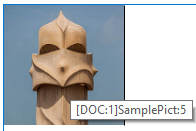

## Ajouter des images 

Ajouter des images dans un document 4D Write Pro peut se faire de multiples façons et dépend de vos besoins :

* pour ajouter une **image d'arrière-plan**, utilisez l'attribut wk background image ou wk background image url avec la commande [WP FIXER ATTRIBUTS](../commands/wp-fixer-attributs)
* pour ajouter une **image en ligne**, *i.e.* insérée dans le texte comme un caractère, utilisez la commande [WP INSERER IMAGE](../commands/wp-inserer-image) ou la commande [ST INSERER EXPRESSION](../../commands/st-inserer-expression)
* pour ajouter une **image ancrée** dans la page (derrière ou devant le texte), utilisez la commande [WP Ajouter image](../commands/wp-ajouter-image).

La façon dont vous ajoutez une image détermine la couche où elle est positionnée, comme le montre le diagramme ci-dessous :


## Images en arrière-plan 

Des images peuvent être mises en place en tant qu'arrière-plan de documents 4D Write Pro ou de partie du document (tableau, paragraphe, sections, en-têtes/pieds, etc.).

Voici un exemple montrant deux façons différentes d'utiliser une image comme arrière-plan d'un document :

>    

Les images d'arrière-plan peuvent être placées soit par programmation, soit via le menu contextuel. Pour plus d'informations, voir la section *Fond* dans l'article *Utiliser une zone 4D Write Pro*.

L'affichage de l'image d'arrière-plan peut également être défini par programmation ou via le menu contextuel. A noter que les valeurs du mode d'affichage en arrière-plan définissent des préréglages des paramètres d'arrière-plan, comme indiqué dans la description de la constante :

| Constante                | Comment                                                                                                                                                                                                                                                                                                                                                                                                                                                                                                                                                                                    |
| ------------------------ | ------------------------------------------------------------------------------------------------------------------------------------------------------------------------------------------------------------------------------------------------------------------------------------------------------------------------------------------------------------------------------------------------------------------------------------------------------------------------------------------------------------------------------------------------------------------------------------------ |
| wk proportional          | Lorsqu'elle est utilisée comme valeur de wk image display mode, l'image est alignée en haut à gauche de la zone de contenu, non répliquée, mise à l'échelle pour s'adapter à la zone de contenu, et conserve son rapport hauteur/largeur. Lorsqu'elle est utilisée comme valeur de wk background display mode, elle prédéfinit les attributs suivants : wk background width \= "contain" wk background height \= "auto" wk background repeat \= wk no repeat wk background origin \= wk padding box wk background position horizontal \= wk left wk background position vertical \= wk top |
| wk proportional centered | Lorsqu'elle est utilisée comme valeur de wk image display mode, l'image est centrée dans la zone de contenu, non répliquée, mise à l'échelle pour s'adapter à la zone de contenu, et conserve son rapport hauteur/largeur. Lorsqu'elle est utilisé comme valeur de wk background display mode, elle prédéfinit les attributs suivants : wk background width \= "contain" wk background height \= "auto" wk background repeat \= wk no repeat wk background origin \= wk padding box wk background position horizontal \= wk center wk background position vertical \= wk center            |
| wk replicated            | Lorsqu'elle est utilisée comme valeur de wk image display mode, l'image est alignée en haut à gauche de la zone de contenu, répliquée, et conserve sa taille d'origine. Lorsqu'elle est utilisée comme valeur de wk background display mode, elle prédéfinit les attributs suivants : wk background width \= "auto" wk background height \= "auto" wk background repeat \= wk repeat wk background origin \= wk padding box wk background position horizontal \= wk left wk background position vertical \= wk top                                                                         |
| wk replicated centered   | Lorsqu'elle est utilisée comme valeur de wk image display mode, l'image est centrée dans la zone de contenu, répliquée, et conserve sa taille d'origine. Lorsqu'elle est utilisée comme valeur de wk background display mode, elle prédéfinit les attributs suivants : wk background width \= "auto" wk background height \= "auto" wk background repeat \= wk repeat wk background origin \= wk padding box wk background position horizontal \= wk center wk background position vertical \= wk center                                                                                   |
| wk scaled to fit         | Lorsqu'elle est utilisée comme valeur de wk image display mode, l'image est mise à l'échelle pour s'adapter à la zone de contenu et n'est pas répliquée. Lorsqu'elle est utilisée comme valeur de wk background display mode, elle prédéfinit les attributs suivants : wk background width \= "100%" wk background height \= "100%" wk background repeat \= wk no repeat wk background origin \= wk padding box wk background position horizontal \= wk left wk background position vertical \= wk top                                                                                     |
| wk truncated             | Lorsqu'elle est utilisée comme valeur de wk image display mode, l'image est alignée en haut à gauche de la zone de contenu, non répliquée, et conserve sa taille d'origine. Lorsqu'elle est utilisée comme valeur de wk background display mode, elle prédéfinit les attributs suivants : wk background width \= "auto" wk background height \= "auto" wk background repeat \= wk no repeat wk background origin \= wk padding box wk background position horizontal \= wk left wk background position vertical \= wk top                                                                  |
| wk truncated centered    | Lorsqu'elle est utilisée comme valeur de wk image display mode, l'image est centrée dans la zone de contenu, non répliquée, et conserve sa taille d'origine. Lorsqu'elle est utilisée comme valeur de wk background display mode, elle prédéfinit les attributs suivants : wk background width \= "auto" wk background height \= "auto" wk background repeat \= wk no repeat wk background origin \= wk padding box wk background position horizontal \= wk center wk background position vertical \= wk center                                                                            |

## Positionnement et affichage des images ancrées 

Les images ancrées sont ajoutées avec une position absolue, devant/derrière le texte, et ancrées à la page ou à des parties spécifiques d'un document (*i.e.*, en-tête, pied de page, section). La définition d'une position absolue pour une image se fait grâce aux commandes [WP Ajouter image](../commands/wp-ajouter-image) et [WP FIXER ATTRIBUTS](../commands/wp-fixer-attributs).

Les positions d'images ancrées peuvent être modifiées avec les attributs spécifiques et / ou les actions standard suivants :  

| **Propriété (constante)**   | **Action standard**     |
| --------------------------- | ----------------------- |
| wk anchor layout            | *anchorLayout*          |
| wk anchor horizontal offset |                         |
| wk anchor horizontal align  | *anchorHorizontalAlign* |
| wk anchor vertical offset   |                         |
| wk anchor vertical align    | *anchorVerticalAlign*   |
| wk anchor origin            | *anchorOrigin*          |
| wk anchor page              | *anchorPage*            |
| wk anchor section           | *anchorSection*         |
| | *moveToBack*              |                         |
| | *moveToFront*             |                         |

Les images ancrées supportent l'habillage automatique du texte lorsqu'elles sont ancrées dans un document avec des options telles que à gauche, à droite, sur le plus grand côté, au-dessus et au-dessous, ou tout autour, fournies par la propriété wk anchor layout ou l'action standard **anchorLayout**. Consultez cet [article de blog](https://blog.4d.com/fr/4d-write-pro-more-display-options-for-anchored-pictures-and-text-boxes/) pour plus de détails.


Les images avec habillage ancrées dans le corps de la page n'affectent pas l'en-tête ou le pied de page (l'image est affichée devant l'en-tête ou le pied de page) ; au contraire, les images ancrées dans l'en-tête et le pied de page affectent le corps de la page si elles le chevauchent.

**Note :** Si vous souhaitez ancrer une image avec habillage de texte à l'en-tête ou au pied de page, vous devez également définir l'alignement vertical de l'image sur le haut.

Les images ancrées sont affichées uniquement en mode Page. Elles ne sont pas affichées si :

* elles sont ancrées à un en-tête ou un pied de page qui n'est pas visible ;
* le mode d'affichage est le mode Brouillon ;
* elles sont centrées ou ancrées aux sections, et l'option **Afficher HTML WYSIWYG** est cochée ;
* l'option "Afficher l'arrière-plan" n'est pas sélectionnée.

## Expressions image 

Vous pouvez insérer des expressions 4D qui retournent des images dans vos zones 4D Write Pro. Les expressions peuvent être des variables, champs, méthodes projet, attributs d'objets ou éléments de collections.

Vous pouvez visualiser la référence d'une expression dans l'infobulle de l'image(\*) :



(\*)Comme il n'y a pas de texte associé à une image ancrée, une référence d'expression ne peut pas être affichée.

Tous les attributs d'images peuvent être appliqués aux expressions image (les attributs wk image et wk image url peuvent uniquement être lus). Notez cependant que, comme les images ont des attributs spécifiques, 4D Write Pro doit évaluer l'expression au moins une fois pour détecter que son résultat est une image et pouvoir la traiter comme expression image. Cela signifie que lorsqu'une expression image est insérée avec [WP INSERER FORMULE](../commands/wp-inserer-formule), [WP CALCULER FORMULES](../commands/wp-calculer-formules) doit être appelée avant d'appliquer le moindre attribut d'image.

Si l'image résultant de l'expression ne peut pas être calculée ou chargée, 4D Write Pro affiche un cadre d'image par défaut noir :


**Note** : Comme les autres expressions, les expressions image sont aussi impactées par les commandes [WP CALCULER FORMULES](../commands/wp-calculer-formules) et [WP FIGER FORMULES](../commands/wp-figer-formules).

### Images ancrées 

Les expression image ancrées sont ajoutées à l'aide la commande [WP Ajouter image](../commands/wp-ajouter-image) (sans le second paramètre), suivie par un appel à la commande [WP FIXER ATTRIBUTS](../commands/wp-fixer-attributs) avec le sélecteur wk image formule.

Exemple :

```4d
 obImage:=WP Ajouter image(myDoc)
 WP FIXER ATTRIBUTS(obImage;wk image formule;Formule(m_buildPict))
```

Vous pouvez aussi insérer des expressions image en utilisant [WP FIXER ATTRIBUTS](../commands/wp-fixer-attributs) et wk image formule sur des images ancrées existantes.

**Note de compatibilité :** wk image expression peut toujours être utilisée pour définir des expressions image via du texte. Toutefois, il est recommandé d'utiliser wk image expression et des objets.

L'appel de la commande [WP REINITIALISER ATTRIBUTS](../commands/wp-reinitialiser-attributs) avec wk image formule est similaire à l'appel de [WP FIGER FORMULES](../commands/wp-figer-formules) (sur le document entier) dans la mesure où l'expression est effacée de l'attribut image. Cependant, [WP FIGER FORMULES](../commands/wp-figer-formules) calcule l'expression avant de l'effacer, contrairement à [WP REINITIALISER ATTRIBUTS](../commands/wp-reinitialiser-attributs). Si une expression n'a jamais été calculée, le cadre d'image par défaut noir est affiché.

### Images en ligne 

Les expressions image en ligne sont ajoutées dans vos zones 4D Write Pro à l'aide de la commande [WP INSERER FORMULE](../commands/wp-inserer-formule).

Exemples :

```4d
  //Insertion d'une variable image
 ST INSERER FORMULE(wpRange;Formule($vpict);wk prepend)
 
  //Insertion d'un champ
 ST INSERER FORMULE(wpRange;Formule([DOC]SamplePict);wk prepend)
 
  //Insertion d'une méthode 4D
 ST INSERER FORMULE(wpRange;Formule(M_ComputeChart);wk prepend)
```

### Images vides 

Si une image est vide (par exemple, elle n'a pas pu être chargée, elle résulte d'une expression qui n'a pas pu être calculée ou elle utilise un format d'image non pris en charge), 4D Write Pro affiche par défaut un cadre rectangulaire noir :


Vous pouvez supprimer ces rectangles noirs de la vue actuelle à l'aide de :

*  l'option "Show empty or unsupported images" de la liste des propriétés (voir *Configuring View properties*), ou
* la commande [WP SET VIEW PROPERTIES](../commands/wp-set-view-properties) avec le wk visible empty images selector,  ou
* l'action standard *visibleEmptyImage* (voir  *Using 4D Write Pro standard actions*).

Vous pouvez également utiliser le wk visible empty images selector avec les commandes [WP EXPORT DOCUMENT](../commands/wp-export-document) et [WP EXPORT VARIABLE](../commands/wp-export-variable) pour supprimer les rectangles noirs du contenu exporté.

Notez que lorsque cette option est activée, les éléments d'image manquants ne s'affichent pas, même s'ils ont des bordures, une largeur, une hauteur ou un arrière-plan. Cela peut avoir un impact sur la mise en page des images intégrées.


## Propriétés des images 

Toutes les images ont des propriétés (attributs) telles que la hauteur, la largeur, les bordures, le mode d'affichage, etc., qui peuvent être lues ou fixées via le langage 4D Write Pro ([WP LIRE ATTRIBUTS](../commands/wp-lire-attributs) et [WP FIXER ATTRIBUTS](../commands/wp-fixer-attributs)) ou les actions standard.

* La liste complète des propriétés utilisables pour les images est disponible sur la page *Attributs 4D Write Pro*.
* La section *Image* contient les attributs spécifiques aux images seules.
* La page *Utiliser les actions standard 4D Write Pro* liste aussi les propriétés image disponibles.

### Référence d'image ou URL d'image 

Vous pouvez travailler avec des références d'images (variable, champ ou expression image) ou des URLs d'images (texte contenant l'adresse locale ou réseau de l'image).

Deux ensembles d'attributs vous permettent de définir si vous voulez fixer ou lire une référence ou un URL d'image :

* wk image, wk background image, wk list style image : pour lire ou fixer des références d'images.  
Lorsque vous lisez une image à l'aide d'un de ces attributs, vous recevez une image 4D quelle que soit la manière dont l'image a été initialement définie.
* wk image url, wk background image url, wk list style image url : pour lire ou fixer des URLs d'images.  
Lorsque vous lisez une image à l'aide d'un de ces attributs, vous recevez un texte. Si l'image a été définie via une référence (par exemple une variable image), vous recevez un URI local suivi de l'image encodée en Base64.

**Exemple :**

```4d
 $range:=WP Lire selection(WPArea) //lire l'image sélectionnée par l'utilisateur
 $range:=WP Plage images($range) //creer une plage
 $url:="http://doc.4d.com/image/logo/poweredby4D_web.png"
 
 WP FIXER ATTRIBUTS($range;wk image;$url) //définir une image via un URL
 
  //lire l'image
 C_IMAGE(vPictureGet)
 WP LIRE ATTRIBUTS($range;wk image;vPictureGet) //vPictureGet contient une image
 C_TEXTE(vPictureURLGet)
 WP LIRE ATTRIBUTS($range;wk image url;vPictureURLGet) //vPictureURLGet=$url
```

## Récupérer des images 

Les commandes ci-dessous peuvent être utilisées pour récupérer des images :

* [WP Plage images](../commands/wp-plage-images) \- s'applique uniquement aux images en ligne
* [WP Plage selection](../commands/wp-plage-selection) \- s'applique uniquement aux images sélectionnées par l'utilisateur

## Supprimer des images 

Vous pouvez supprimer des images en ligne et ancrées à l'aide de : 

* *Actions souris / clavier*
* la commande [WP SUPPRIMER IMAGE](../commands/wp-supprimer-image)

## Actions souris / clavier 

Les images peuvent être manipulées via la souris ou le clavier. Les actions disponibles incluent :

* **Sélectionner**  
   * Les images en avant-plan peuvent être sélectionnées en cliquant dessus ;  
   * Les images d'arrière-plan peuvent être sélectionnées avec CTRL+ clic (Windows) ou COMMAND+clic (Mac) ;  
   * Une seule image avec une position absolue peut être sélectionnée à la fois : la sélection multiple n'est pas possible.
* **Déplacer**  
   * Les images peuvent être déplacées et redimensionnées à l'aide de la souris. (Les images en ligne ne peuvent pas être déplacées en dehors du document).
* **Insérer**  
   * Si des images avec position absolue sont collées en mode Brouillon, elles sont affichées en ligne au début de la sélection courante au clavier.
* **Couper/Coller/Copier**  
   * Les images peuvent être copiées dans le presse-papiers, ou coupées/collées, lorsqu'elles sont sélectionnées.  
   * Coller une image avec une position absolue en mode Page, collera l'image dans la première page sélectionnée et l'ancrera à cette page, quels que soient les paramètrages d'ancrage de la page d'origine ; les images collées conserveront leurs décalages (offsets), sauf si elles sont collées dans un mode différent de celui d'origine (par exemple, si l'image est copiée en mode Page et collée en mode Inclus, les décalages sont réinitialisés à 0).
* Supprimer \- Les images peuvent être supprimées lorsqu'elles sont sélectionnées avec :  
   * la touche SUPPRIMER, ou  
   * le raccourci-clavier pour l'action Effacer