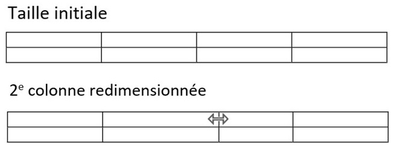
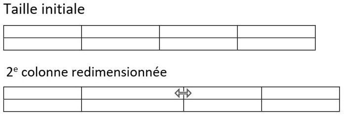
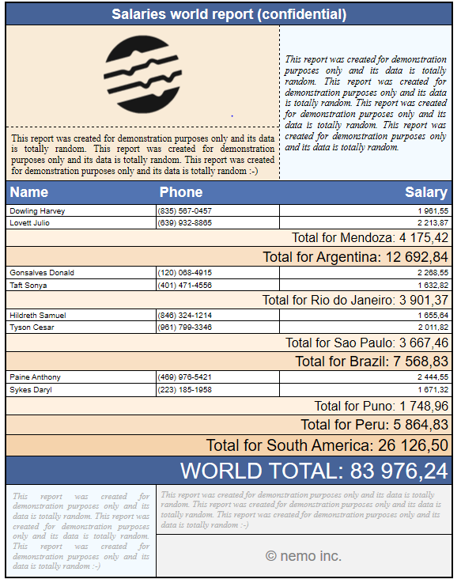
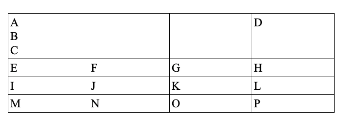
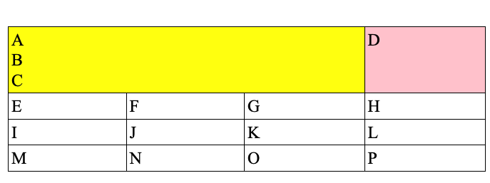
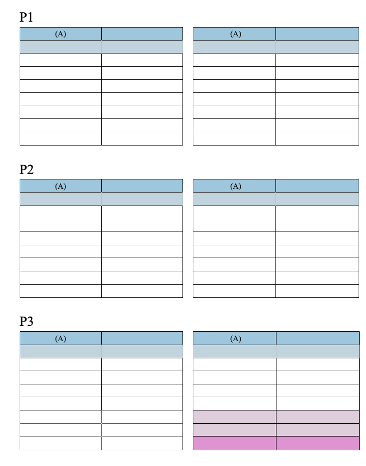
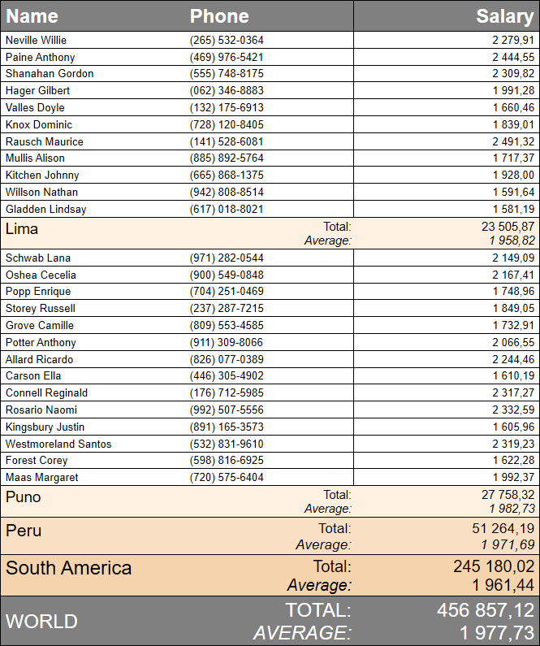
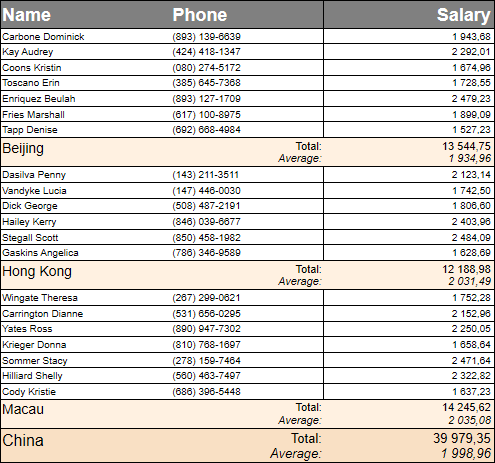

Les documents 4D Write Pro peuvent contenir des tableaux. Les tableaux 4D Write Pro sont créés et construits par programmation, mais leur contenu peut être modifié et géré par l'utilisateur. Plusieurs attributs de tableau 4D Write Pro peuvent être définis, notamment la hauteur de ligne, l'alignement, les marges, le style de texte, la couleur, ou encore les bordures.


**Note :** Comme les tableaux de 4D Write Pro peuvent être remplis par programmation, ils peuvent contenir un grand nombre de colonnes et de lignes. Gardez à l'esprit que de très grands tableaux peuvent avoir un impact sur les performances, surtout s'ils sont affichés à l'écran. Voir aussi [cet article de blog](https://blog.4d.com/4d-write-pro-tables-without-limit) pour plus d'informations.

## Créer un tableau 

Pour créer un tableau 4D Write Pro, vous devez appeler la commande [WP Inserer tableau](../commands/wp-inserer-tableau). Vous pouvez ensuite ajouter des lignes à l'aide de la commande [WP Tableau ajouter ligne](../commands/wp-tableau-ajouter-ligne).

**Note :** L'utilisateur peut créer un tableau par copier-coller d'une plage de cellules :   


## Modifier les tableaux 

Le contenu des cellules peut être ajouté par programmation à l'aide de la commande [WP Tableau ajouter ligne](../commands/wp-tableau-ajouter-ligne).

Une fois qu'un tableau est créé, le contenu des cellulles peut également être modifié à l'exécution par l'utilisateur. Il peut cliquer dans les cellules, puis sélectionner, modifier, copier/coller ou supprimer le texte et les images comme dans tout paragraphe. Il peut naviguer parmi les cellules en appuyant sur la touche **Tabulation** (**Maj+Tabulation** pour se déplacer dans la direction inverse).

Utiliser la touche **Retour chariot** dans une cellule crée un nouveau paragraphe dans la cellule.

Notez que la largeur des cellules est fixe : lorsque l'utilisateur saisit du texte ou colle une image, la hauteur de la ligne est automatiquement ajustée si nécessaire et le texte passe automatiquement à la ligne :


Les utilisateurs peuvent également sélectionner des colonnes, des lignes ou des cellules et appliquer divers attributs relatifs au style de texte, aux couleurs, alignements etc., via le pop up menu intégré ou une interface personnalisée. 4D Write Pro fournit plusieurs commandes permettant de sélectionner toutes les parties d'un tableau :

* [WP Tableau lire lignes](../commands/wp-tableau-lire-lignes) pour obtenir une plage de lignes
* [WP Tableau lire colonnes](../commands/wp-tableau-lire-colonnes) pour obtenir une plage de colonnes(\*)
* [WP Tableau lire cellules](../commands/wp-tableau-lire-cellules) pour obtenir une plage de cellules

(\*) Les colonnes n'ont pas d'équivalent en html. Dans 4D Write Pro, une plage de colonne est en réalité une plage de cellules, ce qui signifie que les colonnes ont la même priorité que les cellules (cf. ci-dessous).

Une fois que vous avez sélectionné une plage, vous pouvez lui appliquer un attribut à l'aide de la commande [WP FIXER ATTRIBUTS](../commands/wp-fixer-attributs). A l'intérieur des cellules, les attributs sont appliqués aux paragraphes, caractères ou images, suivant leur contenu. Par exemple, vous pouvez définir la hauteur, la taille de police, la bordure, la marge intérieure etc. d'un tableau ou des cellules d'un tableau (pour plus d'informations, veuillez vous référer à la section *Attributs 4D Write Pro*).

Lorsque des attributs différents sont appliqués à des éléments concurrents d'un tableau, l'ordre de priorité suivant est utilisé pour le rendu :

1. Le tableau est dessiné en premier
2. Les lignes sont ensuite dessinées (écrasant les attributs du tableau)
3. Les cellules/colonnes sont ensuite dessinées (écrasant les attributs des lignes).

### Redimensionner les colonnes 

La largeur des colonnes du tableau peut être modifiée en faisant glisser le séparateur de colonne vers la gauche ou la droite. Le curseur change pour indiquer qu'il peut être déplacé horizontalement et une ligne verticale apparait dans la règle : 


Le redimensionnement des colonne génère un événement formulaire Sur après modification.

Pour redimensionner une colonne, cliquez sur le séparateur de colonnes et glissez-le vrs la gauche ou la droite. La taille minimale d'une colonne est de 8 points. Si la colonne adjacente située à droite atteint la plus petite taille, toutes les colonnes de droite seront déplacées. Si la première colonne ou une colonne adjacente située à gauche atteint la plus petite taille, aucun redimensionnement ne peut s'effectuer dans cette direction.

  


Si vous appuyez sur la touche **Shift** tout en redimensionnant une colonne, la taille de la colonne adjacente de droite ne sera pas modifiée.

  


**Note** : La propriété Saisissable doit être activée pour que le document 4D Write Pro autorise le redimensionnement des colonnes.

### Fusionner et fractionner des cellules 

Avec 4D Write Pro, vous pouvez fusionner et fractionner des cellules dans un tableau. La fusion de cellules consiste à combiner deux ou plusieurs cellules de tableau adjacentes situées sur la même ligne ou colonne en une seule cellule. La division de cellules consiste à prendre des cellules déjà fusionnées et à les fusionner en plusieurs cellules adjacentes sur la même ligne ou colonne. Les cellules peuvent être fusionnées à l'aide de la commande [WP TABLE MERGE CELLS](../commands/wp-table-merge-cells) ou de l'action standard **cell/merge**, et fractionnées à l'aide de la commande [WP TABLE SPLIT CELLS](../commands/wp-table-split-cells) ou de l'action standard **cell/split**.



Les cellules du tableau peuvent être fusionnées :


**Exemple de fusion de cellules à l'aide du langage :**

1. Désignez une plage de cellules à fusionner dans votre tableau. Les cellules doivent être adjacentes horizontalement, verticalement, ou les deux.
2. Appelez la commande [WP TABLE MERGE CELLS](../commands/wp-table-merge-cells) sur la plage sélectionnée.

```4d
 $cells:=WP Table get cells($table;1;1;3;1)
 WP TABLE MERGE CELLS($cells)
  //or
 WP TABLE MERGE CELLS($table;1;1;3;1)
```

Les données existantes dans les cellules initiales sont concaténées dans la cellule fusionnée résultante.

Avant


Après   


**Exemple de fractionnement de cellules à l'aide du langage :**

1. Désignez une plage de cellules à fractionner dans votre tableau. La plage sélectionnée doit contenir des cellules déjà fusionnées.
2. Appeler la commande [WP TABLE SPLIT CELLS](../commands/wp-table-split-cells) sur la plage sélectionnée.

```4d
 $cells:=WP Table get cells($table;1;1;1;1)
 WP TABLE SPLIT CELLS($cells)
  //or
 WP TABLE SPLIT CELLS($table;1;1;1;1)
```

Les données de la cellule déjà fusionnée sont toutes conservées dans la première cellule résultante (en haut à gauche) après le fractionnement, les autres cellules résultantes du fractionnement restent vides.

Avant


Après   


**Important** : 

* Toute cellule appartenant à une ligne spéciale (lligne de données, ligne de rupture ou ligne à reporter en bas) ne peut pas être fusionnée verticalement.
* Les cellules appartenant aux lignes d'en-tête peuvent être fusionnées verticalement uniquement si elles appartiennent toutes à d'autres lignes d'en-tête (elles ne peuvent pas être fusionnées avec des lignes qui ne sont pas des en-têtes et qui suivent les lignes d'en-tête).

**Désignation des cellules fusionnées :**

Une cellule fusionnée peut être manipulée de la même manière qu'une cellule individuelle (couleur de fond, style de bordure, styles de paragraphe...) en utilisant l'interface de 4D Write Pro, les actions standard ou la commande [WP FIXER ATTRIBUTS](../commands/wp-fixer-attributs) .

Toutes les commandes de tableau existantes s'appliquent aux plages ou aux éléments contenant des cellules fusionnées. Dans un tableau qui contient des cellules fusionnées, les index des cellules restent les mêmes que si aucune cellule n'avait été fusionnée.

Exemple : 

```4d
 $cell1:=WP Table get cells($table;1;1;1;1)
 $cell4:=WP Table get cells($table;4;1;1;1)
 WP SET ATTRIBUTES($cell1;wk background color;"yellow")
 WP SET ATTRIBUTES($cell4;wk background color;"pink")
```

Avant  


Après  


Dans cet exemple, vous pouvez également passer $cell2 ou $cell3 au lieu de $cell1, tel que :

```4d
 $cell2:=WP Table get cells($table;2;1;1;1)
```

```4d
 $cell3:=WP Table get cells($table;3;1;1;1)
```

et le résultat sera le même qu'en utilisant $cell1 car $cell1, $cell2 et $cell3 font tous référence à la même cellule après la fusion, et toute modification appliquée à $cell1, $cell2 ou $cell3 est en fait appliquée à la nouvelle cellule fusionnée.

Toutefois, si un nombre x de lignes entières ou de colonnes entières sont fusionnées, les index des lignes ou des colonnes suivantes sont décrémentés de x.

## Pagination des tableaux 

Lorsqu'ils sont affichés en mode Page ou en mode Brouillon (ou dans le contexte de l'impression de document), les tableaux 4D Write Pro peuvent être coupés :

* automatiquement, si la hauteur du tableau est supérieure à la hauteur de page/colonne disponible,
* en fonction des sauts de pages/sauts de colonnes définis par programmation ou par l'utilisateur.

Les coupures de tableaux peuvent s'effectuer entre les lignes (les paragraphes à l'intérieur des lignes ne sont jamais coupés).

Les coupures de tableaux peuvent s'effectuer entre les lignes et les coupures de rangées sont également possibles. La pagination de la table est mise à jour dynamiquement si l'orientation ou le numéro de colonne sont modifiés.

**Notes :** 

* Vous pouvez désactiver les sauts de tableaux automatiques en utilisant les attributs wk page break inside row / wk page break inside table (voir Attributs 4D Write Pro) ou les actions standard table/avoidPageBreakInside et row/avoidPageBreakInside (voir Utilisation des actions standard 4D Write Pro).
* Lorsqu'une ligne de tableau et un paragraphe ont des options de saut de page différentes, les options appliquées à la ligne sont prioritaires. Par exemple, lorsqu'un paragraphe autorise les sauts de page, mais que sa ligne mère ne les autorise pas, la ligne ne sera pas divisée.

La pagination des tableaux peut également être contrôlée par programmation ou par l'utilisateur. Les actions disponibles incluent :

* l'insertion d'un saut de page dans un tableau :  
   * commande [WP INSERER RUPTURE](../commands/wp-inserer-rupture)  
   * action standard *insertPageBreak*  
   * option **Insérer saut de page** du menu contextuel par défaut
* l'insertion d'un saut de colonne dans un tableau :  
   * commande [WP INSERER RUPTURE](../commands/wp-inserer-rupture)  
   * action standard *insertColumnBreak*  
   * option **Insérer saut de colonne** du menu contextuel par défaut

Lorsqu'un saut de page ou de colonne est inséré via une action standard ou le menu contextuel, il est ajouté avant le contenu sélectionné : la première ligne de la sélection est déplacée au début de la page ou de la colonne suivante. Par exemple :

 \===> 

**Notes :** 

* Seuls les tableaux situés dans le corps d'un document peuvent être rompus. Les ruptures insérées dans les tableaux, dans les en-têtes et les pieds, sont ignorées.
* Les tableaux ne peuvent pas être séparés dans des sections différentes. Insérer un saut de section dans un tableau déplacera la totalité du tableau dans la nouvelle section.
* Les saut de page à l'intérieur des lignes ne sont pas autorisés lorsque le *Carry-over rows (Lignes à reporter en bas)* est activé.

## Répétition des en-têtes 

4D Write Pro vous permet de définir jusqu'à cinq lignes d'en-tête par tableau. Les lignes d'en-tête sélectionnées seront répétées sur chaque colonne ou sur chaque page lorsqu'un saut de colonne ou un saut de page se produit. 



Les en-têtes de tableau sont la ou les premières lignes du tableau. Pour définir les lignes d'en-tête, vous pouvez :

* utiliser l'action standard *headerRowCount* (voir *Utiliser les actions standard 4D Write Pro*), ou
* utiliser l'action [WP FIXER ATTRIBUTS](../commands/wp-fixer-attributs) avec wk header row count (sur un tableau, voir *Tableaux*), ou wk header (sur une ligne, voir *Lignes et colonnes*).

Si vous désignez plus de cinq lignes comme en-tête (ou si cela résulte d'une insertion de lignes dans un en-tête existant), 4D Write Pro utilise uniquement les cinq premières lignes comme en-tête. Si vous supprimez la ou les lignes définies dans l'en-tête, le nombre de lignes d'en-tête est réduit. 

## Datasource de tableau 

Vous pouvez assigner un objet formule comme source de données pour un tableau et accéder aux valeurs résultantes à travers le tableau en utilisant des *Expressions avec This* (voir ci-dessous). La formule de la source de données est évaluée par 4D Write Pro lors du calcul des formules (par exemple à l'ouverture du document, lors de l'appel de la commande [WP CALCULER FORMULES](../commands/wp-calculer-formules), etc.). Cette fonctionnalité bénéficie des contextes de données (voir [WP FIXER CONTEXTE DONNEES](../commands/wp-fixer-contexte-donnees)).

Pour affecter une source de données à un tableau, utilisez la commande [WP FIXER ATTRIBUTS](../commands/wp-fixer-attributs) avec wk datasource et un objet [formule 4D](https://developer.4d.com/docs/fr/API/FunctionClass/) comme valeur. Par exemple, pour remplir un tableau avec une ligne pour chaque personne vivant en France :

```4d
 $formula:=Formula(ds.people.query("country = :1";"France"))
 WP SET ATTRIBUTES($table;wk datasource;$formula)
```

* Si l'objet formule de la source de données renvoie une collection ou une sélection d'entités (non vide), le tableau est automatiquement rempli lorsque la formule est calculée : il contient au moins autant de lignes qu'il y a d'éléments dans la collection ou d'entités dans la sélection d'entités. La première ligne du tableau, appelée ligne de données, est utilisée comme ligne modèle (à l'exclusion de la ou des lignes d'en-tête et de la ou des lignes de rupture éventuelles).
* Dans la ligne de données (et la ou les lignes de rupture), vous pouvez insérer des expressions qui utilisent des mots-clés spéciaux tels que This.item.lastname. Les expressions sont remplacées au cours du traitement par les données de la collection ou de la sélection d'entités. La ligne de données sera dupliquée de manière à ce que le nombre de lignes d'éléments soit égal au nombre d'éléments de la collection ou de la sélection d'entités après le traitement des formules.
* Si la formule de la source de données ne renvoie pas de collection ou de sélection d'entités, ou si elle retourne une collection/sélection d'entités vide, les lignes du tableau ne sont pas créées automatiquement et toutes les lignes sont traitées comme des lignes normales. Vous pouvez définir une ligne de remplacement à afficher en cas de source de données vide.

Pour supprimer une source de données d'un tableau, utilisez la commande [WP REINITIALISER ATTRIBUTS](../commands/wp-reinitialiser-attributs). La valeur de l'attribut de la source de données sera alors *null* :

```4d
 WP RESET ATTRIBUTES($table;wk datasource)
```

### Créer un tableau avec une datasource 

Un tableau fondé sur une datasource peut être composé des lignes suivantes:

| **icon**                                                      | **Lignes**              | **Number** | **Mandatory** | **Conditions**                                                 | **Description**                                                                                                                                                                                                                                                                                                                                                                                                           |
| ------------------------------------------------------------- | ----------------------- | ---------- | ------------- | -------------------------------------------------------------- | ------------------------------------------------------------------------------------------------------------------------------------------------------------------------------------------------------------------------------------------------------------------------------------------------------------------------------------------------------------------------------------------------------------------------- |
| <br/> | Lignes d'en-tête        | jusqu'à 5  | \-            | \-                                                             | En-tête de tableau standard, voir *Répétition des en-têtes*                                                                                                                                                                                                                                                                                                                                                               |
| <br/> | Ligne de données        | 1          | Oui           | La formule de datasource doit retourner des éléments itérables | Si le tableau n'a pas de lignes d'en-tête et/ou ligne(s) de rupture, la ligne de données est la première ligne du tableau - sinon, c'est la première ligne après l'en-tête ou la (les) ligne(s) de rupture. Elle est généralement remplie d'expressions utilisant **This** (e.g. This.item.value) qui donnent accès aux données traitées lorsque le document est en mode *Display values* et que la ligne est dupliquée.. |
| <br/> | Lignes de rupture       | jusqu'à 5  | \-            | La formule de datasource doit retourner des éléments itérables | La (les) ligne(s) apparaissant avant ou après la ligne de données. Voir *Break rows (Lignes de rupture)*                                                                                                                                                                                                                                                                                                                  |
| <br/> | Ligne à reporter en bas | 1          | \-            | La formule de datasource doit retourner des éléments itérables | La première ligne suivant la ligne de données ou la (les) ligne(s) de rupture. voir *Carry-over rows (Lignes à reporter en bas)*                                                                                                                                                                                                                                                                                          |
| <br/> | ligne de remplacement   | 1          | \-            | La source de données doit être définie                         | La ligne de remplacement doit être affichée à la place de la ligne de données et des lignes de rupture (le cas échéant) lorsque la source de données est vide et que l'attribut "Show placeholder row" est défini sur le tableau via l'action standard *emptyDatasource* ou la constante *wk empty datasource*. La ligne de remplacement précède immédiatement les autres lignes.                                         |
| |  Autres lignes                                              | illimité                | \-         | \-            | Lignes standard (non dupliquées)                               |                                                                                                                                                                                                                                                                                                                                                                                                                           |

Exemple (*Mode d'affichage des références*):


Lorsque les formules sont calculées, la ligne de données est automatiquement dupliquée si nécessaire pour correspondre à toutes les *entities* ou éléments de collection retournées par la formule du datasource :



Dans tous les cas, l'instruction suivante retourne le véritable nombre de lignes :

```4d
 WP GET ATTRIBUTES($table;wk row count;$vcount) //31 pour l'exemple ci-dessus
```

### Carry-over rows (Lignes à reporter en bas) 

Les tableaux basés sur des sources de données prennent en charge les **bottom carry-over rows (*lignes à reporter en bas*)** qui s'affichent automatiquement au bas de chaque page/colonne lorsque le tableau est réparti sur plusieurs pages/colonnes.

Les carry-over rows peuvent afficher des informations supplémentaires basées sur les éléments précédemment affichés/imprimés, grâce à l'expression **This.previousItems** (voir *Expressions avec This*). Cette fonctionnalité vous permet, par exemple, d'ajouter des lignes de sous-total.


Les carry-over rows sont affichées : 

* lorsqu'un tableau de source de données ne tient pas dans une seule page (ou colonne)
* au bas du tableau
* sur la première page (ou première colonne) et toutes les autres sauf la dernière.

**Important:** Les carry-over rows ne sont disponibles que sur les tableaux remplis par une formule de source de données renvoyant une collection ou une entity selection non vide, et en mode d'affichage des valeurs. Dans tous les autres cas ou lorsque la formule de la source de données n'a pas été calculée, une ligne à reporter en bas est affichée comme une ligne normale.

Pour créer des carry-over rows :

1. Dans le template de tableau, ajoutez une ligne juste après la ligne de données ou la (les) ligne(s) de rupture et insérez-y les formules nécessaires, en utilisant par exemple **This.previousItems**.
2. Activer la fonctionnalité carry-over row pour votre document. Vous pouvez:  
\- Utiliser l'action standard *bottomCarryOverRow* (voir *Utiliser les actions standard 4D Write Pro*), ou  
\- Utiliser la commande [WP FIXER ATTRIBUTS](../commands/wp-fixer-attributs) avec le sélecteur d'attribut wk bottom carry over row *Tableaux*.

**Remarque:** Les sauts de page à l'intérieur des lignes ne sont pas autorisés lorsque la fonctionnalité carry-over row est activée (voir *Pagination des tableaux*). Les options correspondantes, si elles sont définies, sont ignorées.

### Break rows (Lignes de rupture) 

Les tableaux basés sur des sources de données acceptent une ou plusieurs **Sort Break Rows** (lignes de rupture) qui peuvent être affichées avant ou après la ligne de données. Les lignes de rupture vous permettent de diviser visuellement vos éléments de source de données préalablement triés en différentes parties dans votre tableau selon la valeur d'une formule calculée. 



Chaque fois que la valeur de la formule change, une nouvelle ligne de rupture est insérée. Par conséquent, pour que votre tableau soit rendu correctement, l'entity selection (ou la collection) utilisée comme source de données du tableau **doit être triée en conséquence**. Par exemple, si on souhaite obtenir des ruptures par pays et par ville, la source de données doit être triée comme suit : *ds.people.all().orderBy("country asc, city asc")*

La valeur de rupture est définie par l'attribut *wk break formula.* La valeur est généralement une formule basée sur une propriété d'élément comme "This.item.name", autrement la valeur calculée risque de ne jamais changer, ce qui rend la formule de rupture inutile. L'attribut *wk break formula* est ignoré si le tableau n'a pas de source de données ou si la ligne est un en-tête. Une ligne de rupture doit être adjacente à la ligne de données (avant ou après) ou à une autre ligne de rupture, sinon elle est ignorée.

```4d
 WP SET ATTRIBUTES($row_2;wk break formula;Formula(This.item.country))
```

Grâce à l'expression **This.breakItems**, on peut par exemple afficher la moyenne totale des lignes de données à l'intérieur d'une ligne de rupture. breakItems est un sous-ensemble évalué de la source de données de la table, soit une entity selection si la source de données du tableau est une entity selection, soit une collection si la source de données est une collection. Vous pouvez donc taper à l'intérieur d'une ligne de rupture : *This.breakItems.sum("salary")*

Pour créer des lignes de rupture :

1. Ordonnez la source de données avec les niveaux correspondant aux ruptures que vous souhaitez afficher, par exemple, *ds.People.all().orderBy("continent asc, country asc, city asc")*
2. Tracer la ou les lignes de rupture dans le modèle de tableau. Si les ruptures sont situées après la ligne de données, elles doivent suivre **l'ordre de tri opposé** à celui de la source de données, et si elles sont situées avant la ligne de données, elles doivent suivre **le même ordre de tri** que celui de la source de données.
3. Définir la formule de rupture de l'attribut *wk break formula* pour la ou les ligne(s) sélectionnée(s) :

```4d
 $row:=WP Table get rows($table;2;1) //sélectionner la deuxième ligne comme rupture
 WP SET ATTRIBUTES($row_2;wk break formula;Formula(This.item.country))
```

### Expressions avec This 

Lorsqu'il est utilisé dans une formule à l'intérieur du tableau, le mot-clé **This** donne accès à des données différentes selon le contexte :

| **Contexte**                                                                                                                                                    | **Expression**                           | **Type**                                                                                    | **Retourne**                                                                                                                                                                                                                                                                                                                                                                                                                                |
| --------------------------------------------------------------------------------------------------------------------------------------------------------------- | ---------------------------------------- | ------------------------------------------------------------------------------------------- | ------------------------------------------------------------------------------------------------------------------------------------------------------------------------------------------------------------------------------------------------------------------------------------------------------------------------------------------------------------------------------------------------------------------------------------------- |
| N'importe où                                                                                                                                                    | This.table                               | Objet                                                                                       | Tableau courant                                                                                                                                                                                                                                                                                                                                                                                                                             |
| |  This.row                                                                                                                                                     | Objet                                    | Elément de ligne ou de tableau courant                                                      |                                                                                                                                                                                                                                                                                                                                                                                                                                             |
| |  This.rowIndex                                                                                                                                                | Numérique                                | Indice de ligne courante, commençant par 1                                                  |                                                                                                                                                                                                                                                                                                                                                                                                                                             |
| Lorsqu'un datasource a été défini pour un tableau                                                                                                               | This.table.dataSource                    | Objet (formula)                                                                             | Datasource en tant que formula                                                                                                                                                                                                                                                                                                                                                                                                              |
| |  This.tableData                                                                                                                                               | Collection ou Entity selection (souvent) | Evaluated table.dataSource                                                                  |                                                                                                                                                                                                                                                                                                                                                                                                                                             |
| Dans chaque ligne de données lorsqu'une source de données du tableau retourne une collection ou une entity selection.                                           | This.item.xxx                            | Tout type                                                                                   | Correspond à chaque élément de la collection de datasource du tableau ou à l'*entity selection*, par exemple **This.item.firstName** si *l'entity* associée possède l'attribut *firstName*                                                                                                                                                                                                                                                  |
| |  This.itemIndex                                                                                                                                               | Numérique                                | Indice de l'élément courant dans la collection ou l'*entity selection*, en commençant par 0 |                                                                                                                                                                                                                                                                                                                                                                                                                                             |
| Dans n'importe quelle ligne (à l'exception des lignes d'en-tête), lorsqu'une source de données de type table renvoie une collection ou une sélection d'entités. | This.previousItems                       | Collection ou Entity selection                                                              | Éléments affichés sur les pages avant carry over row (le cas échéant) ou avant la ligne de l'expression, y compris la page où est affichée la ligne contenant l'expression. Cette expression renvoie le même type de valeur que l'expression **This.tableData**.                                                                                                                                                                            |
| Dans une ligne de rupture                                                                                                                                       | This.breakItems                          | Collection ou Entity selection                                                              | Les éléments de la collection ou de la entity selection affichés dans les lignes entre : la ligne de rupture actuelle et la ligne de rupture précédente du même niveau (ou le début du tableau) si la ou les lignes de rupture sont affichées après la ligne de données. la rupture actuelle et la ligne de rupture suivante du même niveau (ou la fin du tableau) si la ou les lignes de rupture sont affichées avant la ligne de données. |

Dans tout autre contexte, ces expressions retourneront *undefined*.

**Note** : Pour plus d'informations sur l'insertion de formules, voir [WP INSERER FORMULE](../commands/wp-inserer-formule).

### Travailler avec un tableau basé sur une datasource 

Lorsqu'un tableau est rempli à partir d'une datasource, les lignes sont automatiquement créées lorsque les références sont calculées. Vous pouvez insérer ou supprimer des lignes, modifier le contenu des cellules, changer le style, etc :


A noter cependant que si la datasource du tableau est recalculée, toutes les modifications effectuées sur les lignes calculées (sauf sur la première ligne) sont perdues. Par contre, comme la première ligne est la ligne de données, toute modification apportée à cette ligne sera propagée à toutes les lignes si la datasource du tableau est recalculée. De même pour les lignes de rupture, toutes les modifications apportées aux lignes de rupture calculées sont perdues, à l'exception des lignes de rupture modèles (qui peuvent être situées soit à la fin, soit au début du tableau).

Par exemple :


Après le recalcul des expressions :


Lorsque le curseur est inséré dans une cellule d'un tableau rempli avec une datasource, une icône d'avertissement s'affiche sur le côté gauche ainsi qu'une infobulle qui affiche des informations :

 

Lorsque les formules sont affichées comme références ou lorsque vous enregistrez le document, seule la première ligne est affichée/enregistrée comme modèle (si les formules ne sont pas gelées).

Lorsque les formules sont gelées, le tableau devient un tableau standard et la datasource du tableau est réinitialisée. 

**Note** : L'action standard *freezeExpressions* ne recalcule pas les formules.