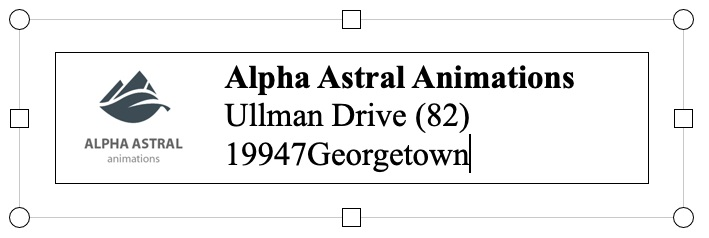

Les zones de texte sont des zones ancrées à une page ou à une section et qui peuvent contenir du texte, des images en ligne ou des tableaux. Les zones de texte peuvent être positionnées n'importe où sur la page et répondre à des besoins spécifiques, par exemple pour insérer le nom ou le logo d'une entreprise ou une zone d'adresse.

**Note :** Une zone de texte ne peut pas contenir des en-têtes, des pieds de page, des colonnes, des images ancrées ou d'autres zones de texte.

Les zones de texte sont ajoutées avec une position absolue, devant/derrière le texte, ainsi qu'ancrées à une page ou à des parties spécifiques d'un document en mode Page : en-tête, pied de page, une section, toutes les sections ou une sous-section. Les zones de texte peuvent également être utilisées en mode intégré (ancrées à la zone de calque).

L'ajout d'une zone de texte à un document 4D Write Pro peut être réalisé de la manière suivante :

* en utilisant la commande **WP New text box,**
* en utilisant l'action standard insertTextBox

Pour sélectionner une zone de texte, l'utilisateur doit cliquer dessus (**Ctrl/Cmd+clic** si la zone de texte se trouve sur la couche de fond). Une fois sélectionnée, la zone de texte peut être déplacée ou redimensionnée à l'aide de la souris ou des flèches du clavier.

Pour supprimer une zone de texte sélectionnée, vous pouvez appuyer sur la touche **Effacer** ou **Retour arrière**, utiliser l'action standard **textBox/remove** ou exécuter la commande **WP DELETE TEXT BOX**. 

Les attributs des zones de texte sont gérés par la commande [WP FIXER ATTRIBUTS](../commands/wp-fixer-attributs) ou la commande *Actions 4D Write Pro*. Les attributs et actions suivants sont disponibles :

| **Propriété (constante)** | **Standard action**       | **Commentaires**                                                                                                            |
| ------------------------- | ------------------------- | --------------------------------------------------------------------------------------------------------------------------- |
| wk width                  | textBox/width             | Si elle est réglée sur "auto", la largeur est convertie en 8 cm car la largeur de la zone de texte ne peut pas être "auto". |
| wk height                 | textBox/height            | Si la valeur est "auto", la hauteur est ajustée en fonction du contenu.                                                     |
| wk padding                | textBox/padding           |                                                                                                                             |
| wk border \[...\]         | textBox/border\[...\]     |                                                                                                                             |
| wk background \[...\]     | textBox/background\[...\] |                                                                                                                             |
| wk vertical align         | textBox/verticalAlign     |                                                                                                                             |
| wk id                     | \-                        | ne peut pas être vide pour une zone de texte                                                                                |
| wk anchor \[...\]         | textBox/anchor\[...\]     |                                                                                                                             |
| wk owner                  | \-                        | en lecture uniquement                                                                                                       |
| wk protected              | \-                        |                                                                                                                             |
| wk style sheet            | \-                        | en lecture uniquement et toujours "" (pas de feuille de style)                                                              |

Les zones de texte supportent l'habillage automatique du texte lorsqu'elles sont ancrées dans un document avec des options telles que à gauche, à droite, sur le plus grand côté, au-dessus et au-dessous, ou tout autour, fournies par la propriété wk anchor layout ou l'action standard **anchorLayout**. Consultez cet [article de blog](https://blog.4d.com/fr/4d-write-pro-more-display-options-for-anchored-pictures-and-text-boxes/) pour plus de détails.

Les zones de texte avec habillage ancrées dans le corps de la page n'affectent pas l'en-tête ou le pied de page (la zone de texte est affichée devant l'en-tête ou le pied de page) ; au contraire, les zones de texte ancrées dans l'en-tête et le pied de page affectent le corps de la page si elles le chevauchent.

**Note :** Si vous souhaitez ancrer une zone de texte avec habillage de texte à l'en-tête ou au pied de page, vous devez également définir l'alignement vertical de la zone de texte sur le haut.

Les zones de texte ne sont pas affichées si :

* le mode d'affichage est Brouillon ;
* ils sont centrés ou ancrés à des sections et l'option **Show HTML WYSIWYG** est cochée ;
* l'option "fond visible" n'est pas activée.