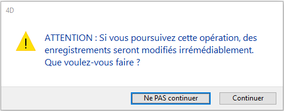

<!--REF #_command_.CONFIRM.Syntax-->**CONFIRM** ( *message* {; *libelléBoutonOK* {; *libelléBoutonAnn*}} )<!-- END REF-->
<!--REF #_command_.CONFIRM.Params-->
| Paramètre | Type |  | Description |
| --- | --- | --- | --- |
| message | Text | &#8594;  | Message à afficher dans la boîte de dialogue de confirmation |
| libelléBoutonOK | Text | &#8594;  | Libellé du bouton OK |
| libelléBoutonAnn | Text | &#8594;  | Libellé du bouton Annuler |

<!-- END REF-->

## Description 

<!--REF #_command_.CONFIRM.Summary-->La commande **CONFIRM** affiche une boîte de dialogue de confirmation qui se compose d'une icône, d'un message, d'un bouton OK et d'un bouton Annuler.<!-- END REF-->

Les boîtes de dialogue de confirmation ou d'alerte sont utilisées pour afficher des informations (comme des messages d'erreur) qui ne nécessitent pas d'informations en retour.

Vous passez le message à afficher dans le paramètre *message*. Ce message peut contenir jusqu'à 255 caractères. Si la longueur ou largeur des caractères est trop importante par rapport à la zone d'affichage, le message sera tronqué.

Par défaut, le libellé du bouton OK est “OK” et le libellé du bouton Annuler est “Annuler”. Si vous voulez modifier le libellé de ces boutons, passez le nouveau libellé dans les paramètres optionnels *libelléBoutonOK* et *libelléBouton*. Si nécessaire, les boutons sont agrandis vers la gauche en fonction de la taille des libellés que vous avez saisis.

Le bouton OK est le bouton par défaut. L'utilisateur peut cliquer sur le bouton OK ou appuyer sur la touche **Entrée** pour valider la boîte de dialogue, la variable système OK prend alors la valeur 1\. L'utilisateur peut cliquer sur le bouton Annuler pour annuler la boîte de dialogue, la variable système OK prend alors la valeur 0\. 

**Conseil :** N'appelez pas la commande **CONFIRM** dans une méthode formulaire ou objet qui gère l'événement On Activate ou On Deactivate, car cela provoquerait une boucle sans fin.

## Exemple 1 

L'exemple ci-dessous :

```4d
 CONFIRM("ATTENTION : Vous ne pourrez pas annuler cette opération.")
 If(OK=1)
    ALL RECORDS([Employes])
    DELETE SELECTION([Employes])
 Else
    ALERT("Opération annulée.")
 End if
```

... provoquera l'affichage de la boîte de dialogue de confirmation suivante (sous Windows) :


## Exemple 2 

La ligne :

```4d
 CONFIRM("Voulez-vous vraiment fermer ce compte ?";"Oui";"Non")
```

... provoquera l'affichage de la boîte de dialogue de confirmation suivante (sous Windows) :


## Exemple 3 

Vous développez une application 4D pour le marché international. Vous avez écrit les chaines de votre interface ainsi que leurs traductions dans la langue cible dans des fichiers XLIFF. Dans ce cas, le code :

```4d
 var $title;$yes;$no : Text
 $title:=Localized string("add_Memo")
 $yes:=Localized string("Yes")
 $no:=Localized string("No")
 CONFIRM($title;$yes;$no)
```

... pourrait afficher la boîte de dialogue de confirmation (sous Windows) suivante :


## Exemple 4 

La ligne :

```4d
 CONFIRM("ATTENTION : Si vous poursuivez cette opération, des enregistrements seront "+"modifiés irrémédiablement."+Char(13)+"Que voulez-vous faire ?";"Ne PAS continuer";"Continuer")
```

... provoque l'affichage de la boîte de dialogue de confirmation suivante (sous Mac OS) :



## Voir aussi 

[ALERT](alert.md)  
[Request](request.md)  

## Propriétés

|  |  |
| --- | --- |
| Numéro de commande | 162 |
| Thread safe | &check; |
| Modifie les variables | OK |


