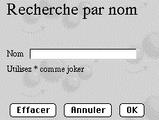

<!--REF #_command_.WEB SEND HTTP REDIRECT.Syntax-->**WEB SEND HTTP REDIRECT** ( *url* {; *} )<!-- END REF-->
<!--REF #_command_.WEB SEND HTTP REDIRECT.Params-->
| Paramètre | Type |  | Description |
| --- | --- | --- | --- |
| url | Text | &#8594;  | Nouvel URL |
| * | Opérateur | &#8594;  | Si spécifié = l’URL n’est pas traduit, Si omis = l’URL est traduit |

<!-- END REF-->

## Description 

<!--REF #_command_.WEB SEND HTTP REDIRECT.Summary-->La commande **WEB SEND HTTP REDIRECT** permet de transformer un URL en un autre.<!-- END REF--> 

Le paramètre *url* contient le nouvel URL qui permet de rediriger la requête. Si ce paramètre est un url vers un fichier, il doit contenir la référence à ce fichier, par exemple : **WEB SEND HTTP REDIRECT** ("/MaPage.HTM").

Cette commande prévaut sur les commandes d’envoi de données ([WEB SEND FILE](web-send-file.md), [WEB SEND BLOB](web-send-blob.md), etc.) éventuellement placées dans la même méthode.

Cette commande permet également de rediriger une requête vers un autre serveur Web.

4D encode automatiquement les caractères spéciaux de l’URL. Si vous passez le caractère *\**, 4D ne traduira pas les caractères spéciaux de l’URL.

A noter que le statut de la requête envoyée par cette commande est **302 : redirection temporaire**. Si vous avez besoin d'une redirection permanente (statut 301), vous pouvez fixer le champ HTTP *X-STATUS: 301* dans l'en-tête de la réponse. 

## Exemple 

Vous pouvez utiliser cet URL pour effectuer, à l’aide de pages statiques, des recherches personnalisées dans 4D. Imaginez que vous ayez placé dans une page HTML statique les éléments suivants :



L’action POST “/4dcgi/rech” a été associée à la zone de texte et aux boutons **OK** et **Annuler**.  
Dans la [On Web Connection](./on-web-connection-database-method.md), placez les instructions suivantes :

```4d
 Case of
    :($1="/4dcgi/rech") //Lorsque 4D reçoit cet URL
  //Si le bouton OK a été utilisé et le champ ‘nom’ contient une valeur
       If((bOK="OK") & (nom # ""))
  //Transformer l’URL afin d’exécuter le code de la recherche, placé plus
  //loin dans la même méthode
          WEB SEND HTTP REDIRECT("/4dcgi/rech?"+nom)
       Else //Else retourner à la page de départ
          WEB SEND HTTP REDIRECT("/page1.htm")
       End if
       ...
 
    :($1="/4dcgi/rech?@") //Si l’URL a été redirigé
       ... //Placez ici le code de la recherche
 End case
```


## Propriétés

|  |  |
| --- | --- |
| Numéro de commande | 659 |
| Thread safe | &check; |


