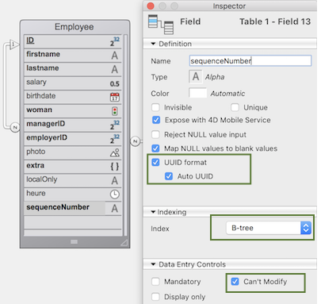

[データクラス](ORDA/dsMapping.md#データクラス) はデータベーステーブルへのオブジェクトインターフェースを提供します。  4Dアプリケーション内のデータクラスはすべて、`ds` [データストア](ORDA/dsMapping.md#データストア) のプロパティとして利用可能です。

### 概要

|                                                                                                                                                                   |
| ----------------------------------------------------------------------------------------------------------------------------------------------------------------- |
| [<!-- INCLUDE DataClassClass.attributeName.Syntax -->](#attributename)<br/><!-- INCLUDE DataClassClass.attributeName.Summary -->                                  |
| [<!-- INCLUDE #DataClassClass.all().Syntax -->](#all)<br/><!-- INCLUDE #DataClassClass.all().Summary -->                                                          |
| [<!-- INCLUDE #DataClassClass.clearRemoteCache().Syntax -->](#clearremotecache)<br/><!-- INCLUDE #DataClassClass.clearRemoteCache().Summary -->                   |
| [<!-- INCLUDE #DataClassClass.fromCollection().Syntax -->](#fromcollection)<br/><!-- INCLUDE #DataClassClass.fromCollection().Summary -->                         |
| [<!-- INCLUDE #DataClassClass.get().Syntax -->](#get)<br/><!-- INCLUDE #DataClassClass.get().Summary -->                                                          |
| [<!-- INCLUDE #DataClassClass.getCount().Syntax -->](#getcount)<br/><!-- INCLUDE #DataClassClass.getCount().Summary -->                                           |
| [<!-- INCLUDE #DataClassClass.getDataStore().Syntax -->](#getdatastore)<br/><!-- INCLUDE #DataClassClass.getDataStore().Summary -->                               |
| [<!-- INCLUDE #DataClassClass.getInfo().Syntax -->](#getinfo)<br/><!-- INCLUDE #DataClassClass.getInfo().Summary -->                                              |
| [<!-- INCLUDE #DataClassClass.getRemoteCache().Syntax -->](#getremotecache)<br/><!-- INCLUDE #DataClassClass.getRemoteCache().Summary -->                         |
| [<!-- INCLUDE #DataClassClass.new().Syntax -->](#new)<br/><!-- INCLUDE #DataClassClass.new().Summary -->                                                          |
| [<!-- INCLUDE #DataClassClass.newSelection().Syntax -->](#newselection)<br/><!-- INCLUDE #DataClassClass.newSelection().Summary -->                               |
| [<!-- INCLUDE #DataClassClass.query().Syntax -->](#query)<br/><!-- INCLUDE #DataClassClass.query().Summary -->                                                    |
| [<!-- INCLUDE #DataClassClass.setRemoteCacheSettings().Syntax -->](#setremotecachesettings)<br/><!-- INCLUDE #DataClassClass.setRemoteCacheSettings().Summary --> |

<!-- REF DataClassClass.attributeName.Desc -->

## .*attributeName*

<details><summary>履歴</summary>

| リリース  | 内容                             |
| ----- | ------------------------------ |
| 19 R3 | .exposed 属性を追加 |
| 17    | 追加                             |

</details>

<!-- REF DataClassClass.attributeName.Syntax -->***.attributeName*** : object<!-- END REF -->

#### 説明

データクラスの属性は、データクラスの<!-- REF DataClassClass.attributeName.Summary -->プロパティとして直接利用可能なオブジェクト<!-- END REF -->です。

返されるオブジェクトのプロパティを読み取ることによって、データクラス属性に関する情報が取得できます。

> データクラス属性オブジェクトを編集することは可能ですが、元となるデータベースストラクチャーは変更されません。

#### 返されるオブジェクト

返される属性オブジェクトには以下のプロパティが格納されています:

| プロパティ            | 型       | 説明                                                                                                                                                                                                                                                                                                                                                                                                                                                                                                                                                                                                                                                                                                                                 |
| ---------------- | ------- | ---------------------------------------------------------------------------------------------------------------------------------------------------------------------------------------------------------------------------------------------------------------------------------------------------------------------------------------------------------------------------------------------------------------------------------------------------------------------------------------------------------------------------------------------------------------------------------------------------------------------------------------------------------------------------------------------------------------------------------- |
| autoFilled       | Boolean | 属性値が 4D によって自動生成される場合に true です。 このプロパティは次の 4Dフィールドプロパティに対応しています: 数値型フィールドの "自動インクリメント" および UUID (文字型)フィールドの "自動UUID"。 `.kind` が "relatedEntity" または "relatedEntities" の場合には、このプロパティは返されません。                                                                                                                                                                                                                                                                                                                                                                                                                                                                                                     |
| exposed          | Boolean | 属性が REST で公開されている場合に trueです                                                                                                                                                                                                                                                                                                                                                                                                                                                                                                                                                                                                                                                                                                        |
| fieldNumber      | integer | 属性の内部的な 4Dフィールド番号。 `.kind` が "relatedEntity" または "relatedEntities" の場合には、このプロパティは返されません。                                                                                                                                                                                                                                                                                                                                                                                                                                                                                                                                                                                                                                           |
| fieldType        | Integer | 属性の 4Dデータベースフィールドタイプ。 これは属性の種類 (`kind`) によります。 とりうる値:<li>`.kind` = "storage" の場合は、対応する 4Dフィールドタイプ ([`Value type`](https://doc.4d.com/4dv20/help/command/ja/page1509.html) 参照)</li><li>`.kind` = "relatedEntity" の場合: 38 (`is object`)</li><li>`.kind` = "relatedEntities" の場合: 42 (`is collection`)</li><li>`.kind` = "calculated" または "alias" の場合: 結果の値 (フィールドタイプ、relatedEntity または relatedEntities) に応じて、上に同じ</li>                                                                                                                                                |
| indexed          | Boolean | 属性に対して B-tree もしくは クラスターB-Tree インデックスが設定されている場合に true です。 `.kind` が "relatedEntity" または "relatedEntities" の場合には、このプロパティは返されません。                                                                                                                                                                                                                                                                                                                                                                                                                                                                                                                                                                                                    |
| inverseName      | Text    | リレーション先の属性名。 `.kind` = "relatedEntity" または "relatedEntities" の場合にのみ返されます。                                                                                                                                                                                                                                                                                                                                                                                                                                                                                                                                                                                                                                                          |
| keywordIndexed   | Boolean | 属性にキーワードインデックスが存在すれば true です。 `.kind` が "relatedEntity" または "relatedEntities" の場合には、このプロパティは返されません。                                                                                                                                                                                                                                                                                                                                                                                                                                                                                                                                                                                                                                |
| kind             | Text    | 属性の種類。 とりうる値:<li>"storage": ストレージ (あるいはスカラー) 属性。つまり、属性は値を保存しており、他の属性への参照ではありません。</li><li>"calculated": 計算属性。[`get`](../ORDA/ordaClasses.md#function-get-attributename) 関数 によって定義されます。</li><li>"alias": [他の属性](../ORDA/ordaClasses.md#エイリアス属性-1) を指し示す属性。</li><li>"relatedEntity": N対1 リレーション属性 (エンティティへの参照) </li><li>"relatedEntities": 1対N リレーション属性 (エンティティセレクションへの参照)</li>                                                                                                                                                                                              |
| 必須               | Boolean | 属性において Null値の入力が拒否されている場合に true です。 `.kind` が "relatedEntity" または "relatedEntities" の場合には、このプロパティは返されません。 注記: このプロパティは、4Dデータベースレベルの "Null値の入力を拒否" フィールドプロパティと対応しています。 フィールドのデータ入力制御オプションである既存の "必須入力" プロパティとは無関係です。                                                                                                                                                                                                                                                                                                                                                                                                                                                                                                |
| name             | Text    | 属性名 (文字列)                                                                                                                                                                                                                                                                                                                                                                                                                                                                                                                                                                                                                                                                                                       |
| path             | Text    | リレーションに基づく [エイリアス属性](../ORDA/ordaClasses.md#エイリアス属性-1) のパス。                                                                                                                                                                                                                                                                                                                                                                                                                                                                                                                                                                                                                                                                        |
| readOnly         | Boolean | 読み取り専用属性の場合に trueです。 読み取り専用属性の場合に trueです。 たとえば、[`set` 関数](../ORDA/ordaClasses.md#function-set-attributename) を持たない計算属性は読み取り専用です。                                                                                                                                                                                                                                                                                                                                                                                                                                                                                                                                                                                                   |
| relatedDataClass | Text    | 属性にリレートされているデータクラスの名称。 `.kind` = "relatedEntity" または "relatedEntities" の場合にのみ返されます。                                                                                                                                                                                                                                                                                                                                                                                                                                                                                                                                                                                                                                                |
| type             | Text    | 属性の概念的な値タイプ。汎用的なプログラミングに有用です。 これは属性の種類 (`kind`) によります。 とりうる値: <li>`.kind` = "storage" の場合: "blob", "bool", "date", "image", "number", "object", または "string"。 "number" is returned for any numeric types including duration; "string" is returned for uuid, alpha and text attribute types; "blob" attributes are [blob objects](../Concepts/dt_blob.md#blob-types).</li><li>if `.kind` = "relatedEntity": related dataClass name</li><li>if `.kind` = "relatedEntities": related dataClass name + "Selection" suffix</li><li>if `.kind` = "calculated" or "alias": same as above, depending on the result</li> |
| unique           | Boolean | 属性値が重複不可の場合に true です。 `.kind` が "relatedEntity" または "relatedEntities" の場合には、このプロパティは返されません。                                                                                                                                                                                                                                                                                                                                                                                                                                                                                                                                                                                                                                        |

:::tip

汎用的なプログラミングにおいては、プロパティが返されない場合でも有効な値を取得するため、`Bool(attributeName.property)`、`Num(attributeName.property)`、または `String(attributeName.property)` をプロパティの型に応じて使用することが推奨されます。

:::

#### 例題 1

```4d
$salary:=ds.Employee.salary // Employeeデータクラスの salary属性を返します
$compCity:=ds.Company["city"] // Companyデータクラスの city属性を返します
```

#### 例題 2

以下のストラクチャーを前提とします:


```4d
var $firstnameAtt;$employerAtt;$employeesAtt : Object

 $firstnameAtt:=ds.Employee.firstname
  //{name:firstname,kind:storage,fieldType:0,type:string,fieldNumber:2,indexed:true,
  //keyWordIndexed:false,autoFilled:false,mandatory:false,unique:false}

 $employerAtt:=ds.Employee.employer
  //{name:employer,kind:relatedEntity,relatedDataClass:Company,
  //fieldType:38,type:Company,inverseName:employees}
  //38=Is object

 $employeesAtt:=ds.Company.employees
  //{name:employees,kind:relatedEntities,relatedDataClass:Employee,
  //fieldType:42,type:EmployeeSelection,inverseName:employer}
  //42=Is collection
```

#### 例題 3

以下のテーブルプロパティを前提とします:



```4d
 var $sequenceNumberAtt : Object
 $sequenceNumberAtt=ds.Employee.sequenceNumber
  //{name:sequenceNumber,kind:storage,fieldType:0,type:string,fieldNumber:13,
  //indexed:true,keyWordIndexed:false,autoFilled:true,mandatory:false,unique:true}
```

<!-- END REF -->

## .all()

<details><summary>履歴</summary>

| リリース  | 内容                                  |
| ----- | ----------------------------------- |
| 17 R5 | Support of the *settings* parameter |
| 17    | 追加                                  |

</details>

<!-- REF #DataClassClass.all().Syntax -->**.all** ( { *settings* : Object } ) : 4D.EntitySelection<!-- END REF -->

<!-- REF #DataClassClass.all().Params -->

| 引数       | 型                                  |                             | 説明                                                  |
| -------- | ---------------------------------- | :-------------------------: | --------------------------------------------------- |
| settings | Object                             |              ->             | ビルドオプション: context                   |
| 戻り値      | 4D.EntitySelection | <- | References on all entities related to the Dataclass |

<!-- END REF -->

#### 説明

The `.all()` function <!-- REF #DataClassClass.all().Summary -->queries the datastore to find all the entities related to the dataclass and returns them as an entity selection<!-- END REF -->.

エンティティはデフォルトの順番で返され、通常は作成順になっています。 ただし、エンティティ削除後に新規追加した場合には、デフォルトの順番は作成順を反映しない点に留意が必要です。

エンティティが見つからない場合、空のエンティティセレクションが返されます。

この関数には、レイジーローディングが適用されます。

**settings**

In the optional *settings* parameter, you can pass an object containing additional options. 以下のプロパティがサポートされています:

| プロパティ   | 型    | 説明                                                                                                                                                                                                    |
| ------- | ---- | ----------------------------------------------------------------------------------------------------------------------------------------------------------------------------------------------------- |
| context | Text | エンティティセレクションに適用されている最適化コンテキストのラベル。 エンティティセレクションを扱うコードはこのコンテキストを使うことで最適化の恩恵を受けます。 This feature is [designed for ORDA client/server processing](../ORDA/client-server-optimization.md). |

> To know the total number of entities in a dataclass, it is recommended to use the [`getCount()`](#getcount) function which is more optimized than the `ds.myClass.all().length` expression.

#### 例題

```4d
 var $allEmp : cs.EmployeeSelection
 $allEmp:=ds.Employee.all()
```

## .clearRemoteCache()

<details><summary>履歴</summary>

| リリース  | 内容 |
| ----- | -- |
| 19 R5 | 追加 |

</details>

<!-- REF #DataClassClass.clearRemoteCache().Syntax -->**.clearRemoteCache()**<!-- END REF -->

<!-- REF #DataStoreClass.clearRemoteCache().Params -->

| 引数 | 型 |     | 説明         |
| -- | - | :-: | ---------- |
|    |   |     | 引数を必要としません |

<!-- END REF -->

#### 説明

The `.clearRemoteCache()` function <!-- REF #DataClassClass.clearRemoteCache().Summary -->empties the ORDA cache of a dataclass<!-- END REF -->.

> This function does not reset the `timeout` and `maxEntries` values.

#### 例題

```4d
var $ds : 4D.DataStoreImplementation
var $persons : cs.PersonsSelection
var $p : cs.PersonsEntity
var $cache : Object
var $info : Collection
var $text : Text

$ds:=Open datastore(New object("hostname"; "www.myserver.com"); "myDS")

$persons:=$ds.Persons.all()
$text:=""
For each ($p; $persons)
    $text:=$p.firstname+" lives in "+$p.address.city+" / "
End for each

$cache:=$ds.Persons.getRemoteCache()

$ds.Persons.clearRemoteCache()
// Persons データクラスのキャッシュ = {timeout:30;maxEntries:30000;stamp:255;entries:[]}
```

#### 参照

[`entitySelection.refresh()`](EntitySelectionClass.md#refresh)

<!-- REF DataClassClass.fromCollection().Desc -->

## .fromCollection()

<details><summary>履歴</summary>

| リリース  | 内容                                  |
| ----- | ----------------------------------- |
| 17 R5 | Support of the *settings* parameter |
| 17    | 追加                                  |

</details>

<!-- REF #DataClassClass.fromCollection().Syntax -->**.fromCollection**( *objectCol* : Collection { ; *settings* : Object } ) : 4D.EntitySelection<!-- END REF -->

<!-- REF #DataClassClass.fromCollection().Params -->

| 引数        | 型                                  |                             | 説明                                          |
| --------- | ---------------------------------- | :-------------------------: | ------------------------------------------- |
| objectCol | Collection                         |              ->             | エンティティにマップするオブジェクトのコレクション                   |
| settings  | Object                             |              ->             | ビルドオプション: context           |
| 戻り値       | 4D.EntitySelection | <- | Entity selection filled from the collection |

<!-- END REF -->

#### 説明

The `.fromCollection()` function <!-- REF #DataClassClass.fromCollection().Summary -->updates or creates entities in the dataclass according to the *objectCol* collection of objects, and returns the corresponding entity selection<!-- END REF -->.

In the *objectCol* parameter, pass a collection of objects to create new or update existing entities of the dataclass. プロパティ名は、データクラスの属性名と同一である必要があります。 プロパティ名がデータクラスに存在しない場合、それは無視されます。 コレクション内で属性値が定義されていない場合、その値は null になります。

The mapping between the objects of the collection and the entities is done on the **attribute names** and **matching types**. オブジェクトプロパティがエンティティ属性と同じ名前であっても、型が合致しない場合には、エンティティの属性は空のままです。

**Create or update mode**

For each object of *objectCol*:

- オブジェクトがブール型の "\_\*NEW" プロパティを含み、それが <strong x-id="1">false</strong> に設定されている場合(あるいは "\*\_NEW" プロパティが含まれていない場合)、オブジェクトの対応する値でエンティティが更新あるいは作成されます。 プライマリーキーに関するチェックはおこなわれません:
 - プライマリーキーが指定されていて実在する場合、エンティティは更新されます。 この場合、プライマリーキーはそのまま、あるいは "\_\_KEY" プロパティを (プライマリーキー値とともに) 使って指定することができます。
 - そのまま指定したプライマリーキーが実在しない場合、エンティティは作成されます。
 - プライマリーキーを指定していない場合、エンティティは作成され、標準のデータベースのルールに基づいてプライマリーキー値が割り当てられます。
- If the object contains a boolean property "\_\_NEW" set to **true**, the entity is created with the corresponding values of the attributes from the object. プライマリーキーに関するチェックがおこなわれます:
 - そのまま指定したプライマリーキーが実在する場合、エラーが返されます。
 - そのまま指定したプライマリーキーが実在しない場合、エンティティは作成されます。
 - プライマリーキーを指定していない場合、エンティティは作成され、標準のデータベースのルールに基づいてプライマリーキー値が割り当てられます。

> The "\_\*KEY" property containing a value is taken into account only when the "\*\*NEW" property is set to **false** (or is omitted) and a corresponding entity exists. それ以外の場合には、"\*\_KEY" プロパティ値は無視されるため、プライマリーキーの値はそのまま渡さなければなりません。

**Related entities**

The objects of *objectCol* may contain one or more nested object(s) featuring one or more related entities, which can be useful to create or update links between entities.

リレートエンティティに相当するネストされたオブジェクトは、リレートエンティティのプライマリーキー値を格納した "\_\*KEY" プロパティあるいはプライマリーキー属性を格納している必要があります。 ”\*\_KEY” プロパティを使用すると、プライマリーキー属性名に依存する必要がありません。

> この機構によって、リレートエンティティの中身を作成・更新することはできません。

**Stamp**

"\_\_STAMP" プロパティが指定された場合、データストアのスタンプとのチェックがおこなわれ、エラーが返されることがあります ("与えられたスタンプはテーブルXXX のレコード# XXのカレントのものと合致しません")。 For more information, see [Entity locking](ORDA/entities.md#entity-locking).

**settings**

In the optional *settings* parameter, you can pass an object containing additional options. 以下のプロパティがサポートされています:

| プロパティ   | 型    | 説明                                                                                                                                                                                                    |
| ------- | ---- | ----------------------------------------------------------------------------------------------------------------------------------------------------------------------------------------------------- |
| context | Text | エンティティセレクションに適用されている最適化コンテキストのラベル。 エンティティセレクションを扱うコードはこのコンテキストを使うことで最適化の恩恵を受けます。 This feature is [designed for ORDA client/server processing](../ORDA/client-server-optimization.md). |

#### 例題 1

既存のエンティティを更新します。 \_\_NEW プロパティはなく、従業員のプライマリーキーは属性に実在の値を指定して渡します:

```4d
 var $empsCollection : Collection
 var $emp : Object
 var $employees : cs.EmployeeSelection

 $empsCollection:=New collection
 $emp:=New object
 $emp.ID:=668 //Existing PK in Employee table
 $emp.firstName:="Arthur"
 $emp.lastName:="Martin"
 $emp.employer:=New object("ID";121) //Existing PK in the related dataClass Company
  // For this employee, we can change the Company by using another existing PK in the related dataClass Company
 $empsCollection.push($emp)
 $employees:=ds.Employee.fromCollection($empsCollection)
```

#### 例題 2

既存のエンティティを更新します。 \_\*NEW プロパティはなく、従業員のプライマリーキーは \*\_KEY プロパティに実在の値を指定して渡します:

```4d
 var $empsCollection : Collection
 var $emp : Object
 var $employees : cs.EmployeeSelection

 $empsCollection:=New collection
 $emp:=New object
 $emp.__KEY:=1720 //Existing PK in Employee table
 $emp.firstName:="John"
 $emp.lastName:="Boorman"
 $emp.employer:=New object("ID";121) //Existing PK in the related dataClass Company
  // For this employee, we can change the Company by using another existing PK in the related dataClass Company
 $empsCollection.push($emp)
 $employees:=ds.Employee.fromCollection($empsCollection)
```

#### 例題 3

単純に、コレクションから新しいエンティティを作成します:

```4d
 var $empsCollection : Collection
 var $emp : Object
 var $employees : cs.EmployeeSelection

 $empsCollection:=New collection
 $emp:=New object
 $emp.firstName:="Victor"
 $emp.lastName:="Hugo"
 $empsCollection.push($emp)
 $employees:=ds.Employee.fromCollection($empsCollection)
```

#### 例題 4

新規エンティティを作成します。 \_\_NEW プロパティは true で、従業員のプライマリーキーは指定しません:

```4d
 var $empsCollection : Collection
 var $emp : Object
 var $employees : cs.EmployeeSelection

 $empsCollection:=New collection
 $emp:=New object
 $emp.firstName:="Mary"
 $emp.lastName:="Smith"
 $emp.employer:=New object("__KEY";121) //Existing PK in the related dataClass Company
 $emp.__NEW:=True
 $empsCollection.push($emp)
 $employees:=ds.Employee.fromCollection($empsCollection)


```

#### 例題 5

新規エンティティを作成します。 \_\_NEW プロパティはなく、従業員のプライマリーキー属性を指定しますが、その値は実在しません:

```4d
 var $empsCollection : Collection
 var $emp : Object
 var $employees : cs.EmployeeSelection

 $empsCollection:=New collection
 $emp:=New object
 $emp.ID:=10000 //Unexisting primary key
 $emp.firstName:="Françoise"
 $emp.lastName:="Sagan"
 $empsCollection.push($emp)
 $employees:=ds.Employee.fromCollection($empsCollection)
```

#### 例題 6

2つのエンティティが同じプライマリーキーを持つ場合、最初のエンティティは作成・保存されますが、2つめのエンティティの処理は失敗します:

```4d
 var $empsCollection : Collection
 var $emp; $emp2 : Object
 var $employees : cs.EmployeeSelection

 $empsCollection:=New collection
 $emp:=New object
 $emp.ID:=10001 // Unexisting primary key
 $emp.firstName:="Simone"
 $emp.lastName:="Martin"
 $emp.__NEW:=True
 $empsCollection.push($emp)

 $emp2:=New object
 $emp2.ID:=10001 // Same primary key, already existing
 $emp2.firstName:="Marc"
 $emp2.lastName:="Smith"
 $emp2.__NEW:=True
 $empsCollection.push($emp2)
 $employees:=ds.Employee.fromCollection($empsCollection)
  //first entity is created
  //duplicated key error for the second entity
```

#### 参照

[**.toCollection()**](EntitySelectionClass.md#tocollection)

<!-- END REF -->

<!-- REF DataClassClass.get().Desc -->

## .get()

<details><summary>履歴</summary>

| リリース | 内容 |
| ---- | -- |
| 17   | 追加 |

</details>

<!-- REF #DataClassClass.get().Syntax -->**.get**( *primaryKey* : Integer { ; *settings* : Object } ) : 4D.Entity<br/>**.get**( *primaryKey* : Text { ; *settings* : Object } ) : 4D.Entity<!-- END REF -->

<!-- REF #DataClassClass.get().Params -->

| 引数         | 型                         |                             | 説明                                         |
| ---------- | ------------------------- | :-------------------------: | ------------------------------------------ |
| primaryKey | Integer または Text          |              ->             | 取得するエンティティのプライマリーキー値                       |
| settings   | Object                    |              ->             | ビルドオプション: context          |
| 戻り値        | 4D.Entity | <- | Entity matching the designated primary key |

<!-- END REF -->

#### 説明

The `.get()` function <!-- REF #DataClassClass.get().Summary -->queries the dataclass to retrieve the entity matching the *primaryKey* parameter<!-- END REF -->.

In *primaryKey*, pass the primary key value of the entity to retrieve. 値の型は、データストアで設定されたプライマリーキーの型 (倍長整数あるいはテキスト) と合致している必要があります。 You can also make sure that the primary key value is always returned as Text by using the [`.getKey()`](EntityClass.md#getkey) function with the `dk key as string` parameter.

If no entity is found with *primaryKey*, a **Null** entity is returned.

この関数にはレイジーローディングが適用され、リレートデータは必要な時にのみディスクから読み込まれます。

**settings**

In the optional *settings* parameter, you can pass an object containing additional options. 以下のプロパティがサポートされています:

| プロパティ   | 型    | 説明                                                                                                                                                                                                 |
| ------- | ---- | -------------------------------------------------------------------------------------------------------------------------------------------------------------------------------------------------- |
| context | Text | エンティティに適用されている自動の最適化コンテキストのラベル。 エンティティを読み込む以降のコードは、このコンテキストを使うことで最適化の恩恵を受けます。 This feature is [designed for ORDA client/server processing](../ORDA/client-server-optimization.md). |

:::info

When you call the `.get()` function **without** *settings* parameter, a request for attribute values is directly sent to the server (the [ORDA cache](../ORDA/client-server-optimization.md#orda-cache) is not used). On the other hand, when you call the `.get()` function **with** a `context` passed in the *settings* parameter, attribute values are retrieved from the ORDA cache corresponding to the context. It may be advisable in this case to call [`reload()`](EntityClass.md#reload) to make sure the most recent data is retrieved from the server.

:::

#### 例題 1

```4d
 var $entity : cs.EmployeeEntity  
 var $entity2 : cs.InvoiceEntity
 $entity:=ds.Employee.get(167) // return the entity whose primary key value is 167
 $entity2:=ds.Invoice.get("DGGX20030") // return the entity whose primary key value is "DGGX20030"
```

#### 例題 2

This example illustrates the use of the *context* property:

```4d
 var $e1; $e2; $e3; $e4 : cs.EmployeeEntity
 var $settings; $settings2 : Object

 $settings:=New object("context";"detail")
 $settings2:=New object("context";"summary")

 $e1:=ds.Employee.get(1;$settings)
 completeAllData($e1) // In completeAllData method, an optimization is triggered and associated to context "detail"

 $e2:=ds.Employee.get(2;$settings)
 completeAllData($e2) // In completeAllData method, the optimization associated to context "detail" is applied

 $e3:=ds.Employee.get(3;$settings2)
 completeSummary($e3) //In completeSummary method, an optimization is triggered and associated to context "summary"

 $e4:=ds.Employee.get(4;$settings2)
 completeSummary($e4) //In completeSummary method, the optimization associated to context "summary" is applied
```

<!-- END REF -->

<!-- REF DataClassClass.getCount.Desc -->

## .getCount()

<details><summary>履歴</summary>

| リリース  | 内容 |
| ----- | -- |
| 19 R5 | 追加 |

</details>

<!-- REF #DataClassClass.getCount().Syntax -->**.getCount()** : Integer <!-- END REF -->

<!-- REF #DataClassClass.getCount().Params -->

| 引数  | 型       |                             | 説明                                  |
| --- | ------- | --------------------------- | ----------------------------------- |
| 戻り値 | Integer | <- | Number of entities in the dataclass |

<!-- END REF -->

#### 説明

The `.getCount()` function <!-- REF #DataClassClass.getCount().Summary --> returns the number of entities in a dataclass<!-- END REF -->.

トランザクション内でこの関数を使用した場合、トランザクション中に作成されたエンティティは考慮されます。

#### 例題

```4d
var $ds : 4D.DataStoreImplementation
var $number : Integer

$ds:=Open datastore(New object("hostname"; "www.myserver.com"); "myDS")

$number:=$ds.Persons.getCount()
```

<!-- END REF -->

<!-- REF DataClassClass.getDataStore().Desc -->

## .getDataStore()

<details><summary>履歴</summary>

| リリース  | 内容 |
| ----- | -- |
| 17 R5 | 追加 |

</details>

<!-- REF #DataClassClass.getDataStore().Syntax -->**.getDataStore()** : cs.DataStore<!-- END REF -->

<!-- REF #DataClassClass.getDataStore().Params -->

| 引数  | 型                            |                             | 説明                         |
| --- | ---------------------------- | :-------------------------: | -------------------------- |
| 戻り値 | cs.DataStore | <- | Datastore of the dataclass |

<!-- END REF -->

#### 説明

The `.getDataStore()` function <!-- REF #DataClassClass.getDataStore().Summary -->returns the datastore for the specified dataclass<!-- END REF -->.

返されるデータストアは次のいずれかです:

- the main datastore, as returned by the `ds` command.
- a remote datastore, opened using the `Open datastore` command.

#### 例題

The ***SearchDuplicate*** project method searches for duplicated values in any dataclass.

```4d
 var $pet : cs.CatsEntity

 $pet:=ds.Cats.all().first() //get an entity
 SearchDuplicate($pet;"Dogs")
```

```4d
  // SearchDuplicate method
  // SearchDuplicate(entity_to_search;dataclass_name)

 #DECLARE ($pet : Object ; $dataClassName : Text)
 var $dataStore; $duplicates : Object  

 $dataStore:=$pet.getDataClass().getDataStore()
 $duplicates:=$dataStore[$dataClassName].query("name=:1";$pet.name)
```

<!-- END REF -->

<!-- REF DataClassClass.getInfo().Desc -->

## .getInfo()

<details><summary>履歴</summary>

| リリース  | 内容               |
| ----- | ---------------- |
| 19 R3 | exposed プロパティを追加 |
| 17 R5 | 追加               |

</details>

<!-- REF #DataClassClass.getInfo().Syntax -->**.getInfo()** : Object <!-- END REF -->

<!-- REF #DataClassClass.getInfo().Params -->

| 引数  | 型      |                             | 説明                           |
| --- | ------ | --------------------------- | ---------------------------- |
| 戻り値 | Object | <- | Information on the dataclass |

<!-- END REF -->

#### 説明

The `.getInfo()` function <!-- REF #DataClassClass.getInfo().Summary -->returns an object providing information about the dataclass<!-- END REF -->. このメソッドは汎用的なコードを書くのに有用です。

**Returned object**

| プロパティ       | 型       | 説明                          |
| ----------- | ------- | --------------------------- |
| exposed     | Boolean | データクラスが REST に公開されていれば true |
| name        | Text    | データクラスの名称                   |
| primaryKey  | Text    | データクラスのプライマリーキー属性の名称        |
| tableNumber | Integer | 内部的な 4Dテーブル番号               |

#### 例題 1

```4d
 #DECLARE ($entity : Object)  
 var $status : Object

 computeEmployeeNumber($entity) //do some actions on entity

 $status:=$entity.save()
 if($status.success)
    ALERT("Record updated in table "+$entity.getDataClass().getInfo().name)
 End if
```

#### 例題 2

```4d
 var $settings : Object
 var $es : cs.ClientsSelection

 $settings:=New object
 $settings.parameters:=New object("receivedIds";getIds())
 $settings.attributes:=New object("pk";ds.Clients.getInfo().primaryKey)
 $es:=ds.Clients.query(":pk in :receivedIds";$settings)
```

#### 例題 3

```4d
 var $pk : Text
 var $dataClassAttribute : Object

 $pk:=ds.Employee.getInfo().primaryKey
 $dataClassAttribute:=ds.Employee[$pk] // If needed the attribute matching the primary key is accessible
```

<!-- END REF -->

## .getRemoteCache()

<details><summary>履歴</summary>

| リリース  | 内容 |
| ----- | -- |
| 19 R5 | 追加 |

</details>

<!-- REF #DataClassClass.getRemoteCache().Syntax -->**.getRemoteCache**() : Object <!-- END REF -->

<!-- REF #DataClassClass.getRemoteCache().Params -->

| 引数  | 型      |                             | 説明                                                                                  |
| --- | ------ | --------------------------- | ----------------------------------------------------------------------------------- |
| 戻り値 | Object | <- | Object describing the contents of the ORDA cache for the dataclass. |

<!-- END REF -->

> **Advanced mode:** This function is intended for developers who need to customize ORDA default features for specific configurations. ほとんどの場合、使用する必要はないでしょう。

#### 説明

The `.getRemoteCache()` function <!-- REF #DataClassClass.getRemoteCache().Summary -->returns an object that holds the contents of the ORDA cache for a dataclass.<!-- END REF -->.

Calling this function from a 4D single-user application returns `Null`.

戻り値のオブジェクトには、以下のプロパティが格納されています:

| プロパティ      | 型          | 説明                                      |
| ---------- | ---------- | --------------------------------------- |
| maxEntries | Integer    | エントリーコレクションの最大数                         |
| stamp      | Integer    | キャッシュのスタンプ                              |
| timeout    | Integer    | キャッシュの新しいエントリーが期限切れとなるまでの残り時間。          |
| entries    | Collection | キャッシュ内の各エンティティにつき、1つのエントリーオブジェクトを格納します。 |

Each entry object in the `entries` collection has the following properties:

| プロパティ   | 型       | 説明                   |
| ------- | ------- | -------------------- |
| data    | Object  | エントリーのデータを格納するオブジェクト |
| expired | Boolean | エントリーが期限切れの場合に true  |
| key     | Text    | エンティティのプライマリーキー。     |

The `data` object in each entry contains the following properties:

| プロパティ                                                 | 型       | 説明                                                                                                                                                    |
| ----------------------------------------------------- | ------- | ----------------------------------------------------------------------------------------------------------------------------------------------------- |
| __KEY       | Text    | エンティティのプライマリーキー                                                                                                                                       |
| __STAMP     | Integer | データベース内のエンティティのタイムスタンプ                                                                                                                                |
| __TIMESTAMP | Text    | データベース内のエンティティのスタンプ (形式: YYYY-MM-DDTHH:MM:SS:ms:Z) |
| dataClassAttributeName                                | Variant | データクラス属性に対応するデータがキャッシュに存在する場合、それはデータベースと同じ型のプロパティに返されます。                                                                                              |

リレートエンティティに関するデータは、data オブジェクトのキャッシュに保存されます。

#### 例題

In the following example, `$ds.Persons.all()` loads the first entity with all its attributes. Then, the request optimization is triggered, so only `firstname` and `address.city` are loaded.

Note that `address.city` is loaded in the cache of the `Persons` dataclass.

Only the first entity of the `Address` dataclass is stored in the cache. 先頭エンティティは、ループの最初の繰り返しでロードされます。

```4d
var $ds : 4D.DataStoreImplementation
var $persons : cs.PersonsSelection
var $p : cs.PersonsEntity
var $cachePersons; $cacheAddress : Object
var $text : Text

$ds:=Open datastore(New object("hostname"; "www.myserver.com"); "myDS")

$persons:=$ds.Persons.all()

$text:=""
For each ($p; $persons)
    $text:=$p.firstname+" lives in "+$p.address.city+" / "
End for each

$cachePersons:=$ds.Persons.getRemoteCache()
$cacheAddress:=$ds.Adress.getRemoteCache()
```

#### 参照

[.setRemoteCacheSettings()](#setremotecachesettings)<br/>[.clearRemoteCache()](#clearremotecache)

<!-- REF DataClassClass.new().Desc -->

## .new()

<details><summary>履歴</summary>

| リリース | 内容 |
| ---- | -- |
| 17   | 追加 |

</details>

<!-- REF #DataClassClass.new().Syntax -->**.new()** : 4D.Entity <!-- END REF -->

<!-- REF #DataClassClass.new().Params -->

| 引数  | 型                         |                             | 説明                                |
| --- | ------------------------- | --------------------------- | --------------------------------- |
| 戻り値 | 4D.Entity | <- | New entity matching the Dataclass |

<!-- END REF -->

#### 説明

The `.new()` function <!-- REF #DataClassClass.new().Summary -->creates in memory and returns a new blank entity related to the Dataclass<!-- END REF -->.

The entity object is created in memory and is not saved in the database until the [`.save( )`](EntityClass.md#save) function is called. エンティティを保存する前に削除した場合、復元することはできません。

**4D Server**: In client-server, if the primary key of the corresponding table is auto-incremented, it will be calculated when the entity is saved on the server.

All attributes of the entity are initialized with the **null** value.

> Attributes can be initialized with default values if the **Map NULL values to blank values** option is selected at the 4D database structure level.

#### 例題

以下のコードは "Log" データクラスに新しいエンティティを作成し、"info" 属性に情報を記録します:

```4d
 var $entity : cs.LogEntity
 $entity:=ds.Log.new() //create a reference
 $entity.info:="New entry" //store some information
 $entity.save() //save the entity
```

<!-- END REF -->

<!-- REF DataClassClass.newSelection().Desc -->

## .newSelection()

<details><summary>履歴</summary>

| リリース | 内容 |
| ---- | -- |
| 17   | 追加 |

</details>

<!-- REF #DataClassClass.newSelection().Syntax -->**.newSelection**( { *keepOrder* : Integer } ) : 4D.EntitySelection <!-- END REF -->

<!-- REF #DataClassClass.newSelection().Params -->

| 引数        | 型                                  |                             | 説明                                                                                                                                                                                          |
| --------- | ---------------------------------- | --------------------------- | ------------------------------------------------------------------------------------------------------------------------------------------------------------------------------------------- |
| keepOrder | Integer                            | ->                          | `dk keep ordered`: creates an ordered entity selection,<br/>`dk non ordered`: creates an unordered entity selection (default if omitted) |
| 戻り値       | 4D.EntitySelection | <- | New blank entity selection related to the dataclass                                                                                                                                         |

<!-- END REF -->

#### 説明

The `.newSelection()` function <!-- REF #DataClassClass.newSelection().Summary -->creates a new, blank, non-shareable entity selection, related to the dataclass, in memory<!-- END REF -->.

> For information on non-shareable entity selections, please refer to [this section](ORDA/entities.md#shareable-or-alterable-entity-selections).

If you want to create an ordered entity selection, pass the `dk keep ordered` selector in the *keepOrder* parameter. By default if you omit this parameter, or if you pass the `dk non ordered` selector, the method creates an unordered entity selection. 順列なしのエンティティセレクションの方が速いですが、エンティティの位置に頼ることはできません。 For more information, please see [Ordered vs Unordered entity selections](ORDA/dsMapping.md#ordered-or-unordered-entity-selection).

When created, the entity selection does not contain any entities (`mySelection.length` returns 0). This method lets you build entity selections gradually by making subsequent calls to the [`add()`](EntitySelectionClass.md#add) function.

#### 例題

```4d
 var $USelection; $OSelection : cs.EmployeeSelection
 $USelection:=ds.Employee.newSelection() //create an unordered empty entity selection
 $OSelection:=ds.Employee.newSelection(dk keep ordered) //create an ordered empty entity selection
```

<!-- END REF -->

<!-- REF DataClassClass.query().Desc -->

## .query()

<details><summary>履歴</summary>

| リリース  | 内容                  |
| ----- | ------------------- |
| 17 R6 | Formula パラメーターをサポート |
| 17 R5 | 値のプレースホルダーをサポート     |
| 17    | 追加                  |

</details>

<!-- REF #DataClassClass.query().Syntax -->**.query**( *queryString* : Text { ; *...value* : any } { ; *querySettings* : Object } ) : 4D.EntitySelection <br/>**.query**( *formula* : Object { ; *querySettings* : Object } ) : 4D.EntitySelection <!-- END REF -->

<!-- REF #DataClassClass.query().Params -->

| 引数            | 型                                  |                             | 説明                                                                                                                          |
| ------------- | ---------------------------------- | --------------------------- | --------------------------------------------------------------------------------------------------------------------------- |
| queryString   | Text                               | ->                          | 検索条件 (文字列)                                                                                               |
| formula       | Object                             | ->                          | 検索条件 (フォーミュラオブジェクト)                                                                                      |
| value         | any                                | ->                          | プレースホルダー用の値                                                                                                                 |
| querySettings | Object                             | ->                          | クエリオプション: parameters, attributes, args, allowFormulas, context, queryPath, queryPlan                        |
| 戻り値           | 4D.EntitySelection | <- | New entity selection made up of entities from dataclass meeting the search criteria specified in *queryString* or *formula* |

<!-- END REF -->

#### 説明

The `.query()` function <!-- REF #DataClassClass.query().Summary -->searches for entities that meet the search criteria specified in *queryString* or *formula* and (optionally) *value*(s)<!-- END REF -->, for all the entities in the dataclass, and returns a new object of type `EntitySelection` containing all the entities that are found. この関数には、レイジーローディングが適用されます。

If no matching entities are found, an empty `EntitySelection` is returned.

#### queryString 引数

*queryString* 引数には、以下のシンタックスを使用します:

```4d
attributePath|formula 比較演算子 値   
 {論理演算子 attributePath|formula 比較演算子 値}   
 {order by attributePath {desc | asc}}
```

詳細は以下の通りです:

- **attributePath**: path of attribute on which you want to execute the query. この引数は、単純な名前 ("country" など) のほか、あらゆる有効な属性パス ("country.name" など) の形をとることができます。 In case of an attribute path whose type is `Collection`, `[]` notation is used to handle all the occurences (for example `children[].age`).

> *You cannot use directly attributes whose name contains special characters such as ".", "\[ ]", or "=", ">", "#"..., because they will be incorrectly evaluated in the query string. If you need to query on such attributes, you must consider using placeholders, which allow an extended range of characters in attribute paths (see* **Using placeholders** *below).*

- **formula**: a valid formula passed as `Text` or `Object`. フォーミュラは処理されるエンティティごとに評価され、ブール値を返さなくてはなりません。 Within the formula, the entity is available through the `This` object.

 - **Text**: the formula string must be preceeded by the `eval()` statement, so that the query parser evaluates the expression correctly. For example: *"eval(length(This.lastname) >=30)"*
 - **Object**: the [formula object](FunctionClass.md) is passed as a **placeholder** (see below). The formula must have been created using the [`Formula`](../commands/formula.md) or [`Formula from string`](../commands/formula-from-string.md) command.

> * Keep in mind that 4D formulas only support `&` and `|` symbols as logical operators.
> * フォーミュラ以外にも検索条件がある場合、クエリエンジンの最適化によってほかの検索条件 (たとえばインデックス属性) の処理が優先される場合があり、その場合はエンティティのサブセットのみがフォーミュラの評価対象となります。

クエリに使用するフォーミュラは $1 に引数を受け取ることができます。 This point is detailed in the **formula parameter** paragraph below.

> - You can also pass directy a `formula` parameter object instead of the `queryString` parameter (recommended when formulas are more complex). See **formula parameter** paragraph below.
> - For security reasons, formula calls within `query()` functions can be disallowed. See `querySettings` parameter description.

- **comparator**: symbol that compares *attributePath* and *value*. 以下の記号がサポートされます:

| 比較            | 記号                          | 説明                                                                                                                                                                                         |
| ------------- | --------------------------- | ------------------------------------------------------------------------------------------------------------------------------------------------------------------------------------------ |
| 等しい           | =, ==                       | 一致するデータを取得します。ワイルドカード (@) をサポートし、文字の大小/アクセントの有無は区別しません。                                                                                                    |
|               | ===, IS                     | 一致するデータを取得します。ワイルドカード (@) は標準の文字として認識され、文字の大小/アクセント記号の有無は区別しません。                                                                                           |
| 等しくない         | #, !=                       | ワイルドカード (@) をサポートします。 Equivalent to "Not condition applied on a statement" ([see below](#not-equal-to-in-collections)). |
|               | !==, IS NOT                 | ワイルドカード (@) は標準の文字として認識されます                                                                                                                                |
| 宣言に Not 条件を適用 | NOT                         | 複数の演算子が含まれる宣言の前に NOT を使用する場合にはカッコをつける必要があります。 Equivalent to "Not equal to" ([see below](#not-equal-to-in-collections)).                                 |
| 小さい           | <  |                                                                                                                                                                                            |
| 大きい           | >                           |                                                                                                                                                                                            |
| 以下            | <= |                                                                                                                                                                                            |
| 以上            | > =                         |                                                                                                                                                                                            |
| 含まれる          | IN                          | コレクション、あるいは複数の値のうち、どれか一つの値と等しいデータを取得します。ワイルドカード (@) をサポートします。                                                                                              |
| キーワードを含む      | %                           | キーワードは、文字列あるいはピクチャー型の属性内で使用されるものが対象です。                                                                                                                                                     |

- **value**: the value to compare to the current value of the property of each entity in the entity selection. It can be a **placeholder** (see **Using placeholders** below) or any expression matching the data type property. Note that, in case of type mismatch with scalar types (text, date, number...), 4D will try to convert the **value** type to the attribute data type whenever possible, for an easier handling of values coming from the Internet. For example, if the string "v20" is entered as **value** to compare with an integer attribute, it will be converted to 20.
 定数値を使用する場合、以下の原則に従う必要があります:
 - **text** type constant can be passed with or without simple quotes (see **Using quotes** below). 文字列中の文字列を検索する ("含まれる" クエリ) には、ワイルドカード記号 (@) を使用して検索文字列を指定します (例: "@Smith@")。 また以下のキーワードはテキスト定数においては使用できません: true, false。
 - **boolean** type constants: **true** or **false** (case sensitive).
 - **numeric** type constants: decimals are separated by a '.' (period).
 - **date** type constants: "YYYY-MM-DD" format
 - **null** constant: using the "null" keyword will find **null** and **undefined** properties.
 - in case of a query with an IN comparator, *value* must be a collection, or values matching the type of the attribute path between \[ ] separated by commas (for strings, `"` characters must be escaped with `\`).
- **logicalOperator**: used to join multiple conditions in the query (optional). 以下の論理演算子のいずれか一つを使用できます (名前あるいは記号のどちらかを渡します):

| 結合  | 記号                                                                                  |
| --- | ----------------------------------------------------------------------------------- |
| AND | &, &&, and              |
| OR  | &#124;,&#124;&#124;, or |

- **order by attributePath**: you can include an order by *attributePath* statement in the query so that the resulting data will be sorted according to that statement. You can use multiple order by statements, separated by commas (e.g., order by *attributePath1* desc, *attributePath2* asc). デフォルトの並び順は昇順です。 並び順を指定するには、降順の場合は 'desc'、昇順の場合は 'asc' を追加します。

> If you use this statement, the returned entity selection is ordered (for more information, please refer to [Ordered vs Unordered entity selections](ORDA/dsMapping.md#ordered-or-unordered-entity-selection)).

#### 引用符を使用する

クエリ内で引用符を使用する場合、クエリ内においては単一引用符 ' ' を使用し、クエリ全体をくくるには二重引用符 " " を使用します。クオートを混同するとエラーが返されます。 例:

```4d
"employee.name = 'smith' AND employee.firstname = 'john'"
```

> 単一引用符 (') は、クエリ文字列を分解してしまうため、検索値としてはサポートされていません。 たとえば、"comp.name = 'John's pizza' " はエラーを生成します。 単一引用符を含む値を検索するには、プレースホルダーを使用します (後述参照)。

#### カッコを使用する

クエリ内でカッコを使用すると、計算に優先順位をつけることができます。 たとえば、以下のようにクエリを整理することができます:

```4d
"(employee.age >= 30 OR employee.age <= 65) AND (employee.salary <= 10000 OR employee.status = 'Manager')"
```

#### プレースホルダーを使用する

4D allows you to use placeholders for *attributePath*, *formula* and *value* arguments within the *queryString* parameter. プレースホルダーとは、クエリ文字列に挿入するパラメーターで、クエリ文字列が評価される際に他の値で置き換えられるものです。 プレースホルダーの値はクエリ開始時に一度だけ評価されます。 各要素に対して毎回評価されるわけではありません。

Two types of placeholders can be used: **indexed placeholders** and **named placeholders**:

|    | インデックスプレースホルダー                                                                                                                                                                                                                                                                                                                                        | 命名プレースホルダー                                                                                                                                                                                                   |
| -- | ----------------------------------------------------------------------------------------------------------------------------------------------------------------------------------------------------------------------------------------------------------------------------------------------------------------------------------------------------- | ------------------------------------------------------------------------------------------------------------------------------------------------------------------------------------------------------------ |
| 定義 | Parameters are inserted as `:paramIndex` (for example :1, :2...) in *queryString* and their corresponding values are provided by the sequence of *value* parameter(s). You can use up to 128 *value* parameters | Parameters are inserted as `:paramName` (for example :myparam) and their values are provided in the attributes and/or parameters objects in the *querySettings* parameter |
| 例題 | `$r:=class.query(":1=:2";"city";"Chicago")`                                                                                                                                                                                                                                                                                                           | `$o.attributes:=New object("att";"city")`<br/> `$o.parameters:=New object("name";"Chicago")`<br/> `$r:=class.query(":att=:name";$o)`                                                                         |

You can mix all argument kinds in *queryString*. A *queryString* can contain, for *attributePath*, *formula* and *value* parameters:

- 定数値 (プレースホルダーを使用しない)
- インデックスプレースホルダーや命名プレースホルダー

Using placeholders in queries **is recommended** for the following reasons:

1. 悪意あるコードの挿入を防ぎます: ユーザーによって値が代入された変数をクエリ文字列として直接使用した場合、余計なクエリ引数を入力することでユーザーがクエリ条件を変更する可能性があります。 たとえば、以下のようなクエリ文字列を考えます:

```4d
 $vquery:="status = 'public' & name = "+myname //user enters their name
 $result:=$col.query($vquery)
```

非公開のデータがフィルタリングされているため、このクエリは一見安全なように見えます。 However, if the user enters in the *myname* area something like *"smith OR status='private'*, the query string would be modified at the interpretation step and could return private data.

プレースホルダーを使用した場合、セキュリティ条件を上書きすることは不可能です:

```4d
 $result:=$col.query("status='public' & name=:1";myname)
```

In this case if the user enters *smith OR status='private'* in the *myname* area, it will not be interpreted in the query string, but only passed as a value. "smith OR status='private' " という名前の人物を検索したところで、結果は失敗に終わるだけです。

2. It prevents having to worry about formatting or character issues, especially when handling *attributePath* or *value* parameters that might contain non-alphanumeric characters such as ".", "['...

3. クエリに変数や式を使用することができます。 例:

```4d
$result:=$col.query("address.city = :1 & name =:2";$city;$myVar+"@")
$result2:=$col.query("company.name = :1";"John's Pizzas")
```

#### null値を検索する

null値を検索する場合、プレースホルダーシンタックスは使用できません。 なぜならクエリエンジンは null を予期せぬ比較値としてみなすからです。 たとえば、以下のクエリを実行した場合:

```4d
$vSingles:=ds.Person.query("spouse = :1";Null) // 機能しません
```

この場合 4D は null値を、引数の評価 (別のクエリから渡された属性など) に起因するエラーと解釈するため、期待した結果は得られません。 このようなクエリをおこなうには、直接的なシンタックスを使用する必要があります:

```4d
 $vSingles:=ds.Person.query("spouse = null") //correct syntax
```

#### Not equal to null or undefined values

The "not equal to *value*" comparator (`#` or `!=`) does not return attributes whose value is null or undefined. For example, the following query will only return persons whose "info.married" status is `false` and not persons whose "info.married" property is "null" or missing:

```4d
$notMarried:=ds.Person.query("info.married#true") //finds persons with attribute value is false
```

If you want to find persons whose "info.married" status is `false`, null, or not defined, you need to write:

```4d
$notMarried:=ds.Person.query("info.married#true | info.married=null") //finds false, null and undefined attributes
```

#### コレクションにおける "等しくない"

When searching within dataclass object attributes containing collections, the "not equal to *value*" comparator (`#` or `!=`) will find elements where ALL properties are different from *value* (and not those where AT LEAST one property is different from *value*, which is how work other comparators). Basically, it is equivalent to search for "Not(find collection elements where property equals *value*"). たとえば、以下のような エンティティがあるとき:

```
エンティティ1:
ds.Class.name: "A"
ds.Class.info:
    { "coll" : [ {
                "val":1,
                "val":1
            } ] }

エンティティ2:
ds.Class.name: "B"
ds.Class.info:
    { "coll" : [ {
                "val":1,
                "val":0
            } ] }

エンティティ3:
ds.Class.name: "C"
ds.Class.info:
    { "coll" : [ {
                "val":0,
                "val":0
            } ] }
```

次のような結果になります:

```4d
ds.Class.query("info.coll[].val = :1";0)
// returns B and C
// finds "entities with 0 in at least one val property"

ds.Class.query("info.coll[].val != :1";0)
// returns A only
// finds "entities where all val properties are different from 0"
// which is the equivalent to
ds.Class.query(not("info.coll[].val = :1";0))
```

If you want to implement a query that finds entities where "at least one property is different from *value*", you need to use a special notation using a letter in the `[]`:

```4d
ds.Class.query("info.coll[a].val != :1";0)  
// A と B を返します
// "少なくとも 1つの valプロパティ値が 0 と異なるエンティティ" を探します
```

You can use any letter from the alphabet as the `[a]` notation.

#### コレクション要素とクエリ条件をリンクする

コレクションを含むデータクラス属性を対象に、AND 演算子で結合された複数のクエリ条件を使用して検索するにあたって、検索条件に合致するプロパティが複数のコレクション要素にバラけているのではなく、一つのコレクション要素がすべてまとまっているエンティティを探したいとします。 これには、すべての条件に合致するコレクション要素のみが検出されるよう、クエリ条件をコレクション要素にリンクする必要があります。

たとえば、以下のような 2件のエンティティがあるとき:

```
エンティティ1:
ds.People.name: "martin"
ds.People.places:
    { "locations" : [ {
                "kind":"home",
                "city":"paris"
            } ] }

エンティティ2:
ds.People.name: "smith"
ds.People.places:
    { "locations" : [ {
                "kind":"home",
                "city":"lyon"
            } , {
                "kind":"office",
                "city":"paris"
            } ] }
```

"locations" 属性に、"kind=home" かつ "city=paris" である要素を持つ人を探したいとします。 以下のように書いた場合:

```4d
ds.People.query("places.locations[].kind= :1 and places.locations[].city= :2";"home";"paris")
```

... the query will return "martin" **and** "smith" because "smith" has a "locations" element whose "kind" is "home" and a "locations" element whose "city" is "paris", even though they are different elements.

If you want to only get entities where matching arguments are in the same collection element, you need to **link arguments**. クエリ条件をリンクするには:

- リンクする最初のクエリ条件にてパスの \[] 内に文字を追加し、同様に他のクエリ条件でも同じ文字を追加します。 For example: `locations[a].city and locations[a].kind`. ローマ字であればどの文字でも使用可能です (文字の大小は区別されません)。
- 同じクエリ内に、異なるリンク条件を追加するには、別の文字を使用します。 単一のクエリ内では、最大で 26組のリンク条件を使用することができます。

上記の 2件のエンティティにおいて、以下のように書いた場合:

```4d
ds.People.query("places.locations[a].kind= :1 and places.locations[a].city= :2";"home";"paris")
```

... the query will only return "martin" because it has a "locations" element whose "kind" is "home" and whose "city" is "paris". "home" と "paris" が同じコレクション要素内にない "smith" は、クエリの結果に含まれません。

#### N対Nリレーションのクエリ

ORDA は、N対Nリレーションにおけるクエリを容易にするための特別な構文を提供します。 In this context, you may need to search for different values with an `AND` operator BUT in the same attribute. たとえば、以下のようなストラクチャーの場合を考えます:


Imagine that you want to search all movies in which *both* actor A and actor B have a role. If you write a simple query using an `AND` operator, it will not work:

```4d
// 無効なコード
$es:=ds.Movie.query("roles.actor.lastName = :1 AND roles.actor.lastName = :2";"Hanks";"Ryan")  
// $es is empty
```

基本的に、この問題はクエリの内部ロジックに関連しています。 値が "A" と "B" の両方である属性を検索することはできません。

To make it possible to perform such queries, ORDA allows a special syntax: you just need to add a *class index* between **{}** in all additional relation attributes used in the string:

```4d
"relationAttribute.attribute = :1 AND relationAttribute{x}.attribute = :2 [AND relationAttribute{y}.attribute...]"
```

**{x}** tells ORDA to create another reference for the relation attribute. すると、ORDA は必要なビットマップ操作を内部で実行します。 Note that **x** can be any number **except 0**: {1}, or {2}, or {1540}... ORDA は、各クラスインデックス用の一意な参照をクエリ内においてのみ必要とします。

この例では、次のようになります:

```4d
// 有効なコード
$es:=ds.Movie.query("roles.actor.lastName = :1 AND roles.actor{2}.lastName = :2";"Hanks";"Ryan")  
// $es には映画が格納されます (You've Got Mail, Sleepless in Seattle, Joe Versus the Volcano)
```

#### formula 引数

As an alternative to formula insertion within the *queryString* parameter (see above), you can pass directly a formula object as a boolean search criteria. Using a formula object for queries is **recommended** since you benefit from tokenization, and code is easier to search/read.

The formula must have been created using the [`Formula`](../commands/formula.md) or [`Formula from string`](../commands/formula-from-string.md) command. この場合において:

- the *formula* is evaluated for each entity and must return true or false. クエリの実行中、フォーミュラの結果がブール値でなかった場合、それは false であるとみなされます。
- within the *formula*, the entity is available through the `This` object.
- if the `Formula` object is **null**, the error 1626 ("Expecting a text or formula") is generated, that you call intercept using a method installed with `ON ERR CALL`.

> For security reasons, formula calls within `query()` functions can be disallowed. See *querySettings* parameter description.

#### フォーミュラに引数を渡す

Any *formula* called by the `query()` class function can receive parameters:

- Parameters must be passed through the **args** property (object) of the *querySettings* parameter.
- The formula receives this **args** object as a **$1** parameter.

以下の短いコードは、引数をメソッドに渡す仕組みを示しています:

```4d
 $settings:=New object("args";New object("exclude";"-")) //args object to pass parameters
 $es:=ds.Students.query("eval(checkName($1.exclude))";$settings) //args is received in $1
```

さらなる使用例は、例題3にて紹介されています。

**4D Server**: In client/server, formulas are executed on the server. In this context, only the `querySettings.args` object is sent to the formulas.

#### querySettings 引数

In the *querySettings* parameter, you can pass an object containing additional options. 以下のプロパティがサポートされています:

| プロパティ         | 型       | 説明                                                                                                                                                                                                                                                                                                                                                                                                                                                                                                                                                                                                                                                                                                                                                                                                                                                                                                                                                                                                                                                                                                                                                                                                                                                                                                                                                                                                        |
| ------------- | ------- | --------------------------------------------------------------------------------------------------------------------------------------------------------------------------------------------------------------------------------------------------------------------------------------------------------------------------------------------------------------------------------------------------------------------------------------------------------------------------------------------------------------------------------------------------------------------------------------------------------------------------------------------------------------------------------------------------------------------------------------------------------------------------------------------------------------------------------------------------------------------------------------------------------------------------------------------------------------------------------------------------------------------------------------------------------------------------------------------------------------------------------------------------------------------------------------------------------------------------------------------------------------------------------------------------------------------------------------------------------------------------------------------------------- |
| parameters    | Object  | **Named placeholders for values** used in the *queryString* or *formula*. Values are expressed as property / value pairs, where property is the placeholder name inserted for a value in the *queryString* or *formula* (":placeholder") and value is the value to compare. インデックスプレースホルダー (value引数として値を直接渡す方法) と命名プレースホルダーは、同じクエリ内で同時に使用することができます。                                                                                                                                                                                                                                                                                                                                                                                                                                                                                                                                                                                                                                                                                                                                                                                                                                                                                                                                                                 |
| attributes    | Object  | **Named placeholders for attribute paths** used in the *queryString* or *formula*. Attributes are expressed as property / value pairs, where property is the placeholder name inserted for an attribute path in the *queryString* or *formula* (":placeholder"), and value can be a string or a collection of strings. Each value is a path that can designate either a scalar or a related attribute of the dataclass or a property in an object field of the dataclass<table><tr><th>Type</th><th>Description</th></tr><tr><td>String</td><td>attributePath expressed using the dot notation, e.g. "name" or "user.address.zipCode"</td></tr><tr><td>Collection of strings</td><td>Each string of the collection represents a level of attributePath, e.g. \["name"] or \["user","address","zipCode"]. コレクションを使用することで、ドット記法に準じていない名前の属性に対してもクエリすることができます (例: ["4Dv17.1","en\/fr"])。</td></tr></table>インデックスプレースホルダー (*value* 引数として値を直接渡す方法) と命名プレースホルダーは、同じクエリ内で同時に使用することができます。 |
| args          | Object  | フォーミュラに渡す引数。 The **args** object will be received in $1 within formulas and thus its values will be available through *$1.property* (see example 3).                                                                                                                                                                                                                                                                                                                                                                                                                                                                                                                                                                                                                                                                                                                                                                                                                                                                                                                                                                                                                                                                                                                                                                                                   |
| allowFormulas | Boolean | クエリ内でフォーミュラの呼び出しを許可するには true (デフォルト)。 フォーミュラ実行を禁止するには false を渡します。 If set to false and `query()` is given a formula, an error is sent (1278 - Formula not allowed in this member method).                                                                                                                                                                                                                                                                                                                                                                                                                                                                                                                                                                                                                                                                                                                                                                                                                                                                                                                                                                                                                                                                                                                                                           |
| context       | Text    | エンティティセレクションに適用されている自動の最適化コンテキストのラベル。 エンティティセレクションを扱うコードはこのコンテキストを使うことで最適化の恩恵を受けます。 This feature is designed for client/server processing; for more information, please refer to the [**Client/server optimization**](../ORDA/client-server-optimization.md#optimization-context) section.                                                                                                                                                                                                                                                                                                                                                                                                                                                                                                                                                                                                                                                                                                                                                                                                                                                                                                                                                                                                                                                                                                |
| queryPlan     | Boolean | 戻り値のエンティティコレクションに、実行する直前のクエリの詳細 (クエリプラン) を含めるかどうかを指定します。 返されるプロパティは、クエリプラン あるいはサブクエリ (複合クエリの場合) を格納したオブジェクトです。 このオプションはアプリケーションの開発フェーズにおいて有用です。 このオプションは通常 queryPath と組み合わせて使用されます。 省略時のデフォルト: false。                                                                                                                                                                                                                                                                                                                                                                                                                                                                                                                                                                                                                                                                                                                                                                                                                                                                                                                                                                                                                                                                                                                                               |
| queryPath     | Boolean | 戻り値のエンティティコレクションに、実際に実行されたクエリの詳細を含めるかどうかを指定します。 返されたプロパティは、クエリで実際に使用されたパス (通常は queryPlan と同一ですが、エンジンがクエリを最適化した場合には異なる場合があります)、処理時間と検出レコード数を格納したオブジェクトです。 このオプションはアプリケーションの開発フェーズにおいて有用です。 省略時のデフォルト: false。                                                                                                                                                                                                                                                                                                                                                                                                                                                                                                                                                                                                                                                                                                                                                                                                                                                                                                                                                                                                                                                                                                                                                            |

#### queryPlan と queryPath について

The information recorded in `queryPlan`/`queryPath` include the query type (indexed and sequential) and each necessary subquery along with conjunction operators. クエリパスには、見つかったエンティティの数と各検索条件を実行するににかかった時間も含まれます。 この情報は、アプリケーションの開発中に解析することで有効に活用できます。 一般的には、クエリプランとクエリパスの詳細は同一になるはずですが、4D はパフォーマンス向上のために動的な最適化をクエリ実行時に実装することがあり、異なることもあります。 たとえば、その方が早いと判断した場合には、4Dエンジンはインデックス付きクエリをシーケンシャルなものへと動的に変換することがあります。 これは検索されているエンティティの数が少ないときに起こりえます。

たとえば、以下のクエリを実行した場合:

```4d
 $sel:=ds.Employee.query("salary < :1 and employer.name = :2 or employer.revenues > :3";\  
 50000;"Lima West Kilo";10000000;New object("queryPath";True;"queryPlan";True))
```

queryPlan:

```4d
{Or:[{And:[{item:[index : Employee.salary ] < 50000},  
 {item:Join on Table : Company  :  Employee.employerID = Company.ID,  
 subquery:[{item:[index : Company.name ] = Lima West Kilo}]}]},  
 {item:Join on Table : Company  :  Employee.employerID = Company.ID,  
 subquery:[{item:[index : Company.revenues ] > 10000000}]}]}
```

queryPath:

```4d
{steps:[{description:OR,time:63,recordsfounds:1388132,  
 steps:[{description:AND,time:32,recordsfounds:131,  
 steps:[{description:[index : Employee.salary ] < 50000,time:16,recordsfounds:728260},{description:Join on Table : Company  :  Employee.employerID = Company.ID,time:0,recordsfounds:131,  
 steps:[{steps:[{description:[index : Company.name ] = Lima West Kilo,time:0,recordsfounds:1}]}]}]},{description:Join on Table : Company  :  Employee.employerID = Company.ID,time:31,recordsfounds:1388132,  
 steps:[{steps:[{description:[index : Company.revenues ] > 10000000,time:0,recordsfounds:933}]}]}]}]}
```

#### 例題 1

この例題では、様々なクエリの例を紹介します。

文字列のクエリ:

```4d
$entitySelection:=ds.Customer.query("firstName = 'S@'")
```

NOT節を用いたクエリ:

```4d
$entitySelection:=ds.Employee.query("not(firstName=Kim)")
```

日付のクエリ:

```4d
$entitySelection:=ds.Employee.query("birthDate > :1";"1970-01-01")
$entitySelection:=ds.Employee.query("birthDate <= :1";Current date-10950)
```

値のインデックスプレースホルダーを使用したクエリ:

```4d
$entitySelection:=ds.Customer.query("(firstName = :1 or firstName = :2) and (lastName = :3 or lastName = :4)";"D@";"R@";"S@";"K@")
```

リレートデータクラス対して値のインデックスプレースホルダーを使用したクエリ:

```4d
$entitySelection:=ds.Employee.query("lastName = :1 and manager.lastName = :2";"M@";"S@")
```

降順の order by ステートメントを含んだ、インデックスプレースホルダーを使用したクエリ:

```4d
$entitySelection:=ds.Student.query("nationality = :1 order by campus.name desc, lastname";"French")
```

値の命名プレースホルダーを使用したクエリ:

```4d
var $querySettings : Object
var $managedCustomers : cs.CustomerSelection
$querySettings:=New object
$querySettings.parameters:=New object("userId";1234;"extraInfo";New object("name";"Smith"))
$managedCustomers:=ds.Customer.query("salesperson.userId = :userId and name = :extraInfo.name";$querySettings)
```

値の命名プレースホルダーと、値のインデックスプレースホルダーの両方を使用したクエリ:

```4d
var $querySettings : Object
var $managedCustomers : cs.CustomerSelection
$querySettings.parameters:=New object("userId";1234)
$managedCustomers:=ds.Customer.query("salesperson.userId = :userId and name=:1";"Smith";$querySettings)
```

queryPlan および queryPath オブジェクトを返すクエリ:

```4d
$entitySelection:=ds.Employee.query("(firstName = :1 or firstName = :2) and (lastName = :3 or lastName = :4)";"D@";"R@";"S@";"K@";New object("queryPlan";True;"queryPath";True))

  // 戻り値のエンティティセレクションから以下のプロパティを取得できます
var $queryPlan; $queryPath : Object
$queryPlan:=$entitySelection.queryPlan
$queryPath:=$entitySelection.queryPath
```

コレクション型の属性パスを用いたクエリ:

```4d
$entitySelection:=ds.Employee.query("extraInfo.hobbies[].name = :1";"horsebackriding")
```

コレクション型の属性パスとクエリ条件をリンクしたクエリ:

```4d
$entitySelection:=ds.Employee.query("extraInfo.hobbies[a].name = :1 and extraInfo.hobbies[a].level=:2";"horsebackriding";2)
```

コレクション型の属性パスとクエリ条件を、複数リンクしたクエリ:

```4d
$entitySelection:=ds.Employee.query("extraInfo.hobbies[a].name = :1 and
 extraInfo.hobbies[a].level = :2 and extraInfo.hobbies[b].name = :3 and
 extraInfo.hobbies[b].level = :4";"horsebackriding";2;"Tennis";5)
```

オブジェクト型の属性パスを用いたクエリ:

```4d
$entitySelection:=ds.Employee.query("extra.eyeColor = :1";"blue")
```

IN節を用いたクエリ:

```4d
$entitySelection:=ds.Employee.query("firstName in :1";New collection("Kim";"Dixie"))
```

NOT (IN) 節を用いたクエリ:

```4d
$entitySelection:=ds.Employee.query("not (firstName in :1)";New collection("John";"Jane"))
```

属性パスのインデックスプレースホルダーを使用したクエリ:

```4d
var $es : cs.EmployeeSelection
$es:=ds.Employee.query(":1 = 1234 and :2 = 'Smith'";"salesperson.userId";"name")
  // salesperson はリレートエンティティです
```

属性パスのインデックスプレースホルダーと、値の命名プレースホルダーを使用したクエリ:

```4d
var $es : cs.EmployeeSelection
var $querySettings : Object
$querySettings:=New object
$querySettings.parameters:=New object("customerName";"Smith")
$es:=ds.Customer.query(":1 = 1234 and :2 = :customerName";"salesperson.userId";"name";$querySettings)
  // salesperson はリレートエンティティです
```

属性パスと値のインデックスプレースホルダーを使用したクエリ:

```4d
var $es : cs.EmployeeSelection
$es:=ds.Clients.query(":1 = 1234 and :2 = :3";"salesperson.userId";"name";"Smith")
  // salesperson はリレートエンティティです
```

#### 例題 2

この例題では、属性パスの命名プレースホルダーを使用するクエリを紹介します。

2件のエンティティをもつ Employee データクラスを前提に考えます:

エンティティ1:

```4d
name: "Marie"
number: 46
softwares:{
"Word 10.2": "Installed",
"Excel 11.3": "To be upgraded",
"Powerpoint 12.4": "Not installed"
}
```

エンティティ2:

```4d
name: "Sophie"
number: 47
softwares:{
"Word 10.2": "Not installed",
"Excel 11.3": "To be upgraded",
"Powerpoint 12.4": "Not installed"
}
```

属性パスの命名プレースホルダーを使用したクエリ:

```4d
 var $querySettings : Object
 var $es : cs.EmployeeSelection
 $querySettings:=New object
 $querySettings.attributes:=New object("attName";"name";"attWord";New collection("softwares";"Word 10.2"))
 $es:=ds.Employee.query(":attName = 'Marie' and :attWord = 'Installed'";$querySettings)
  //$es.length=1 (Employee Marie)
```

属性パスと値の命名プレースホルダーを使用したクエリ:

```4d
 var $querySettings : Object
 var $es : cs.EmployeeSelection
 var $name : Text
 $querySettings:=New object
  //Named placeholders for values
  //The user is asked for a name
 $name:=Request("Please enter the name to search:")
 If(OK=1)
    $querySettings.parameters:=New object("givenName";$name)
  //Named placeholders for attribute paths
    $querySettings.attributes:=New object("attName";"name")
    $es:=ds.Employee.query(":attName= :givenName";$querySettings)
 End if
```

#### 例題 3

この例題では、クエリにおいて、引数あり・引数なしでフォーミュラを使用する様々な方法を紹介します。

The formula is given as text with `eval()` in the *queryString* parameter:

```4d
 var $es : cs.StudentsSelection
 $es:=ds.Students.query("eval(length(This.lastname) >=30) and nationality='French'")
```

The formula is given as a `Formula` object through a placeholder:

```4d
 var $es : cs.StudentsSelection
 var $formula : Object
 $formula:=Formula(Length(This.lastname)>=30)
 $es:=ds.Students.query(":1 and nationality='French'";$formula)
```

Only a `Formula` object is given as criteria:

```4d
 var $es : cs.StudentsSelection
 var $formula : Object
 $formula:=Formula(Length(This.lastname)>=30)
 $es:=ds.Students.query($formula)
```

フォーミュラを複数適用したクエリ:

```4d
 var $formula1; $1; $formula2 ;$0 : Object
 $formula1:=$1
 $formula2:=Formula(Length(This.firstname)>=30)
 $0:=ds.Students.query(":1 and :2 and nationality='French'";$formula1;$formula2)
```

A text formula in *queryString* receives a parameter:

```4d
 var $es : cs.StudentsSelection
 var $settings : Object
 $settings:=New object()
 $settings.args:=New object("filter";"-")
 $es:=ds.Students.query("eval(checkName($1.filter)) and nationality=:1";"French";$settings)
```

```4d
  //checkName method
 #DECLARE($exclude : Text) -> $result : Boolean
 $result:=(Position($exclude;This.lastname)=0)
```

Using the same ***checkName*** method, a `Formula` object as placeholder receives a parameter:

```4d
 var $es : cs.StudentsSelection
 var $settings; $formula : Object
 $formula:=Formula(checkName($1.filter))
 $settings:=New object()
 $settings.args:=New object("filter";"-")
 $es:=ds.Students.query(":1 and nationality=:2";$formula;"French";$settings)
 $settings.args.filter:="*" // change the parameters without updating the $formula object
 $es:=ds.Students.query(":1 and nationality=:2";$formula;"French";$settings)
```

ユーザーがクエリを入力する場合などに、フォーミュラを禁止する場合:

```4d
 var $es : cs.StudentsSelection
 var $settings : Object
 var $queryString : Text
 $queryString:=Request("Enter your query:")
 if(OK=1)
    $settings:=New object("allowFormulas";False)
    $es:=ds.Students.query($queryString;$settings) //An error is raised if $queryString contains a formula
 End if
```

#### 参照

[`.query()`](EntitySelectionClass.md#query) for entity selections

<!-- END REF -->

## .setRemoteCacheSettings()

<details><summary>履歴</summary>

| リリース  | 内容 |
| ----- | -- |
| 19 R5 | 追加 |

</details>

<!-- REF #DataClassClass.setRemoteCacheSettings().Syntax -->**.setRemoteCacheSettings**(*settings* : Object) <!-- END REF -->

<!-- REF #DataClassClass.setRemoteCacheSettings().Params -->

| 引数       | 型      |    | 説明                                                                                                 |
| -------- | ------ | -- | -------------------------------------------------------------------------------------------------- |
| settings | Object | -> | Object that sets the timeout and maximum size of the ORDA cache for the dataclass. |

<!-- END REF -->

> **Advanced mode:** This function is intended for developers who need to customize ORDA default features for specific configurations. ほとんどの場合、使用する必要はないでしょう。

#### 説明

The `.setRemoteCacheSettings()` function <!-- REF #DataClassClass.setRemoteCacheSettings().Summary -->sets the timeout and maximum size of the ORDA cache for a dataclass.<!-- END REF -->.

In the *settings* parameter, pass an object with the following properties:

| プロパティ      | 型       | 説明                              |
| ---------- | ------- | ------------------------------- |
| timeout    | Integer | タイムアウト (秒単位) |
| maxEntries | Integer | エンティティの最大数                      |

`timeout` sets the timeout of the ORDA cache for the dataclass (default is 30 seconds). タイムアウトを過ぎると、キャッシュ内のデータクラスのエンティティは期限切れとみなされます。 これは、次のことを意味します:

- データはまだ存在します
- 次にそのデータが必要になったときには、サーバーに要求します
- エンティティの最大数に達すると、4D は期限切れのデータを自動的に削除します

Setting a `timeout` property sets a new timeout for the entities already present in the cache. これは頻繁に変更されないデータを扱う場合、つまり、サーバーへの新たな要求が必要ない場合に便利です。

`maxEntries` sets the max number of entities in the ORDA cache. デフォルトは 30,000 です。

The minimum number of entries is 300, so the value of `maxEntries` must be equal to or higher than 300. それ以外の場合は無視され、最大エントリー数は 300 に設定されます。

If no valid properties are passed as `timeout` and `maxEntries`, the cache remains unchanged, with its default or previously set values.

エンティティが保存されると、キャッシュ内で更新され、タイムアウトに達すると期限切れとなります。

#### 例題

```4d
var $ds : 4D.DataStoreImplementation

$ds:=Open datastore(New object("hostname"; "www.myserver.com"); "myDS")

$ds.Buildings.setRemoteCacheSettings(New object("timeout"; 60; "maxEntries"; 350))
```

#### 参照

[.clearRemoteCache()](#clearremotecache)<br/>[.getRemoteCache()](#clearremotecache)
