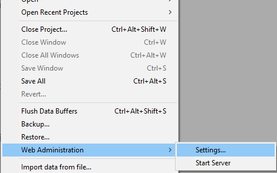

`WebAdmin`, とは、4D および 4D Server に使用される組み込みの Webサーバーコンポーネントの名称で、以下のような特定の機能への安全な Webアクセスを提供します:

- プロジェクトへのREST アクセス
- [データエクスプローラー](dataExplorer.md)
- [Qodly Studio プレビューレンダリング](https://developer.4d.com/qodly/4DQodlyPro/rendering#preview-in-qodly-studio)

ブラウザーや、任意の Webアプリケーションから、ローカルまたはリモートでこの Webサーバーに接続し、関連の 4Dアプリケーションにアクセスすることができます。

Web 管理サーバーは、 `WebAdmin` 権限を持つユーザーの認証を処理し、管理セッションを開いて専用インターフェースにアクセスできるようにします。

この機能は、ヘッドレスで動作する 4Dアプリケーションでも、インターフェースを持つ 4Dアプリケーションでも使用できます。

## Web管理サーバーの起動

デフォルトでは、Web 管理サーバーは起動していません。 起動時に開始するように設定するか、(インターフェース付きの場合は) メニューから手動で開始する必要があります。

### 自動スタートアップ

Web 管理サーバーは、4D または 4D Server アプリケーションの起動時 (プロジェクトの読み込み前) に開始するように設定できます。

- インターフェースを持つ 4Dアプリケーションを使用している場合は、**ファイル ＞ Web管理 ＞ 設定...** メニュー項目を選択します。



Web管理設定ダイアログボックスで、**WebAdmin サーバーをスタートアップ時に起動** オプションをチェックします。


- ヘッドレスの 4Dアプリケーションを使用しているかにかかわらず、以下の *コマンドライン・インターフェース* の引数を使用して、自動スタートアップを有効にすることができます:

```
open ~/Desktop/4D.app --webadmin-auto-start true
```

> Web 管理サーバーが使用する TCPポート (設定により、[HTTPS](#https-port) または [HTTP](#http-port)) が開始時に空いていない場合、4D は次の 20個のポートを順に試し、利用できる最初のポートを使用します。 利用可能なポートがない場合、Webサーバーは開始せず、エラーが表示されるか、(ヘッドレスアプリケーションの場合は) コンソールのログに記録されます。

### 開始と停止

インターフェースを持つ 4Dアプリケーションを使用している場合、プロジェクトの Web 管理サーバーはいつでも開始または停止することができます:

**ファイル ＞ Web管理 ＞ Webサーバー開始** メニュー項目を選択します。


サーバーが開始されていると、メニュー項目は **Webサーバー停止** になります。Web 管理サーバーを停止するには、これを選択します。

## 設定 {#settings}

[**アクセスキー**](#access-key) を定義するには、Web 管理サーバーの設定は必須です。 デフォルトで、アクセスキーが設定されていない場合は、URL経由のアクセスは許可されません。

Web 管理サーバーの設定は、[Web管理設定ダイアログボックス](#settings-dialog-box) (後述参照) でおこないます。

> ヘッドレス4Dアプリケーションを使用している場合は、[*コマンドライン・インターフェース* の引数](#webadmin-headless-configuration) を使用して基本的な設定を定義できます。 高度なパラメーターを定義するには、設定ファイルをカスタマイズする必要があります。

### 設定ダイアログボックス

Web管理の設定ダイアログボックスを開くには、**ファイル ＞ Web 管理 ＞ 設定...** メニュー項目を選択します。


次のようなダイアログボックスが表示されます:


#### WebAdmin サーバーをスタートアップ時に起動

4D または 4D Server アプリケーションの起動時に Web 管理サーバーを自動的に開始させるには、このオプションをチェックします ([前述参照](#自動スタートアップ))。 デフォルトでは、このオプションはチェックされていません。

#### ローカルホストでHTTP接続を受け入れる

このオプションを有効にすると、4Dアプリケーションと同じマシン上で HTTP を介して Web 管理サーバーに接続できます。 デフォルトでは、このオプションはチェックされています。

:::note 注記

- ローカルホスト以外による HTTP接続は受け付けません。
- このオプションがチェックされていても、[HTTPSを受け入れる](#httpsを受け入れる) がチェックされていて、TLS の設定が有効な場合、ローカルホストの接続は HTTPS を使用します。

:::

#### HTTP ポート

**ローカルホストでHTTP接続を受け入れる** オプションが有効な場合、Web 管理サーバーへの HTTP接続に使用するポート番号です。 デフォルト値は 7080 です。

#### HTTPSを受け入れる

このオプションを有効にすると、Web 管理サーバーに HTTPS を介して接続できます。 デフォルトでは、このオプションはチェックされています。

#### HTTPS ポート

**HTTPSを受け入れる** オプションが有効な場合、Web 管理サーバーへの HTTPS接続に使用するポート番号です。 デフォルト値は 7443 です。

#### 認証フォルダパス

TLS証明書ファイルが置かれているフォルダーのパスです。 デフォルトでは認証フォルダパスは空で、4D または 4D Server は 4Dアプリケーションに組み込まれた証明書ファイルを使用します (カスタム証明書はプロジェクトフォルダーの隣に保存する必要があります)。

#### デバッグログモード

HTTPリクエストログファイル (アプリケーションの "Logs" フォルダーに格納されている HTTPDebugLog_*nn*.txt (nn はファイル番号)) の状態やフォーマットを指定します。 次のオプションから選択することができます:

- **無効化** (デフォルト)
- **bodyパーツを全て** - レスポンスおよびリクエストのボディパーツを含める形で有効化。
- **bodyパーツを含めない** - ボディパーツを含めない形で有効化 (ボディザイズは提供されます)
- **リクエストのbody** - リクエストのボディパーツのみを含める形で有効化。
- **レスポンスのbody** - レスポンスのボディパーツのみを含める形で有効化。

#### アクセスキー

Web 管理サーバーへの URL経由アクセスのロックを解除するには、アクセスキーの定義は必須です (4Dメニューコマンドによるアクセスにはアクセスキーは必要ありません)。 アクセスキーが定義されていない場合、[データエクスプローラーページ](dataExplorer.md) などの Web管理インターフェースに Webクライアントを使って URLを介した接続はできません。 接続リクエストがあった場合には、エラーページが返されます:


アクセスキーはパスワードに似ていますが、ログインとは関係ありません。

- 新しいアクセスキーを定義するには、**定義** ボタンをクリックし、ダイアログボックスにアクセスキーの文字列を入力して **OK** をクリックします。 すると、ボタンラベルが **編集** に変わります。
- アクセスキーを編集するには、**編集** ボタンをクリックし、ダイアログボックスに新しいアクセスキーの文字列を入力して **OK** をクリックします。
- 新しいアクセスキーを削除するには、**編集** ボタンをクリックし、ダイアログボックスのアクセスキー欄を空にして **OK** をクリックします。

#### Qodly Studio へのアクセスを有効化する

:::note

このオプションは、Qodly Studio ライセンスが有効な場合にのみ表示されます。

:::

このオプションにより、4Dアプリケーションレベルでの [Qodly Studio](../WebServer/qodly-studio.md) へのユーザーアクセスができるようになります。 また、[各プロジェクトレベルでもアクセスを有効](../settings/web.md#qodly-studio-へのアクセスを有効化する) にする必要があることに注意してください。

:::note

このオプションは、[ワンクリック設定ダイアログボックス](https://developer.4d.com/qodly/4DQodlyPro/gettingStarted#one-click-configuration)を使用した場合には自動的にチェックされています。

:::

## ヘッドレス設定

すべての [Web 管理サーバー設定](#設定) は、`WebAdmin.4DSettings` ファイルに保存されます。 4D および 4D Server アプリケーション毎にデフォルトの `WebAdmin.4DSettings` ファイルが 1つ存在し、同じホストマシン上で複数のアプリケーションを運用することができます。

4D および 4D Server アプリケーションをヘッドレスで実行している場合、デフォルトの `WebAdmin.4DSettings` ファイルを設定して使用するか、カスタムの `.4DSettings` ファイルを指定することができます。

ファイルの内容を設定するには、インターフェースを持つ 4Dアプリケーションの[WebAdmin設定ダイアログ](#設定ダイアログボックス) を使用し、その後ヘッドレスで実行します。 このとき、デフォルトの `WebAdmin.4DSettings` ファイルが使用されます。

また、カスタムの `.4DSettings` ファイル (xml形式) を設定し、デフォルトファイルの代わりに使用することもできます。 この機能をサポートするために、[コマンドライン・インターフェース](cli.md) ではいくつかの専用の引数が用意されています。

> `.4DSettings` ファイルにおいて、アクセスキーは平文では保存されません。

例:

```
"%HOMEPATH%\Desktop\4D Server.exe" MyApp.4DLink --webadmin-access-key 
	"my Fabulous AccessKey" --webadmin-auto-start true   
	--webadmin-store-settings

```

## 認証

事前に本人確認せずに、 Web 管理サーバーによって管理されている Web ページにURL経由でアクセスした場合、認証が必要になります。 ユーザーは認証ダイアログボックス内にて[アクセスキー](#アクセスキー) を入力する必要があります:


アクセスキーがWeb 管理サーバー設定内で定義されていなかった場合、URL 経由でのアクセスはできません(特定のメッセージが表示されます)。

4D または 4D Server のメニュー項目 (**レコード ＞ データエクスプローラー** または **ウィンドウ ＞ データエクスプローラー** (4D Server) など) から Web 管理サーバーページによって管理されているWebページに直接アクセスした場合、アクセスは認証なしで許可され、ユーザーは自動的に認証されます。

:::note

アクセスが許可されると、Web 管理サーバーによって "WebAdmin" 権限を持つ [Web セッション](WebServer/sessions.md) が作成されます。 この権限は[リソースに対して特定の許可が適用](../ORDA/privileges.md) されていない限り、Web プロセスを通して全てのデータへのオープンなアクセスを提供します。

:::

