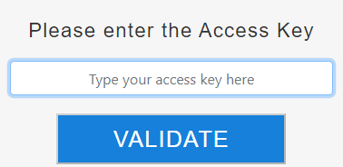

An embedded web server component, named `WebAdmin`, is used by 4D and 4D Server to provide a secured web access to specific features:

- REST accesses to the project
- the [Data Explorer](dataExplorer.md)
- the [Qodly Studio preview rendering](https://developer.4d.com/qodly/4DQodlyPro/rendering#preview-in-qodly-studio)

ブラウザーや、任意の Webアプリケーションから、ローカルまたはリモートでこの Webサーバーに接続し、関連の 4Dアプリケーションにアクセスすることができます。

The Web Administration Server handles the authentication of users with `WebAdmin` privileges, so that they can open administration sessions and access dedicated interfaces.

この機能は、ヘッドレスで動作する 4Dアプリケーションでも、インターフェースを持つ 4Dアプリケーションでも使用できます。

## Starting the Web Administration Server

By default, the Web Administration Server web server is not launched. 起動時に開始するように設定するか、(インターフェース付きの場合は) メニューから手動で開始する必要があります。

### 自動スタートアップ

You can configure the Web Administration Server to be launched at 4D or 4D Server application startup (before any project is loaded).

- インターフェースを持つ 4Dアプリケーションを使用している場合は、**ファイル ＞ Web管理 ＞ 設定...** メニュー項目を選択します。


Web管理設定ダイアログボックスで、**WebAdmin サーバーをスタートアップ時に起動** オプションをチェックします。


- ヘッドレスの 4Dアプリケーションを使用しているかにかかわらず、以下の *コマンドライン・インターフェース* の引数を使用して、自動スタートアップを有効にすることができます:

```
open ~/Desktop/4D.app --webadmin-auto-start true
```

> If the TCP port used by the Web Administration Server ([HTTPS](#https-port) or [HTTP](#http-port), depending on the settings) is not free at startup, 4D will try successively the 20 following ports, and use the first one that is available. 利用可能なポートがない場合、Webサーバーは開始せず、エラーが表示されるか、(ヘッドレスアプリケーションの場合は) コンソールのログに記録されます。

### 開始と停止

If you use a 4D application with interface, you can start or stop the Web Administration Server for your project at any moment:

**ファイル ＞ Web管理 ＞ Webサーバー開始** メニュー項目を選択します。


The menu item becomes **Stop Server** when the server is launched; select **Stop Server** to stop the Web Administration Server.

## Settings {#settings}

Configuring the Web Administration Server is mandatory in particular to define the [**access key**](#access-key). デフォルトで、アクセスキーが設定されていない場合は、URL経由のアクセスは許可されません。

You can configure the Web Administration Server using the [Web Administration settings dialog box](#settings-dialog-box) (see below).

> ヘッドレス4Dアプリケーションを使用している場合は、[*コマンドライン・インターフェース* の引数](#webadmin-headless-configuration) を使用して基本的な設定を定義できます。 高度なパラメーターを定義するには、設定ファイルをカスタマイズする必要があります。

### 設定ダイアログボックス

Web管理の設定ダイアログボックスを開くには、**ファイル ＞ Web 管理 ＞ 設定...** メニュー項目を選択します。


次のようなダイアログボックスが表示されます:


#### WebAdmin サーバーをスタートアップ時に起動

Check this option if you want the Web Administration Server to be automatically launched when the 4D or 4D Server application starts ([see above](#launch-at-startup)). デフォルトでは、このオプションはチェックされていません。

#### ローカルホストでHTTP接続を受け入れる

When this option is checked, you will be able to connect to the Web Administration Server through HTTP on the same machine as the 4D application. デフォルトでは、このオプションはチェックされています。

:::note 注記

- ローカルホスト以外による HTTP接続は受け付けません。
- このオプションがチェックされていても、[HTTPSを受け入れる](#httpsを受け入れる) がチェックされていて、TLS の設定が有効な場合、ローカルホストの接続は HTTPS を使用します。

:::

#### HTTP ポート

Port number to use for connections through HTTP to the Web Administration Server when the **Accept HTTP connections on localhost** option is checked. デフォルト値は 7080 です。

#### HTTPSを受け入れる

When this option is checked, you will be able to connect to the Web Administration Server through HTTPS. デフォルトでは、このオプションはチェックされています。

#### HTTPS ポート

Port number to use for connections through HTTPS to the Web Administration Server when the **Accept HTTPS** option is checked. デフォルト値は 7443 です。

#### 認証フォルダパス

TLS証明書ファイルが置かれているフォルダーのパスです。 デフォルトでは認証フォルダパスは空で、4D または 4D Server は 4Dアプリケーションに組み込まれた証明書ファイルを使用します (カスタム証明書はプロジェクトフォルダーの隣に保存する必要があります)。

#### デバッグログモード

HTTPリクエストログファイル (アプリケーションの "Logs" フォルダーに格納されている HTTPDebugLog_*nn*.txt (nn はファイル番号)) の状態やフォーマットを指定します。 次のオプションから選択することができます:

- **無効化** (デフォルト)
- **bodyパーツを全て** - レスポンスおよびリクエストのボディパーツを含める形で有効化。
- **bodyパーツを含めない** - ボディパーツを含めない形で有効化 (ボディザイズは提供されます)
- **リクエストのbody** - リクエストのボディパーツのみを含める形で有効化。
- **レスポンスのbody** - レスポンスのボディパーツのみを含める形で有効化。

#### アクセスキー

Defining an access key is mandatory to unlock access to the Web Administration Server through a URL (access via a 4D menu command does not require an access key). アクセスキーが定義されていない場合、[データエクスプローラーページ](dataExplorer.md) などの Web管理インターフェースに Webクライアントを使って URLを介した接続はできません。 接続リクエストがあった場合には、エラーページが返されます:


アクセスキーはパスワードに似ていますが、ログインとは関係ありません。

- 新しいアクセスキーを定義するには、**定義** ボタンをクリックし、ダイアログボックスにアクセスキーの文字列を入力して **OK** をクリックします。 すると、ボタンラベルが **編集** に変わります。
- アクセスキーを編集するには、**編集** ボタンをクリックし、ダイアログボックスに新しいアクセスキーの文字列を入力して **OK** をクリックします。
- 新しいアクセスキーを削除するには、**編集** ボタンをクリックし、ダイアログボックスのアクセスキー欄を空にして **OK** をクリックします。

#### Qodly Studio へのアクセスを有効化する

:::note

このオプションは、Qodly Studio ライセンスが有効な場合にのみ表示されます。

:::

このオプションにより、4Dアプリケーションレベルでの [Qodly Studio](../WebServer/qodly-studio.md) へのユーザーアクセスができるようになります。 また、[各プロジェクトレベルでもアクセスを有効](../settings/web.md#qodly-studio-へのアクセスを有効化する) にする必要があることに注意してください。

:::note

This option is automatically checked if you used the [One-click configuration dialog box](https://developer.4d.com/qodly/4DQodlyPro/gettingStarted#one-click-configuration).

:::

## Headless Configuration

All [Web Administration Server settings](#settings) are stored in the `WebAdmin.4DSettings` file. 4D および 4D Server アプリケーション毎にデフォルトの `WebAdmin.4DSettings` ファイルが 1つ存在し、同じホストマシン上で複数のアプリケーションを運用することができます。

4D および 4D Server アプリケーションをヘッドレスで実行している場合、デフォルトの `WebAdmin.4DSettings` ファイルを設定して使用するか、カスタムの `.4DSettings` ファイルを指定することができます。

ファイルの内容を設定するには、インターフェースを持つ 4Dアプリケーションの[WebAdmin設定ダイアログ](#設定ダイアログボックス) を使用し、その後ヘッドレスで実行します。 このとき、デフォルトの `WebAdmin.4DSettings` ファイルが使用されます。

また、カスタムの `.4DSettings` ファイル (xml形式) を設定し、デフォルトファイルの代わりに使用することもできます。 この機能をサポートするために、[コマンドライン・インターフェース](cli.md) ではいくつかの専用の引数が用意されています。

> `.4DSettings` ファイルにおいて、アクセスキーは平文では保存されません。

例:

```
"%HOMEPATH%\Desktop\4D Server.exe" MyApp.4DLink --webadmin-access-key 
	"my Fabulous AccessKey" --webadmin-auto-start true   
	--webadmin-store-settings

```

## 認証

When a web page controlled by the Web Administration Server is accessed by entering a URL and without prior identification, an authentication is required. The user must enter the [access key](#access-key) in an authentication dialog box:



If the access key was not defined in the Web Administration Server settings, no access via URL is possible (a specific message is displayed).

When a web page controlled by the Web Administration Server page is accessed directly from a 4D or 4D Server menu item (such as **Records > Data Explorer** or **Window > Data Explorer** (4D Server)), access is granted without authentication, the user is automatically authenticated.

:::note

Once the access is granted, a [web session](WebServer/sessions.md) with a specific "WebAdmin" privilege is created by the Web Administration Server. This privilege provides an open access to all data through web processes, as soon as no [specific permissions are applied to resources](../ORDA/privileges.md).

:::

