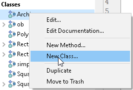

## 概要

4D ランゲージでは **クラス** の概念がサポートされています。 プログラミング言語では、クラスを利用することによって、属性やメソッドなどを持つ特定のオブジェクト種を定義することができます。

ユーザークラスが定義されていれば、そのクラスのオブジェクトをコード内で **インスタンス化** することができます。 各オブジェクトは、それ自身が属するクラスのインスタンスです。 クラスは、別のクラスを [継承](#class-extends-classname) することで、その [関数](#function) と、([宣言された](#property) および [計算された](#function-get-と-function-set)) プロパティを受け継ぐことができます。

> 4D におけるクラスモデルは JavaScript のクラスに類似しており、プロトタイプチェーンに基づきます。

たとえば、次のように `Person` クラスを定義した場合:

```4d
// クラス: Person.4dm
Class constructor($firstname : Text; $lastname : Text)
 This.firstName:=$firstname
 This.lastName:=$lastname

Function get fullName() -> $fullName : Text
 $fullName:=This.firstName+" "+This.lastName

Function sayHello() -> $welcome : Text

 $welcome:="Hello "+This.fullName
```

この "Person" のインスタンスをメソッド内で作成するには、以下のように書けます:

```4d
var $person : cs.Person // Person クラスのオブジェクト
var $hello : Text
$person:=cs.Person.new("John";"Doe")
// $person:{firstName: "John"; lastName: "Doe"; fullName: "John Doe"}
$hello:=$person.sayHello() // "Hello John Doe"
```

## クラスの管理

### クラス定義

4D においてユーザークラスとは、`/Project/Sources/Classes/` フォルダーに保存された専用の [メソッド](methods.md) ファイル (.4dm) によって定義されます。 ファイル名がクラス名になります。

クラスを命名する際には、次のルールに留意してください:

- [クラス名](identifiers.md#クラス) は [プロパティ名の命名規則](identifiers.md#オブジェクトプロパティ) に準拠している必要があります。
- クラス名の大文字・小文字は区別されます。
- 競合防止のため、データベースのテーブルと同じ名前のクラスを作成するのは推奨されないこと

たとえば、"Polygon" という名前のクラスを定義するには、次のファイルを作成する必要があります:

```
Project フォルダー Project Sources Classes Polygon.4dm
```

### クラスの削除

既存のクラスを削除するには:

- ディスク上で "Classes" フォルダーより .4dm クラスファイルを削除します。
- 4D エクスプローラーでは、クラスを選択した状態で  をクリックするか、コンテキストメニューより **移動** ＞ **ゴミ箱** を選択します。

### 4D インターフェースの使用

**ファイル** メニューまたはエクスプローラーなど、4D インターフェースを介してクラスを作成した場合には、クラスファイルは自動的に適切な場所に保存されます。

#### ファイルメニューとツールバー

4D 開発の **ファイル** メニューまたはツールバーより **新規** > **クラス...** を選択することで、開いているプロジェクトにクラスファイルを新規作成することができます。

**Ctrl+Shift+Alt+k** ショートカットも使用できます。

#### エクスプローラー

エクスプローラーの **メソッド** ページにおいて、クラスは **クラス** カテゴリに分類されています。

クラスを新規作成するには次の方法があります:

- **クラス** カテゴリを選択し、 ボタンをクリックします。
- エクスプローラーウィンドウの下部にあるアクションメニュー、またはクラスグループのコンテキストメニューから **新規クラス...** を選択します。
  
- エクスプローラーのホームページのコンテキストメニューより **新規** > **クラス...** を選択します。

#### クラスのコードサポート

各種 4Dウィンドウ (コードエディター、コンパイラー、デバッガー、ランタイムエクスプローラー) において、クラスコードは "特殊なプロジェクトメソッド" のように扱われます:

- コードエディター:
  - クラスは実行できません
  - クラスメソッドはコードのブロックです
  - オブジェクトメンバーに対する **定義に移動** 操作はクラスの Function 宣言を探します。例: "$o.f()" の場合、"Function f" を見つけます。
  - クラスのメソッド宣言に対する **参照箇所を検索** 操作は、そのメソッドがオブジェクトメンバーとして使われている箇所を探します。例: "Function f" の場合 "$o.f()" を見つけます。
- ランタイムエクスプローラーおよびデバッガーにおいて、クラスメソッドは `<ClassName>` コンストラクターまたは `<ClassName>.<FunctionName>` 形式で表示されます。

## クラスストア

定義されたクラスには、クラスストアよりアクセスすることができます。 クラスストアには次の二つが存在します:

- [`cs`](../commands/cs.md) - ユーザークラスストア
- [`4D`](../commands/4d.md) - ビルトインクラスストア

### `cs`

<!-- REF #_command_.cs.Syntax -->**cs** : Object<!-- END REF -->

<!-- REF #_command_.cs.Params -->

| 引数         | 型      |                                | 説明                          |                  |
| ---------- | ------ | ------------------------------ | --------------------------- | ---------------- |
| classStore | Object | &amp;larr; | プロジェクトまたはコンポーネントのユーザークラスストア | <!-- END REF --> |

`cs` コマンドは、<!-- REF #_command_.cs.Summary -->カレントプロジェクトまたはコンポーネントのユーザークラスストアを返します<!-- END REF -->。 これには、プロジェクトまたはコンポーネントにて [定義](#クラス定義) されている、すべてのユーザークラスが含まれます。 デフォルトでは、 [ORDAクラス](ORDA/ordaClasses.md) のみ利用可能です。

#### 例題

`myClass` オブジェクトの新規インスタンスを作成するには、次のように書きます:

```4d
$instance:=cs.myClass.new()
```

### `4D`

<!-- REF #_command_.4D.Syntax -->**4D** : Object <!-- END REF -->

<!-- REF #_command_.4D.Params -->

| 引数         | 型      |                                | 説明       |                  |
| ---------- | ------ | ------------------------------ | -------- | ---------------- |
| classStore | Object | &amp;larr; | 4Dクラスストア | <!-- END REF --> |

`4D` コマンドは、<!-- REF #_command_.4D.Summary -->ビルトイン 4Dクラスのクラスストアを返します<!-- END REF -->。 [CryptoKey](API/CryptoKeyClass.md) などの専用 API へのアクセスを提供します。

#### 例題

`CryptoKey` クラスに新規キーを作成するには、次のように書きます:

```4d
$key:=4D.CryptoKey.new(New object("type";"ECDSA";"curve";"prime256v1"))
```

ビルトイン4Dクラスの数を表示します:

```4d
 var $keys : collection
 $keys:=OB Keys(4D)
 ALERT(String($keys.length)+"件のビルトインクラスが存在します。")
```

## Class オブジェクト

プロジェクトにおいてクラスが [定義](#クラス定義) されていれば、それは 4Dランゲージ環境に読み込まれます。 クラスとは、それ自身が ["Class" クラス](API/ClassClass.md) のオブジェクトです。 Class オブジェクトは次のプロパティや関数を持ちます:

- [`name`](API/ClassClass.md#name) 文字列
- [`superclass`](API/ClassClass.md#superclass) オブジェクト (無い場合は null)
- [`new()`](API/ClassClass.md#new) 関数 (Class オブジェクトをインスタンス化します)
- [`isShared`](API/ClassClass.md#isshared) プロパティ (クラスが [共有](#共有クラス)されている場合に true)
- [`isSingleton`](API/ClassClass.md#issingleton) プロパティ ([シングルトン](#シングルトンクラス)の場合に true)
- [`isSessionSingleton`](API/ClassClass.md#issessionsingleton) プロパティ ([セッションシングルトン](#シングルトンクラス)の場合に true)
- [`me`](API/ClassClass.md#me) プロパティ ([シングルトン](シングルトンクラス) をインスタンス化および取得します)

また、Class オブジェクトは [`constructor`](#class-constructor) オブジェクトを参照することも可能です (任意)。

Class オブジェクトそのものは [共有オブジェクト](shared.md) です。 したがって、異なる 4Dプロセスから同時にアクセスすることができます。

### 継承

クラス宣言において [Class extends](classes.md#class-extends-classname) キーワードを使うと、そのクラスは親クラス (つまり [`スーパークラス`](API/ClassClass.md#superclass)) を継承します。

関数やプロパティがクラス内で見つからない場合、4D はそのクラスの [スーパークラス](API/ClassClass.md#superclass) 内を検索します。 見つからない場合、4D はさらに、そのスーパークラスのスーパークラス内を探します。 これは、スーパークラスが存在しなくなるまで続きます (すべてのオブジェクトは "Object" スーパークラスを継承しています)。

## クラスキーワード

クラス定義内では、専用の 4Dキーワードが使用できます:

- `Function <Name>`: オブジェクトのクラス関数を定義します。
- `Class constructor`: クラスの新規インスタンス (オブジェクト) を初期化します。
- `property`: オブジェクトのスタティックプロパティを型定義します。
- `Function get <Name>` と `Function set <Name>`: オブジェクトの計算プロパティを定義します。
- `Class extends <ClassName>`: 継承を定義します。
- `This` and `Super` are commands that have special

### `Function`

#### シンタックス

```4d
{shared} Function <name>({$parameterName : type; ...}){->$parameterName : type}
// コード
```

:::note

There is no ending keyword for function code. The 4D language automatically detects the end of a function's code by the next `Function` keyword or the end of the class file.

:::

クラス関数とは、当該クラスのプロパティです。 クラス関数は [`4D.Function`](API/FunctionClass.md) クラスのオブジェクトです。 クラス定義ファイルでは、`Function` キーワードに続けて関数名を指定して宣言をおこないます。

[共有クラス](#共有クラス) 内で関数が宣言されている場合は、`shared` キーワードを使用することによって、[`Use...End use` structure](shared.md#useend-use) 構文なしで関数を呼び出せるようにできます。 詳細については、後述の [共有関数](#共有関数) の項目を参照ください。

関数名は [プロパティ名の命名規則](Concepts/identifiers.md#オブジェクトプロパティ) に準拠している必要があります。

:::note

プロパティと関数は同じ名前空間を共有しているため、同じクラスのプロパティと関数に同じ名前を使用することは許されていません (この場合、エラーが発生します)。

:::

:::tip

アンダースコア ("_") 文字で関数名を開始すると、その関数は 4Dコードエディターの自動補完機能から除外されます。 たとえば、`MyClass` に `Function _myPrivateFunction` を宣言した場合、コードエディターにおいて `"cs.MyClass."` とタイプしても、この関数は候補として提示されません 。

:::

関数名のすぐ後に、名前とデータ型を指定して [引数](#引数) を宣言します (戻り値の宣言も可)。 例:

```4d
Function computeArea($width : Integer; $height : Integer)->$area : Integer
```

クラスメソッド内でオブジェクトインスタンスを参照するには `This` コマンドを使います。 例:

```4d
Function setFullname($firstname : Text; $lastname : Text)
 This.firstName:=$firstname
 This.lastName:=$lastname

Function getFullname()->$fullname : Text
 $fullname:=This.firstName+" "+Uppercase(This.lastName)
```

クラス関数の場合には、`Current method name` コマンドは次を返します: `<ClassName>.<FunctionName>` (例: "MyClass.myFunction")。

アプリケーションのコード内では、クラス関数はオブジェクトインスタンスのメンバーメソッドとして呼び出され、[引数](#引数) を受け取ることができます。 以下のシンタックスがサポートされています:

- `()` 演算子の使用。 例: `myObject.methodName("hello")`
- "4D.Function" クラスメンバーメソッドの使用:
  - [`apply()`](API/FunctionClass.md#apply)
  - [`call()`](API/FunctionClass.md#call)

:::warning スレッドセーフに関する警告

クラス関数がスレッドセーフではないのに、"プリエンプティブプロセスで実行可能" なメソッドから呼び出された場合:

- 普通のメソッドの場合とは異なり、コンパイラーはエラーを生成しません。
- ランタイムにおいてのみ、4D はエラーを生成します。

:::

#### 引数

関数の引数は、引数名とデータ型をコロンで区切って宣言します。 パラメーター名は [プロパティ名の命名規則](Concepts/identifiers.md#オブジェクトプロパティ) に準拠している必要があります。 複数のパラメーター (およびその型) を宣言する場合は、それらをセミコロン (;) で区切ります。

```4d
Function add($x; $y : Variant; $z : Integer; $xy : Object)
```

:::note

パラメーターの型が宣言されていない場合には、`バリアント` 型として定義されます。

:::

#### 戻り値

関数の戻り値を宣言するには (任意)、入力パラメーターリストに矢印 (`->`) と戻り値の定義を追加します。 例:

```4d
Function add($x : Variant; $y : Integer)->$result : Integer
 $result:=$x+$y
```

コロン (`:`) 記号の後に戻り値のデータ型だけを指定し、そのうえで [`return 文`](parameters.md#return-expression) を使って戻り値を返すこともできます (これは関数の実行を終了します)。 例:

```4d
Function add($x : Variant; $y : Integer): Integer
 // なんらかのコード
 return $x+$y
```

#### 例題 1

```4d
property name : Text
property height; width : Integer

// クラス: Rectangle
Class constructor($width : Integer; $height : Integer)
 This.name:="Rectangle"
 This.height:=$height
 This.width:=$width

// 関数定義
Function getArea()->$result : Integer
 $result:=(This.height)*(This.width)
```

```4d
// プロジェクトメソッドにて

var $rect : cs.Rectangle
var $area : Real

$rect:=cs.Rectangle.new(50;100)  
$area:=$rect.getArea() //5000
```

#### 例題 2

[`return 文`](parameters.md#return-expression) を使った例です:

```4d
Function getRectArea($width : Integer; $height : Integer) : Integer
 If ($width > 0 && $height > 0)
  return $width * $height
 Else
  return 0
 End if
```

### `Class Constructor`

#### シンタックス

```4d
// クラス: MyClass
{shared} {{session} singleton} Class Constructor({$parameterName : type; ...})
// コード
```

:::note

There is no ending keyword for class constructor function code. The 4D language automatically detects the end of a function's code by the next `Function` keyword or the end of the class file.

:::

クラスコンストラクター関数を使って、ユーザークラスのオブジェクトを生成・初期化することができます。 このコンストラクターは任意の [引数](#引数) を受け取ることができます。

クラスコンストラクターが定義されていると、[`new()`](API/ClassClass.md#new) 関数を呼び出したときに、当該コンストラクターが呼び出されます (コンストラクターで引数を指定している場合は `new()` 関数に渡します)。

コンストラクター関数は、1つのクラスに 1つしか存在できません (そうでない場合はエラーが返されます)。 [`Super`](#super) キーワードを使用することで、コンストラクターはスーパークラス (親クラス) のコンストラクターを呼び出すことができます。

コンストラクター内でインスタンスのプロパティを作成し、型宣言することができます (例題参照)。 また、インスタンスプロパティの値が、コンストラクターに渡される引数に依存しない場合は、[`property`](#property) キーワードを使用して定義することができます。

`shared` キーワードを使うと **共有クラス** が作成されます。共有クラスは、共有オブジェクトのインスタンス化にのみ使われます。 詳細については、後述の [共有クラス](#共有クラス) の項目を参照ください。

`singleton` キーワードを使うと **シングルトン** が作成されます。シングルトンクラスは、クラスインスタンスを一つに限定する場合に使われます。 `session singleton` キーワードを使うと、セッションごとに 1つのインスタンスを作成します。 詳細については、後述の [シングルトンクラス](#シングルトンクラス) の項目を参照ください。

#### 例題

```4d
// クラス: MyClass
// MyClass のクラスコンストラクター
Class constructor ($name : Text ; $age : Integer)
 This.name:=$name
 This.age:=$age
```

```4d
// プロジェクトメソッドにて
// オブジェクトをインスタンス化します
var $o : cs.MyClass
$o:=cs.MyClass.new("John";42)
// $o = {"name":"John";"age":42}
```

### `property`

#### シンタックス

`property <propertyName>{; <propertyName2>;...}{ : <propertyType>}`

`property` キーワードを使用して、ユーザークラス内のプロパティを宣言することができます。 クラスプロパティには、名前と型があります。

クラスプロパティを宣言することで、コードエディターの自動補完機能とエラー検出機能を強化します。

プロパティは、[`new()`](API/ClassClass.md#new) 関数が呼び出されたときに、新規作成するオブジェクトについて宣言されますが、自動で追加されるわけではありません (値が割り当てられた場合にのみ追加されます)。

:::note

[宣言と同時にプロパティを初期化](#宣言と同時にプロパティを初期化する) すると、そのプロパティは自動的にオブジェクトに追加されます。

:::

プロパティ名は [プロパティ名の命名規則](Concepts/identifiers.md#オブジェクトプロパティ) に準拠している必要があります。

:::note

プロパティと関数は同じ名前空間を共有しているため、同じクラスのプロパティと関数に同じ名前を使用することは許されていません (この場合、エラーが発生します)。

:::

プロパティの型として、以下のものがサポートされています:

| propertyType                 | 内容                                                              |
| ---------------------------- | --------------------------------------------------------------- |
| `Text`                       | テキスト値                                                           |
| `Date`                       | 日付値                                                             |
| `Time`                       | 時間値                                                             |
| `Boolean`                    | ブール値                                                            |
| `Integer`                    | 倍長整数値                                                           |
| `Real`                       | 実数値                                                             |
| `Pointer`                    | ポインター値                                                          |
| `Picture`                    | ピクチャー値                                                          |
| `Blob`                       | スカラーBLOB値                                                       |
| `Collection`                 | コレクション値                                                         |
| `Variant`                    | バリアント値                                                          |
| `Object`                     | デフォルトクラス (4D.Object) のオブジェクト |
| `4D.<className>`             | 4Dクラス名のオブジェクト                                                   |
| `cs.<className>`             | ユーザークラス名のオブジェクト                                                 |
| `cs.<namespace>.<className>` | `<namespace>` コンポーネントクラス名のオブジェクト                                |

宣言時に型を省略すると、プロパティはバリアント型として作成されます。

:::info

`property` キーワードは、クラス関数内の `Function` および `Class Constructor` ブロック外でのみ使用できます。

:::

#### 宣言と同時にプロパティを初期化する

プロパティを宣言する際には、1つのステートメントでデータ型と初期値の両方を指定することができます。 シンタックスは次の通りです:

`property <propertyName> { : <propertyType>} := <Propertyvalue>`

:::note

このシンタックスを使用する場合、複数のプロパティを一度に宣言することはできません。

:::

宣言の際には型を省略することができます。その場合、可能な限り型は推論されます。 例:

```4d
// クラス: MyClass

property name : Text := "Smith"
property age : Integer := 42

property birthDate := !1988-09-29! // 日付は推測されます
property fuzzy // バリアント
```

プロパティを宣言行で初期化していると、[`new()`](API/ClassClass.md#new) 関数によるインスタンス化の後、コンストラクターが呼び出される前にクラスオブジェクトにプロパティが追加されます。

もしクラスが他のクラスを [継承](#class-extends-classname) する場合、親クラスのプロパティは子クラスのプロパティよりも先にインスタンス化されます。

:::note

宣言と同時に色かするプロパティが [共有クラス](#共有クラス) のオブジェクトまたはコレクションである場合、その値は自動的に共有された値に変換されます:

```4d
// 共有クラス内
property myCollection := ["something"]
// myCollection は共有コレクションとなり、
// 以下と同等です:
myCollection := New shared collection("something")
```

:::

#### 例題

```4d
// クラス: MyClass

property name : Text
property age : Integer
property color : Text := "Blue"
```

メソッド内で:

```4d
var $o : cs.MyClass
$o:=cs.MyClass.new() // $o:{"color" : "Blue"}
$o.name:="John" // $o:{"color" : "Blue"; "name" : "John"}
$o.age:="Smith"  // シンタックスチェックでエラー
```

### `Function get` と `Function set`

#### シンタックス

```4d
{shared} Function get <name>()->$result : type
// コード
```

```4d
{shared} Function set <name>($parameterName : type)
// コード
```

`Function get` と `Function set` は、クラスの **計算プロパティ** を定義するアクセサーです。 計算プロパティとは、計算をマスクするデータ型を持つ命名プロパティです。 計算プロパティの値にアクセスすると、4D は対応するアクセサーのコードを実行します:

- プロパティを読み取るときには `Function get` が実行されます。
- プロパティに書き込むときには `Function set` が実行されます。

プロパティがアクセスされない場合は、コードも実行されません。

計算プロパティは、メモリ上に保持する必要のないデータを処理するために設計されています。 計算プロパティは通常、永続的なプロパティに基づいています。 たとえば、クラスオブジェクトの永続的なプロパティとして、_税込価格_ と _消費税率_ が含まれている場合、_税抜価格_ は計算プロパティで処理することができます。

クラス定義ファイルでは、計算プロパティの宣言には、`Function get` (_ゲッター_) と `Function set` (_セッター_) のキーワードを使い、その後にプロパティ名を記述します。 名称は [プロパティ名の命名規則](Concepts/identifiers.md#オブジェクトプロパティ) に準拠している必要があります。

`Function get` はプロパティの型の値を返し、`Function set` はプロパティの型の引数を受け取ります。 どちらも、標準的な [関数の引数](#引数) のルールに準拠する必要があります。

両方の関数が定義されている場合、計算プロパティは **read-write** となります。 `Function get` のみが定義されている場合、計算プロパティは **read-only** です。 この場合、コードがプロパティを変更しようとするとエラーが返されます。 `Function set` のみが定義されている場合、4D はプロパティの読み取り時に _undefined_ を返します。

[共有クラス](#共有クラス) 内で関数が宣言されている場合は、`shared` キーワードを使用することによって、[`Use...End use` 構文](shared.md#useend-use)なしで関数を呼び出せるようにできます。 詳細については、後述の [共有関数](#共有関数) の項目を参照ください。

計算プロパティの型は、_ゲッター_ の `$return` の型宣言によって定義されます。 [有効なプロパティタイプ](dt_object.md) であれば、いずれも使用可能です。

> オブジェクトプロパティに _undefined_ を代入すると、型を保持したまま値がクリアされます。 このためには、まず `Function get` を呼び出して値の型を取得し、次にその型の空の値で `Function set` を呼び出します。

#### 例題 1

```4d
// クラス: Person.4dm
property firstName; lastName : Text

Class constructor($firstname : Text; $lastname : Text)
 This.firstName:=$firstname
 This.lastName:=$lastname

Function get fullName() -> $fullName : Text
 $fullName:=This.firstName+" "+This.lastName

Function set fullName( $fullName : Text )
 $p:=Position(" "; $fullName)
 This.firstName:=Substring($fullName; 1; $p-1)
 This.lastName:=Substring($fullName; $p+1)
```

```4d
// プロジェクトメソッドにて
$fullName:=$person.fullName // Function get fullName() が呼び出されます
$person.fullName:="John Smith" // Function set fullName() が呼び出されます
```

#### 例題 2

```4d
Function get fullAddress()->$result : Object

 $result:=New object

 $result.fullName:=This.fullName
 $result.address:=This.address
 $result.zipCode:=This.zipCode
 $result.city:=This.city
 $result.state:=This.state
 $result.country:=This.country
```

### `Class extends <ClassName>`

#### シンタックス

```4d
// Class: ChildClass
Class extends <ParentClass>
```

クラス宣言において `Class extends` キーワードを使うと、別のユーザークラスの子ユーザークラスを作成することができます。 この子クラスは、親クラスのすべての機能を継承します。

クラス継承は次のルールに沿っている必要があります:

- ユーザークラスはビルトインクラスを継承できません (例外は 4D.Object および [ORDAクラス](../ORDA/ordaClasses.md) で、すべてのユーザークラスにデフォルトで継承されます)。
- ユーザークラスは、別のプロジェクトやコンポーネントのユーザークラスを継承できません。
- ユーザークラスは、自身を継承することはできません。
- 間接的にも、自身を継承することはできません (例: "a" extends "b" かつ "b" extends "a")。
- 共有クラスでないユーザークラスを継承 (extend) して [共有クラス](#共有クラス) を定義することはできません。

コードエディターやインタープリターは、これらのルールが破られていても検知することはできません。コンパイラーおよび "シンタックスチェック" のみがエラーを生成します。

派生クラスは、[`Super`](#super) コマンドを使って親クラスのコンストラクターを呼び出すことができます。

#### 例題

`Polygon` クラスを継承した `Square` クラスを作成します。

```4d
// クラス: Square

// パス: Classes/Square.4dm 

Class extends Polygon


Class constructor ($side : Integer)

 // 親クラスのコンストラクターを呼び出します
 // 長方形の高さ・幅パラメーターに正方形の一辺の長さを引数として渡します
 Super($side;$side)
 // 派生クラスにおいては、'This' を使用するより先に
 // Super を呼び出しておく必要があります
 This.name:="Square"


 Function getArea() -> $area : Integer
  $area:=This.height*This.width
```

## Class function commands

The following commands have specific features when they are used within class functions:

### `Super`

The [`Super`](../commands/super.md) command allows calls to the [`superclass`](../API/ClassClass#superclass), i.e. the parent class of the function. It can be called in the [class constructor](#class-constructor) or in a class function code.

For more details, see the [`Super`](../commands/super.md) command description.

### `This`

The [`This`](../commands/this.md) command returns a reference to the currently processed object. In most cases, the value of `This` is determined by how a class function is called. Usually, `This` refers to the object the function was called on, as if the function were on the object.

例:

```4d
//Class: ob

Function f() : Integer
 return This.a+This.b
```

Then you can write in a method:

```4d
$o:=cs.ob.new()
$o.a:=5
$o.b:=3
$val:=$o.f() //8
```

For more details, see the [`This`](../commands/this.md) command description.

## クラスコマンド

4Dランゲージには、クラス機能を扱う複数のコマンドがあります。

### `OB Class`

#### `OB Class ( object ) -> Object | Null`

`OB Class` は引数として渡したオブジェクトのクラスを返します。

### `OB Instance of`

#### `OB Instance of ( object ; class ) -> Boolean`

`object` が `class`、またはその子クラスに属していれば、`OB Instance of` は `true` を返します。それ以外の場合は `false` を返します。

## 共有クラス

**共有クラス** を作成することができます。 共有クラスとは、クラスの [`new()`](../API/ClassClass.md#new) 関数が呼び出されたときに、[共有オブジェクト](shared.md) をインスタンス化するユーザークラスのことを指します。 共有クラスは共有オブジェクトしか作れません。

共有クラスは **共有関数** をサポートしています。共有関数は、[`Use...End use`](shared.md#useend-use) 構文なしで呼び出すことができます。

クラスが共有クラスかどうかは、Classオブジェクトの .[`.isShared`](../API/ClassClass.md#isshared)プロパティで確認できます。

:::info

- 共有クラスでないユーザークラスを [継承](#class-extends-classname) (extend) して共有クラスを定義することはできません。
- [ORDAに基づいたデータモデルクラス](../ORDA/ordaClasses.md) では、共有クラスはサポートされていません。

:::

### 共有クラスの作成

共有クラスを作成するには、[Class Constructor](#class-constructor) の前に `shared` キーワードを追加します。 例:

```4d
// 共有クラス: Person
shared Class Constructor($firstname : Text; $lastname : Text)
 This.firstName:=$firstname
 This.lastName:=$lastname

```

```4d
// myMethod メソッド
var $person := cs.Person.new("John"; "Smith")
OB Is shared($person) // true
cs.Person.isShared // true
```

### 共有関数

共有クラス内で定義された関数が、そのクラスのオブジェクトを変更する場合には、共有オブジェクトへのアクセスを保護するために、[`Use...End use`](shared.md#useend-use) 構文を呼び出す必要があります。 しかし、**shared** として関数を定義することで、実行時には内部的な `Use...End use` を自動でトリガーするようにし、コードを簡略化することができます。

共有クラス内で共有関数を作成するには、[Function](#function) キーワードの前に `shared` キーワードを追加します。 例:

```4d
// 共有クラス Foo
shared Class Constructor()
  This.variable:=1

shared Function Bar($value : Integer)
  This.variable:=$value // use/end use の呼び出しは不要です
```

:::note

共有クラスでないユーザークラス内で関数定義時に `shared` キーワードを使っても無視されます。

:::

## シングルトンクラス

**シングルトンクラス** とは、インスタンスを一つのみ作成するユーザークラスです。 シングルトンのコンセプトに関する詳細については、[シングルトンに関する Wikipedia のページ](https://ja.wikipedia.org/wiki/Singleton_%E3%83%91%E3%82%BF%E3%83%BC%E3%83%B3) を参照ください。

### シングルトンの種類

4D は 3種類のシングルトンをサポートしています:

- **プロセスシングルトン** は、自身がインスタンス化されたプロセス内において、インスタンスを一つのみ持つことができます。
- **共有シングルトン** は、マシン上のすべてのプロセスにおいて、共通のインスタンスを一つのみ持つことができます。
- **セッションシングルトン** も共有シングルトンですが、特定の [セッション](../API/SessionClass.md) 内のすべてのプロセスにおいて、共通のインスタンスを一つのみ持つことができます。 セッションシングルトンは、セッション内で全体的に共有されますが、セッションごとに異なります。 クライアントサーバーまたは Webアプリケーションのコンテキストで セッションシングルトンを使用すると、各セッションごと (つまり各ユーザーごと) に異なるインスタンスを作成して使用することができます。

アプリケーションやセッション、プロセス内のどこからでも利用可能な値を定義するのにシングルトンは便利です。

:::info

[ORDAに基づいたデータモデルクラス](../ORDA/ordaClasses.md) では、シングルトンクラスはサポートされていません。

:::

次の表は、作成された場所に応じたシングルトンインスタンスのスコープを示しています:

| シングルトンが作成された場所 | プロセスシングルトンのスコープ                                                            | 共有シングルトンのスコープ  | セッションシングルトンのスコープ                                   |
| -------------- | -------------------------------------------------------------------------- | -------------- | -------------------------------------------------- |
| **4Dシングルユーザー** | プロセス                                                                       | アプリケーション       | アプリケーションまたは Web/RESTセッション                          |
| **4D Server**  | プロセス                                                                       | 4D Server のマシン | クライアント/サーバーセッション、Web/RESTセッション、またはストアドプロシージャーセッション |
| **4Dリモートモード**  | プロセス (_注意_: シングルトンは "双子" プロセス間で同期されません) | 4Dリモートのマシン     | 4Dリモートマシンまたは Web/RESTセッション                         |

インスタンス化されると、シングルトンクラス (およびそのシングルトン) は、マシン上で実行中のアプリケーション内に参照が存在する限り存在し続けます。

### シングルトンの作成と利用

シングルトンクラスを宣言するには、[`Class constructor`](#class-constructor) の前に適切なキーワードを追加します:

- (プロセス) シングルトンクラスを宣言するには、`singleton Class constructor()` と書きます。
- 共有シングルトンクラスを宣言するには、`shared singleton Class constructor()` と書きます。
- セッションシングルトンクラスを宣言するには、`session singleton Class constructor()` と書きます。

:::note

- Session singletons are automatically shared singletons (there's no need to use the `shared` keyword in the class constructor).
- Singleton shared functions support [`onHttpGet` keyword](../ORDA/ordaClasses.md#onhttpget-keyword).

:::

クラスのシングルトンは、初回の [`cs.<class>.me`](../API/ClassClass.md#me) プロパティの呼び出し時にインスタンス化されます。 インスタンス化されたクラスのシングルトンはその後、[`me`](../API/ClassClass.md#me) プロパティの使用により常に返されます。

シングルトンを引数付きでインスタンス化する必要がある場合には、[`new()`](../API/ClassClass.md#new) 関数を呼び出すこともできます。 この場合、アプリケーションの起動時に実行されるコードでシングルトンをインスタンス化することが推奨されます。

クラスがシングルトンクラスかどうかは、Classオブジェクトの .[`.isSingleton`](../API/ClassClass.md#issingleton)プロパティで確認できます。

クラスがセッションシングルトンかどうかは、Classオブジェクトの .[`.isSessionSingleton`](../API/ClassClass.md#issessionsingleton) プロパティで確認できます。

### 例題

#### プロセスシングルトン

```4d
// クラス: ProcessTag
singleton Class Constructor()
 This.tag:=Random
```

シングルトンを使うには:

```4d
// プロセス内で
var $mySingleton := cs.ProcessTag.me // 初回のインスタンス化
    // 例: $mySingleton.tag = 5425  
...  
var $myOtherSingleton := cs.ProcessTag.me
    // $myOtherSingleton.tag = 5425

```

```4d
// 別のプロセスで
var $mySingleton := cs.ProcessTag.me // 初回のインスタンス化
    // 例: $mySingleton.tag = 14856  
...  
var $myOtherSingleton := cs.ProcessTag.me  
    // $myOtherSingleton.tag = 14856
```

#### 共有シングルトン

```4d
// クラス: VehicleFactory

property vehicleBuilt : Integer

shared singleton Class constructor()
  This.vehicleBuilt := 0 // 工場が完成させた車両の数

shared Function buildVehicle ($type : Text) -> $vehicle : cs.Vehicle

  Case of
    : $type="車"
      $vehicle:=cs.Car.new()
    : $type="トラック"
      $vehicle:=cs.Truck.new()
    : $type="スポーツカー"
      $vehicle:=cs.SportCar.new()
    : $type="オートバイ"
      $vehicle:=cs.Motorbike.new()
  Else
    $vehicle:=cs.Car.new()
  End case
  This.vehicleBuilt+=1
```

すると、**cs.VehicleFactory** シングルトンを呼び出すことで、そのマシン上でアプリケーションのどこからでも 1行で新しい車両を取得することができます:

```4d
$vehicle:=cs.VehicleFactory.me.buildVehicle("トラック")
```

_buildVehicle()_ 関数は (`This.vehicleBuilt` をインクリメントして) **cs.VehicleFactory** シングルトンを変更するので、`shared` キーワードを使う必要があります。

#### セッションシングルトン

在庫管理アプリケーションで、セッションシングルトンを使った在庫管理機能を実装します。

```4d
// クラス: ItemInventory

property itemList : Collection:=[]

session singleton Class constructor()

shared function addItem($item:object)
    This.itemList.push($item)
```

ItemInventorクラスをセッションシングルトンとして定義することで、各セッションと各ユーザーが独自の在庫を持つことができます。 ユーザー在庫へのアクセスは以下のように簡単です:

```4d
// ユーザーセッションにおいて
$myList := cs.ItemInventory.me.itemList
// カレントユーザーの在庫リスト

```

#### 参照

[4D のシングルトン](https://blog.4d.com/ja/singletons-in-4d/) (ブログ記事) <br/> [セッションシングルトン](https://blog.4d.com/ja/introducing-session-singletons) (ブログ記事)
