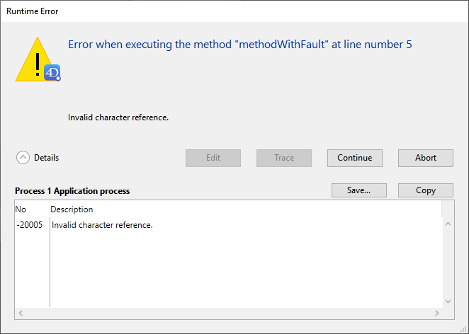

エラーは日常的なものです。 相当行数のコードを書いているのに、1つもエラーが出ないというのは非常にまれです。 むしろ、エラーに対応・修正することは普通のことなのです。

4D の開発環境には、あらゆる種類のエラーに対応するためのデバッグツールが用意されています。

## エラーの種類

### タイプミス

タイプミスはコードエディターによって検出されます。 これらは赤色で示され、ウィンドウ下部に追加情報が表示されます。 以下はタイプミスの例です:

このようなタイプミスは通常、シンタックスエラーの原因となります (上の例では、テーブル名が間違っています)。 コードの該当行の編集を確定すると、エラーの説明が表示されます。 このような場合タイプミスを修正して Enterキーを押すと、再度コードの検証がおこなわれます。

### シンタックスエラー

メソッドの実行時に限って、とらえることのできるエラーがあります。 [シンタックスエラーウィンドウ](#シンタックスエラーウィンドウ) はエラーが発生した際に表示されます: たとえば: 例:

**詳細** エリアを展開すると、最新のエラーと番号が表示されます。

### 環境エラー

時に、BLOB を作成するための十分なメモリがない場合があります。 ディスク上のドキュメントにアクセスしようとした時にドキュメントが存在しないか、他のアプリケーションにより既に開かれていることもあります。 このようなエラーは、コードやその書き方を直接の原因として発生するわけではありません。 ほとんどの場合、このようなエラーは `ON ERR CALL` コマンドでインストールされた [エラー処理メソッド](Concepts/error-handling.md) で簡単に対処できます。

### 設計またはロジックエラー

一般に、これらは発見が最も難しいタイプのエラーです。 これまでに説明しているエラーは、タイプミスを除いて、"設計またはロジックのエラー" という範疇に該当します。 これらを検知するには、[デバッガー](debugger.md) を使用します。 例:

- まだ初期化されていない変数を用いようとしたため、*シンタックスエラー* が発生する場合があります。
- 間違った引数を受け取ったサブルーチンが、その間違った名前によりドキュメントを開こうとしたため、*環境エラー* が発生している場合があります。

設計またはロジックのエラーには、次のような場合もあります:

- `SAVE RECORD` コマンドを呼び出す際に、対象となるレコードがロックされているかどうかを最初にテストしなかったために、レコードが正しく更新されない。
- オプション引数を追加した状態がテストされていないため、メソッドが想定通りに動作しない。

場合によって問題の原因は、実際に中断が発生しているコード部分ではなく、外部にあることもあります。

### ランタイムエラー

アプリケーションモードでは、インタープリターモードでは決して見られないエラーが発生する場合があります。 次に例を示します:

問題の原因を迅速に発見するには、メソッドの名前と行番号を記録し、ストラクチャーファイルのインタープリター版を再び開いて、メソッドの該当行を確認します。

## シンタックスエラーウィンドウ

メソッドの実行が停止されるとシンタックスエラーウィンドウが表示されます。 これは以下の理由で起こります:

- 以降のメソッド実行を妨げるエラーが発生した。
- メソッドが False の表明を生成した (`ASSERT` コマンド参照)。

上部テキストエリアには、エラーの説明メッセージが表示されます。 下部テキストエリアには、エラーが発生した時の実行行が表示されます。 詳細ボタンをクリックすると、プロセスのエラースタックを表示するエリアを展開できます。

シンタックスエラーウィンドウにはいくつかのオプションが用意されています:

- **編集**: すべてのメソッド実行が中断されます。 4D はデザインモードに切り替わり、エラーが発生したメソッドがコードエディターで表示され、エラーを修正す ることができます。 原因に心当たりがあり、これ以上調査しなくても修正できる場合にこのオプションを使用します。

- **トレース**: トレース/デバッガーモードに入ります。 [デバッガー](debugger.md) ウィンドウが表示されます。 該当行の一部が未実行の場合には、**トレース** ボタンを数回クリックする必要があるかもしれません。

- **続行**: 実行が継続されます。 エラーが発生した行は、エラーの位置によっては一部のみ実行済みである場合があります。 慎重に実行を継続してください: エラーが原因で、メソッドの残り部分が正常に実行できない場合があります。 `SET WINDOW TITLE` のように、コードの残りの部分の実行やテストの妨げにならない単純な呼び出しでエラーが発生している場合にのみ、**続行** ボタンをクリックすることを推奨します。

> Tips: ループ中などで繰り返し発生するエラーの場合には、**続行** ボタンを **無視** ボタンに変更できます。 **続行**ボタンが最初に現れたときに、**Alt**キー (Windows) または **Option**キー (macOS) を押しながらボタンをクリックします。 すると、同じエラーによってダイアログが呼び出されたときには、ボタンラベルが **無視** へと変化します。

- **アボート**: メソッドが中断され、メソッドの実行を開始する前の状態に戻ります:

    - イベントに対してフォームメソッドまたはオブジェクトメソッドが実行されている場合には、これらは停止され、フォームに戻ります。
    - メソッドがアプリケーションモードから実行されている場合には、このモードに戻ります。

- **コピー**: デバッグ情報をクリップボードにコピーします。 この情報はエラーの内部環境 (番号や内部コンポーネント等) を説明します。 情報はタブ区切り形式で記述されます。

- **保存...**: シンタックスエラーウィンドウの内容とコールチェーンを `.txt` ファイルに保存します。

## デバッガー

エラー検出の際によくある初歩的な失敗は、シンタックスエラーウィンドウの **アボート** ボタンをクリックし、コードエディターに戻り、コードを表示して原因を確認しようとすることです。 これは止めてください。 **デバッガー** を常に使用すれば、相当の時間と労力を節減することができます。

デバッガーを使うと、メソッドをステップごとにゆっくりと実行することができます。 デバッガーは、エラーが発生した理由を知るために必要な情報を表示できます。 この情報があれば、エラーの修正方法はわかります。

デバッガーを使用するもう 1つの理由は、コードの作成です。 いつも以上に複雑なアルゴリズムを作成してしまう場合があります。 達成感こそありますが、コーディングが正しいかどうかは 100%確かとはいえません。 見当もつかないまま実行するのではなく、コードの最初で `TRACE` コマンドを使用します。 その後、コードをステップごとに実行して、動作を監視することができます。

## ブレーク

デバッグ作業では、コードの一部のトレースを特定の行までスキップする必要がある場合があります。 また、ある式が特定の値になった時 (例: "$myVar > 1000") や、特定の 4Dコマンドが呼び出されるたびにコードをトレースしたい場合もあります。

このようなニーズに対応するために、**ブレークポイント** と **キャッチコマンド** 機能が用意されています。 これらの機能は、コードエディター、デバッガー、ランタイムエクスプローラーから設定できます。