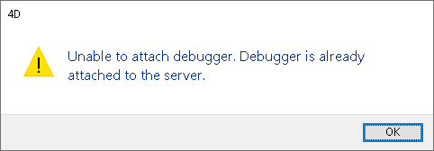

## 概要

4Dデータベースが 4D Server 上でインタープリターモードで動いている場合、プロジェクトにログインしているリモート4Dクライアントからサーバーで実行中の 4Dコードをデバッグすることができます。 特定のリモートマシンでデバッガーを起動すると、そのリモートマシン上で直接、コードの実行をモニターすることができます。

リモートマシン上で起動された [デバッガー](debugger.md) には、サーバーコードのデバッグ中であることを示すサーバーアイコンと青い背景色のデバッグアイコンが表示されるほか、呼び出し連鎖と式のペインの背景が薄っすらと青く色づきます:

この機能は、4D Server がヘッドレスモード ([コマンドラインインターフェース](../Admin/cli.md) 参照) で実行中、あるいはサーバーマシンへのアクセスが難しい場合などに特に有用です。

## 有効化済デバッガー

4D Serverアプリケーションのデバッグは、一度に一つのデバッガーのみがおこなえます。 これを **有効化済デバッガー** と呼びます。 有効化済デバッガーには、以下のものを利用できます:

- ローカルの 4D Serverデバッガー (デフォルト) - サーバーがヘッドレス実行されていない場合
- リモート4Dクライアントのデバッガー - リモートセッションがデザインモードにアクセス可能な場合
- 4D Server 上の [Qodly デバッガー](../WebServer/qodly-studio.md#4d-server-で-qodlyデバッガーを使用する) - Qodly Studio へのアクセスがサーバーで許可されている場合。
- the VS Code debugger, provided you installed the [4D-Debugger](https://github.com/4d/4D-Debugger-VSCode) extension.

:::

有効化済デバッガーは、4D Server が次のいずれかに遭遇した場合に呼び出されます:

- ブレークポイント
- `TRACE` コマンド
- キャッチコマンド
- エラー

エラーメッセージは、デバッガーが有効化されているマシンに送られるという点に注意してください。 これはつまり、リモートデバッガーの場合には、サーバーのエラーメッセージがリモート4Dクライアント上で表示されるということです。

注:

- `On Server Startup` データベースメソッドで実行されたコードはリモートでデバッグすることができません。 これはサーバー側でしかデバッグすることができません。
- デバッガーが有効化されていない場合、実行中のコードがデバッグコマンドによって中断されることはありません。

## デバッガーの有効化

インタープリターモードのアプリケーションを起動したとき、デフォルトでは:

- 4D Server がヘッドレス実行中でない場合、デバッガーはサーバー側で有効化されています。
- 4D Server がヘッドレス実行中の場合には、デバッガーは有効化されていない状態です。

4D Serverアプリケーションに接続できるリモート4Dクライアントであれば、サーバーのデバッガーを有効化することができます。

> リモート4Dクライアントのユーザーセッションは、データベースのデザイン環境へのアクセス権を持っている必要があります。

サーバーのデバッガーをリモート4Dクライアントで有効化するには:

1. 4D Server のメニューバーから、**編集** ＞ **デバッガを無効化する** を選択し、リモートマシンからデバッガーを利用できるようにします (4D Server がヘッドレス実行されている場合、この操作はなにもしません)。
2. サーバーに接続されたリモート4Dクライアントから、**実行** ＞ **リモートデバッガを有効化する** を選択します。

有効化に成功した場合 ([有効化リクエストの拒否](#有効化リクエストの拒否) 参照)、メニューコマンドは **リモートデバッガを無効化する** へと変わります。

これで、サーバーのデバッガーはリモート4Dクライアントで有効化され、以下のタイミングまで有効化されたままです:

- ユーザーセッションが終了するまで
- ユーザーが `リモートデバッガを無効化する` を選択するまで

デバッガーを再度サーバー側で有効化するには:

1. デバッガーが有効化されているリモート4Dクライアントにおいて、**実行** ＞ **リモートデバッガを無効化する** を選択します。
2. 4D Server のメニューバーから、**編集** ＞ **デバッガを有効化する** を選択します。

> サーバー上でデバッガーが有効化されていると (デフォルト)、デバッグを可能にするため、サーバープロセスはすべて自動的にコオオペラティブモードで実行されます。 これは、パフォーマンスに大きな影響を与えかねません。 サーバーマシン上でデバッグする必要がない場合は、デバッガーを無効化し、必要に応じてリモートマシンで有効化することが推奨されます。

## デバッガを開始時に有効化する

デバッガーは、リモート4Dクライアントまたはサーバーの開始時に自動的に有効化することができます:

- サーバー側の場合 (ヘッドレスモードでなければ)、このオプションは **デバッガを開始時に有効化する** という名前です。 サーバーが開始されると、自動的にデバッガーが有効化されます (デフォルト):

> **警告**: のちにヘッドレスモードで起動されるサーバーにおいてこのオプションが選択されたままの場合、このサーバーのデバッガーは利用できません。

- リモート4Dクライアントでは、このオプションは **リモートデバッガを開始時に有効化する** という名前です。 このオプションが選択されている場合、リモート4Dクライアントは、その後同じ 4D Serverデータベースに接続するたびに、自動的にリモートデバッガーを有効化しようとします。 成功した場合 ([有効化リクエストの拒否](#有効化リクエストの拒否) 参照)、リモートデバッガーは自動的にリモート4Dクライアントで有効化され、メニューコマンドは **リモートデバッガを無効化する** へと変わります。

> この設定はプロジェクトごとに、[`.4DPreferences`](Project/architecture.md#userpreferencesusername) ファイル内にローカル保存されます。

## 有効化リクエストの拒否

ほかのリモート4Dクライアントまたは 4D Server にてすでに有効化されていた場合、他のマシンでサーバーのデバッガーを有効化することはできません。

別マシンにて有効化済のデバッガーを有効化しようとした場合、その有効化リクエストは拒否され、以下のようなダイアログが表示されます:

このような場合に、デバッガーを有効化するには、以下のどちらかの条件が必要です:

- 有効化済デバッガーを、**リモートデバッガを無効化する** メニューコマンドでリモート4Dクライアントから外す、あるいは **デバッガを無効化する** コマンドを使用してサーバーから外す。
- 有効化済デバッガーを使用しているリモート4Dクライアントセッションが閉じられる。
