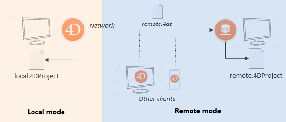

組み込みクライアント/サーバーアプリケーションまたはリモートプロジェクトの形で、4Dデスクトップアプリケーションをクライアント/サーバー構成で運用することができます。

- **組み込みクライアント/サーバーアプリケーション** は [アプリケーションビルダー](building.md#クライアントサーバーページ) を使って生成します。 これらは、アプリケーションの運用に使います。 これらは、アプリケーションの運用に使います。

- 4D Server における **開発モード** とは、接続したリモート4D アプリケーションに読み/書きアクセスが許可されるプロジェクトを開くときの特別なモードです。 プロジェクトは[**インタープリタ** モード](../Concepts/interpreted.md) でなければなりません。 **リモートプロジェクト** とは、4D Server 上で開いた [.4DProject](Project/architecture.md) ファイルのことで、リモートモードの 4D を使って接続します。 4D Server は、プロジェクトの [圧縮形式](building.md#コンパイル済みストラクチャーをビルド) である .4dz ファイルをリモートの 4D に送信します。つまり、ストラクチャーファイルは読み取り専用です。 この構成は通常、アプリケーションのテストに使います。 この構成は通常、アプリケーションのテストに使います。

> ただし、**4D Server と同じマシン** から接続している場合には、プロジェクトファイルの変更が可能です。 この [特殊機能](#4d-と-4d-server-の同じマシン上での使用) により、クライアント/サーバーアプリケーションを運用時と同じコンテキストで開発することができます。 この [特殊機能](#4d-と-4d-server-の同じマシン上での使用) により、クライアント/サーバーアプリケーションを運用時と同じコンテキストで開発することができます。

## 組み込みクライアント/サーバーアプリケーションを開く

ビルドされたクライアント/サーバーアプリケーションは起動や接続処理が簡易です:

- サーバーを起動するには、サーバーアプリケーションをダブルクリックします。 プロジェクトファイルを選択する必要はありません。
- クライアントを起動するにも、同様にクライアントアプリケーションをダブルクリックします。すると、サーバーアプリケーションへの接続が直接おこなわれるため、

詳細については [アプリケーションビルド](building.md#クライアント/サーバーアプリケーションとは) ページを参照ください。

## リモートプロジェクトを開く

4D Server 上で動いているプロジェクトに初めて接続する場合は、通常は標準の接続ダイアログを使います。 以降は、**最近使用したプロジェクトを開く** メニューや、4DLink ショートカットファイルを使って直接接続できるようになります。

4D Server で実行されているプロジェクトに接続するには:

1. 次のいずれかの方法をおこないます:
   - Welcome ウィザードにて **4D Serverに接続** を選択します。
   - **ファイル** メニューより \*\*開く ＞ リモートプロジェクト...\*\*を選択するか、**開く** ツールバーボタンより同様に選択します。

4D Server に接続するためのダイアログが表示されます。 ダイアログには **最近使用**、**利用可**、および **カスタム** という、3つのタブがあります。

リモートの 4D と同じサブネットワークに 4D Server が接続されている場合は **利用可** タブを選択します。 4D Server には組み込みのブロードキャストシステムがあり、デフォルトで、ネットワーク上に利用可能な 4D Server データベースの名前を公開します。 このリストは、名前が見つかった順に表示され、動的に更新されます。 4D Server には組み込みのブロードキャストシステムがあり、デフォルトで、ネットワーク上に利用可能な 4D Server データベースの名前を公開します。 このリストは、名前が見つかった順に表示され、動的に更新されます。

このリストからサーバーに接続するには、名前上でダブルクリックするか、名前を選択して **OK** ボタンをクリックします。

公開されているプロジェクトが **利用可** タブに見つからない場合には、**カスタム** タブを開きます。 カスタムページでは、IPアドレスでネットワーク上のサーバーを指定し、それに任意の名前をつけられます。

- **プロジェクト名**: 4D Server プロジェクトのローカル名を指定できます。 この名前は **最近使用** ページでプロジェクトを参照する際に使用されます。 この名前は **最近使用** ページでプロジェクトを参照する際に使用されます。
- **ネットワークアドレス**: 4D Server が起動されたマシンの IPアドレスを指定します。
  - 2つのサーバーが同じマシン上で同時に起動されているときは、IPアドレスの後にコロンとポート番号を続けます。例: `192.168.92.104:19820`。
  - デフォルトで、4D Server の公開ポートは 19813 です。 この番号は、プロジェクト設定で変更できます。

> [**開発モードを有効化する**](#開発モード) オプションは、特別な読み取り/書き込みモードでリモート接続を開きます。このモードでは、リモート4D からプロジェクトフォルダーへのアクセスが確保されている必要があります。

このページでサーバーを指定したら、**OK** ボタンをクリックしてサーバーに接続できます。

サーバーとの接続が確立されると、そのリモートプロジェクトは **最近使用** タブのリストに加えられます。

### サーバー上のプロジェクトファイルの更新

インタープリターモードの場合、4D Server は *.4DProject* プロジェクトファイル (非圧縮) の [.4dz](building.md#コンパイル済みストラクチャーをビルド) ファイルを自動的に作成し、リモートマシンに送信します。

- プロジェクトが編集され 4D Server にリロードされた場合など、必要に応じてプロジェクトの .4dzファイルは自動的に更新されます。 プロジェクトは次の場合にリロードされます: プロジェクトは次の場合にリロードされます:
  - 4D Server アプリケーションウィンドウが OS の最前面に来たり、同じマシン上の 4D アプリケーションが編集を保存した場合 (後述参照) に自動でリロードされます。
  - [`RELOAD PROJECT`](../commands/reload-project) コマンドが実行されたとき。 プロジェクトの新しいバージョンをソース管理システムよりプルしたときなどに、このコマンドを呼び出す必要があります。 プロジェクトの新しいバージョンをソース管理システムよりプルしたときなどに、このコマンドを呼び出す必要があります。

### リモートマシンのプロジェクトファイルの更新

4D Server 上で .4dz ファイルの更新版が生成された場合、その更新版を利用するには、接続中のリモート 4D マシンは一度ログアウトし、4D Server に再接続する必要があります。

## 4D と 4D Server の同じマシン上での使用

同じマシン上で 4D が 4D Server に接続すると、アプリケーションはシングルユーザーモードの 4D のようにふるまい、デザイン環境にてプロジェクトファイルの編集が可能です。 この機能により、クライアント/サーバーアプリケーションを運用時と同じコンテキストで開発することができます。

> 同じマシン上で 4D Server に 4D を接続する場合には、 [開発モード](#開発モード) オプションの設定にかかわらず **開発モード** が自動的に有効化されます。

デザイン環境にて 4D が **すべてを保存** アクションを (**ファイル** メニューを使って明示的に、または、アプリケーションモードへの移行により暗示的に) おこなうと、4D Server は同期的にプロジェクトファイルをリロードします。 4D Server によるプロジェクトファイルのリロードが完了するのを待って、4D は続行します。

ただし、[標準のプロジェクトアーキテクチャー](Project/architecture.md) とは次のふるまいにおいて異なりますので、注意が必要です:

- 4D が使用する userPreferences.\{username\} フォルダーは、4D Server が使用するプロジェクトフォルダー内のものと同一ではありません。 この専用の "userPreferences" フォルダーはプロジェクトシステムフォルダー内 (つまり、.4dzプロジェクトを開く場合と同じ場所) に格納されます。 4D が使用する userPreferences.\{username\} フォルダーは、4D Server が使用するプロジェクトフォルダー内のものと同一ではありません。
- 4D が使用する DerivedData フォルダーは、4D Server が使用するプロジェクトフォルダー内のものと同一ではありません。 この専用の "DerivedDataRemote" フォルダーはプロジェクトのシステムフォルダー内に格納されます。
- catalog.4DCatalog ファイルは 4D ではなく 4D Server によって編集されます。 catalog の情報はクライアント/サーバーリクエストによって同期されます。
- directory.json ファイルは 4D ではなく 4D Server によって編集されます。 directory の情報はクライアント/サーバーリクエストによって同期されます。
- 4D は、4D Server 上のものではなく、独自の内部的なコンポーネントやプラグインを使用します。

> プラグインやコンポーネントを 4D あるいは 4D Server アプリケーションレベルにインストールすることは、推奨されません。

## 開発モード

4D Server における **開発モード** とは、接続したリモート4D アプリケーションに読み/書きアクセスが許可されるプロジェクトを開くときの特別なモードです。 プロジェクトは[**インタープリタ** モード](../Concepts/interpreted.md) でなければなりません。

このモードでは、同じプロジェクトに対して複数のデベロッパーがデザイン環境で同時に作業することができます。 プロジェクトが**開発モード**で開かれている場合、以下のような特徴があります: プロジェクトが**開発モード**で開かれている場合、以下のような特徴があります:

- プロジェクトファイルは読み/書きが可能な状態なので、メソッドやフォームなどを編集することができます。
- 複数のリモート4D が、同じインタープリタ版のプロジェクトファイルを同時に開いて、それを編集することができます。 この場合、自動ロックシステムが同じリソースへの同時アクセスを防止します。 この場合、自動ロックシステムが同じリソースへの同時アクセスを防止します。
- 編集は全てのリモートデベロッパーに対して利用可能になります。 編集は全てのリモートデベロッパーに対して利用可能になります。 ただし、このときリモートデベロッパーに対しては自動的なプッシュは起こらなず、最新のバージョンのファイルを取得するためには更新を行う必要があります(更新は、デベロッパーがデザインモードからアプリケーションモードへと切り替えるか、あるいは **ファイル** メニューから **全て保存** を選択したときに毎回起こります)。

このモードを使用するには、リモート4D から[接続ダイアログボックス](#リモートプロジェクトを開く) から**開発モードを有効化する** を選択する必要があります。 次に**4D プロジェクトファイルを選択してください**と表示されます: 4D Server が開いている [.project ファイル](../Project/architecture.md#applicationname4dproject-ファイル) を選択する必要があります。 異なるファイルを選択した場合、開発モードが利用できないことを警告するアラートダイアログボックスが表示されます。 これは、リモート4D がプロジェクトフォルダに対してネットワーク越しでもアクセス権を持っていなければならないことを意味します(例えばプロジェクトのroot フォルダが共有されているなど、プロジェクトファイル全体が共有されている必要があります)。 次に**4D プロジェクトファイルを選択してください**と表示されます: 4D Server が開いている [.project ファイル](../Project/architecture.md#applicationname4dproject-ファイル) を選択する必要があります。 異なるファイルを選択した場合、開発モードが利用できないことを警告するアラートダイアログボックスが表示されます。 これは、リモート4D がプロジェクトフォルダに対してネットワーク越しでもアクセス権を持っていなければならないことを意味します(例えばプロジェクトのroot フォルダが共有されているなど、プロジェクトファイル全体が共有されている必要があります)。

:::caution

この設定においてはパフォーマンス上の理由から、プロジェクトフォルダがローカルネットワーク上の専用のファイルサーバー上(例: NAS など)に保存することが強く推奨されています。

:::

:::note

サーバーとリモート4D が同じマシン上にある場合、[追加のルールが適用されます](#4d-と-4d-server-の同じマシン上での使用)。

:::

開発モードアーキテクチャーの概要は以下のようになります:

:::note 互換性

この機能は、バイナリーデータベースで作業するのに慣れていて、現在の構成を維持したままプロジェクトモードでの機能を利用したいような、小規模な開発チーム向けに設計されています。 しかしながら、4D プロジェクト上でのマルチユーザー開発については、デベロッパーがそれぞれのマシン上で開発を行い、その作業をソース管理レポジトリツール(Git、SVN など)で管理する標準のアーキテクチャーを使用することが強く推奨されます。 この構成であれば、デベロッパーが異なるブランチで作業をしたり、行った編集の比較、マージ、差し戻しなどが可能になり、大きな柔軟性を持ちます。

:::

:::tip 関連したblog 記事

[Developing Concurrently on 4D Server in Project Mode](https://blog.4d.com/developing-concurrently-on-4d-server-in-project-mode/)

:::

## コードの実行場所

クライアント/サーバーアプリケーションにおいては、コードが実際に実行される場所を知っておくことが重要です: **サーバー側** あるいは **クライアント側** のどちらかです。 実行場所を知っておくことは、ユーザーセッション関連のコードの実装、プロセス間での情報の共有、またはデータのアクセスなどの際に非常に重要となります。 実行場所を知っておくことは、ユーザーセッション関連のコードの実装、プロセス間での情報の共有、またはデータのアクセスなどの際に非常に重要となります。

以下の表は、デフォルトでのコードの実行場所と、その実行場所を切り替えるための方法(許可されていれば)をまとめたものです。 この表での **ローカル** とは、コードはそれが実際に呼ばれたマシン上で実行されることを意味するという点に注意してください。 この表での **ローカル** とは、コードはそれが実際に呼ばれたマシン上で実行されることを意味するという点に注意してください。

| コード                                                                                                                                                                                                                                                                                                          | デフォルトの実行場所 | 切り替え方法                                                                                                                                                                                                                                  |
| ------------------------------------------------------------------------------------------------------------------------------------------------------------------------------------------------------------------------------------------------------------------------------------------------------------ | ---------- | --------------------------------------------------------------------------------------------------------------------------------------------------------------------------------------------------------------------------------------- |
| [ORDA データモデル関数](../ORDA/ordaClasses.md)                                                                                                                                                                                                                                                                      | server     | 関数定義内で `local` キーワードを使用                                                                                                                                                                                                                 |
| ORDA 計算属性関数のうち [`get()`](../ORDA/ordaClasses.md#function-get-attributename)、 [`set()`](../ORDA/ordaClasses.md#function-set-attributename)                                                                                                                                                                    | server     | 関数定義内で `local` キーワードを使用                                                                                                                                                                                                                 |
| ORDA 計算属性関数のうち [`query()`](../ORDA/ordaClasses.md#function-query-attributename)、 [`orderBy()`](../ORDA/ordaClasses.md#function-orderby-attributename)                                                                                                                                                        | server     | n/a                                                                                                                                                                                                                                     |
| ORDA イベント関数 [(全般)](../ORDA/orda-events.md)                                                                                                                                                                                                                                                | server     | n/a                                                                                                                                                                                                                                     |
| ORDA イベント関数 [`constructor()`](../ORDA/ordaClasses.md#class-constructor-1)                                                                                                                                                                                                                                    | ローカル       | n/a                                                                                                                                                                                                                                     |
| ORDA イベント関数 [`event touched()`](../ORDA/orda-events.md#function-event-touched)                                                                                                                                                                                                                               | server     | 関数定義内で `local` キーワードを使用                                                                                                                                                                                                                 |
| [ユーザークラス関数](../Concepts/classes.md#function)                                                                                                                                                                                                                                                                 | ローカル       | n/a                                                                                                                                                                                                                                     |
| [共有シングルトンまたは施ッションシングルトンの関数](../Concepts/classes.md#シングルトンクラス)                                                                                                                                                                                                                                                | ローカル       | 関数定義内で `server` キーワードを使用                                                                                                                                                                                                                |
| トリガ                                                                                                                                                                                                                                                                                                          | server     | n/a                                                                                                                                                                                                                                     |
| クライアントから呼び出されたプロジェクトメソッド                                                                                                                                                                                                                                                                                     | client     | [**サーバー上で実行する** オプション](../Project/project-method-properties.md#サーバー上で実行) をチェックする。 コードは、[ユーザーセッションプロセス](./sessions.md#remote-user-sessions) のツインプロセス内で実行されます。 コードは、[ユーザーセッションプロセス](./sessions.md#remote-user-sessions) のツインプロセス内で実行されます。 |
|                                                                                                                                                                                                                                                                                                              |            | [`Execute on server`](../commands/execute-on-server) コマンドを呼び出す。 [`Execute on server`](../commands/execute-on-server) コマンドを呼び出す。 コードは[ストアドプロシージャセッション](./sessions.md#stored-procedure-sessions) 内で実行されます。                                |
| サーバー上のストアドプロシージャから呼び出されたプロジェクトメソッド                                                                                                                                                                                                                                                                           | server     | [`EXECUTE ON CLIENT`](../commands/execute-on-client) コマンドを呼び出す。 [`EXECUTE ON CLIENT`](../commands/execute-on-client) コマンドを呼び出す。 ターゲットとなるクライアントは [登録されている](../commands/register-client) 必要があります。                                         |
| オブジェクトメソッド                                                                                                                                                                                                                                                                                                   | ローカル       | n/a                                                                                                                                                                                                                                     |
| 以下のデータベースメソッド:<ul><li>On Backup Shutdown</li><li>On Backup Startup</li><li>On Server Close Connection</li><li>On Server Open Connection</li><li>On Server Shutdown</li><li>On Server Startup</li><li>On SQL Authentication</li><li>On Web Authentication</li><li>On Web Connection</li></ul> | server     | n/a                                                                                                                                                                                                                                     |
| 以下のデータベースメソッド:<ul><li>On Startup</li><li>On Exit</li><li>On Drop</li></ul>                                                                                                                                                                                                                   | client     | n/a                                                                                                                                                                                                                                     |

## Management of unreachable peer

When the [QUIC network layer is used](../settings/client-server.md#network-layer), client/server sessions benefit from an **automatic reconnection feature** in case of unexpected disconnections. Unexpected disconnections include for example:

- LAN cable unplug/plug,
- Handover with a mobile connection,
- Switch reboot,
- Small network error.

This feature supports both server-side and client-side management in the event of a lost connection with a peer, and includes configurable timeouts and real-time information.

:::tip 関連したblog 記事

[Tired of network errors disrupting your users? 4D 21 R4 has the answer](https://blog.4d.com/tired-of-network-errors-disrupting-your-users-4d-21-r4-has-the-answer)

:::

### Unreachable event

The QUIC network layer automatically emits an "Unreachable" event to 4D Server when a remote 4D unexpectedly stops responding; conversely, it automatically emits an "Unreachable" event to a remote 4D when the 4D Server unexpectedly stops responding. When the "Unreachable" event is received on either side, it is immediately reflected in the interface and in the machine's [`Session`](./sessions.md) object.

#### Remote stops responding

When a remote 4D unexpectedly stops responding, on the [Server administration window](../ServerWindow/overview.md), the [remote client status](../ServerWindow/users.md#list-of-users) is set to **Unreachable**.

#### Server stops responding

If 4D Server unexpectedly stops responding, a reconnection dialog box is displayed on the remote machine:

#### Session object updated

When the "Unreachable" event is received on either side, an [`info.unreachableSince`](../API/SessionClass.md#info) property is created in the session on the machine receiving the event (on the server, it is readable through the [`Process activity.sessions`](../commands/process-activity) property), and it starts counting seconds since the last communication. You can use this property to implement your own disconnection interface.

### Restoring or closing connection

The QUIC session timeout is automatically used to monitor disconnections:

- If the connection is restored before the QUIC session timeout is reached, the [`info.unreachableSince`](../API/SessionClass.md#info) property is automatically removed from the session object.
- If the connection is not restored before the QUIC session timeout is reached, the session is closed.
  - In case of a remote session closed from the server, a warning entry is written in the [diagnostic log](../Debugging/debugLogFiles.md#4ddiagnosticlogtxt).
  - In case of a server session closed from a remote machine, a warning dialog box is displayed so that the user can restart the remote application or quit:
    

The QUIC session timeout is 900 seconds (15 minutes) by default, it can be modified using the `QUIC session timeout` selector of the [`SET DATABASE PARAMETER`](../commands/set-database-parameter) command.
