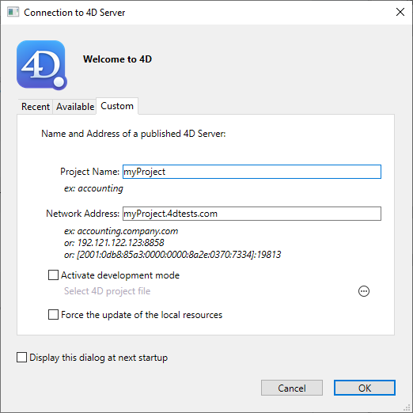

組み込みクライアント/サーバーアプリケーションまたはリモートプロジェクトの形で、4Dデスクトップアプリケーションをクライアント/サーバー構成で運用することができます。

- **組み込みクライアント/サーバーアプリケーション** は [アプリケーションビルダー](building.md#クライアントサーバーページ) を使って生成します。 これらは、アプリケーションの運用に使います。

- **リモートプロジェクト** とは、4D Server 上で開いた [.4DProject](Project/architecture.md) ファイルのことで、リモートモードの 4D を使って接続します。 4D Server は、プロジェクトの [圧縮形式](building.md#コンパイル済みストラクチャーをビルド) である .4dz ファイルをリモートの 4D に送信します。つまり、ストラクチャーファイルは読み取り専用です。 この構成は通常、アプリケーションのテストに使います。

> ただし、**4D Server と同じマシン** から接続している場合には、プロジェクトファイルの変更が可能です。 この [特殊機能](#4d-と-4d-server-の同じマシン上での使用) により、クライアント/サーバーアプリケーションを運用時と同じコンテキストで開発することができます。

## 組み込みクライアント/サーバーアプリケーションを開く

ビルドされたクライアント/サーバーアプリケーションは起動や接続処理が簡易です:

- サーバーを起動するには、サーバーアプリケーションをダブルクリックします。 プロジェクトファイルを選択する必要はありません。
- クライアントを起動するにも、同様にクライアントアプリケーションをダブルクリックします。すると、サーバーアプリケーションへの接続が直接おこなわれるため、

詳細については [アプリケーションビルド](building.md#クライアント/サーバーアプリケーションとは) ページを参照ください。

## リモートプロジェクトを開く

4D Server 上で動いているプロジェクトに初めて接続する場合は、通常は標準の接続ダイアログを使います。 以降は、**最近使用したプロジェクトを開く** メニューや、4DLink ショートカットファイルを使って直接接続できるようになります。

4D Server で実行されているプロジェクトに接続するには:

1. 次のいずれかの方法をおこないます:
   - Select **Connect to 4D Server** in the Welcome Wizard dialog
   - **ファイル** メニューより **開く ＞ リモートプロジェクト...**を選択するか、**開く** ツールバーボタンより同様に選択します。

4D Server に接続するためのダイアログが表示されます。 ダイアログには **最近使用**、**利用可**、および **カスタム** という、3つのタブがあります。

リモートの 4D と同じネットワークに 4D Server が接続されている場合は **利用可** タブを選択します。 4D Server には組み込みの TCP/IP ブロードキャストシステムがあり、デフォルトで、ネットワーク上に利用可能な 4D Server データベースの名前を公開します。 このリストは、名前が見つかった順に表示され、動的に更新されます。

このリストからサーバーに接続するには、名前上でダブルクリックするか、名前を選択して **OK** ボタンをクリックします。

> 暗号化オプションが有効で公開されているデータベース名の前にはキャレット (^) が置かれます。

公開されているプロジェクトが **利用可** タブに見つからない場合には、**カスタム** タブを開きます。 カスタムページでは、IPアドレスでネットワーク上のサーバーを指定し、それに任意の名前をつけられます。

- **プロジェクト名**: 4D Server プロジェクトのローカル名を指定できます。 この名前は **最近使用** ページでプロジェクトを参照する際に使用されます。
- **ネットワークアドレス**: 4D Server が起動されたマシンの IPアドレスを指定します。
  - 2つのサーバーが同じマシン上で同時に起動されているときは、IPアドレスの後にコロンとポート番号を続けます。例えば: `192.168.92.104:19820`。
  - デフォルトで、4D Server の公開ポートは 19813 です。 この番号は、プロジェクト設定で変更できます。

> **開発モードを有効化する** オプションは、特別な読み取り/書き込みモードでリモート接続を開きます (互換性オプション)。このモードでは、リモート4D からプロジェクトフォルダーへのアクセスが確保されている必要があります。

このページでサーバーを指定したら、**OK** ボタンをクリックしてサーバーに接続できます。

サーバーとの接続が確立されると、そのリモートプロジェクトは **最近使用** タブのリストに加えられます。

### サーバー上のプロジェクトファイルの更新

インタープリターモードの場合、4D Server は *.4DProject* プロジェクトファイル (非圧縮) の [.4dz](building.md#コンパイル済みストラクチャーをビルド) ファイルを自動的に作成し、リモートマシンに送信します。

- プロジェクトが編集され 4D Server にリロードされた場合など、必要に応じてプロジェクトの .4dzファイルは自動的に更新されます。 プロジェクトは次の場合にリロードされます:
  - 4D Server アプリケーションウィンドウが OS の最前面に来たり、同じマシン上の 4D アプリケーションが編集を保存した場合 (後述参照) に自動でリロードされます。
  - `RELOAD PROJECT` コマンドが実行されたときにリロードされます。 プロジェクトの新しいバージョンをソース管理システムよりプルしたときなどに、このコマンドを呼び出す必要があります。

### リモートマシンのプロジェクトファイルの更新

4D Server 上で .4dz ファイルの更新版が生成された場合、その更新版を利用するには、接続中のリモート 4D マシンは一度ログアウトし、4D Server に再接続する必要があります。

## 4D と 4D Server の同じマシン上での使用

同じマシン上で 4D が 4D Server に接続すると、アプリケーションはシングルユーザーモードの 4D のようにふるまい、デザイン環境にてプロジェクトファイルの編集が可能です。 この機能により、クライアント/サーバーアプリケーションを運用時と同じコンテキストで開発することができます。

> 同じマシン上で 4D Server に 4D を接続する場合には、 [接続時のオプション](#リモートプロジェクトを開く) の設定にかかわらず **開発モード** が自動的に有効化されます。

デザイン環境にて 4D が **すべてを保存** アクションを (**ファイル** メニューを使って明示的に、または、アプリケーションモードへの移行により暗示的に) おこなうと、4D Server は同期的にプロジェクトファイルをリロードします。 4D Server によるプロジェクトファイルのリロードが完了するのを待って、4D は続行します。

ただし、[標準のプロジェクトアーキテクチャー](Project/architecture.md) とは次のふるまいにおいて異なりますので、注意が必要です:

- 4D が使用する userPreferences.{username} フォルダーは、4D Server が使用するプロジェクトフォルダー内のものと同一ではありません。 この専用の "userPreferences" フォルダーはプロジェクトシステムフォルダー内 (つまり、.4dzプロジェクトを開く場合と同じ場所) に格納されます。
- 4D が使用する DerivedData フォルダーは、4D Server が使用するプロジェクトフォルダー内のものと同一ではありません。 この専用の "DerivedDataRemote" フォルダーはプロジェクトのシステムフォルダー内に格納されます。
- catalog.4DCatalog ファイルは 4D ではなく 4D Server によって編集されます。 catalog の情報はクライアント/サーバーリクエストによって同期されます。
- directory.json ファイルは 4D ではなく 4D Server によって編集されます。 directory の情報はクライアント/サーバーリクエストによって同期されます。
- 4D は、4D Server 上のものではなく、独自の内部的なコンポーネントやプラグインを使用します。

> プラグインやコンポーネントを 4D あるいは 4D Server アプリケーションレベルにインストールすることは、推奨されません。
