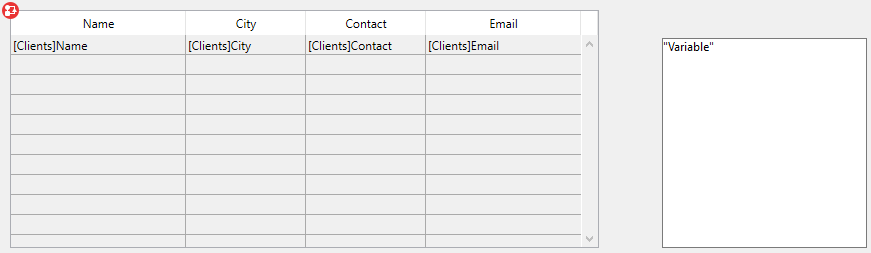
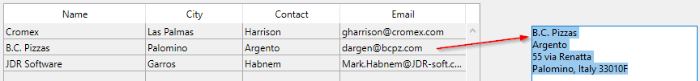
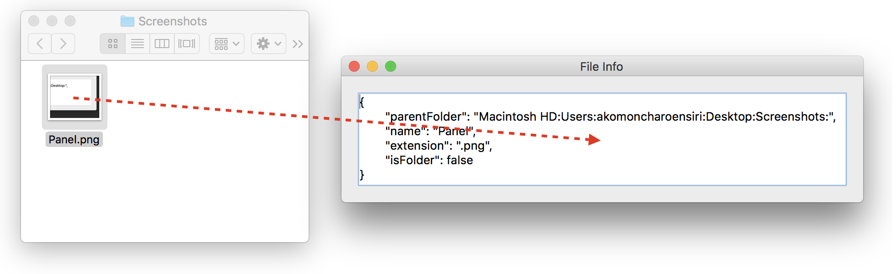

## Overview

4D allows built-in drag and drop capability between objects in your forms and applications. You can drag and drop one object to another, in the same window or in another window. In other words, drag and drop can be performed within a process or from one process to another.

You can also drag and drop objects between 4D forms and other applications, and vice versa. For example, it is possible to drag and drop a .png picture file onto a 4D picture field. It is also possible to select text in a word processing application and drop it onto a 4D text variable or a list box.

Finally, it is possible to drop objects directly onto the application without necessarily having a form in the foreground. The [`On Drop` Database Method](../commands-legacy/on-drop-database-method.md) can be used to manage the drag and drop action in this case. This means, for example, that you can open a 4D Write Pro document by dropping it onto the 4D application icon.

4D provides two drag-and-drop modes:

- a **custom mode**, where the whole drag-and-drop operation is handled by the programmer. このモードでは、ドラッグ＆ドロップに基づいたあらゆるインターフェースを実装することができます。 これにはデータの転送を必ずしも伴わないものも含まれ、ファイルを開くや計算をトリガーするなどの任意のアクションを実行することができます。
- an **automatic mode**, where a drag-and-drop operation automatically copies or moves data from an object to another. This mode is available to text-based objects and (partially) pictures, and can be enabled by simply selecting a property.

## Draggable and Droppable Objects

Several form objects can be draggable and/or droppable, in custom and/or automatic mode (see below). By default, newly created form objects can be neither dragged nor dropped ("none" value). It is up to you to set these properties.

To drag and drop an object to another object, you must set its [**Draggable** property](../FormObjects/properties_Action.md#draggable) to "Automatic" or "Custom". In a drag-and-drop operation, the object that you drag is the source object.

To make an object the destination of a drag and drop operation, you must set its [**Droppable** property](../FormObjects/properties_Action.md#droppable) to "Automatic" or "Custom". In a drag-and-drop operation, the object that receives data is the destination object.

The following table lists the available properties for draggable and/or droppable objects:

| フォームオブジェクト                                     | Draggable "Custom" | Droppable "Custom" | Draggable "Auto" | Droppable "Auto" |
| ---------------------------------------------- | ------------------ | ------------------ | ---------------- | ---------------- |
| [4D Write Pro areas](writeProArea_overview.md) | ○                  | ○                  | ○                | ○                |
| [Combo Box](comboBox_overview.md)              |                    | ○                  | ○                | ○                |
| [入力](input_overview.md)                        | ○                  | ○                  | ○                | ○                |
| [階層リスト](list_overview.md)                      | ○                  | ○                  |                  |                  |
| [リストボックス](listbox_overview.md)                 | ○                  | ○                  |                  |                  |
| [プラグインエリア](pluginArea_overview.md)             |                    |                    | ○                | ○                |
| [ボタン](button_overview.md)                      |                    | ○                  |                  |                  |
| [Picture button](pictureButton_overview.md)    |                    | ○                  |                  |                  |

Items of a hierarchical list or rows in a list box can be dragged and dropped. Conversely, you can drag and drop an object onto an item of a hierarchical list or a list box row. However, you cannot drag and drop objects from the detail area of an output form. You can also manage dragging and dropping onto the application, outside of any form, using the [`On Drop` database method](../commands-legacy/on-drop-database-method.md).

:::note 注記

- By default, in the case of picture fields and variables, the picture and its reference are both dragged. If you only want to drag the reference, first hold down the **Alt** (Windows) or **Option** (macOS) key.
- When the "Custom" Draggable and ["Movable Rows"](../FormObjects/properties_Action.md#movable-rows) properties are both set for an array list box object, the "Movable Rows" property takes priority when a row is moved. Dragging is not possible in this case.
- An object that is capable of being both dragged and dropped can also be dropped onto itself, unless you reject the operation.

:::

## Custom Drag and Drop

Implementing a custom drag-and-drop interface means combining properties, events, and commands from the [*Pasteboard* theme](../commands/theme/Pasteboard.md). The following diagram illustrates the key points of a custom drag-and-drop sequence:


Your implementation will be based upon the following scenario:

1. In the [`On Begin Drag Over`](../Events/onBeginDragOver.md) event of the source object (with ["Custom" **Draggable** property](../FormObjects/properties_Action.md#draggable)), put appropriate data in the pasteboard using [`APPEND DATA TO PASTEBOARD`](../commands/append-data-to-pasteboard), [`SET FILE TO PASTEBOARD`](../commands/set-file-to-pasteboard) or other commands from the [Pasteboard theme](../commands/theme/Pasteboard.md). You can also define a specific cursor icon using [`SET DRAG ICON`](../commands/set-drag-icon) command.
2. In the [`On Drag Over`](../Events/onDragOver.md) event of the destination object (with ["Custom" **Droppable** property](../FormObjects/properties_Action.md#droppable)), get the data types or data signatures found in the pasteboard using [`GET PASTEBOARD DATA TYPE`](../commands/get-pasteboard-data-type) or [`GET PASTEBOARD DATA`](../commands/get-pasteboard-data) and check if they are compatible with the destination object.
   The [`Drop position`](../commands/drop-position) command returns the element number or the item position of the target element or list item, if the destination object is an array (i.e., scrollable area), a hierarchical list, a text or a combo box, as well as the column number if the object is a list box.
3. The [object method](../Concepts/methods.md#method-types) of the destination object or element must return 0 or -1 to accept or reject the action:
   - If it is compatible, return **0** to accept the drop and execute the [`On Drop`](../Events/onDrop.md) event when the mouse button is released.
   - Otherwise, return **-1** to reject the drop.  
     4D automatically handles the interface aspect of this interaction by displaying a cursor depending on whether the drop is accepted or rejected.
4. In the [`On Drop`](../Events/onDrop.md) event of the destination object (with ["Custom" **Droppable** property](../FormObjects/properties_Action.md#droppable)), execute any action in response to the drop. If the drag-and-drop operation is intended to copy the dragged data, you simply assign the data to destination object. If the drag and drop is not intended to move data, but is instead a user interface metaphor for a particular operation, you can perform whatever you want, for example getting file paths using [`Get file from pasteboard`](../commands/get-file-from-pasteboard) command.

Note that the [`On Begin Drag Over`](../Events/onBeginDragOver.md) event is generated **in the context of the source object of the drag** while [`On Drag Over`](../Events/onDragOver.md) and [`On Drop`](../Events/onDrop.md) events are only sent to the destination object.

In order for the application to process these events, they must be selected in an appropriate manner in the Property List for both the source and destination objects:


## Automatic Drag and Drop

Automatic drag and drop is the movement or copy of a text or picture selection from one area to another by a single click. It can be used in the same 4D area, between two 4D areas, or between 4D and another application.

:::note

In the case of automatic drag and drop between two 4D areas, the data are moved, in other words, they are removed from the source area. If you want to copy the data, hold down the **Ctrl** (Windows) or **Option** (macOS) key during the action (under macOS, you need to hit the **Option** key *after* you start to drag the item(s)).

:::

[Automatic Draggable](../FormObjects/properties_Action.md#draggable) property and [Automatic Droppable](../FormObjects/properties_Action.md#droppable) property can be configured separately for each form object.

- **Draggable: Automatic**: When this option is selected, the automatic drag mode is activated for the object. In this mode, the [`On Begin Drag`](../Events/onBeginDragOver.md) form event is NOT generated.
  If you want to "force" the use of the custom drag while automatic drag is enabled, hold down the **Alt** (Windows) or **Option** (macOS) key during the action (under macOS, you need to hit the **Option** key *before* you start to drag the item(s)). このオプションはピクチャーでは利用できません。
- **Droppable: Automatic**: In this mode, 4D automatically manages — if possible — the insertion of dragged data of the text or picture type that is dropped onto the object (the data are pasted into the object). The [`On Drag Over`](../Events/onDragOver.md) and [`On Drop`](../Events/onDrop.md) form events are not generated in this case. On the other hand, the [`On After Edit`](../Events/onAfterEdit.md) (during a drop) and [`On Data Change`](../Events/onDataChange.md) (when the object loses the focus) events are generated.

In the case of data other than text or pictures (another 4D object, file, etc.) or complex data being dropped, the application refers to the value of the "Droppable" option: if it is not "none", the [`On Drag Over`](../Events/onDragOver.md) and [`On Drop`](../Events/onDrop.md) form events are generated; otherwise, the drop is refused.

## 例題

### Array based list box to input text area

In this simple example, we want to fill an input text area with data dragged from an array-based list box:


The list box object method:

```4d
  //Object Method: ListBox
 If(Form event code=On Begin Drag Over)
    SET TEXT TO PASTEBOARD(arrFirstname{arrFirstname}+" "+arrLastname{arrFirstname})
 End if
```

The input text area object method contains:

```4d

  // Object Method: label1
If(Form event code=On Drop) //Requires Droppable Action enabled from Property List
    ARRAY TEXT($signatures_at;0)
    ARRAY TEXT($nativeTypes_at;0)
    ARRAY TEXT($formatNames_at;0)
    GET PASTEBOARD DATA TYPE($signatures_at;$nativeTypes_at;$formatNames_at)
    If(Find in array($signatures_at;"com.4d.private.text.native")#-1) // there is 4D text in pasteboard
       OBJECT Get pointer(Object current)->:=Get text from pasteboard
    End if
 End if
```

### Selection based list box to input text area

Combining custom and automatic drag and drop features allows simple and powerful interfaces. In this example, we want to fill an input text area with data dragged from a list box:



- List box: "Custom" Draggable property and "On Begin Drag Over" event
- Input text area: "Automatic" Droppable property.

```4d
  //list box object method
 Case of
    :(Form event code=On Begin Drag Over)
       LOAD RECORD([Clients])
       $label:=[Clients]Name+Char(CR ASCII code)+[Clients]Contact+Char(CR ASCII code)+\
       [Clients]Address1+Char(CR ASCII code)+[Clients]City+", "+[Clients]State+" "+[Clients]ZipCode)
       SET TEXT TO PASTEBOARD($label)
 End case
```

Moving and formatting data is done through drag and drop:



### File path to text area

You want the user to select a file on the disk, then drag and drop it on an enterable variable (of type object) so that it displays a json description of the file.



In the object method of the variable, you just write:

```4d
 #DECLARE -> $result : Integer
 Case of
 
    :(Form event code=On Drag Over)
  // Accept On Drop event only if the pasteboard contains files, reject otherwise.
       If(Get file from pasteboard(1)="") //no file in pasteboard
          $result:=-1 //reject drop
       End if
 
    :(Form event code=On Drop) //Requires Droppable action enabled from Property List
       var $path_t : Text
       var path_o : Object
       $path_t:=Get file from pasteboard(1)
       If($path_t#"")
          path_o:=Path to object($path_t)
       End if
 
 End case
```

### File paths to list box

You want the user to select files on the disk, then drag and drop them on a list box so that it displays file paths.


In the list box object method, you just write:

```4d
 #DECLARE -> $result : Integer
 Case of
 
    :(Form event code=On Drag Over)
  // Accept On Drop event only if the pasteboard contains files, reject otherwise.
       If(Get file from pasteboard(1)#"") //at least one file dropped
          $result:=0 //accept drop
       Else //no file in pasteboard
          $result:=-1 //reject drop
       End if
 
    :(Form event code=On Drop) //Requires Droppable action enabled from Property List
       ARRAY TEXT(importedPath_at;0)
       var $path_t :Text
       var $index_l:=1
       Repeat
          $path_t:=Get file from pasteboard($index_l)
          If($path_t#"")
             APPEND TO ARRAY(importedPath_at;$path_t)
          End if
          $index_l:=$index_l+1
       Until($path_t="")
 End case
```

## Pasteboard commands

The [commands of the "Pasteboard" theme](../commands/theme/Pasteboard.md) can be used both for managing copy/paste actions (**Clipboard management**), as well as inter-application drag and drop actions.

4D uses two data pasteboards: one for copied (or cut) data, which is the clipboard, and the other for data being dragged and dropped.
These two pasteboards are managed using the same commands. You access one or the other depending on the context:

- The drag and drop pasteboard can only be accessed within the [`On Begin Drag Over`](../Events/onBeginDragOver.md), [`On Drag over`](../Events/onDragOver.md) or [`On Drop`](../Events/onDrop.md) form events and in the [**On Drop** database method](../commands-legacy/on-drop-database-method.md). Outside of these contexts, the drag and drop pasteboard is not available.
- The copy/paste pasteboard can be accessed in all other cases. Unlike the drag and drop pasteboard, it keeps the data that are placed in it during the entire session, so long as they are not cleared or reused.

### Types of Data

During drag and drop actions, different types of data can be placed on and read from the pasteboard. You can access a data type in several ways:

- Via its 4D signature: The 4D signature is a character string indicating a data type referenced by the 4D application. The use of 4D signatures facilitates the development of multi-platform applications since these signatures are identical under Mac OS and Windows. You will find the list of 4D signatures below.
- Via a UTI (Uniform Type Identifier, macos only): The UTI standard, specified by Apple, associates a character string with each type of native object. For example, GIF pictures have the UTI type "com.apple.gif". UTI types are published in Apple documentations as well as by the editors concerned.
- Via its number or its format name (Windows only): Under Windows, each native data type is referenced by its number ("3", "12", and so on) and a name ("Rich Text Edit"). By default, Microsoft specifies several native types called standard data formats. In addition, third-party editors can "save" format names in the system, which then attributes them a number in return. For more information about this and about native types, please refer to the Microsoft developer documentation (more particularly at http://msdn2.microsoft.com/en-us/library/ms649013.aspx).

:::note

In 4D commands, the Windows format numbers are handled as text.

:::

All the [commands of the "Pasteboard" theme](../commands/theme/Pasteboard.md) can work with each one of these data types. You can find out which data types are present in the pasteboard in each of these formats using the [`GET PASTEBOARD DATA TYPE`](../commands/get-pasteboard-data-type) command.

:::note

4-character types (TEXT, PICT or custom types) are supported for compatibility with prior versions of 4D.

:::

### 4D Signatures

Here is the list of standard 4D signatures as well as their description:

| 署名                                                                                              | 説明                            |
| ----------------------------------------------------------------------------------------------- | ----------------------------- |
| "com.4d.private.text.native"    | Text in native character set  |
| "com.4d.private.text.utf16"     | Text in Unicode character set |
| "com.4d.private.text.rtf"       | Enriched text                 |
| "com.4d.private.picture.pict"   | PICT picture format           |
| "com.4d.private.picture.png"    | PNG picture format            |
| "com.4d.private.picture.gif"    | GIF picture format            |
| "com.4d.private.picture.jfif"   | JPEG picture format           |
| "com.4d.private.picture.emf"    | EMF picture format            |
| "com.4d.private.picture.bitmap" | BITMAP picture format         |
| "com.4d.private.picture.tiff"   | TIFF picture format           |
| "com.4d.private.picture.pdf"    | PDF document                  |
| "com.4d.private.file.url"       | File pathname                 |
