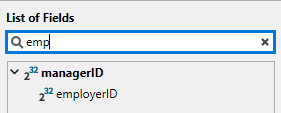
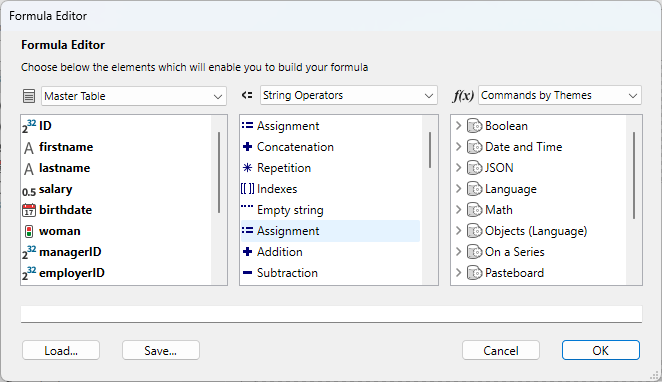
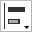
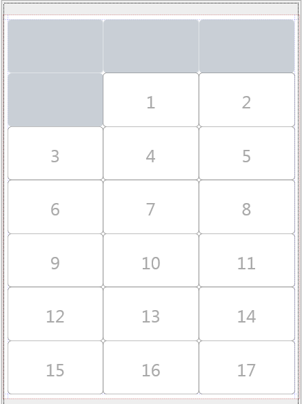
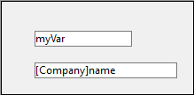

4Dのラベルエディターにより、さまざまなラベルを容易に印刷することができます。 ラベルエディターを使用し、次の操作を行うことができます:

- 宛名やファイルフォルダー、ファイルカードなど、その他数々のニーズに対応するラベルをデザインする。
- 装飾用のオブジェクトを作成し、ラベルテンプレートに挿入する。
- ラベルに使用するフォント、フォントサイズ、書体を指定する。
- 各ページの縦と横に印刷するラベル数を指定する。
- 各レコードにつき印刷するラベル数を指定する。
- ラベルページのマージンを指定する。
- 各ラベルまたは各レコードを印刷する際に実行するメソッドを指定する。
- プレビューを作成し、ラベルを印刷する。

:::note

ラベルは、[フォームエディター](../FormEditor/formEditor.md) を使用して作成することもできます。 変数を含むラベルや、フォームエディターの描画用ツールを利用する特殊なラベルを作成しそれらをラベルエディターや [`PRINT LABEL`](../commands-legacy/print-label.md) コマンドを使用して印刷したい場合には、フォームエディターを使用してください。

:::

ラベルエディターを使用して、ラベルの作成やフォーマット、印刷を行います。 ラベルエディター には、ラベルを設計したり、ラベル用紙上でのラベル位置を決めるための各種設定が用意されています。 例えば、宛名ラベルを作成する場合、1行目に相手先の 名字と名前、2行目にその人の住所を納めたラベルを設計することができます。 ラベルエディターでは、ページ上のラベル数を指定したり、ラベル用紙のマージ ンを指定することで、ラベルテキストがラベルの中央に配置されるようデザインを調整することができます。
ラベルデザインが完成したら、いつでも再利用できるようにディスクに保存することができます。

ラベルエディターは、次のように開きます:

- デザインモードでは、**ツール**メニュー、あるいは4Dツールバーにあるツールボタンのメニューから\*\*ラベル...\*\*を選択します。
 または
- アプリケーションモードでは、 [`PRINT LABEL`](../commands-legacy/print-label.md) コマンドを使用します。


ラベルページはラベルの内容を指定するために使用し、レイアウトページはページ上のラベルサイズや位置を指定するために使用します。


## ラベルページ

ラベルページには、ラベルのデザインやフォーマットを行うための設定があります。

### フィールドのリスト

カレントテーブルのフィールド名が階層リスト形式で表示されます。 そのテーブルが別のテーブルにリレートしている場合は、外部キーフィー ルドにプラス記号 (Windows) または矢印 (Macintosh) が表示されます。 リレートフィールドを展開すると、リレートテーブルのフィールドを表示することができます。 リレートテーブルのフィールドはインデント (字下げ) されます。 リストから右のラベルプレビューエリアにドラッグすると、フィールドをラベルテンプレートに追加できます。

:::note 注記

- クイックレポートエディターのフィールドリストには、非表示属性が設定されていないテーブルとフィールドだけが表示されます。
- [オブジェクト型](../Concepts/dt_object.md) のフィールドは、ラベルエディターではサポートされていません。

:::

この検索エリアでは入力した文字列を含むフィールドのみに表示を限定することができます:



### ラベルプレビューエリア

このエリアを使用して、ラベルに表示させるすべてのオブジェクトの配置を調整し、ラベルを設計します。 白い長方形は一つのラベルを表します(ラベルの大きさは [レイアウトページ](#レイアウトページ)) を指定できます)。ラベルにはフィールドをドラッグすることができます。

- ラベルにはフィールドをドラッグすることができます。
- 一つ目のフィールドの上に他のフィールをドロップする事で二つのフィールドを結合する事もできます。 これらは自動的にスペースで区切られます。<br/>
 <br/>
 **Shift** キーを押しながらドロップすると、改行で区切られます。 これによって、住所などの複数のフィールドにまたがるラベル(住所1、住所2など)を、住所が一行で済む場合にも無駄な余白行を作らずに作成する事ができることができます。
- **フォーミュラ** ツール  (あるいはコンテキストメニュー内の **ツール>フォーミュラ**) を選択しながらエリアを描画することで、ラベルにフォーミュラを追加することができます。 The **Formula editor** is then displayed:
 <br/>
 For example, you can apply a format to a field using the [`String`](../commands-legacy/string.md) command:<br/>

<br/>

:::note

Keep in mind that you can only enter methods that are "allowed" for the database in the Formula editor. Allowed methods depend on [project settings](../settings/security.md#options) and the [`SET ALLOWED METHODS`](../commands/set-allowed-methods.md) command.

:::

- You can drag and drop picture files as well as label files (".4lbp" files) from the desktop of the OS.

- To modify the area, double-click on the contents in order to switch to editing mode. When you double-click on fields or formulas, the **Formula editor** is displayed, allowing you to remove or modify items:
 

### Form to use

This drop-down list allows you to define a table form as a label template. The form chosen must be specially adapted to the creation of labels.
In this case, the label editor is partially disabled: only functions of the [Layout page](#layout-page) can be used — to allow you to configure the page based on the form. The image of the form selected is displayed in the label preview area.
When you use a form, 4D executes any form or object methods associated with it. When using this option, you can also designate a project method to execute for each record or label and then assignate variables (see [this example](#printing-labels-using-forms-and-methods-example) below). If you want to create your labels using the editor itself, you need to choose the **No Form** option.

:::note 注記

- You can restrict the forms listed in this menu by means of a [specific JSON file](#controlling-available-forms-and-methods).
- If the database does not contain any table forms, this menu is not displayed.

:::

### Graphic area commands

The graphic area of the editor includes both a tool bar and a context menu that you can use to design your label template.

The left-hand side of the tool bar includes commands for selecting and inserting objects. You can also access these tools by means of the **Tool>** command in the area's context menu.

| アイコン                                      | Tool name          | 説明                                                                                                                                                                                                                 |
| ----------------------------------------- | ------------------ | ------------------------------------------------------------------------------------------------------------------------------------------------------------------------------------------------------------------ |
|  | セレクション             | Click on a single object or draw a selection box around several objects. For a selection of non-adjacent objects, hold down **Shift** and click on each object you want to select. |
|  | Line creation      |                                                                                                                                                                                                                    |
|  | Rectangle creation | For Rectangle or Rounded rectangle.                                                                                                                                                                |
|  | Circle creation    |                                                                                                                                                                                                                    |
|  | Text insertion     | Draw a rectangle and enter text inside it. You can edit any text area, including those containing field references, by double-clicking it.                                         |
|  | Formula insertion  | Draw a rectangle to display the **Formula editor**, where you can define dynamic label contents (fields and formulas).                                                          |

There are shortcuts available to move or resize objects more precisely using the keyboard arrow keys:

- Keyboard arrow keys move the selection of objects 1 pixel at a time.
- **Shift** + arrow keys move the selection of objects 10 pixels at a time.
- **Ctrl** + arrow keys enlarge or reduce the selection of objects by 1 pixel.
- **Ctrl** + **Maj** + arrow keys enlarge or reduce the selection of objects by 10 pixels.

The right-hand side of the tool bar contains commands used to modify items of the label template:

| アイコン                                       | Tool name                  | 説明                                                                                                                                                                                                                                                                                                                                                               |
| ------------------------------------------ | -------------------------- | ---------------------------------------------------------------------------------------------------------------------------------------------------------------------------------------------------------------------------------------------------------------------------------------------------------------------------------------------------------------- |
|   | Fill Color                 | all color icons display the selected color                                                                                                                                                                                                                                                                                                                       |
|   | 線カラー                       |                                                                                                                                                                                                                                                                                                                                                                  |
|   | Lineweight                 |                                                                                                                                                                                                                                                                                                                                                                  |
|  | Font menu                  | Sets the font and its size, as well as the text style, color and alignment for the block(s) of selected text.                                                                                                                                                                                                                 |
|  | Alignment and distribution | Two or more objects must be selected for the alignment options to be available. "Distributing" objects means automatically setting the horizontal or vertical intervals between at least three objects, so that they are identical. The resulting interval is an average of all those existing in the selection. |
|  | Object level               | Moves objects to the front or back, or moves one or more objects up or down one level.                                                                                                                                                                                                                                                           |

## Layout Page

The Layout page contains controls for printing labels based on the requirements of your current print settings.


- **Labels Order**: Specifies whether labels should be printed in the direction of the rows or the columns.
- **Rows** and **Columns**: Set the number of labels to be printed by "row" and by "column" on each sheet. These settings determine the label size when the "Automatic resizing" option is enabled.
- **Labels per record**: Sets the number of copies to print for each label (copies are printed consecutively).
- **Print Setup...**: Sets the format of the page on which the sheet of labels will be printed. When you click this button, the setup dialog box for the printer selected in your system appears. By default, the sheet of labels is generated based on an A4 page in portrait mode.
 **Note:** The sheet created by the editor is based on the logical page of the printer, i.e. the physical page (for instance, an A4 page) less the margins that cannot be used on each side of the sheet. The physical margins of the page are shown by blue lines in the preview area.
- **Unit**: Changes the units in which you specify your label and label page measurements. You can use points, millimeters, centimeters, or inches.
- **Automatic resizing**: Means that 4D automatically calculates the size of the labels (i.e. the Width and Height parameters) according to the values set in all the other parameters. When this option is checked, the label size is adjusted each time you modify a page parameter. The Width and Height parameters can no longer be set manually.
- **Width** and **Height**: Sets the height and width of each label manually. They cannot be edited when the **Automatic resizing** option is checked.
- **Margins** (Top, Right, Left, Bottom): Sets the margins of your sheet. These margins are symbolized by blue lines in the preview area. Clicking on **Use printer margins** replicates, in the preview area, the margin information provided by the selected printer (these values can be modified).
- **Gaps**: Set the amount of vertical and/or horizontal space between label rows and columns.
- **Method**: Lets you trigger a specific method that will be run at print time. For example, you can execute a method that posts the date and time that each label was printed. This feature is also useful when you print labels using a dedicated table form, in which case you can fill variables from a method.
 To be eligible for label processing, a project method must comply with the following settings:
 - it must be "allowed" for the database (allowed methods depend on [project settings](../settings/security.md#options) and the [`SET ALLOWED METHODS`](../commands/set-allowed-methods.md) command), otherwise it will not be displayed in the **Apply** menu.
 - it must have the [Shared by components and host database](../Project/code-overview.md#shared-by-components-and-host-database) option.
  See also [this example](#printing-labels-using-forms-and-methods-example) below.

:::note

For advanced needs, you can restrict the list of methods available using a [specific json file](#controlling-available-forms-and-methods).
The **For each: Record or Label** options are used to specify whether to run the method once per label or once per record. This control has meaning only if you are printing more than one copy of each label and you are also executing a method at print time.

:::

- **Layout preview**: Provides a reduced view of how an entire page of labels will look, based on the dimensions you enter in the Label editor. The page preview also reflects the paper size selected in the Print Setup dialog box. You can also use this area to designate the first label on the page to be printed (this option only affects the first sheet in the case of multi-page printing). This can be useful, for example, when you want to print on a sheet of adhesive labels, part of which has already been used. You can also select the first label on the page to be printed by clicking on it:



## Printing labels using forms and methods (example)

You can use dedicated table forms and project methods to print labels with calculated variables. This simple example shows how to configure the different elements.

1. In a dedicated table form, add your label field(s) and variable(s).
 Here, in a table form named "label", we added the *myVar* variable:
 

2. Create a `setMyVar` project method with the following code:

```4d
 var myVar+=1
```

3. Set the project method as ["Shared by components and host database"](../Project/code-overview.md#shared-by-components-and-host-database).

4. Before displaying the Label editor, make sure the project method is allowed by executing this code:

```4d
 ARRAY TEXT($methods;1)
 $methods{1}:="setMyVar"
 SET ALLOWED METHODS($methods)
```

5. Open the Label editor and use your form:
 

6. In the Layout page, select the method:
 

Then you can print your labels:


## Controlling available forms and methods

The Label editor includes an advanced feature allowing you to restrict which project forms and methods (within "allowed" methods) can be selected in the dialog box:

- in the **Form to use** menu on the "Label" page and/or
- in the **Apply (method)** menu on the "Layout" page.

1. Create a JSON file named **labels.json** and put it in the [Resources folder](../Project/architecture.md#resources) of the project.
2. In this file, add the names of forms and/or project methods that you want to be able to select in the Label editor menus.

The contents of the **labels.json** file should be similar to:

```json
[ 
    {"tableId":2,"forms":[],"methods":["myMethod1","myMethod2"]},
    {"tableId":1,"forms":["Sample Label 1","Sample Label 2"],"methods":[]}
]
```

If no **labels.json** file has been defined, then no filtering is applied.

## Managing label files

4D allows you to save each label design in a file that you can open subsequently from within the wizard. By saving your label designs, you can build a label library adapted to your specific needs. Each label design stores the settings defined on the Label and Layout pages.

You can drag and drop label files from your desktop onto the label design area.

Label designs are managed using the **Load** and **Save** buttons of the tool bar.

- To load a label design, click on the **Load** button and designate the design you want to load by means of the File Open dialog box (if a label design is already present in the wizard, 4D replaces it by the one you have loaded).
- To save a label design, click on the **Save** button and indicate the name and location of the design to be created.

### File format

The file extension of 4D labels saved by the wizard is ".4lbp". Note that this format is open since it is written internally in XML.

### Preloading label files

The Label Wizard allows you to store label files within your application, so that label designs can be selected and opened by the user directly using the **Load** button.

To do this, you just need to create a folder named `Labels` within the [Resources folder](../Project/architecture.md#resources) of the project and then copy your label files into it:


:::note

Both standard ".4lbp" files and files generated by the former wizard (".4lb") files are supported.

:::

When the Label Wizard starts, if this folder is detected and contains valid label files, a pop-up icon is added to the **Load** button. Label designs can then be selected through a menu line:


