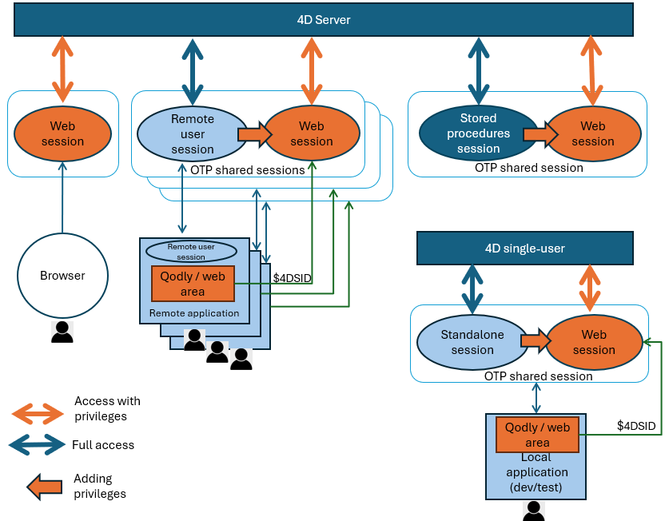

## 概要

デスクトップセッションとは、4D Server、4D リモートまたは4D シングルユーザー版のユーザー関連の実行コンテキストのうち、**Web やREST アクセスに起因するものではないもの**です。

デスクトップセッションには以下のような種類が含まれます:

- **リモートユーザー セッション**: クライアント/サーバーアプリケーションでは、リモートユーザーは、クライアントおよびサーバーから管理される独自のセッションを持ちます。
- **ストアドプロシージャーセッション**: クライアント/サーバーアプリケーションにおいては、サーバー上で実行される全てのストアドプロシージャーを管理する固有のバーチャルユーザーセッション。
- **スタンドアロンセッション**: シングルユーザーアプリケーション内で返されるローカルセッションオブジェクト(クライアント/サーバーアプリケーションの開発およびテストフェーズにおいて有用です)。

以下の図は、異なるセッションの種類とそれらがどのように関連するかを表しています:



[**Web ユーザーセッション**](../WebServer/sessions.md) 同様、デスクトップセッションで実行されたコードは[`Session`](../API/SessionClass.md) オブジェクトへのアクセスが可能で、これによって提供される関数やプロパティによって(例えば[`session.storage`](../API/SessionClass.md#storage) オブジェクトを使用することによって)セッションの値を保存したりユーザープロセス間で共有することが可能になります。

しかしながら、Web ユーザーセッション内で実行されたコードとは違い、デスクトップセッション内で実行されたコードは[ロールと権限](../ORDA/privileges.md)によっては管理されません。 これはORDA やデータモデルクラスを含め、4D アプリケーションのあるゆる箇所にアクセスすることが可能です(4D Server では、[ユーザーとグループ機能](../Users/handling_users_groups.md) を使用してユーザーアクセスを管理することができます)。 また、デスクトップセッションは[スケーラブルセッション](../WebServer/sessions.md#enabling-web-sessions) を有効化する必要がないという点に注意してください。

それでも、[リモートセッションをWeb セッションと**共有** すること](#sharing-a-remote-session-for-web-accesses) ことができ、これによってデスクトップアプリケーションのユーザーは、具体的には**Qodly ページ**とWeb エリアを使用して、Web インターフェースを通して4D アプリケーションへとアクセスすることができます。

## リモートユーザーセッション {#remote-user-sessions}

クライアント/サーバーアプリケーションにおいては、ユーザーがサーバーに接続すると、**リモートユーザーセッションオブジェクト**が作成され、サーバーとクライアントの両方から利用可能になります。 これは両方のマシンにおいて [`Session`](../commands/session) コマンドで返されます。

このオブジェクトを扱うには、[`Session` クラス](../API/SessionClass.md) の関数とプロパティを使用します。

### サーバー側とクライアント側のユーザーセッションオブジェクトの比較{#comparing-server-side-and-client-side-user-session-objects}

コードが実行される場所に応じて、サーバー側またはクライアント側の `session` オブジェクトが利用可能です。 どちらのオブジェクトも似ていますが、以下の点で異なります:

- それぞれの[`.storage`](../API/SessionClass.md#storage) プロパティは同じオブジェクトではありません。 サーバー側のユーザーセッションの `.storage` で保管されている値は、クライアント側のユーザーセッションの `.storage` では利用できず、その逆もまた同様です。
- セキュリティ上の理由から、クライアント側のセッションからは、[権限](../ORDA/privileges.md) を**変更**する関数は実行できません([`setPrivileges()`](../API/SessionClass.md#setprivileges)、 [`clearPrivileges()`](../API/SessionClass.md#clearprivileges)、 [`promote()`](../API/SessionClass.md#promote)、 [`demote()`](../API/SessionClass.md#demote)、 [`restore()`](../API/SessionClass.md#restore))。 クライアント側でこれらの関数を呼び出した場合、エラーが生成されます。

:::note

権限を読み出す関数は、クライアント側とサーバー側の両方で呼び出すことが可能です([`getPrivileges()`](../API/SessionClass.md#getprivileges)、 [`hasPrivilege()`](../API/SessionClass.md#hasprivilege)、 [`isGuest()`](../API/SessionClass.md#isguest))

:::

### 効果

セッションのデータを管理して共有するには、リモートユーザー側の `session` オブジェクトを使用します。

それぞれの環境において、[セッションの `storage`](../API/SessionClass.md#storage) オブジェクトは同じユーザーセッションの全てのプロセス間で共有されます。 たとえばサーバー上では、クライアントがサーバーに接続する際にユーザー認証手続きを開始し、メールや SMS で送信されたコードをアプリケーションに入力させることができます。 次に、ユーザー情報をセッションの storage に追加し、サーバーがユーザーを識別できるようにします。 この方法により、4Dサーバーはすべてのクライアントプロセスのユーザー情報にアクセスできるため、ユーザーの役割に応じてカスタマイズされたコードを用意することができます。

それぞれの環境で、リモートユーザーオブジェクトを使用して、[OTP を作成](../API/SessionClass.md#createotp) したり [Web アクセス用にリモートセッションを共有する](#sharing-a-remote-session-for-web-accesses) することができます。

サーバー上では、リモートユーザーセッションに[権限を割り当てる](../API/SessionClass.md#setprivileges) こともでき、これにより [Web エリア内で実行中のQodly ページ](#sharing-a-remote-session-for-web-accesses) から来たセッションに対してそのアクセスをコントロールすることができます。

:::note

クライアント側では、二つの異なるローカルなストアレージオブジェクトが利用可能です:

- クライアントマシンの[`Storage`](../commands/storage) オブジェクト
- ユーザーリモートセッションの [`session.storage`](../API/SessionClass.md#storage) オブジェクト([`Session storage`](../commands/session-storage) コマンドからも返されます)。

:::

:::tip 関連したblog 記事

- [クライアント/サーバー接続とストアドプロシージャーに対応した新しい 4Dリモートセッションオブジェクト](https://blog.4d.com/ja/new-4d-remote-session-object-with-client-server-connection-and-stored-procedure/)。
- [Forget server-side wrappers, use 4D Sessions from the client](https://blog.4d.com/forget-server-side-wrappers-use-4d-sessions-from-the-client)

:::

### Webアクセスのためにリモートセッションを共有する{#sharing-a-remote-session-for-web-accesses}

リモートユーザーセッションを使用して、同じユーザーによるアプリケーションへのWeb アクセスを管理し、それによって[権限](../ORDA/privileges.md) を管理することができます。 これは、リモートマシン上で実行中の、 [Qodly pages](https://developer.4d.com/qodly/4DQodlyPro/pageLoaders/pageLoaderOverview) がインターフェースとして使用されているクライアント/サーバーアプリケーションにおいて特に有用です。 この構成では、アプリケーションは現代的なCSS ベースのWeb インターフェースを持ちながらも、統合されたクライアント/サーバーのパワーと単純さの恩恵に預かることができます。 このようなアプリケーションでは、Qodly ページは標準の4D [Web エリア](../FormObjects/webArea_overview.md)内で実行されます。

このような構成を製品において管理するためには、リモートユーザーセッションが必要です。 実は、リモート4D アプリケーションとWeb エリアにロードされたQodly ページの両方からリクエストが来る場合には、これらは同じセッション内で動作する必要があります。 リクエストがどこから来ているか(Web またはリモート4Dか)に関わらず、リモートクライアントとWeb ページが同じ[セッション storage](../API/SessionClass.md#storage) とクライアントライセンスを持つように、サーバー上においてリモートクライアントとWeb ページ間でセッションを共有するようにするだけです。

この場合、ユーザーがWeb アクセスに対して持っている権限を自動的に取得できるように、Web リクエストをWeb エリアから実行する前にセッション内に[権限](../ORDA/privileges.md) が設定されていなければなりません(例題参照)。 ただし権限はWeb から来るリクエストに対してのみ適用されるという点に注意してください。

:::note

権限は、サーバー上のリモートユーザーセッションからのみ設定可能です。 セキュリティ上の理由から、これらはクライアント側のリモートユーザーセッションから変更することはできません([サーバー側でのセッションオブジェクトとクライアント側でのセッションオブジェクトの比較](#comparing-server-side-and-client-side-user-session-objects) の章を参照してください)。

:::

共有セッションは [OTPトークン](../WebServer/sessions.md#session-token-otp) を通して管理されます。 リモートセッション用のOTP トークンを作成したあと、Qodly ページを格納しているWeb エリア(あるいは他の任意のWeb ブラウザ)から送られたWeb リクエストに(`$4DSID` パラメーター値を通して) トークンを追加することで、サーバー上のユーザーセッションを識別して、共有できるようにします。 Web サーバー側では、Web リクエストが $4DSID パラメーター内に *OTP id* を格納していた場合、そのOTP トークンに対応したセッションが使用されます。

:::note

[OTP 作成用のコード](../API/SessionClass.md#createotp) はサーバー側で実行するか、またはクライアント側で直接実行することができます(サーバー側で実行する場合は [`On Server Open Connection`](../commands/on-server-open-connection-database-method) データベースメソッドの例を使用することができます)。 しかしながら、Web セッションの `.storage` はサーバー側のユーザーセッションの `.storage` と共有され、また権限はサーバー上のユーザーセッションからのみ設定可能である点に注意してください。

:::

:::tip

開発およびテスト目的のためには、アプリケーションがシングルユーザー向けまたはクライアント/サーバー向けに設計されているかに関らず、Web アクセス共有に関連した全ての機能のコーディングとテストのために [スタンドアロンセッション](#standalone-sessions) を使用することができます。

:::

:::tip 関連したblog 記事

[Embed Qodly pages in a 4D web area without extra cost](https://blog.4d.com/share-your-4d-remote-client-session-with-web-accesses/)

:::

### 例題

フォーム内において、OTP を取得し、Web エリア内にQodly ページを開きます:

```4d
Form.otp:=getOTP

Form.url:="http://localhost/$lib/renderer/?w=Products&$4DSID="+Form.otp

WA OPEN URL(*; "QodlyPage"; Form.url)

```

*getOTP* プロジェクトメソッド(クライアント/サーバーで[**サーバー上で実行**](../Project/project-method-properties.md#execute-on-server) 付き):

```4d
// クライアント サーバー:
// ----------------
// セッションオブジェクトはサーバー上にあるため、メソッドはサーバー上で実行する必要がある
// セッションオブジェクトはクライアントでは常にNull
//

#DECLARE() : Text

return Session.createOTP()

```

"viewProducts" セッションに権限を付与するために使用されるコードは以下の通りになります:

```4d
// クライアント サーバー:
// ----------------
// セッションオブジェクトはサーバー上にあるため、メソッドはサーバー上で実行する必要がある
// セッションオブジェクトはクライアントでは常に Null 

Session.clearPrivileges() // セッションから古い権限を消去する
Session.setPrivileges("viewProducts")
```

## ストアドプロシージャーセッション {#stored-procedure-sessions}

サーバー上では、全ての[ストアドプロシージャー](https://doc.4d.com/4Dv20/4D/20/Stored-Procedures.300-6330553.ja.html) は同じバーチャルユーザーセッションを共有します。

### 効果

ストアドプロシージャーセッションのすべてのプロセス間でデータを共有するには、[`Session.storage`](../API/SessionClass.md#storage) 共有オブジェクトを使用できます。

### 利用可能性

ストアドプロシージャーの `session` オブジェクトは、次のいずれかから利用できます:

- [`Execute on Server`](../commands/execute-on-server) コマンドで呼び出されたプロジェクトメソッド
- ストアドプロシージャーから呼び出されたORDA [データモデル関数](../ORDA/ordaClasses.md)
- [`On Server Startup`](../commands/on-server-startup-database-method) と [`On Server Shutdown`](../commands/on-server-shutdown-database-method)などのデータベースメソッド。

## スタンドアロンセッション {#standalone-sessions}

スタンドアロンセッションとは、4D をローカルに使用している際に実行されるシングルユーザーセッションのことです。

### 効果

スタンドアロンセッションでも、Web セッションと [OTP 共有](#sharing-a-remote-session-for-web-accesses)を使用することでクライアント/サーバーアプリケーションの開発とテストを行うことができます。 スタンドアロンセッション内のコードでも、リモートセッションにおける `session` オブジェクトと同じように `session` オブジェクトを使用することができます。 スタンドアロンセッション内のコードでも、リモートセッションにおける `session` オブジェクトと同じように `session` オブジェクトを使用することができます。

### 利用可能性

スタンドアロンの `session` オブジェクトは4D アプリケーション上で実行される全てのメソッドとコードから利用することが可能です。


