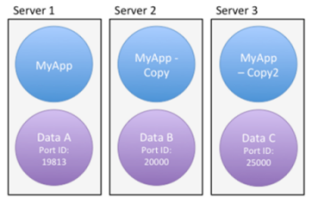

4Dでは、プロジェクトの設定について 2つの運用モードが提供されています:

- **標準** モード：すべての [設定](../settings/overview.md) は、[プロジェクトレベルの _settings.4DSettings_](../Project/architecture.md#sources) ファイルに保存され、すべてのケースに適用されます。 これはデフォルトのモードで、開発段階 (すべてのアプリケーション) に適しています。

- **ユーザー設定** モード：カスタム設定の一部は、[Settingsフォルダー](../Project/architecture.md#settings-ユーザー) (すべてのデータファイル用)、または [Dataフォルダー](../Project/architecture.md#settings-ユーザーデータ) (特定のデータファイル用) に置かれた _settings.4DSettings_ ファイルに保存され、ストラクチャー設定の代わりに使用されます。 このモードは、デスクトップアプリケーションの運用段階に適しています。 このモードは、設定の [セキュリティページ](../settings/security.md) にあるオプションを使用して有効にします。

ユーザー設定を定義することで、4D アプリケーションを更新しても、カスタム設定を保持できるようになります。あるいは、異なる場所に展開する同じアプリケーションに対し、異なる設定を適用することが可能になります。 また、設定ファイルの内容は XML で記述されるため、プログラムによる設定の管理もできるようになります。

4D は 2種類のユーザー設定を生成し使用することができます:

- **ユーザー設定**: これらのユーザー設定は、アプリケーションでどのデータファイルを開いたかにかかわらず、ストラクチャー設定の代わりに使用されます。
- **データファイル用のユーザー設定**: これらのユーザー設定は、アプリケーションで使用される各データファイルに対してそれぞれ関連づけられており、たとえばサーバーキャッシュのポートID などを設定します。

このオプションを使用すると、それぞれが異なる設定を持つデータファイルを複数使用する同じデスクトップアプリケーションのコピーを複数配布したりアップデートしたりすることが容易になります。

以下の設定の場合を考えてみましょう。とあるアプリケーションが複製され、それぞれで異なる設定 (ポートID) を使用します。 このユーザー設定がデータファイルとリンクしていた場合、ポートID を手動で変えることななくアプリケーションをアップデートすることができます:

## ユーザー設定の有効化

ユーザー設定を有効にするには、**設定** ＞ **セキュリティ** ＞ **外部ファイルのユーザー設定を有効にする** オプションを選択します:

このオプションをチェックすると、設定が 3つのダイアログに分けられます:

- **ストラクチャー設定**
- **ユーザー設定**
- **データファイル用のユーザー設定**

これらのダイアログボックスは、**デザイン** ＞ **設定** メニュー、あるいはツールバーの **設定** ボタンからアクセスできます:

これらのダイアログボックスは、[OPEN SETTINGS WINDOW](https://doc.4d.com/4dv19R/help/command/ja/page903.html) コマンドに適切な _settingsType_ セレクターを渡して使用することでもアクセスできます。

ストラクチャー設定ダイアログボックスは、標準の設定ダイアログと同じで、そのすべてのプロパティにアクセスできます (これらの設定はユーザー設定によってオーバーライドできます)。

## ユーザー設定とデータファイル用のユーザー設定

**ユーザー設定** と **データファイル用のユーザー設定** ダイアログボックスには、すべてのデータファイルまたは 1つのデータファイルに対して定義できる関連プロパティが含まれています:

**ユーザー設定** および **データファイル用のユーザー設定** ダイアログボックスに含まれる設定ページのリストと、標準設定との主な違いを以下の表にまとめます:

| **ストラクチャー設定のページ**                                                      | **ユーザー設定のページ**       | **データファイル用のユーザー設定のページ** |
| ---------------------------------------------------------------------- | -------------------- | ----------------------- |
| [一般ページ](../settings/general.md)                                        | N/a                  | N/a                     |
| [インターフェースページ](../settings/interface.md)                                | 標準設定と同じ              | 標準設定と同じ                 |
| [コンパイラーページ](../settings/compiler.md)                                   | N/a                  | N/a                     |
| [データベース/データストレージページ](../settings/database.md#データストレージページ)              | N/a                  | N/a                     |
| [データベース/メモリページ](../settings/database.md#メモリページ)                        | 標準設定と同じ              | 標準設定と同じ                 |
| [バックアップ/スケジューラーページ](../Backup/settings#スケジューラー)                        | N/a                  | 標準設定と同じ                 |
| [バックアップ/設定ページ](../Backup/settings#設定)                                  | N/a                  | 標準設定と同じ                 |
| [バックアップ/バックアップ＆復旧ページ](../Backup/settings#バックアップ復旧)                     | N/a                  | 標準設定と同じ                 |
| [クライアント-サーバー/ネットワークオプションページ](../settings/client-server.md#ネットワークオプション) | 標準設定と同じ              | 標準設定と同じ                 |
| [クライアント-サーバー/IP設定ページ](../settings/client-server.md#ip設定ページ)            | 標準設定と同じ              | 標準設定と同じ                 |
| [Web/設定ページ](../settings/web.md#設定)                                     | 標準設定と同じ              | 標準設定と同じ                 |
| [Web/オプション (I) ページ](../settings/web.md#オプション-i)     | 標準設定と同じ              | 標準設定と同じ                 |
| [Web/オプション (II) ページ](../settings/web.md#オプション-ii)   | 標準設定と同じ              | 標準設定と同じ                 |
| [Web/ログ (タイプ) ページ](../settings/web.md#ログ-タイプ)       | 標準設定と同じ              | 標準設定と同じ                 |
| [Web/ログ (バックアップ) ページ](../settings/web.md#ログ-バックアップ) | 標準設定と同じ              | 標準設定と同じ                 |
| [Web/Webサービスページ](../settings/web.md#webサービス)                           | メソッドプリフィクスオプションは使用不可 | メソッドプリフィクスオプションは使用不可    |
| [SQL ページ](../settings/sql.md)                                          | 標準設定と同じ              | 標準設定と同じ                 |
| [PHP ページ](../settings/php.md)                                          | 標準設定と同じ              | 標準設定と同じ                 |
| [セキュリティページ](../settings/security.md)                                   | N/a                  | N/a                     |
| [互換性ページ](../settings/compatibility.md)                                 | N/a                  | N/a                     |

このダイアログボックスの設定を編集した場合、それらの変更は対応する _settings.4DSettings_ ファイル (後述参照) または、_Backup.4DSettings_ ファイル (詳細は [バックアップ設定](../Backup/settings.md) ページ参照) に自動的に保存されます。

## `SET DATABASE PARAMETER` とユーザー設定

ユーザー設定の一部は [SET DATABASE PARAMETER](https://doc.4d.com/4dv19R/help/command/ja/page642.html) コマンドでも利用可能です。 ユーザー設定は、**2セッション間で設定を保持** プロパティが **Yes** になっているパラメーターです。

**ユーザー設定** 機能が有効化されている場合、[SET DATABASE PARAMETER](https://doc.4d.com/4dv19R/help/command/ja/page642.html) コマンドで編集されたユーザー設定はデータファイル用のユーザー設定に自動的に保存されます。

> `Table sequence number` は例外です。この設定値は常にデータファイル自身に保存されます。

## settings.4DSettings ファイル

データベース設定において [**外部ファイルのユーザー設定を有効にするオプション**をチェック](#ユーザー設定の有効化)した場合、ユーザー設定ファイルは自動的に作成されます。 これらのファイルの場所は、ユーザー設定の種類に応じて決まります。

### ユーザー設定

標準のユーザー設定ファイルは自動的に作成され、以下の場所にある Settingsフォルダー内に保存されます:

[`ProjectFolder/Settings/settings.4DSettings`](../Project/architecture.md#settings-ユーザー)

... _ProjectFolder_ は、プロジェクトストラクチャーファイルが格納されているフォルダーの名前です。

組み込みアプリケーションでは、ユーザー設定ファイルは以下の場所に配置されます:

- シングルユーザー版の場合: ProjectFolder/Database/Settings/settings.4DSettings
- クライアント‐サーバー版の場合: ProjectFolder/Server Database/Settings/settings.4DSettings

### データファイル用のユーザー設定

データファイルにリンクされているユーザー設定ファイルは自動的に作成され、以下の場所にある Settingsフォルダー内に保存されます:

[`Data/Settings/settings.4DSettings`](../Project/architecture.md#settings-ユーザーデータ)

... _Data_ は、アプリケーションのカレントデータファイルが格納されているフォルダーの名前です。

> データファイルがプロジェクトストラクチャーファイルと同階層に位置している場合、ストラクチャー用とデータ用のユーザー設定ファイルは同じ場所の同じファイルを共有します。 **データファイル用のユーザー設定...** メニューは表示されません。

:::note

設定ファイルは XMLファイルであり、4D の XMLコマンドや、XMLエディターを使用して読み込んだり変更したりすることができます。 つまり、特にコンパイルされて 4D Volume Desktop と組み込まれたアプリケーションにおいて、設定内容をプログラムで管理することが可能です。 このファイルをプログラムで編集した場合、変更内容が反映されるのはデータベース再起動後です。

:::

## 設定の優先順位

設定は 3つの階層に保存することが可能です。 ある階層で定義されたそれぞれの設定は、前のレベルで定義された設定を上書きします (あれば):

| **優先度**                  | **名称**                                                | **場所**                                                                                                                                                                            | **コメント**                                                              |
| ------------------------ | ----------------------------------------------------- | --------------------------------------------------------------------------------------------------------------------------------------------------------------------------------- | --------------------------------------------------------------------- |
| 3 (低) | ストラクチャー設定 (あるいは、"ユーザー設定" 機能無効時の設定) | Sourcesフォルダー内の _**settings.4DSettings**_ ファイル (プロジェクトモードデータベースの場合)、またはストラクチャーファイルと同階層にある Settingsフォルダー内 (バイナリーモードデータベースの場合) | ユーザー設定が有効化されていない場合の固有の保存位置。 アプリケーションの複製すべてに適用。                        |
| 2                        | ユーザー設定 (全データファイル)                  | プロジェクトフォルダーと同階層にある Settingsフォルダー内の _**settings.4DSettings**_ ファイル                                                                                                 | ストラクチャー設定を上書きします。 アプリケーションパッケージ内に保存されます。                              |
| 1 (高) | ユーザー設定 (カレントデータファイル)               | データファイルと同階層にある Settingsフォルダー内の _**settings.4DSettings**_ ファイル                                                                                                     | ストラクチャー設定とユーザー設定を上書きします。 その設定とリンクされたデータファイルがアプリケーションによって使用されたときにのみ適用。 |

ユーザー設定ファイルには関連した設定の一部しか含まれない一方、ストラクチャーファイルには、コア設定を含めたカスタム設定がすべて格納されているという点に注意してください。
