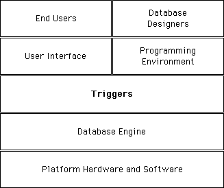

トリガーはテーブルに付属するメソッドであり、テーブルのプロパティです。トリガーを呼び出す必要はありません。テーブルレコードを操作 (追加、削除、修正) するたびに4Dのデータベースエンジンが自動的に呼び出します。まず簡単なトリガーを記述し、後からより洗練されたものにすることができます。

トリガーを使用すれば、データベースのレコードに対して "不正な" 操作が行われるのを防ぐことができます。偶発的なデータの紛失や改ざんを防ぎ、テーブル上での操作を制限することのできる非常に強力なツールです。例えば請求書システムにおいては、請求書の送付先である顧客を指定せずに誰かが請求書を追加するのを防止することができます。


<!-- INCLUDE triggers.vs-events.Desc -->


## トリガーのアクティブ化と作成

デザインモードでテーブルを作成したときには、デフォルトでテーブルにトリガーがありません。

テーブルのトリガーを使用するには、以下を実行する必要があります。

- トリガーをアクティブにし、4Dに対してトリガーをいつ起動すべきか知らせる。
- トリガー用のコードを記述する。

まだメソッドとして記述されていないトリガーをアクティブにする、あるいはトリガーをアクティブにしないでメソッドに記述しても、テーブルに対して実行される操作に影響を与えることはありません。

1. トリガをアクティブにする 
テーブルのトリガーをアクティブにするには、ストラクチャーの**インスペクタ**ーウィンドウでテーブルのトリガー オプション (データベースイベント) を選択しなければなりません。


2. トリガを作成する
テーブルのトリガーを作成するには、**エクスプローラー**を使用するか、ストラクチャーエディターのインスペクターウィンドウにある**編集...** ボタンをクリックするか、Alt (Windowsの場合) または Option (Mac OSの場合) キーを押して、ストラクチャーエディターのテーブルタイトルをダブルクリックしてください。


## トリガーの説明

### 既存レコード保存時  

このオプションを選択すると、テーブルのレコードが修正されるたびに、トリガーが起動します。
以下の場合にトリガーが起動します。

- データ入力時にレコードを修正する (デザインモード、 [`MODIFY RECORD`](../commands/modify-record)コマンド またはUPDATEコマンド等を使用) 。
- [`SAVE RECORD`](../commands/save-record)を使用して既存レコードを保存する。
- 既存レコードを保存するコマンドを使用する [`ARRAY TO SELECTION`](../commands/array-to-selection), [`APPLY TO SELECTION`](../commands/apply-to-selection)など) 。
- [`SAVE RECORD`](../commands/save-record) コマンドを呼び出すプラグインを使用する。

注: 最適化のため、ユーザーがレコードを保存したり[`SAVE RECORD`](../commands/save-record)コマンドでレコードが保存されたりする際、レコードのフィールドが全く変更されていなければ、トリガーは呼び出されません。トリガーを強制的に呼び出したいときは、フィールドに同じ値を代入します:

```4d
[thetable]thefield:=[thetable]thefield
```

:::

### レコード削除時 

このオプションを選択すると、テーブルのレコードが削除されるたびに、トリガーが起動します。
以下の場合にトリガが起動します。

- レコードを削除する (デザインモード、[`DELETE RECORD`](../commands/delete-record)コマンド、[`DELETE SELECTION`](../commands/delete-selection)コマンドまたはSQLのDELETEコマンドを使用する) 。
- リレートの削除制御オプションによって、リレート先レコードの削除を引き起こす何らかの操作を実行する。
- DELETE RECORDコマンドを呼び出すプラグインを使用する。

:::note

[`TRUNCATE TABLE`](../commands/trucate-table) コマンドはトリガーを呼び出しません。

:::

### 新規レコード保存時  

このオプションを選択すると、レコードがテーブルに追加されるたびに、トリガーが起動します。

以下の場合にトリガーが起動します。

- データ入力時にレコードを追加する(デザインモード、[`ADD RECORD`](../commands/add-record)コマンド または SQLのINSERTコマンド等を使用) 。
- [`CREATE RECORD`](../commands/create-record) や [`SAVE RECORD`](../commands/save-record)を使用してレコードを作成し、保存する。トリガーは[`SAVE RECORD`](../commands/save-record)を呼び出したときに起動します。レコードを作成したときではありません。
- レコードを読み込む (デザインモード、または読み込みコマンドを使用して) 。
- 新規レコードを作成または保存するコマンドを使用する ([`ARRAY TO SELECTION`](../commands/array-to-selection), [`SAVE RELATED ONE`](../commands/save-related-one)など) 。
- [`CREATE RECORD`](../commands/create-record) や [`SAVE RECORD`](../commands/save-record)コマンドを呼び出すプラグインを使用する。


## データベースイベント

トリガーは、前述の3つのデータベースイベントのいずれかに対して起動することができます。トリガー内で[`Trigger event`](../commands/trigger-event) 関数を呼び出すことによって、どのイベントが発生しているかを検出します。この関数はデータベースイベントを示す数値を返します。

一般的には、[`Trigger event`](../commands/trigger-event) から返される結果に関して、 [Case of](../Concepts/flow-control.md#case-ofelseend-case) ストラクチャーを用いて、トリガーを記述します。Trigger Events テーマの定数を使用できます。

```4d
  //トリガー用の[anyTable] テーブル
#DECLARE -> $result : Integer
var $event_l : Integer
$result:=0 // データベースリクエストが許可されると仮定する
$event_l:=Trigger event // データベースイベントを取得
 Case of
    :($event_l=On Saving New Record Event)
  // 新規に作成されたレコードの保存のために適切な動作 (アクション) を実行する
    :($event_l=On Saving Existing Record Event)
  // 既存のレコードの保存のために適切な動作を実行する
    :($event_l=On Deleting Record Event)
  // レコードの削除のために適切な動作を実行する
 End case
 ```


## トリガと関数  

トリガーには、2つの目的があります。

レコードが保存、削除される前に、レコードに対して動作 (アクション) を実行する。
データベース操作を許可または拒絶する。
.


### 動作を実行する   

[Documents] テーブルにレコードが保存 (追加または修正) されるたびに、作成時を示すタイムスタンプと最新の修正時を示すタイムスタンプでレコードを "マーク" したいとします。この場合、以下のようなトリガーを記述できます。


```4d
  //トリガー用の [Documents] テーブル
var $event_l : Integer
 $event_l:=Trigger event
 Case of
    :($event_l=On Saving New Record Event)
       [Documents]Creation Stamp:=Time stamp
       [Documents]Modification Stamp:=Time stamp
    :($event_l=On Saving Existing Record Event)
       [Documents]Modification Stamp:=Time stamp
 End case
```

:::note

この例題で使用している Time stamp 関数は、固定日付が任意に選択された時点から経過数秒を返す小さなプロジェクトメソッドです

:::

いったんこのトリガーを記述してアクティブにすると、ユーザーがどのような方法で [Documents] テーブルにレコードを追加または修正しても (データ入力、読み込み、プロジェクトメソッド、4Dプラグイン) 、レコードが最終的にディスクに書き込まれる前に、トリガーによって、[Documents]Creation Stamp フィールドと [Documents]Modification Stamp フィールドに自動的に日付が割り当てられます。


### データベース操作を許可または拒絶する   

データベース操作を許可または拒絶するために、トリガーは、戻り値 $result にトリガーエラーコードを返さなければなりません。


#### 例題 

[Employees] テーブルの場合を取り上げてみましょう。データ入力時に、[Employees]Social Security number フィールドで規則を強制します。確認ボタンをクリックする際に、ボタンのオブジェクトメソッドを使用してそのフィールドをチェックします。

```4d
  // bAcceptボタンのオブジェクトメソッド
 If(Good SS number([Employees]SS number))
    ACCEPT
 Else
    BEEP
    ALERT("Enter a Social Security number then click OK again.")
 End if

```
フィールド値が有効な場合、データ入力を受け入れます。フィールド値が無効な場合、警告を表示して、データ入力の状態になります。

[Employees] レコードをプログラムで作成した場合、以下のコードはプログラムとしては正当ですが、前述のオブジェクトメソッドで強制した規則に違反します。

```4d
  //プロジェクトメソッドから抽出する
  // ...
 CREATE RECORD([Employees])
 [Employees]Name:="DOE"
 SAVE RECORD([Employees]) ` <-- DB規則の違反! 保険証番号は保存されない!
  // ...
```

[Employees] テーブルのトリガーを使用して、データベースのすべてのレベルで[Employees]SS number の規則を強制することができます。トリガーは以下のようになります。

```4d
  // Trigger for [Employees]
 #DECLARE -> $result : Integer
 var $result : Integer
 $result:=0
 $dbEvent:=Trigger event
 Case of
    :(($dbEvent=On Saving New Record Event)|($dbEvent=On Saving Existing Record Event))
       If(Not(Good SS number([Employees]SS number)))
          $0:=-15050
       Else
  // ...
       End if
  // ...
 End case
```

いったんこのトリガーを記述しアクティブにすると、SAVE RECORD([Employees]) 行はデータベースエンジンエラー-15050を生成し、そのレコードは保存されません。

同様に4Dプラグインが無効な保険証番号で[Employees] レコードを保存しようとしても、トリガーは同じエラーを生成しレコードは保存されません。

トリガーを使用すれば、誰も (ユーザー、データベース設計者、プラグイン) 保険証番号の規則を故意にまたは偶発的に違反できないことが保証されます。

テーブルのトリガーが無くても、レコードを保存または削除しようとしているときに、データベースエンジンエラーが生じる場合があるので注意してくださ い。例えば、重複不可属性を持つインデックスフィールドで重複する値を持つレコードを保存しようとすると、エラー-9998が返されます。

したがって、エラーを返すトリガーは、新しいデータベースエンジンエラーをアプリケーションへ追加します。

4Dは "通常" エラー、すなわち重複不可のインデックス、リレーショナルデータのコントロールなどを管理します。
トリガーを使用して、開発者はアプリケーションに固有のカスタムエラーを管理できます。
**重要**: エラーコード値は任意のものを返すことができます。ただし、4Dデータベースエンジンによって既に確保されているエラーコードは使用できません。 -32000 から -15000 の間のエラーコードを使用することを強く勧めます。 -15000を超えるエラーコードは、データベースエンジン用に予約されています。

プロセスレベルでは、データベースエンジンエラーと同じ方法で、トリガーエラーを処理します。

4Dに標準のエラーダイアログボックスを表示させ、その後メソッドが停止します。
ON ERR CALLでインストールしたエラー処理メソッドを使用して、適切な方法でエラーから回復します。

:::note 注

- データ入力時に、レコードを受け入れまたは削除しようとしているときにトリガーエラーが返されると、エラーは重複不可なインデックスエラーのように処理されます。エラーダイアログが表示され、データ入力状態になります。デザインモード (アプリケーションモードでなく) でデータベースを使用する場合でも、トリガーを使用することのメリットが得られます。
- レコードのセレクションで動作しているコマンドのフレームワーク内のトリガーによってエラーが生成されると ([`DELETE SELECTION`](../commands/delete-selection), [`APPLY TO SELECTION`](../commands/apply-to-selection), [`ARRAY TO SELECTION`](../commands/array-to-selection)など)レコードは処理されず、自動的にLockedSet に登録されます(セット 参照)。コマンドは終わりまで実行が続けられ、このときエラーはキャッチされません。つまりエラーハンドリングメソッドは(あったとしても)呼び出されません。このコンテキストにおいて、エラーが生成されたかどうかを確認するためには、コマンドの呼び出しの直後にLockedSet をテストする必要があります。また、トリガでは、エラーをあとで適切に管理するためには、エラーコードを例えばコレクションなどに保存する必要があります。

:::


トリガーがエラーを返さないからといって ($result=0) 、データベース操作が成功したという意味ではありません。重複不可なインデックス違反が生じる場合があります。操作がレコードの更新である場合、レコードがロックされたり I/O エラーが生じたりすることがあります。トリガーの実行後にチェックが終了します。ただしプロセスを実行する高レベルにおいては、データベースエンジンまたはトリガーによって返されるエラーは同じものです。トリガーエラーはデータベースエンジンエラーです。


## トリガーと4Dアーキテクチャ    

トリガーはデータベースエンジンレベルで実行されます。以下の図にその様子をまとめています。



データベースエンジンが実際に配置されているマシンでトリガーは実行されます。これはシングルユーザー版の4Dでは明白です。4D Serverではクライアントマシンではなく、サーバーマシン (トリガーを起動させるプロセスの "対の" プロセスで) 上で動作しているプロセス内でトリガーは実行されます。

トリガーが起動される場合、トリガーはデータベース操作を実行しようとするプロセスのコンテキスト内で実行されます。トリガーの実行を引き起こすこのプロセスは**起動プロセス**と呼ばれます。
コンテキストに含まれるエレメントは、データベースが4Dのローカルモードで実行されたか、または4D Serverで実行されたかにより異なります。

4Dのローカルモードでは、トリガーは起動プロセスのカレントセレクション、カレントレコードテーブルの読み/書き状態、およびレコードロック操作を用いて動作します。
4D Serverでは、起動クライアントプロセスのデータベースのコンテキストのみが保持されます (ロックされたレコードやトランザクションの状態など) 。また4D Serverはトリガーのテーブルのカレントレコードが正確に配置されていることのみを保証します。コンテキストの他の要素 (例えばカレントセレクション) はトリガープロセスのものです。
4D環境の他のデータベースオブジェクトや言語オブジェクトは注意して使用してください。これは、トリガーが起動プロセスのマシンとは別のマシン上で実行される可能性があるためです。4D Serverがこれに当てはまります。

- **プロセス変数**: 各トリガーは独自のプロセス変数テーブルを持っています。トリガーは、トリガーを起動する元となったプロセスのプロセス変数にアクセスすることはできません。
- **ローカル変数**: トリガー内でローカル変数を使用できます。その有効範囲はトリガーの実行中です。ローカル変数はトリガーの実行のたびに作成され、削除されます。
- **セマフォー**: トリガー、(トリガーが実行されるマシン上の) ローカルセマフォーだけでなく、グローバルセマフォーもテスト、または設定できます。ただしトリガーは即座に実行されなければならないため、トリガー内か らセマフォーをテストまたは設定する場合には、十分な注意が必要です。
- **セットと命名セレクション**: トリガー内からセットまたは命名セレクションを使用する場合、トリガーが実行されるマシン上で作業することになります。クライアント/サーバーモードでは、クライアントマシン上で作成されるプロセスセットとプロセス命名セレクションは、トリガー内で可視です。
- **ユーザーインターフェース**: トリガー内でユーザーインターフェースエレメントを使用してないでください (警告、メッセージ、ダイアログボックスを使用しない) 。したがって、トリガーのトレースはデバッグウィンドウに限定する必要があります。クライアント/サーバーでは、トリガーは4D Server上で実行されることを覚えておいてください。サーバーマシン上で警告メッセージを表示しても、クライアント上のユーザーの助けにはなりません。起動プロセスにユーザインターフェースの処理も行わせるようにしてください。


4Dパスワードシステムを使用した場合、トリガー内で[`Current user`](../commands/current-user) コマンドを使用できることに注意して下さい。これを使用すると、例えばジャーナルを取っているテーブルのトリガー呼び出し元にユーザー名を保存することができます(クライアント・サーバーモードにおいても可能です)。


## トリガとトランザクション   

トランザクションは起動プロセスレベルで処理されなければなりません。トリガーレベルでトランザクションを管理してはいけません。一つのトリガーを実行してい る間に、複数のレコード (下記の例を参照) を追加、修正、削除する必要がある場合、最初にトリガー内から[`In transaction`](../commands/in-transaction)コマンド を使用して、起動プロセスが現在トランザクション内にあるかどうかテストしなければなりません。そうでない場合には、トリガーがロックされたレコードに出く わす可能性があります。そのため、起動プロセスがトランザクション内に無い場合は、レコードに対する操作を開始しないでください。起動プロセスに、実行し ようとしているデータベース操作はトランザクション内で実行されなければならないことを知らせるためにエラーを$0 に返すだけにしてください。そうしないとロックされたレコードに出くわした場合、起動プロセスにはトリガーの動作をロールバックする方法がなくなります。

注: 


:::note

トリガーとトランザクションを統合した操作を最適化するため、4Dでは[`VALIDATE TRANSACTION`](../commands/validate-transaction)を実行した後、トリガーは呼び出されません。これにより、トリガーの実行を2度繰り返すことを防ぎます。

:::

## トリガのカスケード   

以下の例のようなストラクチャーがあるとします。


注: 上記のテーブルは簡略化されています。実際には、テーブルにはここに示したよりも多くのフィールドがあります。

データベースがある請求書の削除を "許可" するとしましょう。そのような操作がトリガーレベルでどのように処理されるか検討してみます (プロセスレベルで削除を実行することも可能です) 。

リレートに関するデータの整合性を維持するには、請求書の削除において、[Invoices] のトリガー内で実行される以下の動作が必要となります。

[Customer] レコードにおいて、送り状の金額分だけ総売上フィールドの額を減らす。
- 送り状に関連したすべての [Line Items] レコードを削除する。
- これはまた、 [Line Items] トリガーが、削除された明細品目に関連した [Products] レコードの売り上げ数量フィールドの数量を減らすことを意味する。
- 削除された送り状に関連するすべての [Payments] レコードを削除する。

最初に、 [Invoices] のトリガーは、起動プロセスがトランザクション内にある場合に限り、これらの動作を実行しなければなりません。そのため、ロックされたレコードに出くわした場合にロールバックが可能になります。

次に、 [Line Items] のトリガーは、 [Invoices] のトリガーと**カスケー**ドしています。明細品目の削除は [Invoices] のトリガー内から`DELETE SELECTION`を呼び出した結果であるため、 [Line Items] のトリガーは [Invoices] のトリガーの実行の "範囲内で" 実行されます。

この例題にあるすべてのテーブルは、すべてのデータベースイベント対してアクティブなトリガーを持っているとします。トリガーのカスケードは以下のようになります。

- 起動プロセスが請求書を削除するため [Invoices] トリガーが起動される。
   - [Invoices] トリガーが総売上フィールドを更新するため、 [Customers] トリガーが起動される。
   - [Invoices] トリガーが明細品目を削除するため (繰り返し) 、[Line Items] トリガーが起動される。
      - [Line Items] トリガーが売上数量フィールドを更新するため、[Products] トリガーが起動される。
   - [Invoices] トリガーが支払を削除するため (繰り返し) 、[Payments] トリガーが起動される。

こ のカスケードの関係においては、[Invoices] のトリガーはレベル1で、 [Customers]、 [Line Items]、 と [Payments] のトリガーはレベル2で、そして [Products] のトリガーはレベル3で実行されていると言えます。

トリガー内から[`Trigger level`](../commands/trigger-level)コマンドを使用して、トリガーが実行されるレベルを検出します。更に[`TRIGGER PROPERTIES`](../commands/trigger-properties)コマンドを使用して、他のレベルに関する情報を入手することができます。

例えば、 [Products] レコードがプロセスレベルで削除されている場合、 [Products] のトリガーは、レベル3ではなく、レベル1で実行されます。

[`Trigger level`](../commands/trigger-level)と[`TRIGGER PROPERTIES`](../commands/trigger-properties)を使用すれば、動作の原因を検出できます。前述の例では、請求書がプロセスレベルで削除されています。[Customers] レコードをプロセスレベルで削除すると、 [Customers] のトリガーは、その顧客に関連するすべての請求書を削除しようとします。これにより、前述の例と同じように、 [Invoices] のトリガーが起動されることになりますが、起動される理由は異なります。[Invoices] トリガー内から、そのトリガーがレベル1で実行されたか、レベル2で実行されたかを、検出することができます。トリガーがレベル2で実行された場合には、次に、 それが [Customers] レコードが削除されたためであるかどうかをチェックできます。そうであれば、総売上フィールドの更新にわずらわされる必要はありません。


